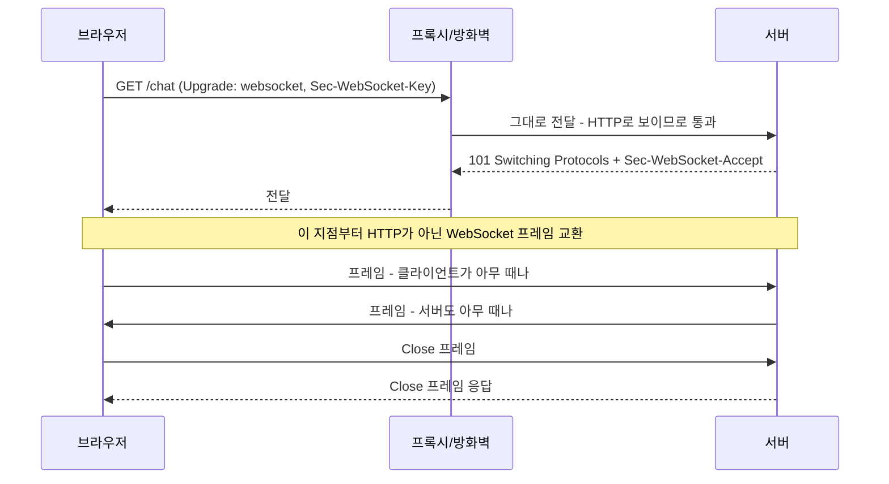
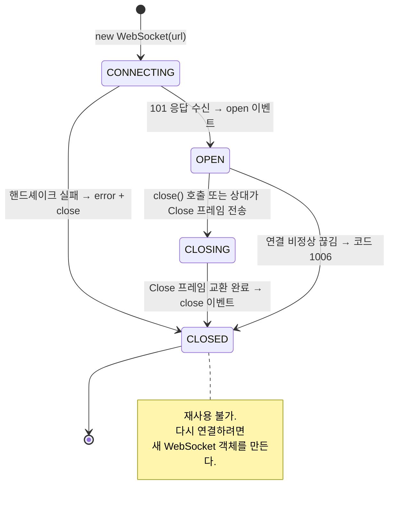
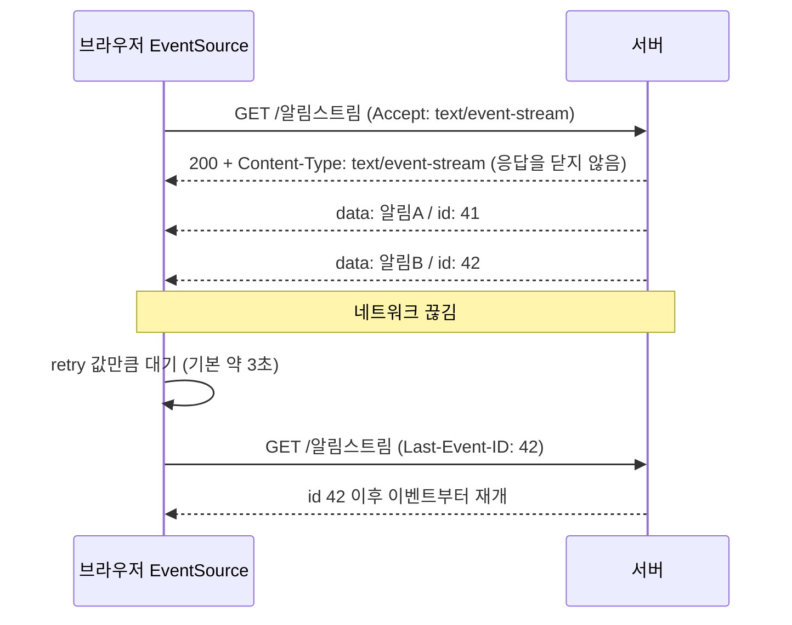

<Callout type="info">
  **이번 문서의 목표:** 이 파일을 다 읽으면 서버가 먼저 말을 거는 두 가지 방식의 내부 동작을 설명할 수 있고, 알림·채팅·실시간 대시보드 각각에 WebSocket과 SSE 중 무엇을 골라야 하는지 근거를 대고 결정할 수 있게 된다.
</Callout>

## 1. 문제 상황 — HTTP는 서버가 먼저 말을 걸 수 없다

지금까지 다룬 `fetch`는 모두 **클라이언트가 물어보면 서버가 답하는** 구조였습니다. HTTP의 근본 모델이 요청-응답이기 때문입니다. 그런데 채팅 메시지 도착, 주식 시세 변동, 다른 사용자의 문서 편집처럼 **서버 쪽에서 사건이 생기는** 기능은 이 모델에 맞지 않습니다. 서버는 브라우저에게 전화를 걸 수 없습니다.

가장 소박한 우회법이 **폴링**(polling, 주기적 확인)입니다. 1초마다 "새 소식 있나요?"를 물어보는 것이죠. 동작은 하지만 비용이 참혹합니다. 사용자 1만 명이 1초마다 물으면 서버는 초당 1만 건의 요청을 받는데, 그중 대부분의 답은 "없음"입니다. 게다가 매 요청마다 헤더와 쿠키가 왕복하므로, 실제 데이터보다 포장지가 더 무거워집니다. 그리고 최악의 경우 새 소식을 1초 늦게 받습니다.

개선안이 **롱 폴링**(long polling, 긴 확인)입니다. 서버가 요청을 받고도 바로 답하지 않고, 새 소식이 생길 때까지 응답을 붙들고 있는 방식입니다. 지연은 줄지만 연결 하나를 계속 점유하고, 응답이 한 번 나가면 클라이언트가 곧바로 다시 요청해야 하므로 여전히 왕복 비용이 남습니다.

> **쉽게 말하면:** 폴링은 **5분마다 우체통을 확인하러 나가는 것**, 롱 폴링은 **우체통 앞에서 편지가 올 때까지 기다렸다가 받고 다시 자리 잡는 것**, 그리고 앞으로 볼 두 기술은 **집에 인터폰을 설치하는 것**입니다.

브라우저 플랫폼은 이 문제에 두 가지 표준 답을 내놓았습니다. **WebSocket**(웹소켓)은 양방향 통로를 뚫고, **Server-Sent Events**(SSE, 서버 전송 이벤트)는 서버에서 클라이언트로 가는 한 방향 통로를 만듭니다.

## 2. WebSocket — HTTP로 시작해 HTTP를 벗어난다

### 왜 HTTP로 시작하는가

WebSocket은 완전히 새로운 프로토콜이지만, 연결은 **평범한 HTTP 요청으로 시작**합니다. 왜 이런 이상한 구조일까요?

현실의 네트워크에는 방화벽·프록시·로드밸런서가 잔뜩 있고, 이들은 대부분 80번과 443번 포트의 HTTP 트래픽만 통과시킵니다. 완전히 새로운 포트와 프로토콜을 쓴다면 회사 네트워크나 공용 와이파이에서 연결 자체가 막힙니다. 그래서 WebSocket은 **기존 HTTP 연결 위에서 시작해, 중간에 프로토콜을 갈아타는** 전략을 씁니다. 이 전환을 **업그레이드**(upgrade)라고 부릅니다.

### 핸드셰이크의 실제 내용

브라우저가 보내는 요청은 이렇게 생겼습니다.

```
GET /chat HTTP/1.1
Host: chat.example.com
Upgrade: websocket
Connection: Upgrade
Sec-WebSocket-Key: dGhlIHNhbXBsZSBub25jZQ==
Sec-WebSocket-Version: 13
Origin: https://www.example.com
```

서버가 동의하면 200이 아니라 **101 Switching Protocols**로 답합니다.

```
HTTP/1.1 101 Switching Protocols
Upgrade: websocket
Connection: Upgrade
Sec-WebSocket-Accept: s3pPLMBiTxaQ9kYGzzhZRbK+xOo=
```

이 순간부터 같은 TCP 연결 위로 HTTP가 아닌 **WebSocket 프레임**이 오갑니다. 요청도 응답도 없고, 양쪽이 아무 때나 메시지를 보낼 수 있는 **전이중**(full-duplex, 양방향 동시) 통신입니다.

여기서 `Sec-WebSocket-Key`와 `Sec-WebSocket-Accept`의 역할을 정확히 알아야 합니다. **이것은 보안 장치가 아닙니다.** 키는 무작위 값이고, 서버는 여기에 스펙에 고정된 문자열을 이어 붙여 SHA-1 해시를 구한 뒤 Base64로 인코딩해 돌려줍니다. 계산 방법이 공개되어 있으니 인증이 될 수 없습니다.

진짜 목적은 **"이 서버가 WebSocket을 진짜로 이해하는가"를 확인하는 것**입니다. 중간의 캐싱 프록시가 `Upgrade` 헤더를 모른 채 요청을 평범한 GET으로 처리하고 캐시된 응답을 돌려주는 사고를 막습니다. 계산된 `Accept` 값이 정확히 일치해야만 브라우저가 연결을 성립시키므로, WebSocket을 모르는 중간 장비는 절대 통과할 수 없습니다.



### 사용법과 상태 기계

```js
const 소켓 = new WebSocket("wss://chat.example.com/room/7");

소켓.addEventListener("open", () => {
  console.log("연결됨. readyState:", 소켓.readyState);   // 1 (OPEN)
  소켓.send(JSON.stringify({ 종류: "입장", 방: 7 }));
});

소켓.addEventListener("message", (e) => {
  const 메시지 = JSON.parse(e.data);      // 문자열 또는 Blob/ArrayBuffer
  화면에추가(메시지);
});

소켓.addEventListener("error", () => {
  // 보안상 상세 정보를 주지 않는다 — 원인 파악은 close 이벤트로
  console.warn("소켓 오류 발생");
});

소켓.addEventListener("close", (e) => {
  console.log("종료 코드:", e.code, "사유:", e.reason, "정상 종료:", e.wasClean);
});
```

`ws://`는 평문, `wss://`는 TLS로 암호화된 연결입니다. HTTPS 페이지에서 `ws://`를 열면 혼합 콘텐츠(mixed content)로 차단되므로 실무에서는 사실상 `wss://`만 씁니다.

`readyState`는 네 가지 값을 가집니다.

| 값 | 상수 | 의미 |
|----|------|------|
| 0 | `CONNECTING` | 핸드셰이크 진행 중 |
| 1 | `OPEN` | 통신 가능 |
| 2 | `CLOSING` | 종료 절차 진행 중 |
| 3 | `CLOSED` | 종료됨 또는 실패 |



<Callout type="warning">
  **자주 틀리는 점:** `readyState`를 확인하지 않고 `send()`를 부르는 것입니다. `CONNECTING` 상태에서 보내면 `InvalidStateError`가 발생하고, `CLOSING`이나 `CLOSED`에서는 조용히 버려집니다. 연결 직후 보낼 데이터는 반드시 `open` 이벤트 안에서 보내거나, 큐에 모아두었다가 열린 뒤 비워내야 합니다.
</Callout>

### 종료 코드 읽기

`close` 이벤트의 `code`는 원인을 알려주는 유일한 실마리입니다.

| 코드 | 의미 |
|------|------|
| 1000 | 정상 종료 |
| 1001 | 서버가 내려가거나 페이지를 떠남 |
| 1006 | 비정상 종료 – Close 프레임 없이 연결이 끊김 |
| 1008 | 정책 위반 |
| 1011 | 서버 내부 오류 |

**1006은 특별합니다.** 이 코드는 네트워크에서 전달된 값이 아니라, 브라우저가 "Close 프레임을 못 받고 끊겼다"고 판단해 스스로 붙이는 값입니다. 지하철에서 터널에 들어갔거나, 와이파이가 끊겼거나, 중간 장비가 유휴 연결을 정리했을 때 나타납니다. 실시간 앱에서 가장 자주 보게 될 코드이며, **재연결 로직이 반드시 처리해야 할 주인공**입니다.

또 `error` 이벤트는 의도적으로 아무 정보도 주지 않습니다. 실패 원인을 스크립트에 노출하면 다른 출처 서버의 존재 여부를 탐지하는 데 악용될 수 있기 때문입니다. 원인은 항상 뒤따르는 `close` 이벤트의 코드로 추론합니다.

### bufferedAmount — 보내기의 배압

`send()`는 즉시 반환하지만, 데이터가 실제로 전송되었다는 뜻은 아닙니다. 브라우저 내부 버퍼에 넣었을 뿐입니다. 네트워크가 느린데 계속 `send()`를 부르면 버퍼가 무한정 커져 메모리를 잡아먹습니다.

`소켓.bufferedAmount`는 **아직 네트워크로 나가지 못하고 버퍼에 남아 있는 바이트 수**입니다. 11편의 배압 개념이 여기서도 필요합니다.

```js
const 한계 = 1024 * 512;   // 512KiB

function 안전하게보내기(데이터) {
  if (소켓.readyState !== WebSocket.OPEN) return false;
  if (소켓.bufferedAmount > 한계) {
    return false;           // 밀려 있으면 이번 프레임은 건너뛴다
  }
  소켓.send(데이터);
  return true;
}
```

마우스 좌표나 센서 값처럼 **최신 값만 의미 있는 데이터**는 밀렸을 때 버리는 것이 옳습니다. 반대로 채팅 메시지처럼 유실되면 안 되는 데이터는 큐에 쌓고 버퍼가 비면 보내야 합니다.

### 자동 재연결은 없다 — 직접 만들어야 한다

`EventSource`와 달리 `WebSocket`에는 **재연결 기능이 없습니다.** 끊기면 끝입니다. 그래서 실무 코드는 반드시 재연결 계층을 씁니다. 10편에서 본 지수 백오프와 지터가 여기서도 그대로 적용됩니다.

$$
재연결대기 = \min(최대지연,\ 기본지연 \times 2^{실패횟수}) + 무작위값
$$

- $기본지연$ : 첫 재연결까지의 기준 시간. 보통 1초 안팎
- $2^{실패횟수}$ : 연속 실패할수록 두 배씩 늘어나는 배수
- $최대지연$ : 상한. 보통 30초 정도로 묶어 너무 오래 기다리지 않게 한다
- $무작위값$ : 동시 재연결 폭주를 흩뜨리는 난수

여기에 두 가지를 더 붙여야 실전에서 버팁니다.

1. **성공 시 실패 횟수 초기화**: 연결이 안정되었다고 판단되면(보통 열린 뒤 몇 초 유지) 카운터를 0으로 되돌립니다.
2. **하트비트**(heartbeat, 심장 박동): 중간 장비들은 일정 시간 데이터가 없는 연결을 조용히 끊습니다. 그런데 브라우저의 `WebSocket` API는 프로토콜 수준의 ping 프레임을 **직접 보낼 수 없습니다.** 그래서 애플리케이션 수준에서 주기적으로 작은 메시지를 주고받아 연결이 살아 있음을 알려야 합니다. 응답이 일정 시간 없으면 죽은 연결로 보고 스스로 닫고 재연결합니다.

<Callout type="warning">
  **자주 틀리는 점:** WebSocket에는 **CORS가 적용되지 않습니다.** 브라우저는 `Origin` 헤더를 보내주지만, 그것을 검사해 거부할 책임은 전적으로 서버에 있습니다. 서버가 `Origin`을 확인하지 않으면 아무 사이트나 사용자의 쿠키를 실어 소켓을 열 수 있습니다. 이를 교차 사이트 WebSocket 하이재킹이라 부르며, 서버는 `Origin` 검증과 별도 토큰 인증을 함께 두어야 합니다.
</Callout>

## 3. Server-Sent Events — 단방향이면 충분할 때

### 구조

알림, 실시간 대시보드, AI 응답 스트리밍처럼 **서버만 말하고 클라이언트는 듣기만 하는** 경우가 실제로는 훨씬 많습니다. 이럴 때 양방향 프로토콜은 과잉입니다.

SSE는 프로토콜을 새로 만들지 않습니다. **끝나지 않는 하나의 HTTP 응답**입니다. 서버는 `Content-Type: text/event-stream`으로 응답을 열어두고, 사건이 생길 때마다 본문에 텍스트를 조금씩 덧붙입니다. 브라우저는 그 텍스트를 파싱해 이벤트로 바꿔줍니다.

```js
const 소스 = new EventSource("/알림스트림");

소스.addEventListener("message", (e) => {
  console.log("기본 이벤트:", e.data, "id:", e.lastEventId);
});

소스.addEventListener("주문완료", (e) => {   // 이름 붙은 이벤트
  console.log("주문 완료:", JSON.parse(e.data));
});

소스.addEventListener("error", () => {
  // 끊기면 브라우저가 알아서 재연결한다 — 보통 아무것도 하지 않아도 된다
  console.log("readyState:", 소스.readyState);   // 0=재연결중, 1=열림, 2=닫힘
});
```

### 전선 위의 텍스트 형식

서버가 보내는 본문은 사람이 읽을 수 있는 단순한 줄 기반 형식입니다. 필드 하나가 한 줄이고, **빈 줄 하나가 이벤트의 끝**을 뜻합니다.

```
data: 첫 번째 알림입니다

event: 주문완료
data: {"주문번호":1024,"금액":39000}
id: 87

: 이 줄은 주석입니다 — 연결 유지용으로도 쓰입니다

retry: 5000
data: 여러 줄로 된
data: 메시지는 줄바꿈으로 이어집니다
```

각 필드의 뜻은 이렇습니다.

- `data:` – 실제 내용. 여러 줄이면 줄바꿈 문자로 연결되어 `event.data`에 담깁니다.
- `event:` – 이벤트 이름. 생략하면 `message`입니다. 이 이름으로 `addEventListener`에 등록합니다.
- `id:` – 이벤트 식별자. 브라우저가 **마지막으로 받은 값을 기억**합니다.
- `retry:` – 재연결 대기 시간을 밀리초로 지정합니다. 서버가 클라이언트의 재시도 속도를 조절할 수 있습니다.
- `:` 로 시작하는 줄 – 주석. 내용은 무시되지만, 프록시가 유휴 연결을 끊지 않도록 주기적으로 보내는 하트비트로 활용됩니다.

### 자동 재연결과 Last-Event-ID — SSE의 결정적 장점

연결이 끊기면 `EventSource`는 **스스로 다시 연결합니다.** 개발자가 코드를 한 줄도 쓰지 않아도 됩니다. 그리고 재연결 요청에는 `Last-Event-ID`라는 헤더가 자동으로 붙어, **마지막으로 받은 `id` 값**을 서버에 알려줍니다.

서버는 이 값을 보고 "그 이후에 발생한 이벤트들"만 보내주면 됩니다. 즉 **유실 없는 이어받기**가 프로토콜 차원에서 설계되어 있습니다. WebSocket에서는 이 모든 것을 직접 구현해야 합니다.



### 제약도 분명하다

- **단방향입니다.** 클라이언트가 서버에 말하려면 별도의 `fetch`를 써야 합니다. 다만 이것이 큰 단점은 아닙니다 — 어차피 클라이언트에서 서버로 가는 요청은 HTTP로 잘 처리됩니다.
- **텍스트만 보낼 수 있습니다.** UTF-8 텍스트 형식이므로 바이너리는 Base64로 인코딩해야 하고, 그만큼 크기가 약 33퍼센트 늘어납니다.
- **HTTP/1.1에서는 연결 개수 제한에 걸립니다.** 브라우저는 한 도메인당 동시 연결을 보통 6개로 제한하는데, SSE가 그중 하나를 계속 점유합니다. 탭을 여러 개 열면 다른 요청이 막힐 수 있습니다. HTTP/2 이상에서는 하나의 연결에서 여러 스트림을 다중화하므로 이 문제가 사실상 사라집니다.
- **커스텀 헤더를 붙일 수 없습니다.** `EventSource` 생성자는 URL과 `withCredentials` 옵션만 받습니다. `Authorization` 헤더로 토큰을 보내는 방식이 불가능하므로, 쿠키 인증을 쓰거나 토큰을 쿼리 문자열에 담아야 합니다. 후자는 URL이 로그에 남는다는 위험이 있으니 주의해야 합니다.

## 4. 무엇을 고를 것인가

| 기준 | 폴링 | SSE | WebSocket |
|------|------|-----|-----------|
| 방향 | 단방향 – 클라이언트 요청 | 단방향 – 서버 → 클라이언트 | 양방향 |
| 프로토콜 | HTTP | HTTP | 업그레이드 후 전용 프로토콜 |
| 자동 재연결 | 해당 없음 | 내장 – `Last-Event-ID` 이어받기 | 없음 – 직접 구현 |
| 데이터 형식 | 자유 | UTF-8 텍스트만 | 텍스트와 바이너리 |
| CORS | 표준 CORS 적용 | 표준 CORS 적용 | 적용 안 됨 – 서버가 `Origin` 검증 |
| 압축·캐시 등 HTTP 기능 | 그대로 사용 | 그대로 사용 | 사용 불가 |
| 인프라 난이도 | 가장 낮음 | 낮음 | 높음 – 상태 유지 서버 필요 |
| 적합한 사례 | 갱신이 드문 상태 확인 | 알림, 시세, 진행률, 응답 스트리밍 | 채팅, 협업 편집, 게임 |

선택의 기준은 단순합니다. **클라이언트가 서버에 빈번하게, 낮은 지연으로 보내야 하는가?** 그렇다면 WebSocket입니다. 아니라면 SSE가 거의 항상 더 낫습니다 — 재연결과 이어받기를 공짜로 얻고, HTTP 생태계의 도구(프록시, 압축, 인증, 모니터링)를 그대로 쓸 수 있기 때문입니다.

> **쉽게 말하면:** WebSocket은 **전용 직통 회선**이고 SSE는 **구독한 라디오 방송**입니다. 방송만 들으면 되는데 직통 회선을 깔면, 회선 관리 비용을 전부 떠안게 됩니다.

## 5. 직접 만들어 보며 익히기

SSE의 전선 형식 파서와 재연결 백오프 계산은 서버 없이도 실험할 수 있습니다.

<CodePlayground
  template="vanilla"
  activeFile="/index.js"
  showConsole
  label="SSE 전선 형식 파서 직접 구현 + 재연결 백오프 계산 실험"
  files={{
    '/index.html': `<div id="app">
  <h3>파싱된 이벤트</h3>
  <pre id="출력" style="background:#f4f4f4;padding:12px;min-height:120px"></pre>
  <h3>재연결 대기 시간 시뮬레이션</h3>
  <pre id="백오프" style="background:#f4f4f4;padding:12px"></pre>
</div>`,
    '/index.js': `const 출력 = document.getElementById("출력");

// ---------- 1. 서버가 보낼 법한 원시 텍스트 ----------
const 전선텍스트 = [
  "data: 첫 번째 알림입니다",
  "",
  "event: 주문완료",
  "data: {\\"주문번호\\":1024,\\"금액\\":39000}",
  "id: 87",
  "",
  ": 이 줄은 주석 - 연결 유지용 하트비트",
  "",
  "retry: 5000",
  "data: 여러 줄로 된",
  "data: 메시지는 줄바꿈으로 이어집니다",
  "id: 88",
  "",
].join("\\n");

// ---------- 2. 스펙에 정의된 파싱 규칙을 그대로 구현한다 ----------
function SSE파싱(원문) {
  const 이벤트들 = [];
  let 이름 = "";
  let 데이터줄 = [];
  let 아이디 = null;
  let 재시도 = null;

  for (const 줄 of 원문.split("\\n")) {
    // 빈 줄 = 이벤트 하나의 끝 → 지금까지 모은 것을 발행한다
    if (줄 === "") {
      if (데이터줄.length > 0) {
        이벤트들.push({
          type: 이름 || "message",       // event 필드가 없으면 message
          data: 데이터줄.join("\\n"),      // 여러 data 줄은 줄바꿈으로 결합
          lastEventId: 아이디,
        });
      }
      이름 = "";
      데이터줄 = [];
      continue;
    }

    // 콜론으로 시작하면 주석 → 무시 (연결 유지 목적)
    if (줄.startsWith(":")) {
      console.log("주석(하트비트) 수신:", 줄.slice(1).trim());
      continue;
    }

    const 구분위치 = 줄.indexOf(":");
    const 필드 = 구분위치 === -1 ? 줄 : 줄.slice(0, 구분위치);
    let 값 = 구분위치 === -1 ? "" : 줄.slice(구분위치 + 1);
    if (값.startsWith(" ")) 값 = 값.slice(1);   // 콜론 뒤 공백 하나는 제거

    if (필드 === "event") 이름 = 값;
    else if (필드 === "data") 데이터줄.push(값);
    else if (필드 === "id") 아이디 = 값;         // 브라우저가 기억해 Last-Event-ID로 보냄
    else if (필드 === "retry") 재시도 = Number(값);
  }

  return { 이벤트들, 재시도 };
}

const { 이벤트들, 재시도 } = SSE파싱(전선텍스트);
이벤트들.forEach((이벤트, 순번) => {
  출력.textContent +=
    "#" + (순번 + 1) + "  type=" + 이벤트.type +
    "  id=" + 이벤트.lastEventId +
    "\\n     data=" + 이벤트.data + "\\n\\n";
  console.log("이벤트 발행:", 이벤트);
});
console.log("서버가 지정한 재연결 대기(retry):", 재시도, "ms");

// ---------- 3. WebSocket 재연결 백오프 계산 ----------
const 백오프출력 = document.getElementById("백오프");
const 기본지연 = 1000;
const 최대지연 = 30000;

for (let 실패 = 0; 실패 < 8; 실패 += 1) {
  const 지수 = Math.min(최대지연, 기본지연 * 2 ** 실패);
  const 지터 = Math.random() * 기본지연;
  const 최종 = Math.round(지수 + 지터);
  백오프출력.textContent +=
    실패 + "회 실패 → 기본 " + 지수 + "ms + 지터 " +
    Math.round(지터) + "ms = " + 최종 + "ms 대기\\n";
}
console.log("지터가 없으면 모든 클라이언트가 같은 시각에 몰려 서버를 다시 쓰러뜨립니다.");

// ---------- 4. WebSocket 상태 상수 확인 ----------
console.log("--- readyState 상수 ---");
console.log("CONNECTING:", WebSocket.CONNECTING);
console.log("OPEN      :", WebSocket.OPEN);
console.log("CLOSING   :", WebSocket.CLOSING);
console.log("CLOSED    :", WebSocket.CLOSED);`,
  }}
/>

실행할 때마다 지터 값이 달라지는 것을 확인하세요. 이 무작위성이 수천 대의 클라이언트가 동시에 재연결해 서버를 다시 무너뜨리는 사태를 막는 유일한 장치입니다.

## 6. 자주 틀리는 점 모음

<Callout type="warning">
  **① 연결이 열리기 전에 전송 시도.** `open` 이벤트가 오기 전에 `send()`를 부르면, 즉 `CONNECTING` 상태에서는 예외가 납니다. 큐를 두거나 `open` 안에서 보내세요.
</Callout>

<Callout type="warning">
  **② 재연결을 구현하지 않음.** WebSocket은 끊기면 그대로 끝입니다. 코드 1006은 일상적으로 발생합니다.
</Callout>

<Callout type="warning">
  **③ 재연결을 즉시·고정 간격으로 반복.** 서버가 잠시 내려간 사이 모든 클라이언트가 초당 한 번씩 두드리면 복구를 방해합니다. 지수 백오프와 지터가 필수입니다.
</Callout>

<Callout type="warning">
  **④ `bufferedAmount`를 무시하고 고빈도 전송.** 느린 네트워크에서 메모리가 계속 부풀어 오릅니다.
</Callout>

<Callout type="warning">
  **⑤ WebSocket에 CORS가 적용된다고 착각.** 서버가 `Origin`을 직접 검증하지 않으면 다른 사이트가 사용자의 쿠키로 소켓을 열 수 있습니다.
</Callout>

<Callout type="warning">
  **⑥ SSE에 `id`를 붙이지 않음.** `id`가 없으면 재연결 시 `Last-Event-ID`가 비어 서버가 어디서부터 보내야 할지 알 수 없고, 끊긴 동안의 이벤트가 유실됩니다.
</Callout>

<Callout type="warning">
  **⑦ 페이지를 떠날 때 정리하지 않음.** `beforeunload`나 화면 해제 시점에 `소켓.close()`·`소스.close()`를 호출하지 않으면 서버에 유령 연결이 남습니다.
</Callout>

## 핵심 정리

- HTTP는 서버가 먼저 말을 걸 수 없으므로 폴링·롱 폴링이라는 우회법이 쓰였고, 그 비용을 해결하려 WebSocket과 SSE가 만들어졌다.
- WebSocket은 HTTP 요청으로 시작해 **101 Switching Protocols**로 프로토콜을 갈아탄다. 이는 방화벽·프록시를 통과하기 위한 설계다.
- `Sec-WebSocket-Key`와 `Accept`는 보안이 아니라 **중간 장비와 서버가 WebSocket을 정말 이해하는지 확인**하는 장치다.
- `readyState`는 CONNECTING·OPEN·CLOSING·CLOSED 네 상태를 가지며, 닫힌 소켓은 재사용할 수 없다. 종료 코드 1006은 Close 프레임 없이 끊긴 비정상 종료를 뜻한다.
- `bufferedAmount`로 보내기 배압을 관리하고, 재연결·하트비트는 **직접 구현**해야 한다. WebSocket에는 CORS가 적용되지 않으므로 서버의 `Origin` 검증이 필수다.
- SSE는 끝나지 않는 하나의 HTTP 응답이며, 줄 기반 텍스트 형식과 빈 줄 구분자를 쓴다. **자동 재연결과 `Last-Event-ID` 이어받기**가 프로토콜에 내장되어 있다.
- 클라이언트가 서버에 빈번히 보내야 하면 WebSocket, 서버가 일방적으로 알리기만 하면 SSE가 거의 항상 더 낫다.

## 마무리 복습

<Quiz
  questionNumber={1}
  question="WebSocket 연결이 평범한 HTTP 요청으로 시작하는 이유로 가장 알맞은 것은?"
  options={['HTTP가 WebSocket보다 빠르기 때문에', '방화벽과 프록시가 대부분 HTTP 트래픽만 통과시키므로 기존 경로를 그대로 이용하기 위해', '브라우저가 다른 프로토콜을 지원하지 않기 때문에', 'HTTP 캐시를 활용하기 위해']}
  correctAnswer={2}
  explanation="새로운 포트와 프로토콜을 쓰면 회사 네트워크나 공용 와이파이에서 차단되기 쉽다. HTTP로 시작해 업그레이드하면 기존 인프라를 그대로 통과할 수 있다."
  optionExplanations={['속도 때문이 아니다', '정답 — 기존 인프라 통과가 핵심 동기다', '브라우저는 업그레이드 후 전용 프로토콜을 사용한다', '업그레이드 이후에는 HTTP 캐시를 쓸 수 없다']}
/>

<Quiz
  questionNumber={2}
  question="Sec-WebSocket-Key 와 Sec-WebSocket-Accept 의 실제 역할은?"
  options={['연결을 암호화해 도청을 막는다', '사용자를 인증한다', '서버와 중간 장비가 WebSocket을 실제로 이해하는지 확인해 잘못된 캐시 응답을 막는다', '메시지 순서를 보장한다']}
  correctAnswer={3}
  explanation="계산 방법이 스펙에 공개되어 있어 인증이나 암호화가 될 수 없다. 목적은 WebSocket을 모르는 프록시가 평범한 GET으로 처리해 캐시된 응답을 돌려주는 사고를 막는 것이다."
  optionExplanations={['암호화는 wss가 담당한다', '인증은 별도 토큰이나 쿠키로 해야 한다', '정답 — 프로토콜 이해 여부 확인이 목적이다', '순서 보장은 TCP가 담당한다']}
/>

<Quiz
  questionNumber={3}
  question="close 이벤트의 코드 1006이 의미하는 것은?"
  options={['서버가 정상적으로 연결을 종료했다', 'Close 프레임 없이 연결이 비정상적으로 끊겼으며 브라우저가 붙인 값이다', '정책 위반으로 서버가 거부했다', '클라이언트가 명시적으로 close 를 호출했다']}
  correctAnswer={2}
  explanation="1006은 네트워크로 전달된 값이 아니라, Close 프레임을 받지 못하고 끊겼을 때 브라우저가 스스로 붙이는 코드다. 이동 중 네트워크 전환이나 유휴 연결 정리에서 흔히 발생하므로 재연결 로직이 반드시 처리해야 한다."
  optionExplanations={['정상 종료는 1000이다', '정답 — 비정상 종료를 나타내는 로컬 코드다', '정책 위반은 1008이다', '명시적 종료는 보통 1000으로 표시된다']}
/>

<Quiz
  questionNumber={4}
  question="WebSocket의 bufferedAmount 속성을 확인해야 하는 이유는?"
  options={['수신한 메시지 개수를 세기 위해', 'send 로 넣었지만 아직 네트워크로 나가지 못한 바이트가 쌓여 메모리를 잠식하는 것을 막기 위해', '서버의 처리 속도를 측정하기 위해', '연결 지연 시간을 계산하기 위해']}
  correctAnswer={2}
  explanation="send는 즉시 반환하지만 실제 전송을 보장하지 않고 내부 버퍼에 넣을 뿐이다. 느린 네트워크에서 고빈도로 보내면 버퍼가 무한정 커지므로 임계값을 넘으면 전송을 건너뛰거나 큐잉해야 한다."
  optionExplanations={['수신과 무관한 송신 측 값이다', '정답 — 보내기 쪽의 배압 관리다', '서버 성능 측정 도구가 아니다', '지연 측정은 하트비트 왕복으로 한다']}
/>

<Quiz
  questionNumber={5}
  question="SSE에서 서버가 각 이벤트에 id 필드를 붙여야 하는 이유는?"
  options={['이벤트 이름을 구분하기 위해', '재연결 시 브라우저가 Last-Event-ID 헤더로 마지막 수신 지점을 알려 유실 없이 이어받기 위해', '데이터를 압축하기 위해', '이벤트 순서를 정렬하기 위해']}
  correctAnswer={2}
  explanation="브라우저는 마지막으로 받은 id를 기억했다가 재연결 요청에 Last-Event-ID 헤더로 실어 보낸다. 서버는 그 이후 이벤트만 보내면 되므로 끊긴 동안의 유실을 막을 수 있다."
  optionExplanations={['이벤트 이름은 event 필드가 담당한다', '정답 — 이어받기의 기준점이다', '압축과 무관하다', '순서는 전송 순서로 보장된다']}
/>

<Quiz
  questionNumber={6}
  question="SSE 전선 형식에서 이벤트 하나의 끝을 나타내는 것은?"
  options={['세미콜론', '빈 줄 하나', 'end 라는 필드', '연결 종료']}
  correctAnswer={2}
  explanation="SSE는 줄 기반 텍스트 형식이며 빈 줄이 하나의 이벤트 경계다. 그 시점까지 모인 data 줄들이 결합되어 하나의 이벤트로 발행된다."
  optionExplanations={['구분자로 쓰이지 않는다', '정답 — 빈 줄이 경계다', '그런 필드는 없다', '연결은 여러 이벤트 동안 유지된다']}
/>

<Quiz
  questionNumber={7}
  question="WebSocket과 CORS의 관계로 옳은 것은?"
  options={['일반 fetch와 동일한 CORS 검사가 적용된다', 'CORS가 적용되지 않으므로 서버가 Origin 헤더를 직접 검증해야 한다', 'preflight 요청이 먼저 전송된다', '동일 출처에서만 연결할 수 있다']}
  correctAnswer={2}
  explanation="브라우저는 핸드셰이크에 Origin 헤더를 넣어주지만 CORS 검사는 수행하지 않는다. 서버가 Origin을 검증하지 않으면 다른 사이트가 사용자의 쿠키로 소켓을 열 수 있는 하이재킹 위험이 있다."
  optionExplanations={['CORS 모델이 적용되지 않는다', '정답 — 검증 책임이 서버에 있다', 'preflight는 발생하지 않는다', '교차 출처 연결이 가능하다']}
/>

<Quiz
  questionNumber={8}
  question="서버가 일방적으로 알림만 내려주는 기능을 구현할 때 SSE가 WebSocket보다 유리한 이유로 보기 어려운 것은?"
  options={['자동 재연결과 이어받기가 프로토콜에 내장되어 있다', '일반 HTTP라 프록시와 압축, 인증 체계를 그대로 쓸 수 있다', '바이너리 데이터를 그대로 효율적으로 전송할 수 있다', '서버 구현과 인프라 부담이 상대적으로 낮다']}
  correctAnswer={3}
  explanation="SSE는 UTF-8 텍스트만 전송할 수 있어 바이너리는 Base64로 인코딩해야 하고 크기가 늘어난다. 바이너리 전송은 오히려 WebSocket의 장점이다."
  optionExplanations={['SSE의 대표적 장점이다', 'HTTP 생태계를 그대로 쓰는 것이 큰 이점이다', '정답(장점 아님) — 텍스트만 전송할 수 있다', '상태 유지 서버가 덜 까다롭다']}
/>

## 참고 자료

- [MDN - WebSockets API](https://developer.mozilla.org/en-US/docs/Web/API/WebSockets_API)
- [MDN - Server-sent events](https://developer.mozilla.org/en-US/docs/Web/API/Server-sent_events)
- [MDN - EventSource](https://developer.mozilla.org/en-US/docs/Web/API/EventSource)
- [HTML Living Standard - Server-sent events](https://html.spec.whatwg.org/multipage/server-sent-events.html)
- [HTML Living Standard - Web sockets](https://html.spec.whatwg.org/multipage/web-sockets.html)
- [RFC 6455 - The WebSocket Protocol](https://datatracker.ietf.org/doc/html/rfc6455)
