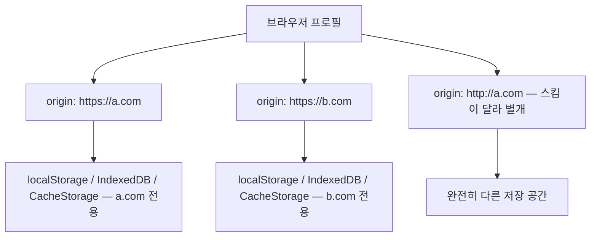
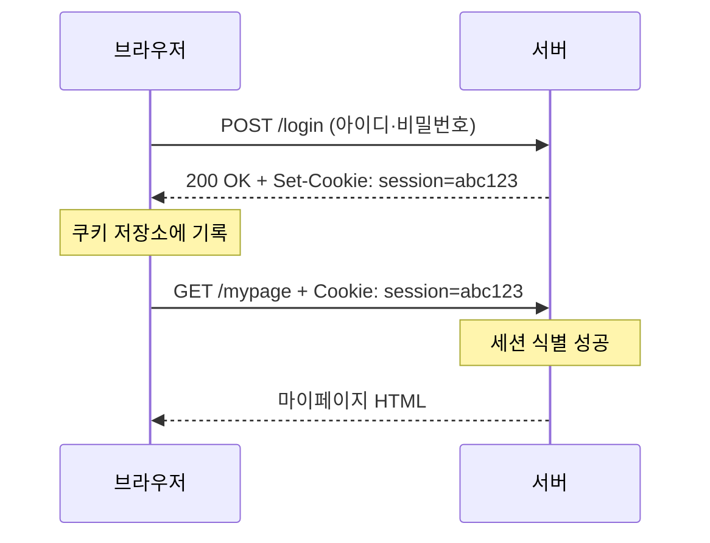
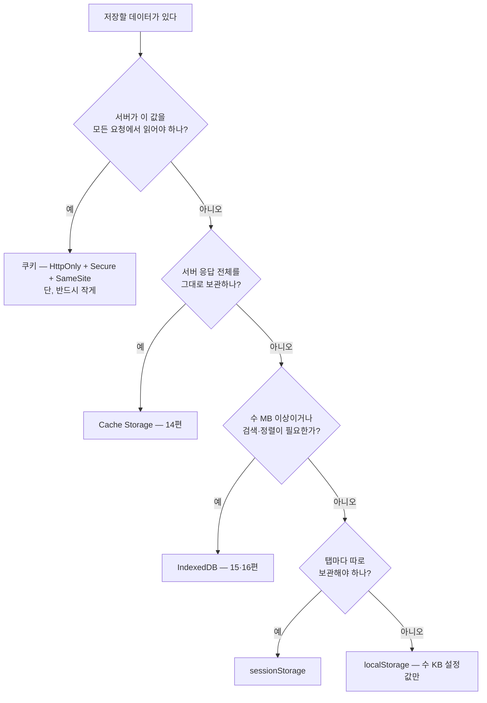

<Callout type="info">
  **이번 문서의 목표:** 이 파일을 다 읽으면 "이 데이터는 어디에 저장해야 하는가"라는 질문에 근거를 대며 답할 수 있고, origin 격리·용량 제한·동기 API의 블로킹 비용까지 설명할 수 있게 된다.
</Callout>

## 왜 저장소가 여러 개나 되는가

브라우저에는 데이터를 남기는 방법이 최소 다섯 가지 있습니다. 쿠키(cookie), `localStorage`, `sessionStorage`, IndexedDB, Cache Storage. 처음 보면 "왜 이렇게 많지, 하나로 통일하지"라는 생각이 듭니다.

이유는 단순합니다. **저장소마다 해결하려던 문제가 달랐고, 등장한 시기도 달랐기 때문**입니다. 쿠키는 1994년에 "서버가 브라우저를 알아보게 하려고" 태어났고, `localStorage`는 2009년에 "서버와 상관없이 클라이언트만의 설정을 남기려고" 태어났으며, IndexedDB는 "수십 MB짜리 구조화된 데이터를 메인 스레드를 막지 않고 다루려고" 태어났습니다. 목적이 다르니 설계도 다릅니다.

> **쉽게 말하면:** 저장소 선택은 "어느 게 더 좋은가"가 아니라 "이 데이터가 서버에 자동으로 딸려 가야 하는가, 얼마나 크고 복잡한가, 얼마나 오래 살아야 하는가"라는 세 가지 질문의 답입니다.

집으로 비유하면 이렇습니다. 쿠키는 **현관에 걸어 둔 출입증**입니다 — 밖에 나갈 때(서버 요청) 자동으로 목에 걸려 나갑니다. `localStorage`는 **책상 서랍의 메모지**입니다 — 밖에 나갈 때 따라가지 않고, 크기도 메모 수준입니다. IndexedDB는 **지하 창고의 서류함**입니다 — 크고, 색인이 있고, 꺼내려면 시간이 걸려 비동기로 접근합니다. Cache Storage는 **택배 상자 보관함**입니다 — 서버에서 받은 응답을 통째로 넣어 두는 곳입니다.

## 모든 저장소를 지배하는 하나의 경계: origin

### origin이란 무엇인가

저장소 이야기를 시작하기 전에 반드시 잡아야 할 개념이 있습니다. **오리진**(origin, 출처)입니다. 오리진은 세 가지 값의 묶음입니다.

- **스킴**(scheme, 프로토콜): `https`인지 `http`인지
- **호스트**(host, 도메인): `example.com`인지 `shop.example.com`인지
- **포트**(port): `443`인지 `8080`인지

이 셋 중 하나라도 다르면 **다른 오리진**입니다. `https://example.com`과 `http://example.com`은 스킴이 달라 남남이고, `https://example.com`과 `https://shop.example.com`도 호스트가 달라 남남입니다.

> **쉽게 말하면:** 오리진은 브라우저가 "이 데이터는 누구 것인가"를 판단하는 주민등록번호입니다.

브라우저의 거의 모든 저장소는 **오리진 단위로 완전히 격리**됩니다. `https://a.com`이 `localStorage`에 저장한 값은 `https://b.com`에서 읽을 수 없습니다. 같은 브라우저, 같은 디스크에 있어도 접근 자체가 불가능합니다. 이것을 **동일 출처 정책**(same-origin policy)이라고 부르며, 웹 보안의 가장 굵은 뼈대입니다. 이 정책이 없으면 아무 사이트나 여러분의 은행 사이트 저장소를 읽을 수 있게 됩니다.



<Callout type="warning">
  **자주 틀리는 점:** 쿠키만 이 규칙에서 살짝 벗어납니다. 쿠키의 격리 단위는 오리진이 아니라 **도메인 + 경로**입니다. 그래서 `http://a.com`에서 심은 쿠키를 `https://a.com`이 읽을 수 있고(`Secure` 속성이 없다면), `a.com`에서 `Domain=a.com`으로 심으면 `shop.a.com`도 읽습니다. 쿠키가 다른 저장소보다 보안 사고가 잦은 이유 중 하나가 바로 이 느슨한 경계입니다.
</Callout>

## 1. 쿠키 — 서버와 함께 쓰는 저장소

### 왜 쿠키인가

HTTP는 원래 **무상태**(stateless)입니다. 서버는 요청 하나를 처리하고 나면 그 브라우저를 잊어버립니다. 그런데 로그인은 "이 요청이 아까 로그인한 그 사람의 요청"임을 알아야 성립합니다. 이 간극을 메우려고 나온 것이 쿠키입니다.

동작은 간단합니다. 서버가 응답에 `Set-Cookie: session=abc123` 헤더를 실어 보내면, 브라우저는 그 값을 저장해 두었다가 **같은 도메인으로 가는 모든 요청에 `Cookie: session=abc123` 헤더를 자동으로 붙입니다.** 개발자가 코드를 쓰지 않아도 브라우저가 알아서 붙입니다.



이 "자동으로 딸려 간다"는 성질이 쿠키의 유일무이한 장점이자 최대 약점입니다. 장점은 서버가 값을 읽을 수 있다는 것이고, 약점은 **모든 요청마다 대역폭을 먹는다**는 것, 그리고 다른 사이트가 유도한 요청에도 딸려 가서 **CSRF**(Cross-Site Request Forgery, 사이트 간 요청 위조) 공격의 통로가 된다는 것입니다.

### 쿠키의 속성들 — 보안은 여기서 갈린다

쿠키는 값 하나가 아니라 여러 속성을 함께 갖습니다.

| 속성 | 의미 | 실무 기준 |
|------|------|-----------|
| `Expires` / `Max-Age` | 만료 시각 / 남은 초 | 없으면 브라우저 종료 시 삭제(세션 쿠키) |
| `Domain` | 어느 도메인까지 전송할지 | 지정하면 하위 도메인 포함 – 넓히지 말 것 |
| `Path` | 어느 경로 이하로 전송할지 | 기본 `/` |
| `Secure` | HTTPS 요청에만 전송 | 인증 쿠키는 사실상 필수 |
| `HttpOnly` | 자바스크립트에서 읽기 불가 | 세션 토큰에 필수 – XSS 탈취 방지 |
| `SameSite` | 다른 사이트발 요청에 붙일지 | `Lax` 기본, 민감하면 `Strict` |

특히 두 가지는 원리를 알아야 합니다.

**`HttpOnly`** 가 붙은 쿠키는 `document.cookie`로 읽을 수 없습니다. 왜 이게 중요할까요? **XSS**(Cross-Site Scripting, 사이트 간 스크립팅) 공격은 공격자의 스크립트를 여러분 페이지 안에서 실행시키는 공격인데, 그 스크립트의 첫 번째 목표가 대개 `document.cookie`입니다. `HttpOnly`가 붙어 있으면 스크립트가 실행돼도 토큰을 훔쳐 갈 수 없습니다. 즉 **자바스크립트가 접근할 수 없다는 것 자체가 기능**입니다.

**`SameSite`** 는 "다른 사이트에서 시작된 요청에도 이 쿠키를 붙일 것인가"를 정합니다. `Strict`는 절대 안 붙입니다. `Lax`는 사용자가 링크를 눌러 이동하는 최상위 내비게이션에만 붙입니다. `None`은 항상 붙이되 반드시 `Secure`와 함께여야 합니다. 공격자가 만든 페이지에 숨겨 둔 폼이 여러분 은행으로 요청을 보낼 때 쿠키가 딸려 가면 그게 CSRF인데, `SameSite=Lax`가 기본값이 되면서 이 공격면이 크게 줄었습니다.

<Callout type="warning">
  **자주 틀리는 점:** 쿠키를 "브라우저 저장소 중 하나"로만 보고 일반 데이터를 담는 경우가 있습니다. 쿠키에 담은 1KB는 그 도메인으로 가는 **모든 요청마다** 1KB씩 네트워크에 실립니다. 이미지 100개를 불러오면 100KB가 헛되이 올라갑니다. **서버가 읽어야 하는 값이 아니면 쿠키에 넣지 않는 것**이 원칙입니다.
</Callout>

## 2. Web Storage — localStorage와 sessionStorage

### 설계 의도

Web Storage는 "서버는 몰라도 되는, 이 브라우저만의 작은 설정"을 위한 저장소입니다. API는 극단적으로 단순합니다.

```js
localStorage.setItem("테마", "dark");
const 테마 = localStorage.getItem("테마"); // "dark"
localStorage.removeItem("테마");
localStorage.clear();
localStorage.length;        // 저장된 항목 수
localStorage.key(0);        // 0번째 키 이름
```

`localStorage`와 `sessionStorage`는 **API가 완전히 같고 수명만 다릅니다.**

- `localStorage` — 명시적으로 지우기 전까지 영구. 같은 오리진의 모든 탭이 공유.
- `sessionStorage` — **탭 단위**로(정확히는 브라우징 컨텍스트 단위로) 격리되고, 탭을 닫으면 사라짐.

`sessionStorage`의 탭 격리는 은근히 중요합니다. 같은 쇼핑몰을 두 탭에 띄우고 각각 다른 상품을 비교할 때, 진행 중인 입력값을 `sessionStorage`에 두면 두 탭이 서로를 덮어쓰지 않습니다. `localStorage`에 두면 서로 덮어씁니다.

### 직접 만져 보기

아래 실습기에서 값을 저장하고, 새로고침 버튼 대신 "다시 읽기"를 눌러 값이 살아 있는지 확인해 보세요. 문자열이 아닌 값을 넣으면 어떻게 되는지도 관찰 대상입니다.

<CodePlayground
  template="vanilla"
  activeFile="/index.js"
  showConsole
  label="localStorage의 문자열 강제 변환과 JSON 우회 — 콘솔을 보세요"
  files={{
    '/index.js': `// 1) 문자열이 아닌 값을 넣으면 어떻게 될까?
localStorage.setItem("횟수", 42);
const 읽은값 = localStorage.getItem("횟수");
console.log("읽은 값:", 읽은값, "/ 타입:", typeof 읽은값);
console.log("숫자 42와 같은가? ", 읽은값 === 42);

// 2) 객체를 그냥 넣으면 참사가 벌어진다
localStorage.setItem("사용자", { 이름: "지노", 등급: 3 });
console.log("객체를 그냥 저장한 결과:", localStorage.getItem("사용자"));

// 3) 그래서 반드시 JSON으로 직렬화한다
const 사용자 = { 이름: "지노", 등급: 3, 가입일: new Date("2024-01-01") };
localStorage.setItem("사용자", JSON.stringify(사용자));
const 복원 = JSON.parse(localStorage.getItem("사용자"));
console.log("복원된 객체:", 복원);
console.log("가입일의 타입:", typeof 복원.가입일, "— Date가 아니라 문자열!");

// 4) 없는 키를 읽으면 null (undefined 아님)
console.log("없는 키:", localStorage.getItem("존재하지않음"));

// 5) 대략적인 사용량 재보기
let 총글자수 = 0;
for (let i = 0; i < localStorage.length; i++) {
  const 키 = localStorage.key(i);
  총글자수 += 키.length + localStorage.getItem(키).length;
}
console.log("현재 오리진의 대략적 사용량(문자 수):", 총글자수);`,
  }}
/>

여기서 배울 점이 세 가지입니다.

1. **Web Storage는 문자열만 저장합니다.** 숫자 `42`를 넣으면 `"42"`가 되고, 객체를 넣으면 `"[object Object]"`라는 쓸모없는 문자열이 됩니다. 항상 `JSON.stringify` / `JSON.parse`를 거쳐야 합니다.
2. **JSON은 타입을 온전히 보존하지 못합니다.** `Date`는 문자열로, `undefined`인 속성은 사라지고, `Map`·`Set`·`ArrayBuffer`는 표현할 방법이 없습니다. 이것이 나중에 IndexedDB가 필요해지는 이유 중 하나입니다 — IndexedDB는 구조화 복제(structured clone)를 써서 `Date`, `Blob`, `Map`까지 그대로 저장합니다.
3. **없는 키는 `null`** 을 돌려줍니다. `undefined`가 아니므로 `if (값 === undefined)` 검사는 절대 참이 되지 않습니다.

### 동기 API라는 치명적 성질

Web Storage의 가장 중요한 특성은 API 모양이 아니라 **동기**(synchronous)라는 점입니다. `localStorage.getItem()`은 값을 즉시 반환합니다. 편해 보이지만, 그 편함의 정체는 이렇습니다.

`localStorage`의 데이터는 결국 디스크에 있습니다. 그런데 반환이 즉시 이뤄지려면, 디스크에서 값을 가져오는 동안 **자바스크립트 메인 스레드가 멈춰서 기다려야 합니다.** 메인 스레드가 멈추면 그동안 스크롤도, 클릭 반응도, 애니메이션도 전부 정지합니다. 데이터가 작을 때는 체감되지 않지만, 수 MB를 `JSON.parse`까지 해서 읽으면 수십에서 수백 밀리초짜리 프레임 드롭이 됩니다.

> **쉽게 말하면:** `localStorage`는 창구 직원이 한 명뿐인 은행에서, 서류를 창고에서 꺼내 오는 동안 뒤에 줄 선 손님 전부가 기다려야 하는 구조입니다.

여기에 더해, `localStorage`는 오리진 단위로 **모든 탭이 공유**하므로 브라우저는 탭 간 일관성을 지키려고 내부적으로 잠금을 씁니다. 한 탭의 큰 쓰기가 다른 탭까지 잠깐 굳게 만들 수 있습니다.

<Callout type="warning">
  **자주 틀리는 점:** "localStorage는 5MB니까 5MB까지는 마음껏 써도 된다"는 오해입니다. 용량 한도와 성능 한도는 다릅니다. 실무 기준은 **수 KB 수준의 설정값**입니다. 목록·캐시·오프라인 데이터처럼 커질 수 있는 것은 처음부터 IndexedDB로 가야 합니다.
</Callout>

### storage 이벤트 — 탭 간 동기화

`localStorage`가 바뀌면 **같은 오리진의 다른 탭들**에서 `storage` 이벤트가 발생합니다. 값을 바꾼 탭 자신에게는 발생하지 않습니다. 이 성질 덕분에 "한 탭에서 로그아웃하면 다른 탭도 로그아웃" 같은 동기화를 공짜로 구현할 수 있습니다.

```js
window.addEventListener("storage", (이벤트) => {
  // 이벤트.key, 이벤트.oldValue, 이벤트.newValue, 이벤트.storageArea
  if (이벤트.key === "로그인토큰" && 이벤트.newValue === null) {
    location.reload(); // 다른 탭에서 로그아웃했다
  }
});
```

다만 탭 간 통신이 목적이라면 요즘은 `BroadcastChannel`이 더 정직한 도구입니다. `storage` 이벤트는 어디까지나 저장의 부수 효과입니다.

## 3. quota — 얼마나 쓸 수 있는가

브라우저는 오리진마다 무한정 디스크를 내주지 않습니다. **쿼터**(quota, 할당량)라는 상한이 있습니다. 다만 이 값은 스펙에 고정된 숫자가 아니라 **브라우저가 남은 디스크 용량을 보고 동적으로 계산**합니다. 대략적인 감각은 이렇습니다.

- 쿠키: 도메인당 약 4KB × 개수 제한 (아주 작음)
- Web Storage: 오리진당 약 5MB (브라우저마다 다름, 문자 수 기준)
- IndexedDB · Cache Storage: 디스크 여유의 일정 비율 — 수백 MB에서 수 GB까지

현재 사용량과 한도는 Storage API로 물어볼 수 있습니다.

```js
const 정보 = await navigator.storage.estimate();
console.log(정보.usage, "바이트 사용 /", 정보.quota, "바이트 한도");
```

### 지워질 수 있다는 사실

여기서 많은 사람이 놓치는 지점이 있습니다. **브라우저 저장소는 영구 보장이 아닙니다.** 디스크가 부족해지면 브라우저는 오래 방문하지 않은 오리진의 저장소를 통째로 **축출**(evict)할 수 있습니다. 이 기본 상태를 "best-effort"라고 합니다.

정말 지워지면 안 되는 데이터라면 지속성 승격을 요청할 수 있습니다.

```js
const 승격됨 = await navigator.storage.persist();
// true면 persistent 모드 — 사용자가 직접 지우기 전까지 자동 축출되지 않음
```

브라우저는 이 요청을 무조건 들어주지 않습니다. 북마크 여부, 방문 빈도, 알림 권한 등 "사용자가 이 사이트를 아끼는가"의 신호를 보고 결정합니다.

<Callout type="warning">
  **자주 틀리는 점:** 브라우저 저장소를 서버 데이터베이스의 대체재로 취급하는 설계입니다. 사용자가 시크릿 창을 쓰거나, 브라우저 데이터를 지우거나, 기기를 바꾸면 전부 사라집니다. 브라우저 저장소는 **서버 데이터의 사본이나 캐시, 혹은 잃어도 되는 로컬 편의값**으로 설계해야 합니다.
</Callout>

## 4. 저장소 선택 결정 트리

지금까지의 내용을 하나의 판단 절차로 압축하면 이렇습니다.



표로 다시 정리하면 다음과 같습니다.

| 저장소 | 격리 단위 | 수명 | 용량 | API | 서버 전송 |
|--------|-----------|------|------|-----|-----------|
| 쿠키 | 도메인+경로 | 만료 시각까지 | 약 4KB | 동기, 문자열 | 자동 전송 |
| `localStorage` | 오리진 | 영구(축출 가능) | 약 5MB | 동기, 문자열 | 안 됨 |
| `sessionStorage` | 오리진+탭 | 탭 종료까지 | 약 5MB | 동기, 문자열 | 안 됨 |
| IndexedDB | 오리진 | 영구(축출 가능) | 수백 MB 이상 | 비동기, 구조화 복제 | 안 됨 |
| Cache Storage | 오리진 | 영구(축출 가능) | 수백 MB 이상 | 비동기, Response 객체 | 안 됨 |

### 실제 데이터로 대입해 보기

- **로그인 세션 토큰** → 쿠키. 서버가 읽어야 하고, `HttpOnly`로 스크립트 탈취를 막아야 합니다. `localStorage`에 토큰을 두는 방식은 XSS 한 방에 통째로 털립니다.
- **다크 모드 설정** → `localStorage`. 작고, 서버가 몰라도 되고, 다음 방문에도 남아야 합니다.
- **작성 중인 글 임시 저장** → 짧으면 `sessionStorage`, 길거나 이미지가 붙으면 IndexedDB.
- **오프라인용 상품 목록 3000건** → IndexedDB. 인덱스로 검색·정렬이 필요하고 크기도 큽니다.
- **앱 셸 HTML·CSS·JS 파일** → Cache Storage. 응답 객체 그대로 보관해 오프라인에 재생합니다.

## 핵심 정리

- 저장소는 목적이 달라서 여러 개다. 판단 기준은 **서버 전송 필요성, 크기·구조, 수명, 탭 격리 여부** 네 가지다.
- 거의 모든 저장소는 **오리진**(스킴+호스트+포트) 단위로 격리되지만, 쿠키만 도메인+경로라는 느슨한 경계를 가져 보안 사고가 잦다.
- 쿠키는 모든 요청에 자동으로 실리므로 작아야 하며, 인증용이면 `HttpOnly`·`Secure`·`SameSite`가 사실상 필수다.
- Web Storage는 **문자열만 저장하는 동기 API**라 메인 스레드를 블로킹한다. 용량 한도(5MB)가 아니라 성능을 기준으로 수 KB만 쓴다.
- quota는 디스크 여유에 따라 동적으로 정해지고, 브라우저는 오래 안 쓴 오리진의 데이터를 축출할 수 있다. 영구 보장이 필요하면 `navigator.storage.persist()`를 요청하되 거절될 수 있음을 전제한다.

## 마무리 복습

<Quiz
  questionNumber={1}
  question="다음 중 서로 다른 오리진(origin)으로 취급되어 저장소를 공유하지 않는 쌍은?"
  options={['https://a.com/login 과 https://a.com/mypage', 'https://a.com 과 http://a.com', 'https://a.com:443 과 https://a.com', 'https://a.com 의 첫 번째 탭과 두 번째 탭']}
  correctAnswer={2}
  explanation="오리진은 스킴, 호스트, 포트의 묶음이다. https와 http는 스킴이 다르므로 완전히 다른 저장 공간을 갖는다. 경로는 오리진 구성 요소가 아니고, https의 기본 포트는 443이므로 명시 여부는 차이를 만들지 않으며, 탭이 달라도 오리진은 같다."
  optionExplanations={['경로는 오리진 구성 요소가 아니므로 같은 오리진이다', '정답 — 스킴이 달라 별개의 저장 공간이다', 'https의 기본 포트가 443이므로 동일하다', 'localStorage와 IndexedDB는 오리진 단위라 탭이 달라도 공유된다']}
/>

<Quiz
  questionNumber={2}
  question="세션 토큰을 담는 쿠키에 HttpOnly 속성을 붙이는 가장 중요한 이유는?"
  options={['쿠키 용량 제한을 늘려 주기 때문', '자바스크립트에서 읽을 수 없게 만들어 XSS 공격 시 토큰 탈취를 막기 때문', 'HTTPS 연결에서만 전송되게 하기 때문', '다른 사이트발 요청에 쿠키가 붙지 않게 하기 때문']}
  correctAnswer={2}
  explanation="HttpOnly는 document.cookie로 접근할 수 없게 만든다. XSS로 스크립트가 실행되더라도 토큰을 읽어 갈 수 없다. HTTPS 전용 전송은 Secure, 다른 사이트발 요청 차단은 SameSite의 역할이다."
  optionExplanations={['용량과는 무관하다', '정답 — 스크립트 접근 차단 자체가 보안 기능이다', '그것은 Secure 속성의 역할이다', '그것은 SameSite 속성의 역할이다']}
/>

<Quiz
  questionNumber={3}
  question="localStorage에 숫자 42를 setItem으로 저장한 뒤 같은 키를 getItem으로 읽었을 때의 결과로 옳은 것은?"
  options={['숫자 42가 그대로 반환된다', '문자열 42가 반환되며 숫자 42와 일치 비교하면 false다', 'null이 반환된다', '저장 시점에 타입 오류가 발생한다']}
  correctAnswer={2}
  explanation="Web Storage는 값을 문자열로 강제 변환해 저장한다. 따라서 읽으면 문자열이 나오고 숫자와의 일치 비교는 false다. 객체를 넣으면 쓸모없는 문자열이 되므로 JSON 직렬화가 필요하다."
  optionExplanations={['Web Storage는 문자열만 저장한다', '정답 — 문자열로 변환되어 저장된다', 'null은 존재하지 않는 키를 읽을 때의 반환값이다', '오류 없이 조용히 문자열로 바뀌는 것이 오히려 함정이다']}
/>

<Quiz
  questionNumber={4}
  question="localStorage에 수 MB의 데이터를 넣고 매 페이지 로드마다 읽는 설계의 가장 큰 문제는?"
  options={['오리진 격리가 풀려 다른 사이트가 읽을 수 있다', '동기 API라 읽는 동안 메인 스레드가 멈춰 화면이 굳는다', '모든 HTTP 요청에 데이터가 함께 전송되어 대역폭을 낭비한다', '탭을 닫으면 데이터가 사라진다']}
  correctAnswer={2}
  explanation="Web Storage는 동기 API이므로 디스크 접근과 파싱이 끝날 때까지 메인 스레드가 블로킹된다. 오리진 격리는 유지되고, 요청에 자동 전송되는 것은 쿠키이며, 탭을 닫아도 localStorage는 남는다."
  optionExplanations={['오리진 격리는 크기와 무관하게 유지된다', '정답 — 동기 API의 블로킹 비용이 본질적 문제다', '자동 전송되는 것은 쿠키다', '탭 종료로 사라지는 것은 sessionStorage다']}
/>

<Quiz
  questionNumber={5}
  question="같은 사이트를 두 탭에 띄우고 각 탭에서 서로 다른 작성 중 내용을 유지하려 한다. 가장 적절한 저장소는?"
  options={['쿠키', 'localStorage', 'sessionStorage', 'Cache Storage']}
  correctAnswer={3}
  explanation="sessionStorage는 탭 단위로 격리되므로 두 탭이 서로를 덮어쓰지 않는다. 쿠키와 localStorage는 오리진 단위로 공유되어 서로 덮어쓰고, Cache Storage는 응답 객체 보관용이다."
  optionExplanations={['쿠키는 도메인 단위 공유라 탭 구분이 없다', 'localStorage는 모든 탭이 공유해 서로 덮어쓴다', '정답 — 탭 단위 격리가 요구사항과 정확히 맞는다', 'Cache Storage는 Response 객체를 보관하는 용도다']}
/>

<Quiz
  questionNumber={6}
  question="브라우저 저장소의 quota와 데이터 수명에 대한 설명으로 옳은 것은?"
  options={['quota는 스펙에 고정된 숫자이며 모든 브라우저에서 동일하다', '한 번 저장한 데이터는 사용자가 지우지 않는 한 절대 삭제되지 않는다', '기본은 best-effort라 디스크가 부족하면 브라우저가 오래된 오리진의 데이터를 축출할 수 있다', 'navigator.storage.persist()를 호출하면 항상 영구 저장이 보장된다']}
  correctAnswer={3}
  explanation="quota는 남은 디스크 용량 등을 근거로 브라우저가 동적으로 정하며, 기본 상태에서는 압박 시 축출될 수 있다. persist()는 요청일 뿐이며 브라우저가 사용자 관여도 신호를 보고 거절할 수 있다."
  optionExplanations={['브라우저마다 다르고 디스크 상황에 따라 달라진다', '축출과 사용자의 데이터 삭제 모두 가능하다', '정답 — best-effort가 기본 상태다', 'persist()는 거절될 수 있는 요청이다']}
/>

<Quiz
  questionNumber={7}
  question="storage 이벤트에 대한 설명으로 옳은 것은?"
  options={['값을 변경한 바로 그 탭에서 발생한다', '같은 오리진의 다른 탭에서 발생하며 key, oldValue, newValue를 제공한다', 'sessionStorage 변경 시 모든 탭에서 발생한다', '쿠키가 변경될 때도 동일하게 발생한다']}
  correctAnswer={2}
  explanation="storage 이벤트는 변경을 일으킨 탭이 아니라 같은 오리진의 다른 탭에서 발생하고, 어떤 키가 어떤 값에서 어떤 값으로 바뀌었는지를 담는다. 쿠키 변경은 이 이벤트를 발생시키지 않는다."
  optionExplanations={['변경을 일으킨 탭에서는 발생하지 않는다', '정답 — 탭 간 동기화에 활용할 수 있다', 'sessionStorage는 탭 단위라 다른 탭에 전파되지 않는다', '쿠키 변경은 storage 이벤트와 무관하다']}
/>

## 참고 자료

- [MDN - Web Storage API](https://developer.mozilla.org/en-US/docs/Web/API/Web_Storage_API)
- [MDN - HTTP cookies](https://developer.mozilla.org/en-US/docs/Web/HTTP/Guides/Cookies)
- [MDN - Storage API (StorageManager)](https://developer.mozilla.org/en-US/docs/Web/API/Storage_API)
- [HTML Living Standard - Web storage](https://html.spec.whatwg.org/multipage/webstorage.html)
