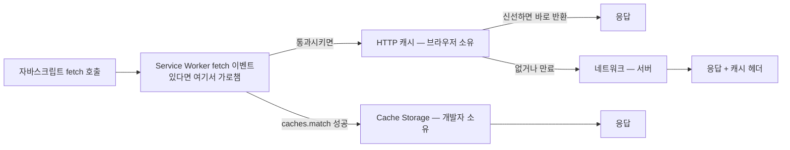
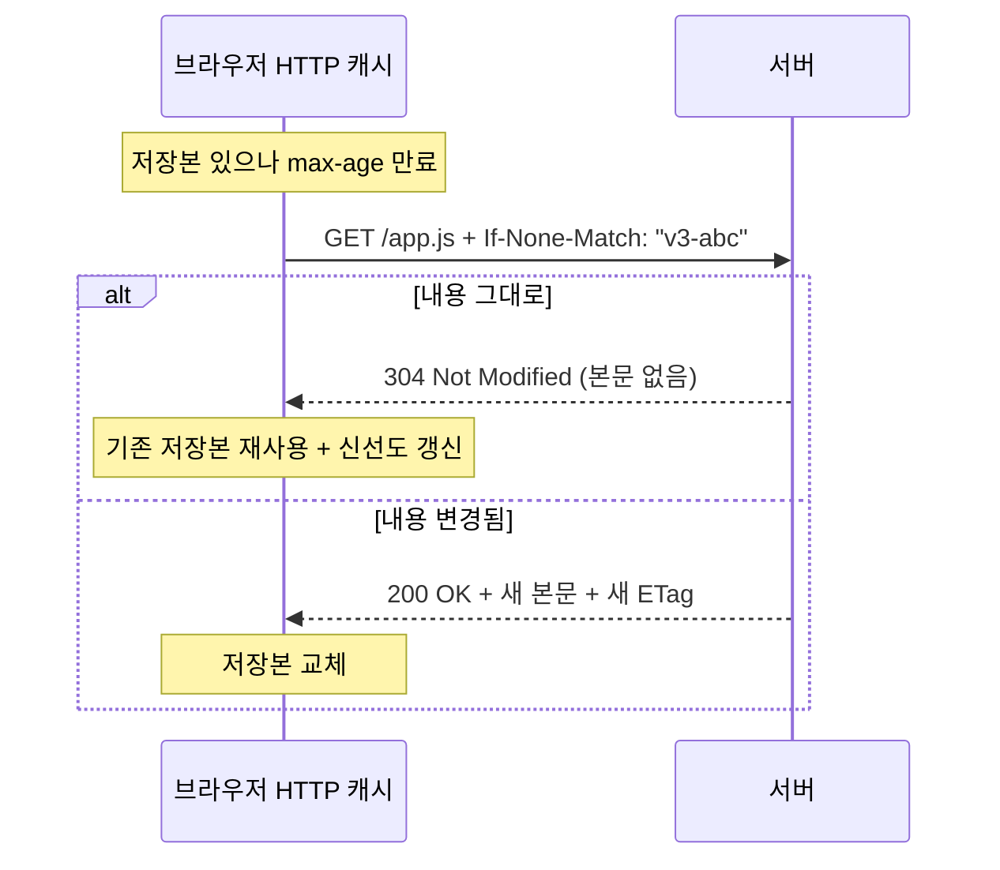
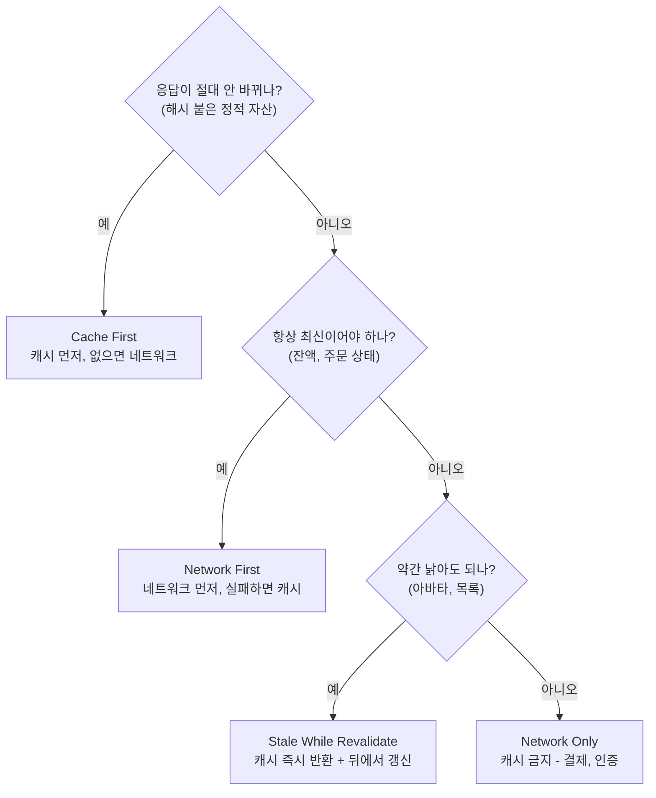

<Callout type="info">
  **이번 문서의 목표:** 이 파일을 다 읽으면 HTTP 캐시와 Cache Storage의 역할 분담을 설명할 수 있고, 캐시 키를 직접 설계해 오프라인·프리로드 전략을 코드로 짤 수 있게 된다.
</Callout>

## 캐시가 두 겹이라는 사실부터

브라우저에는 캐시가 하나가 아닙니다. 최소 두 층이 있고, 둘은 **주인이 다릅니다.**

- **HTTP 캐시** — 주인은 **브라우저**입니다. 서버가 보낸 `Cache-Control` 같은 헤더를 보고 브라우저가 알아서 저장하고 알아서 꺼냅니다. 개발자는 헤더로 "부탁"할 뿐, 내용을 직접 열어 보거나 특정 항목만 지울 수 없습니다.
- **Cache Storage** — 주인은 **개발자**입니다. 자바스크립트로 직접 넣고, 직접 찾고, 직접 지웁니다. 넣는 단위는 `Request` 객체를 키로, `Response` 객체를 값으로 하는 한 쌍입니다.

> **쉽게 말하면:** HTTP 캐시는 호텔이 알아서 관리하는 공용 냉장고이고, Cache Storage는 내 이름표를 붙여 내가 직접 채우고 비우는 개인 사물함입니다.

이 구분을 놓치면 "왜 새 파일을 배포했는데 옛날 게 나오지?" 같은 문제 앞에서 어느 층을 손봐야 할지 몰라 헤매게 됩니다.



이 그림에서 중요한 것은 **순서**입니다. Service Worker(19·20편)가 등록돼 있으면 `fetch` 호출은 먼저 Service Worker의 손을 거칩니다. 거기서 Cache Storage로 답해 버리면 HTTP 캐시도 네트워크도 아예 관여하지 않습니다. 즉 **Cache Storage가 HTTP 캐시보다 앞단**입니다.

## 1. HTTP 캐시 — 브라우저가 알아서 하는 층

### 신선도라는 개념

HTTP 캐시의 핵심 개념은 **신선도**(freshness)입니다. 서버가 응답을 내려보내면서 "이건 1년간 신선해"라고 말하면, 브라우저는 1년 동안 같은 URL 요청에 대해 **네트워크에 나가지도 않고** 저장본을 씁니다. 이 상태를 신선하다(fresh)고 하고, 기한이 지나면 낡았다(stale)고 합니다.

이 선언에 쓰이는 헤더가 `Cache-Control`입니다.

| 지시자 | 의미 | 쓰는 자리 |
|--------|------|-----------|
| `max-age=31536000` | 이 초 동안 신선함 | 해시가 붙은 정적 자산 |
| `no-cache` | 저장은 하되 쓸 때마다 서버에 확인 | HTML 문서 |
| `no-store` | 아예 저장 금지 | 민감한 개인정보 응답 |
| `immutable` | 신선한 동안 재검증조차 하지 마라 | 내용이 절대 안 바뀌는 파일 |
| `stale-while-revalidate=60` | 낡아도 60초는 일단 주고 뒤에서 갱신 | 자주 바뀌는 API 응답 |

<Callout type="warning">
  **자주 틀리는 점:** `no-cache`를 "캐시하지 마라"로 읽는 실수가 대단히 흔합니다. `no-cache`는 **저장은 하되 매번 신선한지 물어보라**는 뜻입니다. 진짜로 저장을 금지하는 것은 `no-store`입니다. 이름이 직관을 배신하는 대표적인 사례입니다.
</Callout>

### 재검증 — 낡았다고 바로 다시 받지는 않는다

기한이 지난 저장본이 있을 때 브라우저는 곧바로 파일 전체를 다시 받지 않습니다. 먼저 **재검증**(revalidation)을 시도합니다.

서버는 응답을 줄 때 `ETag: "v3-abc"`(내용의 지문) 또는 `Last-Modified`(마지막 수정 시각)를 함께 줍니다. 브라우저는 다음번에 `If-None-Match: "v3-abc"` 헤더를 붙여 물어봅니다. 내용이 그대로면 서버는 본문 없이 **`304 Not Modified`** 만 돌려주고, 브라우저는 갖고 있던 저장본을 씁니다. 1MB 파일이라도 오가는 데이터는 헤더 몇 백 바이트뿐입니다.



### 캐시 무효화라는 어려운 문제

컴퓨터 과학에 "어려운 문제는 캐시 무효화와 이름 짓기 두 가지"라는 오래된 농담이 있습니다. HTTP 캐시에는 "이 URL 캐시를 지워라"라는 명령이 **없습니다.** 개발자가 접근할 API 자체가 없습니다.

그래서 실무는 무효화를 포기하고 **URL을 바꾸는 방식**으로 우회합니다. 빌드할 때 파일 내용의 해시를 파일명에 박아 `app.a1b2c3.js`처럼 만들고, 여기에 `max-age=31536000, immutable`을 겁니다. 내용이 바뀌면 해시가 바뀌어 URL이 달라지므로 자연히 새 파일을 받습니다. 이 기법을 **캐시 버스팅**(cache busting)이라고 부릅니다.

정리하면 정적 자산의 정석 조합은 이렇습니다.

- `index.html` → `no-cache` (매번 확인해야 새 해시 파일명을 알 수 있으므로)
- `app.a1b2c3.js`, `style.d4e5f6.css` → `max-age=31536000, immutable`

## 2. Cache Storage — 개발자가 쥐는 층

### 왜 필요한가

HTTP 캐시만으로는 안 되는 일이 있습니다.

1. **오프라인.** 네트워크가 끊기면 HTTP 캐시가 신선한 항목을 갖고 있어도 브라우저 정책상 항상 살아나지는 않고, 무엇보다 "무엇이 캐시에 있는지" 개발자가 확인할 방법이 없습니다.
2. **선택적 삭제.** 로그아웃 시 특정 API 응답만 버리고 싶어도 HTTP 캐시에는 손댈 수 없습니다.
3. **프리캐싱.** 사용자가 아직 요청하지 않은 다음 페이지 자산을 미리 넣어 두려면, "미리 넣는" 명령이 있어야 합니다.

Cache Storage는 이 셋을 전부 코드로 다룰 수 있게 해 줍니다.

> **쉽게 말하면:** Cache Storage는 `Request`를 키로, `Response`를 값으로 가지는 **거대한 영구 Map**입니다.

### 기본 API 한 바퀴

전역 객체 `caches`가 **CacheStorage**이고, 그 안에 이름 붙은 `Cache` 객체가 여러 개 들어갑니다.

```js
// 이름으로 캐시 상자를 연다 (없으면 만든다)
const 캐시 = await caches.open("앱셸-v3");

// 1) 네트워크에서 받아 직접 넣기
await 캐시.add("/style.css");                       // 요청+저장 한 번에
await 캐시.addAll(["/", "/app.js", "/logo.svg"]);   // 여러 개 원자적으로

// 2) 이미 갖고 있는 Response를 넣기
const 응답 = await fetch("/api/상품목록");
await 캐시.put("/api/상품목록", 응답.clone());

// 3) 꺼내기 — 없으면 undefined
const 저장된 = await 캐시.match("/style.css");

// 4) 모든 캐시 상자를 가로질러 찾기
const 어디든 = await caches.match("/style.css");

// 5) 지우기
await 캐시.delete("/style.css");     // 항목 하나
await caches.delete("앱셸-v2");       // 상자 통째로

// 6) 목록
console.log(await caches.keys());    // ["앱셸-v3", ...]
```

`Cache` 객체에는 눈여겨볼 성질이 몇 가지 있습니다.

- **`match`는 실패해도 예외를 던지지 않고 `undefined`를 반환합니다.** 그래서 `if (저장된)` 형태의 분기가 자연스럽습니다.
- **`addAll`은 원자적입니다.** 목록 중 하나라도 실패하면 전부 롤백되어 아무것도 저장되지 않습니다. 앱 셸을 반쪽만 캐시해 버리는 사고를 막기 위한 설계입니다.
- **`add`·`addAll`은 응답 상태가 200번대가 아니면 거부합니다.** 404 페이지를 실수로 앱 셸로 캐시하는 사고를 막습니다. 반대로 `put`은 아무 응답이나 넣을 수 있으니 개발자가 직접 검사해야 합니다.
- **Cache Storage는 HTTP 캐시 헤더를 해석하지 않습니다.** `max-age`가 지났든 말든 `match`는 넣어 둔 것을 그대로 돌려줍니다. **만료 관리는 전적으로 개발자 책임**입니다.

### 왜 clone()이 필요한가

위 코드에서 `응답.clone()`이 눈에 걸렸을 겁니다. 이건 Fetch의 **본문 한 번만 소비 규칙**(11편) 때문입니다. `Response`의 본문은 스트림이고, 스트림은 한 번 읽으면 끝입니다. 캐시에 넣는 동작도 본문을 읽는 동작이므로, 넣고 나면 그 응답으로 `.json()`을 할 수 없습니다. 그래서 넣기 전에 복제해 두 갈래로 씁니다.

```js
const 응답 = await fetch("/api/상품목록");
캐시.put("/api/상품목록", 응답.clone()); // 사본은 캐시로
const 데이터 = await 응답.json();          // 원본은 화면으로
```

<Callout type="warning">
  **자주 틀리는 점:** `clone()`을 본문을 읽은 **뒤에** 호출하는 것입니다. 이미 소비된 응답은 복제할 수 없어 `TypeError`가 납니다. 복제는 반드시 **읽기 전에** 해야 합니다.
</Callout>

## 3. 캐시 키 설계 — 매칭 알고리즘을 알아야 한다

Cache Storage에서 가장 많이 나는 사고는 "분명히 넣었는데 `match`가 `undefined`를 준다"입니다. 원인은 대부분 **키의 정체를 오해**한 것입니다.

키는 문자열이 아니라 **`Request` 객체**입니다. 문자열을 넘기면 브라우저가 `new Request(문자열)`로 바꿔 줄 뿐입니다. 그리고 두 요청이 같은지는 기본적으로 다음 규칙으로 판단합니다.

1. **URL 전체가 같아야 합니다.** 쿼리 문자열 포함입니다. `/api/글?id=1`과 `/api/글?id=2`는 완전히 다른 키입니다.
2. **메서드는 `GET`만 저장 가능합니다.** `POST` 요청은 Cache Storage의 키가 될 수 없습니다. `POST`는 부수 효과가 있는 동작이라 캐시 개념 자체가 성립하지 않는다는 판단입니다.
3. **응답의 `Vary` 헤더가 고려됩니다.** 응답에 `Vary: Accept-Language`가 있으면, 저장할 때의 요청과 찾을 때의 요청이 `Accept-Language` 헤더까지 같아야 매칭됩니다.

이 규칙들이 불편할 때를 위해 `match`에 옵션이 있습니다.

```js
const 결과 = await 캐시.match(요청, {
  ignoreSearch: true,   // 쿼리 문자열 무시 — ?utm_source=... 대응
  ignoreMethod: true,   // 메서드 차이 무시
  ignoreVary: true,     // Vary 헤더 무시
});
```

### 캐시 이름에 버전을 넣는 이유

캐시 상자의 이름은 아무 문자열이나 됩니다. 그런데 실무에서는 거의 항상 `앱셸-v3`처럼 **버전을 이름에 박습니다.** 왜일까요?

Cache Storage에는 "전부 만료시켜라"라는 명령이 없기 때문입니다. 대신 배포할 때 이름을 `v3`에서 `v4`로 올리면, 새 코드는 `v4`라는 빈 상자에 새로 채우고, 이전 `v3` 상자는 통째로 지워 버리면 됩니다. 이것이 사실상 유일한 일괄 무효화 수단입니다.

```js
const 현재캐시들 = ["앱셸-v4", "이미지-v2"];

const 이름목록 = await caches.keys();
await Promise.all(
  이름목록
    .filter((이름) => !현재캐시들.includes(이름))
    .map((이름) => caches.delete(이름))
);
```

이 정리 코드는 Service Worker의 `activate` 이벤트에서 실행하는 것이 정석인데, 그 이유는 20편에서 라이프사이클과 함께 다룹니다.

### 브라우저에서 확인해 보기

Cache Storage는 Service Worker 없이 일반 페이지에서도 쓸 수 있습니다(단, 안전한 컨텍스트여야 하므로 HTTPS 또는 localhost). 아래 실습기에서 캐시를 만들고, 넣고, 매칭 규칙이 어떻게 동작하는지 확인해 보세요.

<CodePlayground
  template="vanilla"
  activeFile="/index.js"
  showConsole
  label="Cache Storage에 직접 넣고 꺼내며 매칭 규칙 확인하기 — 콘솔을 보세요"
  files={{
    '/index.js': `async function 실습() {
  if (!("caches" in window)) {
    console.log("이 환경에서는 Cache Storage를 쓸 수 없습니다 (안전한 컨텍스트 필요)");
    return;
  }

  // 1) 이름 붙은 캐시 상자를 연다
  const 캐시 = await caches.open("실습캐시-v1");
  console.log("캐시 상자 목록:", await caches.keys());

  // 2) 네트워크 없이 직접 만든 Response를 넣는다
  const 가짜응답 = new Response(
    JSON.stringify({ 이름: "지노", 등급: 3 }),
    { status: 200, headers: { "Content-Type": "application/json" } }
  );
  await 캐시.put("/api/사용자?id=1", 가짜응답);
  console.log("저장 완료: /api/사용자?id=1");

  // 3) 정확히 같은 URL로 찾으면 나온다
  const 찾음 = await 캐시.match("/api/사용자?id=1");
  console.log("정확 매칭 결과:", 찾음 ? await 찾음.clone().json() : undefined);

  // 4) 쿼리가 다르면 완전히 다른 키다
  const 못찾음 = await 캐시.match("/api/사용자?id=2");
  console.log("쿼리 다른 경우:", 못찾음); // undefined

  // 5) ignoreSearch를 켜면 쿼리를 무시하고 찾는다
  const 무시매칭 = await 캐시.match("/api/사용자?id=999", { ignoreSearch: true });
  console.log("ignoreSearch 사용:", 무시매칭 !== undefined);

  // 6) 저장된 키 목록은 Request 객체 배열이다
  const 키들 = await 캐시.keys();
  console.log("저장된 키:", 키들.map((요청) => 요청.method + " " + 요청.url));

  // 7) 뒷정리
  await caches.delete("실습캐시-v1");
  console.log("정리 후 목록:", await caches.keys());
}

실습().catch((오류) => console.log("오류:", 오류.name + " - " + 오류.message));`,
  }}
/>

## 4. 캐시 전략 네 가지

Cache Storage와 네트워크를 어떤 순서로 쓸지의 조합을 **캐시 전략**이라고 부릅니다. 네 가지가 사실상 전부입니다.



**Cache First**(캐시 우선)는 가장 빠릅니다. 캐시에 있으면 네트워크를 아예 안 씁니다. 대신 내용이 바뀌면 영원히 옛것을 보게 되므로, **URL에 해시가 붙은 불변 자산에만** 씁니다.

```js
async function 캐시우선(요청) {
  const 저장본 = await caches.match(요청);
  if (저장본) return 저장본;
  const 응답 = await fetch(요청);
  const 캐시 = await caches.open("정적-v1");
  캐시.put(요청, 응답.clone());
  return 응답;
}
```

**Network First**(네트워크 우선)는 항상 최신을 보여 주되, 네트워크가 죽었을 때 캐시로 살아남습니다. 오프라인 대응의 기본형입니다.

```js
async function 네트워크우선(요청) {
  try {
    const 응답 = await fetch(요청);
    const 캐시 = await caches.open("문서-v1");
    캐시.put(요청, 응답.clone());
    return 응답;
  } catch (오류) {
    const 저장본 = await caches.match(요청);
    if (저장본) return 저장본;
    throw 오류;
  }
}
```

**Stale While Revalidate**(낡은 것 주고 뒤에서 갱신)는 체감 속도와 신선도의 타협점입니다. 캐시본을 즉시 돌려주면서, 동시에 네트워크 요청을 걸어 다음번을 위해 캐시를 갱신합니다. 사용자는 항상 즉시 화면을 보고, 새로고침하면 최신이 됩니다.

```js
async function 낡은것먼저(요청) {
  const 캐시 = await caches.open("데이터-v1");
  const 저장본 = await 캐시.match(요청);
  const 갱신 = fetch(요청).then((응답) => {
    캐시.put(요청, 응답.clone());
    return 응답;
  });
  return 저장본 || 갱신;   // 있으면 즉시, 없으면 네트워크를 기다림
}
```

<Callout type="warning">
  **자주 틀리는 점:** 사용자별 응답을 공용 캐시 키로 넣는 것입니다. `/api/내정보`를 URL만 키로 캐시하면, 로그아웃 후 다른 계정으로 로그인했을 때 **이전 사용자의 데이터가 그대로 보입니다.** 인증이 얽힌 응답은 캐시하지 않거나, 사용자 식별자를 캐시 이름이나 키에 포함시키고 로그아웃 시 반드시 `caches.delete`로 지워야 합니다.
</Callout>

## 5. 두 층을 함께 설계하기

마지막으로 실무 감각을 정리합니다. 어느 층을 언제 쓸까요?

| 상황 | 담당 층 | 이유 |
|------|---------|------|
| 해시 붙은 JS·CSS | HTTP 캐시 (`immutable`) | 브라우저가 알아서 해 주는데 코드를 쓸 이유가 없다 |
| 오프라인에서도 떠야 하는 앱 셸 | Cache Storage | 네트워크 단절 시 확실히 보장해야 한다 |
| 로그아웃 시 지워야 하는 API 응답 | Cache Storage | 선택적 삭제가 가능한 유일한 층 |
| 다음 페이지 자산 미리 받기 | Cache Storage | 요청 없이 미리 넣는 명령이 필요하다 |
| 결제·인증 응답 | 어느 쪽도 아님 | `no-store` + 캐시 저장 금지 |

원칙은 이렇습니다. **브라우저가 이미 잘하는 일은 HTTP 캐시에 맡기고, 개발자가 시점과 목록을 통제해야만 하는 일에만 Cache Storage를 씁니다.** Cache Storage를 쓰는 순간 만료·정리·용량 관리라는 책임이 전부 개발자에게 넘어오기 때문입니다.

## 핵심 정리

- 브라우저 캐시는 두 층이다. **HTTP 캐시는 브라우저 소유**로 헤더로만 조종하고, **Cache Storage는 개발자 소유**로 코드로 직접 넣고 지운다.
- `no-cache`는 저장 금지가 아니라 매번 재검증하라는 뜻이고, 저장 금지는 `no-store`다. HTTP 캐시에는 무효화 API가 없어 파일명 해시로 우회한다.
- Cache Storage의 키는 `Request` 객체이며 URL 전체(쿼리 포함)가 일치해야 하고 `GET`만 저장된다. `ignoreSearch`·`ignoreVary` 옵션으로 완화할 수 있다.
- Cache Storage는 HTTP 캐시 헤더를 해석하지 않으므로 **만료 관리는 전적으로 개발자 몫**이며, 캐시 이름에 버전을 박아 통째로 교체하는 것이 사실상 유일한 일괄 무효화 수단이다.
- 전략은 Cache First(불변 자산), Network First(최신 필수), Stale While Revalidate(체감 속도), Network Only(민감 데이터) 네 가지 조합으로 정리된다.

## 마무리 복습

<Quiz
  questionNumber={1}
  question="HTTP 캐시와 Cache Storage의 가장 본질적인 차이는?"
  options={['HTTP 캐시는 용량이 크고 Cache Storage는 작다', 'HTTP 캐시는 브라우저가 헤더를 보고 자동 관리하고, Cache Storage는 개발자가 코드로 직접 넣고 지운다', 'HTTP 캐시는 오리진 격리가 없다', 'Cache Storage는 GET 이외의 메서드도 자유롭게 저장할 수 있다']}
  correctAnswer={2}
  explanation="두 층의 차이는 소유권과 통제권이다. HTTP 캐시는 개발자가 항목을 열람하거나 선택적으로 삭제할 수 없고, Cache Storage는 모든 조작이 코드로 가능하다. 용량이나 오리진 격리가 본질적 차이는 아니며, Cache Storage는 GET만 키로 쓸 수 있다."
  optionExplanations={['용량은 부차적 차이일 뿐이다', '정답 — 소유권과 통제권의 차이다', '두 층 모두 오리진 단위로 격리된다', 'Cache Storage의 키는 GET 요청만 가능하다']}
/>

<Quiz
  questionNumber={2}
  question="Cache-Control 지시자 no-cache의 정확한 의미는?"
  options={['응답을 저장하지 말고 매번 새로 받아라', '응답을 저장하되 사용할 때마다 서버에 신선한지 확인하라', '응답을 영구히 저장하고 재검증하지 마라', '응답을 프록시 서버에만 저장하라']}
  correctAnswer={2}
  explanation="no-cache는 저장 금지가 아니라 매 사용 시 재검증을 요구하는 지시자다. 저장 자체를 금지하는 것은 no-store이고, 재검증조차 하지 말라는 것은 immutable이다."
  optionExplanations={['그것은 no-store의 의미다', '정답 — 이름과 의미가 어긋나는 대표 사례다', '그것은 immutable에 가깝다', '프록시 저장 여부는 public/private로 제어한다']}
/>

<Quiz
  questionNumber={3}
  question="fetch로 받은 응답을 캐시에 넣으면서 동시에 화면에도 쓰려 할 때 반드시 필요한 것은?"
  options={['응답을 두 번 fetch 한다', '본문을 읽기 전에 response.clone()으로 복제한다', 'response.json()을 두 번 호출한다', 'Cache Storage 대신 localStorage를 쓴다']}
  correctAnswer={2}
  explanation="Response의 본문은 스트림이라 한 번만 소비할 수 있다. 캐시에 넣는 것도 소비이므로, 소비 전에 clone()으로 복제해 한쪽은 캐시로 한쪽은 화면으로 보내야 한다. 이미 읽은 응답은 복제할 수 없다."
  optionExplanations={['네트워크를 두 번 쓰는 낭비이며 결과가 달라질 수도 있다', '정답 — 읽기 전 복제가 핵심이다', '두 번째 호출은 bodyUsed로 인해 실패한다', 'localStorage는 Response 객체를 담을 수 없다']}
/>

<Quiz
  questionNumber={4}
  question="캐시에 /api/글?id=1 을 저장한 뒤 옵션 없이 /api/글?id=2 로 match를 호출했을 때의 기본 동작은?"
  options={['가장 비슷한 항목이 반환된다', 'undefined가 반환된다', '예외가 발생한다', '쿼리는 무시되므로 저장한 응답이 반환된다']}
  correctAnswer={2}
  explanation="캐시 키는 쿼리 문자열을 포함한 URL 전체가 일치해야 하므로 다른 항목으로 취급되어 undefined가 반환된다. match는 실패해도 예외를 던지지 않는다. 쿼리를 무시하려면 ignoreSearch 옵션이 필요하다."
  optionExplanations={['유사도 매칭 같은 기능은 없다', '정답 — 미스 시 undefined를 반환한다', 'match는 미스에서 예외를 던지지 않는다', '기본값은 쿼리를 포함해 비교한다']}
/>

<Quiz
  questionNumber={5}
  question="캐시 상자 이름에 버전을 붙이는(예: 앱셸-v3) 가장 큰 이유는?"
  options={['이름이 길수록 우선순위가 높아지기 때문', 'Cache Storage에는 일괄 만료 명령이 없어, 새 이름으로 갈아타고 옛 상자를 통째로 삭제하는 것이 실질적 무효화 수단이기 때문', '버전이 없으면 브라우저가 캐시를 저장하지 않기 때문', '버전을 붙여야 HTTP 캐시 헤더가 적용되기 때문']}
  correctAnswer={2}
  explanation="Cache Storage는 만료 개념을 자체적으로 갖지 않는다. 배포 시 새 이름의 상자에 새로 채우고 이전 이름을 caches.delete로 삭제하는 방식이 일괄 무효화의 표준 패턴이다."
  optionExplanations={['이름 길이는 아무 의미가 없다', '정답 — 이름 교체가 사실상 유일한 일괄 무효화 수단이다', '이름과 저장 가능 여부는 무관하다', 'Cache Storage는 HTTP 캐시 헤더를 해석하지 않는다']}
/>

<Quiz
  questionNumber={6}
  question="해시가 파일명에 포함된 정적 자산(app.a1b2c3.js)에 가장 적합한 전략은?"
  options={['Network First', 'Cache First', 'Network Only', '캐시하지 않고 매번 재검증']}
  correctAnswer={2}
  explanation="파일 내용이 바뀌면 해시가 바뀌어 URL 자체가 달라지므로 같은 URL의 내용은 절대 변하지 않는다. 따라서 캐시에 있으면 네트워크를 아예 쓰지 않는 Cache First가 가장 빠르고 안전하다."
  optionExplanations={['불변 자산에 매번 네트워크를 먼저 쓰는 것은 낭비다', '정답 — 불변 URL이므로 캐시 우선이 안전하다', '캐시 이점을 전부 버리는 선택이다', '재검증도 왕복 비용이 들며 불변 자산에는 불필요하다']}
/>

<Quiz
  questionNumber={7}
  question="Cache Storage 사용 시 보안상 반드시 피해야 할 설계는?"
  options={['정적 이미지 파일을 캐시하는 것', '사용자별 인증 응답을 URL만 키로 캐시하고 로그아웃 시 지우지 않는 것', 'addAll로 여러 자산을 한 번에 캐시하는 것', '캐시 이름에 버전을 포함하는 것']}
  correctAnswer={2}
  explanation="URL만 키로 쓰면 계정이 바뀌어도 같은 키에 매칭되어 이전 사용자의 데이터가 노출된다. 인증 응답은 캐시하지 않거나 사용자 식별자를 키·캐시 이름에 포함하고 로그아웃 시 삭제해야 한다."
  optionExplanations={['정적 이미지 캐시는 일반적이고 안전하다', '정답 — 계정 전환 시 이전 사용자 데이터가 노출된다', 'addAll은 원자적으로 동작하는 권장 방식이다', '버전 포함은 권장 패턴이다']}
/>

## 참고 자료

- [MDN - Cache](https://developer.mozilla.org/en-US/docs/Web/API/Cache)
- [MDN - CacheStorage](https://developer.mozilla.org/en-US/docs/Web/API/CacheStorage)
- [MDN - HTTP caching](https://developer.mozilla.org/en-US/docs/Web/HTTP/Guides/Caching)
- [Fetch Standard](https://fetch.spec.whatwg.org/)
