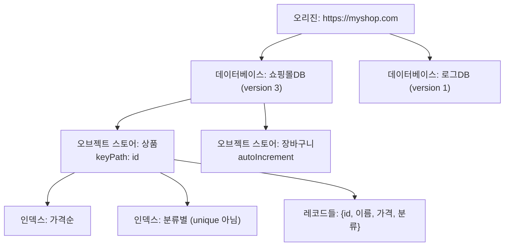
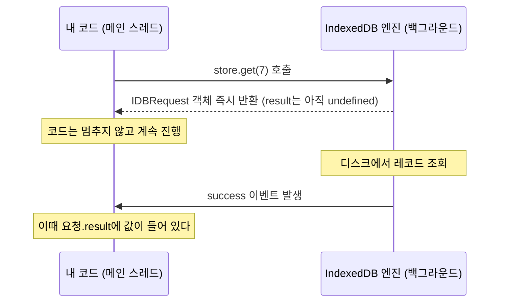
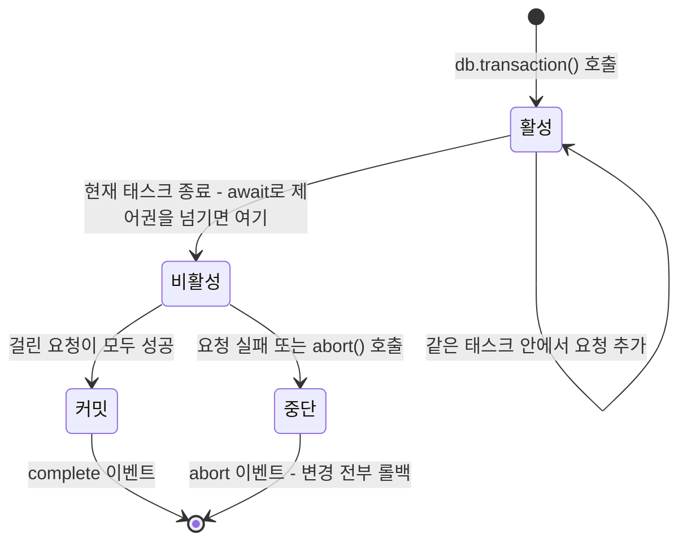

<Callout type="info">
  **이번 문서의 목표:** 이 파일을 다 읽으면 IndexedDB로 데이터를 넣고 꺼내는 코드를 처음부터 짤 수 있고, 트랜잭션이 자동으로 커밋되는 이유와 그 때문에 생기는 함정을 설명할 수 있게 된다.
</Callout>

## 왜 IndexedDB인가

13편에서 `localStorage`의 한계 두 가지를 봤습니다. **문자열만 담긴다**는 것, 그리고 **동기 API라 메인 스레드를 멈춘다**는 것입니다. 여기에 하나를 더하면 IndexedDB의 존재 이유가 완성됩니다. `localStorage`에는 **검색이 없습니다.** "가격이 3만 원 이상인 상품"을 찾으려면 전부 꺼내서 `JSON.parse`하고 직접 필터링해야 합니다. 항목이 5000개면 5000개를 전부 파싱해야 합니다.

**IndexedDB**(Indexed Database, 색인된 데이터베이스)는 이 셋을 전부 해결하려고 만들어진, 브라우저 안에 내장된 **트랜잭션 기반 객체 데이터베이스**입니다.

> **쉽게 말하면:** IndexedDB는 브라우저 안에 들어 있는 작은 NoSQL 데이터베이스입니다. 자바스크립트 객체를 통째로 넣고, 색인으로 빠르게 찾고, 여러 작업을 한 덩어리로 묶어 안전하게 처리합니다.

`localStorage`가 냉장고 문에 붙이는 메모지라면, IndexedDB는 서류함입니다. 서랍(스토어)이 여러 개 있고, 서랍마다 서류가 번호순으로 정리돼 있으며, 옆에 "저자명 순 색인"·"날짜 순 색인" 같은 별도 색인 카드가 붙어 있습니다.

### localStorage와 무엇이 다른가

| 항목 | `localStorage` | IndexedDB |
|------|----------------|-----------|
| API 방식 | 동기 – 메인 스레드 블로킹 | 비동기 – 이벤트/Promise |
| 저장 가능 타입 | 문자열만 | 구조화 복제 – 객체, `Date`, `Blob`, `Map` 등 |
| 검색 | 없음 – 전부 꺼내 직접 필터 | 인덱스와 범위 커서로 부분 조회 |
| 용량 | 약 5MB | 디스크 여유에 따라 수백 MB 이상 |
| 원자성 | 없음 | 트랜잭션으로 전부 성공 또는 전부 취소 |
| 워커에서 사용 | 불가 | 가능 |

**구조화 복제**(structured clone)라는 말을 짚고 갑시다. JSON 직렬화는 문자열로 바꾸는 과정이라 `Date`가 문자열이 되고 `Blob`은 아예 표현이 안 됩니다. 구조화 복제는 브라우저가 값의 **구조 자체를 통째로 복사**하는 알고리즘이라 `Date`는 `Date`로, `Blob`은 `Blob`으로, 심지어 순환 참조가 있는 객체도 그대로 살아남습니다. 다만 **함수·DOM 노드·`Symbol`은 복제할 수 없어** 저장하려 하면 `DataCloneError`가 납니다.

IndexedDB가 값을 저장할 때 쓰는 것이 바로 이 알고리즘입니다. 전역 함수 `structuredClone`으로 같은 알고리즘을 직접 호출해 볼 수 있으니, JSON과 무엇이 다른지 아래에서 직접 확인해 보세요.

<CodePlayground
  template="vanilla"
  activeFile="/index.js"
  showConsole
  label="JSON 직렬화 vs 구조화 복제 — IndexedDB가 무엇을 더 저장할 수 있는지 확인 (콘솔을 보세요)"
  files={{
    '/index.js': `const 원본 = {
  이름: "지노",
  가입일: new Date("2024-01-01"),
  태그: new Set(["세일", "신상"]),
  점수맵: new Map([["국어", 90], ["수학", 85]]),
  없는값: undefined,
  큰수: 9007199254740993n,
};

// ── 1) localStorage 방식: JSON을 거친다 ─────────────
try {
  const 되살림 = JSON.parse(JSON.stringify(원본));
  console.log("JSON 왕복 결과:", 되살림);
  console.log("가입일 타입:", typeof 되살림.가입일, "— Date가 아니라 문자열");
  console.log("태그는?", 되살림.태그, "— Set이 빈 객체가 됨");
  console.log("점수맵은?", 되살림.점수맵, "— Map도 빈 객체가 됨");
  console.log("없는값 키 존재?", "없는값" in 되살림, "— undefined는 통째로 사라짐");
} catch (오류) {
  console.log("JSON 실패:", 오류.name, "-", 오류.message, "(BigInt는 직렬화 불가)");
}

// ── 2) IndexedDB 방식: 구조화 복제 ──────────────────
const 복제 = structuredClone(원본);
console.log("구조화 복제 결과:", 복제);
console.log("가입일이 Date인가?", 복제.가입일 instanceof Date);
console.log("태그가 Set인가?", 복제.태그 instanceof Set, 복제.태그);
console.log("점수맵이 Map인가?", 복제.점수맵 instanceof Map, 복제.점수맵.get("수학"));
console.log("BigInt 유지?", typeof 복제.큰수, 복제.큰수.toString());

// ── 3) 구조화 복제도 못 하는 것 ─────────────────────
try {
  structuredClone({ 콜백: () => "안녕" });
} catch (오류) {
  console.log("함수 복제 시도:", 오류.name, "— 함수는 복제 불가");
}

// ── 4) 순환 참조는 구조화 복제만 살아남는다 ─────────
const 순환 = { 이름: "자기참조" };
순환.자신 = 순환;
console.log("구조화 복제로 순환 처리:", structuredClone(순환).자신.이름);
try {
  JSON.stringify(순환);
} catch (오류) {
  console.log("JSON으로 순환 처리:", 오류.name, "— 실패");
}`,
  }}
/>

핵심은 마지막 줄에 있습니다. `localStorage`에 무언가를 넣으려면 JSON이라는 좁은 문을 통과해야 하고, 그 과정에서 타입 정보가 깎여 나갑니다. IndexedDB는 그 문을 거치지 않으므로 **저장했다 꺼낸 값이 넣은 값과 같은 타입**입니다. 이것만으로도 코드에서 사라지는 변환 로직이 상당합니다.

## 1. 3층 구조 — 데이터베이스, 오브젝트 스토어, 인덱스

IndexedDB의 구조는 세 층입니다.



- **데이터베이스**(database)는 이름과 **버전 번호**를 가집니다. 한 오리진에 여러 개 만들 수 있지만 실무에서는 보통 하나면 충분합니다.
- **오브젝트 스토어**(object store)는 관계형 DB의 테이블에 해당합니다. 다만 열(column) 정의가 없습니다. **아무 모양의 객체나 넣을 수 있습니다.** 스키마가 강제되지 않는다는 뜻이고, 그만큼 검증 책임이 개발자에게 있습니다.
- **인덱스**(index)는 "이 속성으로도 찾을 수 있게 해 달라"는 부가 색인입니다.

### 키를 정하는 세 가지 방식

모든 레코드는 **키**(key)를 하나 가집니다. 키를 정하는 방식이 세 가지입니다.

1. **인라인 키 + `keyPath`** — 객체 안의 특정 속성을 키로 씁니다. `keyPath: "id"`로 만들면 `{ id: 7, 이름: "노트북" }`을 넣을 때 7이 키가 됩니다. 가장 흔한 방식입니다.
2. **`autoIncrement`** — 브라우저가 1, 2, 3… 자동으로 붙여 줍니다. 로그처럼 고유 식별자가 없는 데이터에 씁니다.
3. **아웃오브라인 키** — 저장할 때 `store.put(값, 키)`처럼 키를 따로 넘깁니다. 값이 객체가 아닌 경우(문자열, `Blob` 등)에 씁니다.

키로 쓸 수 있는 타입은 정해져 있습니다. 숫자, 문자열, `Date`, 배열, 그리고 `ArrayBuffer` 계열입니다. **불리언과 `null`, `undefined`는 키가 될 수 없습니다.** 그리고 키는 항상 정렬 가능한 순서를 가집니다 — 숫자가 문자열보다 앞이고, 배열이 가장 뒤입니다. 이 정렬 순서 덕분에 "키 5부터 20까지" 같은 범위 조회가 가능합니다.

### 인덱스가 하는 일

인덱스가 없으면 "가격이 3만 원 이상인 상품"을 찾기 위해 스토어 전체를 훑어야 합니다. `가격` 속성에 인덱스를 만들어 두면, 브라우저가 **가격 순으로 정렬된 별도의 색인**을 유지해 주므로 범위 조회가 곧바로 됩니다.

> **쉽게 말하면:** 인덱스는 책 뒤의 "찾아보기"입니다. 본문을 처음부터 읽지 않고도 특정 단어가 몇 페이지에 있는지 바로 알 수 있습니다.

대가도 있습니다. 인덱스를 만들면 **쓰기가 느려지고 저장 공간을 더 씁니다.** 레코드를 하나 넣을 때마다 브라우저가 모든 인덱스를 함께 갱신해야 하기 때문입니다. 그래서 인덱스는 "실제로 그 속성으로 조회할 것"에만 만듭니다.

인덱스에는 두 가지 옵션이 있습니다.

- `unique: true` — 같은 값을 가진 레코드가 둘 이상이면 저장을 거부합니다. 이메일처럼 중복되면 안 되는 속성에 씁니다.
- `multiEntry: true` — 값이 배열일 때, 배열의 **각 원소마다** 인덱스 항목을 만듭니다. `태그: ["세일", "신상"]`인 상품을 `"세일"`로도 `"신상"`으로도 찾을 수 있게 됩니다.

## 2. 이벤트 기반 API — 왜 이렇게 생겼나

IndexedDB API를 처음 보면 낯섭니다. `async`·`await`가 아니라 `onsuccess`·`onerror` 같은 이벤트 핸들러를 씁니다.

```js
const 요청 = indexedDB.open("쇼핑몰DB", 1);

요청.onerror = (이벤트) => {
  console.log("열기 실패:", 요청.error);
};

요청.onsuccess = (이벤트) => {
  const db = 요청.result;   // 여기서 데이터베이스 객체를 얻는다
};

요청.onupgradeneeded = (이벤트) => {
  const db = 이벤트.target.result;
  // 여기서만 스토어와 인덱스를 만들 수 있다
};
```

이유는 역사입니다. IndexedDB 스펙이 만들어지던 2010년경에는 Promise가 아직 표준이 아니었습니다. 그래서 당시 비동기의 표준 문법이던 이벤트 기반으로 설계됐고, 이미 널리 쓰이는 API가 되어 지금까지 그대로 남았습니다.

핵심 개념은 **`IDBRequest`** 입니다. IndexedDB의 모든 작업은 즉시 결과를 주지 않고 "요청 객체"를 돌려줍니다. 이 객체가 나중에 `success` 또는 `error` 이벤트를 발생시키고, 그때 `요청.result`에 결과가 담깁니다.



이 이벤트 스타일이 불편해서 실무에서는 보통 Promise로 감싸는 작은 헬퍼를 하나 만들어 씁니다.

```js
function 약속화(요청) {
  return new Promise((성공, 실패) => {
    요청.onsuccess = () => 성공(요청.result);
    요청.onerror = () => 실패(요청.error);
  });
}

// 이제 이렇게 쓸 수 있다
const 상품 = await 약속화(스토어.get(7));
```

<Callout type="warning">
  **자주 틀리는 점:** `요청.result`를 이벤트 핸들러 밖에서 바로 읽는 것입니다. 요청은 즉시 반환되지만 결과는 나중에 채워지므로, `success` 이벤트 전에 읽으면 `undefined`이거나 `InvalidStateError`가 납니다.
</Callout>

## 3. 버전과 upgradeneeded — 스키마를 바꾸는 유일한 통로

IndexedDB에는 "지금 스토어를 하나 추가해라" 같은 명령이 없습니다. **오브젝트 스토어와 인덱스는 오직 `upgradeneeded` 이벤트 안에서만 만들거나 지울 수 있습니다.**

이 이벤트는 두 경우에 발생합니다.

1. 데이터베이스가 아예 없어서 처음 만들어질 때 (기존 버전 0)
2. `open`에 넘긴 버전이 저장된 버전보다 클 때

```js
const 요청 = indexedDB.open("쇼핑몰DB", 2);   // 버전 2를 요구

요청.onupgradeneeded = (이벤트) => {
  const db = 이벤트.target.result;
  const 이전버전 = 이벤트.oldVersion;    // 저장돼 있던 버전 (없었으면 0)

  if (이전버전 < 1) {
    const 상품 = db.createObjectStore("상품", { keyPath: "id" });
    상품.createIndex("가격순", "가격", { unique: false });
    상품.createIndex("분류별", "분류", { unique: false });
  }
  if (이전버전 < 2) {
    // 버전 2에서 추가된 스토어
    db.createObjectStore("장바구니", { keyPath: "번호", autoIncrement: true });
  }
};
```

`oldVersion`으로 단계별 분기를 하는 이 패턴이 중요합니다. 사용자마다 마지막 방문 시점이 달라서, 어떤 사람은 버전 0에서 2로 한 번에 뛰고 어떤 사람은 1에서 2로 올라옵니다. `if (이전버전 < N)`을 순서대로 나열하면 어느 지점에서 시작해도 올바르게 최신 스키마에 도달합니다.

### versionchange 트랜잭션과 blocked

`upgradeneeded` 안에서는 **versionchange 트랜잭션**이라는 특수한 트랜잭션이 자동으로 열려 있습니다. 이 트랜잭션은 데이터베이스 전체를 독점합니다. 스키마 변경 도중 다른 코드가 데이터를 건드리면 일관성이 깨지기 때문입니다.

그런데 여기서 실무에서 자주 겪는 문제가 생깁니다. 사용자가 같은 사이트를 **두 탭에 띄워 놓았다면**, 옛 버전으로 열린 탭이 데이터베이스를 붙잡고 있어 새 탭의 업그레이드가 시작되지 못합니다. 이때 `blocked` 이벤트가 발생합니다.

```js
요청.onblocked = () => {
  alert("다른 탭에서 이 사이트가 열려 있습니다. 닫고 다시 시도해 주세요.");
};

// 옛 탭 쪽에서는 이렇게 스스로 물러나 주는 것이 예의다
db.onversionchange = () => {
  db.close();
  location.reload();
};
```

## 4. 트랜잭션 — IndexedDB의 심장

### 트랜잭션이란

**트랜잭션**(transaction, 거래)은 여러 작업을 **전부 성공하거나 전부 없던 일로 만드는** 하나의 묶음입니다.

계좌 이체를 생각하면 직관적입니다. A에서 만 원을 빼고 B에 만 원을 더하는 두 작업 중 하나만 성공하면 돈이 사라지거나 생겨납니다. 트랜잭션은 "둘 다 되든지, 둘 다 안 되든지" 를 보장합니다. 중간에 실패하면 이미 한 작업까지 **되돌립니다**(rollback, 롤백).

IndexedDB에서는 **모든 읽기·쓰기가 반드시 트랜잭션 안에서** 일어납니다. 예외가 없습니다.

```js
// 1) 트랜잭션을 연다 — 대상 스토어와 모드를 지정
const 트랜잭션 = db.transaction(["상품", "장바구니"], "readwrite");

// 2) 트랜잭션에서 스토어 핸들을 얻는다
const 상품스토어 = 트랜잭션.objectStore("상품");

// 3) 작업을 건다
상품스토어.put({ id: 7, 이름: "노트북", 가격: 1200000, 분류: "전자" });

// 4) 트랜잭션 전체의 결과를 듣는다
트랜잭션.oncomplete = () => console.log("모두 커밋됨");
트랜잭션.onerror = () => console.log("실패:", 트랜잭션.error);
트랜잭션.onabort = () => console.log("취소됨");
```

### 모드와 락 — readonly는 왜 여러 개가 동시에 되는가

트랜잭션 모드는 셋입니다.

| 모드 | 용도 | 동시 실행 |
|------|------|-----------|
| `readonly` | 읽기만 | 같은 스토어에 여러 개 동시 가능 |
| `readwrite` | 읽기·쓰기 | 같은 스토어에 하나씩 순차 실행 |
| `versionchange` | 스키마 변경 | 데이터베이스 전체 독점 |

읽기끼리는 서로 방해하지 않으므로 동시에 여러 개가 돌 수 있습니다. 하지만 쓰기는 다릅니다. 두 트랜잭션이 같은 레코드를 동시에 고치면 결과를 예측할 수 없으므로, 브라우저는 같은 스토어에 대한 `readwrite` 트랜잭션을 **줄 세워 하나씩** 처리합니다.

그래서 실무 규칙이 하나 나옵니다. **읽기만 할 때는 반드시 `readonly`를 쓰세요.** 습관적으로 `readwrite`를 쓰면 불필요한 직렬화가 일어나 성능이 떨어집니다.

<Callout type="warning">
  **자주 틀리는 점:** 트랜잭션 하나에 스토어를 필요 이상으로 많이 넣는 것입니다. `db.transaction(["상품", "장바구니", "주문", "로그"], "readwrite")`는 네 스토어를 전부 잠급니다. 실제로 건드릴 스토어만 최소한으로 지정해야 다른 작업이 막히지 않습니다.
</Callout>

### 트랜잭션은 스스로 커밋된다 — 가장 중요한 성질

여기가 IndexedDB에서 가장 많은 사람이 걸려 넘어지는 지점입니다. 다른 데이터베이스에는 보통 `commit()`이 있는데, IndexedDB에는 **커밋을 명시적으로 하지 않습니다.** 트랜잭션은 조건이 갖춰지면 **자동으로 커밋됩니다.**

조건은 이렇습니다. **트랜잭션에 걸린 모든 요청이 완료되고, 현재 실행 중인 자바스크립트 태스크가 끝나면서 새 요청이 더 걸리지 않았다고 판단되는 순간 커밋됩니다.** 여기서 태스크(task)란 이벤트 루프가 한 번에 꺼내 끝까지 실행하는 작업 단위를 말합니다. 이 상태를 스펙 용어로 트랜잭션이 **비활성**(inactive)이 됐다고 합니다.

왜 이런 설계일까요? IndexedDB는 자동 커밋이 **잠금 시간을 최소화**하기 때문에 이렇게 만들어졌습니다. 개발자가 `commit()`을 깜빡하거나 중간에 예외로 빠져나가면 트랜잭션이 스토어를 붙잡은 채 영원히 남습니다. 브라우저처럼 언제든 탭이 닫힐 수 있는 환경에서 이건 치명적입니다. "할 일이 없으면 즉시 닫는다"는 규칙이 그 위험을 구조적으로 제거합니다.

대신 대가가 있습니다.

```js
const 트랜잭션 = db.transaction("상품", "readwrite");
const 스토어 = 트랜잭션.objectStore("상품");

스토어.put({ id: 1, 이름: "마우스" });

// ❌ 여기서 await로 IndexedDB와 무관한 비동기 작업을 기다리면?
const 서버데이터 = await fetch("/api/가격").then((응답) => 응답.json());

// 이 시점에는 트랜잭션이 이미 커밋되어 죽어 있다
스토어.put(서버데이터);   // TransactionInactiveError
```

`await fetch(...)`가 실행되는 순간 현재 태스크가 끝나고 제어권이 이벤트 루프로 돌아갑니다. 그 순간 트랜잭션은 "더 할 일이 없다"고 판단해 커밋해 버립니다. 나중에 `fetch`가 끝나서 코드가 재개될 때는 이미 늦었습니다.



**규칙:** 트랜잭션 안에서는 IndexedDB 요청만 기다리세요. 네트워크·타이머 같은 외부 비동기 작업은 **트랜잭션을 열기 전에** 끝내 두고, 값이 손에 들어온 뒤에 트랜잭션을 열어 빠르게 쓰고 닫습니다.

### 실패와 롤백

트랜잭션 안의 요청 하나가 실패하면(예: `unique` 인덱스 중복) 그 요청의 `error` 이벤트가 발생하고, 아무도 막지 않으면 **트랜잭션 전체가 중단되며 이미 성공한 작업까지 전부 롤백**됩니다. 특정 요청의 실패를 무시하고 계속 진행하고 싶다면 그 요청의 `error` 이벤트에서 `이벤트.preventDefault()`를 호출해 전파를 막아야 합니다.

반대로 개발자가 직접 취소할 수도 있습니다. `트랜잭션.abort()`를 부르면 그때까지의 모든 변경이 되돌아갑니다.

## 5. 전체 흐름을 코드로 — 열기부터 조회까지

지금까지의 개념을 하나의 완결된 예제로 묶습니다. IndexedDB 코드는 길어서 실습기 대신 정적 코드로 읽습니다.

```js
// ── 1. 작은 Promise 헬퍼 ──────────────────────────────
function 약속화(요청) {
  return new Promise((성공, 실패) => {
    요청.onsuccess = () => 성공(요청.result);
    요청.onerror = () => 실패(요청.error);
  });
}

function 트랜잭션완료(트랜잭션) {
  return new Promise((성공, 실패) => {
    트랜잭션.oncomplete = () => 성공();
    트랜잭션.onerror = () => 실패(트랜잭션.error);
    트랜잭션.onabort = () => 실패(트랜잭션.error);
  });
}

// ── 2. 데이터베이스 열기 (스키마 정의 포함) ────────────
function DB열기() {
  return new Promise((성공, 실패) => {
    const 요청 = indexedDB.open("쇼핑몰DB", 1);

    요청.onupgradeneeded = (이벤트) => {
      const db = 이벤트.target.result;
      if (이벤트.oldVersion < 1) {
        const 상품 = db.createObjectStore("상품", { keyPath: "id" });
        상품.createIndex("가격순", "가격", { unique: false });
        상품.createIndex("분류별", "분류", { unique: false });
      }
    };

    요청.onsuccess = () => {
      const db = 요청.result;
      // 다른 탭이 새 버전으로 업그레이드하려 하면 비켜 준다
      db.onversionchange = () => db.close();
      성공(db);
    };
    요청.onerror = () => 실패(요청.error);
    요청.onblocked = () => 실패(new Error("다른 탭이 DB를 붙잡고 있습니다"));
  });
}

// ── 3. 쓰기 — 여러 건을 한 트랜잭션으로 ────────────────
async function 상품여러개저장(db, 목록) {
  const 트랜잭션 = db.transaction("상품", "readwrite");
  const 스토어 = 트랜잭션.objectStore("상품");
  // 반복문 안에서 await를 쓰지 않는다 — 트랜잭션이 죽는다
  for (const 상품 of 목록) {
    스토어.put(상품);
  }
  await 트랜잭션완료(트랜잭션);   // 커밋될 때까지 한 번만 기다린다
}

// ── 4. 읽기 — 키 조회와 인덱스 범위 조회 ───────────────
async function 상품하나(db, id) {
  const 트랜잭션 = db.transaction("상품", "readonly");
  return 약속화(트랜잭션.objectStore("상품").get(id));
}

async function 비싼상품들(db, 최저가) {
  const 트랜잭션 = db.transaction("상품", "readonly");
  const 인덱스 = 트랜잭션.objectStore("상품").index("가격순");
  const 범위 = IDBKeyRange.lowerBound(최저가);   // 최저가 이상
  return 약속화(인덱스.getAll(범위));
}

// ── 5. 사용 ───────────────────────────────────────────
const db = await DB열기();
await 상품여러개저장(db, [
  { id: 1, 이름: "무선 마우스", 가격: 29000, 분류: "주변기기" },
  { id: 2, 이름: "노트북", 가격: 1200000, 분류: "전자" },
  { id: 3, 이름: "키보드", 가격: 89000, 분류: "주변기기" },
]);

console.log(await 상품하나(db, 2));
console.log(await 비싼상품들(db, 50000));   // 키보드, 노트북 (가격 오름차순)
```

주목할 점을 짚습니다.

- **반복문 안에서 `await`를 쓰지 않았습니다.** 요청을 전부 걸어 두고 마지막에 트랜잭션 완료만 한 번 기다립니다. 반복마다 `await`를 걸면 첫 반복 뒤에 트랜잭션이 커밋돼 두 번째부터 `TransactionInactiveError`가 납니다.
- **`IDBKeyRange`** 는 범위를 나타내는 객체입니다. `lowerBound`(이상), `upperBound`(이하), `bound`(사이), `only`(정확히 일치) 네 가지가 있고, 두 번째 인자를 `true`로 주면 경계값을 제외합니다.
- **`getAll`** 은 조건에 맞는 레코드를 배열로 한 번에 가져옵니다. 편하지만 결과가 크면 메모리를 크게 먹습니다. 수천 건 이상을 한 건씩 처리해야 한다면 **커서**(cursor)를 씁니다.

### 커서 — 한 건씩 훑기

```js
const 트랜잭션 = db.transaction("상품", "readonly");
const 요청 = 트랜잭션.objectStore("상품").openCursor();

요청.onsuccess = () => {
  const 커서 = 요청.result;
  if (!커서) {
    console.log("끝까지 다 읽었습니다");
    return;
  }
  console.log(커서.key, 커서.value);
  커서.continue();     // 다음 레코드로 — 다시 이 핸들러가 호출된다
};
```

커서는 같은 `IDBRequest`에 `success` 이벤트가 **반복해서** 발생하는 독특한 구조입니다. `continue()`를 부르면 다음 레코드로 이동하며 다시 `onsuccess`가 불리고, 더 없으면 `요청.result`가 `null`이 됩니다. 전체를 메모리에 올리지 않으므로 대용량 순회에 적합합니다.

<Callout type="warning">
  **자주 틀리는 점:** `put`과 `add`를 혼동하는 것입니다. `add`는 같은 키가 이미 있으면 `ConstraintError`로 실패하고, `put`은 조용히 덮어씁니다. "새로 만드는 것이 확실할 때"는 `add`를 써야 중복 삽입 버그를 조기에 잡을 수 있습니다.
</Callout>

## 핵심 정리

- IndexedDB는 `localStorage`의 세 한계 – 문자열 전용, 동기 블로킹, 검색 불가 – 를 해결하는 브라우저 내장 트랜잭션 데이터베이스다. 구조화 복제 덕분에 `Date`·`Blob`까지 그대로 저장된다.
- 구조는 데이터베이스 → 오브젝트 스토어 → 인덱스의 3층이며, 스토어와 인덱스는 **오직 `upgradeneeded` 안에서만** 만들 수 있다. `oldVersion` 분기로 단계별 마이그레이션을 작성한다.
- 모든 읽기·쓰기는 트랜잭션 안에서 일어난다. `readonly`는 병렬, `readwrite`는 같은 스토어에서 직렬화되므로 읽기에는 반드시 `readonly`를 쓴다.
- 트랜잭션은 **명시적 커밋이 없고 현재 태스크가 끝나면 자동 커밋**된다. 잠금 시간을 최소화하려는 설계이며, 그 대가로 트랜잭션 안에서 `fetch` 등 외부 비동기를 기다리면 `TransactionInactiveError`가 난다.
- 대량 조회는 `getAll`로 한 번에, 대용량 순회는 커서로 한 건씩. `add`는 중복 시 실패하고 `put`은 덮어쓴다.

## 마무리 복습

<Quiz
  questionNumber={1}
  question="IndexedDB에서 오브젝트 스토어와 인덱스를 생성할 수 있는 유일한 시점은?"
  options={['데이터베이스를 open한 직후 언제든지', 'upgradeneeded 이벤트 핸들러 안', 'readwrite 트랜잭션 안이면 언제든지', 'success 이벤트 핸들러 안']}
  correctAnswer={2}
  explanation="스키마 변경은 versionchange 트랜잭션이 열려 있는 upgradeneeded 안에서만 가능하다. 이 트랜잭션이 데이터베이스 전체를 독점해야 스키마 일관성이 보장되기 때문이다."
  optionExplanations={['open 직후에는 이미 스키마가 확정된 상태다', '정답 — versionchange 트랜잭션이 열린 유일한 시점이다', 'readwrite 트랜잭션은 데이터만 다룰 수 있다', 'success 시점에는 업그레이드가 이미 끝나 있다']}
/>

<Quiz
  questionNumber={2}
  question="IndexedDB 트랜잭션 안에서 await fetch(...) 로 서버 응답을 기다린 뒤 다시 put을 호출하면 발생하는 일은?"
  options={['정상 동작하며 fetch 결과가 저장된다', '트랜잭션이 이미 자동 커밋되어 TransactionInactiveError가 발생한다', 'fetch가 끝날 때까지 트랜잭션이 대기하므로 다른 탭이 멈춘다', '트랜잭션이 자동으로 롤백되어 앞의 put도 취소된다']}
  correctAnswer={2}
  explanation="트랜잭션은 현재 태스크가 끝나 비활성 상태가 되면 자동 커밋된다. await로 제어권을 이벤트 루프에 넘기는 순간 커밋되므로, 재개된 뒤의 요청은 죽은 트랜잭션에 걸리게 된다."
  optionExplanations={['자동 커밋 때문에 정상 동작하지 않는다', '정답 — 자동 커밋 설계의 대표적인 부작용이다', '트랜잭션은 외부 비동기를 기다려 주지 않는다', '앞의 put은 이미 커밋되었으므로 롤백되지 않는다']}
/>

<Quiz
  questionNumber={3}
  question="IndexedDB가 명시적 commit() 없이 자동 커밋되도록 설계된 주된 이유는?"
  options={['Promise가 표준이 아니었기 때문', '개발자가 커밋을 잊거나 예외로 빠져나갈 때 스토어가 영구히 잠기는 것을 막아 잠금 시간을 최소화하기 위해', '트랜잭션 개념이 없기 때문', '브라우저마다 커밋 시점이 달라 표준화가 불가능했기 때문']}
  correctAnswer={2}
  explanation="탭이 언제든 닫히는 브라우저 환경에서 커밋 누락은 스토어를 무기한 잠글 수 있다. 할 일이 없으면 즉시 닫는 규칙이 이 위험을 구조적으로 제거한다. Promise 부재는 이벤트 기반 API 모양의 이유이지 자동 커밋의 이유는 아니다."
  optionExplanations={['그것은 이벤트 기반 API 형태를 설명할 뿐이다', '정답 — 잠금 시간 최소화가 설계 의도다', 'IndexedDB의 핵심이 바로 트랜잭션이다', '커밋 시점은 스펙에 명확히 정의되어 있다']}
/>

<Quiz
  questionNumber={4}
  question="같은 스토어를 대상으로 하는 여러 트랜잭션의 동시 실행에 대한 설명으로 옳은 것은?"
  options={['readonly끼리도 반드시 순차 실행된다', 'readonly는 여러 개가 동시에 실행될 수 있지만 readwrite는 순차 실행된다', 'readwrite끼리도 자유롭게 병렬 실행된다', '모드와 상관없이 항상 병렬로 실행된다']}
  correctAnswer={2}
  explanation="읽기끼리는 서로 간섭하지 않으므로 동시 실행이 허용된다. 쓰기는 결과를 예측할 수 없게 만들 수 있어 같은 스토어에 대해 하나씩 줄 세워 처리된다. 그래서 읽기 전용 작업에 readwrite를 쓰면 불필요한 직렬화가 생긴다."
  optionExplanations={['읽기끼리는 병렬 실행이 가능하다', '정답 — 그래서 읽기에는 readonly를 써야 한다', 'readwrite는 같은 스토어에서 직렬화된다', '모드에 따라 동작이 다르다']}
/>

<Quiz
  questionNumber={5}
  question="IndexedDB의 키로 사용할 수 없는 값은?"
  options={['숫자 7', '문자열 상품A', 'Date 객체', '불리언 true']}
  correctAnswer={4}
  explanation="키로 허용되는 타입은 숫자, 문자열, Date, 배열, ArrayBuffer 계열이다. 불리언과 null, undefined는 키가 될 수 없다. 키는 정렬 가능한 순서를 가져야 범위 조회가 성립하기 때문이다."
  optionExplanations={['숫자는 유효한 키 타입이다', '문자열은 유효한 키 타입이다', 'Date는 유효한 키 타입이며 시각 순으로 정렬된다', '정답 — 불리언은 키로 쓸 수 없다']}
/>

<Quiz
  questionNumber={6}
  question="store.add()와 store.put()의 차이로 옳은 것은?"
  options={['add는 비동기이고 put은 동기다', 'add는 같은 키가 이미 있으면 ConstraintError로 실패하고, put은 덮어쓴다', 'add는 인덱스를 갱신하지 않는다', 'put은 트랜잭션 없이도 호출할 수 있다']}
  correctAnswer={2}
  explanation="두 메서드 모두 비동기이며 트랜잭션이 필요하고 인덱스도 갱신한다. 차이는 키 충돌 시의 동작뿐이다. 새 레코드임이 확실한 상황에서는 add를 써야 중복 삽입을 조기에 발견할 수 있다."
  optionExplanations={['둘 다 비동기 요청을 반환한다', '정답 — 키 충돌 시 동작만 다르다', '두 메서드 모두 인덱스를 갱신한다', 'IndexedDB의 모든 읽기·쓰기는 트랜잭션 안에서만 가능하다']}
/>

<Quiz
  questionNumber={7}
  question="수만 건의 레코드를 순회하며 한 건씩 처리해야 할 때 getAll 대신 커서를 쓰는 이유는?"
  options={['커서가 트랜잭션 없이 동작하기 때문', 'getAll은 전체 결과를 메모리에 한꺼번에 올리지만 커서는 한 건씩 넘겨받아 메모리 사용을 억제하기 때문', '커서만 인덱스를 사용할 수 있기 때문', 'getAll은 readonly 트랜잭션에서 쓸 수 없기 때문']}
  correctAnswer={2}
  explanation="getAll은 편리하지만 결과 배열을 통째로 메모리에 만든다. 커서는 continue 호출마다 다음 레코드 하나만 넘겨받으므로 대용량 순회에서 메모리 사용량이 일정하게 유지된다."
  optionExplanations={['커서도 트랜잭션 안에서만 동작한다', '정답 — 메모리 사용 패턴의 차이다', 'getAll도 인덱스에서 호출할 수 있다', 'getAll은 readonly에서 정상 동작한다']}
/>

<Quiz
  questionNumber={8}
  question="사용자가 같은 사이트를 두 탭에 열어 둔 상태에서 한 탭이 상위 버전으로 데이터베이스를 열려 할 때 발생하는 이벤트와 올바른 대응은?"
  options={['error 이벤트가 발생하며 대응 방법이 없다', 'blocked 이벤트가 발생하며, 기존 탭에서 versionchange 핸들러로 db.close()를 호출해 비켜 주면 된다', 'upgradeneeded가 두 탭 모두에서 동시에 실행된다', 'success 이벤트가 발생하고 두 버전이 공존한다']}
  correctAnswer={2}
  explanation="옛 버전의 연결이 남아 있으면 업그레이드가 시작되지 못하고 blocked 이벤트가 발생한다. 기존 탭에서 db.onversionchange 핸들러로 연결을 닫아 주는 것이 표준 대응 패턴이다."
  optionExplanations={['blocked라는 전용 이벤트와 대응 패턴이 존재한다', '정답 — versionchange에서 close하는 것이 표준 패턴이다', 'versionchange 트랜잭션은 데이터베이스를 독점하므로 동시 실행되지 않는다', '한 데이터베이스에 두 버전이 공존할 수 없다']}
/>

## 참고 자료

- [MDN - IndexedDB API](https://developer.mozilla.org/en-US/docs/Web/API/IndexedDB_API)
- [MDN - Using IndexedDB](https://developer.mozilla.org/en-US/docs/Web/API/IndexedDB_API/Using_IndexedDB)
- [MDN - IDBTransaction](https://developer.mozilla.org/en-US/docs/Web/API/IDBTransaction)
- [Indexed Database API 3.0 스펙](https://www.w3.org/TR/IndexedDB/)
