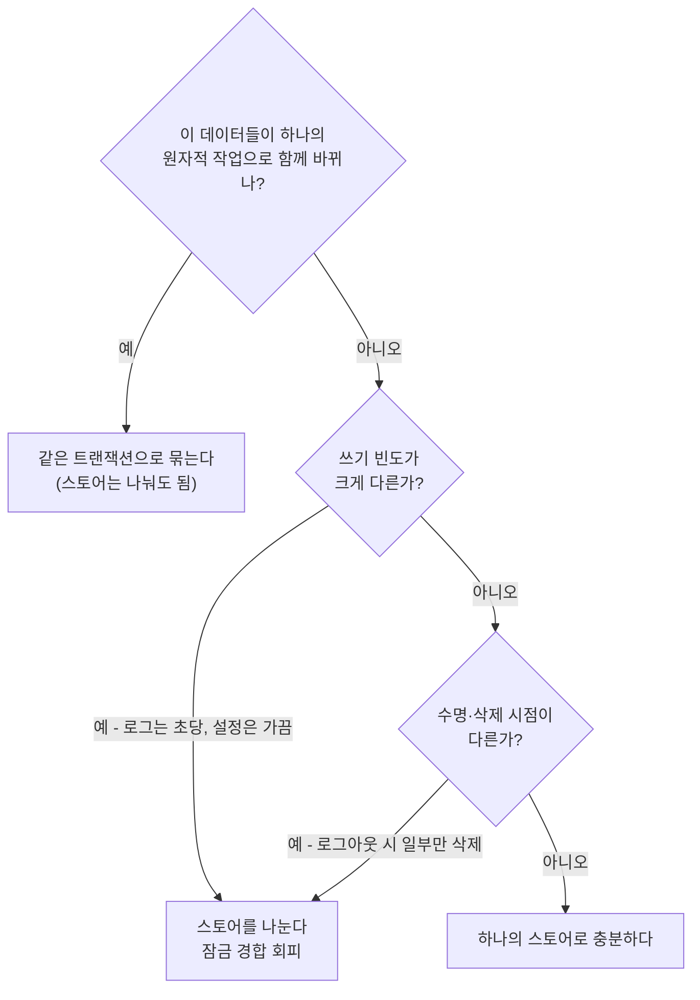
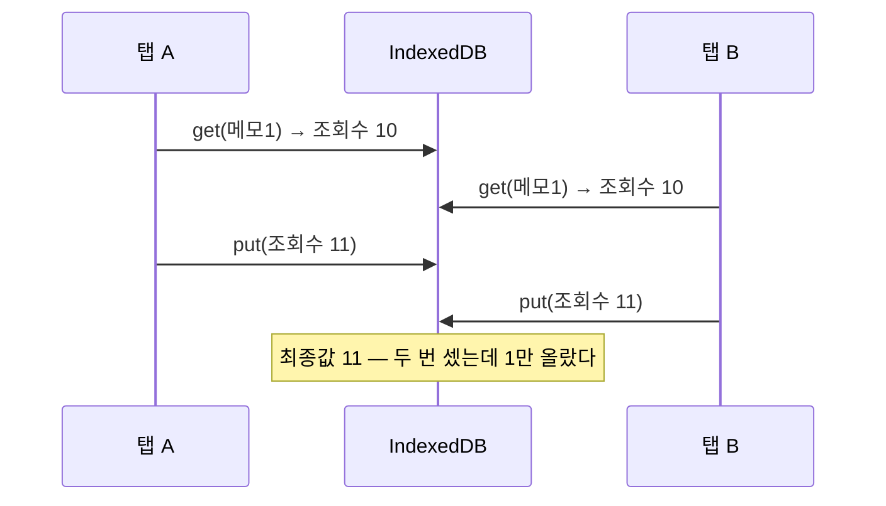
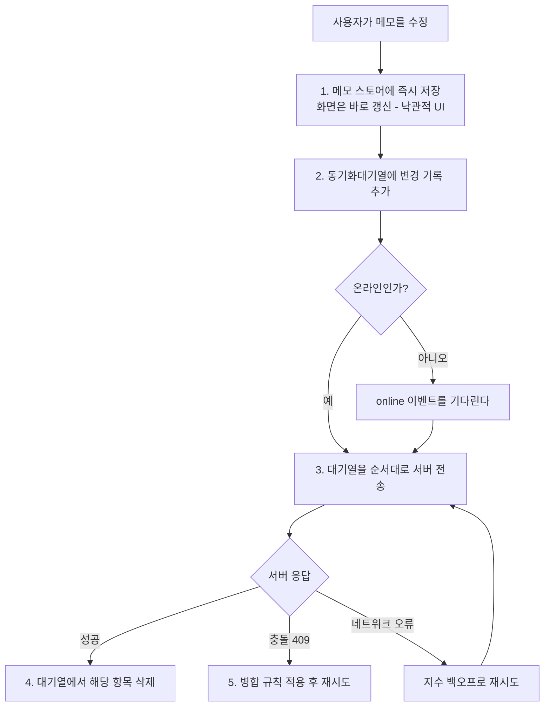

<Callout type="info">
  **이번 문서의 목표:** 이 파일을 다 읽으면 IndexedDB 스키마를 처음부터 설계하고, 배포 후 버전을 안전하게 올리며, 오프라인 동기화의 충돌 지점을 예측할 수 있게 된다.
</Callout>

## 15편에서 여기로

15편에서 IndexedDB의 문법과 트랜잭션 모델을 배웠습니다. 그런데 실제 제품에 넣으면 문법이 아닌 곳에서 문제가 터집니다.

- 스토어를 몇 개로 쪼갤 것인가
- 이미 사용자 기기에 v1 데이터가 있는데 v2로 어떻게 올릴 것인가
- 두 탭이 동시에 같은 레코드를 고치면 어떻게 되는가
- 서버와 로컬이 둘 다 바뀌었을 때 누구를 이길 것인가
- 애초에 이 데이터를 IndexedDB에 넣는 게 맞긴 한가

이번 편은 이 다섯 질문에 답합니다. 문법이 아니라 **판단**을 다루는 편입니다.

## 1. 스키마 설계 — 관계형 사고를 버려야 하는 지점

### 정규화하지 마라, 조인이 없다

관계형 데이터베이스를 다뤄 본 사람은 본능적으로 **정규화**(normalization)를 합니다. 중복을 없애려고 데이터를 여러 테이블로 쪼개고, 필요할 때 조인(join)으로 합치는 방식입니다.

IndexedDB에는 **조인이 없습니다.** 스토어 두 개에 나눠 담으면 두 번 조회해서 자바스크립트로 직접 합쳐야 합니다. 조회 하나하나가 비동기 요청이므로, 게시글 20개의 작성자를 각각 조회하면 요청이 21번 날아갑니다.

> **쉽게 말하면:** IndexedDB는 관계형 DB가 아니라 문서 저장소에 가깝습니다. "한 번에 필요한 것은 한 덩어리로 뭉쳐 두라"가 기본 원칙입니다.

그래서 IndexedDB의 스키마 설계 원칙은 **비정규화**(denormalization)입니다. 게시글을 보여 줄 때 작성자 이름이 항상 필요하다면, 게시글 레코드 안에 작성자 이름을 복사해 넣습니다.

```js
// ❌ 관계형 사고 — 조회가 두 번 이상 필요하다
{ id: 1, 제목: "인덱스드DB 입문", 작성자id: 42 }

// ✅ 비정규화 — 화면 하나에 필요한 것이 한 레코드에 다 있다
{ id: 1, 제목: "인덱스드DB 입문", 작성자: { id: 42, 이름: "지노" }, 작성일: new Date() }
```

중복이 생기는 게 불편할 수 있지만, 브라우저 저장소의 데이터는 **서버 데이터의 사본**입니다. 원본이 서버에 있으니 로컬 사본에 중복이 있어도 정합성의 최종 책임은 서버가 집니다. 중복을 피하려다 조회 횟수를 늘리는 쪽이 훨씬 손해입니다.

### 스토어를 나누는 기준은 "함께 잠기는가"

그렇다면 스토어는 언제 나눌까요? 기준은 도메인이 아니라 **트랜잭션 경계**입니다. 15편에서 봤듯 같은 스토어에 대한 `readwrite` 트랜잭션은 줄을 서서 하나씩 처리됩니다. 즉 **한 스토어에 몰아 넣으면 서로 무관한 작업끼리 서로를 기다립니다.**



구체적인 예를 봅시다. 오프라인 메모 앱에서 이렇게 나눕니다.

- `메모` — 사용자가 편집하는 본체. 쓰기 빈도 중간.
- `첨부파일` — `Blob`을 담는 큰 레코드. 메모와 수명은 같지만 크기가 커서 분리하면 메모 조회가 가벼워집니다.
- `동기화대기열` — 서버로 보내야 할 변경 목록. 쓰기 빈도가 높고 성공 시 즉시 삭제되므로 반드시 분리합니다.
- `설정` — 거의 안 바뀝니다.

### 인덱스는 조회 패턴에서 역산한다

인덱스는 "이 속성 중요하니까"가 아니라 **"이 화면이 이 조건으로 조회한다"** 에서 역산해 만듭니다. 인덱스 하나마다 쓰기 비용과 저장 공간이 늘기 때문입니다.

| 화면 요구 | 필요한 인덱스 | 조회 방식 |
|-----------|---------------|-----------|
| 최근 수정순 목록 | `수정일` | `openCursor(null, prev)` 로 역순 |
| 폴더별 메모 | `폴더id` | `getAll(IDBKeyRange.only(폴더id))` |
| 태그로 검색 | `태그` + `multiEntry` | 배열 원소 각각으로 조회 |
| 폴더 안에서 최근순 | 복합 인덱스 | 아래 참조 |

마지막 줄의 **복합 인덱스**(compound index)는 유용한데 잘 알려져 있지 않습니다. `keyPath`에 배열을 주면 여러 속성을 묶어 하나의 인덱스로 만듭니다.

```js
스토어.createIndex("폴더별최근순", ["폴더id", "수정일"], { unique: false });

// 폴더 3의 메모를 수정일 순으로
const 범위 = IDBKeyRange.bound([3, 0], [3, Infinity]);
const 결과 = await 약속화(인덱스.getAll(범위));
```

키가 배열이면 **앞 원소부터 차례로 비교**하는 사전식 정렬이 적용됩니다. 그래서 `[폴더id, 수정일]` 순서로 묶으면 "폴더가 3인 것들이 모여 있고, 그 안에서 수정일 순으로 정렬"된 상태가 됩니다. **순서를 바꾸면 완전히 다른 인덱스**가 되므로, 자주 고정되는 조건을 앞에 둡니다.

<Callout type="warning">
  **자주 틀리는 점:** `keyPath`로 지정한 속성이 없는 레코드는 **그 인덱스에 아예 등록되지 않습니다.** `폴더id`가 없는 메모를 넣으면 `폴더별` 인덱스 조회에서 영영 나오지 않습니다. 오류도 나지 않아 발견이 늦습니다. 인덱스 대상 속성은 반드시 기본값(예: `폴더id: 0`)을 채워 저장하세요.
</Callout>

## 2. 버전 업그레이드 — 가장 위험한 순간

### 마이그레이션은 되돌릴 수 없다

웹 서버 데이터베이스는 마이그레이션이 실패하면 관리자가 붙어서 복구합니다. IndexedDB는 **사용자 기기에서** 실행됩니다. 실패해도 아무도 모르고, 손댈 수도 없습니다.

게다가 사용자마다 시작 버전이 다릅니다. 어제 방문한 사람은 v3에서, 반년 만에 돌아온 사람은 v1에서 올라옵니다. 그래서 마이그레이션 코드는 **어느 버전에서 시작해도 최신에 도달하는 계단 구조**여야 합니다.

```js
요청.onupgradeneeded = (이벤트) => {
  const db = 이벤트.target.result;
  const 트랜잭션 = 이벤트.target.transaction;   // versionchange 트랜잭션
  const 이전 = 이벤트.oldVersion;

  // 계단을 하나씩 오른다 — else if가 아니라 독립된 if들
  if (이전 < 1) {
    const 메모 = db.createObjectStore("메모", { keyPath: "id" });
    메모.createIndex("수정일", "수정일");
  }
  if (이전 < 2) {
    // 기존 스토어에 인덱스 추가 — 스토어 핸들은 트랜잭션에서 얻는다
    const 메모 = 트랜잭션.objectStore("메모");
    메모.createIndex("폴더별최근순", ["폴더id", "수정일"]);
  }
  if (이전 < 3) {
    db.createObjectStore("동기화대기열", { keyPath: "순번", autoIncrement: true });
  }
};
```

여기서 중요한 세부가 하나 있습니다. **`upgradeneeded` 안에서 기존 스토어를 다루려면 `이벤트.target.transaction`으로 versionchange 트랜잭션을 얻어야 합니다.** `db.transaction(...)`으로 새 트랜잭션을 열면 안 됩니다 — 이미 versionchange 트랜잭션이 데이터베이스를 독점하고 있어 데드락이 나거나 오류가 납니다.

### 기존 데이터를 변환해야 할 때

새 인덱스를 추가했는데 기존 레코드에 그 속성이 없다면, 인덱스가 텅 빈 채로 남습니다. 이때는 마이그레이션 안에서 **전체 레코드를 훑어 채워 넣어야** 합니다.

```js
if (이전 < 2) {
  const 메모 = 트랜잭션.objectStore("메모");
  메모.createIndex("폴더별", "폴더id");

  // 기존 레코드에 폴더id 기본값을 채운다
  메모.openCursor().onsuccess = (커서이벤트) => {
    const 커서 = 커서이벤트.target.result;
    if (!커서) return;
    const 값 = 커서.value;
    if (값.폴더id === undefined) {
      값.폴더id = 0;
      커서.update(값);       // 현재 커서 위치의 레코드를 갱신
    }
    커서.continue();
  };
}
```

`커서.update()`는 커서가 가리키는 레코드를 그 자리에서 갱신합니다. 그리고 이 작업들은 전부 versionchange 트랜잭션 안이므로, 하나라도 실패하면 **업그레이드 전체가 롤백되어 이전 버전으로 되돌아갑니다.** 반쪽짜리 스키마가 남지 않는다는 뜻이라 안심할 만합니다.

<Callout type="warning">
  **자주 틀리는 점:** 마이그레이션 안에서 `await fetch(...)`로 서버 데이터를 받아 채우려는 시도입니다. versionchange 트랜잭션도 15편의 자동 커밋 규칙을 그대로 따릅니다. 외부 비동기를 기다리는 순간 트랜잭션이 죽습니다. 마이그레이션에서는 **오직 IndexedDB 내부 작업만** 해야 하며, 서버 데이터가 필요하면 업그레이드 완료 후 별도 트랜잭션에서 채웁니다.
</Callout>

### 버전을 내릴 수는 없다

`open`에 저장된 버전보다 **작은** 숫자를 주면 `VersionError`가 나며 열리지 않습니다. 롤백 배포로 옛 코드가 다시 나가면 그 사용자는 앱이 아예 안 열립니다.

방어책은 두 가지입니다. 첫째, 버전 번호를 올리는 배포는 되돌릴 수 없다고 전제하고 신중히 합니다. 둘째, 여는 코드에 최후 수단을 답니다.

```js
요청.onerror = () => {
  if (요청.error && 요청.error.name === "VersionError") {
    // 서버에서 다시 받아 올 수 있는 캐시성 데이터라면 지우고 새로 시작
    indexedDB.deleteDatabase("메모DB");
  }
};
```

이 처리는 **데이터를 서버에서 복구할 수 있을 때만** 허용됩니다. 로컬에만 존재하는 데이터라면 지우는 것은 사용자 데이터 파괴입니다.

## 3. 동시성 — 탭 두 개가 싸울 때

### IndexedDB가 보장해 주는 것

좋은 소식부터. 같은 스토어에 대한 `readwrite` 트랜잭션은 브라우저가 직렬화하므로, **한 트랜잭션이 실행되는 동안 다른 트랜잭션이 끼어들어 반쪽 상태를 보는 일은 없습니다.** 트랜잭션 단위의 격리는 공짜로 얻습니다.

### 보장해 주지 않는 것 — 갱신 손실

문제는 트랜잭션 **사이**입니다. 흔한 "읽고, 고치고, 쓰기" 패턴을 봅시다.



두 탭이 각자 트랜잭션을 제대로 지켰는데도 갱신 하나가 사라졌습니다. 이것을 **갱신 손실**(lost update)이라고 합니다. 원인은 읽기와 쓰기가 **서로 다른 트랜잭션**에 있었기 때문입니다.

해법은 단순합니다. **읽기와 쓰기를 같은 `readwrite` 트랜잭션 안에서 하는 것**입니다.

```js
async function 조회수증가(db, 메모id) {
  const 트랜잭션 = db.transaction("메모", "readwrite");
  const 스토어 = 트랜잭션.objectStore("메모");

  const 메모 = await 약속화(스토어.get(메모id));   // 같은 트랜잭션 안의 읽기
  메모.조회수 = (메모.조회수 || 0) + 1;
  스토어.put(메모);                                 // 같은 트랜잭션 안의 쓰기

  await 트랜잭션완료(트랜잭션);
}
```

여기서 `await 약속화(스토어.get(...))`은 안전합니다. 15편에서 트랜잭션이 죽는 조건은 "IndexedDB와 **무관한** 비동기를 기다릴 때"였습니다. IndexedDB 요청을 기다리는 `await`는 트랜잭션을 살려 둡니다 — 아직 처리할 요청이 남아 있기 때문입니다.

말로만 보면 잘 와닿지 않으니 직접 재현해 봅시다. 아래 실습기는 같은 레코드를 다섯 번 동시에 증가시키는 작업을 두 방식으로 실행하고 결과를 비교합니다. 트랜잭션을 나눈 쪽의 최종값이 어떻게 되는지 확인해 보세요.

<CodePlayground
  template="vanilla"
  activeFile="/index.js"
  showConsole
  label="갱신 손실 재현 — 트랜잭션을 나눴을 때와 합쳤을 때 (콘솔을 보세요)"
  files={{
    '/index.js': `function 약속화(요청) {
  return new Promise((성공, 실패) => {
    요청.onsuccess = () => 성공(요청.result);
    요청.onerror = () => 실패(요청.error);
  });
}
function 트랜잭션완료(트) {
  return new Promise((성공, 실패) => {
    트.oncomplete = () => 성공();
    트.onerror = () => 실패(트.error);
    트.onabort = () => 실패(트.error);
  });
}

function DB열기() {
  return new Promise((성공, 실패) => {
    const 요청 = indexedDB.open("동시성실습", 1);
    요청.onupgradeneeded = (이벤트) => {
      이벤트.target.result.createObjectStore("카운터", { keyPath: "id" });
    };
    요청.onsuccess = () => 성공(요청.result);
    요청.onerror = () => 실패(요청.error);
  });
}

async function 초기화(db) {
  const 트 = db.transaction("카운터", "readwrite");
  트.objectStore("카운터").put({ id: "조회수", 값: 0 });
  await 트랜잭션완료(트);
}

async function 값읽기(db) {
  const 트 = db.transaction("카운터", "readonly");
  const 결과 = await 약속화(트.objectStore("카운터").get("조회수"));
  return 결과.값;
}

// ❌ 읽기와 쓰기가 서로 다른 트랜잭션 — 갱신 손실 발생
async function 위험한증가(db) {
  const 읽기트 = db.transaction("카운터", "readonly");
  const 현재 = await 약속화(읽기트.objectStore("카운터").get("조회수"));

  const 쓰기트 = db.transaction("카운터", "readwrite");
  쓰기트.objectStore("카운터").put({ id: "조회수", 값: 현재.값 + 1 });
  await 트랜잭션완료(쓰기트);
}

// ✅ 읽기와 쓰기가 같은 readwrite 트랜잭션 — 안전
async function 안전한증가(db) {
  const 트 = db.transaction("카운터", "readwrite");
  const 스토어 = 트.objectStore("카운터");
  const 현재 = await 약속화(스토어.get("조회수"));
  스토어.put({ id: "조회수", 값: 현재.값 + 1 });
  await 트랜잭션완료(트);
}

async function 실행() {
  const db = await DB열기();

  await 초기화(db);
  await Promise.all([1, 2, 3, 4, 5].map(() => 위험한증가(db)));
  console.log("트랜잭션을 나눈 경우 → 5번 증가시켰는데 결과:", await 값읽기(db));

  await 초기화(db);
  await Promise.all([1, 2, 3, 4, 5].map(() => 안전한증가(db)));
  console.log("한 트랜잭션으로 묶은 경우 → 결과:", await 값읽기(db));

  db.close();
  indexedDB.deleteDatabase("동시성실습");
}

실행().catch((오류) => console.log("오류:", 오류.name, "-", 오류.message));`,
  }}
/>

위험한 쪽은 대개 1이나 2가 나옵니다. 다섯 개가 거의 동시에 0을 읽고 각자 1을 써 버리기 때문입니다. 안전한 쪽은 항상 5입니다 — 같은 스토어의 `readwrite` 트랜잭션이 직렬화되고, 읽기가 그 안에 들어가 있어 각 증가가 직전 결과를 정확히 이어받기 때문입니다. 탭이 하나뿐인 이 실습에서도 재현된다는 점이 중요합니다. **동시성 문제는 탭이 여러 개일 때만 생기는 게 아닙니다.**

### 버전 필드로 충돌 감지하기

한 트랜잭션으로 해결되지 않는 경우도 있습니다. 사용자가 편집기에 30초간 글을 쓰는 동안 트랜잭션을 열어 둘 수는 없습니다. 이때는 **낙관적 잠금**(optimistic locking)을 씁니다.

레코드마다 `버전` 숫자를 두고, 저장할 때 "내가 읽었을 때의 버전이 그대로인가"를 확인합니다.

```js
async function 안전하게저장(db, 메모, 읽었을때버전) {
  const 트랜잭션 = db.transaction("메모", "readwrite");
  const 스토어 = 트랜잭션.objectStore("메모");

  const 현재 = await 약속화(스토어.get(메모.id));
  if (현재 && 현재.버전 !== 읽었을때버전) {
    트랜잭션.abort();
    throw new Error("다른 곳에서 먼저 수정했습니다");
  }
  메모.버전 = 읽었을때버전 + 1;
  스토어.put(메모);
  await 트랜잭션완료(트랜잭션);
}
```

"잠그지 않고 일단 진행하되, 쓰는 순간에 충돌을 감지한다"는 발상이라 낙관적이라고 부릅니다. 충돌이 드물 때 잠금 비용을 아낄 수 있습니다.

### 탭 간 알림 — BroadcastChannel

한 탭이 데이터를 바꿨을 때 다른 탭의 화면도 갱신되어야 합니다. IndexedDB에는 `localStorage`의 `storage` 이벤트 같은 변경 알림이 **없습니다.** 그래서 별도 채널로 알립니다.

```js
const 채널 = new BroadcastChannel("메모변경");

// 쓴 쪽
await 안전하게저장(db, 메모, 버전);
채널.postMessage({ 종류: "메모수정", id: 메모.id });

// 듣는 쪽
채널.onmessage = (이벤트) => {
  if (이벤트.data.종류 === "메모수정") 화면다시그리기(이벤트.data.id);
};
```

`BroadcastChannel`은 같은 오리진의 모든 탭·워커에 메시지를 뿌리며, **보낸 자신에게는 오지 않습니다.** 데이터 자체는 IndexedDB에서 읽고, 채널로는 "바뀌었다"는 신호만 보내는 것이 정석입니다. 메시지에 데이터를 통째로 실으면 어느 것이 진실인지 흐려집니다.

## 4. 오프라인 동기화 — 대기열 패턴

IndexedDB를 쓰는 가장 흔한 이유가 오프라인 지원입니다. 표준 설계는 **아웃박스**(outbox, 발신함) 패턴입니다.



세 가지 설계 판단을 짚습니다.

**첫째, 화면을 먼저 갱신합니다.** 로컬에 저장하자마자 화면을 바꾸는 것을 **낙관적 UI**(optimistic UI)라고 합니다. 서버 왕복을 기다리지 않으니 즉각 반응하고, 오프라인에서도 앱이 살아 있습니다.

**둘째, 대기열은 별도 스토어입니다.** 쓰기가 잦고 성공 즉시 삭제되므로 메모 스토어와 잠금을 공유하면 안 됩니다.

**셋째, 충돌 해결 규칙을 미리 정합니다.** 로컬과 서버가 둘 다 바뀌었을 때 누가 이기는지는 **자동으로 결정되지 않습니다.** 선택지는 셋입니다.

| 전략 | 규칙 | 적합한 데이터 |
|------|------|---------------|
| 마지막 쓰기 승리 | 타임스탬프가 늦은 쪽 채택 | 설정값, 읽음 표시 |
| 서버 우선 | 충돌 시 로컬을 버림 | 재고, 가격 등 서버가 진실인 값 |
| 사용자 선택 | 양쪽을 보여 주고 고르게 함 | 문서 본문 |

<Callout type="warning">
  **자주 틀리는 점:** 로컬 시각(`Date.now()`)으로 마지막 쓰기 승리를 판정하는 것입니다. 사용자 기기의 시계는 틀릴 수 있고, 심지어 미래로 설정돼 있기도 합니다. 시각 비교가 필요하면 **서버가 발급한 타임스탬프나 단조 증가하는 버전 번호**를 기준으로 삼아야 합니다.
</Callout>

## 5. 다시, 무엇을 어디에 저장할 것인가

13편의 결정 트리를 IndexedDB 관점에서 더 날카롭게 정리합니다.

### localStorage로 충분한 경우

- 값이 **수 KB 이하**이고, 항목 수가 **수십 개 이하**
- 앱 시작 직후 **동기적으로 즉시 필요**한 값 — 다크 모드 설정이 대표적입니다. IndexedDB는 비동기라 첫 페인트 전에 못 읽어 화면이 번쩍이는 문제(FOUC)가 생길 수 있습니다.
- 검색·정렬이 필요 없고 키로 직접 꺼내는 것으로 충분

### IndexedDB가 필요한 경우

- 레코드가 **수백 건 이상**이거나 총량이 **수 MB 이상**
- `Blob`·`File`·`ArrayBuffer` 같은 **바이너리**를 담아야 함 — `localStorage`로는 Base64 인코딩을 거쳐야 하고 그러면 크기가 약 33퍼센트 늘어납니다
- **범위 조회·정렬**이 필요함
- 여러 항목을 **원자적으로** 갱신해야 함
- **워커에서** 접근해야 함 — `localStorage`는 워커에서 아예 쓸 수 없습니다

### 둘 다 아닌 경우

- HTTP 응답을 통째로 보관 → **Cache Storage** (14편)
- 서버가 매 요청에서 읽어야 함 → **쿠키** (13편)
- 탭 안에서만 살면 됨 → **`sessionStorage`**
- 새로고침하면 사라져도 됨 → **그냥 메모리 변수**. 저장소를 쓸 이유가 없습니다.

### 라이브러리를 쓸 것인가

IndexedDB의 이벤트 기반 API는 장황합니다. 실무에서는 얇은 래퍼를 쓰는 경우가 많습니다 — 키-값만 필요하면 `idb-keyval` 급의 작은 것, 스키마·마이그레이션이 필요하면 `idb`·`Dexie` 급을 씁니다.

다만 순서가 중요합니다. **원리를 모르고 라이브러리를 먼저 쓰면, 트랜잭션이 죽었을 때 무슨 일이 일어났는지 영원히 알 수 없습니다.** 래퍼는 문법을 줄여 줄 뿐 자동 커밋·잠금·마이그레이션의 제약을 없애 주지 않습니다. 그 제약은 지금까지 배운 그대로 남아 있습니다.

## 핵심 정리

- IndexedDB에는 **조인이 없으므로** 관계형처럼 정규화하지 말고, 한 화면에 필요한 것은 한 레코드에 비정규화해 담는다.
- 스토어 분리 기준은 도메인이 아니라 **잠금 경계**다. 쓰기 빈도나 삭제 시점이 다르면 나눈다. 인덱스는 실제 조회 패턴에서 역산해 최소로 만들고, 복합 인덱스는 배열 `keyPath`로 만들되 순서가 의미를 바꾼다.
- 마이그레이션은 사용자 기기에서 되돌릴 수 없이 실행되므로, `oldVersion` 기준의 **독립된 `if` 계단**으로 어느 버전에서 시작해도 최신에 도달하게 쓴다. 기존 스토어는 `이벤트.target.transaction`으로 얻고, 안에서 외부 비동기를 기다리지 않는다.
- 트랜잭션은 격리를 보장하지만 **갱신 손실은 막아 주지 않는다.** 읽기와 쓰기를 한 `readwrite` 트랜잭션에 넣거나, 긴 편집에는 버전 필드로 낙관적 잠금을 건다. 탭 간 알림은 `BroadcastChannel`로 따로 보낸다.
- 오프라인은 아웃박스 패턴 – 로컬 저장 후 낙관적 UI, 별도 대기열, 명시적 충돌 해결 규칙 – 으로 설계하고, 시각 비교는 로컬 시계 대신 서버 기준값을 쓴다.

## 마무리 복습

<Quiz
  questionNumber={1}
  question="IndexedDB 스키마 설계에서 관계형 데이터베이스식 정규화를 피하고 비정규화를 권장하는 가장 큰 이유는?"
  options={['IndexedDB는 저장 용량이 매우 작기 때문', 'IndexedDB에는 조인이 없어 여러 스토어를 합치려면 비동기 조회를 반복해야 하기 때문', '중복 데이터를 저장하면 인덱스가 빨라지기 때문', '정규화된 데이터는 구조화 복제로 저장할 수 없기 때문']}
  correctAnswer={2}
  explanation="IndexedDB는 조인을 지원하지 않으므로 쪼개 놓은 데이터를 합치려면 조회를 여러 번 하고 자바스크립트로 직접 결합해야 한다. 화면 하나에 필요한 데이터를 한 레코드에 모아 두는 편이 훨씬 유리하다."
  optionExplanations={['IndexedDB는 오히려 용량이 큰 저장소다', '정답 — 조인 부재가 설계 원칙을 바꾼다', '중복은 인덱스 속도와 직접 관련이 없다', '정규화된 데이터도 문제없이 저장된다']}
/>

<Quiz
  questionNumber={2}
  question="오브젝트 스토어를 여러 개로 나눌지 판단하는 기준으로 가장 적절한 것은?"
  options={['데이터의 의미상 분류가 다른가', '쓰기 빈도나 삭제 시점이 달라 잠금 경합이 생기는가', '레코드 개수가 100개를 넘는가', '인덱스가 두 개 이상 필요한가']}
  correctAnswer={2}
  explanation="같은 스토어에 대한 readwrite 트랜잭션은 직렬화되므로, 쓰기가 잦은 데이터와 드문 데이터를 같은 스토어에 두면 서로를 기다리게 된다. 분리 기준은 의미 분류가 아니라 트랜잭션 잠금 경계다."
  optionExplanations={['의미 분류만으로는 잠금 문제를 해결하지 못한다', '정답 — 잠금 경계가 실질적 기준이다', '개수는 직접적인 기준이 아니다', '한 스토어에 인덱스를 여러 개 만들 수 있다']}
/>

<Quiz
  questionNumber={3}
  question="upgradeneeded 핸들러에서 기존 오브젝트 스토어에 인덱스를 추가하려 할 때 스토어 핸들을 얻는 올바른 방법은?"
  options={['db.transaction 으로 새 readwrite 트랜잭션을 연다', '이벤트.target.transaction 으로 versionchange 트랜잭션을 얻어 objectStore를 호출한다', 'db.objectStore를 직접 호출한다', 'indexedDB.open을 다시 호출한다']}
  correctAnswer={2}
  explanation="upgradeneeded 시점에는 versionchange 트랜잭션이 이미 데이터베이스를 독점하고 있다. 새 트랜잭션을 열려 하면 오류가 나므로, 이벤트에서 진행 중인 트랜잭션을 꺼내 써야 한다."
  optionExplanations={['versionchange가 독점 중이라 새 트랜잭션을 열 수 없다', '정답 — 진행 중인 versionchange 트랜잭션을 재사용한다', 'db에는 objectStore 메서드가 없다', '중첩 open은 상황을 악화시킬 뿐이다']}
/>

<Quiz
  questionNumber={4}
  question="마이그레이션 코드를 else if 대신 독립된 if (oldVersion &lt; N) 계단으로 작성해야 하는 이유는?"
  options={['else if는 IndexedDB에서 문법 오류이기 때문', '사용자마다 마지막 방문 시점이 달라 시작 버전이 제각각이므로, 어느 버전에서 시작해도 모든 단계를 거쳐 최신에 도달해야 하기 때문', 'else if를 쓰면 트랜잭션이 자동 커밋되기 때문', '버전 번호를 건너뛸 수 없기 때문']}
  correctAnswer={2}
  explanation="v0에서 v3로 한 번에 오는 사용자와 v2에서 v3로 오는 사용자가 공존한다. 독립된 if들을 순서대로 나열해야 각자에게 필요한 단계만 모두 실행된다."
  optionExplanations={['문법 문제가 아니다', '정답 — 시작 버전이 사용자마다 다르다', '자동 커밋은 제어문 종류와 무관하다', '버전은 실제로 건너뛰어 올라온다']}
/>

<Quiz
  questionNumber={5}
  question="두 탭이 각각 조회수를 읽고 1을 더해 저장했더니 최종적으로 1만 증가했다. 이 현상의 이름과 근본 원인은?"
  options={['데드락 – 두 트랜잭션이 서로를 기다려서', '갱신 손실 – 읽기와 쓰기가 서로 다른 트랜잭션에 나뉘어 있어서', '롤백 – 한쪽 트랜잭션이 중단되어서', '스키마 충돌 – 버전이 달라서']}
  correctAnswer={2}
  explanation="각 탭의 트랜잭션은 정상적으로 격리되었지만, 읽는 트랜잭션과 쓰는 트랜잭션이 분리되어 있어 그 사이에 다른 탭의 갱신이 끼어들었다. 읽기와 쓰기를 하나의 readwrite 트랜잭션에 넣으면 해결된다."
  optionExplanations={['서로를 기다린 것이 아니라 순차적으로 잘 실행되었다', '정답 — lost update의 전형적인 형태다', '두 트랜잭션 모두 정상 커밋되었다', '스키마 버전과는 무관하다']}
/>

<Quiz
  questionNumber={6}
  question="IndexedDB에서 데이터가 바뀌었음을 같은 오리진의 다른 탭에 알리는 표준적인 방법은?"
  options={['IndexedDB가 자동으로 발생시키는 change 이벤트를 듣는다', 'BroadcastChannel로 변경 신호를 보내고, 데이터 자체는 각 탭이 IndexedDB에서 읽는다', 'storage 이벤트를 듣는다', 'setInterval로 주기적으로 전체를 다시 읽는다']}
  correctAnswer={2}
  explanation="IndexedDB에는 변경 알림 이벤트가 없다. BroadcastChannel로 바뀌었다는 신호만 보내고 데이터는 각 탭이 스스로 읽는 것이 정석이다. storage 이벤트는 Web Storage 전용이고, 폴링은 낭비가 크다."
  optionExplanations={['IndexedDB에는 그런 이벤트가 없다', '정답 — 신호와 데이터를 분리하는 것이 핵심이다', 'storage 이벤트는 Web Storage 변경에만 발생한다', '폴링은 배터리와 성능을 낭비한다']}
/>

<Quiz
  questionNumber={7}
  question="다음 중 localStorage 대신 IndexedDB를 선택해야 할 근거로 보기 어려운 것은?"
  options={['이미지 Blob을 그대로 저장해야 한다', '수천 건을 가격 범위로 조회해야 한다', '워커에서 데이터에 접근해야 한다', '첫 페인트 이전에 동기적으로 테마 설정을 읽어야 한다']}
  correctAnswer={4}
  explanation="IndexedDB는 비동기라 첫 페인트 전에 값을 읽지 못해 화면 번쩍임이 생길 수 있다. 이런 아주 작고 즉시 필요한 값은 오히려 localStorage가 적합하다. 바이너리 저장, 범위 조회, 워커 접근은 모두 IndexedDB의 고유 강점이다."
  optionExplanations={['localStorage는 Base64 변환이 필요해 크기가 늘어난다', '범위 조회는 인덱스가 있는 IndexedDB의 강점이다', 'localStorage는 워커에서 사용할 수 없다', '정답 — 동기 접근이 필요한 작은 값은 localStorage가 낫다']}
/>

<Quiz
  questionNumber={8}
  question="오프라인 동기화의 아웃박스 패턴에서 충돌 해결 규칙에 대한 설명으로 옳은 것은?"
  options={['IndexedDB 트랜잭션이 서버와의 충돌까지 자동으로 해결해 준다', '로컬과 서버가 모두 변경된 경우 누가 이기는지는 개발자가 명시적으로 정해야 하며, 시각 비교 시 로컬 시계 대신 서버 기준값을 써야 한다', '항상 로컬이 이기도록 설계하는 것이 표준이다', '충돌은 IndexedDB의 unique 인덱스로 방지할 수 있다']}
  correctAnswer={2}
  explanation="트랜잭션은 브라우저 내부의 격리만 보장하며 서버와의 충돌에는 관여하지 않는다. 마지막 쓰기 승리, 서버 우선, 사용자 선택 중 무엇을 쓸지는 데이터 성격에 따라 개발자가 정하고, 기기 시계는 신뢰할 수 없으므로 서버 타임스탬프나 단조 증가 버전을 기준으로 삼는다."
  optionExplanations={['트랜잭션의 범위는 브라우저 내부에 한정된다', '정답 — 규칙은 명시적으로 정하고 시각 기준은 서버로 둔다', '재고나 가격처럼 서버가 진실인 데이터도 많다', 'unique 인덱스는 로컬 키 중복만 막는다']}
/>

## 참고 자료

- [MDN - IndexedDB API](https://developer.mozilla.org/en-US/docs/Web/API/IndexedDB_API)
- [MDN - Using IndexedDB](https://developer.mozilla.org/en-US/docs/Web/API/IndexedDB_API/Using_IndexedDB)
- [MDN - BroadcastChannel](https://developer.mozilla.org/en-US/docs/Web/API/BroadcastChannel)
- [MDN - Storage API (StorageManager)](https://developer.mozilla.org/en-US/docs/Web/API/Storage_API)
