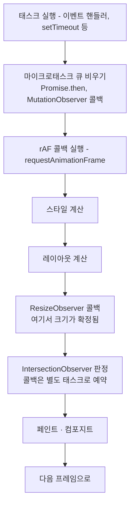
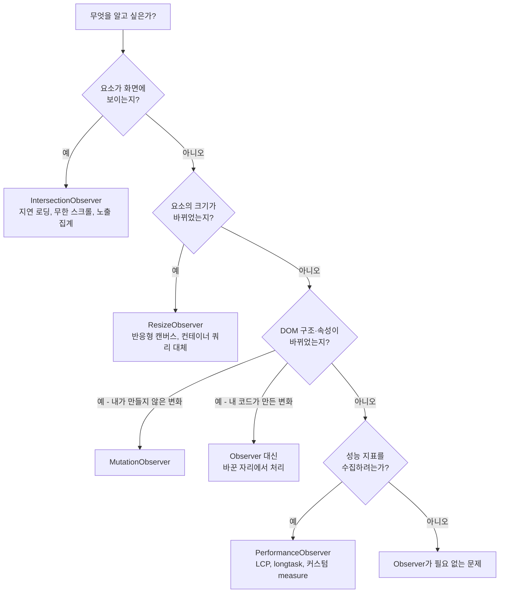

<Callout type="info">
  **이번 문서의 목표:** 이 파일을 다 읽으면 네 가지 Observer를 목적에 맞게 골라 쓰고, 콜백이 언제 어떤 순서로 불리는지 렌더 루프 위에서 설명할 수 있게 된다.
</Callout>

## 폴링이라는 원죄

"요소가 화면에 보이면 이미지를 불러오자." 이 요구를 Observer 없이 구현하면 이렇게 됩니다.

```js
// ❌ 아무도 이렇게 쓰면 안 되는 코드
window.addEventListener("scroll", () => {
  for (const 이미지 of 이미지목록) {
    const 위치 = 이미지.getBoundingClientRect();   // 레이아웃 강제 계산
    if (위치.top < window.innerHeight) 불러오기(이미지);
  }
});
```

문제가 겹겹입니다.

1. **스크롤 이벤트는 초당 수십 번 발생합니다.** 이미지가 200개면 한 번의 스크롤에 200번 계산합니다.
2. **`getBoundingClientRect` 호출은 레이아웃을 강제로 계산시킵니다.** 브라우저는 원래 레이아웃 계산을 미뤄 두었다가 한꺼번에 처리하는데, 이 함수는 "지금 당장 정확한 값을 내놔"라고 요구합니다. 이걸 **강제 동기 레이아웃**(forced synchronous layout) 또는 **레이아웃 스래싱**(layout thrashing)이라고 부릅니다(3편, 23편).
3. **메인 스레드에서 돌아갑니다.** 계산하는 동안 스크롤이 뚝뚝 끊깁니다.

무엇보다 근본 문제는 이겁니다. **브라우저는 이미 답을 알고 있습니다.** 레이아웃을 계산하는 것도, 요소가 화면에 들어온 것을 아는 것도 브라우저입니다. 그런데 우리는 "혹시 바뀌었나?"를 계속 물어보고 있습니다. 이런 방식을 **폴링**(polling, 되풀이 조회)이라고 합니다.

> **쉽게 말하면:** 폴링은 택배가 왔는지 1분마다 현관에 나가 보는 것이고, Observer는 초인종을 다는 것입니다.

Observer 패밀리는 이 관계를 뒤집습니다. **"바뀌면 네가 나한테 알려 줘."**

## 1. 네 Observer의 공통 뼈대

네 가지 Observer는 이름도 용도도 다르지만 **API 모양이 거의 똑같습니다.** 하나를 익히면 나머지는 거저입니다.

```js
// 1) 콜백을 주고 관측자를 만든다
const 관측자 = new XxxObserver((항목들, 관측자자신) => {
  for (const 항목 of 항목들) {
    // 무슨 일이 있었는지 처리
  }
});

// 2) 무엇을 볼지 등록한다
관측자.observe(대상, 옵션);

// 3) 그만 볼 때
관측자.unobserve(대상);   // 하나만
관측자.disconnect();       // 전부
```

여기에 세 가지 공통 성질이 있습니다.

**첫째, 콜백은 배열을 받습니다.** 변화 하나에 콜백 한 번이 아니라, 여러 변화를 **모아서**(batch) 한 번에 넘겨줍니다. 스크롤 한 번에 요소 10개가 화면에 들어오면 콜백은 1번 불리고 배열에 10개가 담깁니다. 폴링과 정반대의 효율입니다.

**둘째, 콜백은 비동기입니다.** 변화가 일어난 그 순간이 아니라 **적절한 시점에 뒤늦게** 불립니다. 이 "적절한 시점"이 Observer마다 달라서, 뒤에서 따로 다룹니다.

**셋째, 관측자는 대상을 강하게 붙잡습니다.** 관측 중인 요소가 DOM에서 제거돼도 관측자가 살아 있으면 메모리에서 해제되지 않을 수 있습니다. **컴포넌트가 사라질 때 `disconnect` 호출은 선택이 아니라 의무**입니다.

<Callout type="warning">
  **자주 틀리는 점:** `observe()`를 호출해 놓고 정리를 잊는 것입니다. 화면 전환이 잦은 SPA(Single Page Application, 단일 페이지 애플리케이션)에서 이 누수가 쌓이면, 이미 사라진 화면의 콜백이 계속 돌면서 없는 요소를 건드리다 오류를 뿜습니다. 관측 시작과 `disconnect`는 항상 짝으로 씁니다.
</Callout>

## 2. IntersectionObserver — 보이는가

### 무엇을 관측하는가

**IntersectionObserver**(교차 관측자)는 대상 요소가 **어떤 영역과 얼마나 겹치는지**를 알려 줍니다. 기본 영역은 뷰포트(viewport, 화면에 보이는 창)입니다.

```js
const 관측자 = new IntersectionObserver((항목들) => {
  for (const 항목 of 항목들) {
    if (항목.isIntersecting) {
      항목.target.src = 항목.target.dataset.실제주소;   // 지연 로딩
      관측자.unobserve(항목.target);                    // 한 번이면 충분
    }
  }
}, {
  root: null,              // null이면 뷰포트
  rootMargin: "200px",     // 영역을 200px 넓혀 미리 감지
  threshold: 0,            // 1픽셀이라도 겹치면 발동
});

document.querySelectorAll("img[data-실제주소]").forEach((이미지) => 관측자.observe(이미지));
```

옵션 셋이 전부이고, 각각이 중요합니다.

- **`root`** — 겹침을 판정할 기준 영역. `null`이면 뷰포트, 요소를 주면 그 요소의 스크롤 영역이 기준이 됩니다. 단, `root`는 대상의 **조상**이어야 합니다.
- **`rootMargin`** — 기준 영역을 CSS 마진 문법으로 부풀리거나 줄입니다. `"200px"`이면 화면에 들어오기 200픽셀 전에 미리 알려 줍니다. 이미지 지연 로딩에서 "보이는 순간 로딩 시작"이면 이미 늦으므로 이 값이 실질적으로 사용자 체감을 결정합니다.
- **`threshold`** — 얼마나 겹쳐야 알릴지의 비율. `0`은 1픽셀이라도, `1`은 완전히 들어와야, `[0, 0.5, 1]`처럼 배열을 주면 각 지점을 지날 때마다 알립니다.

콜백이 받는 항목에는 유용한 정보가 더 있습니다.

- `isIntersecting` — 지금 겹치고 있는가
- `intersectionRatio` — 겹친 비율 (0에서 1)
- `boundingClientRect`, `intersectionRect`, `rootBounds` — 각 사각형의 좌표
- `time` — 관측된 시각

여기서 결정적인 이점이 나옵니다. **이 사각형 값들은 브라우저가 이미 계산해 둔 것을 그대로 넘겨주는 것**입니다. `getBoundingClientRect()`처럼 레이아웃을 강제하지 않습니다. 폴링 대비 성능 차이의 절반은 여기서 옵니다.

### 직접 관측해 보기

아래 실습기에서 스크롤을 내리며 각 상자가 화면에 들어오고 나가는 것을 콘솔로 확인해 보세요. `threshold`와 `rootMargin` 값을 바꿔 가며 발동 시점이 어떻게 달라지는지 관찰하는 것이 핵심입니다.

<CodePlayground
  template="vanilla"
  activeFile="/index.js"
  showConsole
  label="IntersectionObserver로 화면 진입 관측 — 스크롤하며 콘솔을 보세요"
  files={{
    '/index.html': `<div id="설명">아래로 스크롤하면서 콘솔을 보세요</div>
<div id="목록"></div>`,
    '/index.js': `const 목록 = document.getElementById("목록");
document.body.style.cssText = "margin:0;font-family:sans-serif";
document.getElementById("설명").style.cssText =
  "position:sticky;top:0;background:#222;color:#fff;padding:12px;z-index:1";

// 상자 8개를 만든다
for (let i = 1; i <= 8; i++) {
  const 상자 = document.createElement("div");
  상자.textContent = "상자 " + i;
  상자.dataset.번호 = i;
  상자.style.cssText =
    "height:200px;margin:60px 20px;display:flex;align-items:center;" +
    "justify-content:center;background:#dde;border-radius:8px;font-size:24px;" +
    "transition:background .3s";
  목록.appendChild(상자);
}

// 이 값들을 바꿔 가며 발동 시점을 관찰해 보세요
const 옵션 = {
  root: null,          // 뷰포트 기준
  rootMargin: "0px",   // "200px"로 바꾸면 더 일찍 알려 준다
  threshold: [0, 0.5, 1],  // 0 / 절반 / 완전히 보일 때 각각 알림
};

const 관측자 = new IntersectionObserver((항목들) => {
  for (const 항목 of 항목들) {
    const 번호 = 항목.target.dataset.번호;
    const 비율 = Math.round(항목.intersectionRatio * 100);
    console.log(
      "상자 " + 번호 + " — 겹침 " + 비율 + "%",
      항목.isIntersecting ? "(보이는 중)" : "(안 보임)"
    );
    // 겹친 비율에 따라 색을 바꾼다
    항목.target.style.background =
      항목.intersectionRatio > 0.9 ? "#8fd18f"
      : 항목.intersectionRatio > 0 ? "#e8e0a0"
      : "#dde";
  }
}, 옵션);

document.querySelectorAll("#목록 div").forEach((상자) => 관측자.observe(상자));

// 관측 시작 직후에도 콜백이 한 번 불린다는 점을 확인해 보세요
console.log("관측 등록 완료 — 초기 상태 콜백이 곧 도착합니다");`,
  }}
/>

<Callout type="warning">
  **자주 틀리는 점:** `observe()`를 호출하면 **아무것도 변하지 않아도 콜백이 즉시 한 번 불립니다.** 초기 상태를 알려 주려는 설계인데, 이걸 모르면 "화면에 들어올 때 애니메이션"이 페이지 로드 순간 전부 터져 버립니다. 첫 호출인지 구분하거나 `isIntersecting`을 반드시 확인하세요.
</Callout>

## 3. ResizeObserver — 크기가 바뀌었는가

### window.resize로는 부족한 이유

요소 크기 변화를 감지하는 데 `window.addEventListener("resize")`를 쓰는 경우가 많은데, 이건 **창 크기가 바뀔 때만** 발생합니다. 실제로 요소 크기가 바뀌는 경우는 훨씬 많습니다.

- 옆 사이드바가 접혀서 본문이 넓어짐
- 내용이 길어져 높이가 늘어남
- CSS 그리드에서 형제 요소가 커져 밀려남
- 폰트가 늦게 로드되어 텍스트 폭이 변함

**ResizeObserver**(크기 관측자)는 이 전부를 잡습니다. 창은 그대로여도 요소 하나의 박스가 바뀌면 알려 줍니다.

```js
const 관측자 = new ResizeObserver((항목들) => {
  for (const 항목 of 항목들) {
    const { width, height } = 항목.contentRect;
    항목.target.dataset.크기 = Math.round(width) + " x " + Math.round(height);
  }
});
관측자.observe(document.querySelector("#차트"));
```

`observe`의 두 번째 인자로 어떤 박스를 볼지 고를 수 있습니다.

| `box` 값 | 관측 대상 | 의미 |
|----------|-----------|------|
| `content-box` (기본) | 콘텐츠 영역 | 패딩·테두리 제외 |
| `border-box` | 테두리까지 | 패딩·테두리 포함 |
| `device-pixel-content-box` | 실제 물리 픽셀 | 캔버스 선명도 계산용 |

마지막 것은 흔치 않지만 캔버스를 다룰 때 필수입니다. CSS 픽셀과 실제 화면 픽셀 비율(`devicePixelRatio`)이 다른 고해상도 화면에서, 캔버스를 물리 픽셀 수에 정확히 맞춰야 흐려지지 않기 때문입니다.

### 무한 루프 경고

ResizeObserver에는 고유한 함정이 있습니다. **콜백 안에서 관측 대상의 크기를 바꾸면** 그 변경이 다시 콜백을 부르고, 무한히 반복됩니다.

브라우저는 이걸 감지하면 `ResizeObserver loop completed with undelivered notifications`라는 오류를 콘솔에 냅니다. 화면이 완전히 멈추지는 않지만 렌더가 한 프레임 밀리며 깜빡임이 생깁니다.

```js
// ❌ 자기 자신을 키우면 루프
const 나쁨 = new ResizeObserver(([항목]) => {
  항목.target.style.height = 항목.contentRect.height + 10 + "px";
});

// ✅ 값이 실제로 달라질 때만 쓰거나, 다른 요소를 바꾼다
const 좋음 = new ResizeObserver(([항목]) => {
  const 새폭 = Math.round(항목.contentRect.width);
  if (항목.target.dataset.마지막폭 !== String(새폭)) {
    항목.target.dataset.마지막폭 = String(새폭);
    캔버스다시그리기(새폭);
  }
});
```

## 4. MutationObserver — DOM이 바뀌었는가

**MutationObserver**(변경 관측자)는 DOM 트리의 구조·속성·텍스트 변화를 감지합니다. 네 Observer 중 유일하게 **레이아웃이 아니라 DOM 자체**를 봅니다.

```js
const 관측자 = new MutationObserver((변경목록) => {
  for (const 변경 of 변경목록) {
    if (변경.type === "childList") {
      console.log("추가:", 변경.addedNodes.length, "삭제:", 변경.removedNodes.length);
    }
    if (변경.type === "attributes") {
      console.log(변경.attributeName, "이 바뀜, 이전값:", 변경.oldValue);
    }
  }
});

관측자.observe(대상요소, {
  childList: true,          // 자식 추가·삭제
  attributes: true,         // 속성 변경
  characterData: true,      // 텍스트 노드 내용 변경
  subtree: true,            // 후손 전체까지
  attributeOldValue: true,  // 이전 속성값도 담아 줘
  characterDataOldValue: true,
  attributeFilter: ["class", "data-상태"],   // 이 속성만 볼래
});
```

`childList`, `attributes`, `characterData` 중 **최소 하나는 반드시 `true`** 여야 합니다. 전부 빠지면 `TypeError`가 납니다.

### 언제 쓰는가 — 그리고 언제 쓰면 안 되는가

MutationObserver의 정직한 쓰임새는 **내가 통제할 수 없는 DOM 변화를 감지할 때**입니다.

- 서드파티 위젯이 삽입한 요소에 스타일을 덧입혀야 할 때
- 리치 텍스트 편집기의 `contenteditable` 안 변화를 추적할 때
- 웹 컴포넌트가 slot 내용 변화에 반응해야 할 때(22편)

반대로 **내 코드가 일으킨 변화를 감지하려고 쓰는 것은 거의 항상 설계 실수**입니다. 내가 바꿨으니 바꾼 그 자리에서 처리하면 됩니다. Observer를 거치면 코드의 인과관계가 보이지 않게 되고, 디버깅이 어려워집니다.

<Callout type="warning">
  **자주 틀리는 점:** 관측자 콜백 안에서 관측 대상 DOM을 다시 수정하는 것입니다. 그 수정이 또 콜백을 부릅니다. 필요하다면 `관측자.disconnect()` → 수정 → `관측자.takeRecords()`(밀린 기록 버리기) → 다시 `observe()` 순서를 지켜야 합니다.
</Callout>

## 5. PerformanceObserver — 성능 기록이 쌓였는가

나머지 셋과 결이 다릅니다. DOM이 아니라 **브라우저가 기록해 둔 성능 측정치**를 관측합니다.

```js
const 관측자 = new PerformanceObserver((목록) => {
  for (const 항목 of 목록.getEntries()) {
    console.log(항목.entryType, 항목.name, Math.round(항목.startTime), 항목.duration);
  }
});

관측자.observe({
  type: "largest-contentful-paint",
  buffered: true,     // 관측 등록 전에 이미 쌓인 기록도 달라
});
```

주요 `entryType`을 봅시다.

| 타입 | 알려 주는 것 |
|------|--------------|
| `largest-contentful-paint` | 가장 큰 콘텐츠가 그려진 시각 – 체감 로딩 속도 |
| `layout-shift` | 화면이 갑자기 밀린 정도 – 누적 레이아웃 이동 |
| `longtask` | 50밀리초 넘게 메인 스레드를 막은 작업 |
| `event` | 입력 반응이 느렸던 이벤트 |
| `resource` | 각 리소스의 로딩 타이밍 |
| `measure` | `performance.measure()`로 내가 직접 찍은 구간 |

**`buffered: true`** 옵션이 실무의 핵심입니다. 성능 측정치는 페이지 로드 초반에 발생하는데 스크립트가 실행되는 시점은 그 이후입니다. 이 옵션이 없으면 가장 중요한 초기 기록을 통째로 놓칩니다.

내 코드 구간을 직접 재는 것도 이 API 위에서 합니다.

```js
performance.mark("정렬시작");
큰배열정렬();
performance.mark("정렬끝");
performance.measure("정렬", "정렬시작", "정렬끝");
// entryType "measure"를 관측하면 이 구간이 넘어온다
```

`console.time`과 달리 **결과가 데이터로 남아** 서버로 보내 집계할 수 있다는 점이 다릅니다. 실사용자 성능 모니터링은 전부 이 위에서 만들어집니다.

## 6. 콜백은 정확히 언제 불리는가

네 Observer의 진짜 차이는 API가 아니라 **콜백 타이밍**입니다. 여기를 이해해야 "왜 값이 한 프레임 늦나" 같은 문제를 풀 수 있습니다.

브라우저의 한 프레임은 대략 이런 순서로 돌아갑니다.



정리하면 이렇습니다.

**MutationObserver는 마이크로태스크**입니다. `Promise.then`과 같은 층에서, 현재 스크립트가 끝나자마자 렌더링보다 **먼저** 불립니다. 그래서 화면이 그려지기 전에 DOM을 한 번 더 손볼 수 있습니다. 대신 무겁게 쓰면 렌더링이 그만큼 늦춰집니다.

**ResizeObserver는 레이아웃 직후, 페인트 직전**에 불립니다. 이 위치가 절묘합니다. 크기가 확정된 뒤이므로 정확한 값을 받고, 페인트 전이므로 여기서 스타일을 고치면 **깜빡임 없이 같은 프레임에 반영**됩니다. 무한 루프 경고가 나는 것도 이 위치 때문입니다 — 페인트 직전에 크기를 또 바꾸면 프레임을 마칠 수 없으니까요.

**IntersectionObserver는 판정만 렌더 단계에서 하고 콜백은 별도 태스크로 예약**됩니다. 즉 렌더 파이프라인을 막지 않습니다. 그 대신 **한 프레임 뒤에 도착할 수 있습니다.** 스크롤 위치를 정밀하게 따라가야 하는 용도에는 맞지 않고, "보이면 로드"처럼 약간 늦어도 되는 일에 맞습니다.

**PerformanceObserver는 기록이 쌓이면 별도 태스크로** 불립니다. 렌더 루프와 직접적인 관계가 없습니다.

### 그래서 무엇을 골라야 하는가



## 핵심 정리

- Observer 패밀리는 폴링을 뒤집은 도구다. 브라우저가 이미 계산해 둔 정보를 **모아서**(batch) 넘겨주므로, 이벤트 + `getBoundingClientRect` 조합이 일으키는 레이아웃 스래싱을 원천적으로 피한다.
- 네 Observer는 생성자에 콜백, `observe`/`unobserve`/`disconnect`라는 같은 뼈대를 공유하며, 대상을 강하게 붙잡으므로 **정리는 의무**다.
- IntersectionObserver는 `root`·`rootMargin`·`threshold` 세 옵션으로 판정 조건을 정하고, 등록 즉시 초기 콜백이 한 번 온다.
- ResizeObserver는 창이 아닌 **요소** 크기를 보며, 콜백에서 관측 대상 크기를 바꾸면 루프 경고가 난다. MutationObserver는 내가 통제하지 못하는 DOM 변화에만 쓴다.
- 타이밍이 성격을 결정한다. MutationObserver는 마이크로태스크(렌더 전), ResizeObserver는 레이아웃 직후·페인트 직전(같은 프레임 보정 가능), IntersectionObserver는 별도 태스크(한 프레임 늦을 수 있음)다.

## 마무리 복습

<Quiz
  questionNumber={1}
  question="스크롤 이벤트에서 getBoundingClientRect를 반복 호출하는 방식이 IntersectionObserver보다 나쁜 가장 본질적인 이유는?"
  options={['스크롤 이벤트가 최신 브라우저에서 지원되지 않기 때문', '레이아웃을 강제로 즉시 계산시키는 호출이 고빈도로 반복되어 메인 스레드를 막기 때문', 'getBoundingClientRect가 잘못된 좌표를 반환하기 때문', '스크롤 이벤트는 워커에서만 동작하기 때문']}
  correctAnswer={2}
  explanation="브라우저는 레이아웃 계산을 모아서 처리하려 하는데 getBoundingClientRect는 즉시 정확한 값을 요구해 강제 동기 레이아웃을 일으킨다. 이것이 초당 수십 번 반복되면 스크롤이 끊긴다. Observer는 브라우저가 이미 계산한 값을 넘겨받으므로 이 비용이 없다."
  optionExplanations={['스크롤 이벤트는 정상 지원된다', '정답 — 강제 동기 레이아웃의 고빈도 반복이 핵심 비용이다', '좌표 자체는 정확하다', '스크롤 이벤트는 메인 스레드의 것이다']}
/>

<Quiz
  questionNumber={2}
  question="IntersectionObserver의 rootMargin 옵션의 실질적인 용도는?"
  options={['관측 대상 요소에 CSS 마진을 적용한다', '판정 기준 영역을 넓히거나 좁혀, 화면에 들어오기 전에 미리 감지하게 한다', '겹침 비율의 임계값을 정한다', '관측을 시작할 지연 시간을 정한다']}
  correctAnswer={2}
  explanation="rootMargin은 root 영역을 CSS 마진 문법으로 부풀리거나 줄인다. 200px을 주면 요소가 화면에 들어오기 200픽셀 전에 콜백이 오므로, 지연 로딩에서 이미지가 제때 준비되게 만든다. 겹침 비율 임계값은 threshold의 역할이다."
  optionExplanations={['대상 요소의 스타일은 바뀌지 않는다', '정답 — 미리 감지가 지연 로딩의 체감을 좌우한다', '그것은 threshold다', '시간 지연 옵션은 없다']}
/>

<Quiz
  questionNumber={3}
  question="observer.observe(요소)를 호출한 직후, 아무 변화가 없어도 IntersectionObserver 콜백이 한 번 불리는 이유는?"
  options={['버그이므로 무시해야 한다', '현재 교차 상태를 초기값으로 알려 주기 위한 의도된 설계다', 'threshold 배열의 길이만큼 호출되는 것이다', 'disconnect를 호출하지 않았기 때문이다']}
  correctAnswer={2}
  explanation="초기 상태 전달은 의도된 동작이다. 이를 모르면 화면 진입 애니메이션이 페이지 로드 순간 모두 발동하는 문제가 생기므로, isIntersecting을 확인하거나 첫 호출을 구분해야 한다."
  optionExplanations={['버그가 아니라 스펙에 정의된 동작이다', '정답 — 초기 상태를 알려 주는 설계다', 'threshold 개수와는 무관하다', 'disconnect 여부와 무관하다']}
/>

<Quiz
  questionNumber={4}
  question="window의 resize 이벤트 대신 ResizeObserver를 써야 하는 상황은?"
  options={['브라우저 창 크기가 바뀔 때만 반응하면 되는 경우', '사이드바가 접혀 본문 영역만 넓어지는 것처럼, 창은 그대로인데 특정 요소의 크기가 바뀌는 경우', '스크롤 위치를 추적해야 하는 경우', 'DOM에 새 노드가 추가되는지 알아야 하는 경우']}
  correctAnswer={2}
  explanation="resize 이벤트는 창 크기 변화에만 발생한다. 사이드바 접힘, 콘텐츠 증가, 폰트 지연 로딩 등으로 요소 크기만 바뀌는 경우는 ResizeObserver로만 감지할 수 있다."
  optionExplanations={['그 경우라면 resize 이벤트로 충분하다', '정답 — 요소 단위 크기 변화가 ResizeObserver의 영역이다', '스크롤 추적은 다른 문제다', '노드 추가 감지는 MutationObserver의 일이다']}
/>

<Quiz
  questionNumber={5}
  question="ResizeObserver 콜백 안에서 관측 대상의 높이를 매번 늘리는 코드를 작성하면 일어나는 일은?"
  options={['첫 번째 변경만 반영되고 이후는 무시된다', '크기 변경이 다시 콜백을 부르는 루프가 생겨 브라우저가 루프 경고를 내고 렌더가 한 프레임씩 밀린다', '관측이 자동으로 해제된다', '아무 문제 없이 정상 동작한다']}
  correctAnswer={2}
  explanation="ResizeObserver 콜백은 레이아웃 직후 페인트 직전에 불린다. 이 시점에 대상 크기를 다시 바꾸면 그 변경이 또 콜백을 부르고, 프레임을 마칠 수 없어 브라우저가 루프 경고를 발생시킨다. 값이 실제로 달라졌을 때만 처리하도록 가드를 두어야 한다."
  optionExplanations={['이후 변경도 계속 콜백을 부른다', '정답 — 콜백 타이밍이 페인트 직전이라 루프가 된다', '자동 해제 기능은 없다', '깜빡임과 경고가 발생한다']}
/>

<Quiz
  questionNumber={6}
  question="네 Observer의 콜백 타이밍 설명으로 옳은 것은?"
  options={['모두 렌더링과 무관하게 즉시 동기적으로 호출된다', 'MutationObserver는 마이크로태스크로 렌더 전에, ResizeObserver는 레이아웃 직후 페인트 직전에 호출된다', 'IntersectionObserver 콜백은 항상 같은 프레임 안에서 반드시 처리된다', 'PerformanceObserver는 rAF 콜백과 같은 시점에 호출된다']}
  correctAnswer={2}
  explanation="MutationObserver는 Promise.then과 같은 마이크로태스크 층에서 렌더링 전에 불리고, ResizeObserver는 레이아웃이 끝난 뒤 페인트 직전에 불려 같은 프레임 안에서 보정이 가능하다. IntersectionObserver는 판정만 렌더 단계에서 하고 콜백은 별도 태스크로 예약되어 한 프레임 늦을 수 있다."
  optionExplanations={['모든 Observer 콜백은 비동기다', '정답 — 타이밍 차이가 각 Observer의 성격을 만든다', '별도 태스크로 예약되어 늦을 수 있다', 'PerformanceObserver는 렌더 루프와 직접 연결되지 않는다']}
/>

<Quiz
  questionNumber={7}
  question="PerformanceObserver에서 buffered: true 옵션이 중요한 이유는?"
  options={['콜백 호출 빈도를 줄여 주기 때문', '관측을 등록하기 전에 이미 기록된 초기 성능 항목까지 받아 볼 수 있기 때문', '측정 정확도를 밀리초 단위로 높여 주기 때문', '워커에서도 동작하게 해 주기 때문']}
  correctAnswer={2}
  explanation="가장 큰 콘텐츠 페인트 같은 핵심 지표는 페이지 로드 초반에 기록되는데 스크립트 실행은 그보다 늦다. buffered 옵션이 없으면 이 초기 기록을 통째로 놓친다."
  optionExplanations={['호출 빈도 조절 옵션이 아니다', '정답 — 등록 이전의 기록을 회수하는 옵션이다', '정확도와는 무관하다', '워커 지원 여부와 무관하다']}
/>

<Quiz
  questionNumber={8}
  question="MutationObserver를 사용하기에 부적절한 경우는?"
  options={['서드파티 위젯이 삽입한 요소를 감지해 스타일을 덧입힐 때', 'contenteditable 영역의 사용자 입력에 따른 DOM 변화를 추적할 때', '내 코드에서 직접 appendChild한 요소를 감지해 후처리할 때', '외부 스크립트가 특정 속성을 바꾸는지 감시할 때']}
  correctAnswer={3}
  explanation="내 코드가 일으킨 변화는 그 자리에서 바로 처리하면 된다. Observer를 경유하면 인과관계가 코드에서 사라져 디버깅이 어려워지고 불필요한 콜백 비용만 늘어난다. Observer는 통제할 수 없는 외부 변화를 감지할 때 쓴다."
  optionExplanations={['통제 밖의 변화라 적절한 사용이다', '입력에 따른 변화 추적은 대표적 용도다', '정답 — 내가 만든 변화는 그 자리에서 처리한다', '외부 스크립트 감시는 적절한 사용이다']}
/>

## 참고 자료

- [MDN - Intersection Observer API](https://developer.mozilla.org/en-US/docs/Web/API/Intersection_Observer_API)
- [MDN - ResizeObserver](https://developer.mozilla.org/en-US/docs/Web/API/ResizeObserver)
- [MDN - MutationObserver](https://developer.mozilla.org/en-US/docs/Web/API/MutationObserver)
- [MDN - PerformanceObserver](https://developer.mozilla.org/en-US/docs/Web/API/PerformanceObserver)
- [MDN - Populating the page: how browsers work](https://developer.mozilla.org/en-US/docs/Web/Performance/Guides/How_browsers_work)
