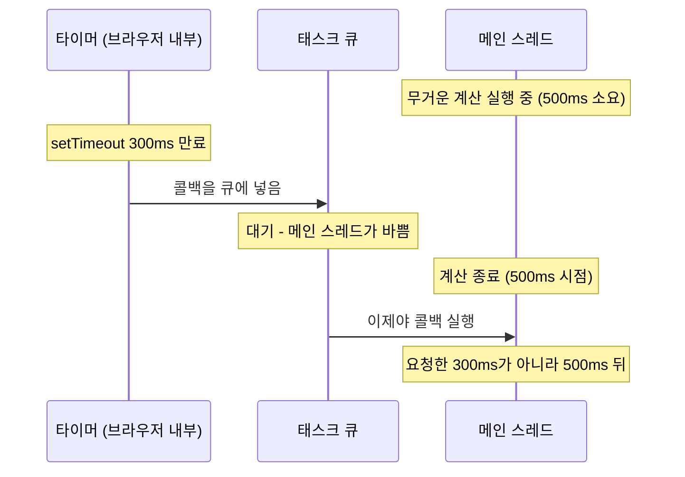
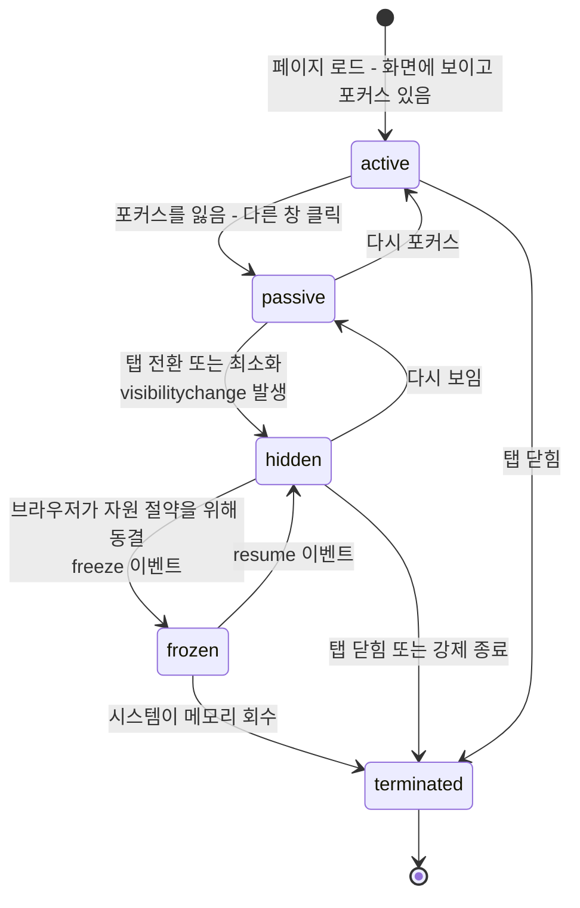
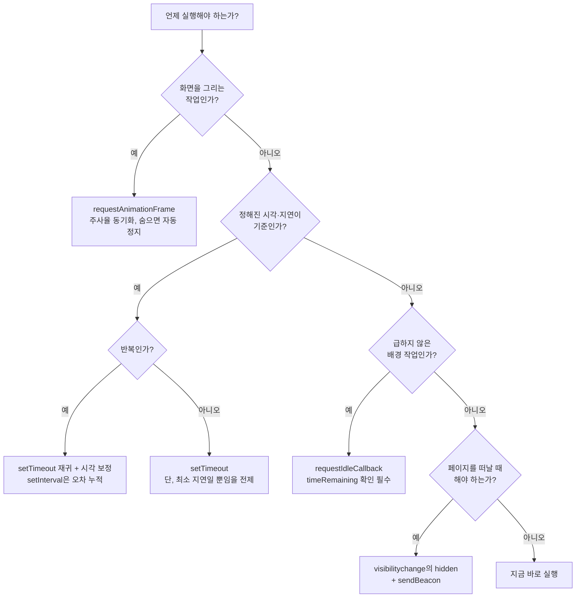

<Callout type="info">
  **이번 문서의 목표:** 이 파일을 다 읽으면 "언제 실행할 것인가"를 타이머·렌더 루프·유휴 시간·생명주기 상태라는 네 축으로 나눠 판단하고, 각 도구의 오차와 제약을 근거로 고를 수 있게 된다.
</Callout>

## 시점을 통제한다는 문제

자바스크립트로 화면을 다루다 보면 "지금 말고 나중에"가 계속 필요합니다. 그런데 이 "나중에"가 한 종류가 아닙니다.

- **0.3초 뒤에** 툴팁을 보여 줘 → 시계 기준
- **화면을 다시 그리기 직전에** 위치를 갱신해 줘 → 렌더 루프 기준
- **급하지 않으니 한가할 때** 로그를 정리해 줘 → 유휴 시간 기준
- **사용자가 탭을 떠날 때** 작성 중인 글을 저장해 줘 → 생명주기 기준

이 네 가지에 각각 다른 도구가 있고, 잘못 고르면 배터리를 태우거나, 애니메이션이 끊기거나, 데이터를 잃습니다. 이번 편은 네 축을 차례로 다룹니다.

## 1. setTimeout과 setInterval — 정확하지 않다

### 사실은 "최소 지연"이다

`setTimeout(콜백, 300)`은 "300밀리초 뒤에 실행"이 아닙니다. 스펙이 보장하는 것은 **"최소 300밀리초가 지나기 전에는 실행하지 않는다"** 뿐입니다. 실제 실행은 300보다 늦습니다. 항상 늦습니다.

이유는 자바스크립트의 실행 모델에 있습니다. 브라우저의 메인 스레드는 **한 번에 하나의 태스크**만 처리합니다. 타이머가 만료되면 콜백이 곧장 실행되는 게 아니라 **태스크 큐**(task queue, 작업 대기줄)에 들어가고, 이벤트 루프는 **현재 실행 중인 태스크가 완전히 끝난 뒤에야** 큐에서 다음 것을 꺼냅니다.



> **쉽게 말하면:** `setTimeout`은 알람이 아니라 **번호표**입니다. 300밀리초 뒤에 줄을 서겠다는 뜻이지, 그때 처리된다는 뜻이 아닙니다.

### 오차를 만드는 다른 요인들

메인 스레드 혼잡 외에도 지연 요인이 몇 가지 더 있습니다.

**중첩 타이머 4밀리초 하한.** `setTimeout`이 5단계 이상 중첩되면 브라우저가 최소 지연을 **4밀리초로 강제**합니다. `setTimeout(f, 0)`을 재귀로 부르면 0이 아니라 4밀리초씩 걸립니다. 스펙에 명시된 동작으로, 무한 재귀 타이머가 CPU를 태우는 것을 막기 위한 안전장치입니다.

**백그라운드 탭 스로틀링.** 탭이 보이지 않으면 브라우저가 타이머를 **초당 1회 수준으로 줄입니다.** 배터리를 아끼기 위해서입니다. 심지어 오래 백그라운드에 있으면 분당 1회까지 내려가기도 합니다.

**타이머 해상도 제한.** 보안 때문에 브라우저는 시간 측정 정밀도를 일부러 낮춥니다. `Date.now()`의 흔들림이나 `performance.now()`의 반올림이 여기서 옵니다. 정밀 타이밍으로 다른 사이트의 정보를 추측하는 공격(타이밍 공격)을 막기 위한 조치입니다.

### 직접 재 보기

말로 설명하는 것보다 재 보는 편이 확실합니다. 아래 실습기는 요청한 지연과 실제 지연의 차이를 여러 조건에서 측정합니다.

<CodePlayground
  template="vanilla"
  activeFile="/index.js"
  showConsole
  label="setTimeout 지연 오차 직접 측정하기 — 콘솔을 보세요"
  files={{
    '/index.js': `// performance.now()는 페이지 시작 시각 기준의 고정밀 밀리초 값이다.
// Date.now()와 달리 시스템 시계 변경의 영향을 받지 않는다.

function 지연측정(요청지연) {
  return new Promise((성공) => {
    const 시작 = performance.now();
    setTimeout(() => {
      const 실제 = performance.now() - 시작;
      성공({ 요청: 요청지연, 실제: Math.round(실제 * 100) / 100 });
    }, 요청지연);
  });
}

async function 실험() {
  // ── 실험 1: 한가할 때의 오차 ──────────────────────
  console.log("=== 실험 1: 메인 스레드가 한가할 때 ===");
  for (const 지연 of [0, 1, 10, 50, 100]) {
    const 결과 = await 지연측정(지연);
    console.log(
      "요청 " + 결과.요청 + "ms → 실제 " + 결과.실제 + "ms" +
      " (오차 +" + Math.round((결과.실제 - 결과.요청) * 100) / 100 + "ms)"
    );
  }

  // ── 실험 2: 메인 스레드가 바쁠 때 ─────────────────
  console.log("=== 실험 2: 300ms 요청 직후 500ms짜리 계산을 실행 ===");
  const 시작 = performance.now();
  setTimeout(() => {
    console.log(
      "요청 300ms → 실제 " + Math.round(performance.now() - 시작) + "ms" +
      " ← 앞의 계산이 끝날 때까지 큐에서 대기했다"
    );
  }, 300);

  // 메인 스레드를 500ms 동안 통째로 점유하는 바쁜 대기
  const 끝날때까지 = performance.now() + 500;
  let 합 = 0;
  while (performance.now() < 끝날때까지) 합 += Math.random();

  // ── 실험 3: 중첩 타이머의 4ms 하한 ────────────────
  await new Promise((성공) => setTimeout(성공, 600));
  console.log("=== 실험 3: setTimeout(f, 0)을 10번 중첩 ===");
  let 횟수 = 0;
  let 직전 = performance.now();
  const 간격들 = [];
  function 재귀() {
    const 지금 = performance.now();
    간격들.push(Math.round((지금 - 직전) * 100) / 100);
    직전 = 지금;
    if (++횟수 < 10) {
      setTimeout(재귀, 0);
    } else {
      console.log("0ms를 요청했을 때의 실제 간격들:", 간격들.join(", "));
      console.log("5단계 이후부터 약 4ms 하한이 걸리는 것을 확인하세요");
    }
  }
  setTimeout(재귀, 0);
}

실험();`,
  }}
/>

### setInterval의 누적 문제

`setInterval(콜백, 1000)`은 1초마다 부르지만, 콜백이 오래 걸리면 문제가 생깁니다. 브라우저는 **콜백 실행 시간을 빼 주지 않습니다.** 콜백이 200밀리초 걸리면 실질 주기는 1.2초가 되고, 이 오차가 계속 누적됩니다. 한 시간이면 12분이 밀립니다.

게다가 콜백이 주기보다 오래 걸리면 **큐에 밀린 콜백이 쌓입니다.** 메인 스레드가 잠깐 풀리는 순간 밀린 것들이 연달아 터져 나옵니다.

해결책은 **`setTimeout` 재귀 + 실제 경과 시간 보정**입니다.

```js
// ❌ 오차가 누적된다
setInterval(갱신, 1000);

// ✅ 매번 다음 목표 시각을 계산해 보정한다
let 다음시각 = performance.now() + 1000;

function 반복() {
  갱신();
  다음시각 += 1000;
  const 남은시간 = Math.max(0, 다음시각 - performance.now());
  setTimeout(반복, 남은시간);
}
setTimeout(반복, 1000);
```

이 방식은 콜백이 늦어져도 **다음 호출을 앞당겨** 전체 일정을 목표에 맞춥니다. 시계처럼 절대 시각이 중요한 곳에서는 이 패턴이 필수입니다.

<Callout type="warning">
  **자주 틀리는 점:** 카운트다운 타이머를 `setInterval`로 만들고 매번 `남은초 -= 1`을 하는 방식입니다. 백그라운드 탭에서 스로틀링되면 카운트가 실제 시간보다 훨씬 느리게 흐릅니다. 남은 시간은 **매번 목표 시각과 현재 시각의 차이로 다시 계산**해야 합니다. 세는 게 아니라 재는 것입니다.
</Callout>

## 2. requestAnimationFrame — 렌더에 맞추기

### 왜 타이머로 애니메이션을 만들면 안 되는가

화면은 보통 초당 60번 갱신됩니다. 그러면 `setInterval(그리기, 16)`이면 되지 않을까요? 안 됩니다.

**첫째, 주기가 어긋납니다.** 화면 갱신 주기가 정확히 16.67밀리초인데 16으로 맞추면 서서히 위상이 밀립니다. 어떤 프레임은 두 번 그려지고 어떤 프레임은 건너뛰어져 **끊기는 느낌**(jank, 잰크)이 납니다. 게다가 요즘 기기는 120Hz, 144Hz도 흔해서 16이라는 숫자 자체가 틀립니다.

**둘째, 안 보이는데도 계속 그립니다.** 탭이 백그라운드로 가도 타이머는 (스로틀링되지만) 계속 돕니다. 보이지도 않는 화면을 그리며 배터리를 씁니다.

**셋째, 그리는 시점이 렌더와 무관합니다.** 브라우저가 페인트하기 직전에 값을 바꿔야 그 프레임에 반영되는데, 타이머는 아무 때나 실행되므로 한 프레임 늦게 반영되기도 합니다.

**requestAnimationFrame**(줄여서 rAF, 애니메이션 프레임 요청)은 셋을 전부 해결합니다. **브라우저가 다음 프레임을 그리기 직전에** 콜백을 불러 줍니다.

```js
function 프레임(시각) {
  // 시각: 이 프레임의 렌더 시작 시각 (performance.now()와 같은 기준)
  요소.style.transform = "translateX(" + 위치계산(시각) + "px)";
  requestAnimationFrame(프레임);   // 다음 프레임 예약
}
requestAnimationFrame(프레임);
```

세 가지 이점이 자동으로 따라옵니다.

- **화면 주사율에 자동 동기화됩니다.** 60Hz면 초당 60번, 120Hz면 120번 불립니다.
- **탭이 안 보이면 완전히 멈춥니다.** 배터리를 쓰지 않습니다. 다시 보이면 알아서 재개됩니다.
- **콜백은 스타일·레이아웃 계산 직전**에 불리므로, 여기서 바꾼 값은 그 프레임에 반영됩니다.

### 시각 인자를 반드시 써라

rAF 콜백은 인자로 **그 프레임의 시각**을 받습니다. 이 값을 쓰지 않고 "한 프레임마다 1픽셀"식으로 짜면, 60Hz 기기와 120Hz 기기에서 애니메이션 속도가 두 배 차이 납니다.

```js
// ❌ 프레임 수에 의존 — 기기마다 속도가 다르다
let x = 0;
function 프레임() {
  x += 2;
  요소.style.transform = "translateX(" + x + "px)";
  requestAnimationFrame(프레임);
}

// ✅ 경과 시간에 의존 — 어디서나 같은 속도
let 시작 = null;
function 프레임(시각) {
  if (시작 === null) 시작 = 시각;
  const 경과 = 시각 - 시작;
  const x = Math.min(300, 경과 * 0.2);   // 초당 200픽셀
  요소.style.transform = "translateX(" + x + "px)";
  if (x < 300) requestAnimationFrame(프레임);
}
requestAnimationFrame(프레임);
```

### 애니메이션 직접 돌려 보기

<CodePlayground
  template="vanilla"
  activeFile="/index.js"
  showConsole
  label="rAF 애니메이션 — 시간 기반과 프레임 기반의 차이, 그리고 실제 프레임 간격 측정"
  files={{
    '/index.html': `<div id="무대"></div>
<button id="시작">다시 실행</button>`,
    '/index.js': `document.body.style.cssText = "font-family:sans-serif;padding:16px";
const 무대 = document.getElementById("무대");
무대.style.cssText = "position:relative;height:160px;background:#f2f2f7;border-radius:8px;overflow:hidden";

function 공만들기(색, 위) {
  const 공 = document.createElement("div");
  공.style.cssText =
    "position:absolute;top:" + 위 + "px;left:0;width:40px;height:40px;" +
    "border-radius:50%;background:" + 색;
  무대.appendChild(공);
  return 공;
}

const 시간기반 = 공만들기("#4a7dff", 20);
const 프레임기반 = 공만들기("#ff6b6b", 90);

const 라벨 = document.createElement("p");
라벨.textContent = "파랑: 시간 기반(경과 시간 사용) / 빨강: 프레임 기반(프레임마다 고정 픽셀)";
라벨.style.fontSize = "13px";
document.body.appendChild(라벨);

function 실행() {
  let 시작시각 = null;
  let 프레임x = 0;
  let 프레임수 = 0;
  const 간격들 = [];
  let 직전시각 = null;

  function 프레임(시각) {
    if (시작시각 === null) 시작시각 = 시각;
    if (직전시각 !== null) 간격들.push(시각 - 직전시각);
    직전시각 = 시각;
    프레임수++;

    // 파랑: 경과 시간에 비례 — 초당 200px
    const 경과 = 시각 - 시작시각;
    const 시간x = Math.min(260, 경과 * 0.2);
    시간기반.style.transform = "translateX(" + 시간x + "px)";

    // 빨강: 프레임마다 3.33px — 주사율이 다르면 속도가 달라진다
    프레임x = Math.min(260, 프레임x + 3.33);
    프레임기반.style.transform = "translateX(" + 프레임x + "px)";

    if (시간x < 260 || 프레임x < 260) {
      requestAnimationFrame(프레임);
    } else {
      const 평균 = 간격들.reduce((a, b) => a + b, 0) / 간격들.length;
      console.log("총 프레임 수:", 프레임수);
      console.log("평균 프레임 간격:", Math.round(평균 * 100) / 100 + "ms");
      console.log("추정 주사율:", Math.round(1000 / 평균) + "Hz");
      console.log("이 기기에서는 두 공이 비슷하게 도착했지만,");
      console.log("주사율이 다른 기기에서는 빨간 공의 속도가 달라집니다.");
    }
  }
  requestAnimationFrame(프레임);
}

document.getElementById("시작").onclick = () => {
  시간기반.style.transform = "translateX(0)";
  프레임기반.style.transform = "translateX(0)";
  실행();
};
실행();`,
  }}
/>

<Callout type="warning">
  **자주 틀리는 점:** rAF 콜백 안에서 `getBoundingClientRect()`나 `offsetHeight` 같은 값을 읽고 곧바로 스타일을 쓰고, 다시 읽는 것을 반복하는 것입니다. 읽기와 쓰기가 번갈아 나오면 브라우저가 매번 레이아웃을 다시 계산해야 합니다(레이아웃 스래싱). **읽기를 전부 먼저 하고, 쓰기를 전부 나중에** 하는 것이 원칙입니다. 자세한 패턴은 23편에서 다룹니다.
</Callout>

## 3. requestIdleCallback — 한가할 때 하기

애니메이션도 아니고 급하지도 않은 일이 있습니다. 분석 로그 전송, 캐시 정리, 다음 페이지 프리페치 같은 것들입니다. 이런 것을 프레임 사이에 끼워 넣으면 사용자 조작이 끊깁니다.

**requestIdleCallback**(유휴 콜백 요청)은 브라우저가 **한 프레임을 다 처리하고 시간이 남았을 때** 콜백을 불러 줍니다.

```js
function 유휴처리(마감) {
  // 마감.timeRemaining(): 남은 여유 시간(ms). 보통 최대 50ms.
  // 마감.didTimeout: timeout이 지나 강제로 불렸는지
  while (마감.timeRemaining() > 0 && 할일목록.length > 0) {
    처리(할일목록.shift());
  }
  if (할일목록.length > 0) {
    requestIdleCallback(유휴처리, { timeout: 2000 });   // 남은 것은 다음 유휴 시간에
  }
}

// 2초 안에 여유가 안 나면 강제로라도 실행
requestIdleCallback(유휴처리, { timeout: 2000 });
```

핵심은 **`timeRemaining` 값을 매 반복마다 확인**하는 것입니다. 남은 시간을 무시하고 큰 작업을 통째로 하면, 유휴 시간에 시작했더라도 다음 프레임을 밀어 버립니다. 유휴 콜백은 "짧게 나눠 여러 번" 처리하는 구조로 써야 의미가 있습니다.

`timeout` 옵션도 중요합니다. 페이지가 계속 바쁘면 유휴 시간이 영영 오지 않을 수 있습니다. `timeout`을 주면 그 시간 안에 여유가 없어도 강제로 불러 줍니다.

<Callout type="warning">
  **자주 틀리는 점:** `requestIdleCallback`으로 DOM을 수정하는 것입니다. 유휴 콜백은 프레임을 다 그린 **뒤에** 불리므로, 여기서 DOM을 바꾸면 스타일·레이아웃이 다시 필요해져 다음 프레임을 지연시킵니다. DOM 변경은 rAF에서, 유휴 콜백에서는 **순수 계산이나 네트워크 전송**만 하세요.
</Callout>

## 4. Page Lifecycle — 탭은 살아 있기만 하지 않는다

### 페이지는 여러 상태를 오간다

지금까지는 페이지가 계속 실행 중이라고 가정했습니다. 하지만 실제로 브라우저 탭은 여러 상태를 오갑니다. 모바일에서는 특히 그렇습니다 — 메모리가 부족하면 운영체제가 백그라운드 탭을 **경고 없이 종료**합니다.



각 상태의 의미를 짚습니다.

- **active** — 보이고 포커스도 있습니다. 타이머·rAF 모두 정상입니다.
- **passive** — 보이지만 포커스가 없습니다. 사용자가 다른 창을 보고 있습니다. rAF는 계속 돕니다.
- **hidden** — 보이지 않습니다. **rAF가 멈추고 타이머가 스로틀링됩니다.**
- **frozen** — 브라우저가 자원을 아끼려고 태스크 실행을 통째로 정지시킨 상태입니다. 타이머도 rAF도 아무것도 돌지 않습니다.
- **terminated** — 페이지가 사라졌습니다. **이 전이에는 실행 기회가 없습니다.**

### 감지할 수 있는 마지막 순간은 hidden이다

여기가 실무에서 가장 중요한 지점입니다. 사용자가 탭을 닫거나, 모바일에서 홈 버튼을 누르거나, 운영체제가 탭을 죽일 때 — **`unload`나 `beforeunload` 이벤트는 발생하지 않을 수 있습니다.** 특히 모바일에서는 거의 발생하지 않습니다.

반면 `visibilitychange`로 `hidden`이 되는 것은 **거의 항상 발생합니다.** 종료로 가는 모든 경로가 `hidden`을 거치기 때문입니다.

```js
document.addEventListener("visibilitychange", () => {
  if (document.visibilityState === "hidden") {
    // 여기가 상태를 저장할 마지막 확실한 기회다
    저장하기();
  }
});
```

> **쉽게 말하면:** `hidden`은 "잠시 자리를 비웁니다"가 아니라 **"어쩌면 영영 못 돌아올 수도 있습니다"** 로 취급해야 합니다.

<Callout type="warning">
  **자주 틀리는 점:** `beforeunload`에 저장 로직을 넣는 것입니다. 모바일에서 발생하지 않을 뿐 아니라, 이 이벤트를 등록하는 것만으로 브라우저의 **뒤로/앞으로 캐시**(bfcache)가 비활성화됩니다. bfcache는 페이지를 통째로 메모리에 얼려 두었다가 뒤로 가기 시 즉시 복원하는 최적화인데, 이를 잃으면 뒤로 가기가 눈에 띄게 느려집니다. `beforeunload`는 "저장하지 않은 변경이 있으니 정말 나가시겠습니까" 확인창이 꼭 필요할 때만 쓰고, 그때도 조건부로 등록합니다.
</Callout>

### hidden에서 데이터를 확실히 보내는 법

`hidden` 시점에 서버로 데이터를 보낼 때 일반 `fetch`는 위험합니다. 요청이 날아가는 도중 페이지가 종료되면 브라우저가 요청을 취소해 버립니다.

두 가지 해법이 있습니다.

```js
// 1) sendBeacon — 페이지가 죽어도 브라우저가 대신 끝까지 보내 준다
navigator.sendBeacon("/api/로그", JSON.stringify(데이터));

// 2) fetch의 keepalive 옵션 — 헤더 설정이 필요할 때
fetch("/api/로그", {
  method: "POST",
  body: JSON.stringify(데이터),
  keepalive: true,
  headers: { "Content-Type": "application/json" },
});
```

`sendBeacon`은 **동기적으로 큐에 넣고 즉시 반환**하며, 실제 전송은 브라우저가 페이지와 무관하게 완료합니다. 응답을 읽을 수 없다는 제약이 있지만 로그 전송에는 문제가 없습니다. `keepalive`도 같은 성질이며, 둘 다 **본문 크기 상한이 약 64KB**입니다.

### bfcache와 pageshow · pagehide

브라우저는 뒤로 가기를 빠르게 하려고 페이지를 통째로 얼려 둡니다. 이것이 **bfcache**(back/forward cache)입니다. 얼렸다 녹이는 것이므로, 복원된 페이지는 **자바스크립트 상태가 그대로 살아 있습니다.** 새로 로드된 게 아닙니다.

여기서 흔한 버그가 생깁니다. `DOMContentLoaded`나 `load`에 초기화 로직을 넣어 두면, bfcache로 복원될 때는 **다시 실행되지 않습니다.** 오래된 데이터가 그대로 보입니다.

```js
window.addEventListener("pageshow", (이벤트) => {
  if (이벤트.persisted) {
    // bfcache에서 복원됨 — 상태가 낡았을 수 있다
    데이터다시가져오기();
  }
});

window.addEventListener("pagehide", (이벤트) => {
  if (이벤트.persisted) {
    // bfcache로 들어감 — 나중에 되살아난다
  } else {
    // 정말 종료됨
  }
});
```

### 네 도구의 선택 기준



## 핵심 정리

- `setTimeout`의 지연은 보장이 아니라 **최소값**이다. 메인 스레드 혼잡, 중첩 시 4밀리초 하한, 백그라운드 스로틀링, 보안상 해상도 제한이 겹쳐 항상 늦게 온다.
- `setInterval`은 콜백 실행 시간을 빼 주지 않아 오차가 누적된다. 정확한 주기가 필요하면 **`setTimeout` 재귀 + 목표 시각 보정**을 쓰고, 남은 시간은 세지 말고 재라.
- `requestAnimationFrame`은 렌더 직전에 불려 주사율에 자동 동기화되고 탭이 숨으면 멈춘다. 콜백의 **시각 인자로 경과 시간을 계산**해야 기기별 속도 차이가 사라진다.
- `requestIdleCallback`은 프레임에 여유가 있을 때만 불린다. `timeRemaining()`을 확인하며 잘게 나눠 처리하고, DOM 수정은 하지 않는다. 굶주림 방지를 위해 `timeout`을 준다.
- 페이지는 active → passive → hidden → frozen → terminated를 오간다. **확실히 실행 기회가 있는 마지막 지점은 `hidden`** 이며, 전송은 `sendBeacon`이나 `keepalive`로 한다. `beforeunload`는 bfcache를 깨뜨리므로 피한다.

## 마무리 복습

<Quiz
  questionNumber={1}
  question="setTimeout에 300을 넘겼을 때 스펙이 보장하는 것은?"
  options={['정확히 300밀리초 뒤에 실행된다', '최소 300밀리초가 지나기 전에는 실행되지 않는다', '300밀리초 이내에 반드시 실행된다', '메인 스레드가 바빠도 다른 작업을 중단하고 실행된다']}
  correctAnswer={2}
  explanation="타이머 만료 시 콜백은 태스크 큐에 들어갈 뿐이고, 이벤트 루프는 현재 태스크가 끝난 뒤에야 꺼내 실행한다. 따라서 요청한 지연은 하한이며 실제 실행은 항상 그보다 늦다."
  optionExplanations={['메인 스레드 상태에 따라 늦어진다', '정답 — 최소 지연을 보장할 뿐이다', '오히려 그보다 늦게 실행되는 것이 정상이다', '자바스크립트는 실행 중인 태스크를 선점하지 않는다']}
/>

<Quiz
  questionNumber={2}
  question="setInterval 대신 setTimeout 재귀에 목표 시각 보정을 넣는 방식이 나은 이유는?"
  options={['setInterval은 최신 브라우저에서 제거되었기 때문', 'setInterval은 콜백 실행 시간을 주기에서 빼 주지 않아 오차가 누적되고, 콜백이 주기보다 길면 밀린 호출이 쌓이기 때문', 'setTimeout이 항상 더 정확한 시각에 실행되기 때문', 'setInterval은 백그라운드 탭에서 아예 실행되지 않기 때문']}
  correctAnswer={2}
  explanation="setInterval은 고정 간격으로 예약할 뿐 콜백 소요 시간을 보정하지 않아 오차가 계속 쌓인다. 매번 다음 목표 시각과 현재 시각의 차이로 지연을 다시 계산하면 전체 일정을 목표에 맞출 수 있다."
  optionExplanations={['setInterval은 여전히 표준 API다', '정답 — 오차 누적과 콜백 적체가 문제다', 'setTimeout도 최소 지연일 뿐 정확하지 않다', '아예 멈추는 것이 아니라 스로틀링된다']}
/>

<Quiz
  questionNumber={3}
  question="애니메이션을 setInterval(그리기, 16) 대신 requestAnimationFrame으로 만들어야 하는 이유로 보기 어려운 것은?"
  options={['화면 주사율에 자동으로 동기화된다', '탭이 보이지 않으면 호출이 멈춰 배터리를 아낀다', '콜백이 렌더 직전에 불려 그 프레임에 변경이 반영된다', '콜백 안에서 레이아웃 값을 읽어도 강제 레이아웃이 발생하지 않는다']}
  correctAnswer={4}
  explanation="rAF 안에서도 getBoundingClientRect 같은 값을 읽으면 강제 동기 레이아웃이 발생한다. 읽기와 쓰기를 번갈아 하면 레이아웃 스래싱이 생기므로 읽기를 먼저 몰아서 해야 한다. 나머지 셋은 rAF의 실제 장점이다."
  optionExplanations={['60Hz든 120Hz든 자동으로 맞춘다', '숨겨진 탭에서는 완전히 정지한다', '스타일·레이아웃 계산 직전에 호출된다', '정답 — rAF 안이라도 읽기는 여전히 레이아웃을 강제한다']}
/>

<Quiz
  questionNumber={4}
  question="requestAnimationFrame 콜백이 받는 시각 인자를 사용해 위치를 계산해야 하는 이유는?"
  options={['시각 인자를 쓰지 않으면 콜백이 호출되지 않기 때문', '프레임 수에 비례해 움직이면 주사율이 다른 기기에서 애니메이션 속도가 달라지기 때문', '시각 인자가 없으면 브라우저가 애니메이션을 중단하기 때문', 'CSS 트랜지션과 동기화하기 위해 필수이기 때문']}
  correctAnswer={2}
  explanation="60Hz 기기와 120Hz 기기는 같은 시간에 호출 횟수가 두 배 차이 난다. 프레임마다 고정 픽셀을 더하면 속도가 두 배로 벌어지므로, 경과 시간에 비례해 계산해야 어디서나 동일한 속도가 나온다."
  optionExplanations={['시각 인자 사용 여부와 호출은 무관하다', '정답 — 주사율 차이가 속도 차이로 이어진다', '중단되지 않는다', 'CSS 트랜지션과는 별개다']}
/>

<Quiz
  questionNumber={5}
  question="requestIdleCallback 사용 시 반드시 지켜야 할 것은?"
  options={['콜백 안에서 DOM을 대량으로 수정해 렌더를 앞당긴다', 'timeRemaining()을 확인하며 작업을 잘게 나누고, timeout 옵션으로 굶주림을 방지한다', '항상 setInterval과 함께 사용한다', '콜백 안에서 requestAnimationFrame을 호출해 즉시 렌더를 유발한다']}
  correctAnswer={2}
  explanation="유휴 시간은 보통 최대 50밀리초 정도이므로 남은 시간을 확인하며 잘게 처리해야 다음 프레임을 밀지 않는다. 페이지가 계속 바쁘면 유휴 시간이 오지 않을 수 있으므로 timeout으로 상한을 둔다. 유휴 콜백에서의 DOM 수정은 다음 프레임을 지연시키므로 피한다."
  optionExplanations={['DOM 수정은 스타일·레이아웃을 다시 유발해 다음 프레임을 늦춘다', '정답 — 잘게 나누기와 timeout이 핵심이다', '두 API를 묶어야 할 이유가 없다', '유휴 시간의 취지에 어긋난다']}
/>

<Quiz
  questionNumber={6}
  question="사용자가 페이지를 떠날 때 작성 중인 내용을 저장하려 한다. 가장 신뢰할 수 있는 시점은?"
  options={['beforeunload 이벤트', 'unload 이벤트', 'visibilitychange에서 visibilityState가 hidden이 되는 시점', 'pagehide 이벤트에서 persisted가 true일 때']}
  correctAnswer={3}
  explanation="종료로 가는 모든 경로가 hidden을 거치는 반면 unload와 beforeunload는 특히 모바일에서 발생하지 않는 경우가 많다. 게다가 beforeunload 등록은 bfcache를 비활성화한다. persisted가 true인 pagehide는 오히려 나중에 되살아난다는 뜻이다."
  optionExplanations={['모바일에서 자주 발생하지 않고 bfcache를 깨뜨린다', 'unload는 더욱 신뢰할 수 없다', '정답 — 종료 경로가 반드시 거치는 상태다', 'persisted가 true면 bfcache로 들어간 것이라 종료가 아니다']}
/>

<Quiz
  questionNumber={7}
  question="페이지가 종료되는 순간 서버로 분석 데이터를 보내야 할 때 일반 fetch가 부적절한 이유와 대안은?"
  options={['fetch는 POST를 지원하지 않으므로 XMLHttpRequest를 쓴다', '페이지 종료 시 진행 중인 요청이 취소될 수 있으므로 sendBeacon이나 keepalive 옵션을 쓴다', 'fetch는 JSON을 보낼 수 없으므로 FormData를 쓴다', 'fetch는 hidden 상태에서 호출할 수 없으므로 setTimeout으로 지연시킨다']}
  correctAnswer={2}
  explanation="페이지가 파괴되면 그에 묶인 진행 중인 요청도 취소된다. sendBeacon은 큐에 넣고 즉시 반환하며 브라우저가 페이지와 무관하게 전송을 완료하고, fetch의 keepalive도 같은 성질을 갖는다. 다만 본문 크기 상한이 약 64KB다."
  optionExplanations={['fetch는 POST를 지원한다', '정답 — 전송 보장을 위해 sendBeacon 또는 keepalive를 쓴다', 'fetch로 JSON을 보내는 데 문제가 없다', '지연시키면 오히려 실행 기회를 잃는다']}
/>

<Quiz
  questionNumber={8}
  question="bfcache에서 복원된 페이지에서 흔히 발생하는 버그와 그 대응으로 옳은 것은?"
  options={['load 이벤트가 다시 발생해 초기화가 두 번 실행된다 – 플래그로 막는다', '자바스크립트 상태가 그대로 살아 있어 초기화 코드가 다시 실행되지 않고 낡은 데이터가 보인다 – pageshow의 persisted를 확인해 갱신한다', 'DOM이 완전히 초기화되어 입력값이 사라진다 – sessionStorage로 복원한다', '타이머가 두 배 속도로 실행된다 – clearInterval로 정리한다']}
  correctAnswer={2}
  explanation="bfcache는 페이지를 통째로 얼렸다 녹이는 방식이라 자바스크립트 상태와 DOM이 그대로 복원되고 load나 DOMContentLoaded는 다시 발생하지 않는다. pageshow 이벤트의 persisted가 true인지 확인해 데이터를 다시 가져와야 한다."
  optionExplanations={['오히려 다시 발생하지 않는 것이 문제다', '정답 — persisted 확인 후 갱신이 표준 대응이다', 'DOM과 입력값은 오히려 그대로 유지된다', '타이머 속도가 변하지는 않는다']}
/>

## 참고 자료

- [MDN - Window.requestAnimationFrame](https://developer.mozilla.org/en-US/docs/Web/API/Window/requestAnimationFrame)
- [MDN - Window.requestIdleCallback](https://developer.mozilla.org/en-US/docs/Web/API/Window/requestIdleCallback)
- [MDN - Page Visibility API](https://developer.mozilla.org/en-US/docs/Web/API/Page_Visibility_API)
- [MDN - Navigator.sendBeacon](https://developer.mozilla.org/en-US/docs/Web/API/Navigator/sendBeacon)
- [HTML Living Standard - Timers](https://html.spec.whatwg.org/multipage/timers-and-user-prompts.html)
