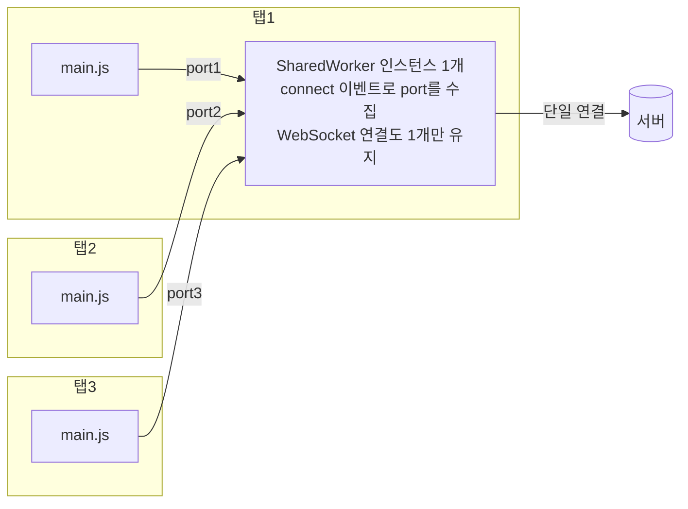

<Callout type="info">
  **이번 문서의 목표:** 이 파일을 다 읽으면 무거운 계산을 Worker로 분리해 메인 스레드를 비우고, postMessage의 데이터 전달 규칙(구조화 복제 vs Transferable)을 정확히 구분하며, SharedWorker로 여러 탭이 하나의 백그라운드 스레드를 공유하는 구조를 직접 설계·디버깅할 수 있다.
</Callout>

## 왜 Worker가 필요한가 — 메인 스레드는 하나뿐이다

01편에서 본 큰 그림을 한 문장으로 요약하면 이렇습니다: **자바스크립트가 실행되는 메인 스레드**(main thread)는 스크립트 실행, 레이아웃 계산, 페인트, 사용자 입력 처리를 전부 혼자 담당합니다. 스레드(thread)란 프로그램 안에서 명령을 순서대로 실행하는 하나의 실행 흐름을 말하는데, 브라우저 탭의 자바스크립트에는 이 흐름이 기본적으로 **딱 하나**입니다.

그래서 이런 코드가 문제를 일으킵니다.

```js
// 클릭하면 3초 동안 소수를 세는 버튼 — 그동안 페이지 전체가 얼어붙는다
버튼.addEventListener('click', () => {
  const 결과 = 소수개수세기(50_000_000); // 동기 계산 3초
  결과표시(결과);
});
```

계산이 도는 3초 동안 무슨 일이 벌어질까요?

- 스크롤이 멈춥니다 — 스크롤 이벤트 처리도 메인 스레드의 일이므로.
- CSS 애니메이션·트랜지션이 멈춥니다 — 스타일 재계산과 페인트도 메인 스레드가 하므로(합성만으로 처리되는 일부 애니메이션 제외 — 렌더링 파이프라인은 03편).
- 클릭·입력에 반응이 없습니다 — 이벤트 콜백이 큐에 쌓이기만 하고 실행되지 못하므로.
- 심하면 브라우저가 "페이지가 응답하지 않습니다" 대화 상자를 띄웁니다.

`setTimeout`이나 `async` 함수로 쪼개면 되지 않냐고 생각할 수 있지만, 그것은 **실행 시점을 미룰 뿐** 계산 자체는 여전히 메인 스레드에서 돕니다. 비동기(asynchronous)는 "나중에 한다"이지 "다른 스레드에서 한다"가 아닙니다. 계산량 자체가 큰 일은 미뤄봐야 미룬 시점에 똑같이 페이지를 얼립니다.

> **쉽게 말하면:** 메인 스레드는 카운터 직원이 한 명뿐인 가게입니다. 그 직원에게 3초짜리 계산을 시키면 그동안 손님 응대(입력·스크롤·화면 갱신)가 전부 멈춥니다. Worker는 **뒷방에 계산 전담 직원을 새로 고용하는 것**입니다.

이 "뒷방 직원"을 표준으로 제공하는 것이 **Web Worker API**입니다. Worker(워커)는 "일꾼"이라는 뜻 그대로, 메인 스레드와 분리된 백그라운드 스레드에서 자바스크립트를 실행합니다.

## 1. Dedicated Worker — 생성과 실행 모델

### Worker 만들기

가장 기본형은 **전용 워커**(dedicated worker)입니다. "전용"이라는 이름은 그 워커를 **만든 문서 하나만** 쓸 수 있다는 뜻입니다(여럿이 공유하는 SharedWorker와 대비되는 이름 — 뒤에서 다룹니다).

Worker는 **별도의 자바스크립트 파일**을 필요로 합니다. 같은 파일 안의 함수를 넘기는 방식이 아니라, 워커가 실행할 스크립트의 URL을 생성자에 넘깁니다. 별도 파일이 필요하므로 아래 예제들은 실행기가 아닌 정적 코드로 보입니다 — 로컬 서버(예: `npx serve`)를 띄우고 직접 만들어보길 권합니다(`file://` 프로토콜에서는 Worker 생성이 보안상 막히는 브라우저가 많습니다).

```js
// main.js — 메인 스레드
const 워커 = new Worker('./worker.js');

워커.postMessage({ 명령: '소수세기', 한계값: 50_000_000 });

워커.addEventListener('message', (event) => {
  console.log('워커가 보낸 결과:', event.data);
});
```

```js
// worker.js — 워커 스레드 (완전히 별개의 실행 환경)
self.addEventListener('message', (event) => {
  const { 명령, 한계값 } = event.data;
  if (명령 === '소수세기') {
    const 결과 = 소수개수세기(한계값); // 몇 초가 걸려도 메인 스레드는 멀쩡하다
    self.postMessage(결과);
  }
});

function 소수개수세기(한계값) {
  let 개수 = 0;
  for (let n = 2; n < 한계값; n++) {
    let 소수다 = true;
    for (let i = 2; i * i <= n; i++) {
      if (n % i === 0) { 소수다 = false; break; }
    }
    if (소수다) 개수++;
  }
  return 개수;
}
```

핵심 구조는 대칭적입니다. 양쪽 모두 `postMessage`로 보내고, `message` 이벤트로 받습니다. 이벤트 디스패치 모델 자체는 06편에서 배운 `EventTarget` 그대로입니다 — Worker 객체도, 워커 안의 전역도 전부 `EventTarget`을 상속합니다.

### 워커의 전역은 window가 아니다

워커 스크립트가 실행되는 환경은 우리가 아는 페이지 환경과 **다른 전역 객체**를 가집니다. 메인 스레드의 전역이 `Window`라면, 전용 워커의 전역은 `DedicatedWorkerGlobalScope`입니다. 워커 코드에서 `self`는 이 전역을 가리킵니다(메인 스레드에서 `self`가 `window`를 가리키는 것과 같은 관례입니다).

이 분리가 의미하는 제약을 표로 정리하면:

| 기능 | 메인 스레드 | 전용 워커 |
|------|------------|----------|
| DOM 접근(`document`, 요소 조작) | 가능 | **불가능** — `document`가 아예 없다 |
| `window`, `alert`, `localStorage` | 가능 | 불가능(동기 Storage는 워커에 없음) |
| `fetch`, `WebSocket` | 가능 | 가능 |
| `setTimeout` / `setInterval` | 가능 | 가능 |
| IndexedDB | 가능 | 가능(15편) |
| Cache Storage | 가능 | 가능(14편) |
| `console.log` | 가능 | 가능 — DevTools에 표시됨 |
| 다른 워커 생성(`new Worker`) | 가능 | 가능(중첩 워커) |

DOM에 접근할 수 없다는 것이 가장 중요한 제약입니다. 왜 막았을까요? DOM은 스레드 안전(thread-safe)하지 않기 때문입니다 — 두 스레드가 같은 트리를 동시에 수정하면 상태가 깨질 수 있고, 이를 막으려면 락(lock, 잠금) 같은 동기화 장치가 필요해 브라우저 구현과 개발자 코드 모두 훨씬 복잡해집니다. 브라우저는 아예 **공유하지 않는 쪽**을 택했습니다. 워커는 계산만 하고, 그 결과로 화면을 바꾸는 일은 메시지를 받은 메인 스레드가 합니다.

> **쉽게 말하면:** 뒷방 직원(워커)은 매장 진열대(DOM)에 손댈 수 없습니다. 계산 결과를 쪽지(메시지)로 카운터에 전달하면, 진열은 카운터 직원(메인 스레드)이 합니다.

### 워커 안에서 다른 스크립트 불러오기

클래식 워커에서는 `importScripts()` 함수로 다른 스크립트를 동기적으로 불러올 수 있습니다.

```js
// worker.js (클래식 워커)
importScripts('./수학유틸.js', './파서.js'); // 순서대로 로드·실행
```

그런데 요즘은 더 나은 방법이 있습니다. 생성자 옵션에 `type: 'module'`을 주면 워커 스크립트가 **ES 모듈**로 실행되어, 익숙한 `import` 문을 그대로 쓸 수 있습니다.

```js
// main.js
const 워커 = new Worker('./worker.js', { type: 'module' });
```

```js
// worker.js (모듈 워커)
import { 소수개수세기 } from './수학유틸.js';

self.addEventListener('message', (event) => {
  self.postMessage(소수개수세기(event.data));
});
```

모듈 워커에서는 `importScripts()`가 오히려 금지됩니다(호출하면 예외). 새 코드는 모듈 워커를 기본으로 두는 것이 좋습니다 — 정적 분석·번들러 지원·중복 로드 방지 등 ES 모듈의 장점을 그대로 얻습니다.

### 워커도 origin 규칙을 따른다

`new Worker(url)`의 URL은 기본적으로 **같은 origin**(출처 — 스킴·호스트·포트의 조합, 01편)이어야 합니다. 다른 origin의 스크립트 URL을 직접 넘기면 `SecurityError`가 발생합니다. CDN의 워커 스크립트를 쓰고 싶다면, 그 내용을 fetch로 받아 `Blob`으로 감싸고 객체 URL을 만들어 넘기는 우회 패턴이 쓰입니다(Blob과 `URL.createObjectURL`은 21편에서 깊게 다룹니다).

### 별도 파일 없이 워커를 직접 실행해 보기

바로 이 우회 패턴 덕분에, 파일을 따로 만들지 않고도 워커를 실험할 수 있습니다. 워커 코드를 문자열로 적어 `Blob`으로 감싼 뒤 객체 URL을 만들어 `new Worker`에 넘기면 됩니다. 아래 실습기는 같은 계산을 **메인 스레드에서 할 때**와 **워커에서 할 때** 화면이 어떻게 다른지 직접 보여 줍니다. 각 버튼을 누른 뒤 옆의 애니메이션 막대가 멈추는지 관찰하세요.

<CodePlayground
  template="vanilla"
  activeFile="/index.js"
  showConsole
  label="Blob 워커로 직접 실험 — 메인 스레드 블로킹 vs 워커 오프로딩"
  files={{
    '/index.html': `<div style="font-family:system-ui">
  <button id="메인">메인 스레드에서 계산</button>
  <button id="워커실행">워커에서 계산</button>
  <p>아래 막대가 멈추면 메인 스레드가 막힌 것입니다.</p>
  <div id="막대" style="width:20px;height:20px;background:teal;"></div>
</div>
<script src="index.js"></script>`,
    '/index.js': `// --- 화면이 살아 있는지 보여 주는 애니메이션 ---------------
const 막대 = document.getElementById('막대');
let 위치 = 0;
function 움직이기() {
  위치 = (위치 + 3) % 200;
  막대.style.transform = 'translateX(' + 위치 + 'px)';
  requestAnimationFrame(움직이기);
}
움직이기();

// --- 무거운 계산 (양쪽에서 똑같이 쓴다) --------------------
const 계산코드 = \`
function 소수개수세기(한계값) {
  let 개수 = 0;
  for (let n = 2; n < 한계값; n++) {
    let 소수다 = true;
    for (let i = 2; i * i <= n; i++) {
      if (n % i === 0) { 소수다 = false; break; }
    }
    if (소수다) 개수++;
  }
  return 개수;
}
\`;

// eval 대신 Function 생성자로 같은 코드를 메인 쪽에도 준비한다
const 소수개수세기 = new Function(계산코드 + ' return 소수개수세기;')();

// --- A. 메인 스레드에서 계산 -------------------------------
document.getElementById('메인').addEventListener('click', () => {
  console.log('메인 스레드 계산 시작 — 막대가 멈추는지 보세요');
  const 시작 = performance.now();
  const 결과 = 소수개수세기(2000000);
  console.log('메인 결과:', 결과, '/ 소요:', Math.round(performance.now() - 시작), 'ms');
  console.log('=> 계산하는 동안 rAF가 한 번도 실행되지 못했다');
});

// --- B. 워커에서 계산 (Blob + 객체 URL로 파일 없이 생성) ----
const 워커소스 = 계산코드 + \`
self.addEventListener('message', (event) => {
  const 시작 = Date.now();
  const 결과 = 소수개수세기(event.data.한계값);
  self.postMessage({ 결과, 소요: Date.now() - 시작, 요청id: event.data.요청id });
});
// 워커에는 DOM이 없다 — 확인해 보자
self.postMessage({ 알림: 'document가 있는가? ' + (typeof document) });
\`;

const 소스블롭 = new Blob([워커소스], { type: 'text/javascript' });
const 워커주소 = URL.createObjectURL(소스블롭);
const 워커 = new Worker(워커주소);
// 워커가 생성된 뒤에는 주소를 해제해도 된다 (21편의 객체 URL 수명 규칙)
URL.revokeObjectURL(워커주소);

워커.addEventListener('message', (event) => {
  if (event.data.알림) {
    console.log('[워커 알림]', event.data.알림, '-> undefined면 DOM이 없다는 뜻');
    return;
  }
  console.log('워커 결과:', event.data.결과,
    '/ 소요:', event.data.소요, 'ms / 요청id:', event.data.요청id);
  console.log('=> 계산 내내 막대는 계속 움직였다');
});

워커.addEventListener('error', (e) => console.log('워커 에러:', e.message));

let 요청번호 = 0;
document.getElementById('워커실행').addEventListener('click', () => {
  요청번호 += 1;
  console.log('워커에 요청 전송 — 메인 스레드는 즉시 자유로워진다');
  워커.postMessage({ 한계값: 2000000, 요청id: 요청번호 });
});

// 구조화 복제의 한계도 확인해 보자
try {
  워커.postMessage({ 콜백: () => 1 });
} catch (에러) {
  console.log('함수를 보내려 하면:', 에러.name, '- 함수는 복제할 수 없다');
}`,
  }}
/>

두 버튼의 차이가 이 편 전체의 요약입니다. 메인 스레드 계산 중에는 `requestAnimationFrame` 콜백조차 실행되지 못해 막대가 얼어붙지만, 워커 계산 중에는 애니메이션이 그대로 흐릅니다. 워커에서 `typeof document`가 `'undefined'`로 찍히는 것도 함께 확인해 두세요 — 앞 절에서 표로 본 제약이 실제로 그렇다는 증거입니다.

## 2. postMessage 깊이 보기 — 구조화 복제라는 계약

### 함수도, 참조도 넘어가지 않는다

`postMessage(값)`으로 보낸 데이터는 **구조화 복제 알고리즘**(structured clone algorithm)이라는 표준 절차로 **복사**되어 상대 스레드에 전달됩니다. "구조화"라는 이름은 객체의 중첩 구조(객체 안의 객체, 배열 안의 Map…)까지 통째로 재귀 복제한다는 뜻입니다.

JSON 직렬화(`JSON.stringify`)와 비슷해 보이지만 훨씬 강력합니다.

| 값 | JSON 직렬화 | 구조화 복제 |
|----|------------|------------|
| 객체·배열·문자열·숫자 | 가능 | 가능 |
| `Date`, `RegExp` | 문자열로 변질 / 소실 | **타입 그대로** 복제 |
| `Map`, `Set` | 소실(빈 객체) | 복제 가능 |
| `ArrayBuffer`, 타입 배열 | 불가 | 복제 가능 |
| `Blob`, `File` | 불가 | 복제 가능 |
| 순환 참조 객체 | 예외 발생 | **복제 가능** |
| 함수 | 소실 | **예외 발생**(`DataCloneError`) |
| DOM 노드 | 불가 | 예외 발생 |
| 프로토타입 체인·클래스 인스턴스의 메서드 | 소실 | **소실** — 데이터 속성만 복제 |

두 가지 함정을 기억해야 합니다.

1. **함수는 절대 넘어가지 않습니다.** 콜백을 워커에 넘기고 싶어도 불가능합니다 — 함수는 자신이 만들어진 스코프(클로저)에 묶여 있는데, 그 스코프는 다른 스레드에 존재하지 않기 때문입니다. 그래서 워커와의 대화는 언제나 "데이터를 보내고, 데이터를 돌려받는" 형태가 됩니다.
2. **복사이지 공유가 아닙니다.** 보낸 뒤 원본 객체를 수정해도 상대가 받은 사본에는 반영되지 않습니다. 두 스레드가 같은 메모리를 보는 게 아니라, 각자 자기 사본을 가집니다. 이 덕분에 락 없이도 안전하지만, 큰 데이터는 복사 비용이 문제가 됩니다.

### Transferable — 복사 대신 소유권 이전

복사 비용 문제를 해결하는 장치가 **전송 가능 객체**(Transferable objects)입니다. `postMessage`의 두 번째 인자로 전송할 객체 목록을 넘기면, 복사 대신 **소유권**(ownership)을 통째로 넘깁니다. 메모리를 새로 확보해 베끼는 것이 아니라 "이 메모리는 이제 네 것"이라고 명의만 바꾸는 것이라, 100MB짜리 버퍼도 사실상 0에 가까운 비용으로 넘어갑니다.

```js
const 버퍼 = new ArrayBuffer(100 * 1024 * 1024); // 100MB

// 복사: 100MB를 통째로 베낀다 (느리고 메모리 2배)
워커.postMessage({ 데이터: 버퍼 });

// 이전: 명의만 바꾼다 (즉시 완료)
워커.postMessage({ 데이터: 버퍼 }, [버퍼]);

console.log(버퍼.byteLength); // 0 — 보낸 쪽에서는 빈 껍데기가 된다!
```

마지막 줄이 핵심 계약입니다. 소유권을 이전하면 **보낸 쪽의 원본은 무력화**(detached, 분리됨)됩니다 — `byteLength`가 0이 되고 접근하면 예외가 납니다. "한 물건을 두 스레드가 동시에 만지는 상황"을 원천 차단하는 설계입니다. 전송 가능한 대표 타입은 `ArrayBuffer`, `MessagePort`, `ImageBitmap`, `OffscreenCanvas`, 그리고 스트림(`ReadableStream` 등 — 11편) 계열입니다.

> **쉽게 말하면:** 구조화 복제는 서류를 복사기로 복사해서 건네는 것이고, Transferable은 서류 원본을 통째로 넘겨주는 것입니다. 원본을 넘기면 내 손에는 아무것도 남지 않습니다.

<Callout type="warning">
  **자주 틀리는 점:** "워커에 넘기면 무조건 빠르다"는 오해. 수십 MB 객체를 구조화 복제로 매번 넘기면 복제 비용 자체가 메인 스레드를 잡아먹습니다(복제는 보내는 쪽 스레드에서 일어납니다). 대량 바이너리는 반드시 `ArrayBuffer` + Transferable로 설계하고, 자잘한 메시지를 초당 수천 번 보내는 구조라면 모아서(batching) 보내는 것을 검토해야 합니다.
</Callout>

### 요청-응답 짝 맞추기

`postMessage`는 일방적인 발사이고 응답을 기다리는 개념이 없습니다. 여러 요청을 던지면 어느 응답이 어느 요청의 것인지 스스로 구분해야 합니다. 실무 기본 패턴은 **요청마다 id를 붙이고, Promise로 감싸는** 것입니다.

```js
// main.js — 워커 호출을 Promise로 감싸는 래퍼
let 다음id = 0;
const 대기중 = new Map();

const 워커 = new Worker('./worker.js', { type: 'module' });

워커.addEventListener('message', (event) => {
  const { id, 결과 } = event.data;
  const { resolve } = 대기중.get(id);
  대기중.delete(id);
  resolve(결과);
});

function 워커에게요청(작업이름, 인자) {
  return new Promise((resolve, reject) => {
    const id = 다음id++;
    대기중.set(id, { resolve, reject });
    워커.postMessage({ id, 작업이름, 인자 });
  });
}

// 사용 — 이제 평범한 비동기 함수처럼 보인다
const 답 = await 워커에게요청('소수세기', 10_000_000);
```

```js
// worker.js — id를 그대로 되돌려주는 것이 계약의 전부
self.addEventListener('message', async (event) => {
  const { id, 작업이름, 인자 } = event.data;
  const 결과 = await 작업실행(작업이름, 인자);
  self.postMessage({ id, 결과 });
});
```

Comlink 같은 라이브러리가 하는 일의 본질이 정확히 이것입니다 — id 관리와 Promise 래핑을 Proxy로 자동화한 것뿐입니다. 원리를 알고 있으면 라이브러리 없이도, 라이브러리가 이상하게 동작할 때도 대처할 수 있습니다.

## 3. 에러 처리와 종료 — 수명 관리

### 에러는 어디로 가는가

워커 안에서 잡히지 않은 예외가 발생하면, 워커 객체에서 `error` 이벤트가 발생합니다.

```js
워커.addEventListener('error', (event) => {
  // event은 ErrorEvent — 메시지·파일·행 번호를 담는다
  console.error(`워커 에러: \${event.message} (\${event.filename}:\${event.lineno})`);
  event.preventDefault(); // 콘솔의 기본 에러 출력을 막고 싶다면
});
```

주의할 점 세 가지:

1. `error` 이벤트로는 **원본 Error 객체가 넘어오지 않습니다.** 메시지 문자열·파일명·행 번호뿐입니다. 스택 추적까지 필요한 실전 코드에서는 워커 안에서 `try...catch`로 잡아 `postMessage`로 직렬화해 보내는 편이 훨씬 유용합니다(위의 id 패턴에 `reject` 경로를 추가).
2. 워커 안의 **거부된 Promise**는 워커 전역의 `unhandledrejection` 이벤트로만 잡히고, 메인 스레드의 `error` 이벤트로는 전달되지 않는 브라우저가 많습니다. 워커 안 비동기 코드의 에러 처리는 워커 안에서 끝내야 합니다.
3. 존재하지 않는 URL로 워커를 만들면 생성자는 일단 성공하고, 이후 `error` 이벤트가 옵니다 — Worker 생성은 낙관적(비동기적)으로 진행되기 때문입니다.

### 종료 — 누가, 어떻게 끝내는가

워커는 스스로 사라지지 않습니다. 종료 방법은 두 가지입니다.

```js
// 1. 밖에서 즉시 강제 종료 — 진행 중인 작업이고 뭐고 그 자리에서 중단
워커.terminate();

// 2. 안에서 스스로 종료 — 정리 작업 후 마무리할 수 있다
// (worker.js 안에서)
self.close();
```

`terminate()`는 예고 없는 즉시 중단입니다. 진행 중이던 계산·fetch·트랜잭션이 전부 그대로 끊깁니다. 우아한 종료가 필요하면 "종료해 달라"는 메시지를 보내고 워커가 정리 후 `self.close()`를 부르는 프로토콜을 직접 설계해야 합니다.

수명과 관련해 꼭 알아야 할 사실:

- **워커는 페이지가 닫히면 함께 죽습니다.** 전용 워커의 수명은 자신을 만든 문서에 종속됩니다. 페이지와 무관하게 살아남는 백그라운드 로직이 필요하면 그것은 Service Worker의 영역입니다(20편).
- **참조를 잃어도 스레드는 돈다.** `워커` 변수를 덮어써서 Worker 객체가 가비지 컬렉션 대상이 되어도, 워커 스레드가 즉시 종료된다는 보장은 없습니다. 다 쓴 워커는 명시적으로 `terminate()`하는 습관이 안전합니다.
- **생성 비용이 있다.** 워커 하나는 별도 스레드 + 별도 JS 환경이라 생성에 수십 ms, 메모리 수 MB가 듭니다. 클릭마다 새 워커를 만들고 버리는 설계보다, 워커를 미리 만들어 재사용하는 **워커 풀**(worker pool) 또는 장수 워커 1개 패턴이 기본입니다. CPU 코어 수(`navigator.hardwareConcurrency`)보다 많은 워커는 대개 낭비입니다.

## 4. SharedWorker — 여러 탭이 공유하는 하나의 워커

### 왜 필요한가

같은 사이트를 탭 3개로 열었다고 합시다. 각 탭이 각자 WebSocket을 연결하면(12편) 서버 연결이 3개가 됩니다. 각 탭이 각자 무거운 데이터를 캐시하면 메모리도 3배입니다. "탭이 몇 개든 연결과 캐시는 하나만" — 이 요구를 표준으로 해결하는 것이 **공유 워커**(SharedWorker)입니다.

SharedWorker는 **같은 origin의 여러 브라우징 컨텍스트**(탭·창·iframe)가 **하나의 워커 인스턴스**를 공유합니다. 첫 탭이 `new SharedWorker(url)`을 부르면 워커가 생성되고, 두 번째 탭이 같은 URL로 부르면 새로 만들지 않고 **기존 인스턴스에 연결**됩니다.

### port — 연결마다 하나씩 생기는 전용 회선

전용 워커와 결정적으로 다른 부분이 통신 방식입니다. 연결하는 쪽이 여럿이므로, 워커 입장에서 "누가 보냈는지"를 구분할 회선이 필요합니다. 그래서 SharedWorker 통신은 `MessagePort`(메시지 포트 — 양방향 통신 회선의 끝단)를 통해 이뤄집니다.

```js
// 각 탭의 main.js
const 공유워커 = new SharedWorker('./shared-worker.js');

// 통신은 워커 객체가 아니라 port로 한다
공유워커.port.addEventListener('message', (event) => {
  console.log('받음:', event.data);
});
공유워커.port.start(); // addEventListener 방식일 때는 start() 필수!

공유워커.port.postMessage('안녕, 나 새 탭이야');
```

```js
// shared-worker.js — 전역은 SharedWorkerGlobalScope
const 연결된포트들 = [];

// 새 탭이 연결될 때마다 connect 이벤트가 발생한다
self.addEventListener('connect', (event) => {
  const 포트 = event.ports[0]; // 이 탭과의 전용 회선
  연결된포트들.push(포트);

  포트.addEventListener('message', (event) => {
    // 모든 탭에 방송(broadcast)
    for (const p of 연결된포트들) {
      p.postMessage(`누군가 말했다: \${event.data}`);
    }
  });
  포트.start();
});
```

메시지 흐름을 그림으로 보면:



`port.start()`를 빼먹는 것이 이 API 최대의 함정입니다. `addEventListener('message', ...)` 방식으로 수신할 때는 반드시 `start()`를 호출해야 메시지가 흐르기 시작합니다. `port.onmessage = ...` 방식으로 할당하면 `start()`가 암묵적으로 호출되어 생략할 수 있습니다 — 두 방식이 이 지점에서 동작이 다릅니다.

### SharedWorker의 수명과 한계

- **수명**: 연결된 문서가 하나라도 살아 있는 동안 유지되고, **마지막 탭이 닫히면 종료**됩니다. 탭 하나가 닫혀도 워커는 그 사실을 자동으로 알지 못합니다 — 탭이 `beforeunload`(또는 `pagehide`)에서 "나 간다"는 메시지를 보내 워커가 포트 목록을 정리하게 하는 프로토콜을 직접 설계하는 것이 관례입니다.
- **디버깅**: SharedWorker는 어느 탭의 DevTools에도 기본으로 안 보입니다. 크롬은 `chrome://inspect/#workers`, 파이어폭스는 `about:debugging`에서 따로 검사합니다.
- **지원 범위 주의**: 안드로이드 크롬이 오랫동안 SharedWorker를 지원하지 않았고(2024년 크롬 130대에 와서야 추가), 사파리도 지원을 뺐다가 한참 뒤에 복구한 역사가 있습니다. 모바일 대상 서비스라면 지원 여부 확인과 폴백 설계가 필수입니다.
- **더 단순한 대안**: "탭끼리 알림만 주고받으면 되는" 수준이라면 SharedWorker 없이 `BroadcastChannel` API — 같은 origin의 모든 컨텍스트에 메시지를 방송하는 단순한 채널 — 로 충분한 경우가 많습니다. 공유해야 할 것이 "상태·연결"이면 SharedWorker, "신호"면 BroadcastChannel이라고 구분하면 됩니다.

### 세 가지 워커 한눈에 비교

Service Worker(20편)까지 포함해 지형을 정리해 둡니다.

| 구분 | Dedicated Worker | SharedWorker | Service Worker |
|------|-----------------|--------------|----------------|
| 공유 범위 | 만든 문서 전용 | 같은 origin의 여러 탭 | origin+scope의 모든 페이지 |
| 주 용도 | CPU 무거운 계산 | 탭 간 공유 연결·상태 | 네트워크 프록시·오프라인·푸시 |
| 수명 | 문서와 함께 | 마지막 연결 탭까지 | 문서와 **무관** — 이벤트 때 깨어남 |
| 통신 | `postMessage` 직접 | `port` 경유 | `postMessage`+`clients` |
| HTTPS 필수 | 아니오 | 아니오 | **예**(localhost 예외) |
| fetch 가로채기 | 불가 | 불가 | **가능** |

## 5. 실전 감각 — 무엇을 워커로 보내야 하나

워커로 보낼 가치가 있는 일과 아닌 일을 구분하는 기준은 단순합니다: **"이 작업이 메인 스레드를 16ms 이상 붙잡는가?"** (16ms는 60fps 화면에서 프레임 하나의 예산입니다 — 18편.)

**보낼 가치가 있는 일**: 대용량 JSON·CSV 파싱, 이미지 픽셀 처리, 텍스트 검색·diff, 압축·해시 계산, 대량 데이터 정렬·집계, IndexedDB 대량 쓰기(15편).

**보내면 오히려 손해인 일**: 수 ms면 끝나는 계산(메시지 왕복 + 복제 비용이 더 큼), DOM을 만져야 하는 일(어차피 불가), 잦은 왕복이 필요한 자잘한 일(스레드 간 통신 지연이 누적).

관측자·rAF와 워커를 결합해 실제로 메인 스레드를 비우는 종합 설계는 23편에서 다룹니다.

## 핵심 정리

- 자바스크립트의 메인 스레드는 하나뿐이며, `setTimeout`·`async`는 실행을 미룰 뿐 계산을 다른 스레드로 옮기지 못한다. 무거운 계산은 **Worker**로 분리한다.
- 워커는 별도 전역(`DedicatedWorkerGlobalScope`)에서 돌고 **DOM에 접근할 수 없다**. 통신은 오직 `postMessage` + `message` 이벤트.
- 전달 데이터는 **구조화 복제**로 복사된다 — 함수·DOM 노드는 못 넘기고, 큰 버퍼는 **Transferable**로 소유권을 이전해 복사 비용을 없앤다(원본은 무력화됨).
- 에러는 `error` 이벤트로 오지만 정보가 빈약하므로, 실전에서는 id 기반 요청-응답 프로토콜에 에러 직렬화를 포함한다. 다 쓴 워커는 `terminate()` 또는 `self.close()`로 명시적으로 끝낸다.
- **SharedWorker**는 같은 origin의 여러 탭이 한 인스턴스를 공유한다 — `connect` 이벤트와 `port`로 통신하고, `addEventListener` 방식에서는 `port.start()`가 필수다. 단순 탭 간 알림은 BroadcastChannel로 충분하다.

## 마무리 복습

<Quiz
  questionNumber={1}
  question="무거운 동기 계산을 setTimeout 콜백 안으로 옮기면 페이지 멈춤이 해결되지 않는 이유는?"
  options={['setTimeout은 최소 지연이 1초라서', '계산이 여전히 메인 스레드에서 실행되기 때문', 'setTimeout 콜백은 워커에서 실행되지만 결과를 못 돌려주기 때문', '브라우저가 setTimeout 안의 긴 계산을 자동 차단하기 때문']}
  correctAnswer={2}
  explanation="비동기는 실행 시점을 미룰 뿐 실행 장소를 바꾸지 않는다. 미뤄진 시점에 계산이 시작되면 그 순간부터 똑같이 메인 스레드를 점유해 화면이 얼어붙는다. 실행 스레드 자체를 분리하는 것은 Worker만이 할 수 있다."
  optionExplanations={['최소 지연은 브라우저·중첩 정도에 따라 다르지만 문제의 본질이 아니다', '정답 — 비동기와 멀티스레드는 별개의 개념이다', 'setTimeout 콜백은 워커가 아니라 메인 스레드에서 실행된다', '브라우저는 긴 계산을 자동 차단하지 않으며 응답 없음 경고만 띄운다']}
/>

<Quiz
  questionNumber={2}
  question="전용 워커(Dedicated Worker) 안에서 할 수 없는 일은?"
  options={['fetch로 네트워크 요청 보내기', 'document.querySelector로 요소 선택하기', 'IndexedDB에 데이터 저장하기', 'setTimeout으로 타이머 걸기']}
  correctAnswer={2}
  explanation="워커의 전역은 DedicatedWorkerGlobalScope이고 document 객체 자체가 존재하지 않는다. DOM은 스레드 안전하지 않아 브라우저가 워커와의 공유를 원천 차단했기 때문이다. fetch·IndexedDB·타이머는 워커에서 모두 사용 가능하다."
  optionExplanations={['fetch는 워커에서 자유롭게 사용할 수 있다', '정답 — 워커에는 document가 없어 DOM 접근이 불가능하다', 'IndexedDB는 워커에서도 접근 가능해 대량 쓰기를 옮기기 좋다', '타이머 함수들은 워커 전역에도 제공된다']}
/>

<Quiz
  questionNumber={3}
  question="postMessage의 구조화 복제 알고리즘에 대한 설명으로 옳은 것은?"
  options={['JSON.stringify와 완전히 동일한 규칙으로 직렬화한다', 'Map과 Set은 전달되지만 함수를 넘기면 DataCloneError가 발생한다', '객체의 참조가 그대로 전달되어 양쪽에서 같은 메모리를 공유한다', '순환 참조가 있는 객체는 전달할 수 없다']}
  correctAnswer={2}
  explanation="구조화 복제는 JSON보다 강력해 Map·Set·Date·ArrayBuffer·순환 참조까지 복제하지만, 함수와 DOM 노드는 예외를 던진다. 그리고 전달은 언제나 복사이며 참조 공유가 아니다."
  optionExplanations={['JSON보다 훨씬 많은 타입을 지원하고 순환 참조도 처리한다', '정답 — 함수는 클로저 스코프를 다른 스레드로 옮길 수 없어 금지된다', '구조화 복제는 사본을 만든다 — 보낸 뒤 원본을 수정해도 상대에게 반영되지 않는다', '순환 참조는 JSON과 달리 구조화 복제가 처리할 수 있는 케이스다']}
/>

<Quiz
  questionNumber={4}
  question="100MB ArrayBuffer를 워커에 넘길 때 postMessage(버퍼, [버퍼])처럼 두 번째 인자를 쓰는 이유와 그 결과는?"
  options={['버퍼를 두 번 복사해 안정성을 높이며 원본은 그대로 남는다', '소유권을 이전해 복사 비용을 없애며 보낸 쪽의 원본은 무력화된다', '버퍼를 압축해서 보내며 받는 쪽에서 자동 해제된다', '버퍼를 읽기 전용으로 공유해 양쪽에서 동시에 읽을 수 있다']}
  correctAnswer={2}
  explanation="두 번째 인자는 Transferable 목록이다. 메모리를 복사하는 대신 소유권만 이전하므로 크기와 무관하게 즉시 전달되고, 대신 보낸 쪽 버퍼는 detached 상태가 되어 byteLength가 0이 된다. 한 메모리를 두 스레드가 동시에 만지는 상황을 막는 설계다."
  optionExplanations={['복사가 아니라 복사를 없애는 장치다', '정답 — 이전 후 원본 접근은 불가능해진다', '압축 기능이 아니라 소유권 이전 기능이다', '동시 접근을 허용하는 게 아니라 원천 차단하는 방식이다']}
/>

<Quiz
  questionNumber={5}
  question="SharedWorker에서 port.addEventListener(message, 콜백)로 수신을 등록했는데 메시지가 전혀 오지 않는다. 가장 유력한 원인은?"
  options={['SharedWorker는 메시지 수신이 원래 불가능하다', 'port.start()를 호출하지 않았다', 'HTTPS가 아닌 환경에서 실행했다', 'connect 이벤트는 워커가 아니라 메인 스레드에서 발생하기 때문이다']}
  correctAnswer={2}
  explanation="MessagePort는 addEventListener 방식으로 수신할 때 start()를 명시적으로 호출해야 메시지 흐름이 시작된다. onmessage 속성 할당 방식은 start()를 암묵 호출하므로 이 문제가 없다 — 두 방식의 차이가 이 API 최대의 함정이다."
  optionExplanations={['SharedWorker 통신의 핵심이 port를 통한 메시지 송수신이다', '정답 — start() 누락은 SharedWorker 디버깅에서 가장 흔한 원인이다', 'HTTPS 필수는 Service Worker의 제약이지 SharedWorker의 제약이 아니다', 'connect 이벤트는 워커 전역에서 발생하는 것이 맞다']}
/>

<Quiz
  questionNumber={6}
  question="워커의 수명 관리에 대한 설명으로 틀린 것은?"
  options={['전용 워커는 자신을 만든 페이지가 닫히면 함께 종료된다', 'terminate()는 진행 중인 작업을 기다리지 않고 즉시 중단한다', 'SharedWorker는 연결된 마지막 탭이 닫히면 종료된다', '워커 객체 변수를 null로 바꾸면 워커 스레드가 즉시 종료된다']}
  correctAnswer={4}
  explanation="참조를 잃는 것과 스레드 종료는 별개다 — 가비지 컬렉션이 언제 일어날지, 스레드가 언제 정리될지는 보장이 없다. 다 쓴 워커는 terminate() 또는 워커 안 self.close()로 명시적으로 종료해야 한다."
  optionExplanations={['전용 워커의 수명은 문서에 종속되는 것이 맞다', 'terminate()는 예고 없는 즉시 중단이 맞다 — 우아한 종료는 메시지 프로토콜로 직접 설계한다', 'SharedWorker는 마지막 연결이 끊길 때까지 유지되는 것이 맞다', '정답(틀린 설명) — 참조 상실이 스레드 종료를 보장하지 않는다']}
/>

<Quiz
  questionNumber={7}
  question="다음 중 워커로 옮겼을 때 이득이 가장 적은 작업은?"
  options={['50MB CSV 파일 파싱', '수만 건 데이터의 정렬과 집계', '클릭할 때마다 실행되는 2ms짜리 문자열 포매팅', '이미지 픽셀 단위 필터 연산']}
  correctAnswer={3}
  explanation="워커 통신에는 메시지 왕복과 구조화 복제 비용이 든다. 수 ms면 끝나는 작업은 이 오버헤드가 계산 자체보다 커서 오히려 손해다. 기준은 그 작업이 메인 스레드를 프레임 예산(약 16ms) 이상 붙잡는가이다."
  optionExplanations={['대용량 파싱은 워커의 대표 용도다', '대량 정렬·집계는 메인 스레드를 길게 붙잡으므로 옮길 가치가 크다', '정답 — 왕복 비용이 계산 비용을 초과하는 전형적 사례다', '픽셀 연산은 CPU 집약적이라 워커와 Transferable의 최적 용도다']}
/>

## 참고 자료

- [MDN - Web Workers API](https://developer.mozilla.org/en-US/docs/Web/API/Web_Workers_API)
- [MDN - Web APIs](https://developer.mozilla.org/en-US/docs/Web/API)
- [HTML Living Standard - Web workers](https://html.spec.whatwg.org/multipage/workers.html)
