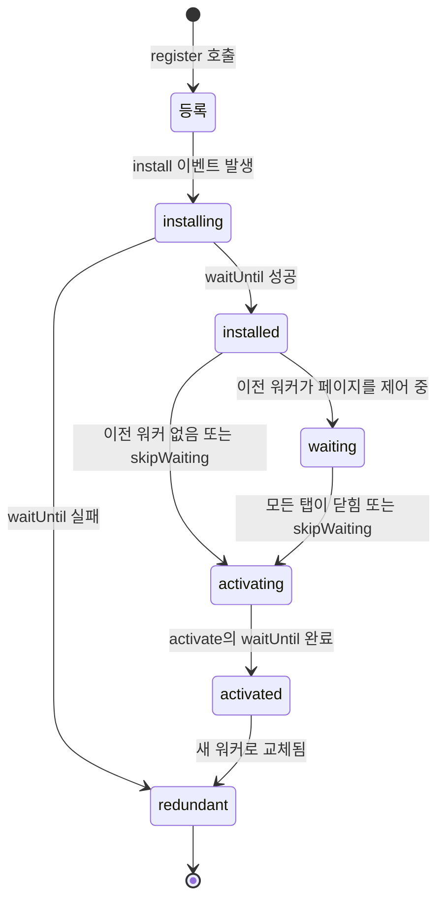
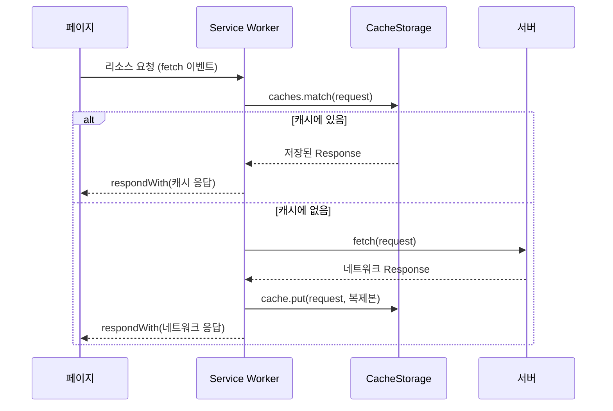

<Callout type="info">
  **이번 문서의 목표:** 이 파일을 다 읽으면 Service Worker의 등록·설치·활성화·업데이트 흐름을 상태 전이로 설명하고, `fetch` 이벤트를 가로채 CacheStorage와 결합한 캐시 우선·네트워크 우선·stale-while-revalidate 전략을 스스로 고르고 구현할 수 있다.
</Callout>

## 왜 Service Worker인가 — 네트워크는 믿을 수 없다

19편에서 만든 Worker(워커)는 "무거운 계산을 뒷방으로 보내는" 도구였습니다. Service Worker(서비스 워커)는 이름은 비슷하지만 **목적이 완전히 다릅니다.** 계산을 대신하는 일꾼이 아니라, **내 사이트와 네트워크 사이에 앉아 요청을 가로채는 중개인**입니다.

문제 상황부터 봅시다. 웹 페이지는 지금까지 이런 전제 위에 서 있었습니다.

- 화면에 무언가를 그리려면 서버에서 HTML·CSS·JS·이미지를 받아야 한다.
- 네트워크가 끊기면 아무것도 못 한다. 지하철 터널에 들어가면 새로고침 한 번에 공룡 게임이 나온다.
- 같은 로고 이미지도 브라우저 캐시가 만료되면 다시 받아온다. 그 판단은 브라우저와 HTTP 헤더가 하며, 개발자는 세밀하게 개입할 수 없다.

세 번째가 핵심입니다. 14편에서 본 **HTTP 캐시**(HTTP cache)는 브라우저가 `Cache-Control`, `ETag` 같은 헤더를 보고 **자동으로** 판단합니다. 편하지만 "지금은 오프라인이니 캐시가 만료됐어도 그냥 쓰고, 대신 화면에 오프라인 배너를 띄워라" 같은 **애플리케이션 고유의 판단**은 표현할 수 없습니다. HTTP 캐시는 선언(헤더)이지 프로그램이 아니기 때문입니다.

> **쉽게 말하면:** HTTP 캐시가 "규칙표대로만 움직이는 자동문"이라면, Service Worker는 **문 앞에 세워둔 사람**입니다. 누가 무엇을 요청했는지 보고, 창고(캐시)에서 꺼내줄지 밖(네트워크)에 다녀올지 매번 코드로 판단합니다.

이 "문 앞의 사람"을 표준화한 것이 **Service Worker API**입니다. 정식으로 정의하면, 서비스 워커는 **출처**(origin)와 **스코프**(scope, 담당 범위) 단위로 등록되어, 그 범위에 속한 페이지들이 만드는 네트워크 요청을 가로챌 수 있는 **이벤트 기반 백그라운드 스크립트**입니다.

### 서비스 워커가 가진 세 가지 특이 성질

일반 Worker와 다른 점이 셋 있고, 이 문서 전체가 사실상 이 세 가지의 결과입니다.

1. **페이지보다 오래 산다.** 페이지를 닫아도 서비스 워커 등록은 남습니다. 다음에 그 사이트를 열면 이미 설치된 서비스 워커가 먼저 깨어나 요청을 처리합니다. 반대로 말하면 **한 번 잘못 배포한 서비스 워커는 사용자 브라우저에 계속 남아 사이트를 망가뜨릴 수 있습니다.**
2. **이벤트가 없으면 잠든다.** 브라우저는 서비스 워커를 아무 때나 종료했다가 이벤트가 오면 다시 실행합니다. 그래서 **전역 변수에 상태를 담아두면 안 됩니다.** 다음에 깨어났을 때 그 변수는 초기값입니다. 상태는 CacheStorage나 IndexedDB(15편)에 둬야 합니다.
3. **HTTPS에서만 동작한다.** 정확히는 **secure context**(안전한 컨텍스트)에서만 등록됩니다. 이유는 잠시 뒤 따로 다룹니다.

## 1. 등록과 스코프 — 담당 구역을 정하는 계약

### 등록하기

서비스 워커는 페이지에서 `navigator.serviceWorker.register()`로 등록합니다.

```js
// 페이지 쪽 스크립트
if ('serviceWorker' in navigator) {
  window.addEventListener('load', async () => {
    try {
      const 등록정보 = await navigator.serviceWorker.register('/sw.js');
      console.log('등록 성공. 스코프:', 등록정보.scope);
    } catch (에러) {
      console.error('등록 실패:', 에러);
    }
  });
}
```

두 가지가 눈에 띕니다.

- `'serviceWorker' in navigator` — **기능 탐지**(feature detection)입니다. 02편에서 다룬 대로, 브라우저 버전을 문자열로 판별하지 말고 기능의 존재 여부를 직접 확인합니다.
- `load` 이벤트 후에 등록 — 등록 자체도 네트워크·CPU를 씁니다. 첫 화면이 그려지는 경쟁 구간에서 비켜서게 하는 관용적 패턴입니다.

### 스코프: 파일이 놓인 위치가 권한을 정한다

`register()`가 반환하는 등록 정보에는 `scope`가 있습니다. 스코프는 **이 서비스 워커가 요청을 가로챌 수 있는 URL 경로 범위**입니다.

기본 스코프는 **서비스 워커 스크립트 파일이 놓인 디렉터리**입니다.

| 스크립트 위치 | 기본 스코프 | 가로챌 수 있는 요청 |
|---|---|---|
| `/sw.js` | `/` | 사이트 전체 |
| `/js/sw.js` | `/js/` | `/js/` 아래 요청만 |
| `/앱/sw.js` | `/앱/` | `/앱/` 아래 요청만 |

여기에 아주 중요한 보안 규칙이 하나 붙습니다. **자기 위치보다 위쪽을 스코프로 요구할 수 없습니다.** `/js/sw.js`가 `{ scope: '/' }`를 요청하면 등록이 실패합니다.

> **쉽게 말하면:** "네가 서 있는 방보다 넓은 구역을 담당하겠다"는 말은 통하지 않습니다. 사이트 전체를 담당하려면 사이트 루트에 서 있어야 합니다.

왜 이런 제약이 있을까요? 사용자 업로드 파일이 `/uploads/`에 저장되는 서비스를 상상해 보세요. 공격자가 `/uploads/evil.js`를 올린 뒤 그것을 스코프 `/`로 등록할 수 있다면, **사이트 전체의 모든 요청을 영구히 가로채는 코드**를 심는 셈입니다. 위치가 곧 권한이라는 규칙이 이 공격을 원천 차단합니다. (서버가 `Service-Worker-Allowed` 헤더를 명시적으로 내려주면 상위 스코프를 허용할 수 있는데, 이는 서버 관리자의 명시적 동의를 요구하는 예외입니다.)

<Callout type="warning">
  **자주 틀리는 점:** 스코프는 "이 서비스 워커가 제어하는 **페이지**의 범위"이면서 동시에 "가로챌 요청의 범위"입니다. `/앱/` 스코프의 서비스 워커는 `/앱/index.html`을 연 탭은 제어하지만, `/소개.html`을 연 탭은 제어하지 않습니다. 그래서 여러 스코프에 서비스 워커를 나눠 등록하면 페이지마다 제어자가 달라져 디버깅이 급격히 어려워집니다. 특별한 이유가 없다면 **루트에 하나**가 정답입니다.
</Callout>

### 왜 HTTPS(secure context)를 요구하는가

서비스 워커는 `https://` 또는 `http://localhost`(개발 편의를 위한 예외)에서만 등록됩니다. 이 요구사항은 24편에서 secure context 전반으로 다시 다루지만, 서비스 워커에서는 특히 결정적입니다.

이유는 서비스 워커가 가진 능력 그 자체입니다. 서비스 워커는 **모든 요청의 응답을 마음대로 조작할 수 있고, 영구적으로 남습니다.** 만약 평문 HTTP에서 등록이 허용된다면, 카페 와이파이에서 통신을 가로채는 **중간자 공격**(man-in-the-middle attack)만으로 공격자가 자기 서비스 워커를 사용자 브라우저에 설치할 수 있습니다. 그 뒤로는 사용자가 안전한 네트워크로 옮겨가도, **브라우저 안에 심어진 그 코드가 계속 응답을 위조**합니다. 네트워크를 잠깐 장악한 공격이 영구적 사이트 장악으로 승격되는 것입니다.

> **쉽게 말하면:** 서비스 워커를 등록한다는 것은 사이트에게 "우리 집 현관 열쇠"를 주는 일입니다. 전달 과정이 도청 가능하면 열쇠를 길에서 나눠주는 것과 같습니다. HTTPS는 그 전달 경로가 위조되지 않았음을 보증합니다.

## 2. 라이프사이클 — 상태 전이로 이해하기

서비스 워커의 대부분의 혼란은 라이프사이클(lifecycle, 생명주기)에서 나옵니다. 상태 전이도로 먼저 잡고 시작합시다.



각 단계를 사람의 일로 바꿔 보면 이렇습니다.

> **쉽게 말하면:** 새 직원을 뽑는 과정입니다. **install**은 신입이 창고에 재고를 채워 넣는 준비 기간, **waiting**은 준비를 끝냈지만 아직 기존 직원이 카운터에 서 있어 대기실에서 기다리는 상태, **activate**는 교대해서 카운터에 서면서 낡은 재고를 버리는 순간입니다.

### install — 준비하는 단계

`install` 이벤트는 **그 스크립트 버전당 딱 한 번** 발생합니다. 여기서 하는 일은 보통 "오프라인에도 필요한 파일을 미리 캐시에 담아두기", 즉 **프리캐싱**(precaching)입니다.

```js
// sw.js
const 캐시이름 = 'app-shell-v3';
const 사전캐시목록 = ['/', '/index.html', '/style.css', '/app.js', '/logo.svg'];

self.addEventListener('install', (event) => {
  event.waitUntil(
    caches.open(캐시이름).then((캐시) => 캐시.addAll(사전캐시목록))
  );
});
```

핵심은 `event.waitUntil()`입니다. 서비스 워커는 이벤트 핸들러가 끝나면 언제든 종료될 수 있는데, `waitUntil`에 Promise를 넘기면 **그 Promise가 끝날 때까지 브라우저가 종료를 미루고, 설치 성공 여부도 그 결과로 판정**합니다.

- Promise가 이행(fulfilled)되면 → `installed` 상태로 진행
- Promise가 거부(rejected)되면 → **설치 실패, `redundant`로 폐기**

이 판정 규칙 때문에 `cache.addAll()`은 위험하면서 동시에 유용합니다. `addAll`은 목록 중 **하나라도** 받아오지 못하면 전체가 거부됩니다. 즉 "반쪽짜리 오프라인 앱"이 설치되는 사태를 막아주는 안전장치입니다. 반대로 목록에 오타 난 파일이 하나 있으면 서비스 워커가 영원히 설치되지 않으니, 배포 전 목록 검증은 필수입니다.

### waiting — 가장 많이 오해받는 구간

파일을 수정해 새 `sw.js`를 배포했다고 합시다. 사용자가 페이지를 새로고침하면, 브라우저는 새 스크립트를 받아 **바이트 단위로 비교**합니다. 다르면 새 워커를 설치합니다. 설치는 성공합니다. 그런데 — **새 워커는 바로 일하지 않습니다.** `waiting` 상태로 대기실에 들어갑니다.

왜일까요? 지금 열려 있는 탭은 **이전 버전의 서비스 워커가 제어하고 있고**, 그 페이지의 자바스크립트는 이전 버전의 캐시·응답 형식을 전제로 짜여 있기 때문입니다. 중간에 제어자를 바꾸면 한 페이지 안에서 앞부분은 v2 규칙, 뒷부분은 v3 규칙으로 응답을 받는 **일관성 없는 상태**가 됩니다.

<Callout type="warning">
  **자주 틀리는 점:** "새로고침했는데 왜 새 서비스 워커가 안 붙지?"의 답이 여기 있습니다. 일반 새로고침은 이전 페이지가 완전히 닫히기 전에 새 페이지가 열리므로 **제어 중인 클라이언트가 0이 되는 순간이 없습니다.** 그래서 waiting이 풀리지 않습니다. 진짜로 교체하려면 그 사이트의 **모든 탭을 닫았다가** 새로 열거나, 아래의 `skipWaiting`을 써야 합니다.
</Callout>

### activate — 교대하고 청소하는 단계

`activate` 이벤트는 새 워커가 실제로 제어권을 잡는 순간에 발생합니다. 여기서의 표준 작업은 **낡은 캐시 삭제**입니다.

```js
self.addEventListener('activate', (event) => {
  event.waitUntil(
    caches.keys().then((키목록) =>
      Promise.all(
        키목록
          .filter((키) => 키 !== 캐시이름) // 현재 버전이 아닌 것만
          .map((키) => caches.delete(키))
      )
    )
  );
});
```

왜 삭제를 install이 아니라 activate에서 할까요? install 시점에는 **이전 워커가 아직 그 캐시로 페이지를 서비스하고 있기 때문**입니다. 그때 지우면 살아 있는 페이지의 발밑을 빼는 셈입니다. activate는 이전 워커가 완전히 물러난 뒤이므로 안전합니다. install은 "새것을 채우는 곳", activate는 "옛것을 버리는 곳" — 이 대칭을 기억하면 헷갈리지 않습니다.

### skipWaiting과 clients.claim — 대기를 건너뛰는 두 손잡이

| 메서드 | 호출 위치 | 하는 일 |
|---|---|---|
| `self.skipWaiting()` | 보통 `install` 안 | waiting 단계를 건너뛰고 즉시 activating으로 진행 |
| `self.clients.claim()` | 보통 `activate` 안 | 이미 열려 있는, 아직 제어되지 않던 페이지들까지 즉시 제어 |

둘은 역할이 다릅니다. `skipWaiting`은 **새 워커를 빨리 활성화**하고, `clients.claim`은 **활성화된 워커가 기존 탭까지 끌어당깁니다.** 첫 방문에서 곧바로 서비스 워커가 요청을 처리하게 하려면 `clients.claim`이 필요합니다 — 그렇지 않으면 등록 직후의 그 페이지는 다음 방문 때부터 제어됩니다.

강력한 만큼 대가도 분명합니다. `skipWaiting`을 무조건 켜두면, 사용자가 페이지를 보고 있는 도중에 제어자가 바뀌어 앞서 말한 버전 불일치가 실제로 일어납니다. 그래서 성숙한 앱은 보통 **사용자에게 "새 버전이 준비됐습니다. 새로고침" 버튼을 띄우고, 사용자가 누르면 그때 워커에 메시지를 보내 `skipWaiting`을 호출**하게 합니다. 자동 교체가 아니라 합의 후 교체입니다.

## 3. fetch 이벤트 — 요청을 가로채는 계약

라이프사이클이 준비 과정이라면, `fetch` 이벤트는 서비스 워커가 실제로 일하는 본무대입니다.



코드로는 이렇습니다.

```js
self.addEventListener('fetch', (event) => {
  event.respondWith(
    caches.match(event.request).then((캐시응답) => {
      return 캐시응답 || fetch(event.request);
    })
  );
});
```

`event.respondWith()`가 이 API의 계약 그 자체입니다. 규칙이 셋 있습니다.

1. **respondWith를 호출하지 않으면** 브라우저는 그 요청을 평소대로 네트워크로 보냅니다. 즉 "가로채지 않고 통과"가 기본값입니다.
2. **호출하면 반드시 `Response` 또는 Response로 이행되는 Promise를 줘야 합니다.** 다른 값을 주거나 Promise가 거부되면 요청은 **네트워크 에러로 실패**합니다. 오프라인에서 캐시도 없을 때 이 함정을 자주 밟습니다.
3. **respondWith는 이벤트 핸들러가 동기적으로 실행되는 동안 호출해야 합니다.** `await` 뒤에서 호출하면 브라우저는 이미 "이 워커는 응답할 생각이 없구나" 판단하고 요청을 흘려보낸 뒤입니다. 비동기 로직은 `respondWith(async () => { ... }())`처럼 **Promise를 만들어 즉시 넘기는** 형태로 감쌉니다.

### 스트림 소비 규칙과 `response.clone()`

11편에서 본 **본문은 한 번만 읽을 수 있다**는 규칙이 여기서 실전 함정이 됩니다. 네트워크 응답을 캐시에도 저장하고 페이지에도 돌려주려면, **같은 Response의 본문 스트림을 두 곳이 소비**해야 합니다. 그건 불가능합니다.

```js
const 응답 = await fetch(event.request);
캐시.put(event.request, 응답.clone()); // 복제본을 캐시에
return 응답;                            // 원본을 페이지에
```

`clone()`은 아직 읽지 않은 본문을 두 갈래 스트림으로 나눕니다. **본문을 읽기 전에** 복제해야 하며, 이미 `json()`이나 `text()`로 읽은 뒤에는 `clone()`이 실패합니다.

## 4. CacheStorage를 손으로 만져보기

서비스 워커는 HTTPS와 별도 파일이 필요해 여기서 바로 실행할 수 없지만, **CacheStorage는 서비스 워커 전용이 아닙니다.** secure context라면 일반 페이지에서도 `caches`를 그대로 쓸 수 있습니다. 서비스 워커가 사용하는 저장소를 직접 만져보면 계약이 훨씬 또렷해집니다.

<CodePlayground
  template="vanilla"
  activeFile="/index.js"
  showConsole
  label="CacheStorage 직접 다루기 — Request가 키, Response가 값"
  files={{
    '/index.js': `async function 실험() {
  // 1. 캐시 하나를 연다. 없으면 새로 만든다.
  const 캐시 = await caches.open('연습-v1');

  // 2. 서버 없이도 Response를 손으로 만들어 넣을 수 있다.
  //    캐시의 키는 문자열이 아니라 Request다.
  const 가짜응답 = new Response(JSON.stringify({ 이름: '지노', 점수: 42 }), {
    headers: { 'Content-Type': 'application/json' },
  });
  await 캐시.put('/api/사용자', 가짜응답);

  // 3. 꺼내 읽기
  const 꺼낸것 = await 캐시.match('/api/사용자');
  console.log('캐시에서 꺼낸 값:', await 꺼낸것.json());

  // 4. 본문은 한 번만 소비된다 — 다시 읽으면 에러
  try {
    await 꺼낸것.json();
  } catch (에러) {
    console.log('두 번째 읽기 실패:', 에러.name, '- bodyUsed =', 꺼낸것.bodyUsed);
  }

  // 5. clone으로 두 갈래로 나누면 둘 다 읽을 수 있다
  const 다시꺼냄 = await 캐시.match('/api/사용자');
  const 복제본 = 다시꺼냄.clone();
  console.log('원본:', await 다시꺼냄.text());
  console.log('복제본:', await 복제본.text());

  // 6. 캐시에 무엇이 들어 있는지 목록 확인
  const 키목록 = await 캐시.keys();
  console.log('저장된 키:', 키목록.map((요청) => 요청.url));

  // 7. 캐시 이름 목록 — activate에서 낡은 캐시를 지울 때 쓰는 그 API
  console.log('캐시 저장소 목록:', await caches.keys());

  // 8. 정리
  await caches.delete('연습-v1');
  console.log('삭제 후 목록:', await caches.keys());
}

실험();`,
  }}
/>

여기서 확인할 것이 셋입니다. 첫째, **캐시의 키는 URL 문자열이 아니라 `Request` 객체**입니다(문자열을 넣으면 내부에서 Request로 변환됩니다). 둘째, **값은 `Response` 객체 통째**이므로 헤더·상태 코드까지 함께 보존됩니다. 셋째, `bodyUsed`가 `true`가 되는 순간 그 Response는 재사용 불가입니다 — 서비스 워커에서 `clone()`이 필수인 이유가 손에 잡힙니다.

## 5. 캐시 전략 — 네 가지 기본형

전략(strategy)이라고 하면 거창하지만, 결국 **캐시와 네트워크 중 무엇을 먼저 보고, 실패하면 무엇으로 넘어가는가**의 조합입니다.

| 전략 | 동작 | 잘 맞는 리소스 | 약점 |
|---|---|---|---|
| Cache First | 캐시 확인 → 없으면 네트워크 | 해시가 붙은 JS·CSS, 폰트, 로고 | 내용이 바뀌어도 갱신 안 됨 |
| Network First | 네트워크 시도 → 실패하면 캐시 | 뉴스 목록, 잔액 등 최신성이 중요한 API | 느린 네트워크에서 체감 지연 |
| Stale While Revalidate | 캐시를 즉시 반환 + 뒤에서 갱신 | 아바타, 추천 목록 등 살짝 낡아도 되는 것 | 첫 화면은 한 세대 낡은 데이터 |
| Network Only | 항상 네트워크 | 결제, 로그인, POST 요청 | 오프라인에서 사용 불가 |

Cache First가 "해시가 붙은 파일"에 잘 맞는 이유가 중요합니다. `app.a3f9c1.js`처럼 **내용이 바뀌면 파일 이름이 바뀌는** 리소스는 같은 URL의 내용이 절대 변하지 않습니다. 그러면 "갱신 안 됨"이라는 약점 자체가 사라집니다. 캐시 전략은 리소스의 성질과 짝을 맞춰 고르는 것이지, 하나를 골라 전부에 적용하는 것이 아닙니다.

가장 실전에서 많이 쓰이는 stale-while-revalidate를 코드로 보면 이렇습니다.

```js
async function 캐시먼저후갱신(request) {
  const 캐시 = await caches.open(캐시이름);
  const 캐시응답 = await 캐시.match(request);

  // 네트워크 요청은 기다리지 않고 백그라운드로 던진다
  const 갱신작업 = fetch(request).then((네트워크응답) => {
    if (네트워크응답.ok) 캐시.put(request, 네트워크응답.clone());
    return 네트워크응답;
  });

  // 캐시가 있으면 즉시 반환, 없으면 네트워크를 기다린다
  return 캐시응답 || 갱신작업;
}
```

이 코드에는 숨은 함정이 하나 있습니다. 캐시 응답을 즉시 반환하면 **`fetch` 이벤트 핸들러는 끝나고, 브라우저는 서비스 워커를 종료해도 된다고 판단**합니다. 그러면 백그라운드 갱신이 중간에 끊깁니다. 그래서 실무에서는 `event.waitUntil(갱신작업)`을 함께 호출해 "응답은 이미 줬지만 이 작업이 끝날 때까지는 나를 죽이지 마라"고 브라우저에 알립니다. `waitUntil`이 install 전용이 아니라 **모든 서비스 워커 이벤트의 수명 연장 손잡이**라는 점이 여기서 드러납니다.

### 내비게이션 요청과 오프라인 폴백

사용자가 오프라인에서 새 페이지로 이동하면, 브라우저는 HTML 문서에 대한 **내비게이션 요청**(navigation request)을 보냅니다. 캐시에도 없으면 브라우저 기본 오류 화면이 뜹니다. 이를 막는 표준 패턴이 오프라인 폴백입니다.

```js
self.addEventListener('fetch', (event) => {
  if (event.request.mode === 'navigate') {
    event.respondWith(
      fetch(event.request).catch(() => caches.match('/오프라인.html'))
    );
  }
});
```

`request.mode`가 `'navigate'`인지 보는 것이 요령입니다. 이미지·스크립트 요청까지 오프라인 HTML로 대체하면 화면이 더 이상해지므로, 폴백은 문서 요청에만 적용합니다. 그리고 `/오프라인.html`은 반드시 **install 단계에서 미리 캐시해 둬야** 합니다 — 정작 오프라인일 때는 받아올 수 없으니까요.

<Callout type="warning">
  **자주 틀리는 점:** 서비스 워커는 **자기 자신의 스크립트 요청은 특별 취급**을 받습니다. 브라우저는 최대 24시간 이상 `sw.js`를 HTTP 캐시에서 재사용하지 않도록 강제하고 있지만, 그럼에도 `sw.js`에 긴 `Cache-Control: max-age`를 걸어두면 업데이트 감지가 지연될 수 있습니다. 서비스 워커 스크립트에는 캐시를 걸지 않는 것이 원칙입니다. 또한 **POST 요청은 CacheStorage에 저장할 수 없습니다** — 캐시 키가 될 수 있는 것은 GET 요청뿐입니다.
</Callout>

## 6. 서비스 워커를 안전하게 걷어내기

앞에서 "잘못 배포한 서비스 워커는 계속 남는다"고 했습니다. 실제로 이 사고는 흔하고, 대비책을 미리 알아둘 가치가 있습니다.

```js
// 이른바 kill switch — 모든 것을 원상복구하는 sw.js
self.addEventListener('install', () => self.skipWaiting());
self.addEventListener('activate', async (event) => {
  event.waitUntil((async () => {
    const 이름들 = await caches.keys();
    await Promise.all(이름들.map((이름) => caches.delete(이름)));
    await self.registration.unregister();
    const 클라이언트들 = await self.clients.matchAll();
    클라이언트들.forEach((클라이언트) => 클라이언트.navigate(클라이언트.url));
  })());
});
```

핵심은 **문제를 고치는 방법이 "sw.js 파일을 지우는 것"이 아니라는 점**입니다. 파일을 지우면 브라우저는 404를 받고, 상황에 따라 기존 워커를 그대로 유지할 수 있습니다. 확실한 방법은 위처럼 **스스로 등록을 해제하는 새 버전을 배포**하는 것입니다. 서비스 워커를 처음 도입할 때 이 회수 경로를 함께 준비해 두는 것이 프로 개발자의 습관입니다.

## 핵심 정리

- Service Worker는 페이지와 네트워크 사이의 **프로그래밍 가능한 프록시**이며, 페이지보다 오래 살고, 이벤트가 없으면 잠들며, secure context에서만 등록된다.
- 스코프는 스크립트가 놓인 디렉터리로 결정되고 상위로 확장할 수 없다 — 위치가 곧 권한이라는 규칙이 업로드 파일을 통한 사이트 탈취를 막는다.
- 라이프사이클은 install(채우기) → waiting(대기) → activate(교대와 청소)이며, `waitUntil`이 각 단계의 성공 판정과 수명 연장을 동시에 담당한다.
- `fetch` 이벤트에서 `respondWith`를 동기적으로 호출해야 요청을 가로채며, 캐시와 페이지가 같은 응답을 나눠 쓰려면 본문을 읽기 전에 `clone()`해야 한다.
- 캐시 전략은 리소스 성질과 짝을 맞춰 고른다 — 해시 파일은 Cache First, 최신성 중요한 API는 Network First, 살짝 낡아도 되는 것은 stale-while-revalidate.

## 마무리 복습

<Quiz
  questionNumber={1}
  question="Service Worker 등록이 HTTPS 또는 localhost에서만 허용되는 가장 핵심적인 이유는?"
  options={['HTTPS가 아니면 CacheStorage API 자체가 존재하지 않기 때문', '평문 통신에서는 중간자 공격으로 악성 서비스 워커가 설치되어 이후 모든 응답이 영구히 위조될 수 있기 때문', 'HTTP는 GET 요청만 지원하기 때문', 'HTTPS에서만 자바스크립트 파일을 캐시할 수 있기 때문']}
  correctAnswer={2}
  explanation="서비스 워커는 모든 요청의 응답을 조작할 수 있고 페이지보다 오래 남는다. 등록 경로가 도청·위조 가능하면 일시적 네트워크 장악이 영구적 사이트 장악으로 바뀐다."
  optionExplanations={['CacheStorage도 secure context를 요구하지만 그것은 결과이지 근본 이유가 아니다', '정답 — 전달 경로의 무결성이 보증되어야 영구 권한을 넘길 수 있다', 'HTTP는 여러 메서드를 지원한다', '캐시 가능 여부는 프로토콜이 아니라 헤더와 API가 정한다']}
/>

<Quiz
  questionNumber={2}
  question="파일 /js/sw.js 를 스코프 루트로 등록하려 하면 실패한다. 이 제약의 목적으로 가장 알맞은 것은?"
  options={['서버 부하를 줄이기 위해', '사용자가 업로드한 파일 등 하위 경로의 스크립트가 사이트 전체 요청을 가로채는 것을 막기 위해', '캐시 용량 제한을 지키기 위해', 'HTTP 캐시 헤더와 충돌하지 않게 하기 위해']}
  correctAnswer={2}
  explanation="위치가 곧 권한이다. 하위 디렉터리의 스크립트가 상위 스코프를 요구할 수 있다면 업로드 파일 하나로 사이트 전체를 영구 탈취할 수 있다."
  optionExplanations={['서버 부하와 무관한 보안 규칙이다', '정답 — 권한 상승을 구조적으로 차단하는 규칙이다', '용량 제한은 quota가 담당한다', 'HTTP 캐시와는 별개의 계층이다']}
/>

<Quiz
  questionNumber={3}
  question="새 sw.js를 배포하고 페이지를 새로고침했지만 새 워커가 계속 waiting 상태에 머문다. 원인으로 가장 정확한 것은?"
  options={['install 이벤트에서 예외가 발생했기 때문', '일반 새로고침은 이전 페이지가 닫히기 전에 새 페이지가 열려 제어 중인 클라이언트가 0이 되는 순간이 없기 때문', 'activate 이벤트를 등록하지 않았기 때문', 'CacheStorage 용량이 가득 찼기 때문']}
  correctAnswer={2}
  explanation="waiting은 이전 워커가 제어하는 페이지가 남아 있는 동안 유지된다. 새로고침으로는 제어 클라이언트가 0이 되지 않으므로 모든 탭을 닫거나 skipWaiting을 써야 한다."
  optionExplanations={['install이 실패하면 waiting이 아니라 redundant가 된다', '정답 — 버전 일관성을 지키기 위한 의도된 동작이다', 'activate 미등록은 waiting 유지와 무관하다', '용량 문제는 install 실패로 나타난다']}
/>

<Quiz
  questionNumber={4}
  question="낡은 캐시 삭제를 install이 아니라 activate에서 수행하는 이유는?"
  options={['install에서는 caches API를 사용할 수 없기 때문', 'install 시점에는 이전 워커가 아직 그 캐시로 페이지를 서비스하고 있어 삭제하면 동작 중인 페이지가 깨지기 때문', 'activate가 install보다 먼저 실행되기 때문', 'install에서는 waitUntil을 쓸 수 없기 때문']}
  correctAnswer={2}
  explanation="install은 새것을 채우는 단계, activate는 이전 워커가 물러난 뒤 옛것을 버리는 단계다. 순서를 바꾸면 살아 있는 페이지의 캐시를 없애게 된다."
  optionExplanations={['install에서도 caches를 쓴다 — 프리캐싱이 그 예다', '정답 — 이전 워커가 아직 서비스 중이라는 점이 핵심이다', 'install이 먼저다', 'install의 waitUntil이 오히려 설치 성공 판정의 핵심이다']}
/>

<Quiz
  questionNumber={5}
  question="fetch 이벤트에서 네트워크 응답을 캐시에도 저장하고 페이지에도 반환하려면 반드시 필요한 처리는?"
  options={['응답을 JSON으로 변환한 뒤 두 번 넘긴다', '본문을 읽기 전에 response.clone으로 복제해 하나는 캐시에, 하나는 페이지에 넘긴다', 'respondWith를 두 번 호출한다', '응답을 문자열로 캐시에 저장한다']}
  correctAnswer={2}
  explanation="Response 본문은 한 번만 소비할 수 있는 스트림이다. 읽기 전에 clone으로 두 갈래로 나눠야 캐시와 페이지가 각각 소비할 수 있다."
  optionExplanations={['JSON 변환 자체가 본문을 소비해 버린다', '정답 — clone은 아직 읽지 않은 본문에만 유효하다', 'respondWith는 요청당 한 번만 유효하다', 'Response 객체 통째를 저장해야 헤더·상태 코드가 보존된다']}
/>

<Quiz
  questionNumber={6}
  question="stale-while-revalidate 전략에서 캐시 응답을 즉시 반환한 뒤 백그라운드 갱신이 중간에 끊기는 것을 막는 방법은?"
  options={['갱신 작업을 event.waitUntil에 넘겨 워커의 수명을 연장한다', '전역 변수에 갱신 작업을 저장한다', 'skipWaiting을 호출한다', 'setInterval로 주기적으로 다시 시도한다']}
  correctAnswer={1}
  explanation="waitUntil은 install 전용이 아니라 모든 서비스 워커 이벤트에서 종료를 미루는 손잡이다. 응답을 이미 반환했더라도 남은 작업이 끝날 때까지 워커를 살려둔다."
  optionExplanations={['정답 — 응답 반환과 수명 연장은 별개의 손잡이다', '워커가 종료되면 전역 변수도 함께 사라진다', 'skipWaiting은 활성화 시점만 앞당긴다', '타이머는 워커가 종료되면 함께 사라진다']}
/>

<Quiz
  questionNumber={7}
  question="Service Worker의 상태를 다룰 때 전역 변수에 값을 담아두면 안 되는 이유는?"
  options={['전역 변수는 워커에서 문법적으로 금지되어 있다', '브라우저가 이벤트가 없을 때 워커를 종료했다가 다시 실행하므로 전역 변수는 초기값으로 되돌아가기 때문', '전역 변수는 페이지와 공유되어 충돌하기 때문', '전역 변수는 CacheStorage에 자동 저장되기 때문']}
  correctAnswer={2}
  explanation="서비스 워커는 이벤트 구동 방식으로 수시로 종료·재실행된다. 유지되어야 할 상태는 CacheStorage나 IndexedDB에 두어야 한다."
  optionExplanations={['문법적 금지는 없다', '정답 — 재실행 시 스크립트가 처음부터 다시 평가된다', '워커와 페이지의 전역은 완전히 분리되어 있다', '자동 저장 같은 기능은 없다']}
/>

<Quiz
  questionNumber={8}
  question="잘못 배포된 Service Worker를 사용자 브라우저에서 안전하게 걷어내는 방법으로 가장 확실한 것은?"
  options={['서버에서 sw.js 파일을 삭제한다', 'HTTP 캐시 헤더를 no-store로 바꾼다', '스스로 캐시를 지우고 registration.unregister를 호출하는 새 sw.js를 배포한다', '사이트를 HTTP로 되돌린다']}
  correctAnswer={3}
  explanation="파일을 지우면 브라우저가 404를 받고 기존 워커를 유지할 수 있다. 확실한 회수 경로는 스스로 등록을 해제하는 새 버전을 배포하는 것이다."
  optionExplanations={['404 응답이 기존 워커 제거를 보장하지 않는다', '헤더 변경만으로는 이미 설치된 워커가 사라지지 않는다', '정답 — kill switch 워커를 배포하는 것이 표준 대응이다', '프로토콜을 되돌린다고 설치된 워커가 제거되지는 않는다']}
/>

## 참고 자료

- [MDN - Service Worker API](https://developer.mozilla.org/en-US/docs/Web/API/Service_Worker_API)
- [MDN - Cache (CacheStorage)](https://developer.mozilla.org/en-US/docs/Web/API/Cache)
- [MDN - Web Workers API](https://developer.mozilla.org/en-US/docs/Web/API/Web_Workers_API)
- [MDN - HTTP caching](https://developer.mozilla.org/en-US/docs/Web/HTTP)
