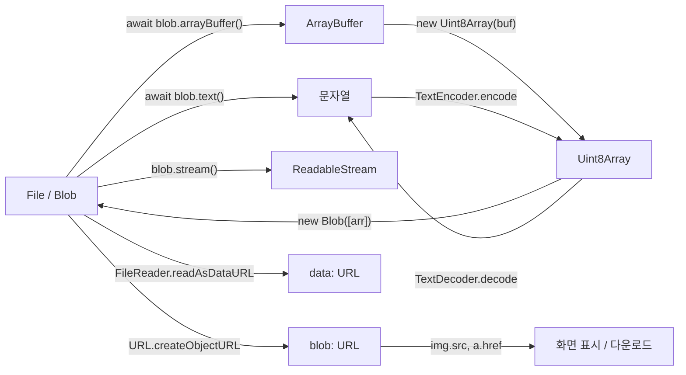

<Callout type="info">
  **이번 문서의 목표:** 이 파일을 다 읽으면 브라우저에서 이진 데이터가 Blob·ArrayBuffer·TypedArray·문자열 사이에서 어떻게 오가는지 설명하고, 파일 업로드·미리보기·다운로드를 객체 URL 누수 없이 구현할 수 있다.
</Callout>

## 왜 별도의 이진 데이터 체계가 필요한가

자바스크립트는 오랫동안 **문자열과 숫자의 언어**였습니다. 웹 페이지가 다루는 것은 텍스트였고, 이미지는 `img` 태그의 `src`에 URL을 넣으면 브라우저가 알아서 처리했습니다. 자바스크립트가 이미지의 **바이트 자체**를 만질 일은 없었습니다.

그런데 이런 요구가 생깁니다.

- 사용자가 고른 사진을 **업로드 전에 화면에 미리 보여주고**, 크기를 줄여서 보내고 싶다.
- 서버가 만들어 준 CSV를 받아 **파일로 저장**하게 하고 싶다.
- 3GB짜리 동영상을 **메모리에 통째로 올리지 않고** 조각내어 업로드하고 싶다.

전부 "URL로 가리키는" 방식으로는 안 되는 일입니다. 자바스크립트가 이진 데이터(binary data, 0과 1의 바이트 덩어리)를 **값으로 들고 다닐** 수 있어야 합니다. 그래서 브라우저는 이진 데이터를 표현하는 몇 가지 타입과, 그것들을 서로 변환하는 API 묶음을 제공합니다.

> **쉽게 말하면:** 텍스트는 "말"이고 이진 데이터는 "물건"입니다. 말은 그냥 전달하면 되지만 물건은 담을 상자, 옮길 손수레, 내용물을 꺼내 읽는 도구가 각각 필요합니다. Blob이 상자, 객체 URL이 그 상자에 붙인 임시 주소표, FileReader와 스트림이 꺼내 읽는 도구입니다.

## 1. 이진 데이터 4형제 — ArrayBuffer, TypedArray, DataView, Blob

먼저 지도를 그려 둡시다. 이름이 비슷해 헷갈리지만 역할이 뚜렷이 다릅니다.

| 타입 | 정체 | 읽고 쓸 수 있나 | 주 용도 |
|---|---|---|---|
| `ArrayBuffer` | 고정 길이의 raw 바이트 덩어리 | 직접은 불가 | 메모리 자체를 나타내는 그릇 |
| `Uint8Array` 등 TypedArray | ArrayBuffer를 특정 단위로 보는 창 | 가능 | 바이트 단위 읽기·쓰기 |
| `DataView` | 바이트 순서까지 지정해 보는 창 | 가능 | 파일 포맷 헤더 파싱 |
| `Blob` | 불변의 데이터 덩어리 + MIME 타입 | 직접은 불가 | 파일·네트워크·URL로 오가는 단위 |

핵심 관계를 한 문장으로 말하면 이렇습니다. **`ArrayBuffer`는 바이트를 담고만 있고, 그 안을 읽으려면 `TypedArray`라는 창을 통해 봐야 하며, 그 덩어리를 "파일처럼" 다루고 싶으면 `Blob`으로 감쌉니다.**

> **쉽게 말하면:** `ArrayBuffer`는 창문 없는 창고, `Uint8Array`는 그 창고 벽에 뚫은 "한 칸에 1바이트씩 보이는 창", `DataView`는 "몇 바이트씩 어느 방향으로 읽을지 매번 고르는 조절 가능한 창"입니다.

`Uint8Array`라는 이름도 쪼개면 뜻이 드러납니다. **U**nsigned(부호 없는) + **int**(정수) + **8**(8비트, 즉 1바이트) + Array(배열). 즉 0부터 255까지의 값이 늘어선 배열로 메모리를 본다는 뜻입니다. `Int16Array`라면 부호 있는 16비트 정수(2바이트) 단위로 같은 메모리를 보는 창입니다.

<Callout type="warning">
  **자주 틀리는 점:** TypedArray는 **복사본이 아니라 창**입니다. 같은 `ArrayBuffer` 위에 `Uint8Array`와 `Int16Array`를 동시에 만들면, 한쪽에서 값을 바꿀 때 다른 쪽에도 그대로 비칩니다. 성능상 이점이지만, 무심코 쓰면 원인을 찾기 어려운 버그가 됩니다.
</Callout>

### Blob — 브라우저 세계의 파일 단위

**Blob**은 Binary Large OBject(이진 대용량 객체)의 약자입니다. 정의는 간단합니다. **불변**(immutable)**인 바이트 덩어리와 MIME 타입을 함께 들고 있는 객체.** 두 가지 성질이 결정적입니다.

1. **불변이다.** 만든 뒤 내용을 수정할 수 없습니다. 바꾸려면 새 Blob을 만듭니다. 그래서 여러 곳에서 안심하고 공유할 수 있습니다.
2. **메모리에 전부 올라와 있다는 보장이 없다.** 이것이 Blob의 진짜 힘입니다. 사용자가 고른 3GB 동영상 파일도 Blob으로 표현되지만, 브라우저는 실제로는 **디스크의 그 파일을 가리키는 참조**만 들고 있을 수 있습니다. 읽으라고 요청할 때 비로소 조금씩 읽습니다.

`Blob`을 만드는 방법은 배열과 옵션을 넘기는 것입니다.

```js
const 블롭 = new Blob(['안녕하세요\n', '두 번째 줄'], { type: 'text/plain' });
console.log(블롭.size); // 바이트 수 (문자 수가 아님에 주의)
console.log(블롭.type); // 'text/plain'
```

첫 인자는 조각들의 배열입니다. 문자열, 다른 Blob, ArrayBuffer, TypedArray를 섞어 넣을 수 있고 브라우저가 순서대로 이어 붙입니다. `size`는 **문자 수가 아니라 바이트 수**입니다 — 한글 한 글자는 UTF-8에서 3바이트이므로, `'안녕'`으로 만든 Blob의 `size`는 6입니다. 이 구분은 뒤의 인코딩 절에서 다시 짚습니다.

### File — 이름과 수정 시각이 붙은 Blob

`File`은 `Blob`을 **상속**한 타입입니다. 즉 File은 Blob이 할 수 있는 모든 것을 할 수 있고, 여기에 두 가지 정보가 더 붙습니다.

- `name` — 파일 이름(경로가 아니라 이름만. 보안상 전체 경로는 절대 노출되지 않습니다)
- `lastModified` — 마지막 수정 시각

File은 보통 사용자가 파일 선택 창이나 드래그 앤 드롭으로 **직접 고른 결과**로 얻습니다. 자바스크립트가 마음대로 사용자의 디스크를 뒤져 File을 만들 수는 없습니다. 이 "사용자의 명시적 행위가 있어야 파일에 접근할 수 있다"는 원칙이 브라우저 파일 보안 모델의 출발점입니다.

## 2. 변환의 지도 — 무엇에서 무엇으로 갈 수 있는가

이 영역이 어려운 진짜 이유는 API가 어려워서가 아니라 **변환 경로가 여러 개**여서입니다. 지도를 먼저 봅시다.



이 그림에서 실무 판단이 갈리는 지점은 오른쪽 위의 두 갈래, **`blob:` URL과 `data:` URL**입니다. 둘 다 "Blob을 화면에 보여주는 주소"를 만들지만 성질이 정반대입니다.

| 항목 | `blob:` 객체 URL | `data:` URL |
|---|---|---|
| 만드는 법 | `URL.createObjectURL(blob)` | `FileReader.readAsDataURL` |
| 내용 | 짧은 참조 문자열 | 데이터 전체를 Base64로 담은 문자열 |
| 길이 | 항상 짧음 | 원본의 약 1.33배 |
| 비용 | 거의 없음 | 인코딩 시간 + 메모리 |
| 수명 | 해제할 때까지 유지 – 직접 해제해야 함 | 문자열이므로 GC가 알아서 처리 |
| 다른 문서로 전달 | 불가 – 만든 문서에서만 유효 | 가능 – 그냥 문자열이므로 |

**미리보기에는 거의 언제나 `blob:` 객체 URL이 정답입니다.** 5MB 사진을 `data:` URL로 만들면 약 6.7MB짜리 문자열이 메모리에 생기고, 그 문자열이 DOM 속성에 들어가면 또 한 벌이 생깁니다. `blob:`은 그냥 짧은 주소표 하나입니다.

## 3. 객체 URL의 수명 — 브라우저의 흔한 메모리 누수

`URL.createObjectURL(blob)`은 `blob:https://example.com/3f2a...` 같은 문자열을 돌려줍니다. 이 문자열은 그냥 문자열이 아니라, **브라우저 내부 표에 등록된 항목**입니다. 등록된 동안 그 Blob은 **가비지 컬렉션 대상이 되지 않습니다.**

> **쉽게 말하면:** 객체 URL을 만드는 것은 창고 물건에 "폐기 금지" 딱지를 붙이는 일입니다. 딱지를 떼지 않으면, 그 물건을 아무도 안 쓰게 되어도 창고에 영원히 남습니다.

딱지를 떼는 함수가 `URL.revokeObjectURL(url)`입니다. 이걸 부르지 않으면 **문서가 살아 있는 동안 그 Blob 전체가 메모리에 잡혀 있습니다.** 사진 100장을 미리보기하는 갤러리에서 이 호출을 빼먹으면 탭 메모리가 수백 MB로 부풀어 오릅니다.

문제는 "언제 떼느냐"입니다. 이미지에 붙였다면 **이미지가 다 로드된 뒤**여야 합니다. 붙이자마자 해제하면 브라우저가 아직 읽기 전이라 이미지가 깨집니다.

```js
const 주소 = URL.createObjectURL(선택한파일);
이미지.src = 주소;
이미지.onload = () => URL.revokeObjectURL(주소); // 로드 완료 후 해제
```

다운로드 링크라면 클릭이 처리된 다음 이벤트 루프 차례에 해제합니다. 즉 `revoke`의 시점 규칙은 하나입니다 — **그 URL을 소비하는 쪽이 읽기를 끝낸 뒤.**

<Callout type="warning">
  **자주 틀리는 점:** 같은 Blob으로 `createObjectURL`을 두 번 부르면 **서로 다른 주소 두 개**가 만들어지고, 각각 따로 해제해야 합니다. 반환값을 변수에 담아 재사용하지 않고 `img.src = URL.createObjectURL(파일)`을 렌더링할 때마다 호출하는 코드가 전형적인 누수 패턴입니다.
</Callout>

### 직접 실험해 보기

아래 실습기는 파일 선택, Blob 생성, 미리보기, 다운로드, 객체 URL 해제까지 한 흐름으로 담았습니다. 이미지를 골라 보고, 콘솔에 찍히는 크기와 타입을 확인해 보세요.

<CodePlayground
  template="vanilla"
  activeFile="/index.js"
  showConsole
  label="Blob 만들기 · 파일 읽기 · 객체 URL 수명 관리"
  files={{
    '/index.html': `<div id="app">
  <p>이미지 파일을 골라보세요.</p>
  <input type="file" id="선택" accept="image/*" />
  <div id="미리보기"></div>
  <hr />
  <button id="내려받기">텍스트 파일로 내려받기</button>
</div>
<script src="index.js"></script>`,
    '/index.js': `// --- 1. 코드로 Blob 직접 만들기 -------------------------
const 텍스트블롭 = new Blob(['안녕하세요\\n두 번째 줄'], { type: 'text/plain' });
console.log('Blob size(바이트):', 텍스트블롭.size);
console.log('Blob type:', 텍스트블롭.type);
console.log('문자 길이와 바이트 수는 다르다 — 한글은 UTF-8에서 3바이트');

// Blob 읽기: 최신 방식은 Promise 기반 메서드
텍스트블롭.text().then((글) => console.log('blob.text() 결과:',글));
텍스트블롭.arrayBuffer().then((버퍼) => {
  const 바이트 = new Uint8Array(버퍼);
  console.log('앞 6바이트:', Array.from(바이트.slice(0, 6)));
});

// slice: 잘라내도 원본은 그대로 (Blob은 불변)
const 앞부분 = 텍스트블롭.slice(0, 6);
console.log('slice한 조각의 size:', 앞부분.size);

// --- 2. 사용자가 고른 파일 다루기 -------------------------
const 선택 = document.getElementById('선택');
const 미리보기 = document.getElementById('미리보기');
let 현재주소 = null;

선택.addEventListener('change', () => {
  const 파일 = 선택.files[0];
  if (!파일) return;

  // File은 Blob을 상속한다 — name, lastModified가 더 붙어 있다
  console.log('---');
  console.log('이름:', 파일.name);
  console.log('타입:', 파일.type);
  console.log('크기(바이트):', 파일.size);
  console.log('Blob의 인스턴스인가?', 파일 instanceof Blob);

  // 이전 주소가 있으면 반드시 해제 — 누수 방지의 핵심
  if (현재주소) URL.revokeObjectURL(현재주소);

  현재주소 = URL.createObjectURL(파일);
  console.log('만들어진 객체 URL:', 현재주소);

  미리보기.innerHTML = '';
  const 이미지 = document.createElement('img');
  이미지.style.maxWidth = '200px';
  이미지.src = 현재주소;
  // 로드가 끝난 뒤 해제해야 안전하다
  이미지.onload = () => console.log('이미지 로드 완료 — 이제 해제해도 안전');
  미리보기.appendChild(이미지);

  // 같은 파일로 두 번 만들면 서로 다른 주소가 나온다
  const 또다른주소 = URL.createObjectURL(파일);
  console.log('두 주소가 같은가?', 현재주소 === 또다른주소);
  URL.revokeObjectURL(또다른주소);
});

// --- 3. Blob을 파일로 내려받기 ---------------------------
document.getElementById('내려받기').addEventListener('click', () => {
  const 주소 = URL.createObjectURL(텍스트블롭);
  const 링크 = document.createElement('a');
  링크.href = 주소;
  링크.download = '메모.txt'; // 이 속성이 내비게이션 대신 저장을 유도한다
  링크.click();
  // 클릭 처리가 끝난 다음 차례에 해제
  setTimeout(() => URL.revokeObjectURL(주소), 0);
  console.log('다운로드 트리거 후 객체 URL 해제 예약');
});`,
  }}
/>

## 4. FileReader vs 최신 Promise 메서드

`FileReader`는 File API의 원조 읽기 도구입니다. 이벤트 기반이라 코드가 길어집니다.

```js
const 리더 = new FileReader();
리더.addEventListener('load', () => console.log(리더.result));
리더.addEventListener('error', () => console.error(리더.error));
리더.addEventListener('progress', (e) => {
  if (e.lengthComputable) console.log(Math.round((e.loaded / e.total) * 100), '퍼센트');
});
리더.readAsText(파일);
```

`readAs`로 시작하는 메서드가 넷 있습니다.

| 메서드 | 결과 타입 | 언제 쓰나 |
|---|---|---|
| `readAsText` | 문자열 | 텍스트·CSV·JSON 파일 |
| `readAsArrayBuffer` | ArrayBuffer | 바이트 단위 처리 |
| `readAsDataURL` | `data:` URL 문자열 | 다른 문서로 옮길 이미지 |
| `readAsBinaryString` | 레거시 문자열 | 쓰지 말 것 – 폐기 예정 |

그런데 요즘은 Blob 자체에 `text()`, `arrayBuffer()`, `bytes()` 같은 **Promise 반환 메서드**가 있어 대부분의 경우 `FileReader`가 필요 없습니다. 그렇다면 FileReader는 언제 쓸까요? 답은 **진행률**(progress)입니다. Promise 메서드는 "다 됐다" 한 번만 알려주지만, FileReader는 `progress` 이벤트로 중간 상태를 알려줍니다. 큰 파일 읽기에 프로그레스 바를 붙일 때는 여전히 FileReader가 필요하거나, 아래의 스트림을 씁니다.

### 대용량 파일 — 읽지 말고 흘려보내기

여기서 21편의 가장 중요한 실무 원칙이 나옵니다. **3GB 파일을 `arrayBuffer` 메서드로 읽으면 3GB가 메모리에 올라옵니다.** 탭이 죽습니다.

해법은 두 가지입니다.

첫째, **읽지 않고 그대로 넘기기.** `fetch`의 본문에 Blob이나 File을 그대로 넘길 수 있습니다. 브라우저가 알아서 디스크에서 조금씩 읽어 네트워크로 흘려보냅니다.

```js
await fetch('/업로드', { method: 'POST', body: 선택한파일 }); // 메모리에 안 올림
```

둘째, **조각내어 처리하기.** `blob.slice(시작, 끝)`은 원본을 복사하지 않고 **범위를 가리키는 새 Blob**을 만듭니다. 청크 업로드·이어받기의 기반이 이것입니다.

```js
const 조각크기 = 5 * 1024 * 1024; // 5MB
for (let 위치 = 0; 위치 < 파일.size; 위치 += 조각크기) {
  const 조각 = 파일.slice(위치, 위치 + 조각크기);
  await fetch('/업로드/조각', { method: 'POST', body: 조각 });
}
```

셋째, 11편에서 본 **스트림**을 쓰는 방법입니다. `blob.stream()`은 `ReadableStream`을 돌려주므로, 한 청크씩 받아 처리하고 버릴 수 있습니다.

## 5. Encoding — 문자와 바이트 사이

마지막 조각은 **문자열과 바이트의 변환**입니다. 앞에서 "한글 한 글자는 3바이트"라고 지나갔는데, 여기서 제대로 짚습니다.

자바스크립트의 문자열은 메모리에서 UTF-16이라는 방식으로 표현됩니다. 반면 네트워크·파일 세계의 사실상 표준은 **UTF-8**입니다. UTF-8은 문자마다 바이트 수가 달라지는 **가변 길이 인코딩**(variable-length encoding)입니다.

| 문자 종류 | UTF-8 바이트 수 |
|---|---|
| 영문·숫자·기본 기호 | 1 |
| 라틴 확장·그리스·키릴 | 2 |
| 한글·한자·일본어 | 3 |
| 이모지 등 보조 평면 | 4 |

이 표가 실무에서 중요한 이유는 **"길이"의 정의가 문맥마다 다르기 때문**입니다. 입력값을 100자로 제한했는데 서버 컬럼은 100바이트라면, 한글 34자에서 이미 터집니다. 브라우저에서 바이트 수를 정확히 재는 표준 도구가 **TextEncoder**입니다.

- `new TextEncoder()` — 항상 UTF-8로만 인코딩합니다. 다른 인코딩 옵션이 없습니다. 웹은 UTF-8로 통일하자는 스펙의 의도적 선택입니다.
- `new TextDecoder(라벨)` — 반대로 디코딩할 때는 `'euc-kr'`, `'shift_jis'` 같은 레거시 인코딩도 지정할 수 있습니다. 과거에 만들어진 파일을 읽어야 하기 때문입니다.

<CodePlayground
  template="vanilla"
  activeFile="/index.js"
  showConsole
  label="TextEncoder·TextDecoder — 문자와 바이트의 왕복"
  files={{
    '/index.js': `const 인코더 = new TextEncoder();
const 디코더 = new TextDecoder(); // 기본값 utf-8

// 1. 문자 수와 바이트 수는 다르다
const 표본 = ['A', '가', '한글', 'Hi가', '😀'];
표본.forEach((글자) => {
  const 바이트 = 인코더.encode(글자);
  console.log(
    '문자열:', 글자,
    '| length(문자 단위):', 글자.length,
    '| UTF-8 바이트 수:', 바이트.length
  );
});

// 2. encode의 결과는 Uint8Array — 즉 바이트 배열이다
const 바이트들 = 인코더.encode('한A');
console.log('바이트 나열:', Array.from(바이트들));
console.log('한글 3바이트 + 영문 1바이트 = 총', 바이트들.length);

// 3. 다시 문자열로 돌아오기
console.log('decode 결과:', 디코더.decode(바이트들));

// 4. 잘못 자르면 글자가 깨진다 — 3바이트 중 2바이트만 디코딩
const 잘린것 = 바이트들.slice(0, 2);
console.log('중간에 자른 뒤 decode:', 디코더.decode(잘린것));
console.log('이것이 스트림을 임의로 자르면 안 되는 이유다');

// 5. Blob의 size는 바이트 수와 일치한다
const 블롭 = new Blob(['한A']);
console.log('Blob size:', 블롭.size, '=== 인코딩 바이트 수:', 바이트들.length);

// 6. 바이트 배열 -> Blob -> 다시 텍스트
const 되돌린블롭 = new Blob([바이트들], { type: 'text/plain' });
되돌린블롭.text().then((글) => console.log('Blob 왕복 결과:', 글));

// 7. 입력 길이 제한을 바이트로 재기
function 바이트길이(문자열) {
  return 인코더.encode(문자열).length;
}
console.log('닉네임 34자 한글의 바이트:', 바이트길이('한'.repeat(34)));`,
  }}
/>

실험 4번이 특히 중요합니다. 3바이트짜리 글자를 2바이트에서 자르면 **대체 문자**(replacement character)가 나옵니다. 스트리밍으로 텍스트를 읽을 때 청크 경계가 글자 한가운데를 지나갈 수 있는데, 이 때문에 `TextDecoder`에는 `decode(청크, { stream: true })` 옵션이 있습니다. 이 옵션을 주면 디코더가 **잘린 바이트를 다음 청크까지 들고 기다립니다.** 스트리밍 텍스트 처리에서 글자가 깨진다면 십중팔구 이 옵션을 빠뜨린 것입니다.

<Callout type="warning">
  **자주 틀리는 점:** `문자열.length`는 UTF-16 단위의 개수이지 사람이 세는 글자 수도, 바이트 수도 아닙니다. 이모지 하나의 `length`는 2가 나오는 경우가 흔합니다. 바이트 수가 필요하면 `TextEncoder`, 사람이 인식하는 글자 수가 필요하면 `Intl.Segmenter`를 씁니다.
</Callout>

## 핵심 정리

- `ArrayBuffer`는 바이트 덩어리 자체, TypedArray와 `DataView`는 그것을 들여다보는 창, `Blob`은 MIME 타입이 붙은 불변 덩어리이고 `File`은 이름·수정 시각이 더해진 Blob이다.
- Blob은 메모리에 전부 올라와 있다는 보장이 없어, 거대한 파일도 참조만으로 다룰 수 있다 — `slice`·`stream()`·`fetch` 본문 직접 전달이 대용량 처리의 열쇠다.
- `URL.createObjectURL`은 Blob에 "폐기 금지" 딱지를 붙이는 일이므로, 소비가 끝난 뒤 반드시 `revokeObjectURL`으로 떼야 한다. 호출마다 새 주소가 생긴다.
- 미리보기는 짧은 `blob:` URL, 다른 문서로 값을 옮겨야 할 때만 무거운 `data:` URL을 쓴다.
- 문자열과 바이트는 다르다. `TextEncoder`는 UTF-8 전용이고, 스트리밍 디코딩에는 `stream: true`가 필요하다.

## 마무리 복습

<Quiz
  questionNumber={1}
  question="Blob과 File의 관계로 가장 정확한 설명은?"
  options={['File은 Blob을 상속하며 name과 lastModified가 추가된 타입이다', 'Blob은 File을 상속한 하위 타입이다', '둘은 완전히 무관한 별개의 타입이다', 'File은 Blob을 Base64로 인코딩한 문자열이다']}
  correctAnswer={1}
  explanation="File은 Blob의 하위 타입이므로 slice, text, stream 등 Blob의 모든 기능을 그대로 쓸 수 있고, 여기에 파일 이름과 수정 시각이 더해진다."
  optionExplanations={['정답 — 상속 방향이 File에서 Blob 쪽이다', '상속 방향이 반대다', 'instanceof Blob 검사가 File에 대해 참이 된다', 'File은 문자열이 아니라 객체다']}
/>

<Quiz
  questionNumber={2}
  question="5MB 이미지를 화면에 미리보기 할 때 data URL 대신 객체 URL을 권장하는 주된 이유는?"
  options={['data URL은 이미지 포맷을 바꿔버리기 때문', 'data URL은 데이터 전체를 Base64 문자열로 담아 약 1.33배 크기의 메모리를 추가로 쓰기 때문', '객체 URL만 img 태그에서 동작하기 때문', 'data URL은 보안상 차단되기 때문']}
  correctAnswer={2}
  explanation="객체 URL은 짧은 참조 문자열이지만 data URL은 원본 전체를 Base64로 인코딩한 문자열이라 인코딩 비용과 메모리 사용이 크게 늘어난다."
  optionExplanations={['포맷은 바뀌지 않는다', '정답 — Base64는 3바이트를 4문자로 바꾸므로 약 1.33배가 된다', '둘 다 img의 src로 동작한다', 'data URL이 일괄 차단되지는 않는다']}
/>

<Quiz
  questionNumber={3}
  question="URL.createObjectURL로 만든 주소를 revokeObjectURL로 해제하지 않으면 어떤 일이 생기는가?"
  options={['다음 렌더링에서 자동으로 해제된다', '문서가 살아 있는 동안 해당 Blob이 가비지 컬렉션되지 않아 메모리에 계속 남는다', '주소가 즉시 무효가 되어 이미지가 깨진다', '브라우저가 자동으로 data URL로 변환한다']}
  correctAnswer={2}
  explanation="객체 URL은 브라우저 내부 표에 등록되며 등록된 동안 Blob은 회수되지 않는다. 갤러리처럼 많은 파일을 다루면 심각한 메모리 누수가 된다."
  optionExplanations={['자동 해제는 문서가 언로드될 때뿐이다', '정답 — 등록이 곧 참조 유지다', '해제하지 않았으므로 오히려 계속 유효하다', '그런 자동 변환은 없다']}
/>

<Quiz
  questionNumber={4}
  question="3GB 동영상 파일을 서버로 업로드할 때 메모리를 터뜨리지 않는 방법으로 알맞지 않은 것은?"
  options={['fetch의 body에 File 객체를 그대로 넘긴다', 'blob.slice로 조각내어 순차 전송한다', 'blob.stream으로 청크 단위로 읽어 처리한다', 'arrayBuffer로 전부 읽은 뒤 Uint8Array로 변환해 보낸다']}
  correctAnswer={4}
  explanation="arrayBuffer는 파일 전체를 메모리로 올린다. 나머지 셋은 모두 디스크에서 필요한 만큼만 읽어 흘려보내는 방식이다."
  optionExplanations={['브라우저가 알아서 스트리밍한다', 'slice는 범위 참조만 만들 뿐 복사하지 않는다', '스트림은 청크 단위 처리의 표준 수단이다', '정답(부적절) — 3GB가 통째로 메모리에 올라온다']}
/>

<Quiz
  questionNumber={5}
  question="문자열 한글 두 글자로 만든 Blob의 size 값은?"
  options={['2', '4', '6', '문자 인코딩과 무관하게 항상 1']}
  correctAnswer={3}
  explanation="Blob의 size는 문자 수가 아니라 바이트 수다. UTF-8에서 한글 한 글자는 3바이트이므로 두 글자는 6바이트다."
  optionExplanations={['2는 문자 수다', '4는 UTF-16 바이트 수에 해당하지만 Blob은 UTF-8로 인코딩한다', '정답 — 3바이트 곱하기 2', 'size는 실제 바이트 수를 반영한다']}
/>

<Quiz
  questionNumber={6}
  question="스트리밍으로 받은 청크를 TextDecoder로 디코딩할 때 한글이 깨지는 현상을 막는 방법은?"
  options={['decode 호출 시 stream 옵션을 true로 주어 잘린 바이트를 다음 청크까지 보류하게 한다', 'TextDecoder 대신 TextEncoder를 쓴다', '청크를 Base64로 먼저 변환한다', '인코딩 라벨을 utf-16으로 바꾼다']}
  correctAnswer={1}
  explanation="청크 경계가 여러 바이트짜리 글자 한가운데를 지날 수 있다. stream 옵션은 미완성 바이트를 보류했다가 다음 청크와 이어 붙여 디코딩한다."
  optionExplanations={['정답 — 스트리밍 텍스트 처리의 필수 옵션이다', 'TextEncoder는 반대 방향 변환 도구다', 'Base64 변환은 문제를 해결하지 않는다', '원본이 UTF-8인데 라벨을 바꾸면 더 깨진다']}
/>

<Quiz
  questionNumber={7}
  question="FileReader를 최신 Promise 메서드 대신 여전히 쓸 만한 상황은?"
  options={['파일 크기를 알아낼 때', '읽기 진행률을 progress 이벤트로 표시해야 할 때', 'Blob을 slice 할 때', 'MIME 타입을 확인할 때']}
  correctAnswer={2}
  explanation="blob.text나 blob.arrayBuffer는 완료 시점만 알려준다. 중간 진행 상황이 필요하면 FileReader의 progress 이벤트나 스트림을 써야 한다."
  optionExplanations={['size 속성으로 즉시 알 수 있다', '정답 — 진행률 보고가 FileReader가 남아 있는 이유다', 'slice는 Blob 자체의 메서드다', 'type 속성으로 즉시 알 수 있다']}
/>

## 참고 자료

- [MDN - File API (Blob, File, FileReader)](https://developer.mozilla.org/en-US/docs/Web/API/File_API)
- [MDN - Streams API](https://developer.mozilla.org/en-US/docs/Web/API/Streams_API)
- [MDN - Web APIs 카탈로그](https://developer.mozilla.org/en-US/docs/Web/API)
