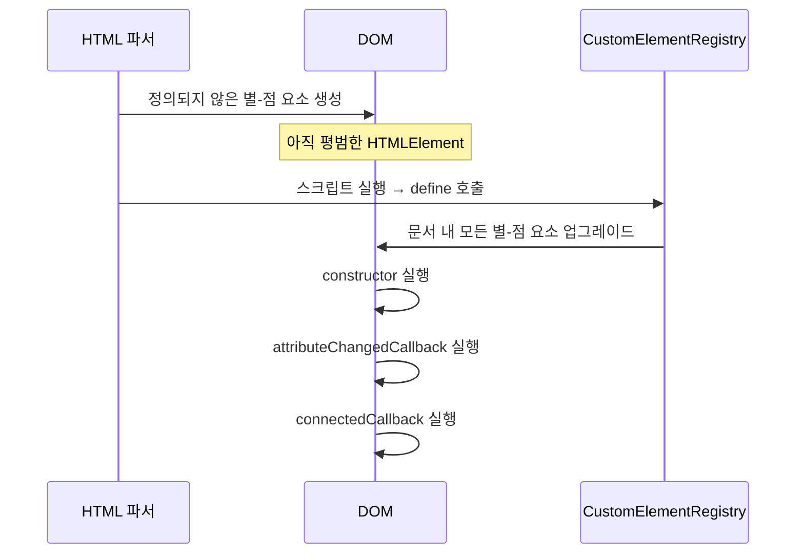
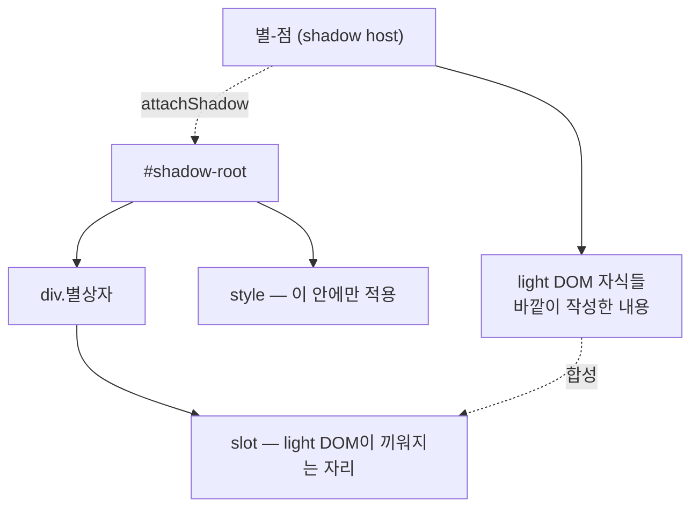

<Callout type="info">
  **이번 문서의 목표:** 이 파일을 다 읽으면 프레임워크 없이 재사용 가능한 커스텀 태그를 정의하고, Shadow DOM이 무엇을 막고 무엇을 통과시키는지 경계를 정확히 말하며, `slot`으로 외부 콘텐츠를 받는 컴포넌트를 설계할 수 있다.
</Callout>

## 왜 브라우저 표준 컴포넌트가 필요한가

React·Vue를 써 본 사람은 컴포넌트라는 개념이 낯설지 않습니다. 그런데 그것들은 전부 **라이브러리가 만든 규칙**입니다. React 컴포넌트는 React 앱 안에서만 컴포넌트이고, 브라우저 입장에서는 그저 `div` 더미입니다.

그래서 이런 문제가 생깁니다.

- 디자인 시스템의 버튼을 만들었는데, React 팀·Vue 팀·순수 HTML 페이지가 각각 다시 구현해야 한다.
- 위젯을 남의 사이트에 삽입했더니 그 사이트의 `button { padding: 0 }` 한 줄에 디자인이 무너진다.
- 반대로 내 위젯의 CSS가 남의 페이지를 망가뜨린다.

두 번째·세 번째가 특히 고약합니다. **CSS는 기본적으로 전역**이기 때문입니다. 클래스 이름을 `.내회사-버튼-기본형`처럼 길게 짓는 관습(BEM 등)이 생긴 것도, CSS-in-JS가 해시 접미사를 붙이는 것도 전부 **전역 이름 충돌을 규율로 피해 보려는 시도**였습니다. 규율은 어기면 무너집니다.

> **쉽게 말하면:** 지금까지의 CSS 격리는 "서로 같은 이름 쓰지 말자"는 신사협정이었습니다. Shadow DOM은 아예 **벽을 세우는** 일입니다. 벽 안쪽 이름은 바깥에서 부를 수 없습니다.

**Web Components**는 이 문제를 브라우저 차원에서 푸는 세 가지 표준의 묶음입니다.

| 표준 | 해결하는 문제 |
|---|---|
| Custom Elements | 내가 만든 태그를 브라우저가 정식 요소로 인정하게 한다 |
| Shadow DOM | 컴포넌트 내부의 DOM과 CSS를 바깥과 격리한다 |
| `template`·`slot` | 재사용할 마크업 틀을 미리 두고, 외부 콘텐츠를 끼워 넣는다 |

셋은 독립적이라 따로 써도 됩니다. 하지만 합쳤을 때 비로소 "브라우저가 이해하는 컴포넌트"가 됩니다.

## 1. Custom Elements — 내 태그를 브라우저에 등록하기

### 정의와 등록

커스텀 요소는 **클래스로 동작을 정의하고, 레지스트리에 이름을 등록**하는 두 단계로 만듭니다.

```js
class 별점표시 extends HTMLElement {
  connectedCallback() {
    this.textContent = '★'.repeat(Number(this.getAttribute('점수')) || 0);
  }
}
customElements.define('별-점', 별점표시);
```

이제 HTML에 `별-점` 태그를 쓰면 브라우저가 이 클래스를 붙여 줍니다.

이름 규칙에 강제 사항이 하나 있습니다. **커스텀 요소 이름에는 반드시 하이픈이 들어가야 합니다.** `myButton`은 안 되고 `my-button`은 됩니다. 이유는 **미래의 HTML 표준과 충돌하지 않기 위해서**입니다. 표준 HTML 태그에는 하이픈이 없다는 규칙을 브라우저가 스스로에게 부과했기 때문에, 하이픈이 있으면 그것은 100퍼센트 개발자가 만든 태그입니다. 파서가 태그 이름만 보고 즉시 판별할 수 있는 것입니다.

또 하나. 커스텀 요소 클래스는 반드시 `HTMLElement`(또는 그 하위 클래스)를 **상속**해야 합니다. 상속을 통해 그 요소는 `addEventListener`, `getAttribute`, `style` 같은 DOM 요소의 모든 능력을 물려받습니다.

### 라이프사이클 콜백 네 가지

커스텀 요소의 진짜 힘은 **브라우저가 정해진 시점에 내 메서드를 불러 준다**는 데 있습니다.

| 콜백 | 호출 시점 | 주 용도 |
|---|---|---|
| `constructor` | 요소 인스턴스가 만들어질 때 | Shadow DOM 부착, 내부 상태 초기화 |
| `connectedCallback` | 문서에 삽입될 때 | 렌더링, 이벤트 리스너 등록, 구독 시작 |
| `disconnectedCallback` | 문서에서 제거될 때 | 리스너 해제, 타이머·구독 정리 |
| `attributeChangedCallback` | 관찰 대상 속성이 바뀔 때 | 속성 변화를 화면에 반영 |

여기서 **`constructor`와 `connectedCallback`의 역할 분담**이 이 절의 핵심입니다. 스펙은 `constructor`에서 하면 안 되는 일을 명시합니다.

- 자식 요소를 추가하면 안 된다.
- 속성을 읽거나 쓰면 안 된다.

왜일까요? `document.createElement('별-점')`으로 만든 직후를 생각해 보세요. 그 시점의 요소는 **아직 문서에 붙지도 않았고, HTML에 적힌 속성도 파서가 아직 넣어 주지 않은 상태**일 수 있습니다. 여기서 속성을 읽으면 `null`이고, 자식을 넣으면 곧이어 파서가 넣는 자식과 뒤섞입니다.

> **쉽게 말하면:** `constructor`는 아직 이삿짐 트럭에 실려 있는 상태입니다. 가구 배치(자식 추가)와 주소 확인(속성 읽기)은 집에 도착한 뒤, 즉 `connectedCallback`에서 합니다.

<Callout type="warning">
  **자주 틀리는 점:** `connectedCallback`은 **여러 번 호출될 수 있습니다.** 요소를 다른 부모로 옮기면 제거·삽입이 일어나 `disconnectedCallback`과 `connectedCallback`이 다시 불립니다. "최초 1회 초기화"가 필요하면 직접 플래그를 두거나, 매번 호출되어도 안전하도록 짜야 합니다. 반대로 리스너 등록을 `connectedCallback`에서 하고 해제를 `disconnectedCallback`에서 하지 않으면 이동할 때마다 리스너가 중복 등록됩니다.
</Callout>

### 속성 관찰과 업그레이드

`attributeChangedCallback`은 그냥 두면 아무 속성에 대해서도 불리지 않습니다. **관찰할 속성 목록을 정적 속성으로 선언**해야 합니다.

```js
class 별점표시 extends HTMLElement {
  static observedAttributes = ['점수'];

  attributeChangedCallback(이름, 이전값, 새값) {
    if (이전값 === 새값) return;
    this.그리기();
  }
}
```

관찰 목록을 강제하는 이유는 성능입니다. 모든 속성 변경을 전부 콜백으로 알리면, 스타일 하나 바꿀 때마다 자바스크립트가 실행됩니다. 관심 있는 것만 미리 선언하게 해 브라우저가 그 외의 변경은 값싸게 처리합니다.

여기에 **업그레이드**(upgrade)라는 개념이 하나 더 있습니다. HTML에 `별-점` 태그가 있는데 정의 스크립트가 아직 로드되지 않았다면 어떻게 될까요? 브라우저는 그 요소를 **알 수 없는 요소로 일단 만들어 두고**, 나중에 `customElements.define`이 호출되는 순간 **소급해서** 클래스를 적용하고 라이프사이클을 실행합니다. 이것이 업그레이드입니다.



덕분에 커스텀 요소 스크립트를 `defer`로 늦게 불러도 안전합니다. 다만 업그레이드 전 상태를 CSS로 다루고 싶다면 `:defined` 의사 클래스를 씁니다 — 정의되지 않은 동안 숨겨 두면 레이아웃이 튀는 현상을 막을 수 있습니다.

## 2. Shadow DOM — 벽의 실제 경계

### 그림자 트리를 붙인다는 것

`element.attachShadow({ mode: 'open' })`을 호출하면, 그 요소에 **그림자 뿌리**(shadow root)가 생깁니다. 이제 그 요소는 두 개의 세계를 갖습니다.

- **light DOM**(밝은 DOM) — HTML에 적힌 그대로의 자식들. 바깥에서 보이는 세계.
- **shadow DOM**(그림자 DOM) — 컴포넌트가 내부적으로 만든 세계. 바깥에서 보이지 않음.



세 용어를 정리해 둡시다.

- **shadow host**(그림자 호스트) — 그림자를 달고 있는 그 요소.
- **shadow root**(그림자 뿌리) — 그림자 트리의 최상단 노드. `DocumentFragment`의 일종입니다.
- **shadow tree**(그림자 트리) — 그림자 뿌리 아래 전체.

### 벽은 정확히 무엇을 막는가

여기가 이 문서에서 가장 중요한 절입니다. "캡슐화"라는 말은 뭉뚱그려 쓰이지만, Shadow DOM의 경계는 **막는 것과 통과시키는 것이 항목별로 정해져 있습니다.**

| 항목 | 경계를 넘는가 | 설명 |
|---|---|---|
| 바깥 CSS 선택자 | 막힘 | 바깥의 `.버튼`은 그림자 안 `.버튼`에 닿지 않는다 |
| 안쪽 CSS 선택자 | 막힘 | 그림자 안 스타일은 바깥으로 새지 않는다 |
| `document.querySelector` | 막힘 | 바깥에서 그림자 안 요소를 직접 찾을 수 없다 |
| 상속되는 CSS 속성 | 통과 | `color`, `font-family`, `line-height` 등은 들어온다 |
| CSS 커스텀 속성 | 통과 | `--내색상` 같은 변수는 벽을 넘는다 |
| 이벤트 버블링 | 통과 – 단 대상이 바뀜 | 아래에서 따로 설명 |
| 포커스·접근성 트리 | 대체로 통과 | 사용자에게는 하나의 문서처럼 동작 |

**상속 속성과 커스텀 속성이 통과한다**는 점이 특히 중요합니다. 벽이 완전 밀폐라면 컴포넌트가 페이지의 폰트를 따라갈 수 없어 오히려 쓸모가 없습니다. 그래서 스펙은 "**우연한 충돌은 막고, 의도된 전달은 허용한다**"는 선을 그었습니다. 이 성질 덕분에 Web Components의 표준 테마 방식은 **CSS 커스텀 속성을 공개 API로 노출하는 것**이 됩니다.

```css
/* 컴포넌트 내부 */
:host {
  color: var(--별-색, gold);
}
```

바깥에서는 `별-점 { --별-색: crimson; }` 한 줄로 색을 바꿉니다. 내부 구조는 여전히 감춰져 있고, 컴포넌트가 허락한 손잡이만 열려 있습니다.

여기서 세 가지 특수 선택자를 알아 둘 가치가 있습니다.

- `:host` — 그림자 안에서 **호스트 요소 자신**을 가리킵니다.
- `:host(.강조)` — 호스트가 특정 조건일 때만 적용합니다.
- `::slotted(요소선택자)` — 슬롯에 끼워진 **light DOM 요소**를 그림자 쪽 스타일로 꾸밉니다. 단 한 단계 자식까지만 선택할 수 있습니다.

### open과 closed의 차이 — 그리고 착각

`attachShadow`의 `mode`는 `'open'` 또는 `'closed'`입니다. 차이는 **바깥에서 `element.shadowRoot`로 접근할 수 있는가** 하나뿐입니다. `'closed'`면 `null`이 반환됩니다.

<Callout type="warning">
  **자주 틀리는 점:** `closed`는 **보안 기능이 아닙니다.** 같은 페이지의 자바스크립트는 `attachShadow`를 가로채거나 인스턴스가 들고 있는 참조를 통해 얼마든지 접근할 수 있습니다. 실제로는 디버깅과 테스트만 어려워지는 경우가 많아, 커뮤니티의 권장 기본값은 `open`입니다. 진짜 격리가 필요하면 `iframe`과 출처 분리가 답입니다 – 24편에서 다룹니다.
</Callout>

### 이벤트 리타게팅 — 벽을 넘을 때 정체를 바꾼다

그림자 안 버튼을 클릭하면 이벤트는 바깥으로 버블링됩니다. 그런데 바깥에서 `event.target`을 찍어 보면 그 버튼이 아니라 **호스트 요소**가 나옵니다. 이것을 **리타게팅**(retargeting, 대상 재지정)이라고 합니다.

> **쉽게 말하면:** 회사에 전화해서 담당 직원 이름을 물으면 "저희 회사에서 처리했습니다"라고만 답하는 것과 같습니다. 내부 조직도를 바깥에 노출하지 않는 것이 캡슐화의 일관성입니다.

만약 리타게팅이 없다면, 바깥 코드가 `event.target.className`을 읽는 것만으로 내부 구조를 알아내고 그 구조에 의존하게 됩니다. 그러면 컴포넌트 내부를 바꿀 자유가 사라집니다.

이벤트가 벽을 넘느냐는 이벤트의 `composed` 속성이 정합니다.

| 이벤트 | `composed` | 벽을 넘는가 |
|---|---|---|
| `click`, `keydown`, `focusin` 등 사용자 상호작용 | `true` | 넘는다 |
| `slotchange` | `false` | 그림자 안에 머문다 |
| 기본 옵션으로 만든 `CustomEvent` | `false` | 안 넘는다 |

마지막 줄이 실전 함정입니다. 컴포넌트가 자기 사건을 바깥에 알리려고 `CustomEvent`를 만들 때, 옵션을 빠뜨리면 그림자 경계에서 멈춥니다.

```js
this.dispatchEvent(new CustomEvent('선택됨', {
  detail: { 값: 5 },
  bubbles: true,   // 위로 올라가고
  composed: true,  // 그림자 벽도 넘는다
}));
```

내부 요소를 정확히 알아야 할 때는 `event.composedPath()`를 쓰면 그림자 안쪽까지 포함한 전체 경로 배열을 얻을 수 있습니다.

## 3. template과 slot — 틀과 구멍

### `template` — 파싱은 하되 실행·표시하지 않는 마크업

`template` 태그 안의 내용은 파싱되어 DOM으로 만들어지지만 **렌더링되지 않고, 스크립트도 실행되지 않으며, 이미지도 로드되지 않습니다.** "나중에 복제해서 쓸 도장"입니다.

```js
const 틀 = document.getElementById('별점-틀');
그림자뿌리.appendChild(틀.content.cloneNode(true));
```

`틀.content`는 `DocumentFragment`이고, `cloneNode(true)`로 깊은 복사를 해서 붙입니다. 원본을 그대로 붙이면 한 번밖에 못 쓰므로 **복제가 필수**입니다.

`innerHTML`에 문자열을 넣는 것과 뭐가 다를까요? 인스턴스를 100개 만들 때, `innerHTML`은 **HTML 문자열을 100번 파싱**합니다. `template`은 파싱을 한 번만 하고 100번 복제합니다. 복제는 파싱보다 훨씬 쌉니다.

### `slot` — 외부 콘텐츠가 들어오는 구멍

`slot` 요소는 그림자 트리 안에 뚫어 둔 **자리 표시자**입니다. 호스트의 light DOM 자식들이 그 자리에 **비쳐 보이게** 됩니다.

여기서 정확한 이해가 필요합니다. **light DOM 자식이 그림자 안으로 이동하는 것이 아닙니다.** DOM 트리상으로는 여전히 호스트의 자식입니다. 다만 화면을 그릴 때 슬롯 자리에 배치되어 보일 뿐입니다. 이 "실제 트리와 보이는 결과가 다른" 구조를 **평탄화된 트리**(flattened tree)라고 부릅니다.

> **쉽게 말하면:** 슬롯은 이사가 아니라 **거울**입니다. 물건은 원래 자리에 있고, 거울을 통해 다른 방에서 보이는 것뿐입니다. 그래서 그 요소의 `parentElement`는 여전히 호스트이고, 스타일도 기본적으로 **바깥 문서의 CSS**를 따릅니다.

슬롯은 이름을 붙여 여러 개 둘 수 있습니다.

```html
<카드-상자>
  <h3 slot="제목">알림</h3>
  <p>본문입니다.</p>
</카드-상자>
```

그림자 안에 `slot name="제목"`과 이름 없는 `slot`이 있다면, `slot` 속성이 붙은 요소는 이름이 맞는 슬롯에, 나머지는 이름 없는 **기본 슬롯**에 배치됩니다. 슬롯 안에 미리 내용을 적어 두면 그것이 **폴백**(fallback), 즉 아무것도 안 들어왔을 때의 기본값이 됩니다.

### 직접 만들어 보고 벽을 확인하기

말로 읽는 것보다 한 번 만들어 보는 편이 빠릅니다. 아래 실습기는 커스텀 요소 정의, Shadow DOM 부착, 슬롯, 그리고 **스타일 캡슐화가 실제로 작동하는지 검증**하는 코드를 담았습니다. 콘솔 출력을 꼭 확인하세요.

<CodePlayground
  template="vanilla"
  activeFile="/index.js"
  showConsole
  label="커스텀 요소 정의와 Shadow DOM 캡슐화 검증"
  files={{
    '/index.html': `<style>
  /* 바깥 문서의 전역 스타일 — 그림자 안에 닿을까? */
  .제목 { color: crimson; font-size: 30px; }
  body { font-family: system-ui; color: navy; }
  알림-상자 { --강조색: seagreen; }
</style>

<h3 class="제목">바깥의 제목 (빨강 30px)</h3>

<알림-상자 등급="주의">
  <span slot="머리">저장 완료</span>
  <p class="제목">슬롯으로 들어간 내용 — 이건 무슨 색일까?</p>
</알림-상자>

<script src="index.js"></script>`,
    '/index.js': `class 알림상자 extends HTMLElement {
  static observedAttributes = ['등급'];

  constructor() {
    super();
    // constructor에서 하는 일: 그림자 부착과 내부 상태 초기화까지만.
    // 자식 추가·속성 읽기는 여기서 하면 안 된다.
    this.그림자 = this.attachShadow({ mode: 'open' });
    this.그림자.innerHTML = \`
      <style>
        /* :host — 호스트 요소 자신 */
        :host { display: block; border: 2px solid var(--강조색, gray);
                padding: 12px; border-radius: 8px; margin: 8px 0; }
        /* 바깥에도 .제목이 있지만 서로 닿지 않는다 */
        .제목 { color: var(--강조색, gray); font-weight: bold; font-size: 14px; }
        ::slotted(p) { margin: 4px 0 0; }
      </style>
      <div class="제목"><slot name="머리">기본 제목</slot></div>
      <slot></slot>
    \`;
    console.log('constructor 실행 — 속성 읽기 시도:', this.getAttribute('등급'));
  }

  connectedCallback() {
    console.log('connectedCallback 실행 — 속성 읽기:', this.getAttribute('등급'));
    this.addEventListener('click', this.알리기);
  }

  disconnectedCallback() {
    // 정리하지 않으면 이동할 때마다 리스너가 쌓인다
    this.removeEventListener('click', this.알리기);
  }

  attributeChangedCallback(이름, 이전, 새값) {
    console.log('속성 변화:', 이름, 이전, '->', 새값);
  }

  알리기 = () => {
    // composed를 빼면 그림자 경계에서 멈춘다
    this.dispatchEvent(new CustomEvent('상자클릭', {
      detail: { 등급: this.getAttribute('등급') },
      bubbles: true,
      composed: true,
    }));
  };
}

customElements.define('알림-상자', 알림상자);

// --- 캡슐화 검증 -------------------------------------------
const 상자 = document.querySelector('알림-상자');

// 1. 바깥에서 그림자 안 요소를 찾을 수 있는가?
console.log('---검증---');
console.log('document에서 .제목 개수:', document.querySelectorAll('.제목').length);
console.log('(그림자 안에도 .제목이 있지만 세어지지 않는다)');
console.log('그림자 안 .제목:', 상자.shadowRoot.querySelector('.제목').textContent);

// 2. 슬롯에 들어간 요소의 부모는 어디인가?
const 슬롯내용 = document.querySelector('알림-상자 p');
console.log('슬롯 요소의 parentElement:', 슬롯내용.parentElement.tagName);
console.log('=> 그림자로 이동한 게 아니라 원래 자리에 있다');

// 3. 슬롯에 무엇이 배정됐는지 조회
const 기본슬롯 = 상자.shadowRoot.querySelector('slot:not([name])');
console.log('기본 슬롯에 배정된 노드 수:',
  기본슬롯.assignedElements().length);

// 4. 이벤트 리타게팅 확인
document.addEventListener('click', (e) => {
  console.log('바깥에서 본 target:', e.target.tagName);
  console.log('composedPath 첫 요소(실제 클릭된 것):', e.composedPath()[0].tagName);
});

document.addEventListener('상자클릭', (e) => {
  console.log('커스텀 이벤트 수신, detail:', e.detail);
});

// 5. 속성 변경 → attributeChangedCallback
setTimeout(() => 상자.setAttribute('등급', '위험'), 500);`,
  }}
/>

실행 결과에서 확인할 것을 짚어 봅시다.

1. `constructor`에서 속성을 읽으면 `null`이 나올 수 있고, `connectedCallback`에서는 제대로 나옵니다. 라이프사이클 분담의 이유가 눈으로 보입니다.
2. `document.querySelectorAll('.제목')`은 그림자 안의 같은 클래스를 **세지 않습니다.** 이것이 선택자 격리입니다.
3. 슬롯에 들어간 `p`의 색은 바깥의 `.제목` 규칙을 그대로 받습니다 — 슬롯 콘텐츠는 light DOM 소속이기 때문입니다. 반면 그림자 안의 `.제목`은 컴포넌트 스타일을 따릅니다. **같은 클래스 이름이 한 화면에서 다르게 그려지는 것**이 캡슐화의 증거입니다.
4. 바깥에서 본 `event.target`은 `알림-상자`입니다. `composedPath()[0]`만이 진짜 클릭된 내부 요소를 알려 줍니다.
5. `body`의 `color: navy`나 `font-family`는 그림자 안까지 상속됩니다 — 벽은 상속을 막지 않습니다.

## 4. 속성과 프로퍼티, 그리고 한계

컴포넌트에 데이터를 전달하는 경로는 둘입니다.

- **속성**(attribute) — HTML에 적는 것. `등급="주의"`. **값은 언제나 문자열**입니다.
- **프로퍼티**(property) — 자바스크립트 객체의 필드. `요소.항목목록 = [1, 2, 3]`. **임의의 값**이 가능합니다.

여기서 Web Components의 실질적 한계가 하나 드러납니다. 객체나 배열은 속성으로 넘길 수 없습니다. HTML 속성은 문자열뿐이기 때문입니다. JSON 문자열로 직렬화해 넘길 수는 있지만 비용과 오류의 원인이 됩니다. 그래서 관용적 설계는 **단순 값은 속성, 복잡한 데이터는 프로퍼티**로 나누고, 속성이 바뀌면 프로퍼티에 반영하는 동기화 코드를 직접 씁니다. React·Vue가 `props`로 아무 값이나 넘길 수 있는 것과 대비되는 지점이며, 프레임워크가 여전히 쓰이는 이유이기도 합니다.

Web Components를 언제 고르면 좋은지 정리해 둡시다.

| 상황 | 적합도 |
|---|---|
| 여러 프레임워크가 공유하는 디자인 시스템 | 매우 적합 |
| 남의 사이트에 삽입되는 위젯 | 매우 적합 – 스타일 충돌이 원천 차단 |
| 앱 전체의 화면 상태 관리 | 부적합 – 프레임워크의 영역 |
| 리스트 대량 렌더링과 세밀한 갱신 | 부적합 – 별도 렌더링 전략 필요 |

## 핵심 정리

- Custom Elements는 하이픈이 포함된 이름으로 등록하며, `constructor`는 그림자 부착까지, `connectedCallback`은 속성 읽기·렌더링·구독을 맡는다. 정의가 늦게 로드되면 업그레이드로 소급 적용된다.
- Shadow DOM의 벽은 **선택자와 스타일 누출은 막고, 상속 속성·CSS 커스텀 속성·사용자 이벤트는 통과**시킨다. 그래서 테마의 표준 수단은 CSS 커스텀 속성이다.
- `mode: 'closed'`는 보안 장치가 아니라 접근 편의의 문제이며, 실무 기본값은 `open`이다.
- 이벤트는 벽을 넘을 때 `target`이 호스트로 리타게팅되고, 커스텀 이벤트가 벽을 넘으려면 `composed: true`가 필요하다. 내부 경로는 `composedPath()`로 본다.
- `template`은 한 번 파싱해 여러 번 복제하는 틀이고, `slot`은 light DOM을 이동시키지 않고 비춰 주는 거울이다 — 슬롯 콘텐츠의 스타일은 바깥 문서를 따른다.

## 마무리 복습

<Quiz
  questionNumber={1}
  question="커스텀 요소 이름에 하이픈을 반드시 포함해야 하는 이유는?"
  options={['CSS 선택자에서 구분하기 위해', '표준 HTML 태그에는 하이픈이 없으므로 파서가 이름만 보고 개발자 정의 요소임을 즉시 판별하고 미래 표준과의 충돌을 피하기 위해', '자바스크립트 변수명 규칙 때문에', '접근성 도구가 요구하기 때문에']}
  correctAnswer={2}
  explanation="브라우저는 표준 태그에 하이픈을 쓰지 않기로 스스로 제약을 걸었다. 덕분에 하이픈이 있으면 확실히 커스텀 요소이며, 나중에 새 표준 태그가 생겨도 충돌하지 않는다."
  optionExplanations={['CSS는 하이픈 없이도 태그 선택이 가능하다', '정답 — 이름 공간 충돌을 구조적으로 차단하는 규칙이다', '태그 이름과 변수명 규칙은 무관하다', '접근성과 직접적 관련이 없다']}
/>

<Quiz
  questionNumber={2}
  question="커스텀 요소의 constructor에서 하면 안 되는 일로 옳은 것은?"
  options={['attachShadow 호출', 'super 호출', '속성 읽기와 자식 요소 추가', '내부 필드 초기화']}
  correctAnswer={3}
  explanation="createElement 직후에는 속성이 아직 설정되지 않았고 자식도 파서가 넣기 전일 수 있다. 속성 읽기와 렌더링은 connectedCallback에서 해야 한다."
  optionExplanations={['그림자 부착은 constructor의 대표적 작업이다', 'super 호출은 필수다', '정답 — 시점상 값이 없거나 파서 자식과 충돌한다', '내부 상태 초기화는 권장되는 작업이다']}
/>

<Quiz
  questionNumber={3}
  question="Shadow DOM의 경계를 통과하는 것끼리 묶인 것은?"
  options={['바깥의 클래스 선택자와 document.querySelector', 'CSS 커스텀 속성과 color 같은 상속 속성', '그림자 안의 스타일 규칙과 id 선택자', 'slotchange 이벤트와 기본 옵션의 CustomEvent']}
  correctAnswer={2}
  explanation="스펙은 우연한 충돌은 막고 의도된 전달은 허용한다. 상속되는 CSS 속성과 커스텀 속성은 벽을 넘어 들어오므로 테마 전달의 표준 수단이 된다."
  optionExplanations={['둘 다 경계에서 막힌다', '정답 — 의도된 전달 통로다', '안쪽 스타일은 바깥으로 새지 않는다', '둘 다 composed가 false라 벽을 넘지 않는다']}
/>

<Quiz
  questionNumber={4}
  question="그림자 안의 버튼을 클릭했을 때 바깥 리스너에서 event.target이 호스트 요소로 보이는 현상의 이름과 목적은?"
  options={['리타게팅 – 내부 구조를 바깥에 노출하지 않아 캡슐화를 유지하기 위해', '버블링 – 이벤트를 위로 전달하기 위해', '위임 – 리스너 수를 줄이기 위해', '캡처 – 상위에서 먼저 처리하기 위해']}
  correctAnswer={1}
  explanation="리타게팅은 이벤트가 그림자 경계를 넘을 때 target을 호스트로 바꾼다. 바깥 코드가 내부 구조에 의존하지 못하게 하여 컴포넌트가 내부를 자유롭게 바꿀 수 있게 한다."
  optionExplanations={['정답 — 캡슐화 일관성을 위한 규칙이다', '버블링은 전파 방향의 개념이지 target 변경이 아니다', '위임은 개발 패턴이지 브라우저 동작이 아니다', '캡처는 전파 단계 중 하나다']}
/>

<Quiz
  questionNumber={5}
  question="컴포넌트가 만든 CustomEvent가 Shadow DOM 바깥까지 도달하게 하려면 필요한 옵션은?"
  options={['detail만 지정하면 된다', 'cancelable을 true로 준다', 'bubbles와 composed를 모두 true로 준다', 'once를 true로 준다']}
  correctAnswer={3}
  explanation="bubbles가 있어야 위로 올라가고 composed가 있어야 그림자 경계를 넘는다. 기본값은 둘 다 false라 그림자 안에 갇힌다."
  optionExplanations={['detail은 데이터 전달용일 뿐이다', 'cancelable은 preventDefault 가능 여부다', '정답 — 두 옵션이 모두 필요하다', 'once는 리스너 쪽 옵션이다']}
/>

<Quiz
  questionNumber={6}
  question="slot에 배치된 light DOM 요소에 대한 설명으로 옳은 것은?"
  options={['그림자 트리로 이동하므로 parentElement가 그림자 안 요소가 된다', 'DOM 트리상으로는 여전히 호스트의 자식이며 스타일도 기본적으로 바깥 문서를 따른다', '슬롯에 들어가면 바깥 CSS의 영향을 받지 않는다', '슬롯은 innerHTML과 동일하게 동작한다']}
  correctAnswer={2}
  explanation="슬롯은 이동이 아니라 비추기다. 요소는 원래 자리에 있고 화면에서만 슬롯 위치에 나타나므로, 스타일은 바깥 문서 규칙을 따른다. 그림자 쪽에서 손대려면 ::slotted를 쓴다."
  optionExplanations={['이동하지 않는다', '정답 — 평탄화된 트리와 실제 트리의 차이를 이해하는 것이 핵심이다', '바깥 CSS가 그대로 적용된다', 'template과 slot은 파싱을 한 번만 하고 복제한다는 점에서 다르다']}
/>

<Quiz
  questionNumber={7}
  question="attachShadow의 mode를 closed로 지정했을 때에 대한 설명으로 옳은 것은?"
  options={['같은 페이지의 스크립트로부터 내부를 안전하게 보호하는 보안 기능이다', '바깥에서 shadowRoot 접근이 막힐 뿐 보안 경계는 아니며 디버깅만 어려워지는 경우가 많다', 'CSS 상속도 함께 차단된다', '이벤트 버블링이 완전히 차단된다']}
  correctAnswer={2}
  explanation="closed는 element.shadowRoot가 null이 되게 할 뿐이다. 같은 실행 컨텍스트의 코드는 우회 접근이 가능하므로 보안 목적이라면 iframe과 출처 분리를 써야 한다."
  optionExplanations={['보안 경계로 신뢰해서는 안 된다', '정답 — 실무 권장 기본값이 open인 이유다', 'CSS 상속은 mode와 무관하게 통과한다', 'composed 이벤트는 여전히 넘어간다']}
/>

<Quiz
  questionNumber={8}
  question="같은 컴포넌트를 100개 렌더링할 때 innerHTML 문자열 대신 template을 쓰는 이유로 가장 알맞은 것은?"
  options={['template은 CSS를 자동으로 격리해 주기 때문', 'HTML 파싱을 한 번만 하고 이후에는 복제만 하므로 훨씬 저렴하기 때문', 'template 안의 스크립트가 즉시 실행되기 때문', 'innerHTML은 커스텀 요소를 인식하지 못하기 때문']}
  correctAnswer={2}
  explanation="innerHTML은 매번 문자열을 파싱하지만 template은 파싱 결과를 보관해 두고 cloneNode로 복제한다. 복제는 파싱보다 훨씬 싸다."
  optionExplanations={['격리는 Shadow DOM의 역할이다', '정답 — 파싱 1회, 복제 N회 구조다', 'template 안의 스크립트는 실행되지 않는다', 'innerHTML로 넣어도 커스텀 요소는 업그레이드된다']}
/>

## 참고 자료

- [MDN - Web components](https://developer.mozilla.org/en-US/docs/Web/API/Web_components)
- [DOM Living Standard](https://dom.spec.whatwg.org/)
- [HTML Living Standard](https://html.spec.whatwg.org/multipage/)
