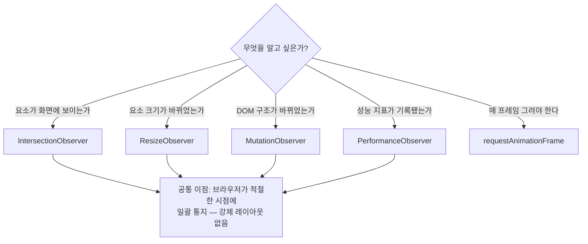
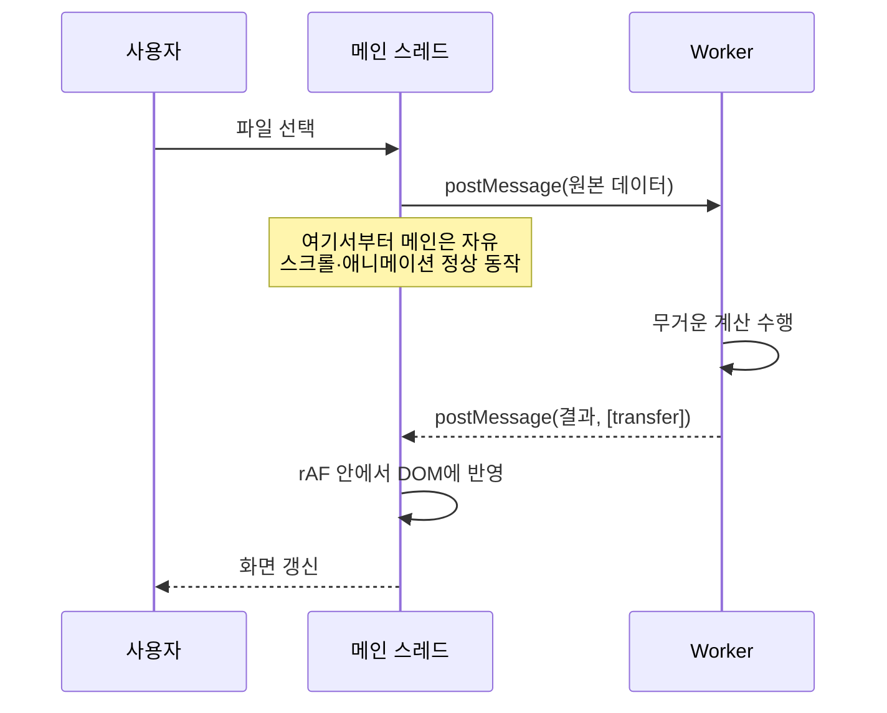

<Callout type="info">
  **이번 문서의 목표:** 이 파일을 다 읽으면 화면이 버벅이는 원인을 강제 동기 레이아웃·긴 작업·과도한 이벤트 중 어느 것인지 진단하고, 읽기·쓰기 분리, 관측자 전환, 워커 오프로딩 중 알맞은 처방을 골라 적용할 수 있다.
</Callout>

## 이 문서의 자리 — 흩어진 도구를 하나의 전략으로

17편에서 관측자(Observer)를, 18편에서 타이머와 `requestAnimationFrame`을, 19·20편에서 워커와 서비스 워커를 각각 배웠습니다. 도구는 다 모였습니다. 이제 물어야 할 것은 "**언제 무엇을 꺼내 드는가**"입니다.

출발점은 하나의 사실입니다. **브라우저의 메인 스레드**(main thread)**는 하나뿐이고, 그 하나가 자바스크립트 실행·스타일 계산·레이아웃·페인트·사용자 입력 처리를 전부 담당합니다.** 60Hz 화면이라면 한 프레임에 주어진 시간은 약 16.7밀리초입니다. 이 예산 안에 위의 모든 일이 끝나야 화면이 부드럽습니다.

$$
\text{프레임 예산} = \frac{1000\ \text{ms}}{60\ \text{fps}} \approx 16.7\ \text{ms}
$$

- 1000 ms — 1초를 밀리초로 표현한 값
- 60 fps — frames per second, 초당 화면 갱신 횟수
- 결과 16.7 ms — 한 프레임에 허용된 전체 시간. 브라우저 자체 작업을 빼면 자바스크립트가 쓸 수 있는 몫은 보통 **10ms 안팎**입니다.

> **쉽게 말하면:** 메인 스레드는 1초에 60번, 매번 16.7밀리초 안에 열차가 출발하는 정거장입니다. 승객(작업)이 너무 많으면 열차가 제때 못 떠나고, 그것이 사용자에게는 **끊김**(jank, 잰크)으로 보입니다.

문제는 세 종류로 나뉩니다. 처방도 각각 다릅니다.

| 증상 | 원인 | 처방 |
|---|---|---|
| 스크롤·애니메이션이 미세하게 끊긴다 | 레이아웃 스래싱, 프레임마다 과한 DOM 작업 | 읽기·쓰기 분리, rAF, 관측자 |
| 클릭 후 몇 초간 완전히 멈춘다 | 긴 동기 계산 | Worker로 이전 |
| 첫 로딩이 느리고 오프라인에서 죽는다 | 네트워크 왕복 | Service Worker와 캐시 |

## 1. 레이아웃 스래싱 — 가장 흔하고 가장 안 보이는 범인

### 강제 동기 레이아웃이란

03편에서 렌더링 파이프라인을 봤습니다. 스타일 계산 → 레이아웃 → 페인트 → 합성. 브라우저는 이 작업을 **최대한 미뤄서 프레임 끝에 한 번만** 하려고 합니다. `element.style.width = '100px'`를 열 번 바꿔도 레이아웃은 한 번만 계산하는 것이 이상적입니다. 그래서 브라우저는 스타일 변경을 **더티 플래그**만 세워 두고 쌓아 둡니다.

그런데 자바스크립트가 이렇게 물으면 어떻게 될까요?

```js
요소.style.width = '100px';         // 쓰기 — 레이아웃이 더러워짐
const 높이 = 요소.offsetHeight;      // 읽기 — 정확한 값을 지금 달라!
```

`offsetHeight`의 정확한 값을 주려면 브라우저는 **쌓아 둔 변경을 지금 당장 반영해 레이아웃을 다시 계산**해야 합니다. 이것을 **강제 동기 레이아웃**(forced synchronous layout) 또는 **레이아웃 스래싱**(layout thrashing)이라고 부릅니다.

> **쉽게 말하면:** 브라우저는 "주문을 모아서 한 번에 주방에 넣는" 홀 직원입니다. 그런데 주문할 때마다 "지금 몇 인분 나갔어요?"라고 물으면, 직원은 매번 주방에 뛰어가 확인해야 합니다. 주문 하나에 왕복 한 번 — 손님이 100명이면 100번 뜁니다.

한 번은 괜찮습니다. 문제는 **반복문 안에서 읽기와 쓰기가 번갈아 나올 때**입니다.

```js
// 최악의 패턴 — 요소마다 강제 레이아웃 1회씩
목록.forEach((요소) => {
  요소.style.width = 기준요소.offsetWidth + 'px'; // 읽고 → 쓰고 → 읽고 → 쓰고
});
```

요소가 500개면 레이아웃 계산이 500번 일어납니다. 각 계산이 1밀리초만 걸려도 500밀리초, 프레임 예산의 30배입니다.

### 처방: 읽기 단계와 쓰기 단계를 분리한다

해법은 놀랍도록 단순합니다. **전부 읽고, 그 다음에 전부 쓴다.**

```js
// 1단계: 읽기만 — 레이아웃 계산 1회로 끝
const 너비들 = 목록.map((요소) => 요소.offsetWidth);

// 2단계: 쓰기만 — 다음 프레임에 한 번에 반영
목록.forEach((요소, 순번) => {
  요소.style.width = 너비들[순번] + 'px';
});
```

이 원칙을 관용적으로 **읽기·쓰기 분리**(read-write batching)라고 부릅니다. 유명한 라이브러리들이 `measure`와 `mutate` 단계를 나누어 제공하는 것도 전부 이 아이디어를 코드 구조로 강제한 것입니다.

레이아웃을 강제로 발생시키는 속성들을 알아 두면 좋습니다. 공통점은 "**지금 화면상의 실제 값**을 묻는 질문"이라는 것입니다.

| 분류 | 속성·메서드 |
|---|---|
| 크기 | `offsetWidth`, `offsetHeight`, `clientWidth`, `clientHeight` |
| 위치 | `offsetTop`, `offsetLeft`, `getBoundingClientRect()` |
| 스크롤 | `scrollTop`, `scrollHeight`, `scrollIntoView()` |
| 계산된 스타일 | `getComputedStyle()`의 레이아웃 관련 값 |

### 직접 재보기

말로 들으면 "설마 그렇게 차이가 날까" 싶습니다. 직접 재 봅시다. 아래 실습기는 같은 작업을 두 방식으로 수행하고 걸린 시간을 비교합니다. 요소 개수를 바꿔 가며 실행해 보세요.

<CodePlayground
  template="vanilla"
  activeFile="/index.js"
  showConsole
  label="레이아웃 스래싱 직접 측정 — 섞어 쓰기 vs 분리하기"
  files={{
    '/index.js': `// 실험용 요소를 만든다
const 개수 = 400;
const 컨테이너 = document.createElement('div');
document.body.appendChild(컨테이너);

const 요소들 = [];
for (let i = 0; i < 개수; i++) {
  const 박스 = document.createElement('div');
  박스.style.cssText = 'height:4px;background:#ddd;margin:1px;';
  박스.style.width = (100 + (i % 50)) + 'px';
  컨테이너.appendChild(박스);
  요소들.push(박스);
}

// --- 방식 A: 읽기와 쓰기를 번갈아 한다 (레이아웃 스래싱) ---
function 섞어쓰기() {
  const 시작 = performance.now();
  요소들.forEach((박스) => {
    // 읽기: 지금 당장 정확한 너비를 요구 -> 쌓인 변경을 강제로 반영
    const 현재너비 = 박스.offsetWidth;
    // 쓰기: 다시 레이아웃을 더럽힌다
    박스.style.width = (현재너비 + 1) + 'px';
  });
  return performance.now() - 시작;
}

// --- 방식 B: 전부 읽고, 그 다음 전부 쓴다 ---
function 분리하기() {
  const 시작 = performance.now();
  // 1단계 — 읽기만: 레이아웃 계산은 사실상 1회
  const 너비들 = 요소들.map((박스) => 박스.offsetWidth);
  // 2단계 — 쓰기만: 읽기가 없으므로 강제 반영이 일어나지 않는다
  요소들.forEach((박스, 순번) => {
    박스.style.width = (너비들[순번] + 1) + 'px';
  });
  return performance.now() - 시작;
}

// 워밍업(첫 실행은 캐시·JIT 영향이 크다)
섞어쓰기();
분리하기();

const A = 섞어쓰기();
const B = 분리하기();

console.log('요소 개수:', 개수);
console.log('A. 읽기·쓰기 섞음:', A.toFixed(2), 'ms');
console.log('B. 읽기·쓰기 분리:', B.toFixed(2), 'ms');
console.log('배수:', (A / B).toFixed(1), '배 차이');
console.log('프레임 예산 16.7ms를 넘겼는가? A:', A > 16.7, '/ B:', B > 16.7);

// --- 보너스: 강제 레이아웃이 실제로 일어나는지 확인 ---
const 박스 = 요소들[0];
박스.style.width = '333px';
// 아래 한 줄이 없으면 이 시점에 레이아웃은 아직 계산되지 않았다
console.log('---');
console.log('방금 쓴 값을 즉시 읽으면:', 박스.offsetWidth, 'px');
console.log('=> 값을 얻기 위해 브라우저가 레이아웃을 지금 계산했다');`,
  }}
/>

기기와 브라우저에 따라 다르지만 보통 수 배에서 수십 배의 차이가 납니다. 중요한 것은 절대 수치가 아니라 **코드를 한 줄도 줄이지 않고 순서만 바꿔서** 이만큼 달라진다는 사실입니다.

<Callout type="warning">
  **자주 틀리는 점:** "레이아웃은 무조건 나쁘다"가 아닙니다. 레이아웃은 화면을 그리려면 반드시 필요한 계산이고, 프레임당 한 번은 정상입니다. 나쁜 것은 **한 프레임 안에서 여러 번** 강제하는 것입니다. 또한 DevTools의 Performance 패널에서 보라색 레이아웃 블록 옆에 붙는 경고 삼각형이 바로 이 강제 동기 레이아웃 표시이니, 추측 대신 측정으로 확인하는 습관을 들이는 편이 좋습니다.
</Callout>

## 2. 이벤트를 프레임에 맞추기 — rAF와 관측자

### scroll·resize 핸들러의 함정

스크롤 이벤트는 초당 수십에서 백 번 이상 발생할 수 있습니다. 핸들러 안에서 DOM을 만지면, **한 프레임 안에서 같은 일을 여러 번** 하게 됩니다. 화면은 어차피 프레임당 한 번만 갱신되므로 나머지는 전부 낭비입니다.

`requestAnimationFrame`(rAF, 다음 프레임 그리기 직전에 콜백을 실행해 달라는 요청)으로 이를 정리하는 표준 패턴이 있습니다.

```js
let 예약됨 = false;

window.addEventListener('scroll', () => {
  if (예약됨) return;      // 이미 이번 프레임 몫이 잡혀 있으면 무시
  예약됨 = true;
  requestAnimationFrame(() => {
    화면갱신();             // 프레임당 정확히 한 번만 실행
    예약됨 = false;
  });
}, { passive: true });
```

`예약됨` 플래그가 핵심입니다. 스크롤이 프레임 사이에 30번 발생해도 실제 갱신은 한 번입니다. 이 기법을 **rAF 스로틀링**(rAF throttling)이라고 부릅니다. `setTimeout`으로 시간 기반 스로틀링을 하는 것보다 나은 이유는, **화면 갱신 주기에 정확히 맞춰지기 때문**입니다. 120Hz 기기에서는 자동으로 더 자주, 배터리 절약 모드에서는 자동으로 덜 실행됩니다.

`{ passive: true }`도 짚어야 합니다. 이 옵션은 "이 리스너는 `preventDefault()`를 부르지 않겠다"는 약속입니다. 약속이 없으면 브라우저는 **핸들러가 스크롤을 취소할지도 모르니 일단 기다렸다가** 스크롤해야 합니다. 약속하면 즉시 스크롤하면서 핸들러를 병행 실행할 수 있습니다.

### 더 나은 처방: 애초에 이벤트를 쓰지 않기

그런데 스크롤 핸들러로 하려던 일이 "이 요소가 화면에 보이나?"라면, **더 나은 답은 rAF 스로틀링이 아니라 이벤트를 아예 안 쓰는 것**입니다.



관측자(Observer)들의 공통 이점은 두 가지입니다.

1. **강제 레이아웃이 없다.** `IntersectionObserver`는 `getBoundingClientRect()`를 부르지 않고, 브라우저가 이미 알고 있는 내부 정보로 판정합니다. 스크롤 핸들러 안에서 위치를 재는 방식과 결정적으로 다른 지점입니다.
2. **일괄 통지된다.** 100개 요소가 동시에 화면에 들어와도 콜백은 한 번, 항목 배열을 받아 호출됩니다.

무한 스크롤, 지연 로딩, 스크롤 기반 애니메이션 트리거, 광고 노출 측정 — 스크롤 핸들러로 하던 일의 대부분은 `IntersectionObserver`로 대체됩니다.

<Callout type="warning">
  **자주 틀리는 점:** `ResizeObserver` 콜백 안에서 관측 대상의 **크기를 바꾸면** 무한 루프가 됩니다. 브라우저는 이를 감지해 콘솔에 "ResizeObserver loop completed with undelivered notifications" 경고를 내고 다음 프레임으로 미룹니다. 콜백 안에서는 관측 대상 자신이 아닌 다른 요소를 조작하거나, 조건을 걸어 변화가 수렴하게 만들어야 합니다.
</Callout>

## 3. 계산을 옮기기 — 워커 오프로딩의 판단 기준

읽기·쓰기 분리로도, 관측자로도 해결되지 않는 경우가 있습니다. **작업 자체가 무거울 때**입니다. 이미지 필터, 대용량 CSV 파싱, 암호화, 검색 인덱싱 — 이들은 아무리 잘 배치해도 메인 스레드에서 하는 한 화면을 멈춥니다.

### 옮길 가치가 있는지 판단하기

워커로 옮기는 데에도 비용이 있습니다. 데이터를 주고받는 **구조화 복제**(structured clone) 비용, 워커 시작 비용, 코드 분리로 인한 복잡도입니다. 그래서 판단 기준이 필요합니다.

| 조건 | 워커 적합도 |
|---|---|
| 계산 시간이 50ms 이상 | 적합 – 이 정도면 입력 지연이 체감된다 |
| 입력·출력 데이터가 작고 계산이 크다 | 매우 적합 – 전송 비용 대비 이득이 크다 |
| 데이터는 거대한데 계산은 가볍다 | 부적합 – 복제 비용이 이득을 잡아먹는다 |
| DOM을 직접 조작해야 한다 | 불가 – 워커에는 DOM이 없다 |

마지막 줄이 워커 설계의 근본 제약입니다. **왜 워커에는 DOM 접근이 없을까요?** 이유는 안전성입니다. DOM은 스레드 안전(thread-safe)하지 않은 거대한 가변 트리입니다. 두 스레드가 동시에 같은 노드를 지우고 읽으면 정합성이 깨집니다. 이를 허용하려면 DOM의 모든 연산에 잠금(lock)을 걸어야 하고, 그러면 **잠금 비용과 교착 상태**(deadlock)라는 훨씬 큰 문제가 웹 전체에 생깁니다.

> **쉽게 말하면:** 브라우저는 "여러 명이 한 문서를 동시에 고치게 하되 규칙을 복잡하게 만드는 길" 대신 "**문서는 한 사람만 만진다**"는 단순한 길을 택했습니다. 워커는 문서를 만질 수 없는 대신, 규칙을 걱정할 필요도 없습니다.

그래서 실전 구조는 언제나 이렇게 됩니다. **워커는 계산해서 결과 데이터를 돌려주고, DOM 반영은 메인 스레드가 한다.**



### 전송 비용을 없애는 Transferable

19편에서 본 **Transferable**(이전 가능 객체)이 여기서 결정적입니다. 기본 전송 방식인 구조화 복제는 데이터를 **복사**합니다. 50MB 배열이면 50MB를 복사하는 동안 양쪽 스레드가 멈춥니다.

`ArrayBuffer` 같은 Transferable 객체는 두 번째 인자로 넘기면 **소유권만 이전**됩니다. 복사가 아니라 "이제 이건 네 것"이라고 명패만 바꿔 다는 것이라 크기와 무관하게 거의 즉시입니다.

```js
워커.postMessage({ 버퍼 }, [버퍼]); // 두 번째 인자가 이전 목록
console.log(버퍼.byteLength); // 0 — 보낸 쪽에서는 비워진다
```

`byteLength`가 0이 되는 것이 이 방식의 정직한 신호입니다. **넘겨준 쪽은 더 이상 그 데이터를 갖고 있지 않습니다.** 이것을 잊고 전송 후 원본을 쓰면 조용히 빈 데이터를 다루게 됩니다.

캔버스 작업이라면 한 걸음 더 갈 수 있습니다. `OffscreenCanvas`는 캔버스의 그리기 표면 자체를 워커로 이전해, **그리기까지 워커에서** 수행하게 합니다. 워커에 DOM은 없지만 캔버스의 그리기 컨텍스트는 예외적으로 허용된 셈인데, 캔버스는 트리 구조가 아니라 **독립된 픽셀 버퍼**라서 스레드 안전 문제가 생기지 않기 때문입니다. 규칙의 예외가 아니라 규칙의 이유에 부합하는 설계입니다.

### 워커도 답이 아닐 때 — 작업 쪼개기

워커로 옮길 수 없는 일도 있습니다. 예를 들어 1만 개 항목을 DOM에 렌더링하는 일은 본질적으로 메인 스레드의 일입니다. 이때는 **긴 작업을 짧은 조각으로 쪼개 프레임 사이에 나눠 넣습니다.**

```js
async function 나눠서처리(항목들, 처리) {
  let 시작 = performance.now();
  for (const 항목 of 항목들) {
    처리(항목);
    // 5ms를 넘었으면 제어권을 브라우저에 돌려준다
    if (performance.now() - 시작 > 5) {
      await new Promise((해결) => setTimeout(해결, 0));
      시작 = performance.now();
    }
  }
}
```

핵심은 **양보**(yield)입니다. 제어권을 놓아 주는 순간 브라우저는 밀린 입력 처리와 렌더링을 할 수 있습니다. 18편에서 본 `requestIdleCallback`은 이 아이디어의 표준판으로, "브라우저가 한가할 때 불러 달라"는 요청입니다. 다만 급하지 않은 일에만 써야 합니다 — 바쁘면 영영 안 불릴 수도 있으니까요.

## 4. 네트워크를 옮기기 — 서비스 워커와 캐시

마지막 층은 네트워크입니다. 20편에서 본 서비스 워커가 여기 결합합니다.

메인 스레드를 비운다는 관점에서 서비스 워커의 기여는 두 가지입니다.

1. **요청 처리 자체가 다른 스레드에서 일어난다.** 캐시 조회, 응답 조립이 메인 스레드 밖에서 돌아갑니다.
2. **네트워크 왕복 자체를 없앤다.** 가장 빠른 요청은 보내지 않는 요청입니다. 캐시 히트는 수십·수백 밀리초의 대기를 0에 가깝게 만듭니다.

전체 전략을 층으로 정리하면 이렇게 됩니다.

| 층 | 도구 | 없애는 비용 |
|---|---|---|
| 네트워크 | Service Worker + CacheStorage | 왕복 지연, 오프라인 실패 |
| 계산 | Worker, OffscreenCanvas, Transferable | 긴 작업의 메인 스레드 점유 |
| 이벤트 | IntersectionObserver, ResizeObserver, passive 리스너 | 과도한 콜백 호출 |
| 렌더 | rAF 스로틀링, 읽기·쓰기 분리 | 강제 동기 레이아웃, 중복 갱신 |
| 저장 | IndexedDB (워커에서도 사용 가능) | 동기 Storage의 블로킹 |

마지막 줄에 하나 덧붙일 것이 있습니다. `localStorage`는 **동기 API**라 읽고 쓰는 동안 메인 스레드가 멈추고, 워커에서는 아예 사용할 수 없습니다. 반면 IndexedDB는 비동기이고 워커에서도 쓸 수 있습니다. 13편의 저장소 선택 기준이 성능 관점에서 다시 확인되는 지점입니다.

## 5. 진단 순서 — 추측하지 말고 재라

마지막으로 실무 순서를 정리합니다. 이 순서를 지키지 않으면 멀쩡한 코드를 최적화하느라 시간을 버립니다.

1. **측정한다.** DevTools Performance 패널로 녹화합니다. 긴 노란 블록(스크립트)인지, 보라 블록(레이아웃)인지 먼저 봅니다.
2. **긴 작업을 찾는다.** 50ms를 넘는 작업(long task)이 있으면 그것이 1순위 범인입니다. `PerformanceObserver`로 `longtask` 항목을 관측하면 실사용자 환경에서도 수집할 수 있습니다.
3. **레이아웃 경고를 본다.** 강제 동기 레이아웃 표시가 있으면 읽기·쓰기 분리부터 적용합니다.
4. **처방을 고른다.** 계산이 문제면 워커, 이벤트 빈도가 문제면 관측자와 rAF, 네트워크가 문제면 캐시.
5. **다시 측정한다.** 최적화가 실제로 효과가 있었는지 숫자로 확인합니다.

<Callout type="warning">
  **자주 틀리는 점:** "일단 워커부터 도입하자"는 흔한 과잉 처방입니다. 실제로는 강제 동기 레이아웃 한 줄을 고치는 것이 워커 도입보다 큰 효과를 내는 경우가 많고, 훨씬 쌉니다. 도구의 화려함이 아니라 **측정 결과가 처방을 정합니다.**
</Callout>

## 핵심 정리

- 한 프레임의 예산은 약 16.7ms이고, 자바스크립트 몫은 10ms 안팎이다. 이 예산 초과가 곧 끊김이다.
- 레이아웃 스래싱은 한 프레임 안에서 쓰기와 읽기를 번갈아 해 강제 동기 레이아웃을 여러 번 유발하는 것이다. 처방은 **전부 읽고 그다음 전부 쓰기**다.
- 이벤트 기반 위치 계산은 관측자로 대체하는 것이 최선이고, 대체가 안 되면 rAF 스로틀링과 `passive` 리스너로 프레임당 한 번으로 줄인다.
- 워커에 DOM이 없는 것은 결함이 아니라 DOM의 스레드 안전 문제를 회피한 설계 선택이다. 워커는 계산만 하고 DOM 반영은 메인 스레드가 한다.
- 처방의 순서는 측정 → 긴 작업·레이아웃 경고 확인 → 알맞은 층의 도구 선택 → 재측정이다. 도구 선택이 진단보다 앞서면 안 된다.

## 마무리 복습

<Quiz
  questionNumber={1}
  question="레이아웃 스래싱이 발생하는 코드 패턴으로 가장 정확한 것은?"
  options={['반복문 안에서 스타일 쓰기와 offsetWidth 같은 레이아웃 읽기를 번갈아 수행하는 것', '반복문 안에서 스타일만 여러 번 바꾸는 것', 'requestAnimationFrame을 여러 번 호출하는 것', 'addEventListener를 여러 개 등록하는 것']}
  correctAnswer={1}
  explanation="브라우저는 스타일 변경을 모아 두었다가 프레임 끝에 한 번 처리한다. 그런데 레이아웃 값을 읽으면 쌓인 변경을 즉시 반영해야 하므로, 쓰기와 읽기가 번갈아 나오면 반복 횟수만큼 레이아웃이 계산된다."
  optionExplanations={['정답 — 읽기가 강제 반영을 유발한다', '쓰기만 모여 있으면 일괄 처리되어 문제가 없다', 'rAF 자체는 레이아웃을 강제하지 않는다', '리스너 개수와는 무관하다']}
/>

<Quiz
  questionNumber={2}
  question="다음 중 강제 동기 레이아웃을 유발하지 않는 것은?"
  options={['element.getBoundingClientRect 호출', 'element.offsetTop 읽기', 'element.style.transform에 값 대입', 'element.scrollHeight 읽기']}
  correctAnswer={3}
  explanation="레이아웃을 강제하는 것은 현재 화면상의 실제 값을 묻는 읽기 연산이다. 스타일 값을 대입하는 쓰기는 더티 플래그만 세우고 즉시 계산되지 않는다."
  optionExplanations={['위치와 크기를 즉시 요구하므로 강제한다', '위치 읽기이므로 강제한다', '정답 — 쓰기만으로는 강제되지 않는다', '스크롤 관련 읽기도 강제한다']}
/>

<Quiz
  questionNumber={3}
  question="scroll 이벤트 핸들러 대신 IntersectionObserver를 쓰는 것이 더 나은 핵심 이유는?"
  options={['코드가 더 짧기 때문', '브라우저 내부 정보로 판정하므로 위치를 재기 위한 강제 레이아웃이 없고 일괄 통지되기 때문', '스크롤 이벤트는 오래된 브라우저에서 지원되지 않기 때문', 'IntersectionObserver가 워커에서 실행되기 때문']}
  correctAnswer={2}
  explanation="스크롤 핸들러 방식은 보통 getBoundingClientRect로 위치를 재면서 강제 레이아웃을 유발한다. 관측자는 브라우저가 이미 가진 정보로 판정하고 변화가 있을 때만 일괄 호출한다."
  optionExplanations={['코드 길이는 부수적 이점이다', '정답 — 강제 레이아웃 회피와 일괄 통지가 핵심이다', 'scroll은 매우 오래된 표준이다', '관측자는 메인 스레드에서 콜백을 실행한다']}
/>

<Quiz
  questionNumber={4}
  question="rAF 스로틀링에서 플래그 변수를 두는 이유는?"
  options={['애니메이션 속도를 조절하기 위해', '이벤트가 한 프레임 안에 여러 번 발생해도 갱신 콜백이 프레임당 한 번만 실행되게 하기 위해', '이벤트 리스너를 자동으로 해제하기 위해', 'passive 옵션을 대체하기 위해']}
  correctAnswer={2}
  explanation="플래그가 없으면 스크롤 이벤트 수만큼 rAF 콜백이 예약된다. 플래그는 이미 예약된 프레임 몫이 있을 때 추가 예약을 막아 프레임당 한 번을 보장한다."
  optionExplanations={['속도 조절과는 무관하다', '정답 — 중복 예약 방지가 목적이다', '해제는 별도로 해야 한다', 'passive는 별개의 최적화다']}
/>

<Quiz
  questionNumber={5}
  question="Worker에 DOM 접근이 제공되지 않는 근본적인 이유는?"
  options={['워커의 실행 속도가 느리기 때문', 'DOM은 스레드 안전하지 않은 가변 트리라 동시 접근을 허용하려면 잠금과 교착 상태 문제가 생기기 때문', '보안상 워커가 신뢰되지 않기 때문', '워커는 자바스크립트를 실행할 수 없기 때문']}
  correctAnswer={2}
  explanation="여러 스레드가 같은 DOM 트리를 동시에 수정하면 정합성이 깨진다. 이를 허용하려면 모든 DOM 연산에 잠금이 필요해지므로, 브라우저는 문서는 한 스레드만 만진다는 단순한 규칙을 택했다."
  optionExplanations={['워커의 실행 속도는 메인 스레드와 다르지 않다', '정답 — 동시성 정합성 문제를 회피한 설계 선택이다', '보안이 아니라 동시성이 이유다', '워커도 자바스크립트를 실행한다']}
/>

<Quiz
  questionNumber={6}
  question="ArrayBuffer를 postMessage의 두 번째 인자로 넘겨 이전한 뒤 보낸 쪽에서 확인할 수 있는 현상은?"
  options={['byteLength가 0이 되어 더 이상 데이터를 갖고 있지 않다', '데이터가 그대로 복사되어 남아 있다', '읽기 전용으로 바뀐다', '자동으로 다시 채워진다']}
  correctAnswer={1}
  explanation="Transferable 이전은 복사가 아니라 소유권 이동이다. 보낸 쪽의 버퍼는 분리되어 byteLength가 0이 되므로, 전송 후 원본을 사용하려 하면 빈 데이터를 다루게 된다."
  optionExplanations={['정답 — 소유권이 옮겨간다는 정직한 신호다', '복사되는 것은 기본 구조화 복제 방식이다', '읽기 전용이 아니라 분리된다', '되돌아오지 않는다']}
/>

<Quiz
  questionNumber={7}
  question="화면이 버벅이는 문제를 만났을 때 가장 먼저 해야 할 일은?"
  options={['모든 계산을 Worker로 옮긴다', 'Performance 패널로 녹화해 긴 작업인지 강제 레이아웃인지 원인을 측정한다', 'setTimeout으로 모든 코드를 감싼다', 'Service Worker를 도입한다']}
  correctAnswer={2}
  explanation="처방은 진단 뒤에 온다. 원인이 강제 동기 레이아웃이면 한 줄 수정으로 해결되는데, 진단 없이 워커부터 도입하면 비용만 늘고 효과는 없을 수 있다."
  optionExplanations={['원인이 계산이 아닐 수 있고 워커 도입 비용도 크다', '정답 — 측정이 처방보다 앞선다', '실행 시점만 미룰 뿐 총 작업량은 그대로다', '네트워크가 원인일 때만 유효하다']}
/>

<Quiz
  questionNumber={8}
  question="워커에서 사용할 수 없어 메인 스레드 블로킹을 피할 수 없는 저장소는?"
  options={['IndexedDB', 'CacheStorage', 'localStorage', 'IndexedDB의 인덱스']}
  correctAnswer={3}
  explanation="localStorage는 동기 API라 읽고 쓰는 동안 스레드를 멈추며 워커에서는 사용할 수 없다. IndexedDB와 CacheStorage는 비동기이고 워커에서도 사용할 수 있다."
  optionExplanations={['비동기이며 워커에서도 쓸 수 있다', '비동기이며 워커·서비스 워커에서 쓸 수 있다', '정답 — 동기 API이자 워커 미지원이다', 'IndexedDB의 일부이므로 마찬가지로 사용 가능하다']}
/>

## 참고 자료

- [MDN - window.requestAnimationFrame](https://developer.mozilla.org/en-US/docs/Web/API/Window/requestAnimationFrame)
- [MDN - MutationObserver / IntersectionObserver / ResizeObserver / PerformanceObserver](https://developer.mozilla.org/en-US/docs/Web/API/MutationObserver)
- [MDN - Web Workers API](https://developer.mozilla.org/en-US/docs/Web/API/Web_Workers_API)
- [MDN - Populating the page: how browsers work](https://developer.mozilla.org/en-US/docs/Web/Performance/Guides/How_browsers_work)
