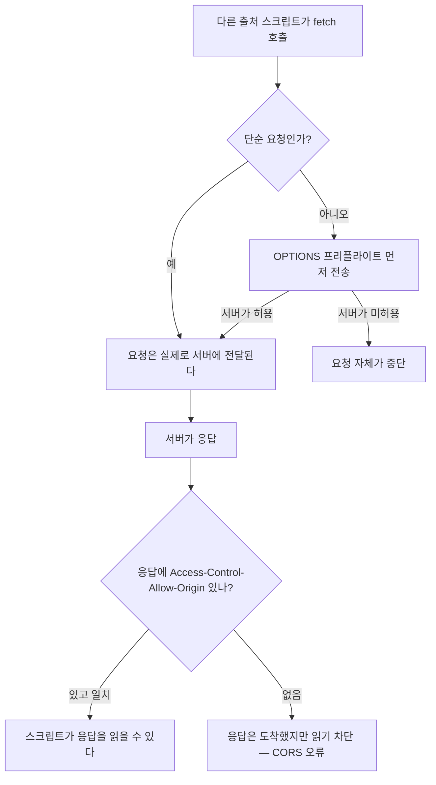
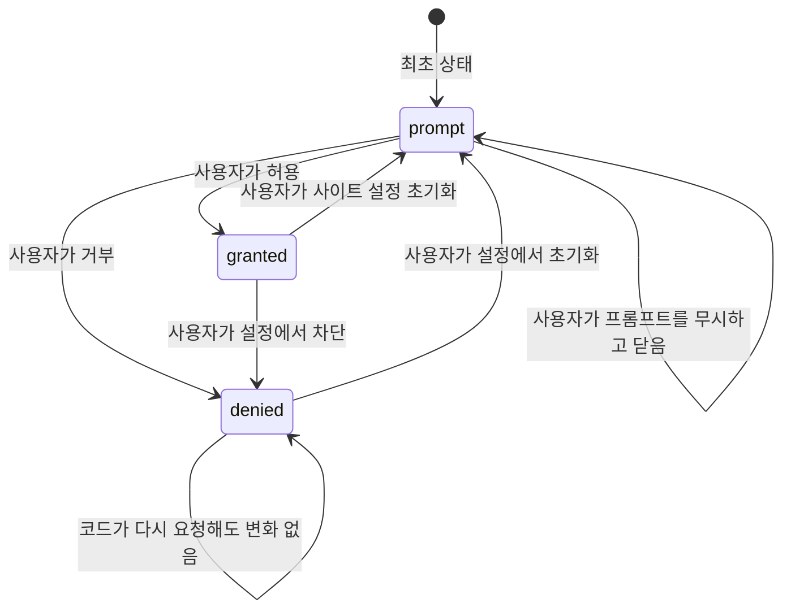

<Callout type="info">
  **이번 문서의 목표:** 이 파일을 다 읽으면 어떤 Web API가 왜 거부되는지를 secure context·출처·권한 상태·사용자 활성화 네 가지 축으로 진단하고, 권한 요청 흐름을 사용자 경험까지 고려해 설계할 수 있다.
</Callout>

## 왜 브라우저에는 이렇게 많은 거절이 있는가

브라우저는 인류 역사상 가장 이상한 프로그램입니다. **모르는 사람이 작성한 코드를, 링크 한 번 눌렀다는 이유로, 아무 확인 없이 즉시 실행**합니다. 낯선 사람이 준 실행 파일을 더블클릭하는 것과 기술적으로 다르지 않은 일을 우리는 하루에 수백 번 합니다.

그런데도 웹이 안전한 이유는, 브라우저가 그 코드를 **아주 좁은 방에 가둬 두고** 실행하기 때문입니다. 그 방에서 밖으로 나가는 문마다 자물쇠가 걸려 있고, 이 문서는 **그 자물쇠들의 목록과 여는 조건**을 다룹니다.

> **쉽게 말하면:** 웹 페이지는 호텔 손님입니다. 자기 방(자기 출처)은 자유롭게 쓰지만, 다른 방(다른 출처), 금고(카메라·위치), 로비 방송(전체 화면)에 접근하려면 그때마다 프런트의 허가가 필요합니다.

자물쇠는 네 층으로 나뉩니다. 어떤 API가 실패했을 때, 원인은 반드시 이 넷 중 하나입니다.

| 층 | 묻는 질문 | 실패했을 때의 증상 |
|---|---|---|
| Secure context | 이 페이지는 안전한 경로로 왔는가 | API 자체가 `undefined` |
| Origin | 누구의 데이터를 만지려 하는가 | 동일 출처 정책 위반, CORS 오류 |
| Permission | 사용자가 허락했는가 | 권한 프롬프트, `NotAllowedError` |
| User activation | 사용자의 직접 행동에서 비롯됐는가 | `NotAllowedError` – 프롬프트조차 안 뜸 |

## 1. Secure context — 안전한 경로로 왔는가

### 정의

**secure context**(안전한 컨텍스트)는 "이 페이지가 **인증되고 무결성이 보장된 경로**로 전달되었다"는 상태입니다. 구체적으로는 다음이 secure context입니다.

- `https://`로 로드된 페이지
- `wss://`로 연결된 컨텍스트
- `http://localhost`, `http://127.0.0.1` 등 **로컬 주소** (개발 편의를 위한 예외)
- `file://`로 연 문서 (브라우저에 따라 다름)

반대로 평범한 `http://example.com`은 secure context가 아닙니다. 그리고 **secure context가 아니면 상당수의 API가 아예 존재하지 않습니다.** 권한을 거절당하는 것이 아니라, `navigator.geolocation`이 `undefined`이거나 `navigator.serviceWorker`가 없습니다.

```js
console.log(window.isSecureContext); // true 또는 false
```

secure context를 요구하는 대표 API는 이렇습니다.

| API | 요구 이유 |
|---|---|
| Service Worker | 응답 위조 권한이 영구적으로 남으므로 |
| Geolocation | 위치는 되돌릴 수 없는 민감 정보 |
| Clipboard API | 다른 앱의 데이터에 닿는 통로 |
| `crypto.subtle` | 평문 경로에서의 암호 연산은 의미가 없으므로 |
| Notifications, 카메라·마이크 | 사용자 기기와 주의력에 직접 개입 |

### 왜 HTTPS여야 하는가 — 오해 하나 풀기

흔한 오해는 "HTTPS는 도청을 막는 암호화"라는 것입니다. 맞지만 절반입니다. 여기서 더 중요한 것은 **무결성**(integrity)**과 인증**(authentication)입니다.

평문 HTTP에서는 중간에 있는 누구든(카페 와이파이 공유기, 통신사 장비, 악성 프록시) **응답 내용을 바꿔 치기**할 수 있습니다. 도청은 "보는 것"이지만 변조는 "내가 짠 코드가 아닌 코드가 실행되는 것"입니다.

> **쉽게 말하면:** 도청은 편지를 몰래 읽는 일이고, 변조는 편지 내용을 바꿔 놓는 일입니다. 위치 정보 API에 자물쇠를 거는 이유는 후자입니다 — 공격자가 페이지에 자기 코드를 끼워 넣을 수 있다면, 사용자가 허락한 위치 권한이 곧 공격자의 권한이 됩니다.

이 논리가 특히 강하게 적용되는 것이 **한 번 얻으면 지속되는 능력**입니다. 서비스 워커 등록(20편), 저장소 접근, 권한 부여 기록이 여기 해당합니다. 일회성 정보 노출은 그때 한 번의 피해로 끝나지만, 지속되는 능력은 공격자가 네트워크에서 떠난 뒤에도 남습니다.

`localhost`가 예외인 이유도 같은 논리에서 나옵니다. 로컬 주소는 애초에 네트워크를 타지 않으므로 **중간자가 존재할 수 없습니다.** 위험이 없으니 제약도 없습니다. 규칙이 아니라 이유를 이해하면 예외도 자연히 설명됩니다.

## 2. Origin — 웹 보안의 기본 단위

### 출처는 세 조각의 튜플이다

**origin**(출처)은 **스킴**(scheme, 프로토콜) + **호스트**(host) + **포트**(port) 세 가지의 조합입니다. 셋 중 **하나라도 다르면 다른 출처**입니다.

| URL | `https://앱.example.com` 과 같은 출처인가 | 이유 |
|---|---|---|
| `https://앱.example.com/다른/경로` | 같음 | 경로는 출처의 일부가 아니다 |
| `http://앱.example.com` | 다름 | 스킴이 다르다 |
| `https://example.com` | 다름 | 호스트가 다르다 |
| `https://앱.example.com:8443` | 다름 | 포트가 다르다 |

경로가 출처에 포함되지 않는다는 점이 중요합니다. `example.com/내블로그`와 `example.com/남의블로그`는 **같은 출처**이므로 서로의 저장소와 DOM에 완전히 접근할 수 있습니다. 그래서 사용자 콘텐츠 호스팅 서비스들은 사용자별로 **서브도메인을 분리**합니다 — 경로 분리로는 보안 경계가 만들어지지 않기 때문입니다.

### 동일 출처 정책 — 기본은 금지

**동일 출처 정책**(Same-Origin Policy, SOP)은 웹 보안의 가장 근본적인 규칙입니다. **한 출처의 스크립트는 다른 출처의 데이터를 읽을 수 없다.**

이 규칙이 없다면 어떤 일이 벌어질까요? 사용자가 은행 사이트에 로그인한 상태로 악성 사이트를 방문합니다. 악성 사이트의 스크립트가 `fetch('https://은행.com/잔액')`을 호출하면, 브라우저는 쿠키를 함께 보낼 것이고 은행 서버는 정상 응답을 돌려줍니다. 그 응답을 악성 스크립트가 읽을 수 있다면 **모든 로그인 세션이 무방비**입니다.

여기서 자주 혼동되는 지점을 정리해야 합니다. **동일 출처 정책은 요청을 막는 것이 아니라 응답을 읽는 것을 막습니다.**



즉 CORS 오류가 났다고 해서 서버가 요청을 못 받은 것이 아닙니다. **서버는 이미 처리했고, 브라우저가 결과를 스크립트에 넘기지 않을 뿐입니다.** 그래서 다른 출처로 보내는 부수 효과 있는 요청(POST로 데이터 삭제 등)은 CORS만으로 막을 수 없고, 서버가 별도의 방어(CSRF 토큰, `SameSite` 쿠키)를 해야 합니다. 이 구분을 놓치면 보안 설계 전체가 틀어집니다.

### 저장소 격리와 파티셔닝

13편에서 본 대로 `localStorage`, IndexedDB, CacheStorage는 전부 **출처 단위로 격리**됩니다. 최근 브라우저는 여기서 한 걸음 더 나아가 **저장소 파티셔닝**(storage partitioning)을 도입했습니다.

`뉴스.com` 안에 삽입된 `광고.com` iframe과 `쇼핑.com` 안에 삽입된 `광고.com` iframe은, 출처가 같은데도 **서로 다른 저장소 칸**을 받습니다. 최상위 사이트별로 칸이 나뉘는 것입니다. 목적은 명확합니다 — 여러 사이트에 삽입된 같은 제3자가 저장소를 공유하며 사용자를 **사이트 간 추적**하는 것을 막기 위해서입니다.

<Callout type="warning">
  **자주 틀리는 점:** "출처가 같으면 언제나 같은 데이터를 본다"는 이제 사실이 아닙니다. iframe 안에서 쓰던 저장소가 다른 부모 사이트에서는 비어 있을 수 있습니다. 제3자 컨텍스트에서 동작하는 위젯을 만든다면 파티셔닝을 전제로 설계해야 합니다.
</Callout>

## 3. Permissions API — 상태를 묻는 표준 창구

### 문제: 요청과 조회가 뒤섞여 있었다

권한이 필요한 API들은 저마다 다른 방식으로 권한을 다뤘습니다. 위치는 `getCurrentPosition`을 부르면 프롬프트가 뜨고, 알림은 `Notification.requestPermission()`이 따로 있고, 카메라는 `getUserMedia`를 부르며 확인합니다. **공통점은 "물어보려면 일단 기능을 실행해야 한다**"는 것이었습니다.

이것이 왜 문제일까요? "사용자가 이미 위치를 거부했는지" 알고 싶을 뿐인데, 확인하려면 위치를 요청해야 하고 그러면 프롬프트가 뜹니다. UI를 상태에 맞게 미리 그릴 방법이 없었습니다.

**Permissions API**는 여기에 **조회 전용 창구**를 하나 만듭니다.

```js
const 상태 = await navigator.permissions.query({ name: 'geolocation' });
console.log(상태.state); // 'granted' | 'denied' | 'prompt'
```

핵심은 **`query`는 프롬프트를 띄우지 않는다**는 것입니다. 그저 현재 상태를 알려 줄 뿐입니다.

### 세 가지 상태와 전이



| 상태 | 의미 | 코드가 해야 할 일 |
|---|---|---|
| `granted` | 이미 허용됨 | 바로 기능 실행 |
| `denied` | 거부됨 | **다시 요청하지 말 것.** 왜 필요한지 설명하고 설정 안내 |
| `prompt` | 아직 결정 안 됨 | 사용자의 의도적 행동 시점에 요청 |

가장 중요한 규칙은 `denied`에 대한 것입니다. **거부된 권한은 코드로 다시 물을 수 없습니다.** 브라우저는 조용히 실패시킵니다. 반복 요청으로 사용자를 괴롭히던 관행을 브라우저가 구조적으로 차단한 결과입니다. 이 상태에서 개발자가 할 수 있는 일은 화면에 "주소창 왼쪽의 자물쇠 아이콘에서 위치 권한을 켜 주세요"라고 안내하는 것뿐입니다.

`state`가 바뀌는 것을 실시간으로 감지할 수도 있습니다.

```js
상태.addEventListener('change', () => {
  console.log('권한이 바뀜:', 상태.state);
});
```

사용자가 브라우저 설정에서 권한을 껐을 때 UI를 즉시 되돌릴 수 있는 유일한 방법입니다.

### 직접 확인해 보기

<CodePlayground
  template="vanilla"
  activeFile="/index.js"
  showConsole
  label="보안 표면 점검 — secure context, origin, 권한 상태"
  files={{
    '/index.js': `// --- 1. 이 페이지의 보안 컨텍스트 ---------------------
console.log('=== 컨텍스트 점검 ===');
console.log('isSecureContext:', window.isSecureContext);
console.log('crossOriginIsolated:', window.crossOriginIsolated);

// --- 2. 출처는 스킴 + 호스트 + 포트 -------------------
console.log('=== 출처 ===');
console.log('origin:', location.origin);
console.log('protocol:', location.protocol);
console.log('host:', location.host);
console.log('경로는 출처에 포함되지 않는다 -> pathname:', location.pathname);

function 같은출처인가(주소A, 주소B) {
  const a = new URL(주소A);
  const b = new URL(주소B);
  return a.protocol === b.protocol && a.hostname === b.hostname && a.port === b.port;
}
const 기준 = 'https://앱.example.com/가';
console.log('경로만 다름:', 같은출처인가(기준, 'https://앱.example.com/나'));
console.log('스킴 다름  :', 같은출처인가(기준, 'http://앱.example.com/가'));
console.log('호스트 다름:', 같은출처인가(기준, 'https://example.com/가'));
console.log('포트 다름  :', 같은출처인가(기준, 'https://앱.example.com:8443/가'));

// --- 3. secure context 전용 API가 실제로 있는지 -------
console.log('=== API 존재 여부 ===');
const 점검목록 = [
  ['serviceWorker', 'serviceWorker' in navigator],
  ['geolocation', 'geolocation' in navigator],
  ['clipboard', 'clipboard' in navigator],
  ['crypto.subtle', typeof crypto !== 'undefined' && 'subtle' in crypto],
  ['permissions', 'permissions' in navigator],
  ['storage(quota)', 'storage' in navigator],
];
점검목록.forEach(([이름, 있음]) => console.log(이름 + ':', 있음 ? '사용 가능' : '없음'));

// --- 4. Permissions API로 상태 조회 (프롬프트 안 뜸) ---
async function 권한조회() {
  console.log('=== 권한 상태 (query는 프롬프트를 띄우지 않는다) ===');
  const 이름들 = ['geolocation', 'notifications', 'camera', 'microphone', 'persistent-storage'];
  for (const 이름 of 이름들) {
    try {
      const 상태 = await navigator.permissions.query({ name: 이름 });
      console.log(이름 + ':', 상태.state);
      // 사용자가 설정에서 바꾸면 즉시 알 수 있다
      상태.addEventListener('change', () => {
        console.log('[변화 감지]', 이름, '->', 상태.state);
      });
    } catch (에러) {
      // 브라우저마다 지원하는 이름 목록이 다르다 — 기능 탐지가 필요한 이유
      console.log(이름 + ': 이 브라우저에서 조회 불가 (' + 에러.name + ')');
    }
  }
}

// --- 5. 저장소 사용량과 할당량 ------------------------
async function 저장소점검() {
  if (!navigator.storage || !navigator.storage.estimate) return;
  const 추정 = await navigator.storage.estimate();
  console.log('=== 저장소 ===');
  console.log('사용 중:', Math.round(추정.usage / 1024), 'KB');
  console.log('할당량 추정:', Math.round(추정.quota / 1024 / 1024), 'MB');
  console.log('(정확한 값을 주지 않는 것 자체가 지문 채취 방지책이다)');
}

권한조회().then(저장소점검);`,
  }}
/>

실행해 보면 `quota` 값이 딱 떨어지지 않고 뭉뚱그려진 것을 볼 수 있습니다. 이는 **지문 채취**(fingerprinting)**를 막기 위한 의도적 뭉개기**입니다. 기기의 남은 디스크 용량 같은 정밀한 값은 사용자를 식별하는 단서가 되므로, 브라우저는 정확도를 일부러 낮춥니다. 최근 API 설계에서 이런 "의도적 부정확"은 곳곳에 등장합니다.

## 4. User activation — 사용자의 행동에서 비롯됐는가

권한 상태가 `prompt`인데도 요청이 실패하는 경우가 있습니다. 원인은 대개 **사용자 활성화**(user activation)입니다.

브라우저는 어떤 동작들을 **"사용자의 직접 행동 직후에만"** 허용합니다. 페이지가 로드되자마자 전체 화면으로 전환하거나, 자동으로 소리를 재생하거나, 클립보드를 읽는 것을 막기 위해서입니다.

> **쉽게 말하면:** "사용자가 방금 버튼을 눌렀다"는 사실이 일종의 **일회용 티켓**입니다. 티켓이 있으면 통과, 없으면 거절. 티켓은 클릭·키 입력 같은 신뢰된 이벤트에서 발급되고, 몇 초 안에 만료됩니다.

활성화를 요구하는 대표적인 동작들입니다.

| 동작 | 요구 사항 |
|---|---|
| `requestFullscreen()` | 클릭 등 사용자 제스처 안에서 호출 |
| `navigator.clipboard.readText()` | 사용자 제스처 + 권한 |
| 소리 있는 미디어 자동 재생 | 사용자 제스처 또는 이전 상호작용 기록 |
| `window.open()` | 없으면 팝업 차단 |
| 권한 프롬프트 표시 | 없으면 조용히 거부되는 경우가 많음 |

여기서 자주 놓치는 함정이 **비동기 경계**입니다. 티켓은 콜백이 동기적으로 실행되는 동안 유효합니다. `await`를 거치고 나면 이미 만료되어 있을 수 있습니다.

```js
버튼.addEventListener('click', async () => {
  const 데이터 = await 서버에서가져오기(); // 여기서 티켓 만료 가능
  await navigator.clipboard.writeText(데이터); // NotAllowedError
});
```

해법은 순서를 뒤집는 것입니다 — **활성화가 필요한 호출을 먼저** 하거나, 데이터를 미리 준비해 두고 클릭 시점에는 즉시 호출만 합니다.

<CodePlayground
  template="vanilla"
  activeFile="/index.js"
  showConsole
  label="사용자 활성화 티켓 — 있을 때와 없을 때"
  files={{
    '/index.html': `<div style="font-family:system-ui">
  <p>버튼을 눌러 보세요. 콘솔을 함께 확인하세요.</p>
  <button id="즉시">클릭 즉시 클립보드 쓰기 (성공 기대)</button>
  <button id="지연">await 후 클립보드 쓰기 (실패 가능)</button>
  <button id="전체화면">전체 화면 요청</button>
</div>
<script src="index.js"></script>`,
    '/index.js': `function 활성화상태() {
  if (!navigator.userActivation) return '(이 브라우저는 userActivation 미지원)';
  return 'isActive=' + navigator.userActivation.isActive +
         ', hasBeenActive=' + navigator.userActivation.hasBeenActive;
}

// 페이지 로드 직후 — 아직 아무 상호작용도 없다
console.log('로드 직후 활성화 상태:', 활성화상태());

// 상호작용 없이 클립보드를 쓰려 하면?
navigator.clipboard.writeText('몰래 쓰기')
  .then(() => console.log('로드 직후 클립보드 쓰기: 성공'))
  .catch((에러) => console.log('로드 직후 클립보드 쓰기 실패:', 에러.name));

document.getElementById('즉시').addEventListener('click', async () => {
  console.log('--- 즉시 호출 ---');
  console.log('클릭 시점 활성화:', 활성화상태());
  try {
    await navigator.clipboard.writeText('티켓이 살아 있을 때 쓴 값');
    console.log('성공: 활성화 티켓이 유효했다');
  } catch (에러) {
    console.log('실패:', 에러.name, 에러.message);
  }
});

document.getElementById('지연').addEventListener('click', async () => {
  console.log('--- 지연 호출 ---');
  console.log('클릭 직후 활성화:', 활성화상태());
  // 네트워크 대기를 흉내 낸다
  await new Promise((해결) => setTimeout(해결, 2000));
  console.log('2초 대기 후 활성화:', 활성화상태());
  try {
    await navigator.clipboard.writeText('늦게 쓴 값');
    console.log('성공(브라우저에 따라 통과하기도 한다)');
  } catch (에러) {
    console.log('실패:', 에러.name, '- 티켓이 만료됐다');
  }
});

document.getElementById('전체화면').addEventListener('click', () => {
  document.documentElement.requestFullscreen()
    .then(() => {
      console.log('전체 화면 진입 성공 — Esc로 나갈 수 있다');
      setTimeout(() => document.exitFullscreen(), 1500);
    })
    .catch((에러) => console.log('전체 화면 실패:', 에러.name));
});

// 참고: 같은 호출을 버튼 없이 실행하면 거의 확실히 실패한다
setTimeout(() => {
  document.documentElement.requestFullscreen()
    .catch((에러) => console.log('타이머에서 전체 화면 시도 실패:', 에러.name));
}, 1000);`,
  }}
/>

`hasBeenActive`와 `isActive`의 구분에 주목하세요. 전자는 "이 페이지에서 사용자가 **한 번이라도** 상호작용했는가", 후자는 "**지금 이 순간** 티켓이 유효한가"입니다. 자동 재생 정책 같은 완만한 규칙은 전자를, 클립보드 같은 엄격한 규칙은 후자를 봅니다.

## 5. iframe sandbox와 Permissions-Policy — 남에게 주는 권한 줄이기

지금까지는 "내 페이지가 무엇을 할 수 있는가"였습니다. 마지막은 반대 방향입니다 — **내가 삽입한 남의 코드가 무엇을 할 수 있게 할 것인가.**

### sandbox 속성

`iframe`에 `sandbox` 속성을 붙이면 그 프레임은 **거의 모든 능력을 잃은 상태**로 시작합니다. 스크립트 실행, 폼 제출, 팝업, 최상위 내비게이션이 전부 막히고, 심지어 **출처가 고유한 불투명 출처**(opaque origin)로 바뀌어 원래 사이트의 저장소·쿠키에도 접근할 수 없습니다.

거기서 필요한 것만 하나씩 되돌려 줍니다.

```html
<iframe src="/미리보기" sandbox="allow-scripts allow-popups"></iframe>
```

설계 철학이 명확합니다 — **기본은 전부 금지, 허용은 명시적으로.** 보안에서 이를 **기본 거부**(default deny) 원칙이라고 부릅니다.

<Callout type="warning">
  **자주 틀리는 점:** `sandbox="allow-scripts allow-same-origin"`을 함께 주면 샌드박스의 의미가 상당 부분 사라집니다. 같은 출처로 복원된 프레임의 스크립트는 부모의 DOM과 저장소에 접근할 수 있고, 심지어 자기 `sandbox` 속성을 제거하는 것도 가능합니다. 신뢰할 수 없는 콘텐츠라면 두 값을 동시에 주면 안 되고, 아예 **별도 출처의 도메인**에 올려 격리하는 것이 정석입니다.
</Callout>

### Permissions-Policy 헤더

`sandbox`가 프레임 전체의 능력을 다루는 굵은 도구라면, **Permissions-Policy**(구 Feature-Policy)는 **개별 기능 단위**의 세밀한 도구입니다. 서버가 응답 헤더로 내려보냅니다.

```
Permissions-Policy: camera=(), geolocation=(self), fullscreen=(self "https://파트너.com")
```

각 항목의 뜻은 이렇습니다.

- `camera=()` — 아무도 못 쓴다. 내 페이지도, 삽입된 프레임도.
- `geolocation=(self)` — 내 출처만 쓸 수 있다.
- `fullscreen=(self "https://파트너.com")` — 내 출처와 지정한 파트너만.

이것이 유용한 이유는 **내가 실수로라도 쓰지 않겠다고 선언**할 수 있기 때문입니다. 카메라를 쓰지 않는 서비스라면 `camera=()`를 내려서, 나중에 삽입된 서드파티 스크립트가 카메라 권한을 요청하는 사고 자체를 막습니다. 공격 표면을 미리 잘라 내는 것입니다.

iframe 쪽에서도 `allow` 속성으로 위임할 수 있습니다.

```html
<iframe src="https://지도.com" allow="geolocation"></iframe>
```

**위임은 상속이 아니라 축소만 가능**합니다. 부모가 갖지 않은 권한을 자식에게 줄 수는 없습니다. 권한이 아래로 내려가면서 늘어나는 일이 없다는 것이 이 모델의 안전성을 보장합니다.

## 핵심 정리

- Web API가 실패하는 원인은 secure context, 출처, 권한 상태, 사용자 활성화 네 축 중 하나다. 진단은 이 순서로 좁혀 가면 된다.
- secure context는 암호화보다 **무결성과 인증**이 본질이다. 지속되는 능력(서비스 워커·저장소·권한)일수록 요구가 강하고, `localhost`가 예외인 것은 중간자가 존재할 수 없기 때문이다.
- 출처는 스킴·호스트·포트의 조합이며 경로는 포함되지 않는다. 동일 출처 정책은 **요청을 막는 것이 아니라 응답 읽기를 막는다** — CSRF 방어는 별도로 필요하다.
- `navigator.permissions.query`는 프롬프트 없이 상태만 조회한다. `denied`는 코드로 되돌릴 수 없으므로 안내 UI로 전환해야 한다.
- 사용자 활성화는 클릭에서 발급되어 곧 만료되는 일회용 티켓이다. `await` 뒤에서 권한 API를 호출하면 실패한다.
- `sandbox`와 `Permissions-Policy`는 기본 거부 원칙의 도구이며, 권한 위임은 축소만 가능하고 확대는 불가능하다.

## 마무리 복습

<Quiz
  questionNumber={1}
  question="secure context 요구사항의 본질적 이유로 가장 정확한 것은?"
  options={['통신 내용을 암호화해 도청을 막기 위해서만', '응답이 중간에서 변조되지 않았음을 보증하기 위해 — 특히 서비스 워커처럼 한 번 얻으면 지속되는 능력은 변조된 코드에 넘어가면 영구 피해가 되기 때문', 'HTTPS가 HTTP보다 빠르기 때문', '인증서 발급 기관의 요구사항이기 때문']}
  correctAnswer={2}
  explanation="도청 방지도 이유지만 핵심은 무결성과 인증이다. 코드가 변조될 수 있는 경로라면, 사용자가 사이트에 준 권한이 곧 공격자의 권한이 된다."
  optionExplanations={['암호화는 절반의 이유다', '정답 — 지속되는 능력일수록 무결성 요구가 강해진다', '속도는 이유가 아니다', '브라우저 정책이지 인증기관 요구가 아니다']}
/>

<Quiz
  questionNumber={2}
  question="https://앱.example.com 과 같은 출처인 것은?"
  options={['http://앱.example.com', 'https://example.com', 'https://앱.example.com:8443', 'https://앱.example.com/관리자/설정']}
  correctAnswer={4}
  explanation="출처는 스킴, 호스트, 포트의 조합이며 경로는 포함되지 않는다. 따라서 경로만 다른 URL은 같은 출처다."
  optionExplanations={['스킴이 다르다', '호스트가 다르다', '포트가 다르다', '정답 — 경로는 출처의 구성 요소가 아니다']}
/>

<Quiz
  questionNumber={3}
  question="CORS 오류가 발생했을 때 실제로 일어난 일에 대한 설명으로 옳은 것은?"
  options={['요청이 서버에 도달하지 않고 브라우저가 차단했다', '단순 요청이라면 서버는 이미 요청을 처리했고 브라우저가 응답 읽기만 차단한 것이다', '서버가 500 오류를 반환한 것이다', '네트워크 연결이 끊긴 것이다']}
  correctAnswer={2}
  explanation="동일 출처 정책은 응답 읽기를 막는다. 프리플라이트가 필요한 요청이 아니라면 서버는 요청을 받아 처리했을 수 있으므로, 부수 효과가 있는 요청은 CSRF 대책으로 따로 막아야 한다."
  optionExplanations={['프리플라이트가 차단된 경우가 아니면 요청은 전달된다', '정답 — 이 구분이 CSRF 방어 필요성의 근거다', '상태 코드와는 무관하다', '연결은 정상이다']}
/>

<Quiz
  questionNumber={4}
  question="navigator.permissions.query의 특징으로 옳은 것은?"
  options={['호출하면 권한 프롬프트가 표시된다', '프롬프트 없이 현재 상태만 반환하며 change 이벤트로 변화를 감지할 수 있다', 'denied 상태를 granted로 바꿀 수 있다', '모든 브라우저에서 동일한 권한 이름 목록을 지원한다']}
  correctAnswer={2}
  explanation="query는 조회 전용 창구다. 프롬프트를 띄우지 않으므로 UI를 상태에 맞춰 미리 그릴 수 있고, change 이벤트로 사용자가 설정에서 바꾼 것도 감지할 수 있다."
  optionExplanations={['프롬프트는 뜨지 않는다', '정답 — 조회와 요청이 분리된 것이 이 API의 핵심 가치다', '상태 변경은 사용자만 할 수 있다', '지원 이름 목록은 브라우저마다 다르므로 기능 탐지가 필요하다']}
/>

<Quiz
  questionNumber={5}
  question="권한 상태가 denied일 때 개발자가 취해야 할 조치로 가장 알맞은 것은?"
  options={['같은 요청을 반복 호출해 사용자가 허용할 때까지 시도한다', '왜 권한이 필요한지 설명하고 브라우저 설정에서 직접 변경하도록 안내한다', '페이지를 새로고침해 상태를 초기화한다', '다른 출처로 리디렉션한다']}
  correctAnswer={2}
  explanation="브라우저는 거부된 권한에 대한 코드의 재요청을 조용히 무시한다. 상태를 바꿀 수 있는 것은 사용자뿐이므로 안내 UI로 전환하는 것이 유일한 방법이다."
  optionExplanations={['반복 요청은 무시되며 사용자 경험만 나빠진다', '정답 — 상태 변경 권한은 사용자에게만 있다', '새로고침으로 권한이 초기화되지 않는다', '출처를 바꾸는 것은 우회 시도이며 권장되지 않는다']}
/>

<Quiz
  questionNumber={6}
  question="클릭 핸들러 안에서 await로 네트워크 응답을 기다린 뒤 clipboard.writeText를 호출했더니 NotAllowedError가 났다. 원인은?"
  options={['클립보드 권한이 denied이기 때문', '사용자 활성화 티켓이 비동기 대기 중 만료되었기 때문', 'secure context가 아니기 때문', 'writeText는 클릭 핸들러에서 쓸 수 없기 때문']}
  correctAnswer={2}
  explanation="사용자 활성화는 클릭 시점에 발급되어 짧은 시간 유지되는 일회용 티켓이다. 긴 비동기 대기를 거치면 만료되므로, 활성화가 필요한 호출을 먼저 하거나 데이터를 미리 준비해야 한다."
  optionExplanations={['권한 문제라면 상태 조회로 확인되었을 것이다', '정답 — 비동기 경계에서 티켓이 소멸한다', 'secure context 문제라면 API 자체가 없었을 것이다', '클릭 핸들러는 오히려 권장되는 호출 위치다']}
/>

<Quiz
  questionNumber={7}
  question="iframe에 sandbox 속성을 줄 때 allow-scripts와 allow-same-origin을 함께 주면 안 되는 이유는?"
  options={['두 값이 문법적으로 충돌하기 때문', '같은 출처로 복원된 프레임의 스크립트가 부모의 DOM과 저장소에 접근하고 자신의 sandbox 속성까지 제거할 수 있어 격리가 무력화되기 때문', 'iframe이 로드되지 않기 때문', '성능이 크게 저하되기 때문']}
  correctAnswer={2}
  explanation="스크립트 실행과 동일 출처 복원이 결합되면 샌드박스가 사실상 해제된다. 신뢰할 수 없는 콘텐츠는 별도 출처 도메인에 올려 격리해야 한다."
  optionExplanations={['문법상으로는 함께 쓸 수 있다', '정답 — 격리가 무력화되는 대표적 설정 실수다', '로드는 정상적으로 된다', '성능 문제가 아니다']}
/>

<Quiz
  questionNumber={8}
  question="저장소 파티셔닝이 도입된 목적으로 가장 알맞은 것은?"
  options={['저장 용량 할당량을 늘리기 위해', '같은 제3자가 여러 사이트에 삽입되어 저장소를 공유하며 사용자를 사이트 간 추적하는 것을 막기 위해', 'IndexedDB의 성능을 높이기 위해', '동일 출처 정책을 대체하기 위해']}
  correctAnswer={2}
  explanation="파티셔닝은 최상위 사이트별로 저장소 칸을 나눈다. 출처가 같은 제3자 프레임이라도 부모 사이트가 다르면 다른 저장소를 보게 되어 사이트 간 추적이 어려워진다."
  optionExplanations={['할당량과는 무관하다', '정답 — 사이트 간 추적 차단이 목적이다', '성능 목적이 아니다', '동일 출처 정책 위에 추가된 층이다']}
/>

## 참고 자료

- [MDN - Permissions API](https://developer.mozilla.org/en-US/docs/Web/API/Permissions_API)
- [MDN - HTTP cookies](https://developer.mozilla.org/en-US/docs/Web/HTTP/Guides/Cookies)
- [Fetch Standard](https://fetch.spec.whatwg.org/)
- [MDN - Web APIs 카탈로그](https://developer.mozilla.org/en-US/docs/Web/API)
