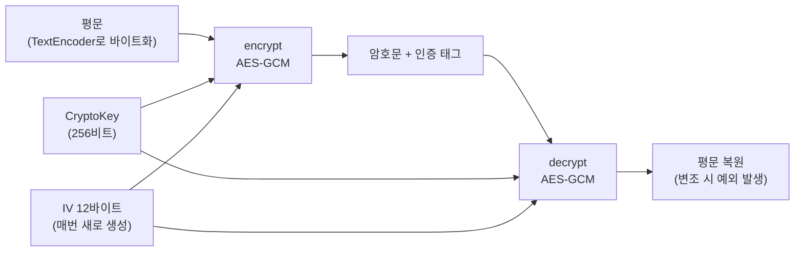

<Callout type="info">
  **이번 문서의 목표:** 이 파일을 다 읽으면 `crypto.subtle`이 제공하는 해시·암호화·서명·키 파생 연산을 목적에 맞게 고르고, CryptoKey의 수명과 추출 가능성을 설계하며, "브라우저에서 암호화하면 안전한가?"라는 질문에 위협 모델 관점으로 답할 수 있다.
</Callout>

## 왜 브라우저에 암호 API가 내장되어 있는가

암호(cryptography, 크립토그래피)는 "직접 구현하면 안 되는 분야"의 대표 사례입니다. 알고리즘 자체는 논문에 공개되어 있지만, 구현 과정에서 타이밍 차이·메모리 패턴·난수 품질 같은 미세한 틈이 생기면 수학적으로 완벽한 알고리즘도 뚫립니다. 그래서 자바스크립트로 AES를 한 줄씩 짜는 것은 학습 목적이 아니라면 금기에 가깝습니다.

브라우저는 이 문제를 **플랫폼이 대신 구현해주는 방식**으로 풉니다. Web Crypto API는 운영체제·브라우저 엔진 수준에서 검증된 암호 구현을 자바스크립트에 노출하는 표준 인터페이스이고, 그 본체가 `crypto.subtle`입니다. subtle은 "미묘한"이라는 뜻의 영단어인데, 스펙이 이 이름을 고른 이유가 재미있습니다 — **암호는 미묘해서**(subtle), API 사용법을 안다고 안전한 시스템이 저절로 만들어지지 않는다는 경고를 이름에 박아둔 것입니다.

> **쉽게 말하면:** `crypto.subtle`은 브라우저가 제공하는 "검증된 암호 연산 창구"다. 금고 만드는 법을 가르쳐주는 게 아니라, 이미 만들어진 금고를 빌려주는 것이다 — 단, 금고를 어디에 두고 열쇠를 어떻게 관리할지는 여전히 여러분의 책임이다.

### 전역 crypto 객체의 세 얼굴

`crypto`는 window와 워커 모두에서 접근 가능한 전역 객체이고, 크게 세 가지를 제공합니다.

| 구성원 | 하는 일 | 동기/비동기 |
|--------|---------|------------|
| `crypto.getRandomValues(배열)` | 암호학적으로 안전한 난수로 TypedArray를 채움 | 동기 |
| `crypto.randomUUID()` | 버전 4 UUID 문자열 생성 | 동기 |
| `crypto.subtle` | 해시·암호화·서명·키 관리 연산 묶음 | 전부 비동기(Promise) |

여기서 첫 번째부터 짚고 갈 것이 있습니다. `Math.random()`은 **암호학적으로 안전하지 않습니다.** Math.random은 예측 가능한 의사 난수(pseudo-random) 생성기라서, 출력 몇 개를 관찰하면 다음 값을 계산해낼 수 있는 구현이 실제로 존재했습니다. 세션 토큰, 초기화 벡터, 비밀번호 재설정 코드처럼 "공격자가 추측하면 안 되는 값"에는 반드시 `crypto.getRandomValues`를 써야 합니다.

```js
// 안전한 난수 16바이트 — 대칭 암호의 IV, 토큰 생성 등에 사용
const 난수버퍼 = new Uint8Array(16);
crypto.getRandomValues(난수버퍼);
console.log(난수버퍼); // 매번 예측 불가능한 16개의 바이트

// 식별자가 필요할 뿐이라면 UUID가 간편
console.log(crypto.randomUUID()); // "36b8f84d-df4e-4d49-b662-bcde71a8764f" 형태
```

### 안전한 컨텍스트에서만 열리는 창구

`crypto.subtle`은 **안전한 컨텍스트**(secure context, 시큐어 컨텍스트)에서만 존재합니다. HTTPS 페이지와 `localhost`에서는 쓸 수 있지만, 평문 HTTP 페이지에서는 `crypto.subtle`이 `undefined`입니다. 이유는 단순합니다 — 전송 구간이 암호화되지 않은 페이지라면, 페이지 자체가 중간에서 변조될 수 있으므로 그 위에서 돌아가는 암호 연산도 신뢰할 수 없기 때문입니다. 안전한 컨텍스트의 판정 기준과 다른 API들의 요구사항은 24편에서 다뤘습니다.

### ArrayBuffer의 세계 — 문자열은 그대로 못 들어간다

`crypto.subtle`의 모든 연산은 입력과 출력이 **바이너리**(ArrayBuffer 또는 TypedArray)입니다. "hello"라는 문자열을 바로 해시할 수 없고, 먼저 바이트로 바꿔야 합니다. 이 변환을 담당하는 것이 `TextEncoder`와 `TextDecoder`인데, 자세한 내용은 21편에서 다뤘으므로 여기서는 관용구만 확인합니다.

```js
const 인코더 = new TextEncoder(); // 문자열 → UTF-8 바이트
const 바이트 = 인코더.encode("hello");
// 바이트는 Uint8Array [104, 101, 108, 108, 111]
```

그리고 모든 subtle 연산은 **Promise를 반환**합니다. 암호 연산은 CPU를 꽤 쓰는 작업이라, 브라우저가 메인 스레드 밖에서 수행하고 결과만 비동기로 돌려주는 구조입니다. 즉 `await` 없이는 아무것도 얻을 수 없습니다.

## 해시 — digest로 만드는 데이터의 지문

> **쉽게 말하면:** 해시(hash)는 데이터가 무엇이든 고정 길이의 "지문"으로 요약하는 일방통행 함수다. 지문으로 사람을 복원할 수 없듯, 해시값으로 원본을 복원할 수 없다.

해시 함수는 세 가지 성질을 약속합니다.

1. **일방향성** — 해시값에서 원본을 역산할 수 없다.
2. **눈사태 효과** — 입력이 1비트만 달라져도 출력 전체가 뒤바뀐다.
3. **충돌 저항성** — 같은 해시값을 갖는 서로 다른 두 입력을 찾는 것이 현실적으로 불가능하다.

`crypto.subtle.digest(알고리즘, 데이터)`가 이 일을 합니다. digest는 "소화하다"라는 뜻의 영단어로, 긴 데이터를 소화해 짧은 요약으로 만든다는 은유입니다.

```js
async function sha256(문자열) {
  const 바이트 = new TextEncoder().encode(문자열);
  const 해시버퍼 = await crypto.subtle.digest("SHA-256", 바이트);
  // ArrayBuffer → 16진수 문자열로 변환
  const 해시배열 = Array.from(new Uint8Array(해시버퍼));
  return 해시배열.map(function (b) { return b.toString(16).padStart(2, "0"); }).join("");
}

// sha256("hello")
// → "2cf24dba5fb0a30e26e83b2ac5b9e29e1b161e5c1fa7425e73043362938b9824"
// sha256("hellp")  ← 한 글자만 다른데
// → "5a68e0dd0b9ba2ecec36d05463df8e19f7a10a4e7562d6e0b21b0a2fa1e57cbd" 전혀 다른 값
```

지원 알고리즘은 SHA-1, SHA-256, SHA-384, SHA-512입니다. SHA는 Secure Hash Algorithm의 약어로, Secure(안전한) Hash(요약) Algorithm(계산 절차)입니다. 뒤의 숫자는 출력 비트 수입니다 — SHA-256은 256비트, 즉 32바이트를 출력합니다. **SHA-1은 충돌 공격이 실증되어 보안 용도로는 퇴역**했고, 새 코드는 SHA-256 이상을 씁니다.

해시의 대표 용도는 **무결성**(integrity) 검증입니다. 파일을 다운로드한 뒤 해시를 다시 계산해 배포처가 공개한 값과 비교하면, 전송 중 변조·손상 여부를 알 수 있습니다.

### 눈사태 효과를 눈으로 확인하기

말로만 "1비트만 달라져도 전부 바뀐다"고 하면 와닿지 않습니다. 아래 실습기에서 `입력목록` 배열의 문자열을 조금씩 바꿔가며 직접 관찰해 보세요. 마지막 두 항목은 마침표 하나 차이인데, 결과 해시에는 공통점이 전혀 없습니다.

<CodePlayground
  template="vanilla"
  activeFile="/index.js"
  showConsole
  label="crypto.subtle.digest로 SHA-256 지문 계산 — 입력을 바꿔가며 눈사태 효과 관찰"
  files={{
    '/index.js': `// 문자열을 SHA-256 해시의 16진수 표현으로 바꾸는 함수
async function sha256Hex(문자열) {
  const 바이트 = new TextEncoder().encode(문자열);        // 문자열 → UTF-8 바이트
  const 해시버퍼 = await crypto.subtle.digest("SHA-256", 바이트); // ArrayBuffer 반환
  const 해시배열 = Array.from(new Uint8Array(해시버퍼));   // 바이트 배열로 열람
  return 해시배열
    .map(function (b) { return b.toString(16).padStart(2, "0"); })
    .join("");
}

const 입력목록 = [
  "",                 // 빈 문자열도 고정 길이 해시가 나온다
  "hello",
  "Hello",            // 대소문자 한 글자 차이
  "브라우저 암호 API",
  "브라우저 암호 API." // 마침표 하나 차이
];

(async function () {
  console.log("=== SHA-256 지문 (항상 64자 = 32바이트) ===");
  for (const 입력 of 입력목록) {
    const 지문 = await sha256Hex(입력);
    console.log(JSON.stringify(입력), "→", 지문);
  }

  // 같은 입력은 언제나 같은 출력 — 결정적(deterministic) 함수다
  const 첫번째 = await sha256Hex("hello");
  const 두번째 = await sha256Hex("hello");
  console.log("같은 입력 두 번 → 동일한가?", 첫번째 === 두번째);

  // 알고리즘을 바꾸면 길이가 달라진다
  const 긴지문 = await crypto.subtle.digest("SHA-512", new TextEncoder().encode("hello"));
  console.log("SHA-512 바이트 길이:", 긴지문.byteLength, "(SHA-256은 32)");
}());`,
  }}
/>

콘솔을 보면 두 가지가 확인됩니다. 첫째, 입력 길이와 무관하게 출력은 항상 32바이트(16진수 64글자)입니다. 둘째, `hello`와 `Hello`처럼 한 비트 차이인 입력의 해시에는 앞자리조차 공통점이 없습니다. 이 성질 덕분에 "해시가 같다면 원본도 같다"고 실용적으로 믿을 수 있는 것입니다.

<Callout type="warning">
  **자주 틀리는 점:** "비밀번호를 SHA-256으로 해시해서 저장하면 안전하다"는 오해가 널리 퍼져 있습니다. 일반 해시는 **너무 빠른 것**이 문제입니다 — GPU 한 대가 초당 수십억 번의 SHA-256을 계산하므로, 유출된 해시 목록에 흔한 비밀번호를 대입하는 공격이 순식간에 끝납니다. 비밀번호에는 일부러 느리게 설계된 키 파생 함수(PBKDF2 등, 아래에서 다룸)를 써야 하고, 사용자마다 다른 무작위 값인 **솔트**(salt, 소금 — 같은 비밀번호도 다른 해시가 되게 섞는 값)를 반드시 곁들여야 합니다.
</Callout>

## 대칭 암호 — 하나의 열쇠로 잠그고 여는 AES-GCM

> **쉽게 말하면:** 대칭 암호는 잠글 때와 열 때 같은 열쇠를 쓰는 자물쇠다. 빠르고 강력하지만, "열쇠를 상대에게 어떻게 안전하게 전달하느냐"가 숙제로 남는다.

대칭(symmetric, 시메트릭) 암호에서 Web Crypto의 표준 선택지는 **AES-GCM**입니다. AES는 Advanced Encryption Standard의 약어로 Advanced(진보된) Encryption(암호화) Standard(표준), 미국 표준기술연구소가 공모로 선정한 현대 대칭 암호의 사실상 유일한 정답입니다. GCM은 Galois/Counter Mode의 약어로, 운용 방식(mode)의 이름입니다. GCM이 중요한 이유는 암호화와 동시에 **인증**(authentication)을 제공하기 때문입니다 — 복호화 시 암호문이 1비트라도 변조되었으면 그냥 실패합니다. 변조 탐지가 없는 옛 방식(CBC 등)은 "암호문을 살짝 바꿔 평문을 조작하는" 공격에 취약했습니다.

### 키 생성부터 복호화까지 전체 흐름

```js
// 1. 키 생성 — generateKey(알고리즘, 추출가능여부, 용도배열)
const 키 = await crypto.subtle.generateKey(
  { name: "AES-GCM", length: 256 },  // 256비트 AES
  true,                               // extractable — 내보내기 허용 여부
  ["encrypt", "decrypt"]              // 이 키로 허용할 연산
);

// 2. 암호화 — IV(초기화 벡터)는 매번 새로 뽑는다
const iv = crypto.getRandomValues(new Uint8Array(12)); // GCM 권장 IV는 12바이트
const 평문 = new TextEncoder().encode("계좌 비밀 메모");
const 암호문 = await crypto.subtle.encrypt(
  { name: "AES-GCM", iv: iv },
  키,
  평문
);
// 암호문은 ArrayBuffer — 뒤에 16바이트 인증 태그가 붙어 평문보다 길다

// 3. 복호화 — 같은 키 + 같은 iv가 필요
const 복원버퍼 = await crypto.subtle.decrypt(
  { name: "AES-GCM", iv: iv },
  키,
  암호문
);
console.log(new TextDecoder().decode(복원버퍼)); // "계좌 비밀 메모"
```

여기서 **IV**(Initialization Vector, 초기화 벡터)가 핵심 규칙을 하나 만듭니다. IV는 비밀이 아니어서 암호문 옆에 그대로 붙여 저장해도 되지만, **같은 키로 같은 IV를 두 번 쓰면 절대 안 됩니다.** GCM에서 IV 재사용은 단순한 품질 저하가 아니라 키 자체가 위험해지는 치명적 실수입니다. 그래서 위 코드처럼 암호화할 때마다 `getRandomValues`로 새 IV를 뽑고, 암호문과 함께 묶어 보관하는 것이 정석입니다.



복호화가 실패하면 — 키가 다르든, IV가 다르든, 암호문이 변조되었든 — Promise가 `OperationError`로 거부됩니다. 주의할 점은 **실패 이유를 구분해주지 않는다**는 것입니다. 이것은 의도된 설계로, 실패 이유를 알려주는 것 자체가 공격자에게 힌트가 되기 때문입니다.

### 왕복 실습 — 암호화, 복호화, 그리고 변조 탐지

아래 실습기는 키 생성 → 암호화 → 복호화까지의 왕복을 한 번에 보여주고, 마지막에 **암호문의 바이트 하나를 일부러 뒤집어** GCM의 인증 태그가 어떻게 반응하는지 확인합니다. `평문` 변수나 `뒤집을위치` 숫자를 바꿔가며 실행해 보세요.

<CodePlayground
  template="vanilla"
  activeFile="/index.js"
  showConsole
  label="AES-GCM 암호화·복호화 왕복과 변조 탐지 실험"
  files={{
    '/index.js': `const 평문 = "계좌 비밀 메모: 다음 달 예산 120만원";
const 뒤집을위치 = 3; // 암호문에서 손댈 바이트 인덱스

function 헥스(버퍼) {
  return Array.from(new Uint8Array(버퍼))
    .map(function (b) { return b.toString(16).padStart(2, "0"); })
    .join("")
    .slice(0, 48) + "...";
}

(async function () {
  // 1) 키 생성 — extractable을 false로 두면 바이트를 꺼낼 수 없다
  const 키 = await crypto.subtle.generateKey(
    { name: "AES-GCM", length: 256 },
    false,
    ["encrypt", "decrypt"]
  );
  console.log("키 타입:", 키.type, "/ 추출 가능?", 키.extractable, "/ 용도:", 키.usages);

  // 2) IV는 암호화할 때마다 새로 뽑는다 — 재사용은 치명적
  const iv = crypto.getRandomValues(new Uint8Array(12));
  const 평문바이트 = new TextEncoder().encode(평문);

  const 암호문 = await crypto.subtle.encrypt({ name: "AES-GCM", iv: iv }, 키, 평문바이트);
  console.log("평문 바이트 수:", 평문바이트.byteLength);
  console.log("암호문 바이트 수:", 암호문.byteLength, "(16바이트 인증 태그가 더 붙는다)");
  console.log("암호문 앞부분:", 헥스(암호문));

  // 3) 정상 복호화
  const 복원 = await crypto.subtle.decrypt({ name: "AES-GCM", iv: iv }, 키, 암호문);
  console.log("복원 결과:", new TextDecoder().decode(복원));

  // 4) 변조 실험 — 암호문 바이트 하나만 뒤집어 본다
  const 변조본 = new Uint8Array(암호문.slice(0));
  변조본[뒤집을위치] = 변조본[뒤집을위치] ^ 0x01; // 최하위 1비트 반전
  try {
    await crypto.subtle.decrypt({ name: "AES-GCM", iv: iv }, 키, 변조본);
    console.log("변조본이 복호화되었다 — 이런 일은 일어나면 안 된다");
  } catch (에러) {
    console.log("변조 탐지됨:", 에러.name, "— 이유는 알려주지 않는다");
  }

  // 5) IV만 틀려도 같은 실패
  const 다른iv = crypto.getRandomValues(new Uint8Array(12));
  try {
    await crypto.subtle.decrypt({ name: "AES-GCM", iv: 다른iv }, 키, 암호문);
  } catch (에러) {
    console.log("IV 불일치도 같은 에러:", 에러.name);
  }
}());`,
  }}
/>

실행 결과에서 세 가지를 확인하세요. 암호문이 평문보다 정확히 16바이트 길다는 것(인증 태그의 크기), 1비트 변조에도 복호화가 통째로 거부된다는 것, 그리고 변조와 IV 불일치가 **똑같은 `OperationError`로 보고된다**는 것입니다. 마지막 성질 때문에 "왜 실패했는지" 사용자에게 안내하려면 애플리케이션이 별도의 문맥 정보를 들고 있어야 합니다.

## 비대칭 암호와 서명 — 열쇠가 두 개인 세계

> **쉽게 말하면:** 비대칭 암호는 "잠그는 열쇠"와 "여는 열쇠"가 다른 자물쇠다. 잠그는 열쇠(공개 키)는 온 세상에 뿌려도 되고, 여는 열쇠(개인 키)만 지키면 된다 — 대칭 암호의 "열쇠 전달 숙제"를 푸는 발명품이다.

비대칭(asymmetric, 어시메트릭) 암호는 수학적으로 짝을 이루는 **공개 키**(public key)와 **개인 키**(private key) 두 개를 씁니다. 용도에 따라 방향이 달라지는 것이 처음에 헷갈리는 지점입니다.

| 용도 | 잠그는 쪽 | 여는 쪽 | Web Crypto 대표 알고리즘 |
|------|-----------|---------|--------------------------|
| 암호화 — 나만 읽게 | 상대가 내 공개 키로 암호화 | 내가 개인 키로 복호화 | RSA-OAEP |
| 서명 — 내가 썼음을 증명 | 내가 개인 키로 서명 | 누구나 공개 키로 검증 | ECDSA, RSA-PSS |
| 키 합의 — 둘만의 비밀 만들기 | 서로 공개 키 교환 | 각자 개인 키와 조합 | ECDH |

`generateKey`에 비대칭 알고리즘을 주면 CryptoKey 하나가 아니라 `publicKey`와 `privateKey`를 담은 **키 쌍**(key pair) 객체가 나옵니다.

```js
// ECDSA 서명용 키 쌍 — EC는 Elliptic Curve(타원 곡선)의 약어
const 키쌍 = await crypto.subtle.generateKey(
  { name: "ECDSA", namedCurve: "P-256" },
  true,
  ["sign", "verify"]
);

// 서명: 개인 키로
const 데이터 = new TextEncoder().encode("이 문서는 내가 작성했다");
const 서명 = await crypto.subtle.sign(
  { name: "ECDSA", hash: "SHA-256" },
  키쌍.privateKey,
  데이터
);

// 검증: 공개 키로 — 데이터가 1비트라도 바뀌면 false
const 유효한가 = await crypto.subtle.verify(
  { name: "ECDSA", hash: "SHA-256" },
  키쌍.publicKey,
  서명,
  데이터
);
console.log(유효한가); // true
```

서명(signature, 시그니처)은 암호화가 아닙니다 — 데이터를 숨기는 게 아니라 **"이 데이터는 개인 키 소유자가 만들었고 그 뒤로 변조되지 않았다"를 증명**하는 도장입니다. 도장(서명)과 봉투(암호화)를 혼동하는 것이 비대칭 암호에서 가장 흔한 개념 오류입니다.

서명의 대칭 버전도 있습니다. **HMAC**(Hash-based Message Authentication Code)은 공유된 비밀 키 하나로 만드는 인증 코드로, "같은 비밀을 아는 사람이 만들었음"을 증명합니다. 서버와 클라이언트가 이미 비밀을 공유하는 상황(웹훅 검증 등)에서는 비대칭 서명보다 훨씬 빠른 HMAC이 표준입니다.

### 무엇을 언제 쓰나 — 알고리즘 지도

| 알고리즘 | 종류 | subtle 연산 | 전형적 용도 |
|----------|------|-------------|-------------|
| SHA-256/384/512 | 해시 | digest | 무결성 검증, 캐시 키, 지문 |
| HMAC | 대칭 인증 | sign / verify | 웹훅·API 서명 검증 |
| AES-GCM | 대칭 암호 | encrypt / decrypt | 데이터 본문 암호화 |
| RSA-OAEP | 비대칭 암호 | encrypt / decrypt | 작은 비밀(대칭 키) 전달 |
| ECDSA / RSA-PSS | 비대칭 서명 | sign / verify | 신원·문서 서명 |
| ECDH | 키 합의 | deriveKey / deriveBits | 두 당사자의 공유 비밀 생성 |
| PBKDF2 / HKDF | 키 파생 | deriveKey / deriveBits | 비밀번호·비밀값 → 암호 키 |

실무 관례 하나를 기억해두면 좋습니다. RSA-OAEP로 큰 데이터를 직접 암호화하지 않습니다 — RSA는 느리고 암호화 가능한 크기도 키 길이에 묶여 있습니다. 대신 **데이터는 AES로 잠그고, 그 AES 키만 RSA로 잠가 함께 보내는** 조합(하이브리드 암호화)이 표준 패턴입니다. 편지는 금고에 넣고, 금고 열쇠만 상대의 자물쇠로 잠가 보내는 셈입니다.

## CryptoKey와 키 관리 — 진짜 어려운 절반

암호 연산 자체보다 어려운 것이 **키 관리**입니다. Web Crypto는 키를 날바이트로 다루지 않고 **CryptoKey**라는 불투명 객체로 감싸는데, 이 설계에 안전장치가 여럿 들어 있습니다.

### extractable과 usages — 키에 채우는 두 개의 족쇄

`generateKey`의 두 번째 인자 `extractable`(추출 가능, 익스트랙터블)을 `false`로 주면, 그 키는 **자바스크립트로 원본 바이트를 꺼낼 수 없습니다.** `exportKey`를 시도하면 예외가 납니다. 키는 연산에 쓸 수는 있지만 값을 볼 수는 없는, 유리 상자 속의 열쇠가 됩니다. XSS 공격자가 페이지에서 코드를 실행하더라도 non-extractable 키의 바이트 자체는 훔칠 수 없다는 뜻입니다(다만 아래에서 보듯 이것만으로 안심할 수는 없습니다).

세 번째 인자 `keyUsages`(키 용도)는 이 키로 허용되는 연산의 화이트리스트입니다. `["encrypt"]`로만 만든 키로 `sign`을 호출하면 `InvalidAccessError`가 납니다. 용도를 최소로 좁히는 것이 원칙입니다.

### 키의 이사 — exportKey, importKey, wrapKey

키를 저장하거나 서버와 주고받으려면 직렬화가 필요합니다.

- `exportKey(형식, 키)` — CryptoKey를 바이트나 JSON으로 내보냄. 형식은 `"raw"`(날바이트, 대칭 키용), `"jwk"`(JSON Web Key — 키를 JSON 객체로 표현하는 표준), `"spki"`(공개 키용), `"pkcs8"`(개인 키용).
- `importKey(형식, 데이터, 알고리즘, extractable, usages)` — 반대 방향. 외부에서 받은 키 재료를 CryptoKey로 만듦.
- `wrapKey` / `unwrapKey` — 키를 **다른 키로 암호화해서** 내보내고 들여오는 연산. 키를 평문으로 노출하지 않고 이동시킬 때 씁니다.

그리고 중요한 저장 이야기 — **CryptoKey 객체는 구조화 복제가 가능해서 IndexedDB에 그대로 저장할 수 있습니다.** non-extractable 키를 IndexedDB에 넣어두면, "값은 볼 수 없지만 다음 방문에도 쓸 수 있는 키"라는 꽤 강한 조합이 됩니다. IndexedDB의 저장 모델은 15편에서 다뤘습니다. localStorage는 문자열만 저장하므로 키를 내보내 평문 JSON으로 넣어야 하는데, 이는 XSS에 그대로 노출되는 최악의 보관법입니다.

### 비밀번호에서 키 만들기 — PBKDF2

사용자 비밀번호는 그대로 암호 키가 될 수 없습니다. 사람의 비밀번호는 엔트로피(무작위성)가 낮아서, 여기서 키를 만들려면 **키 파생 함수**(key derivation function)를 거쳐야 합니다. PBKDF2는 Password-Based Key Derivation Function 2의 약어로, Password-Based(비밀번호 기반) Key(키) Derivation(파생) Function(함수)입니다. 핵심은 해시를 **수십만 번 반복**해서 무차별 대입 공격의 비용을 강제로 끌어올리는 것입니다.

```js
async function 비밀번호로키만들기(비밀번호, 솔트) {
  // 1. 비밀번호를 "파생의 재료"로만 쓸 수 있는 키로 등록
  const 재료 = await crypto.subtle.importKey(
    "raw",
    new TextEncoder().encode(비밀번호),
    "PBKDF2",
    false,
    ["deriveKey"]
  );
  // 2. 반복 해시를 거쳐 AES 키로 파생
  return crypto.subtle.deriveKey(
    {
      name: "PBKDF2",
      salt: 솔트,              // 사용자마다 다른 무작위 값 — 저장해두고 재사용
      iterations: 600000,      // 반복 횟수 — 높을수록 느리고 안전 (OWASP 권장선)
      hash: "SHA-256"
    },
    재료,
    { name: "AES-GCM", length: 256 },
    false,                     // 파생된 키는 추출 불가로
    ["encrypt", "decrypt"]
  );
}
```

솔트는 처음 한 번 `getRandomValues`로 만들어 사용자 데이터 옆에 저장해두고, 같은 비밀번호에서 같은 키를 재현할 때마다 다시 사용합니다. 솔트가 없으면 공격자가 흔한 비밀번호들의 파생 키를 미리 계산해둔 표(레인보우 테이블)로 일괄 공격할 수 있습니다.

## 안전한 활용 범위 — 클라이언트 암호화의 위협 모델

마지막으로 가장 중요한 질문입니다. **"브라우저에서 암호화하면 무엇으로부터 안전해지는가?"** 이 질문에 답하지 못하면 Web Crypto는 보안 연극(security theater)이 됩니다.

위협 모델(threat model)이란 "누가, 무엇을, 어떤 경로로 노리는가"를 명시하는 사고 틀입니다. Web Crypto가 막아주는 것과 못 막는 것을 나눠 봅시다.

**막아줄 수 있는 것**

- 서버 데이터베이스가 유출되어도 내용을 읽을 수 없게 하기 — 클라이언트에서 암호화해 올리고 키는 서버에 주지 않는 종단 간 설계
- 로컬 저장소(IndexedDB 등)에 넣어둔 데이터가 다른 경로로 읽혔을 때의 피해 축소
- 전송·저장 과정의 변조 탐지(해시·HMAC·서명)

**막아줄 수 없는 것**

- **XSS가 뚫린 페이지.** 공격자 스크립트가 같은 페이지에서 실행된다면, non-extractable 키의 바이트는 못 훔쳐도 그 키로 복호화 연산을 **대신 호출**해서 평문을 빼낼 수 있습니다. 자물쇠는 못 훔쳐도 자물쇠를 여는 손을 조종할 수 있는 것입니다.
- **서버가 악의적으로 변한 경우.** 암호화 코드 자체를 서버가 내려주므로, 서버는 언제든 "키를 몰래 전송하는 버전"의 코드를 배포할 수 있습니다. 웹 배포 모델에서 클라이언트 암호화의 신뢰는 결국 코드 배포자에 대한 신뢰로 환원됩니다.
- **키를 잃어버리는 사용자.** 키가 클라이언트에만 있는 설계는 복구 수단이 없다는 뜻이기도 합니다 — 기기를 바꾸면 데이터도 사라집니다.

<Callout type="warning">
  **자주 틀리는 점:** "HTTPS를 쓰는데 왜 또 암호화하냐"와 "클라이언트에서 암호화했으니 완벽하다"는 둘 다 오답입니다. HTTPS는 **전송 구간**만 지키고 서버 저장분은 지키지 않으며, 클라이언트 암호화는 **서버 유출**에는 강하지만 XSS·악성 배포에는 무력합니다. 두 층은 서로 다른 위협을 막는 별개의 방어선입니다.
</Callout>

정리하면 Web Crypto의 건강한 사용 범위는 이렇습니다 — 무결성 검증(digest), 서명 검증(verify), 로컬 데이터의 보호 강화(AES-GCM + non-extractable 키 + IndexedDB), 비밀번호 기반 키 파생(PBKDF2), 그리고 서버와 합의된 프로토콜의 클라이언트 측 구현. 반대로 "우리 서비스의 인증 체계를 프런트에서 자체 발명"하는 용도는 API를 아는 것과 무관하게 위험합니다. 미묘하다(subtle)는 이름이 붙은 이유를 항상 기억하세요.

## 핵심 정리

- `crypto.subtle`은 안전한 컨텍스트 전용, 전부 Promise 기반, 입출력은 ArrayBuffer다. 예측 불가 난수는 `Math.random`이 아니라 `crypto.getRandomValues`로 만든다.
- 해시(digest)는 일방향 지문 — 무결성 검증용이며, 비밀번호 저장에는 일반 해시가 아니라 솔트를 곁들인 PBKDF2 같은 느린 키 파생 함수를 쓴다.
- 대칭 암호의 표준은 AES-GCM — 암호화와 변조 탐지를 함께 제공하며, 같은 키로 IV를 재사용하는 것은 치명적 실수다.
- 비대칭 세계에서 암호화는 상대의 공개 키로, 서명은 내 개인 키로 한다. 큰 데이터는 AES로 잠그고 AES 키만 RSA로 전달하는 하이브리드가 표준이다.
- CryptoKey는 extractable과 usages로 족쇄를 채울 수 있고, non-extractable 키를 IndexedDB에 저장하는 조합이 강력하다. 단, 클라이언트 암호화는 XSS와 악성 코드 배포 앞에서는 무력하다 — 위협 모델을 먼저 정의하라.

## 마무리 복습

<Quiz
  questionNumber={1}
  question="세션 토큰처럼 공격자가 추측하면 안 되는 값을 생성할 때 올바른 방법은?"
  options={['Math.random을 여러 번 호출해 이어붙인다', 'crypto.getRandomValues로 난수 바이트를 생성한다', 'Date.now 값을 해시한다', '사용자 이름을 SHA-256으로 해시한다']}
  correctAnswer={2}
  explanation="Math.random은 예측 가능한 의사 난수라 보안 용도에 쓸 수 없고, 시각이나 사용자 이름처럼 추측 가능한 입력의 해시도 마찬가지로 추측 가능하다. 암호학적으로 안전한 난수는 crypto.getRandomValues가 유일한 표준 수단이다."
  optionExplanations={['여러 번 호출해도 각 출력이 예측 가능하므로 안전해지지 않는다', '정답 — 암호학적으로 안전한 난수 생성기다', '현재 시각은 공격자도 추측할 수 있는 값이다', '입력이 추측 가능하면 해시 출력도 추측 가능하다']}
/>

<Quiz
  questionNumber={2}
  question="crypto.subtle이 평문 HTTP 페이지에서 undefined인 이유로 가장 알맞은 것은?"
  options={['암호 연산이 너무 무거워 HTTPS 서버에서만 지원되기 때문', '페이지 자체가 전송 중 변조될 수 있는 환경에서는 암호 연산도 신뢰할 수 없기 때문', '브라우저 라이선스 정책 때문', 'HTTP에서는 ArrayBuffer를 쓸 수 없기 때문']}
  correctAnswer={2}
  explanation="안전한 컨텍스트 제한의 근거는 성능이 아니라 신뢰다. 평문 HTTP로 전달된 페이지는 중간자가 스크립트를 변조할 수 있으므로, 그 위에서 수행되는 암호 연산의 결과도 보증할 수 없다."
  optionExplanations={['연산 부담은 서버가 아니라 클라이언트 몫이며 제한 사유가 아니다', '정답 — 변조 가능한 페이지 위의 암호는 무의미하다는 판단이다', '라이선스와 무관한 표준 스펙의 보안 요구사항이다', 'ArrayBuffer는 HTTP 페이지에서도 정상 동작한다']}
/>

<Quiz
  questionNumber={3}
  question="비밀번호를 저장하거나 비밀번호에서 암호 키를 만들 때 SHA-256 한 번으로 부족한 근본 이유는?"
  options={['SHA-256은 출력이 너무 길어서', '일반 해시는 너무 빨라서 무차별 대입 공격 비용이 낮기 때문', 'SHA-256은 복호화가 가능하기 때문', '브라우저마다 SHA-256 결과가 다르기 때문']}
  correctAnswer={2}
  explanation="일반 해시는 빠른 것이 미덕이지만 비밀번호에는 그 속도가 약점이 된다. 공격자가 초당 수십억 번 시도할 수 있으므로, 일부러 느린 PBKDF2 같은 키 파생 함수에 사용자별 솔트를 더해 공격 비용을 끌어올려야 한다."
  optionExplanations={['출력 길이는 문제가 아니며 오히려 키 재료로 적당한 길이다', '정답 — 속도가 빠를수록 무차별 대입에 취약하다', '해시는 일방향 함수라 복호화 개념 자체가 없다', '표준 알고리즘이므로 어디서 계산해도 결과는 같다']}
/>

<Quiz
  questionNumber={4}
  question="AES-GCM 사용 시 절대 해서는 안 되는 것은?"
  options={['IV를 암호문과 함께 평문으로 저장하는 것', '같은 키로 같은 IV를 재사용하는 것', '암호화 때마다 새 IV를 생성하는 것', '키 길이로 256비트를 선택하는 것']}
  correctAnswer={2}
  explanation="GCM에서 같은 키와 같은 IV의 조합을 두 번 쓰면 키 자체의 안전성이 무너지는 치명적 결과를 낳는다. IV는 비밀이 아니므로 암호문 옆에 평문으로 저장하는 것은 정상적인 관행이고, 매번 새로 생성하는 것이 바로 그 규칙을 지키는 방법이다."
  optionExplanations={['IV는 비밀값이 아니라 함께 저장하는 것이 정석이다', '정답 — GCM에서 IV 재사용은 키를 위험에 빠뜨린다', '이것이 오히려 반드시 해야 하는 일이다', '256비트는 표준적인 안전한 선택이다']}
/>

<Quiz
  questionNumber={5}
  question="비대칭 암호에서 서명과 검증에 쓰이는 키의 방향으로 옳은 것은?"
  options={['공개 키로 서명하고 개인 키로 검증한다', '개인 키로 서명하고 공개 키로 검증한다', '서명과 검증 모두 공개 키로 한다', '서명과 검증 모두 개인 키로 한다']}
  correctAnswer={2}
  explanation="서명은 개인 키 소유자만 만들 수 있어야 증명의 의미가 있고, 검증은 누구나 할 수 있어야 유용하다. 따라서 개인 키로 sign하고 공개 키로 verify한다. 암호화는 방향이 반대로, 상대의 공개 키로 잠그고 개인 키로 연다."
  optionExplanations={['공개 키로 만든 서명은 누구나 위조할 수 있어 무의미하다', '정답 — 개인 키만이 만들 수 있고 공개 키로 누구나 확인한다', '검증은 공개 키가 맞지만 서명까지 공개 키면 증명이 성립하지 않는다', '개인 키로만 검증하면 제3자가 확인할 수 없어 서명의 목적이 사라진다']}
/>

<Quiz
  questionNumber={6}
  question="generateKey의 extractable을 false로 설정한 키에 대한 설명으로 옳은 것은?"
  options={['그 키로는 어떤 연산도 수행할 수 없다', 'exportKey로 바이트를 꺼낼 수 없지만 연산에는 쓸 수 있고 IndexedDB 저장도 가능하다', 'IndexedDB에 저장할 수 없다', 'XSS 공격을 완전히 무력화한다']}
  correctAnswer={2}
  explanation="non-extractable 키는 원본 바이트 추출만 금지될 뿐 encrypt나 sign 같은 연산에는 정상적으로 쓸 수 있으며, CryptoKey는 구조화 복제가 가능해 IndexedDB에 그대로 저장된다. 다만 XSS 공격자는 키 바이트 대신 키를 사용하는 연산을 대신 호출할 수 있으므로 완전한 방어는 아니다."
  optionExplanations={['연산 수행은 keyUsages에 지정된 범위에서 정상 가능하다', '정답 — 값은 못 보지만 쓸 수는 있는 유리 상자 속 열쇠다', 'CryptoKey는 구조화 복제 대상이라 IndexedDB 저장이 가능하다', 'XSS 시 키 바이트는 못 훔쳐도 복호화 연산을 대신 호출당할 수 있다']}
/>

<Quiz
  questionNumber={7}
  question="큰 파일을 상대에게 안전하게 전달할 때 표준적인 하이브리드 암호화 구성은?"
  options={['파일 전체를 RSA-OAEP로 직접 암호화한다', '파일은 AES-GCM으로 암호화하고 그 AES 키만 상대의 공개 키로 암호화해 함께 보낸다', '파일을 SHA-256으로 해시해서 보낸다', '파일을 개인 키로 서명만 해서 보낸다']}
  correctAnswer={2}
  explanation="RSA는 느리고 한 번에 암호화할 수 있는 크기가 키 길이에 묶여 있어 큰 데이터에 직접 쓰지 않는다. 데이터 본문은 빠른 대칭 암호 AES로 잠그고, 그 대칭 키만 비대칭 암호로 전달하는 하이브리드가 표준이다."
  optionExplanations={['RSA는 크기 제한과 속도 때문에 본문 암호화에 부적합하다', '정답 — 금고에 넣고 금고 열쇠만 상대의 자물쇠로 잠그는 구성이다', '해시는 원본을 복원할 수 없으므로 전달 수단이 아니다', '서명은 작성자 증명일 뿐 내용을 숨기지 못한다']}
/>

<Quiz
  questionNumber={8}
  question="클라이언트 측 암호화의 위협 모델에 대한 설명으로 옳은 것은?"
  options={['HTTPS를 쓰면 클라이언트 암호화는 항상 불필요하다', '서버 데이터베이스 유출에는 강하지만 XSS와 악성 코드 배포에는 무력하다', 'non-extractable 키를 쓰면 모든 공격이 차단된다', '클라이언트에서 암호화하면 서버를 신뢰할 필요가 완전히 사라진다']}
  correctAnswer={2}
  explanation="클라이언트 암호화는 서버 저장분 유출이라는 위협에는 효과적이지만, 같은 페이지에서 코드가 실행되는 XSS나 암호화 코드 자체를 내려주는 서버의 배신에는 방어 수단이 없다. HTTPS는 전송 구간만 지키므로 서로 다른 방어선이다."
  optionExplanations={['HTTPS는 전송만 지키고 서버 저장분은 지키지 않는다', '정답 — 무엇을 막고 무엇을 못 막는지가 위협 모델의 핵심이다', 'XSS 공격자는 키를 사용하는 연산을 대신 호출할 수 있다', '암호화 코드를 서버가 배포하는 한 배포자 신뢰 문제는 남는다']}
/>

## 참고 자료

- [MDN - Web Crypto API](https://developer.mozilla.org/en-US/docs/Web/API/Web_Crypto_API)
- [MDN - Permissions API](https://developer.mozilla.org/en-US/docs/Web/API/Permissions_API)
