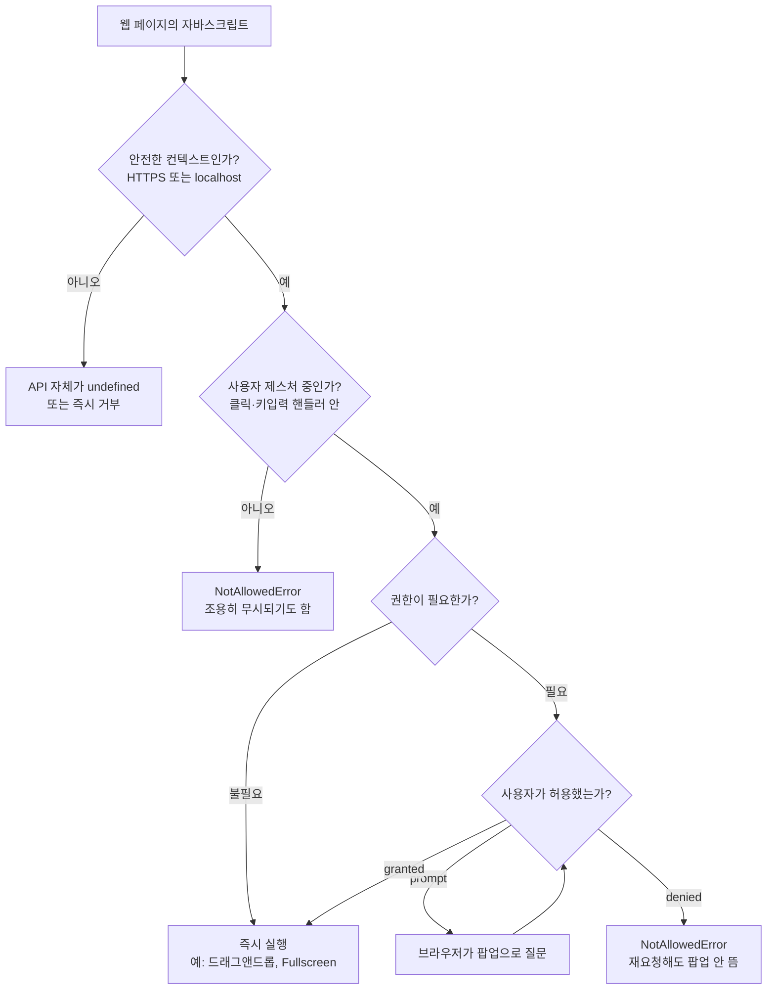
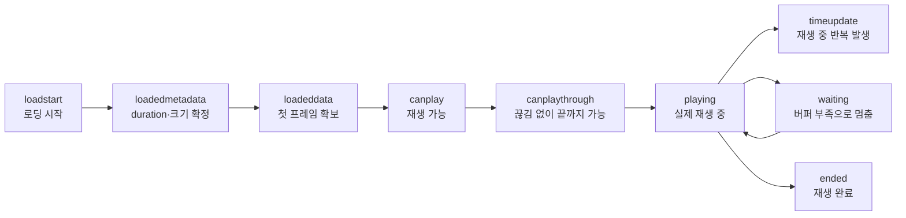
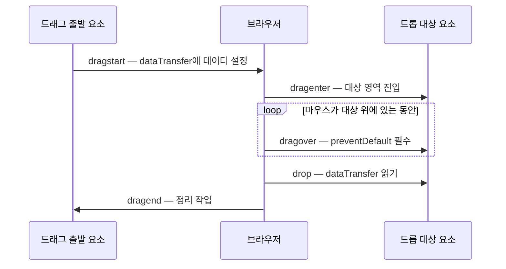
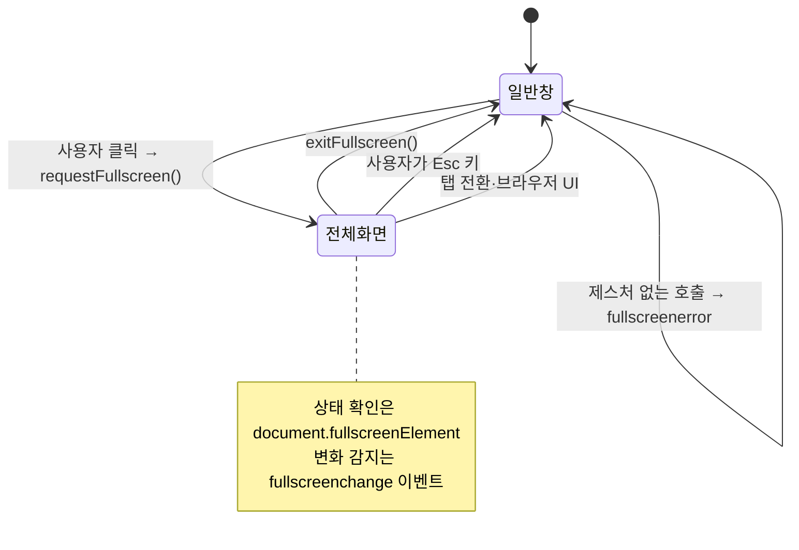

<Callout type="info">
  **이번 문서의 목표:** 이 파일을 다 읽으면 미디어 재생·캡처, 클립보드 읽기·쓰기, 드래그앤드롭, 전체화면 전환을 각각의 권한 모델과 사용자 제스처 요구 조건까지 이해하고, "왜 내 코드에서만 안 되는가"를 스스로 진단할 수 있다.
</Callout>

## 브라우저 통합 API란 무엇인가

지금까지 배운 API들은 대부분 **페이지 안에서 완결**되는 것들이었습니다. DOM은 문서 안의 트리를 다루고, fetch는 서버와 이야기하고, IndexedDB는 이 오리진(origin)에 격리된 저장소를 씁니다. 전부 브라우저가 페이지에게 빌려준 자기 영토 안의 일입니다.

이번 편에서 다루는 것은 성격이 다릅니다. 카메라, 마이크, 시스템 클립보드, 바탕화면의 파일, 화면 전체 — 이것들은 **페이지의 것이 아니라 사용자의 것**입니다. 웹 페이지는 세상 누구나 링크 하나로 방문하게 만들 수 있는 신뢰할 수 없는 코드인데, 그런 코드가 사용자의 마이크를 켜거나 복사해둔 비밀번호를 읽을 수 있다면 웹은 성립하지 않습니다.

> **쉽게 말하면:** 브라우저 통합 API는 "페이지가 사용자 소유물에 손을 뻗는 창구"다. 그래서 이 창구들은 전부 문지기를 하나씩 달고 있다 — 권한 프롬프트, 사용자 제스처 요구, 안전한 컨텍스트 제한 중 최소 하나는 반드시 붙는다.

이 문지기 구조를 그림으로 보면 이렇습니다.



권한(permission) 상태의 세 가지 값 `granted`·`denied`·`prompt`와 Permissions API로 상태를 미리 조회하는 방법은 24편에서 다뤘습니다. 이번 편은 그 위에 얹히는 개별 API들의 **동작 모델**에 집중합니다.

### 사용자 제스처라는 개념부터 정확히

여기서 반복해서 등장할 용어를 먼저 잡고 가겠습니다. **사용자 활성화**(user activation, 유저 액티베이션) 또는 흔히 **사용자 제스처**(user gesture)라 부르는 것은, "지금 실행 중인 코드가 사용자의 실제 조작에서 시작되었는가"를 브라우저가 추적하는 상태값입니다.

사용자가 버튼을 클릭하면 브라우저는 그 클릭 이벤트를 처리하는 동안 "활성화됨" 깃발을 세웁니다. 이 깃발이 서 있는 동안에만 허용되는 동작이 있습니다 — 전체화면 진입, 클립보드 쓰기, 팝업 창 열기, 소리 있는 자동 재생 등이 그렇습니다.

중요한 함정은 **깃발이 비동기 경계를 넘으면 사라진다**는 점입니다.

```js
// 동작한다 — 클릭 핸들러가 실행되는 동안 깃발이 서 있다
버튼.addEventListener("click", function () {
  화면요소.requestFullscreen();
});

// 대개 실패한다 — setTimeout으로 넘어가면 깃발이 이미 소멸
버튼.addEventListener("click", function () {
  setTimeout(function () {
    화면요소.requestFullscreen(); // NotAllowedError
  }, 1000);
});

// 짧은 await 하나 정도는 브라우저에 따라 "전이된 활성화"로 살아남기도 하지만,
// 스펙상 보장되지 않으므로 의존하면 안 된다
버튼.addEventListener("click", async function () {
  await 서버에서설정가져오기();     // 여기서 시간이 오래 걸리면
  화면요소.requestFullscreen();     // 실패할 수 있다
});
```

비유하자면 사용자 제스처는 **콘서트장 재입장 도장** 같은 것입니다. 손등에 찍힌 도장은 잠깐 나갔다 들어올 때만 유효하고, 몇 시간 뒤에는 지워져서 쓸 수 없습니다. "사용자가 아까 클릭했었다"는 사실은 권한이 아니고, "사용자가 방금 클릭해서 지금 이 코드가 돌고 있다"만 권한입니다.

<Callout type="warning">
  **자주 틀리는 점:** 개발자 도구 콘솔에 코드를 붙여넣어 실행하면 사용자 제스처 깃발이 없어서 실패하는 API가 많습니다. 콘솔에서 안 된다고 코드가 틀린 게 아닐 수 있습니다. 반대로 일부 브라우저는 개발자 편의를 위해 콘솔 실행에 활성화를 부여하기도 해서, **콘솔에서 되는데 실제 페이지에서 안 되는** 반대 상황도 생깁니다. 검증은 반드시 실제 클릭 핸들러 안에서 하세요.
</Callout>

## 미디어 — 재생 제어와 스트림 진입점

### HTMLMediaElement라는 공통 인터페이스

`video` 요소와 `audio` 요소는 서로 다른 태그지만, 자바스크립트에서 보면 **HTMLMediaElement**라는 같은 인터페이스를 공유합니다. 2편에서 배운 Web IDL 상속 관계로 표현하면 `HTMLVideoElement`와 `HTMLAudioElement`가 모두 `HTMLMediaElement`를 상속합니다. 그래서 재생·일시정지·볼륨·탐색 같은 조작 방법이 완전히 동일합니다.

| 멤버 | 종류 | 의미 |
|------|------|------|
| `play()` | 메서드 | 재생 시작 – Promise를 반환한다 |
| `pause()` | 메서드 | 일시정지 – 동기 메서드 |
| `currentTime` | 속성 | 현재 재생 위치(초) – 대입하면 탐색(seek) |
| `duration` | 속성 | 전체 길이(초) – 메타데이터 로드 전에는 NaN |
| `volume` | 속성 | 0.0에서 1.0 사이 |
| `muted` | 속성 | 음소거 여부 |
| `playbackRate` | 속성 | 배속 – 1.0이 기본 |
| `readyState` | 속성 | 재생 가능 정도를 나타내는 0에서 4까지의 숫자 |
| `src` / `srcObject` | 속성 | 재생 소스 – URL 문자열 또는 MediaStream 객체 |

여기서 `play()`가 Promise를 반환한다는 점이 실무의 핵심입니다. 재생은 즉시 시작되는 것이 아니라 "버퍼가 충분한가, 자동 재생 정책이 허용하는가"를 거친 뒤 결정되므로, 결과를 반드시 받아야 합니다.

```js
// 자동 재생 정책에 걸릴 수 있으므로 항상 catch를 붙인다
동영상.play().catch(function (에러) {
  if (에러.name === "NotAllowedError") {
    // 소리가 켜진 자동 재생이 차단된 상황 — 재생 버튼을 노출하거나 음소거로 재시도
    동영상.muted = true;
    동영상.play();
  }
});
```

### 자동 재생 정책 — 왜 소리가 안 나는가

브라우저는 광고와 스팸 때문에 **소리 있는 자동 재생을 기본적으로 차단**합니다. 규칙을 요약하면 이렇습니다.

- `muted` 상태이거나 소리 트랙이 없는 미디어는 자동 재생이 허용된다.
- 소리가 있는 미디어는 **사용자 제스처가 있었거나**, 사용자가 그 사이트에서 미디어를 자주 재생해 브라우저가 신뢰도를 부여한 경우에만 허용된다.
- 차단되면 `play()`의 Promise가 `NotAllowedError`로 거부된다.

그래서 현대 웹의 배경 동영상들이 전부 `muted` 속성을 달고 있는 것입니다. "음소거 자동 재생 → 사용자가 스피커 아이콘을 클릭하면 `muted = false`" 패턴이 사실상 표준입니다.

### 미디어 이벤트의 순서

미디어 요소는 로딩과 재생 과정에서 여러 이벤트를 순서대로 발생시킵니다. 이 순서를 알면 "언제 duration을 읽어도 되는가" 같은 질문이 풀립니다.



`duration`은 `loadedmetadata` 이전에는 `NaN`입니다. 로드 직후 진행 바(progress bar)의 총 길이를 계산하려다 `NaN`이 나오는 버그가 흔한데, 원인은 대부분 이 순서를 무시했기 때문입니다. `timeupdate`는 초당 4회에서 66회 사이로 브라우저가 알아서 발생시키므로 프레임 단위의 정밀한 동기화에는 부족합니다 — 그럴 때는 18편의 `requestAnimationFrame`을 씁니다.

### 카메라·마이크 진입점 — getUserMedia

페이지가 카메라와 마이크에 접근하는 창구는 `navigator.mediaDevices.getUserMedia(제약조건)`입니다. media(미디어) + devices(장치)라는 이름 그대로 "미디어 장치들"에 대한 접근 지점입니다.

```js
// 안전한 컨텍스트 + 권한 프롬프트가 모두 필요하다
try {
  const 스트림 = await navigator.mediaDevices.getUserMedia({
    video: { width: { ideal: 1280 } },
    audio: true
  });
  동영상요소.srcObject = 스트림; // src가 아니라 srcObject에 대입
  // 사용이 끝나면 반드시 트랙을 멈춘다 — 안 그러면 카메라 표시등이 계속 켜져 있다
  // 스트림.getTracks().forEach(function (트랙) { 트랙.stop(); });
} catch (에러) {
  // NotAllowedError: 사용자가 거부 / NotFoundError: 장치 없음
  console.log(에러.name);
}
```

여기서 두 가지가 새롭습니다. 첫째, 결과물인 **MediaStream**은 파일이 아니라 "살아 있는 트랙들의 묶음"이라서 `src`가 아닌 `srcObject`에 대입합니다. 둘째, 스트림을 다 쓴 뒤 각 트랙의 `stop()`을 호출하지 않으면 카메라 하드웨어가 계속 점유되고 표시등이 켜진 채로 남습니다. 이것이 미디어 스트림에서 가장 흔한 리소스 누수입니다.

<Callout type="warning">
  **자주 틀리는 점:** 권한이 거부된 뒤 다시 `getUserMedia`를 호출해도 팝업은 뜨지 않고 즉시 `NotAllowedError`가 납니다. 브라우저가 사용자의 거부 결정을 사이트 단위로 기억하기 때문입니다. 이때 개발자가 할 수 있는 일은 재시도가 아니라 **주소창의 자물쇠 아이콘에서 권한을 바꾸는 방법을 안내하는 것**뿐입니다. 그래서 권한 요청 직전에 "왜 필요한지" 설명하는 사전 화면을 두는 것이 좋은 설계입니다.
</Callout>

미디어의 더 깊은 세계 — WebRTC로 스트림을 상대에게 전송하기, Web Audio API로 오디오를 가공하기, MediaRecorder로 녹화하기 — 는 이 과목의 범위 밖입니다. 진입점과 판단 기준은 30편 부록에서 안내합니다.

## Clipboard API — 복사와 붙여넣기의 비대칭

### 왜 읽기와 쓰기의 난이도가 다른가

클립보드(clipboard, 오려둔 것을 붙이는 판)는 시스템 전역 공간입니다. 사용자가 방금 다른 앱에서 복사한 비밀번호나 주민등록번호가 거기 들어 있을 수 있습니다. 그래서 브라우저는 읽기와 쓰기를 완전히 다르게 취급합니다.

| 동작 | API | 요구 조건 | 위험도 |
|------|-----|-----------|--------|
| 쓰기 – 복사 | `navigator.clipboard.writeText` | 안전한 컨텍스트 + 사용자 제스처 | 낮음 – 사용자 데이터를 덮어쓸 뿐 |
| 읽기 – 붙여넣기 | `navigator.clipboard.readText` | 안전한 컨텍스트 + 명시적 권한 프롬프트 | 높음 – 남의 비밀을 훔쳐볼 수 있음 |

> **쉽게 말하면:** 클립보드에 쓰는 것은 남의 메모지에 낙서하는 일이고, 읽는 것은 남의 메모지를 훔쳐보는 일이다. 브라우저는 낙서는 비교적 관대하게 허용하고, 훔쳐보기는 매번 허락을 받게 한다.

크로뮴 계열 브라우저는 `clipboard-read`와 `clipboard-write`라는 권한 이름을 Permissions API로 조회할 수 있게 노출하지만, 다른 엔진은 이 권한 이름을 지원하지 않고 **사용자가 붙여넣기 제스처를 직접 했을 때만** 읽기를 허용하는 정책을 씁니다. 즉 `readText`는 브라우저 간 편차가 가장 큰 API 중 하나이므로, 항상 `paste` 이벤트라는 대안 경로를 함께 준비해야 합니다.

### 쓰기 — writeText와 write

```js
복사버튼.addEventListener("click", async function () {
  try {
    await navigator.clipboard.writeText("복사할 내용");
    안내문구.textContent = "복사되었습니다";
  } catch (에러) {
    // 사용자 제스처 밖이거나 문서가 포커스를 잃은 경우 실패
    안내문구.textContent = "복사에 실패했습니다: " + 에러.name;
  }
});
```

문자열이 아닌 이미지 등을 다루려면 `navigator.clipboard.write`에 **ClipboardItem** 배열을 넘깁니다. ClipboardItem은 "MIME 타입 → Blob"의 지도(map)로, 같은 내용을 여러 형식으로 동시에 제공할 수 있게 합니다.

```js
const 항목 = new ClipboardItem({
  "text/plain": new Blob(["표 안의 값"], { type: "text/plain" }),
  "text/html": new Blob(["<b>표 안의 값</b>"], { type: "text/html" })
});
await navigator.clipboard.write([항목]);
```

이렇게 두 형식을 함께 넣으면 서식을 지원하는 앱은 굵은 글씨로, 메모장 같은 앱은 평문으로 붙여넣습니다. Blob의 구조는 21편에서 다뤘습니다.

### 읽기 — 두 갈래 경로

```js
// 경로 1: 명시적 읽기 — 권한 프롬프트가 뜰 수 있고 브라우저 지원 편차가 크다
붙여넣기버튼.addEventListener("click", async function () {
  try {
    const 텍스트 = await navigator.clipboard.readText();
    입력창.value = 텍스트;
  } catch (에러) {
    console.log("읽기 거부 또는 미지원:", 에러.name);
  }
});

// 경로 2: paste 이벤트 — 사용자가 직접 붙여넣기를 실행한 순간이라 권한이 필요 없다
입력창.addEventListener("paste", function (이벤트) {
  const 데이터 = 이벤트.clipboardData; // DataTransfer 객체
  const 텍스트 = 데이터.getData("text/plain");
  console.log("붙여넣은 내용:", 텍스트);
  // 기본 동작을 막고 직접 가공해서 넣을 수도 있다
  // 이벤트.preventDefault();
});
```

경로 2에 등장하는 `clipboardData`의 타입이 **DataTransfer**인데, 이 객체는 잠시 뒤 드래그앤드롭에서 다시 만납니다. 클립보드 붙여넣기와 드래그 드롭은 "다른 곳의 데이터가 페이지로 들어온다"는 같은 문제를 푸는 형제이고, 그래서 같은 자료구조를 공유합니다.

### 직접 확인해 보기

아래 실습기는 클립보드 API의 존재 여부와 조건들을 점검합니다. 실제 복사·붙여넣기는 실습기 안에서 브라우저 정책에 막힐 수 있으므로, **어떤 조건이 충족되고 어떤 것이 막히는지를 관찰하는 것**이 목적입니다.

<CodePlayground
  template="vanilla"
  activeFile="/index.js"
  showConsole
  label="브라우저 통합 API의 존재·조건 점검과 클립보드 쓰기 시도"
  files={{
    '/index.js': `// 1) 이 실행 환경이 어떤 창구를 열어주는지 먼저 점검한다
console.log("=== 통합 API 가용성 점검 ===");
console.log("안전한 컨텍스트인가?", window.isSecureContext);
console.log("clipboard 객체:", typeof navigator.clipboard);
console.log("writeText 지원:", typeof navigator.clipboard?.writeText === "function");
console.log("readText 지원:", typeof navigator.clipboard?.readText === "function");
console.log("mediaDevices 지원:", typeof navigator.mediaDevices !== "undefined");
console.log("Fullscreen 지원:", typeof document.documentElement.requestFullscreen === "function");
console.log("현재 전체화면 요소:", document.fullscreenElement);

// 2) 실제로 눌러볼 버튼을 만든다 — 사용자 제스처 안에서만 성공하는지 확인용
const 앱 = document.getElementById("app") || document.body;

const 복사버튼 = document.createElement("button");
복사버튼.textContent = "클릭해서 복사 시도";
앱.appendChild(복사버튼);

const 지연복사버튼 = document.createElement("button");
지연복사버튼.textContent = "1초 뒤에 복사 시도 (제스처 소멸)";
앱.appendChild(지연복사버튼);

async function 복사시도(라벨) {
  try {
    await navigator.clipboard.writeText("Web API 학습 중 " + Date.now());
    console.log(라벨, "→ 성공");
  } catch (에러) {
    console.log(라벨, "→ 실패:", 에러.name, "/", 에러.message);
  }
}

복사버튼.addEventListener("click", function () {
  복사시도("제스처 안에서 복사");
});

지연복사버튼.addEventListener("click", function () {
  setTimeout(function () {
    복사시도("제스처 밖에서 복사");
  }, 1000);
});

// 3) 붙여넣기는 권한 없이도 paste 이벤트로 받을 수 있다
document.addEventListener("paste", function (이벤트) {
  console.log("paste 이벤트 수신:", 이벤트.clipboardData.getData("text/plain"));
});
console.log("이 영역을 클릭한 뒤 붙여넣기를 눌러보면 paste 이벤트가 찍힙니다.");`,
  }}
/>

두 버튼의 결과를 비교해 보세요. 즉시 복사는 성공하는데 1초 뒤 복사는 실패하는 것을 확인했다면, 사용자 제스처가 "상태"가 아니라 "순간"이라는 사실을 체감한 것입니다. 실습기가 iframe 안에서 동작하는 환경이라 둘 다 실패할 수도 있는데, 이 경우 에러 이름이 `NotAllowedError`인지 확인하면 정책 차단임을 알 수 있습니다.

## 드래그앤드롭 — 이벤트 모델이 전부다

### 두 가지 드래그앤드롭을 구분하라

드래그앤드롭(drag and drop, 끌어서 놓기)이라는 말은 실제로는 두 가지 다른 기능을 가리킵니다.

1. **HTML5 드래그앤드롭 API** — `dragstart`·`dragover`·`drop` 같은 전용 이벤트를 쓰는 표준 기능. 브라우저 창 밖(바탕화면 파일 등)에서 안으로 끌어오는 것을 지원한다.
2. **포인터 기반 수동 구현** — `pointerdown`·`pointermove`·`pointerup`으로 좌표를 계산해 요소를 직접 옮기는 방식. 목록 순서 바꾸기 같은 정교한 UI에 쓴다.

이번 편에서 다루는 것은 1번입니다. 2번은 9편의 포인터 이벤트 지식으로 만드는 것이고, 모바일 터치 지원과 애니메이션이 필요한 UI는 대개 2번을 씁니다. **네이티브 드래그앤드롭 API는 모바일 브라우저에서 거의 동작하지 않는다**는 점이 선택의 갈림길입니다.

### 이벤트의 흐름



이 흐름에서 초보자를 가장 많이 좌절시키는 규칙이 하나 있습니다.

<Callout type="warning">
  **자주 틀리는 점:** `dragover` 이벤트에서 `preventDefault()`를 호출하지 않으면 `drop` 이벤트가 **아예 발생하지 않습니다.** HTML 명세상 기본 동작은 "이 요소는 드롭을 받지 않는다"이고, 기본 동작을 취소해야 비로소 드롭 가능 영역이 됩니다. `drop` 핸들러를 아무리 정확히 써도 `dragover`를 막지 않으면 코드는 한 번도 실행되지 않습니다. 이것이 드래그앤드롭 질문의 절반을 차지하는 원인입니다.
</Callout>

또한 브라우저 밖에서 파일을 끌어왔을 때 `drop`에서 `preventDefault()`를 호출하지 않으면, 브라우저가 기본 동작으로 **그 파일을 탭에 열어버립니다.** PDF를 끌어놨더니 앱이 사라지고 PDF 뷰어가 뜨는 현상의 원인이 이것입니다.

### DataTransfer — 드래그의 화물칸

`dataTransfer`는 드래그하는 동안 데이터를 싣고 가는 화물칸입니다. 주요 멤버는 다음과 같습니다.

| 멤버 | 의미 |
|------|------|
| `setData(형식, 값)` | dragstart에서 데이터를 싣는다 – 형식은 MIME 타입 문자열 |
| `getData(형식)` | drop에서 데이터를 꺼낸다 |
| `files` | 운영체제에서 끌어온 File 객체 목록 |
| `items` | 파일과 문자열을 모두 포함하는 항목 목록 |
| `types` | 실려 있는 데이터의 형식 목록 |
| `effectAllowed` / `dropEffect` | 허용 동작과 표시 동작 – copy, move, link, none |

여기 보안 장치가 하나 숨어 있습니다. **`dragover` 단계에서는 `getData`로 실제 값을 읽을 수 없습니다.** `types`로 "무슨 형식이 들어 있는지"만 볼 수 있고, 값은 `drop` 순간에만 열립니다. 사용자가 놓기로 결정하기 전까지는 페이지가 화물칸 내용을 훔쳐볼 수 없게 만든 설계입니다.

```js
const 드롭영역 = document.getElementById("drop");

// 반드시 막아야 drop이 발생한다
드롭영역.addEventListener("dragover", function (이벤트) {
  이벤트.preventDefault();
  이벤트.dataTransfer.dropEffect = "copy"; // 커서 모양을 복사 아이콘으로
});

드롭영역.addEventListener("drop", function (이벤트) {
  이벤트.preventDefault(); // 브라우저가 파일을 열어버리는 것을 막는다

  // 파일이 왔다면
  for (const 파일 of 이벤트.dataTransfer.files) {
    console.log(파일.name, 파일.size, 파일.type); // File 객체 — 21편 참고
  }
  // 텍스트가 왔다면
  const 텍스트 = 이벤트.dataTransfer.getData("text/plain");
  if (텍스트) console.log("텍스트:", 텍스트);
});
```

떨어뜨린 결과물인 `File`은 21편에서 배운 `Blob`의 하위 타입이므로, 그대로 `FileReader`로 읽거나 `URL.createObjectURL`로 미리보기를 만들거나 `fetch`의 본문으로 업로드할 수 있습니다. 드래그앤드롭은 파일을 **얻는 경로**일 뿐, 그 다음은 이미 아는 세계입니다.

### dragenter와 dragleave의 함정

드롭 영역에 시각적 강조 효과를 주려고 `dragenter`에서 클래스를 붙이고 `dragleave`에서 떼는 코드를 쓰면, **자식 요소를 지날 때마다 강조가 깜빡이는** 버그를 만납니다. 드래그가 자식 요소로 넘어가는 순간 부모에 `dragleave`가, 자식에 `dragenter`가 발생하기 때문입니다.

해결책은 진입 횟수를 세는 것입니다.

```js
let 진입깊이 = 0;

드롭영역.addEventListener("dragenter", function () {
  진입깊이 = 진입깊이 + 1;
  드롭영역.classList.add("강조");
});

드롭영역.addEventListener("dragleave", function () {
  진입깊이 = 진입깊이 - 1;
  if (진입깊이 === 0) 드롭영역.classList.remove("강조");
});

드롭영역.addEventListener("drop", function () {
  진입깊이 = 0;
  드롭영역.classList.remove("강조"); // drop에서는 dragleave가 오지 않는다
});
```

`drop`이 일어나면 `dragleave`가 발생하지 않는다는 점까지 챙겨야 완성입니다. CSS의 `pointer-events: none`을 자식들에게 주는 방법도 있지만, 자식이 클릭 대상이면 쓸 수 없어 카운터 방식이 더 범용적입니다.

## Fullscreen API — 창을 넘어서는 순간

### 왜 권한이 아니라 제스처인가

전체화면(fullscreen) 전환에는 권한 프롬프트가 없습니다. 대신 **사용자 제스처 안에서만 호출 가능**하고, 진입할 때마다 브라우저가 "전체화면을 종료하려면 Esc를 누르세요"라는 안내를 띄웁니다.

이유는 위협의 성격이 다르기 때문입니다. 전체화면은 사용자 데이터를 훔치는 기능이 아니라 **화면을 속이는** 기능입니다. 페이지가 몰래 전체화면으로 전환한 뒤 가짜 운영체제 로그인 화면을 그리면 사용자는 구분할 방법이 없습니다. 그래서 방어책이 "허락받기"가 아니라 "사용자가 스스로 시작했음을 보장하고, 탈출 방법을 항상 알려주기"가 된 것입니다.

> **쉽게 말하면:** 카메라는 "빌려도 되나요?"라고 묻는 문제이고, 전체화면은 "지금 보는 화면이 진짜인가?"의 문제다. 그래서 답이 팝업이 아니라 제스처와 탈출 안내다.

### 진입·이탈 API

```js
// 진입 — 요소 단위다. 문서 전체를 원하면 documentElement를 쓴다
전체화면버튼.addEventListener("click", async function () {
  try {
    await 동영상컨테이너.requestFullscreen({ navigationUI: "hide" });
  } catch (에러) {
    console.log("진입 실패:", 에러.name); // TypeError 또는 NotAllowedError
  }
});

// 이탈 — 요소가 아니라 document의 메서드다 (비대칭에 주의)
종료버튼.addEventListener("click", function () {
  if (document.fullscreenElement) document.exitFullscreen();
});

// 상태 변화 감지 — Esc로 나가는 경우까지 잡으려면 이벤트가 필수
document.addEventListener("fullscreenchange", function () {
  const 전체화면인가 = document.fullscreenElement !== null;
  전체화면버튼.textContent = 전체화면인가 ? "전체화면 종료" : "전체화면";
});

document.addEventListener("fullscreenerror", function () {
  console.log("전체화면 전환이 거부되었다");
});
```

여기서 **비대칭**을 기억하세요. 진입은 요소의 메서드(`요소.requestFullscreen()`), 이탈은 문서의 메서드(`document.exitFullscreen()`)입니다. 한 시점에 전체화면인 요소는 하나뿐이므로 이탈은 문서 수준에서 관리하는 것이 자연스럽다는 설계입니다. 현재 어떤 요소가 전체화면인지는 `document.fullscreenElement`로 알 수 있고, 전체화면이 아니면 `null`입니다.

### 상태 추적은 반드시 이벤트로

사용자는 Esc 키나 브라우저 UI로 언제든 전체화면을 빠져나갈 수 있습니다. 이때 자바스크립트 코드는 아무 호출도 하지 않았으므로, `requestFullscreen()`을 호출한 뒤 `내가전체화면이다 = true` 같은 변수를 직접 관리하면 **즉시 실제 상태와 어긋납니다.** 상태의 단일 진실 공급원은 항상 `document.fullscreenElement`이고, 변화 감지는 `fullscreenchange` 이벤트입니다.



### 제약 몇 가지

- **iframe 안에서는 기본적으로 막힙니다.** 부모 문서가 `allow="fullscreen"` 권한 정책(Permissions Policy)을 명시적으로 위임해야 합니다. 임베드된 동영상 플레이어가 전체화면 버튼을 못 쓰는 이유가 대부분 이것입니다.
- **접두사 시절의 잔재**가 남아 있습니다. 오래된 코드에서 `webkitRequestFullscreen`·`mozRequestFullScreen` 같은 이름을 보게 되는데, 2편에서 배운 호환성 표기를 확인하고 필요할 때만 대체 경로를 두면 됩니다.
- 전체화면 중에는 CSS 의사 클래스 `:fullscreen`으로 스타일을 분기할 수 있습니다. 자바스크립트로 클래스를 토글할 필요가 없습니다.

### 화면 방향 잠금은 별개 API

모바일에서 전체화면과 함께 쓰이는 `screen.orientation.lock("landscape")`는 **Screen Orientation API**라는 별개 명세입니다. 대부분의 브라우저가 "전체화면 상태일 때만" 방향 잠금을 허용하므로 두 API를 짝지어 쓰게 되지만, 지원 범위가 다르므로 각각 존재 확인을 해야 합니다.

## 이 API들을 관통하는 세 가지 원칙

여러 API를 한 편에서 다뤘지만, 설계 원칙은 반복됩니다.

1. **위험도에 비례한 문지기.** 클립보드 쓰기는 제스처만, 읽기는 권한까지. 전체화면은 제스처와 탈출 안내. 카메라는 명시적 프롬프트. API 하나를 처음 만날 때 "이건 어떤 문지기가 붙었을까"를 먼저 물으면 대부분의 실패를 예측할 수 있습니다.
2. **상태는 브라우저가 진실을 가진다.** 전체화면 여부, 권한 상태, 미디어 재생 여부 — 전부 내가 만든 변수가 아니라 브라우저 객체를 조회하고 이벤트로 추적해야 합니다. 사용자가 UI로 언제든 상태를 바꿀 수 있기 때문입니다.
3. **정리 책임은 페이지에 있다.** 미디어 트랙의 `stop()`, 객체 URL의 `revokeObjectURL`, 드래그 상태 카운터 초기화 — 브라우저는 자동으로 치워주지 않습니다.

## 핵심 정리

- 브라우저 통합 API는 사용자 소유의 자원에 접근하므로 안전한 컨텍스트·사용자 제스처·권한 프롬프트 중 최소 하나의 문지기를 거친다. 사용자 제스처는 지속되는 상태가 아니라 순간이며, 타이머나 긴 `await`를 넘으면 소멸한다.
- 미디어 요소는 `play()`가 Promise를 반환하고 소리 있는 자동 재생이 차단되므로 항상 실패 처리를 둔다. `getUserMedia`로 얻은 스트림은 트랙마다 `stop()`으로 반납해야 카메라가 꺼진다.
- 클립보드는 쓰기와 읽기가 비대칭이다. `writeText`는 제스처면 되지만 `readText`는 권한과 브라우저 편차가 크므로 `paste` 이벤트 경로를 함께 준비한다.
- 네이티브 드래그앤드롭의 첫 관문은 `dragover`에서의 `preventDefault()`다. 이걸 빠뜨리면 `drop`이 아예 발생하지 않으며, 데이터는 `drop` 순간에만 읽을 수 있다.
- 전체화면은 요소로 진입하고 문서로 이탈하는 비대칭 구조이며, 사용자가 Esc로 빠져나갈 수 있으므로 상태는 반드시 `document.fullscreenElement`와 `fullscreenchange`로 추적한다.

## 마무리 복습

<Quiz
  questionNumber={1}
  question="사용자 제스처(user activation)에 대한 설명으로 옳은 것은?"
  options={['한 번 클릭하면 그 페이지가 닫힐 때까지 유효하다', '클릭 핸들러가 실행되는 동안 유효하며 setTimeout 안으로 넘어가면 대개 소멸한다', 'HTTPS 페이지에서는 필요 없다', '권한 프롬프트에서 허용을 누르면 영구히 부여된다']}
  correctAnswer={2}
  explanation="사용자 활성화는 지속되는 권한이 아니라 사용자의 조작에서 시작된 실행 흐름에만 붙는 순간적인 깃발이다. 타이머나 긴 비동기 대기를 넘으면 사라진다."
  optionExplanations={['페이지 수명 동안 유지된다면 광고가 마음대로 전체화면을 켤 수 있어 의미가 없다', '정답 — 비동기 경계를 넘으면 소멸하므로 즉시 호출해야 한다', 'HTTPS는 안전한 컨텍스트 조건이고 제스처 요구와는 별개의 문지기다', '권한 상태와 사용자 활성화는 서로 다른 개념이다']}
/>

<Quiz
  questionNumber={2}
  question="소리가 포함된 동영상이 페이지 로드 직후 자동 재생되지 않는 이유로 가장 알맞은 것은?"
  options={['비디오 코덱을 브라우저가 지원하지 않아서', '브라우저의 자동 재생 정책이 소리 있는 미디어를 차단하기 때문', 'video 요소는 자바스크립트로 제어할 수 없어서', 'duration 속성이 아직 NaN이라서']}
  correctAnswer={2}
  explanation="브라우저는 소리 있는 자동 재생을 기본 차단하고, muted 상태이거나 사용자 제스처가 있을 때만 허용한다. 차단 시 play가 반환한 Promise가 NotAllowedError로 거부된다."
  optionExplanations={['코덱 문제라면 재생 자체가 에러로 끝나며 정책 차단과는 증상이 다르다', '정답 — muted를 켜거나 사용자 클릭 뒤에 재생해야 한다', 'HTMLMediaElement 인터페이스로 완전히 제어할 수 있다', 'duration은 메타데이터 로드 전 값일 뿐 재생 차단 사유가 아니다']}
/>

<Quiz
  questionNumber={3}
  question="getUserMedia로 얻은 MediaStream 사용이 끝났을 때 반드시 해야 하는 일은?"
  options={['video 요소의 src를 빈 문자열로 만든다', '스트림의 각 트랙에 stop을 호출한다', 'URL.revokeObjectURL을 호출한다', 'localStorage에 저장된 권한 값을 지운다']}
  correctAnswer={2}
  explanation="MediaStream은 살아 있는 트랙의 묶음이므로 getTracks로 각 트랙을 순회하며 stop을 호출해야 카메라·마이크 하드웨어가 반납되고 표시등이 꺼진다."
  optionExplanations={['스트림은 srcObject에 대입하며 src를 비우는 것으로는 트랙이 멈추지 않는다', '정답 — 트랙 단위로 stop을 호출해야 장치가 반납된다', 'revokeObjectURL은 객체 URL을 만들었을 때 필요한 정리이며 스트림 트랙과는 다르다', '권한 상태는 브라우저가 관리하며 저장소에 있지 않다']}
/>

<Quiz
  questionNumber={4}
  question="navigator.clipboard의 readText가 writeText보다 훨씬 엄격하게 제한되는 이유는?"
  options={['읽기 연산이 CPU를 많이 사용하기 때문', '클립보드에 담긴 다른 앱의 민감한 데이터를 페이지가 훔쳐볼 수 있기 때문', '읽기는 비동기이고 쓰기는 동기이기 때문', '읽기는 안전한 컨텍스트에서 동작하지 않기 때문']}
  correctAnswer={2}
  explanation="클립보드는 시스템 전역 공간이라 사용자가 다른 앱에서 복사한 비밀번호 등이 들어 있을 수 있다. 읽기는 정보 유출 위험이 커서 명시적 권한이나 사용자 붙여넣기 제스처를 요구한다."
  optionExplanations={['성능 문제가 아니다', '정답 — 남의 메모지를 훔쳐보는 것과 낙서하는 것의 차이다', '두 메서드 모두 Promise를 반환하는 비동기 API다', '두 연산 모두 안전한 컨텍스트를 요구한다']}
/>

<Quiz
  questionNumber={5}
  question="드롭 영역에 파일을 놓았는데 drop 이벤트 핸들러가 전혀 실행되지 않는다. 가장 유력한 원인은?"
  options={['dragover 핸들러에서 preventDefault를 호출하지 않았다', 'dataTransfer에 setData를 하지 않았다', 'drop 핸들러를 캡처 단계로 등록하지 않았다', '파일 크기가 너무 크다']}
  correctAnswer={1}
  explanation="HTML 명세상 요소의 기본 동작은 드롭을 받지 않는 것이다. dragover에서 preventDefault로 기본 동작을 취소해야 비로소 그 요소가 유효한 드롭 대상이 되어 drop 이벤트가 발생한다."
  optionExplanations={['정답 — 드래그앤드롭 문제의 절반이 이 한 줄 누락이다', 'setData는 페이지 안에서 드래그를 시작할 때 쓰며 외부 파일 드롭에는 필요 없다', '단계와 무관하게 이벤트 자체가 발생하지 않는 상황이다', '크기 제한 때문에 이벤트가 사라지지는 않는다']}
/>

<Quiz
  questionNumber={6}
  question="dragover 단계의 dataTransfer에서 getData로 실제 값을 읽을 수 없는 이유로 알맞은 것은?"
  options={['성능 최적화를 위해 값을 나중에 생성하기 때문', '사용자가 놓기로 결정하기 전에 페이지가 내용을 훔쳐보지 못하게 하는 보안 설계이기 때문', 'dragover는 취소 가능한 이벤트가 아니기 때문', 'getData가 비동기 메서드이기 때문']}
  correctAnswer={2}
  explanation="드래그 중에는 types로 형식 목록만 확인할 수 있고 실제 값은 drop 시점에만 열린다. 사용자의 최종 결정 전에 데이터가 노출되지 않도록 한 보호 장치다."
  optionExplanations={['지연 생성이 아니라 접근 차단이다', '정답 — 사용자의 드롭 결정이 데이터 공개의 조건이다', 'dragover는 오히려 반드시 취소해야 하는 이벤트다', 'getData는 동기 메서드다']}
/>

<Quiz
  questionNumber={7}
  question="전체화면 API에서 진입과 이탈의 호출 대상이 다른 것을 올바르게 짝지은 것은?"
  options={['진입은 document, 이탈은 요소', '진입은 요소, 이탈은 document', '둘 다 요소', '둘 다 window']}
  correctAnswer={2}
  explanation="진입은 어떤 요소를 전체화면으로 만들지 지정해야 하므로 요소의 requestFullscreen을 쓰고, 한 시점에 전체화면 요소는 하나뿐이므로 이탈은 document.exitFullscreen으로 처리한다."
  optionExplanations={['방향이 반대다', '정답 — 이 비대칭이 전체화면 API의 특징이다', 'exitFullscreen은 요소의 메서드가 아니다', 'window에는 해당 메서드가 없다']}
/>

<Quiz
  questionNumber={8}
  question="전체화면 상태를 추적할 때 자체 boolean 변수를 쓰면 안 되는 이유는?"
  options={['변수 선언이 메모리를 낭비하기 때문', '사용자가 Esc 키나 브라우저 UI로 언제든 빠져나갈 수 있어 변수와 실제 상태가 어긋나기 때문', '전체화면에서는 자바스크립트 변수가 초기화되기 때문', 'boolean 타입으로는 전체화면 요소를 표현할 수 없기 때문']}
  correctAnswer={2}
  explanation="사용자의 Esc 키 이탈은 코드 호출 없이 상태를 바꾼다. 진실은 document.fullscreenElement이며 변화는 fullscreenchange 이벤트로 감지해야 한다."
  optionExplanations={['메모리 문제가 아니다', '정답 — 브라우저가 상태의 단일 진실 공급원이다', '전체화면 전환으로 스크립트 상태가 초기화되지는 않는다', '표현 가능 여부의 문제가 아니라 동기화의 문제다']}
/>

<Quiz
  questionNumber={9}
  question="iframe 안의 동영상 플레이어에서 전체화면 버튼이 동작하지 않을 때 가장 먼저 확인할 것은?"
  options={['부모 문서의 iframe에 allow 속성으로 fullscreen 권한이 위임되었는지', 'iframe의 width와 height 값', '동영상 파일의 해상도', 'iframe 안 문서의 doctype 선언']}
  correctAnswer={1}
  explanation="교차 문서 삽입 환경에서는 권한 정책이 기본적으로 차단한다. 부모가 allow 속성으로 fullscreen을 명시적으로 위임해야 내부 문서가 전체화면에 진입할 수 있다."
  optionExplanations={['정답 — 권한 정책 위임이 없으면 요청이 거부된다', '크기는 권한과 무관하다', '해상도는 전체화면 가능 여부를 결정하지 않는다', 'doctype은 관련이 없다']}
/>

<Quiz
  questionNumber={10}
  question="드롭 영역 강조 효과가 자식 요소 위를 지날 때마다 깜빡이는 문제의 원인과 해결로 알맞은 것은?"
  options={['dragover가 너무 자주 발생하므로 쓰로틀링한다', '자식으로 이동할 때 부모에 dragleave가 발생하므로 진입 횟수를 세어 0일 때만 강조를 해제한다', 'drop 이벤트가 두 번 발생하므로 once 옵션을 준다', 'CSS 트랜지션 시간이 길어서이므로 시간을 줄인다']}
  correctAnswer={2}
  explanation="드래그가 자식으로 넘어가는 순간 부모에 dragleave가, 자식에 dragenter가 발생한다. 카운터를 증감시켜 0이 될 때만 강조를 제거하고, drop에서는 dragleave가 오지 않으므로 카운터를 직접 초기화한다."
  optionExplanations={['빈도 문제가 아니라 이벤트 발생 구조의 문제다', '정답 — 카운터 방식이 가장 범용적인 해법이다', 'drop은 한 번만 발생한다', '시각 효과의 지속 시간과 무관한 논리 오류다']}
/>

## 참고 자료

- [MDN - Web APIs 전체 카탈로그](https://developer.mozilla.org/en-US/docs/Web/API)
- [MDN - Clipboard API](https://developer.mozilla.org/en-US/docs/Web/API/Clipboard_API)
- [MDN - HTML Drag and Drop API](https://developer.mozilla.org/en-US/docs/Web/API/HTML_Drag_and_Drop_API)
- [MDN - Fullscreen API](https://developer.mozilla.org/en-US/docs/Web/API/Fullscreen_API)
- [MDN - MediaDevices.getUserMedia()](https://developer.mozilla.org/en-US/docs/Web/API/MediaDevices/getUserMedia)
- [HTML Living Standard - User activation](https://html.spec.whatwg.org/multipage/interaction.html#tracking-user-activation)
