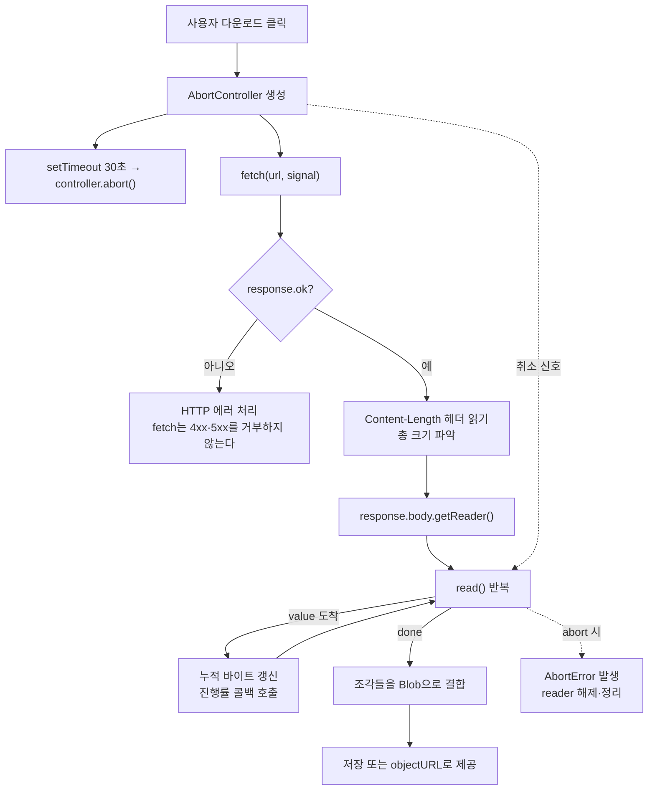
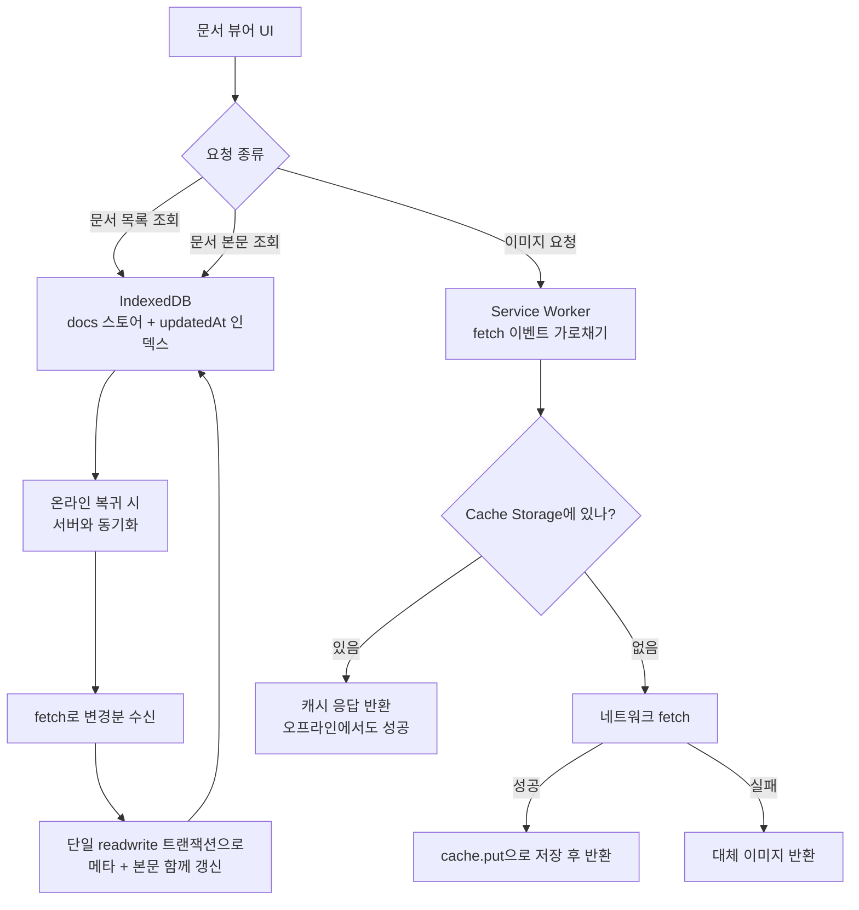
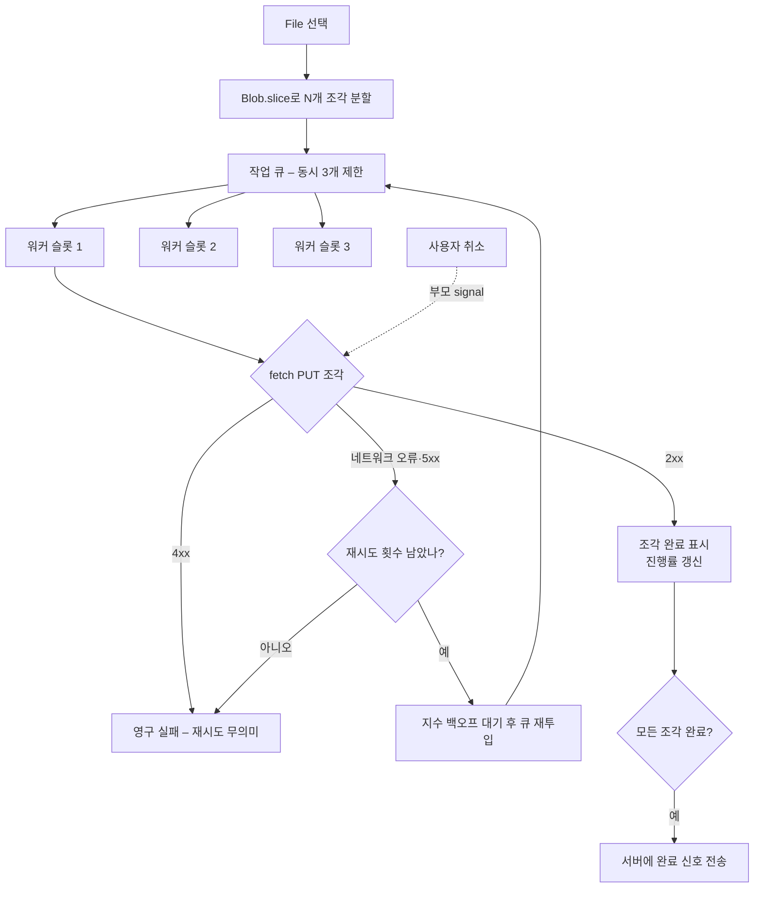

<Callout type="info">
  **이번 문서의 목표:** 이 파일을 다 읽으면 대용량 다운로드·오프라인 동기화 같은 실제 요구사항을 받았을 때 어떤 네트워크·저장소 API를 어떤 순서로 조합할지 스스로 설계하고, 그 설계가 무너지는 지점을 미리 짚어낼 수 있다.
</Callout>

<Callout type="warning">
  **문제 출처 안내:** 이 편의 문제들은 특정 시험의 기출 문제를 복제한 것이 아니라, 10편부터 16편까지의 학습 범위를 바탕으로 **재구성한 문제**입니다. 실무에서 마주치는 상황을 압축한 시나리오이므로 정답 하나를 외우기보다 **판단 근거를 말로 설명할 수 있는지**를 기준으로 삼으세요.
</Callout>

## 이 연습을 하는 이유

지금까지 API를 하나씩 배웠습니다. `fetch`가 무엇인지, `AbortController`가 어떻게 취소하는지, IndexedDB의 트랜잭션이 언제 끝나는지 각각은 알고 있습니다. 그런데 실무에서 받는 요구사항은 이렇게 생겼습니다.

> "사용자가 500MB짜리 자료를 받는 동안 진행률을 보여주고, 중간에 취소할 수 있어야 하고, 네트워크가 끊겼다 돌아오면 이어받게 해주세요. 아, 그리고 다음에 다시 열면 이미 받은 건 바로 보여야 합니다."

이 문장 어디에도 API 이름이 없습니다. **요구사항을 API의 조합으로 번역하는 것**이 이 편의 목표입니다.

> **쉽게 말하면:** 지금까지가 악기를 하나씩 배우는 단계였다면, 이 편은 합주다. 각 악기를 아는 것과 곡을 편성하는 것은 다른 능력이다.

### 설계 문제를 푸는 네 단계

문제를 받으면 다음 순서로 접근하세요. 이 편의 모든 시나리오에 이 틀을 적용합니다.

<Steps>

### 요구사항을 제약으로 번역한다

"진행률 표시"는 응답 본문을 조각으로 읽어야 한다는 제약이고, "취소 가능"은 취소 신호가 네트워크 계층까지 전달돼야 한다는 제약이며, "다음에 열면 바로"는 지속 저장소가 필요하다는 제약입니다.

### 제약마다 후보 API를 올린다

같은 제약을 만족하는 API가 대개 두세 개입니다. 진행률이면 Streams 또는 `XMLHttpRequest`의 progress 이벤트, 저장이면 Cache Storage 또는 IndexedDB.

### 비용과 한계로 후보를 자른다

용량 제한, 브라우저 지원, 메인 스레드 부담, 코드 복잡도가 기준입니다. "할 수 있다"와 "해야 한다"는 다릅니다.

### 실패 지점을 미리 나열한다

네트워크 끊김, 용량 초과, 탭 종료, 동시 실행, 권한 거부. 설계가 완성되는 것은 실패 시나리오에 답을 달았을 때입니다.

</Steps>

## 시나리오 A — 취소 가능한 대용량 다운로드와 진행률

### 요구사항

수백 MB 크기의 데이터 파일을 내려받으면서 진행률을 실시간으로 표시하고, 사용자가 언제든 취소할 수 있어야 합니다. 메모리를 한 번에 다 쓰지 않아야 하고, 서버가 응답하지 않으면 30초 뒤 자동으로 포기해야 합니다.

### 설계 — 흐름 먼저 그리기

이 그림에서 눈여겨볼 지점이 세 개 있습니다.

첫째, **타임아웃과 사용자 취소가 같은 `AbortController`를 공유**합니다. 취소의 이유가 무엇이든 결과는 하나의 신호이고, 이유 구분은 `signal.reason`으로 합니다. 7편에서 다룬 모델 그대로입니다.

둘째, `fetch`는 서버가 404나 500을 돌려줘도 **거부하지 않습니다.** "요청과 응답이 오갔다"는 사실 자체는 성공이기 때문입니다. `response.ok`를 직접 확인하지 않으면 에러 페이지의 HTML을 데이터로 착각하는 사고가 납니다. 10편의 핵심 함정입니다.

셋째, `Content-Length` 헤더가 **항상 있는 것은 아닙니다.** 서버가 청크 전송 인코딩(chunked transfer encoding)을 쓰거나 응답을 압축하면 이 헤더가 없거나 압축 후 크기를 담습니다. 진행률 UI는 "총 크기를 모를 때"의 표시 방법을 반드시 준비해야 합니다.

### 스타터 코드 — 직접 돌려보기

아래 실습기는 실제로 공개 API에서 데이터를 스트리밍으로 받아 진행률을 콘솔에 찍습니다. `취소지연ms` 값을 아주 작게(예: 10) 바꿔 취소 경로를 관찰하고, 크게 바꿔 정상 완료 경로를 관찰하세요.

<CodePlayground
  template="vanilla"
  activeFile="/index.js"
  showConsole
  label="스타터 코드 — fetch + Streams + AbortController 조합 다운로드"
  files={{
    '/index.js': `// ===== 조절해 볼 값들 =====
const 대상URL = "https://jsonplaceholder.typicode.com/photos"; // 수 MB 규모의 JSON
const 타임아웃ms = 30000;
const 취소지연ms = 99999; // 10으로 바꾸면 취소 경로를 볼 수 있다

async function 진행률다운로드(url, 옵션) {
  const 컨트롤러 = new AbortController();
  const 타이머 = setTimeout(function () {
    컨트롤러.abort(new DOMException("시간 초과", "TimeoutError"));
  }, 옵션.타임아웃);

  // 외부에서 취소할 수 있도록 컨트롤러를 넘겨준다
  옵션.취소기등록(컨트롤러);

  try {
    const 응답 = await fetch(url, { signal: 컨트롤러.signal });

    // 함정 1: fetch는 4xx·5xx를 거부하지 않는다
    if (!응답.ok) {
      throw new Error("HTTP " + 응답.status + " " + 응답.statusText);
    }

    // 함정 2: Content-Length가 없을 수 있다
    const 길이헤더 = 응답.headers.get("Content-Length");
    const 총바이트 = 길이헤더 ? Number(길이헤더) : null;
    console.log("총 크기:", 총바이트 === null ? "알 수 없음 (무한 진행바 필요)" : 총바이트 + " 바이트");

    const 리더 = 응답.body.getReader();
    const 조각들 = [];
    let 받은바이트 = 0;
    let 보고횟수 = 0;

    while (true) {
      const { done, value } = await 리더.read();
      if (done) break;

      조각들.push(value);
      받은바이트 = 받은바이트 + value.byteLength;

      // 진행률 보고 — 너무 자주 찍으면 콘솔이 넘치므로 간격을 둔다
      보고횟수 = 보고횟수 + 1;
      if (보고횟수 % 5 === 0) {
        if (총바이트) {
          const 퍼센트 = ((받은바이트 / 총바이트) * 100).toFixed(1);
          console.log("진행률", 퍼센트 + "%", "(" + 받은바이트 + " 바이트)");
        } else {
          console.log("받은 바이트:", 받은바이트);
        }
      }
    }

    const 결과 = new Blob(조각들);
    console.log("완료. 최종 크기:", 결과.size, "바이트");
    return 결과;
  } catch (에러) {
    // 함정 3: 취소도 예외로 도착한다 — 이유를 구분해야 한다
    if (에러.name === "AbortError" || 에러.name === "TimeoutError") {
      console.log("중단됨. 사유:", 컨트롤러.signal.reason?.message || 에러.name);
    } else {
      console.log("실패:", 에러.name, 에러.message);
    }
    return null;
  } finally {
    // 함정 4: 성공하든 실패하든 타이머는 반드시 해제한다
    clearTimeout(타이머);
    console.log("정리 완료 — 타이머 해제됨");
  }
}

// 실행
let 외부컨트롤러 = null;
진행률다운로드(대상URL, {
  타임아웃: 타임아웃ms,
  취소기등록: function (c) { 외부컨트롤러 = c; }
});

setTimeout(function () {
  if (외부컨트롤러) {
    console.log("--- 사용자 취소 버튼을 누른 셈 ---");
    외부컨트롤러.abort(new DOMException("사용자가 취소함", "AbortError"));
  }
}, 취소지연ms);`,
  }}
/>

### 스스로 답해 볼 질문

이 스타터 코드를 확장한다고 생각하고 다음을 설계해 보세요.

1. **이어받기**를 추가하려면 어떤 HTTP 헤더가 필요하고, 서버가 그것을 지원하는지 어떻게 확인합니까? (힌트: `Range` 요청과 `Accept-Ranges` 응답 헤더, 그리고 206 상태 코드)
2. 받은 조각들을 **메모리에 다 쌓지 않고** 저장하려면 어디에 넣어야 합니까? Blob 배열을 계속 들고 있는 현재 구조의 메모리 한계는 무엇입니까?
3. 취소된 다운로드의 **부분 데이터를 버려야 할까요, 남겨야 할까요?** 남긴다면 무결성을 어떻게 보장합니까?

### 흔한 설계 실수

<Callout type="warning">
  **자주 틀리는 점:** 진행률을 위해 `response.clone()`을 쓰고 원본과 복제본을 모두 소비하려는 설계가 자주 나옵니다. 문제는 `clone()`이 **두 소비자의 읽기 속도 차이만큼 메모리에 버퍼를 쌓는다**는 점입니다. 느린 쪽이 뒤처지면 응답 전체가 메모리에 고이므로, 대용량에서는 정확히 피하려던 문제를 다시 만듭니다. 본문을 한 번만 읽고 필요한 처리를 그 루프 안에서 하는 것이 정석입니다. 본문 소비 규칙은 11편에서 다뤘습니다.
</Callout>

## 시나리오 B — 오프라인에서도 열리는 문서 뷰어

### 요구사항

문서 목록과 본문을 보여주는 앱입니다. 한 번 본 문서는 오프라인에서도 열려야 하고, 문서에 딸린 이미지도 함께 보여야 합니다. 목록은 제목·수정일로 정렬·검색할 수 있어야 하고, 저장 용량이 부족해지면 오래된 것부터 정리해야 합니다.

### 설계 — 저장소를 나누는 기준

여기서 핵심 판단은 **무엇을 어디에 저장할 것인가**입니다. 13편에서 14편, 15편에서 16편까지 배운 저장소들의 성격을 요구사항에 대응시켜 봅시다.

| 저장할 것 | 후보 | 선택 | 이유 |
|-----------|------|------|------|
| 문서 메타데이터 – 제목, 수정일, 태그 | localStorage, IndexedDB | IndexedDB | 정렬·검색에 인덱스가 필요하고, 동기 API인 localStorage는 목록이 커지면 메인 스레드를 막는다 |
| 문서 본문 – 구조화된 JSON | IndexedDB | IndexedDB | 메타데이터와 같은 트랜잭션으로 묶어 일관성을 지킬 수 있다 |
| 이미지 – HTTP 응답 그대로 | Cache Storage, IndexedDB Blob | Cache Storage | Request와 Response 쌍으로 저장되어 fetch 가로채기와 그대로 맞물린다 |
| 마지막으로 본 문서 ID | localStorage, IndexedDB | localStorage | 아주 작고 동기 접근이 편하며 손실돼도 치명적이지 않다 |
| 로그인 세션 | Cookie, localStorage | Cookie – HttpOnly | 자바스크립트가 읽을 수 없어야 XSS로 탈취되지 않는다 |

> **쉽게 말하면:** Cache Storage는 "네트워크 응답을 통째로 보관하는 창고"이고 IndexedDB는 "검색 가능한 서랍장"이다. 이미지처럼 통째로 다시 내보낼 것은 창고에, 조건으로 찾아야 할 것은 서랍장에 넣는다.

### 조합 구조

### 스스로 답해 볼 질문

1. 문서 목록을 `updatedAt` 내림차순으로 최신 20건만 가져오려면 IndexedDB에서 어떤 구조가 필요합니까? 스토어 전체를 `getAll()`로 읽어 자바스크립트에서 정렬하는 방식의 문제는 무엇입니까?
2. 동기화 중 탭이 닫히면 어떻게 됩니까? 메타데이터는 갱신됐는데 본문은 안 된 상태를 막으려면 트랜잭션 범위를 어떻게 잡아야 합니까?
3. 저장 용량이 한계에 도달하면 브라우저는 어떤 에러를 던집니까? 그 에러를 잡았을 때 무엇부터 지우는 것이 합리적입니까?
4. 캐시 키를 URL 그대로 쓰면 생기는 문제는 무엇입니까? 같은 URL이지만 인증 헤더가 다른 요청은 어떻게 구분합니까?

### 실패 지점 진단표

설계를 검증할 때 다음 항목을 하나씩 짚어보세요. 이것이 이 편에서 얻어갈 가장 실용적인 도구입니다.

| 실패 상황 | 증상 | 진단 포인트 |
|-----------|------|-------------|
| 네트워크 없음 | 목록은 뜨는데 이미지만 깨짐 | 이미지가 캐시에 없었거나 Service Worker가 아직 활성화되지 않음 |
| 용량 초과 | 저장 중 QuotaExceededError | 정리 정책 부재 – 오래된 캐시 항목 삭제 로직 필요 |
| 트랜잭션 자동 종료 | 쓰기 도중 TransactionInactiveError | 트랜잭션 안에서 `await fetch` 같은 다른 마이크로태스크를 기다림 |
| 두 탭 동시 편집 | 나중에 저장한 쪽이 앞의 변경을 덮어씀 | 버전 필드 기반의 낙관적 잠금 부재 |
| 스키마 변경 | 배포 후 일부 사용자만 에러 | `onupgradeneeded`에서 이전 버전 경로를 처리하지 않음 |
| 캐시가 갱신 안 됨 | 서버는 바뀌었는데 옛날 화면 | 캐시 우선 전략에 무효화·재검증 경로가 없음 |

<Callout type="warning">
  **자주 틀리는 점:** IndexedDB 트랜잭션은 "할 일이 없으면 자동으로 끝난다"는 규칙을 가집니다. 그래서 트랜잭션 안에서 `await fetch(...)`처럼 IndexedDB와 무관한 비동기 작업을 기다리면, 그 사이에 트랜잭션이 커밋되어 버리고 이어지는 요청이 `TransactionInactiveError`로 실패합니다. 올바른 순서는 **네트워크 작업을 먼저 완료하고, 그 결과를 들고 트랜잭션을 시작하는 것**입니다. 15편의 트랜잭션 수명 모델을 다시 확인하세요.
</Callout>

## 시나리오 C — 조각 업로드와 재시도

### 요구사항

사용자가 고른 큰 파일을 서버에 올립니다. 네트워크가 불안정한 환경이라 실패한 조각만 다시 보내야 하고, 전체 진행률과 조각별 상태를 보여줘야 하며, 사용자가 중간에 취소하면 진행 중인 요청도 즉시 끊겨야 합니다.

### 설계 골격

파일을 `Blob.slice(시작, 끝)`으로 나눈 뒤 조각마다 별도의 `fetch`를 보냅니다. 여기서 설계 판단이 여러 개 필요합니다.

- **동시 실행 개수.** 전부 병렬로 보내면 브라우저의 오리진당 연결 한도에 걸려 대기열이 생기고, 하나가 실패하면 진단이 어렵습니다. 3에서 5개 정도의 동시성 제한을 두고 큐로 관리하는 것이 일반적입니다.
- **재시도 정책.** 즉시 재시도는 혼잡한 네트워크를 더 밀어붙입니다. 지수 백오프(exponential backoff) — 1초, 2초, 4초처럼 간격을 늘리며 재시도 — 에 무작위 지터(jitter)를 더해 여러 클라이언트가 동시에 몰리는 것을 막습니다.
- **어떤 실패를 재시도할 것인가.** 네트워크 오류와 5xx는 재시도 대상이지만, 400이나 413처럼 **요청 자체가 잘못된 경우는 몇 번을 보내도 같은 결과**입니다. 재시도 가능 여부를 상태 코드로 분류해야 합니다.
- **취소 전파.** 부모 컨트롤러 하나를 만들고, 조각마다 만든 신호를 `AbortSignal.any([부모신호, 조각타임아웃신호])`로 결합하면 "전체 취소"와 "조각별 타임아웃"을 동시에 표현할 수 있습니다.

### 스스로 답해 볼 질문

1. 업로드 진행률을 `fetch`로 정확히 측정하기 어려운 이유는 무엇입니까? 조각 단위 설계가 이 문제를 어떻게 우회합니까?
2. 조각 크기를 1MB로 할 때와 16MB로 할 때의 장단점은 각각 무엇입니까?
3. 사용자가 탭을 닫았다가 다시 열었을 때 이어서 올리려면 무엇을 어디에 저장해 두어야 합니까? `File` 객체 자체를 IndexedDB에 저장할 수 있습니까?
4. 서버가 같은 조각을 두 번 받았을 때 안전하려면 요청이 어떤 성질을 가져야 합니까?

## 종합 체크리스트

네트워크·저장소 설계를 끝냈다고 생각될 때 아래를 점검하세요.

- [ ] `response.ok`를 확인했는가, 아니면 에러 응답을 데이터로 처리하고 있는가
- [ ] 취소 신호가 네트워크·타이머·이벤트 리스너 **전부**에 연결되어 있는가
- [ ] 본문을 두 번 읽는 코드가 있는가 – `bodyUsed` 규칙 위반
- [ ] 대용량 데이터를 배열에 전부 쌓고 있지는 않은가
- [ ] IndexedDB 트랜잭션 안에서 다른 비동기 작업을 기다리지 않는가
- [ ] `QuotaExceededError`를 처리하고 정리 정책이 있는가
- [ ] 스키마 버전 업그레이드 경로가 모든 이전 버전에서 동작하는가
- [ ] 두 탭에서 동시에 실행돼도 데이터가 깨지지 않는가
- [ ] 민감한 값을 자바스크립트가 읽을 수 있는 저장소에 두지 않았는가

## 핵심 정리

- 설계 문제는 요구사항을 제약으로 번역하고, 후보 API를 올리고, 비용으로 자르고, 실패 지점을 나열하는 네 단계로 접근한다.
- 대용량 다운로드는 Streams로 조각을 읽으며 진행률을 계산하고, 타임아웃과 사용자 취소를 하나의 `AbortController`로 통합한다. `Content-Length` 부재와 `response.ok` 확인 누락이 대표적 함정이다.
- 저장소 선택의 기준은 "검색이 필요한가"와 "응답 그대로 재사용하는가"다. 전자는 IndexedDB, 후자는 Cache Storage가 자연스럽다.
- IndexedDB 트랜잭션은 유휴 상태가 되면 자동 커밋되므로, 네트워크 대기를 트랜잭션 밖으로 빼는 것이 필수 규칙이다.
- 조각 업로드는 동시성 제한, 재시도 가능 여부 분류, 지수 백오프, 취소 신호 결합이라는 네 가지 판단으로 완성된다.

## 마무리 복습

<Quiz
  questionNumber={1}
  question="fetch로 받은 응답의 상태 코드가 500일 때 일어나는 일은?"
  options={['Promise가 거부되어 catch 블록으로 간다', 'Promise는 정상 이행되며 response.ok가 false다', '자동으로 3회 재시도한 뒤 거부된다', 'response.body가 null이 된다']}
  correctAnswer={2}
  explanation="fetch는 요청과 응답의 왕복이 성공하면 이행한다. HTTP 에러 상태는 거부 사유가 아니므로 response.ok나 status를 직접 확인해야 한다. 거부되는 경우는 네트워크 장애, CORS 차단, 취소 등이다."
  optionExplanations={['네트워크 장애나 취소일 때만 거부된다', '정답 — ok가 false이며 본문에는 에러 페이지가 담겨 있을 수 있다', 'fetch에는 자동 재시도 기능이 없다', '에러 응답에도 본문 스트림은 존재한다']}
/>

<Quiz
  questionNumber={2}
  question="다운로드 진행률을 계산하기 위해 Content-Length 헤더에만 의존하면 안 되는 이유로 가장 알맞은 것은?"
  options={['헤더 이름의 대소문자가 브라우저마다 달라서', '청크 전송이나 압축 상황에서는 헤더가 없거나 압축 후 크기를 담을 수 있어서', 'Headers 객체는 읽기 전용이라 접근할 수 없어서', 'CORS 환경에서는 모든 헤더가 차단되어서']}
  correctAnswer={2}
  explanation="서버가 청크 전송 인코딩을 사용하면 총 길이를 미리 알리지 않으며, 압축된 응답에서는 헤더 값과 디코딩 후 바이트 수가 다를 수 있다. 총 크기를 모를 때의 UI를 준비해야 한다."
  optionExplanations={['Headers는 대소문자를 구분하지 않고 조회한다', '정답 — 총 크기를 알 수 없는 경우를 항상 상정해야 한다', 'Headers는 읽을 수 있다', 'CORS는 노출 헤더를 제한하지만 모든 헤더가 사라지는 것은 아니다']}
/>

<Quiz
  questionNumber={3}
  question="타임아웃과 사용자 취소를 하나의 AbortController로 처리할 때, 두 사유를 구분하는 가장 적절한 방법은?"
  options={['try 블록을 두 개로 나눈다', 'abort에 이유 객체를 전달하고 signal.reason으로 확인한다', '전역 변수에 마지막 취소 사유를 기록한다', '타임아웃 전용 컨트롤러를 별도로 만든다']}
  correctAnswer={2}
  explanation="abort는 인자로 사유를 받으며 그 값이 signal.reason에 담긴다. 하나의 신호로 취소를 통합하면서도 사유를 구분할 수 있어, 사용자 취소와 시간 초과에 다른 UI를 보여줄 수 있다."
  optionExplanations={['try 구조로는 사유를 구분할 수 없다', '정답 — reason이 사유 전달의 표준 경로다', '전역 변수는 동시 요청이 여러 개일 때 어긋난다', '별도 컨트롤러도 가능하지만 두 신호를 결합해야 해서 구조가 복잡해진다']}
/>

<Quiz
  questionNumber={4}
  question="대용량 응답에서 response.clone()으로 본문을 두 번 소비하는 설계의 문제점은?"
  options={['clone은 헤더만 복제하고 본문은 복제하지 않는다', '두 소비자의 읽기 속도 차이만큼 데이터가 메모리에 버퍼링된다', 'clone된 응답은 status가 항상 0이 된다', 'clone은 안전한 컨텍스트에서만 동작한다']}
  correctAnswer={2}
  explanation="clone은 본문 스트림을 두 갈래로 나누는데, 느린 쪽이 뒤처지면 그 차이만큼 브라우저가 데이터를 메모리에 붙잡아 둔다. 대용량에서는 메모리 절약이라는 목적을 스스로 깨뜨린다."
  optionExplanations={['본문 스트림도 함께 갈라진다', '정답 — 속도 차이가 곧 메모리 사용량이다', 'status는 그대로 유지된다', '안전한 컨텍스트와 무관하다']}
/>

<Quiz
  questionNumber={5}
  question="이미 소비한 Response의 본문을 다시 읽으려 하면 어떻게 되는가?"
  options={['빈 문자열이 반환된다', 'bodyUsed가 true이므로 TypeError가 발생한다', '자동으로 다시 요청이 전송된다', '캐시된 값이 반환된다']}
  correctAnswer={2}
  explanation="Response 본문은 일회용 스트림이다. text나 json 등으로 한 번 소비하면 bodyUsed가 true가 되고, 다시 읽으면 TypeError가 난다. 두 번 필요하면 소비 전에 clone하거나 결과 값을 변수에 담아 재사용한다."
  optionExplanations={['빈 값이 아니라 예외가 발생한다', '정답 — 본문 일회 소비 규칙이다', '재요청은 일어나지 않는다', '본문은 자동 캐시되지 않는다']}
/>

<Quiz
  questionNumber={6}
  question="문서 목록을 제목과 수정일로 정렬·검색해야 할 때 localStorage보다 IndexedDB가 적합한 가장 큰 이유는?"
  options={['localStorage는 오리진마다 격리되지 않아서', 'localStorage는 동기 API라 데이터가 커지면 메인 스레드를 막고 인덱스 기반 조회를 지원하지 않아서', 'localStorage는 안전한 컨텍스트에서만 동작해서', 'localStorage는 Blob을 저장할 수 있어서']}
  correctAnswer={2}
  explanation="localStorage는 문자열 전용에 동기 접근이라 항목이 많아지면 읽기·쓰기 자체가 메인 스레드를 정지시킨다. 또한 정렬·범위 조회를 위한 인덱스가 없어 전체를 읽어 자바스크립트로 처리해야 한다."
  optionExplanations={['localStorage도 오리진 단위로 격리된다', '정답 — 동기성과 인덱스 부재가 결정적 차이다', '안전한 컨텍스트 요구는 반대로 진술되었다', 'localStorage는 문자열만 저장하며 Blob을 직접 담지 못한다']}
/>

<Quiz
  questionNumber={7}
  question="IndexedDB 트랜잭션 안에서 await fetch를 기다린 뒤 다시 스토어에 접근하면 흔히 발생하는 에러는?"
  options={['QuotaExceededError', 'TransactionInactiveError', 'ConstraintError', 'AbortError']}
  correctAnswer={2}
  explanation="트랜잭션은 처리할 요청이 없어 유휴 상태가 되면 자동으로 커밋된다. 네트워크 응답을 기다리는 동안 커밋이 완료되므로 이후 접근은 비활성 트랜잭션 에러가 된다. 네트워크 작업은 트랜잭션 밖에서 끝내야 한다."
  optionExplanations={['용량 초과는 저장 공간이 부족할 때다', '정답 — 자동 커밋이 트랜잭션 수명 규칙의 핵심이다', '고유 인덱스 위반 시 나는 에러다', '명시적 중단이나 취소 신호일 때 나온다']}
/>

<Quiz
  questionNumber={8}
  question="이미지 같은 HTTP 응답을 오프라인용으로 보관할 때 Cache Storage가 IndexedDB보다 자연스러운 이유는?"
  options={['Cache Storage가 용량 제한이 없기 때문', 'Request와 Response 쌍으로 저장되어 Service Worker의 fetch 가로채기에 그대로 응답할 수 있기 때문', 'Cache Storage는 동기 API이기 때문', 'Cache Storage는 자동으로 만료되기 때문']}
  correctAnswer={2}
  explanation="Cache Storage는 요청과 응답을 한 쌍으로 저장하므로, fetch 이벤트에서 match한 결과를 그대로 반환하면 된다. 헤더와 상태 코드가 보존되어 재구성 작업이 필요 없다."
  optionExplanations={['두 저장소 모두 같은 오리진 할당량을 공유한다', '정답 — 응답을 통째로 재사용하는 용도에 맞춰 설계되었다', '모든 Cache Storage 연산은 Promise 기반 비동기다', '자동 만료 기능은 없으며 삭제 정책은 개발자 책임이다']}
/>

<Quiz
  questionNumber={9}
  question="저장 용량 초과 시 브라우저가 던지는 에러와 올바른 대응으로 짝지어진 것은?"
  options={['SecurityError – 권한을 다시 요청한다', 'QuotaExceededError – 오래된 캐시나 데이터를 정리한 뒤 재시도한다', 'NetworkError – 재연결을 기다린다', 'TypeError – 데이터 형식을 바꾼다']}
  correctAnswer={2}
  explanation="할당량을 넘기면 QuotaExceededError가 발생한다. 대응은 오래된 항목 삭제 같은 정리 정책 실행이며, 남은 용량은 StorageManager의 estimate로 미리 확인할 수 있다."
  optionExplanations={['보안 에러는 권한·컨텍스트 문제일 때 발생한다', '정답 — 정리 정책이 없는 설계는 미완성이다', '네트워크와 무관한 저장소 문제다', '형식 문제가 아니다']}
/>

<Quiz
  questionNumber={10}
  question="업로드를 조각으로 나눌 때 동시 요청 수를 3에서 5개 정도로 제한하는 주된 이유는?"
  options={['브라우저의 오리진당 동시 연결 한도에 걸려 오히려 대기열이 생기고 실패 진단이 어려워지기 때문', '자바스크립트가 5개 이상의 Promise를 처리하지 못하기 때문', 'AbortController가 5개까지만 신호를 관리할 수 있기 때문', 'Blob.slice가 5회까지만 호출 가능하기 때문']}
  correctAnswer={1}
  explanation="브라우저는 오리진당 동시 연결 수를 제한하므로 무한정 병렬화해도 실제 처리량은 늘지 않고 대기만 길어진다. 적당한 동시성 제한이 진행률 관리와 오류 처리도 단순하게 만든다."
  optionExplanations={['정답 — 연결 한도와 관리 복잡도가 이유다', 'Promise 개수 제한은 없다', 'AbortController에 개수 제한은 없다', 'slice 호출 횟수 제한은 없다']}
/>

<Quiz
  questionNumber={11}
  question="재시도 전략에서 지수 백오프에 무작위 지터를 더하는 이유는?"
  options={['서버 응답을 더 빨리 받기 위해', '동시에 실패한 여러 클라이언트가 같은 순간에 몰려 재요청하는 것을 분산시키기 위해', '요청 순서를 보장하기 위해', '타임아웃을 무력화하기 위해']}
  correctAnswer={2}
  explanation="장애 복구 순간에 모든 클라이언트가 정확히 같은 간격으로 재시도하면 서버가 다시 무너진다. 지터로 재시도 시각을 흩뜨려 몰림 현상을 완화한다."
  optionExplanations={['오히려 대기 시간이 늘어난다', '정답 — 동시 재시도 몰림을 방지하는 표준 기법이다', '순서 보장과는 무관하다', '타임아웃 정책과 별개 문제다']}
/>

<Quiz
  questionNumber={12}
  question="재시도해도 의미가 없는 실패로 가장 알맞은 것은?"
  options={['네트워크 연결이 끊긴 경우', '서버가 503을 반환한 경우', '요청 형식이 잘못되어 400을 반환한 경우', '요청이 타임아웃된 경우']}
  correctAnswer={3}
  explanation="4xx는 요청 자체의 문제이므로 같은 요청을 다시 보내도 결과가 같다. 반면 네트워크 오류, 타임아웃, 5xx는 일시적 상황일 수 있어 재시도 대상이다."
  optionExplanations={['연결 복구 후 성공할 수 있다', '서버 일시 과부하이므로 재시도 대상이다', '정답 — 요청을 고치기 전에는 결과가 바뀌지 않는다', '일시적 지연일 수 있어 재시도 대상이다']}
/>

<Quiz
  questionNumber={13}
  question="같은 업로드 조각이 서버에 두 번 도착해도 안전하려면 요청이 가져야 할 성질은?"
  options={['멱등성 – 같은 요청을 여러 번 해도 결과 상태가 동일함', '원자성 – 전부 성공하거나 전부 실패함', '지속성 – 저장된 데이터가 사라지지 않음', '동기성 – 순서대로 처리됨']}
  correctAnswer={1}
  explanation="재시도 가능한 설계의 전제가 멱등성이다. 조각 번호를 키로 삼아 덮어쓰는 PUT 형태로 만들면 중복 도착이 문제가 되지 않는다."
  optionExplanations={['정답 — 중복 전송 안전성의 핵심 개념이다', '원자성은 트랜잭션의 성질이며 중복 도착 문제를 직접 해결하지 않는다', '지속성은 저장 후의 보장이다', '순서 보장은 조각 업로드에서 필수가 아니다']}
/>

<Quiz
  questionNumber={14}
  question="두 탭에서 같은 문서를 편집해 나중에 저장한 쪽이 앞의 변경을 덮어쓰는 문제를 막는 방법으로 가장 적절한 것은?"
  options={['localStorage에 편집 중 여부를 기록한다', '레코드에 버전 필드를 두고 저장 시 읽은 버전과 일치할 때만 갱신하는 낙관적 잠금을 쓴다', '저장 요청을 setTimeout으로 지연시킨다', '트랜잭션 모드를 readonly로 바꾼다']}
  correctAnswer={2}
  explanation="버전 필드를 비교해 불일치 시 갱신을 거부하면 잃어버린 갱신 문제를 감지할 수 있다. 감지 후에는 사용자에게 병합을 요청하거나 다시 읽고 재시도한다."
  optionExplanations={['플래그는 탭이 비정상 종료되면 남아버리고 경쟁 조건도 남는다', '정답 — 낙관적 잠금이 표준 해법이다', '지연은 충돌 확률만 낮출 뿐 해결이 아니다', 'readonly로는 저장 자체가 불가능하다']}
/>

<Quiz
  questionNumber={15}
  question="IndexedDB 스키마를 바꿔 배포했는데 일부 사용자만 에러를 겪는다. 가장 유력한 원인은?"
  options={['onupgradeneeded에서 과거 버전에서 올라오는 경로를 처리하지 않았다', '데이터베이스 이름에 한글을 써서', 'IndexedDB가 안전한 컨텍스트를 요구해서', '스토어 개수가 너무 많아서']}
  correctAnswer={1}
  explanation="사용자마다 보유한 기존 버전이 다르므로, 업그레이드 핸들러는 oldVersion 값을 보고 누락된 단계들을 순차적으로 적용해야 한다. 최신 버전만 가정하면 옛 버전 사용자에게서만 에러가 난다."
  optionExplanations={['정답 — 버전별 마이그레이션 경로 누락이 전형적 원인이다', '이름에 한글을 써도 동작한다', 'IndexedDB는 일반 HTTP에서도 동작한다', '스토어 개수 제한 문제는 아니다']}
/>

<Quiz
  questionNumber={16}
  question="캐시 우선 전략만 사용한 페이지에서 서버 내용이 바뀌어도 화면이 갱신되지 않는다. 설계에 빠진 것은?"
  options={['CORS 설정', '무효화 또는 재검증 경로 – 예를 들어 백그라운드 갱신이나 버전 기반 캐시 키', 'Content-Type 헤더', 'AbortController']}
  correctAnswer={2}
  explanation="캐시 우선은 속도를 얻는 대신 신선도를 포기한다. 응답을 반환한 뒤 백그라운드로 네트워크 갱신을 수행하거나, 빌드 버전을 캐시 이름에 포함해 배포 시 교체하는 경로가 필요하다."
  optionExplanations={['CORS는 접근 허용 문제이며 신선도와 무관하다', '정답 — 캐시 전략은 무효화 정책과 짝을 이뤄야 한다', '헤더 문제와 무관하다', '취소 기능과 무관하다']}
/>

<Quiz
  questionNumber={17}
  question="Blob.slice로 파일을 나눌 때 조각 크기를 지나치게 작게 잡으면 생기는 문제는?"
  options={['각 조각의 HTTP 요청 오버헤드와 왕복 지연이 누적되어 전체 처리량이 떨어진다', '브라우저가 파일을 읽지 못한다', '조각의 순서가 뒤바뀐다', 'Blob 객체가 메모리에서 즉시 해제된다']}
  correctAnswer={1}
  explanation="조각이 작을수록 재시도 비용은 줄지만 요청 수가 늘어 헤더와 왕복 지연이 누적된다. 반대로 너무 크면 한 번 실패했을 때 다시 보내야 할 양이 커진다. 절충점을 찾는 것이 설계 판단이다."
  optionExplanations={['정답 — 요청 수와 재전송 비용의 절충 문제다', 'slice 자체는 문제없이 동작한다', '순서는 개발자가 관리하는 메타데이터로 유지한다', 'Blob 수명은 조각 크기와 무관하다']}
/>

<Quiz
  questionNumber={18}
  question="사용자가 고른 File 객체를 탭 종료 후에도 이어 올리기 위해 저장하려 한다. 가장 정확한 설명은?"
  options={['File은 구조화 복제가 가능해 IndexedDB에 저장할 수 있지만, 원본 파일이 이동·삭제되면 읽기 시점에 실패할 수 있다', 'File은 어떤 저장소에도 저장할 수 없다', 'localStorage에 JSON으로 직렬화해 저장하면 된다', 'File을 저장하면 파일 내용이 서버로 자동 전송된다']}
  correctAnswer={1}
  explanation="File과 Blob은 구조화 복제 알고리즘을 지원해 IndexedDB에 저장할 수 있다. 다만 File은 디스크의 파일을 가리키는 참조 성격이 있어, 이후 원본이 바뀌거나 사라지면 읽을 때 에러가 날 수 있다."
  optionExplanations={['정답 — 저장은 되지만 원본 의존성이 남는다', 'IndexedDB에는 저장 가능하다', 'localStorage는 문자열만 담으며 파일 내용을 직렬화하기에 부적절하다', '저장과 전송은 별개 동작이다']}
/>

<Quiz
  questionNumber={19}
  question="설계 검토 체크리스트에서 로그인 세션 값을 localStorage 대신 HttpOnly 쿠키에 두는 이유는?"
  options={['localStorage가 용량이 작아서', '자바스크립트가 읽을 수 없어야 XSS로 값이 탈취되지 않기 때문', '쿠키가 더 빠르게 읽히기 때문', '쿠키는 오리진 격리가 없기 때문']}
  correctAnswer={2}
  explanation="HttpOnly 쿠키는 문서 스크립트에서 접근할 수 없어, 페이지에 악성 스크립트가 주입되더라도 값 자체를 읽어갈 수 없다. localStorage 값은 같은 페이지의 어떤 스크립트든 읽을 수 있다."
  optionExplanations={['용량은 오히려 localStorage가 크다', '정답 — 접근 불가 자체가 방어 수단이다', '속도 이점 때문이 아니다', '쿠키에도 도메인·경로 범위가 있다']}
/>

<Quiz
  questionNumber={20}
  question="네트워크·저장소 설계 문제를 접근하는 순서로 이 편이 제시한 틀은?"
  options={['코드 작성 후 리팩터링, 테스트, 배포', '요구사항을 제약으로 번역, 후보 API 나열, 비용과 한계로 선별, 실패 지점 열거', '라이브러리 선택, 설치, 설정, 실행', '성능 측정, 병목 발견, 캐시 적용, 재측정']}
  correctAnswer={2}
  explanation="설계는 요구사항을 기술적 제약으로 바꾸는 데서 시작한다. 제약마다 후보를 올리고 비용으로 자른 뒤, 실패 시나리오에 답을 달았을 때 비로소 설계가 완성된다."
  optionExplanations={['구현 절차이지 설계 절차가 아니다', '정답 — 이 편의 모든 시나리오에 적용한 틀이다', '도구 도입 절차일 뿐이다', '성능 개선 절차이며 설계 전반을 다루지 않는다']}
/>

## 참고 자료

- [Fetch Standard](https://fetch.spec.whatwg.org/)
- [MDN - Fetch API](https://developer.mozilla.org/en-US/docs/Web/API/Fetch_API)
- [MDN - Streams API](https://developer.mozilla.org/en-US/docs/Web/API/Streams_API)
- [MDN - IndexedDB API](https://developer.mozilla.org/en-US/docs/Web/API/IndexedDB_API)
- [MDN - Cache (CacheStorage)](https://developer.mozilla.org/en-US/docs/Web/API/Cache)
- [MDN - HTTP](https://developer.mozilla.org/en-US/docs/Web/HTTP)
