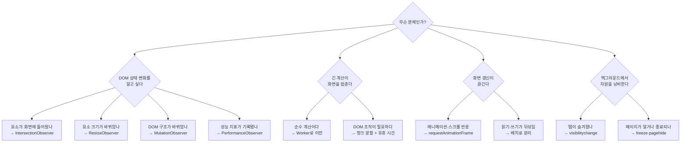
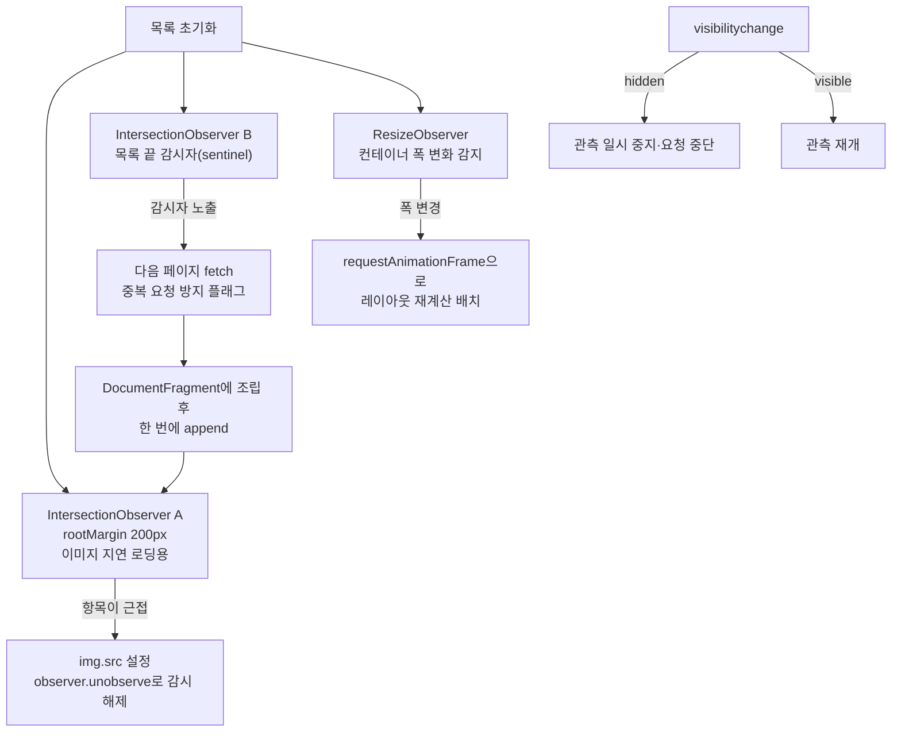
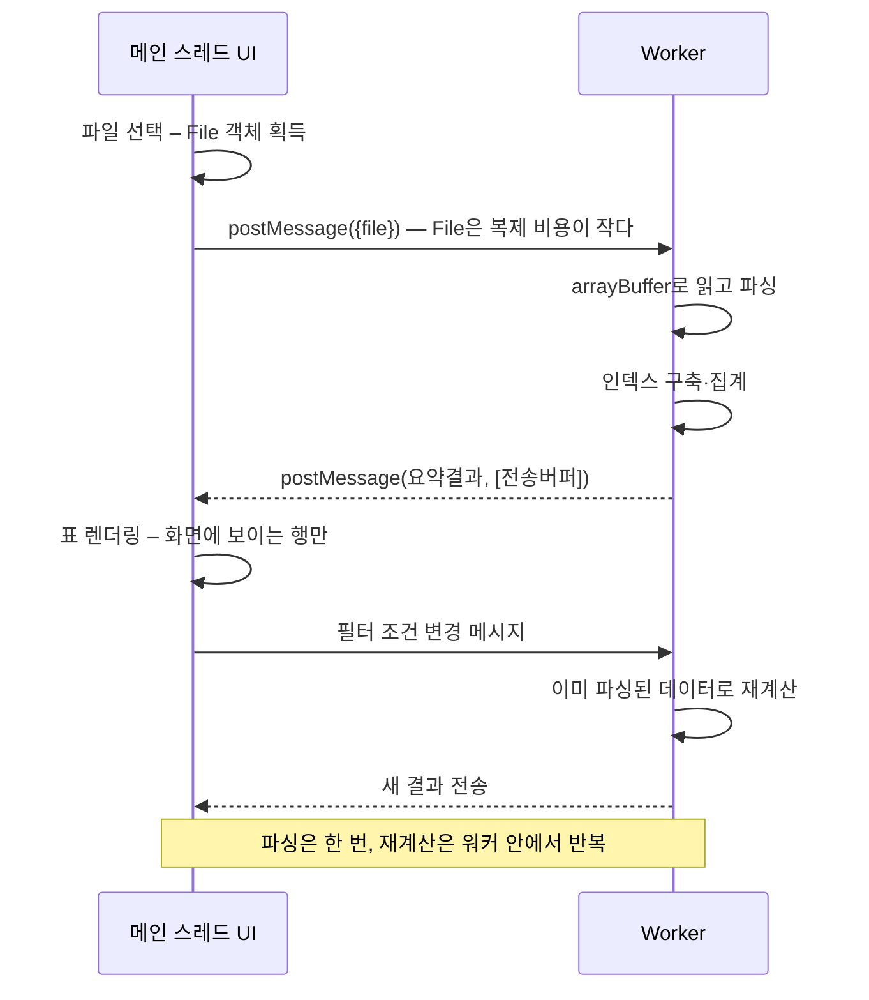
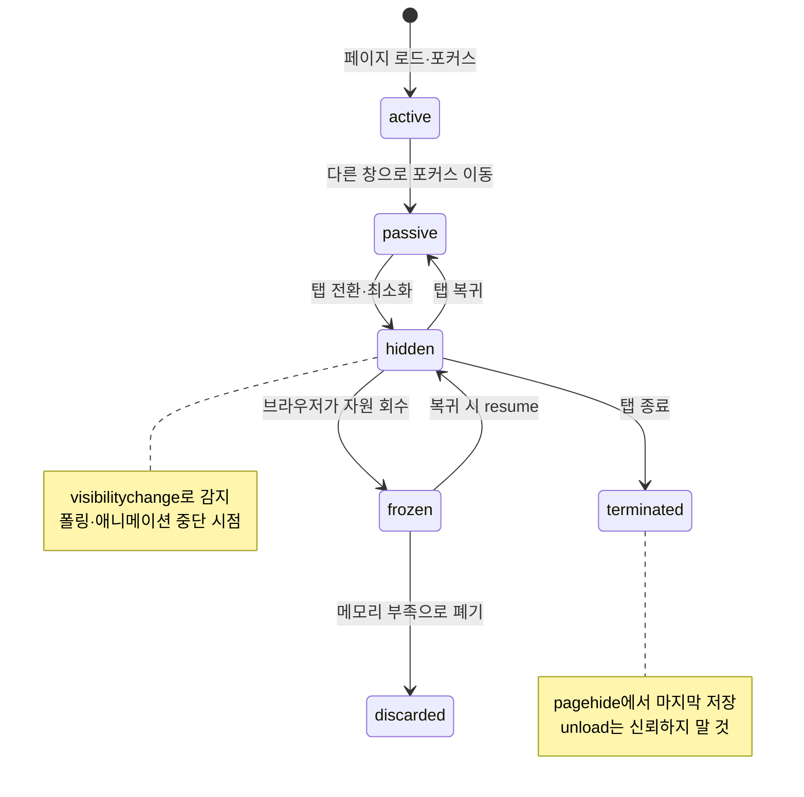

<Callout type="info">
  **이번 문서의 목표:** 이 파일을 다 읽으면 무한 스크롤·실시간 대시보드·백그라운드 처리 같은 요구사항을 관측자·프레임 동기화·워커·생명주기 API의 조합으로 설계하고, 프레임 드롭과 레이아웃 스래싱의 원인을 코드에서 짚어낼 수 있다.
</Callout>

<Callout type="warning">
  **문제 출처 안내:** 이 편의 문제들은 특정 시험의 기출 문제를 복제한 것이 아니라, 17편부터 23편까지의 학습 범위를 바탕으로 **재구성한 문제**입니다. 정답 번호를 외우는 대신, 왜 그 API를 골랐고 무엇을 포기했는지 스스로 설명해 보세요.
</Callout>

## 이 연습의 관점 — 메인 스레드는 예산이다

27편이 "데이터를 어디서 가져와 어디에 둘 것인가"의 문제였다면, 이번 편은 "**언제 실행할 것인가**"의 문제입니다.

브라우저의 메인 스레드(main thread)는 자바스크립트 실행, 스타일 계산, 레이아웃, 페인트를 전부 처리하는 단일 창구입니다. 초당 60프레임을 유지하려면 한 프레임에 쓸 수 있는 시간은 약 16.7밀리초입니다. 그중 브라우저 자체 작업을 빼면 자바스크립트에 허락된 시간은 실질적으로 10밀리초 안팎입니다.

$$
\text{프레임 예산} = \frac{1000\ \text{ms}}{60\ \text{프레임}} \approx 16.7\ \text{ms}
$$

- $1000$ : 1초를 밀리초(millisecond, 천분의 1초)로 표현한 값
- $60$ : 부드러운 애니메이션의 기준 프레임률(frames per second, 초당 프레임 수)
- 결과 $16.7$ : 한 프레임을 만드는 데 허용되는 전체 시간

> **쉽게 말하면:** 메인 스레드는 한 명이 지키는 계산대다. 손님 한 명이 16.7밀리초 안에 끝나야 줄이 밀리지 않는다. 오래 걸리는 손님은 다른 창구(워커)로 보내거나, 여러 번에 나눠 처리해야 한다.

설계의 목표는 하나로 요약됩니다 — **긴 작업을 계산대에서 치워라.** 그 수단이 관측자(Observer), 프레임 동기화(`requestAnimationFrame`), 유휴 시간(`requestIdleCallback`), 워커(Worker), 그리고 생명주기 이벤트입니다.

### 도구 선택 지도



## 시나리오 A — 이미지 무한 스크롤 목록

### 요구사항

수천 개의 항목을 스크롤로 계속 불러오는 목록입니다. 화면 근처에 온 이미지만 실제로 로드하고, 목록 끝에 도달하면 다음 페이지를 가져오며, 스크롤 중에도 프레임이 끊기지 않아야 합니다. 각 항목의 높이는 내용에 따라 달라집니다.

### 나쁜 설계부터 보기

많은 사람이 처음 떠올리는 구현은 이렇습니다.

```js
// 이렇게 하지 마세요 — 왜 나쁜지 아래에서 분해합니다
window.addEventListener("scroll", function () {
  const 항목들 = document.querySelectorAll(".항목");
  for (const 항목 of 항목들) {
    const 위치 = 항목.getBoundingClientRect(); // 강제 동기 레이아웃 발생
    if (위치.top < window.innerHeight) {
      항목.querySelector("img").src = 항목.dataset.src;
      항목.style.opacity = "1";                // 쓰기 — 다음 읽기를 무효화
    }
  }
});
```

이 코드에는 성능 문제가 세 겹으로 쌓여 있습니다.

**첫째, `scroll` 이벤트는 프레임보다 자주 발생할 수 있습니다.** 스크롤 한 번에 수십 번 호출되는데, 그때마다 전체 목록을 순회하니 항목이 1000개면 한 번의 스크롤에 수만 번의 계산이 일어납니다.

**둘째, 레이아웃 스래싱**(layout thrashing, 레이아웃 난타)입니다. `getBoundingClientRect()`는 정확한 값을 주기 위해 **대기 중인 스타일 변경을 즉시 반영한 레이아웃 계산을 강제**합니다. 그런데 바로 다음 줄에서 `style.opacity`로 쓰기를 하면, 다음 항목의 `getBoundingClientRect()`가 또 레이아웃을 강제합니다. 읽기와 쓰기를 번갈아 하는 만큼 레이아웃 계산이 반복되는 것입니다. 3편의 렌더링 파이프라인에서 배운 레이아웃 단계가 루프마다 다시 도는 셈입니다.

**셋째, 관심 없는 요소까지 전부 검사**합니다. 화면 밖 저 아래에 있는 900번째 항목도 매번 위치를 계산합니다.

<Callout type="warning">
  **자주 틀리는 점:** "레이아웃 스래싱은 DOM을 많이 조작해서 생긴다"는 오해가 흔합니다. 원인은 양이 아니라 **순서**입니다. 읽기 100번 뒤에 쓰기 100번을 하면 레이아웃은 한 번만 계산되지만, 읽기와 쓰기를 100번 번갈아 하면 100번 계산됩니다. 같은 작업량인데 비용이 100배 차이 납니다. 해법은 줄이는 것이 아니라 **묶는 것**입니다.
</Callout>

### 좋은 설계



핵심 전환은 **"내가 위치를 계산한다"에서 "브라우저가 알려준다"로** 바꾼 것입니다. `IntersectionObserver`는 요소의 교차 상태를 브라우저 내부에서 감시하다가 변화가 있을 때만 콜백을 부릅니다. 계산이 메인 스레드 밖에서 일어나므로 스크롤이 아무리 빨라도 자바스크립트 부하가 늘지 않습니다.

몇 가지 설계 디테일을 짚습니다.

- **`rootMargin`으로 미리 로딩.** 값을 `"200px"`로 주면 요소가 화면에 들어오기 200픽셀 전에 콜백이 옵니다. 사용자가 도달하기 전에 이미지 로딩을 시작할 수 있습니다.
- **로드된 항목은 `unobserve`.** 이미 처리한 요소를 계속 감시할 이유가 없습니다. 감시 대상이 줄어들수록 브라우저 부담도 줄고, 요소 참조가 해제되어 메모리도 회수됩니다.
- **감시자 요소**(sentinel, 센티넬)**를 목록 끝에 둔다.** 목록 마지막에 빈 `div` 하나를 두고 그것만 관측하면, "끝에 도달했는가"를 항목 개수와 무관하게 판정할 수 있습니다.
- **중복 요청 방지 플래그.** 감시자가 화면에 오래 머무르면 콜백이 여러 번 올 수 있습니다. 로딩 중 플래그가 없으면 같은 페이지를 여러 번 요청합니다.

### 스타터 코드 — 관측자와 스래싱을 직접 비교

<CodePlayground
  template="vanilla"
  activeFile="/index.js"
  showConsole
  label="스타터 코드 — IntersectionObserver 지연 로딩과 레이아웃 스래싱 비용 측정"
  files={{
    '/index.js': `const 앱 = document.getElementById("app") || document.body;
const 항목수 = 300;

// ===== 목록 만들기 — DocumentFragment로 한 번에 삽입 =====
const 조각 = document.createDocumentFragment();
for (let i = 0; i < 항목수; i = i + 1) {
  const 칸 = document.createElement("div");
  칸.className = "항목";
  칸.textContent = "항목 " + i;
  칸.style.height = "40px";
  칸.style.borderBottom = "1px solid #ddd";
  칸.style.opacity = "0.3";
  조각.appendChild(칸);
}
앱.appendChild(조각); // 리플로우 1회

const 항목들 = Array.from(document.querySelectorAll(".항목"));

// ===== 실험 1: 나쁜 방식 — 읽기와 쓰기를 번갈아 =====
function 스래싱버전() {
  const 시작 = performance.now();
  for (const 칸 of 항목들) {
    const 높이 = 칸.getBoundingClientRect().height; // 읽기 — 레이아웃 강제
    칸.style.paddingLeft = (높이 > 0 ? 8 : 0) + "px"; // 쓰기 — 레이아웃 무효화
  }
  return performance.now() - 시작;
}

// ===== 실험 2: 좋은 방식 — 읽기를 모두 끝낸 뒤 쓰기 =====
function 배치버전() {
  const 시작 = performance.now();
  const 높이들 = 항목들.map(function (칸) {
    return 칸.getBoundingClientRect().height; // 읽기만 연속
  });
  for (let i = 0; i < 항목들.length; i = i + 1) {
    항목들[i].style.paddingLeft = (높이들[i] > 0 ? 8 : 0) + "px"; // 쓰기만 연속
  }
  return performance.now() - 시작;
}

console.log("=== 레이아웃 읽기·쓰기 순서 비용 비교 ===");
console.log("번갈아 하기:", 스래싱버전().toFixed(2), "ms");
console.log("묶어서 하기:", 배치버전().toFixed(2), "ms");
console.log("항목 수를 늘릴수록 격차가 벌어집니다.");

// ===== 실험 3: IntersectionObserver로 화면 진입 관측 =====
const 관측자 = new IntersectionObserver(
  function (기록들) {
    for (const 기록 of 기록들) {
      if (기록.isIntersecting) {
        기록.target.style.opacity = "1";
        기록.target.textContent = 기록.target.textContent + " ✔ 진입";
        관측자.unobserve(기록.target); // 처리했으면 감시 해제
      }
    }
  },
  { rootMargin: "100px", threshold: 0.1 }
);

항목들.forEach(function (칸) { 관측자.observe(칸); });
console.log("스크롤하면 화면 근처 항목만 진입 처리됩니다. 감시 중:", 항목수, "개");

// ===== 실험 4: 탭이 숨겨지면 작업을 멈춘다 =====
document.addEventListener("visibilitychange", function () {
  console.log("visibilityState =", document.visibilityState,
    document.hidden ? "→ 폴링·애니메이션을 멈출 시점" : "→ 재개할 시점");
});`,
  }}
/>

콘솔의 두 숫자를 비교해 보세요. 같은 작업인데 순서만 바꿔도 몇 배 차이가 납니다. `항목수`를 1000으로 늘리면 격차가 더 뚜렷해집니다.

### 스스로 답해 볼 질문

1. `IntersectionObserver`의 콜백은 언제 호출됩니까? 스크롤 이벤트와 달리 "프레임당 최대 한 번"이 보장되는 이유는 무엇입니까?
2. 항목이 수만 개로 늘어나면 관측자만으로 충분합니까? 실제 DOM 노드 수 자체가 문제가 되는 지점은 어디이고, 그때 필요한 기법은 무엇입니까?
3. `ResizeObserver` 콜백 안에서 관측 대상의 크기를 바꾸면 무슨 일이 벌어집니까? 브라우저는 이 상황을 어떻게 처리합니까?

## 시나리오 B — 대용량 데이터 표와 워커

### 요구사항

10만 행의 CSV를 사용자가 올리면 파싱하고, 여러 조건으로 필터링·집계해서 표와 차트를 보여줍니다. 파싱 중에도 UI가 반응해야 하고, 필터를 바꿀 때마다 재계산이 즉시 반영돼야 합니다.

### 무엇을 워커로 보낼 것인가

워커(Worker)는 **DOM에 접근할 수 없는** 별도 스레드입니다. 이 제약이 곧 판단 기준입니다.

| 작업 | 워커 적합성 | 이유 |
|------|-------------|------|
| CSV 텍스트 파싱 | 매우 적합 | 순수 문자열·배열 연산이며 DOM이 필요 없다 |
| 정렬·필터·집계 | 매우 적합 | 계산 결과만 돌려주면 된다 |
| 표 DOM 렌더링 | 불가능 | 워커에는 document가 없다 |
| 차트 그리기 | 조건부 | OffscreenCanvas를 넘기면 워커에서 그릴 수 있다 |
| 파일 읽기 | 적합 | 워커에서도 FileReader와 Blob을 쓸 수 있다 |

> **쉽게 말하면:** 워커는 창문 없는 작업실이다. 재료를 넣어주면 결과물을 만들어 내보내지만, 밖의 화면을 직접 손대지는 못한다.

### 데이터 전달 비용이라는 함정

워커와 메인 스레드는 `postMessage`로 통신합니다. 여기서 두 가지 전달 방식의 차이를 반드시 알아야 합니다.

- **구조화 복제**(structured clone) — 기본 동작. 데이터를 **통째로 복사**합니다. 10만 행 배열을 넘기면 복사 비용이 그대로 발생하고, 그 복사가 메인 스레드에서 일어나므로 정지가 생깁니다.
- **이전 가능 객체**(transferable object) — `postMessage(데이터, [버퍼])` 형태로 소유권을 **이전**합니다. `ArrayBuffer` 같은 것을 넘기면 복사 없이 즉시 넘어가고, 보낸 쪽에서는 그 버퍼가 사용 불가(detached) 상태가 됩니다.

그래서 대용량 데이터는 객체 배열이 아니라 **바이너리 버퍼로 표현해 이전**하는 것이 이상적입니다. 파일을 읽을 때부터 `ArrayBuffer`로 받아 워커에 이전하면, 메인 스레드는 사실상 아무 일도 하지 않습니다.



이 설계에서 얻는 두 번째 이득이 있습니다. **원본 데이터를 워커 안에 두면 메인 스레드로 다시 옮길 필요가 없습니다.** 필터가 바뀔 때마다 조건만 보내고 결과 요약만 받으므로, 오가는 데이터의 양이 항상 작습니다.

### 스스로 답해 볼 질문

1. 워커에서 계산이 5초 걸리는 동안 사용자가 필터를 세 번 더 바꿨습니다. 어떻게 처리해야 합니까? 워커 안의 루프는 중간에 취소할 수 있습니까?
2. 워커를 요청마다 새로 만드는 것과 하나를 계속 재사용하는 것의 차이는 무엇입니까? 생성 비용은 어디서 발생합니까?
3. 표에 10만 행을 전부 DOM으로 만들면 무슨 일이 생깁니까? 워커가 계산을 다 해줬는데도 화면이 멈추는 이유는 무엇입니까?
4. 여러 탭이 같은 데이터를 다룬다면 `SharedWorker`가 답이 될 수 있습니까? 그 대가는 무엇입니까?

<Callout type="warning">
  **자주 틀리는 점:** "워커로 옮겼으니 이제 안 멈춘다"는 결론은 절반만 맞습니다. 계산은 옮겼지만 **결과를 DOM에 반영하는 일은 여전히 메인 스레드**에서 일어납니다. 10만 행을 계산해서 10만 개의 `tr` 요소를 만들면 렌더링에서 다시 멈춥니다. 워커 도입과 함께 화면에 보이는 만큼만 DOM을 만드는 가상 스크롤(virtual scroll) 기법이 짝을 이뤄야 합니다.
</Callout>

## 시나리오 C — 백그라운드 자원 절약

### 요구사항

실시간 시세 대시보드입니다. 데이터를 주기적으로 갱신하고 애니메이션으로 변화를 보여줍니다. 사용자가 다른 탭으로 이동하면 불필요한 네트워크·CPU 사용을 멈추고, 돌아오면 즉시 최신 상태를 보여줘야 합니다. 사용자가 탭을 닫을 때는 마지막 상태를 서버에 남겨야 합니다.

### 생명주기 상태와 대응

페이지는 단순히 "열림/닫힘"이 아니라 여러 상태를 오갑니다.



각 상태에 대응하는 설계는 이렇습니다.

- **`hidden`으로 전환** — `visibilitychange`를 듣고 폴링 타이머를 정지, 진행 중인 `fetch`를 `abort`, `requestAnimationFrame` 루프를 중단합니다. 참고로 `rAF`는 탭이 숨겨지면 브라우저가 알아서 호출을 멈추지만, `setInterval`은 완전히 멈추지 않고 **최소 1초 간격으로 느려질 뿐**이므로 직접 정리해야 합니다.
- **`visible`로 복귀** — 그동안의 공백을 메우기 위해 즉시 한 번 갱신하고 주기 실행을 재개합니다. 이때 "마지막 갱신 시각"을 들고 있어야 얼마나 오래 비활성이었는지 판단할 수 있습니다.
- **종료 직전** — `pagehide` 이벤트에서 마지막 상태를 저장합니다. 여기서 일반 `fetch`는 페이지가 사라지면서 취소될 수 있으므로 `navigator.sendBeacon` 또는 `fetch`의 `keepalive` 옵션을 씁니다.

<Callout type="warning">
  **자주 틀리는 점:** `beforeunload`나 `unload` 이벤트에서 저장 로직을 돌리는 코드가 여전히 많은데, 모바일 브라우저에서는 이 이벤트들이 **아예 발생하지 않는 경우가 흔합니다.** 사용자가 홈 버튼을 눌러 앱을 떠나면 페이지는 `hidden`을 거쳐 그대로 폐기될 수 있습니다. 신뢰할 수 있는 마지막 지점은 `visibilitychange`의 hidden 전환과 `pagehide`이며, 저장은 그 시점에 해야 합니다.
</Callout>

### 애니메이션은 rAF, 데이터는 타이머

두 종류의 주기 작업을 구분해야 합니다.

| 작업 | 도구 | 이유 |
|------|------|------|
| 값 변화 애니메이션 | `requestAnimationFrame` | 화면 갱신 직전에 호출되어 프레임과 동기화되고, 숨겨진 탭에서 자동 정지 |
| 데이터 폴링 | `setTimeout` 재귀 | 실행 완료 후 다음 예약이라 요청이 겹치지 않음 |
| 급하지 않은 후처리 | `requestIdleCallback` | 브라우저가 한가할 때만 실행되어 프레임을 방해하지 않음 |

`setInterval` 대신 `setTimeout` 재귀를 권하는 이유가 중요합니다. `setInterval`은 **이전 실행이 끝났는지와 무관하게** 다음 실행을 예약합니다. 네트워크가 느려 요청이 3초 걸리는데 1초 간격으로 폴링하면 요청이 계속 쌓입니다. `setTimeout` 재귀는 "끝나면 다음을 예약"하므로 자연스럽게 겹침을 막습니다.

```js
let 폴링타이머 = null;

function 폴링시작() {
  async function 한번실행() {
    try {
      const 응답 = await fetch("/api/시세");
      if (응답.ok) 화면갱신(await 응답.json());
    } catch (에러) {
      // 실패해도 다음 주기는 계속 — 다만 간격을 늘려 백오프
    } finally {
      if (!document.hidden) 폴링타이머 = setTimeout(한번실행, 1000);
    }
  }
  한번실행();
}

document.addEventListener("visibilitychange", function () {
  if (document.hidden) {
    clearTimeout(폴링타이머);
    폴링타이머 = null;
  } else {
    if (폴링타이머 === null) 폴링시작(); // 복귀 즉시 한 번 갱신
  }
});
```

## 종합 체크리스트

- [ ] 위치·크기·가시성 판정을 스크롤 이벤트가 아니라 Observer에게 맡겼는가
- [ ] 레이아웃 읽기와 쓰기가 루프 안에서 번갈아 일어나지 않는가
- [ ] 처리 완료된 요소를 `unobserve` 또는 `disconnect`로 해제하는가
- [ ] 200밀리초 이상 걸리는 순수 계산을 메인 스레드에 두고 있지 않은가
- [ ] 워커로 넘기는 데이터의 복사 비용을 고려했는가 – 이전 가능 객체 활용
- [ ] 워커가 계산을 마친 뒤의 DOM 삽입량도 통제되고 있는가
- [ ] 탭이 숨겨졌을 때 타이머·요청·애니메이션이 정지되는가
- [ ] 마지막 상태 저장을 `pagehide` 또는 hidden 전환 시점에 하는가
- [ ] 폴링이 `setInterval`이라 요청이 겹칠 위험은 없는가

## 핵심 정리

- 메인 스레드의 프레임 예산은 약 16.7밀리초이며, 설계의 목표는 긴 작업을 그 창구에서 치우는 것이다.
- 위치·크기·구조·성능의 변화 감지는 직접 계산하지 말고 Observer 패밀리에 위임한다. 브라우저 내부에서 감시하므로 이벤트 폭주가 없다.
- 레이아웃 스래싱의 원인은 작업량이 아니라 읽기와 쓰기의 뒤섞인 순서다. 읽기를 모두 끝낸 뒤 쓰기를 몰아 하는 배치가 해법이다.
- 워커는 DOM이 없는 작업실이므로 순수 계산만 보내고, 데이터 전달 비용은 이전 가능 객체로 줄인다. 계산을 옮겨도 DOM 삽입량이 크면 여전히 멈춘다.
- 페이지 생명주기는 active·passive·hidden·frozen·terminated로 전이하며, 자원 정리는 `visibilitychange`의 hidden 시점에, 마지막 저장은 `pagehide`에서 한다. `unload`는 신뢰할 수 없다.

## 마무리 복습

<Quiz
  questionNumber={1}
  question="초당 60프레임을 유지할 때 한 프레임에 허용되는 전체 시간으로 가장 가까운 값은?"
  options={['약 1.7밀리초', '약 16.7밀리초', '약 60밀리초', '약 160밀리초']}
  correctAnswer={2}
  explanation="1초를 60으로 나누면 약 16.7밀리초다. 여기서 브라우저의 스타일 계산·레이아웃·페인트 시간을 빼면 자바스크립트가 쓸 수 있는 시간은 그보다 훨씬 짧다."
  optionExplanations={['10배 작은 값이다', '정답 — 1000 나누기 60의 결과다', '초당 약 16프레임에 해당한다', '초당 6프레임 수준으로 명백히 끊긴다']}
/>

<Quiz
  questionNumber={2}
  question="레이아웃 스래싱이 발생하는 근본 원인으로 가장 정확한 것은?"
  options={['DOM 요소의 개수가 많기 때문', '레이아웃 값을 읽는 코드와 스타일을 쓰는 코드가 루프 안에서 번갈아 실행되기 때문', 'CSS 파일 크기가 크기 때문', '이벤트 리스너를 여러 개 등록했기 때문']}
  correctAnswer={2}
  explanation="쓰기가 레이아웃을 무효화한 직후 읽기가 정확한 값을 요구하면 브라우저는 레이아웃을 강제로 다시 계산한다. 이 왕복이 반복되는 것이 스래싱이며, 읽기와 쓰기를 각각 몰아서 하면 사라진다."
  optionExplanations={['개수가 많아도 순서가 올바르면 계산은 한 번이다', '정답 — 양이 아니라 순서의 문제다', '파일 크기는 초기 로드 문제이며 스래싱과 다르다', '리스너 개수 자체는 원인이 아니다']}
/>

<Quiz
  questionNumber={3}
  question="다음 중 호출 시 강제 동기 레이아웃을 유발할 가능성이 가장 높은 것은?"
  options={['element.classList.add', 'element.getBoundingClientRect', 'element.addEventListener', 'element.dataset 읽기']}
  correctAnswer={2}
  explanation="getBoundingClientRect는 정확한 기하 정보를 반환하기 위해 대기 중인 스타일 변경을 반영한 레이아웃을 즉시 수행한다. offsetTop, scrollHeight, getComputedStyle 등도 같은 부류다."
  optionExplanations={['클래스 추가는 무효화만 하고 즉시 계산을 강제하지 않는다', '정답 — 대표적인 강제 레이아웃 유발 속성이다', '리스너 등록은 레이아웃과 무관하다', 'dataset은 속성 문자열 읽기라 레이아웃이 필요 없다']}
/>

<Quiz
  questionNumber={4}
  question="스크롤 이벤트 대신 IntersectionObserver를 쓰는 가장 큰 이점은?"
  options={['코드가 짧아진다', '교차 판정이 브라우저 내부에서 처리되어 메인 스레드에서 위치를 계산하지 않아도 된다', '스크롤 속도가 빨라진다', '모든 브라우저에서 동일한 픽셀 값을 보장한다']}
  correctAnswer={2}
  explanation="관측자는 브라우저가 렌더링 과정에서 이미 알고 있는 정보를 활용해 교차 여부를 판정하고 변화가 있을 때만 콜백을 부른다. 매 스크롤마다 getBoundingClientRect를 호출할 필요가 사라진다."
  optionExplanations={['부수적인 이점일 뿐 본질이 아니다', '정답 — 계산 위치가 메인 스레드 밖으로 이동한다', '스크롤 자체의 속도를 바꾸지는 않는다', '픽셀 값 보장과는 무관하다']}
/>

<Quiz
  questionNumber={5}
  question="IntersectionObserver의 rootMargin을 200px로 지정했을 때의 효과는?"
  options={['요소가 화면에 완전히 들어와야 콜백이 온다', '요소가 화면에 들어오기 200픽셀 전에 미리 콜백이 온다', '콜백 호출 간격이 200밀리초로 제한된다', '관측 대상이 200개로 제한된다']}
  correctAnswer={2}
  explanation="rootMargin은 판정 영역을 확장하거나 축소한다. 양수 값을 주면 뷰포트가 그만큼 넓어진 것처럼 취급되어 요소가 실제로 보이기 전에 콜백이 실행되고, 지연 로딩을 미리 시작할 수 있다."
  optionExplanations={['그 조건은 threshold를 1로 두었을 때다', '정답 — 선행 로딩에 사용하는 대표 옵션이다', '시간 단위 옵션이 아니다', '개수 제한 옵션이 아니다']}
/>

<Quiz
  questionNumber={6}
  question="무한 스크롤에서 목록 끝에 감시자용 빈 요소를 두는 이유로 알맞은 것은?"
  options={['항목 개수와 무관하게 끝 도달 여부를 하나의 관측 대상으로 판정할 수 있어서', '빈 요소가 스크롤 성능을 향상시키기 때문', '브라우저가 빈 요소를 렌더링하지 않기 때문', '접근성 기준상 필수이기 때문']}
  correctAnswer={1}
  explanation="목록의 모든 항목을 감시하는 대신 마지막의 감시자 하나만 관측하면 되므로, 항목이 몇 개든 끝 도달 판정 비용이 일정하다."
  optionExplanations={['정답 — 관측 대상을 하나로 줄이는 기법이다', '빈 요소 자체가 성능을 높이지는 않는다', '빈 요소도 레이아웃에 참여한다', '접근성 요구사항이 아니다']}
/>

<Quiz
  questionNumber={7}
  question="처리 완료된 요소에 unobserve를 호출하지 않으면 생기는 문제로 가장 알맞은 것은?"
  options={['콜백이 아예 오지 않는다', '불필요한 감시가 계속되고 요소 참조가 남아 메모리 회수가 늦어진다', '관측자가 자동으로 disconnect된다', 'threshold 값이 초기화된다']}
  correctAnswer={2}
  explanation="관측자는 대상에 대한 참조를 유지한다. 이미 처리한 요소를 해제하지 않으면 감시 목록이 계속 커지고, 제거된 DOM 요소도 가비지 컬렉션되지 못할 수 있다."
  optionExplanations={['콜백은 계속 온다', '정답 — 감시 해제는 성능과 메모리 양쪽의 문제다', '자동 해제는 일어나지 않는다', '옵션 값과 무관하다']}
/>

<Quiz
  questionNumber={8}
  question="워커에 보낼 수 없거나 워커에서 할 수 없는 작업은?"
  options={['JSON 문자열 파싱', '대량 배열 정렬', 'document.querySelector로 DOM 조회', 'fetch 요청 수행']}
  correctAnswer={3}
  explanation="워커에는 document가 없어 DOM에 접근할 수 없다. 이것이 무엇을 워커로 옮길지 판단하는 기본 기준이다. fetch, 타이머, IndexedDB, FileReader 등은 워커에서도 사용할 수 있다."
  optionExplanations={['순수 계산이라 적합하다', '순수 계산이라 적합하다', '정답 — 워커에는 DOM이 존재하지 않는다', '워커에서도 네트워크 요청은 가능하다']}
/>

<Quiz
  questionNumber={9}
  question="postMessage로 큰 ArrayBuffer를 워커에 넘길 때 두 번째 인자로 전송 목록을 지정하면 어떻게 되는가?"
  options={['복사본이 만들어지고 원본도 그대로 사용할 수 있다', '소유권이 이전되어 복사 비용이 없고, 보낸 쪽의 버퍼는 사용할 수 없게 된다', '전송이 암호화된다', '메시지 순서가 보장된다']}
  correctAnswer={2}
  explanation="이전 가능 객체는 메모리 소유권을 넘기는 방식이라 크기와 무관하게 즉시 전달된다. 대신 보낸 쪽에서는 detached 상태가 되어 접근할 수 없다."
  optionExplanations={['그것은 기본 동작인 구조화 복제다', '정답 — 대용량 전달의 표준 기법이다', '암호화와 무관하다', '순서는 전송 목록과 무관하게 보장된다']}
/>

<Quiz
  questionNumber={10}
  question="워커가 계산을 모두 마쳤는데도 화면이 멈추는 현상의 가장 흔한 원인은?"
  options={['워커 스레드가 메인 스레드를 잠그기 때문', '결과를 반영하며 수만 개의 DOM 노드를 한 번에 만들기 때문', '워커가 두 개 이상이면 충돌하기 때문', 'postMessage가 동기 호출이기 때문']}
  correctAnswer={2}
  explanation="계산은 옮겼지만 DOM 생성과 레이아웃은 여전히 메인 스레드의 일이다. 화면에 보이는 만큼만 렌더링하는 가상 스크롤 같은 기법을 함께 써야 한다."
  optionExplanations={['워커는 메인 스레드를 잠그지 않는다', '정답 — 렌더링 비용은 워커가 대신해주지 않는다', '워커를 여러 개 두는 것 자체는 문제가 아니다', 'postMessage는 비동기다']}
/>

<Quiz
  questionNumber={11}
  question="setInterval로 1초마다 폴링하는데 서버 응답이 3초 걸리는 환경에서 발생하는 문제는?"
  options={['이전 요청 완료와 무관하게 새 요청이 계속 예약되어 요청이 쌓인다', 'setInterval이 자동으로 중단된다', '응답이 항상 순서대로 도착한다', '브라우저가 요청을 자동으로 병합한다']}
  correctAnswer={1}
  explanation="setInterval은 이전 작업의 완료를 기다리지 않는다. 완료 후 다음을 예약하는 setTimeout 재귀 구조로 바꾸면 겹침이 구조적으로 사라진다."
  optionExplanations={['정답 — 중첩 요청과 순서 뒤섞임의 원인이다', '자동 중단되지 않는다', '오히려 순서가 뒤섞일 수 있다', '자동 병합 기능은 없다']}
/>

<Quiz
  questionNumber={12}
  question="탭이 백그라운드로 전환됐을 때 setInterval과 requestAnimationFrame의 동작 차이로 옳은 것은?"
  options={['둘 다 완전히 정지한다', 'rAF는 호출이 중단되지만 setInterval은 최소 간격으로 느려질 뿐 계속 실행된다', 'setInterval은 정지하고 rAF는 계속 실행된다', '둘 다 영향을 받지 않는다']}
  correctAnswer={2}
  explanation="rAF는 화면 갱신에 종속되므로 그릴 필요가 없으면 호출되지 않는다. 반면 setInterval은 스로틀링될 뿐 계속 돌기 때문에 visibilitychange에서 직접 정리해야 한다."
  optionExplanations={['setInterval은 완전히 멈추지 않는다', '정답 — 그래서 타이머 정리는 개발자 책임이다', '방향이 반대다', '둘 다 백그라운드 정책의 영향을 받는다']}
/>

<Quiz
  questionNumber={13}
  question="페이지가 종료되기 직전 마지막 상태를 서버에 전송할 때 가장 신뢰할 수 있는 방법은?"
  options={['unload 이벤트에서 동기 XMLHttpRequest를 보낸다', 'pagehide 또는 hidden 전환 시점에 sendBeacon이나 keepalive fetch를 사용한다', 'beforeunload에서 일반 fetch를 보낸다', 'setInterval로 1초마다 계속 보낸다']}
  correctAnswer={2}
  explanation="모바일에서는 unload와 beforeunload가 발생하지 않는 경우가 흔하다. 신뢰 가능한 지점은 hidden 전환과 pagehide이며, 페이지가 사라져도 전송이 유지되는 sendBeacon이나 keepalive 옵션을 써야 한다."
  optionExplanations={['동기 요청은 종료를 지연시키고 이벤트 자체가 안 올 수 있다', '정답 — 현대 브라우저에서 권장되는 조합이다', 'beforeunload는 모바일에서 신뢰할 수 없고 일반 fetch는 취소된다', '불필요한 트래픽이며 마지막 상태 보장도 못 한다']}
/>

<Quiz
  questionNumber={14}
  question="requestIdleCallback이 적합한 작업으로 가장 알맞은 것은?"
  options={['버튼 클릭에 대한 즉각적 시각 피드백', '스크롤에 따라 움직이는 애니메이션', '급하지 않은 로그 전송이나 사전 계산 같은 후처리', '사용자 입력값 검증']}
  correctAnswer={3}
  explanation="requestIdleCallback은 브라우저가 한가한 순간에만 콜백을 실행하므로 지연되어도 괜찮은 작업에 적합하다. 사용자 반응성이 중요한 작업에 쓰면 실행 시점을 보장할 수 없다."
  optionExplanations={['즉각 반응이 필요하므로 부적절하다', '프레임 동기화가 필요하므로 rAF가 맞다', '정답 — 지연 허용 작업의 대표 사례다', '입력 검증은 즉시 결과가 필요하다']}
/>

<Quiz
  questionNumber={15}
  question="ResizeObserver 콜백 안에서 관측 대상의 크기를 다시 바꾸면 일어나는 일로 가장 정확한 것은?"
  options={['브라우저가 즉시 무한 루프에 빠져 탭이 멈춘다', '변경이 다음 프레임의 관측을 다시 유발할 수 있으며, 브라우저는 루프 감지 시 경고를 내고 처리를 다음 프레임으로 미룬다', '두 번째 변경은 무시된다', 'ResizeObserver가 자동으로 disconnect된다']}
  correctAnswer={2}
  explanation="콜백 안의 크기 변경은 새로운 관측을 유발할 수 있어 순환 위험이 있다. 브라우저는 이를 감지해 루프 오류를 보고하고 처리를 다음 프레임으로 넘기지만, 설계 자체를 순환하지 않게 만드는 것이 옳다."
  optionExplanations={['브라우저에 루프 감지 장치가 있어 즉시 정지하지는 않는다', '정답 — 순환 위험과 브라우저의 완화 장치를 함께 이해해야 한다', '무시되지 않는다', '자동 해제되지 않는다']}
/>

<Quiz
  questionNumber={16}
  question="MutationObserver를 쓰기에 가장 적합한 상황은?"
  options={['요소가 화면에 보이는지 판정할 때', '내가 제어하지 않는 외부 스크립트가 DOM을 바꾸는 것을 감지해야 할 때', '요소 크기 변화를 추적할 때', '네트워크 응답 시간을 측정할 때']}
  correctAnswer={2}
  explanation="내 코드가 직접 바꾼 DOM이라면 그 자리에서 처리하면 되므로 관측자가 필요 없다. 제3자 스크립트나 프레임워크가 만든 변경처럼 통제 밖의 변화를 알아야 할 때가 MutationObserver의 자리다."
  optionExplanations={['그것은 IntersectionObserver의 역할이다', '정답 — 통제 밖 변화 감지가 본래 용도다', 'ResizeObserver가 적합하다', 'PerformanceObserver가 적합하다']}
/>

<Quiz
  questionNumber={17}
  question="탭이 숨겨졌다가 오래 지나 다시 보이게 됐을 때 필요한 처리로 가장 적절한 것은?"
  options={['아무것도 하지 않고 기존 주기 실행이 재개되기를 기다린다', '마지막 갱신 시각을 확인해 즉시 한 번 갱신한 뒤 주기 실행을 재개한다', '페이지를 강제로 새로고침한다', '모든 관측자를 disconnect한다']}
  correctAnswer={2}
  explanation="숨겨진 동안 데이터가 낡았으므로 복귀 즉시 한 번 갱신해 공백을 메워야 한다. 마지막 갱신 시각을 들고 있으면 얼마나 낡았는지 판단해 전체 재로드 여부까지 결정할 수 있다."
  optionExplanations={['낡은 화면이 그대로 노출된다', '정답 — 즉시 갱신 후 재개가 표준 패턴이다', '새로고침은 사용자 상태를 잃는 과한 대응이다', '관측자를 끊을 이유가 없다']}
/>

<Quiz
  questionNumber={18}
  question="PerformanceObserver가 다른 세 관측자와 구별되는 점으로 가장 알맞은 것은?"
  options={['DOM 요소가 아니라 브라우저가 기록한 성능 항목을 관측한다', '콜백이 동기적으로 실행된다', '워커에서는 사용할 수 없다', '한 번에 하나의 항목만 관측할 수 있다']}
  correctAnswer={1}
  explanation="나머지 세 관측자가 특정 DOM 요소를 대상으로 삼는 반면 PerformanceObserver는 리소스 타이밍, 페인트 시점, 롱태스크 같은 성능 기록 항목을 구독한다."
  optionExplanations={['정답 — 관측 대상의 종류 자체가 다르다', '모든 관측자 콜백은 비동기로 배치되어 실행된다', '워커에서도 일부 항목을 관측할 수 있다', 'entryTypes로 여러 종류를 함께 구독할 수 있다']}
/>

<Quiz
  questionNumber={19}
  question="10만 행 데이터를 다루는 표에서 워커 도입과 반드시 함께 고려해야 할 렌더링 기법은?"
  options={['CSS 애니메이션 사용', '화면에 보이는 행만 DOM으로 만드는 가상 스크롤', '이미지 지연 로딩', '웹 폰트 프리로드']}
  correctAnswer={2}
  explanation="계산을 워커로 옮겨도 DOM 노드 수 자체가 많으면 레이아웃과 메모리에서 병목이 생긴다. 보이는 범위만 렌더링하고 스크롤에 따라 교체하는 가상 스크롤이 짝이 되는 기법이다."
  optionExplanations={['시각 효과이며 노드 수 문제를 해결하지 않는다', '정답 — 렌더링 비용을 통제하는 핵심 기법이다', '이미지에 한정된 최적화다', '폰트 로딩은 별개 문제다']}
/>

<Quiz
  questionNumber={20}
  question="이 편이 제시한 설계 원칙을 한 문장으로 가장 잘 요약한 것은?"
  options={['가능한 모든 작업을 워커로 옮긴다', '긴 작업을 메인 스레드에서 치우고, 변화 감지는 브라우저에 위임하며, 안 보일 때는 멈춘다', 'setTimeout 대신 항상 setInterval을 쓴다', 'DOM 조작을 아예 하지 않는다']}
  correctAnswer={2}
  explanation="세 축이 이 편의 요지다. 계산은 워커나 청크 분할로 치우고, 위치·크기·구조 감지는 Observer에게 맡기고, 생명주기 이벤트로 보이지 않을 때의 자원 사용을 끊는다."
  optionExplanations={['DOM 작업은 워커로 옮길 수 없어 무조건 이전은 불가능하다', '정답 — 세 가지 원칙의 요약이다', '겹침 방지 때문에 오히려 setTimeout 재귀가 권장된다', 'DOM 조작 자체를 없앨 수는 없다']}
/>

## 참고 자료

- [MDN - IntersectionObserver](https://developer.mozilla.org/en-US/docs/Web/API/IntersectionObserver)
- [MDN - MutationObserver](https://developer.mozilla.org/en-US/docs/Web/API/MutationObserver)
- [MDN - window.requestAnimationFrame](https://developer.mozilla.org/en-US/docs/Web/API/Window/requestAnimationFrame)
- [MDN - Page Visibility API](https://developer.mozilla.org/en-US/docs/Web/API/Page_Visibility_API)
- [MDN - Web Workers API](https://developer.mozilla.org/en-US/docs/Web/API/Web_Workers_API)
- [MDN - Populating the page: how browsers work](https://developer.mozilla.org/en-US/docs/Web/Performance/Guides/How_browsers_work)
