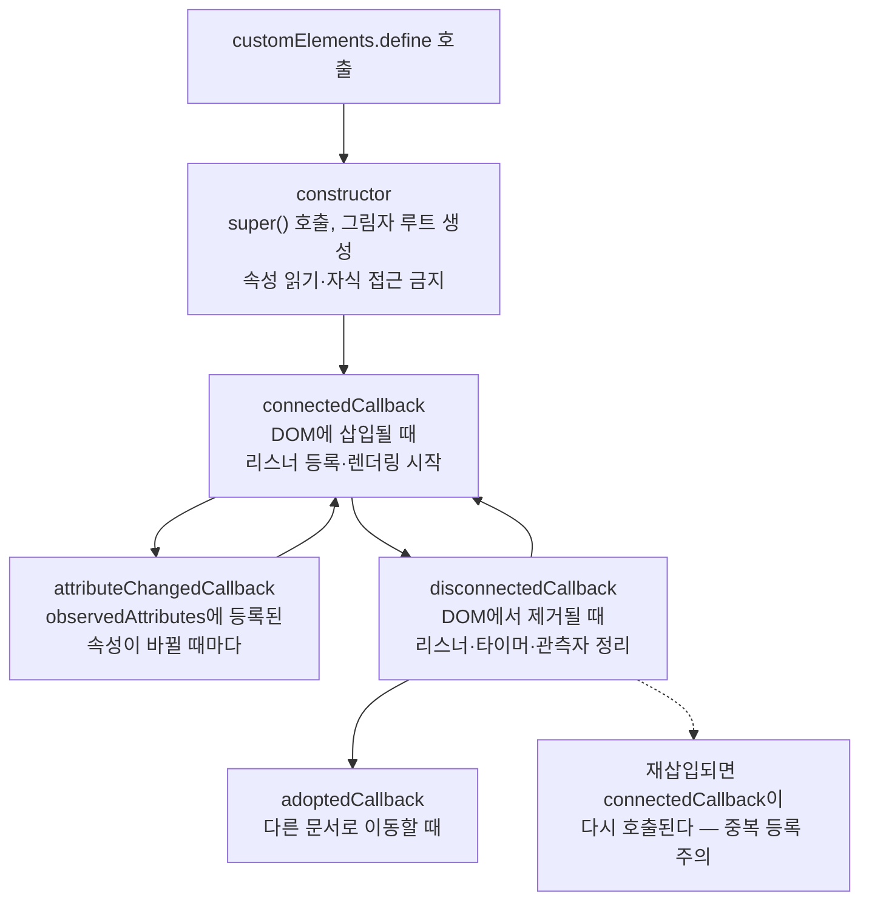
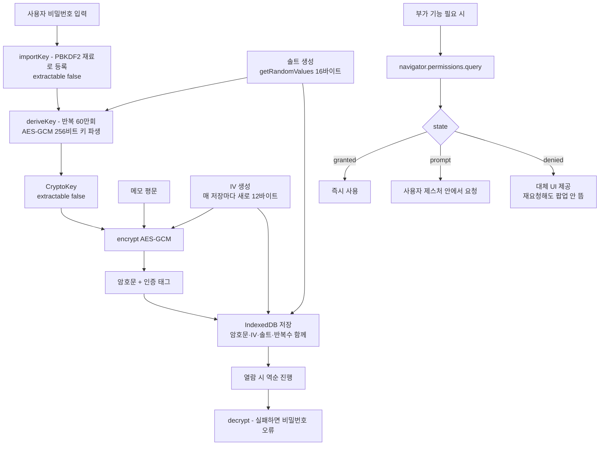

<Callout type="info">
  **이번 문서의 목표:** 이 파일을 다 읽으면 재사용 가능한 웹 컴포넌트를 캡슐화·이벤트·스타일 관점에서 설계하고, 권한 요청과 암호화, 저장소 선택을 하나의 민감 데이터 흐름으로 엮어 위협 모델과 함께 설명할 수 있다.
</Callout>

<Callout type="warning">
  **문제 출처 안내:** 이 편의 문제들은 특정 시험의 기출 문제를 복제한 것이 아니라, 22편·24편·25편의 학습 범위를 바탕으로 **재구성한 문제**입니다. 보안 설계에는 "무조건 옳은 답"이 드물기 때문에, 선택지를 고를 때 **어떤 위협을 막고 무엇을 포기하는지**를 함께 떠올리며 푸세요.
</Callout>

## 이 연습의 두 축

이번 편은 성격이 다른 두 주제를 한 자리에 묶습니다. 언뜻 관련이 없어 보이지만 공통점이 있습니다 — **둘 다 "경계"에 관한 이야기**입니다.

Web Components는 **코드의 경계**를 만듭니다. 내 컴포넌트의 스타일과 구조가 바깥으로 새지 않고, 바깥의 CSS가 안으로 들어오지 못하게 하는 캡슐화(encapsulation)가 핵심입니다.

보안 표면은 **신뢰의 경계**를 다룹니다. 어디까지가 내가 통제하는 영역이고 어디부터가 사용자·서버·제3자의 영역인지, 그 경계를 넘나드는 데이터를 어떻게 다룰지의 문제입니다.

> **쉽게 말하면:** 컴포넌트 설계는 "내 방의 벽을 어디에 세울까"이고, 보안 설계는 "그 벽에 낼 문에 어떤 자물쇠를 달까"다. 둘 다 벽을 어디에 세울지 정하는 데서 시작한다.

## 시나리오 A — 재사용 가능한 파일 첨부 위젯

### 요구사항

여러 페이지에서 재사용할 파일 첨부 컴포넌트를 만듭니다. 드래그앤드롭과 파일 선택 버튼을 모두 지원하고, 선택된 파일의 미리보기와 진행률을 표시합니다. 페이지마다 다른 디자인 시스템이 적용되어 있으므로 **바깥 CSS가 위젯 내부를 망가뜨리지 않아야** 하고, 반대로 위젯의 스타일이 페이지를 오염시켜도 안 됩니다. 사용법은 폼 요소처럼 자연스러워야 합니다.

### 설계 판단 1 — Shadow DOM을 열 것인가 닫을 것인가

Custom Element에 그림자 루트(shadow root)를 붙일 때 모드를 고릅니다.

| 모드 | `element.shadowRoot` | 특징 | 언제 쓰나 |
|------|----------------------|------|-----------|
| `open` | 접근 가능 | 외부 스크립트가 내부를 조작·검사할 수 있다 | 대부분의 경우 – 디버깅과 테스트가 쉽다 |
| `closed` | `null` | 외부에서 내부 트리에 접근 불가 | 위젯 내부를 강하게 숨겨야 할 때 |

여기서 흔한 오해를 짚어야 합니다.

<Callout type="warning">
  **자주 틀리는 점:** `closed` 모드를 **보안 기능으로 오해**하는 경우가 많습니다. 같은 페이지에서 실행되는 스크립트는 `attachShadow`를 가로채거나 프로토타입을 조작해 얼마든지 우회할 수 있습니다. `closed`가 주는 것은 "실수로 내부를 만지지 못하게 하는 규율"이지 신뢰 경계가 아닙니다. 진짜 격리가 필요하면 다른 오리진의 `iframe`을 써야 합니다 — 24편에서 다룬 오리진 격리가 실제 보안 경계입니다.
</Callout>

### 설계 판단 2 — 스타일 경계를 어디까지 열 것인가

Shadow DOM은 스타일을 차단합니다. 그런데 완전히 차단하면 페이지의 브랜드 색을 반영할 수 없어 재사용성이 오히려 떨어집니다. 그래서 **의도적으로 낸 구멍**들이 있습니다.

| 수단 | 방향 | 설명 |
|------|------|------|
| CSS 커스텀 속성 | 밖에서 안으로 | 커스텀 속성은 그림자 경계를 통과한다 – 테마 색 주입의 표준 방법 |
| `::part` 의사 요소 | 밖에서 안으로 | `part` 속성을 붙인 내부 요소만 외부에서 스타일 가능 |
| `:host` 선택자 | 안에서 자기 자신 | 컴포넌트 자신의 스타일을 내부 CSS로 정의 |
| `:host-context` | 안에서 조상 확인 | 조상의 클래스에 따라 자기 스타일 분기 |
| `slot` | 밖에서 안으로 | 외부 마크업을 내부의 지정 위치에 투영한다 |
| 상속 속성 | 밖에서 안으로 | `color`, `font-family` 등 상속되는 속성은 경계를 넘는다 |

핵심 원칙은 **명시적 계약**입니다. 외부가 바꿀 수 있는 것을 커스텀 속성과 `part`로 명시하면, 그 외의 내부 구조는 마음대로 리팩터링해도 사용자 코드가 깨지지 않습니다. 반대로 아무것도 열지 않으면 아무도 쓰지 않습니다.

### 설계 판단 3 — 이벤트를 어떻게 내보낼 것인가

컴포넌트 내부에서 발생한 이벤트는 기본적으로 그림자 경계에서 멈춥니다. 밖으로 알리려면 `CustomEvent`를 직접 만들어 발사해야 하고, 여기서 두 옵션이 결정적입니다.

- **`bubbles: true`** — 이벤트가 조상으로 전파됩니다. 이것이 없으면 부모에 붙인 리스너가 듣지 못합니다.
- **`composed: true`** — 이벤트가 **그림자 경계를 통과**합니다. 이것이 없으면 아무리 버블링해도 그림자 루트에서 막힙니다.

두 값을 모두 켜야 비로소 "컴포넌트가 페이지에 알린다"가 성립합니다. 그리고 경계를 넘어간 이벤트의 `target`은 **컴포넌트 자신으로 재지정**(retarget)됩니다. 내부의 어떤 버튼이 눌렸는지는 밖에서 알 수 없고, 그것이 캡슐화의 의도입니다. 내부 정보를 전달하려면 `detail` 객체에 담아야 합니다.

```js
// 컴포넌트 내부에서 밖으로 알리기
this.dispatchEvent(new CustomEvent("파일선택", {
  bubbles: true,   // 조상으로 전파
  composed: true,  // 그림자 경계 통과
  detail: { 개수: 파일들.length, 총크기: 총바이트 }
}));
```

### 설계 판단 4 — 라이프사이클과 속성 동기화

Custom Element의 콜백들은 호출 시점이 정해져 있고, 각각 하면 안 되는 일이 있습니다.



여기 두 개의 큰 함정이 있습니다.

**첫째, 생성자에서 속성을 읽으면 안 됩니다.** 파서가 요소를 만드는 시점에는 속성이 아직 붙지 않았을 수 있고, 스펙상 생성자에서 속성이나 자식을 건드리는 것은 금지되어 있습니다. 초기화는 `connectedCallback`에서 합니다.

**둘째, `connectedCallback`은 여러 번 호출될 수 있습니다.** 요소를 다른 부모로 옮기면 제거 후 삽입이 일어나 `disconnectedCallback`과 `connectedCallback`이 차례로 불립니다. 여기서 리스너를 등록만 하고 해제하지 않으면 이동할 때마다 리스너가 쌓입니다. 7편의 `AbortSignal`을 쓰면 이 정리가 한 줄로 끝납니다.

```js
connectedCallback() {
  this.정리기 = new AbortController();
  const { signal } = this.정리기;
  // 신호를 걸어두면 개별 removeEventListener가 필요 없다
  this.addEventListener("drop", this.드롭처리, { signal });
  window.addEventListener("resize", this.크기변경, { signal });
}

disconnectedCallback() {
  this.정리기.abort(); // 등록된 모든 리스너가 한 번에 해제된다
}
```

### 설계 판단 5 — 속성과 프로퍼티의 이중 경로

HTML 속성(attribute)은 문자열이고, 자바스크립트 프로퍼티(property)는 어떤 타입이든 될 수 있습니다. 표준 요소들이 그렇듯 컴포넌트도 두 경로를 모두 지원하고 서로 동기화해야 자연스럽습니다.

- 속성 → 프로퍼티: `observedAttributes`에 이름을 등록하고 `attributeChangedCallback`에서 반영합니다.
- 프로퍼티 → 속성: setter에서 `setAttribute`를 호출합니다.

두 방향을 모두 구현할 때 **무한 루프**를 주의해야 합니다. setter가 속성을 바꾸면 `attributeChangedCallback`이 불리고, 거기서 다시 프로퍼티를 설정하면 순환합니다. 값이 실제로 달라졌을 때만 반영하는 가드가 필요합니다. 또한 파일이나 객체처럼 **문자열로 표현할 수 없는 값은 속성으로 만들지 않고 프로퍼티 전용**으로 두는 것이 옳습니다.

### 스타터 코드

<CodePlayground
  template="vanilla"
  activeFile="/index.js"
  showConsole
  label="스타터 코드 — Shadow DOM 캡슐화, 슬롯, 커스텀 이벤트, 정리까지"
  files={{
    '/index.js': `class 파일첨부위젯 extends HTMLElement {
  static get observedAttributes() {
    return ["최대개수", "라벨"];
  }

  constructor() {
    super(); // 반드시 첫 줄
    // 여기서는 속성을 읽지 않는다 — 아직 없을 수 있다
    this.attachShadow({ mode: "open" });
    this.파일들 = [];
    this.정리기 = null;
  }

  connectedCallback() {
    this.정리기 = new AbortController();
    const { signal } = this.정리기;

    this.그리기();

    const 영역 = this.shadowRoot.getElementById("영역");
    const 입력 = this.shadowRoot.getElementById("입력");

    // dragover에서 preventDefault를 해야 drop이 발생한다 (26편)
    영역.addEventListener("dragover", function (e) {
      e.preventDefault();
      e.dataTransfer.dropEffect = "copy";
    }, { signal });

    영역.addEventListener("drop", (e) => {
      e.preventDefault();
      this.파일추가(Array.from(e.dataTransfer.files));
    }, { signal });

    영역.addEventListener("click", function () { 입력.click(); }, { signal });
    입력.addEventListener("change", (e) => {
      this.파일추가(Array.from(e.target.files));
    }, { signal });

    console.log("connectedCallback — 리스너 등록됨");
  }

  disconnectedCallback() {
    // 신호 하나로 모든 리스너를 해제한다
    if (this.정리기) this.정리기.abort();
    console.log("disconnectedCallback — 리스너 일괄 해제됨");
  }

  attributeChangedCallback(이름, 이전, 현재) {
    console.log("속성 변경:", 이름, 이전, "→", 현재);
    if (this.isConnected) this.그리기();
  }

  get 최대개수() {
    return Number(this.getAttribute("최대개수") || 5);
  }
  set 최대개수(값) {
    // 프로퍼티 → 속성 동기화. 값이 같으면 쓰지 않아 순환을 막는다
    if (String(값) !== this.getAttribute("최대개수")) {
      this.setAttribute("최대개수", String(값));
    }
  }

  파일추가(새파일들) {
    const 남은자리 = this.최대개수 - this.파일들.length;
    const 담을것 = 새파일들.slice(0, Math.max(0, 남은자리));
    this.파일들 = this.파일들.concat(담을것);
    this.그리기();

    // composed가 없으면 그림자 경계를 넘지 못한다
    this.dispatchEvent(new CustomEvent("파일선택", {
      bubbles: true,
      composed: true,
      detail: {
        개수: this.파일들.length,
        총크기: this.파일들.reduce(function (합, f) { return 합 + f.size; }, 0)
      }
    }));
  }

  그리기() {
    const 라벨 = this.getAttribute("라벨") || "파일을 끌어다 놓거나 클릭하세요";
    const 목록 = this.파일들
      .map(function (f) { return "<li>" + f.name + " — " + f.size + " bytes</li>"; })
      .join("");

    this.shadowRoot.innerHTML =
      "<style>" +
      // :host는 컴포넌트 자신. 커스텀 속성으로 외부 테마를 받는다
      ":host { display: block; font-family: inherit; }" +
      "#영역 { border: 2px dashed var(--첨부-테두리, #888);" +
      " padding: 24px; border-radius: 8px; text-align: center; cursor: pointer;" +
      " color: var(--첨부-글자, #333); background: var(--첨부-배경, #fafafa); }" +
      // 바깥 페이지의 .위험 클래스는 이 안에 절대 적용되지 않는다
      "ul { text-align: left; }" +
      "</style>" +
      "<div id='영역' part='영역'>" + 라벨 +
      "<input id='입력' type='file' multiple hidden></div>" +
      "<slot name='안내'></slot>" +
      "<ul>" + 목록 + "</ul>";
  }
}

customElements.define("파일-첨부", 파일첨부위젯);

// ===== 사용해 보기 =====
const 앱 = document.getElementById("app") || document.body;

// 바깥 페이지의 전역 스타일 — 그림자 안으로 들어가지 못한다
const 전역스타일 = document.createElement("style");
전역스타일.textContent =
  "#영역 { border: 10px solid red !important; }" +
  "파일-첨부 { --첨부-테두리: #4a7; --첨부-배경: #eef7f2; }";
document.head.appendChild(전역스타일);

앱.innerHTML =
  "<파일-첨부 최대개수='3' 라벨='이력서를 첨부하세요'>" +
  "<small slot='안내'>PDF만 허용됩니다 (슬롯으로 투영된 외부 마크업)</small>" +
  "</파일-첨부>";

const 위젯 = document.querySelector("파일-첨부");

// 컴포넌트가 발사한 커스텀 이벤트를 페이지에서 받는다
document.addEventListener("파일선택", function (e) {
  console.log("페이지가 수신:", e.detail);
  console.log("이벤트 target은 내부 요소가 아니라 컴포넌트 자신:", e.target.tagName);
});

console.log("=== 캡슐화 확인 ===");
console.log("shadowRoot 접근 가능(open 모드):", 위젯.shadowRoot !== null);
console.log("바깥 querySelector로 내부 요소 검색:", document.getElementById("영역"));
console.log("→ null이면 그림자 안이 일반 DOM 조회에서 숨겨진 것입니다.");
console.log("빨간 테두리 규칙은 적용되지 않고, 커스텀 속성 색만 적용됩니다.");

// 라이프사이클 관찰: 제거했다 다시 넣어보기
setTimeout(function () {
  console.log("--- 위젯을 DOM에서 제거합니다 ---");
  위젯.remove();
  setTimeout(function () {
    console.log("--- 다시 삽입합니다 (connectedCallback 재호출) ---");
    앱.appendChild(위젯);
  }, 500);
}, 1500);`,
  }}
/>

콘솔에서 세 가지를 확인하세요. 바깥의 `#영역` 규칙이 무시된다는 것, `document.getElementById`로 내부 요소를 찾을 수 없다는 것, 그리고 제거·재삽입 시 정리와 재등록이 짝을 이룬다는 것입니다.

### 스스로 답해 볼 질문

1. `innerHTML`로 그림자 내부를 매번 다시 그리는 이 구현의 문제는 무엇입니까? 파일 목록이 100개가 되면 어떤 비용이 발생합니까?
2. 이 위젯을 폼 안에 넣었을 때 `FormData`에 값이 담기게 하려면 무엇이 필요합니까?
3. 슬롯에 들어온 외부 마크업의 스타일은 누가 결정합니까? 그림자 안의 CSS가 슬롯 내용에 적용됩니까?
4. 컴포넌트가 정의되기 전에 HTML에 태그가 이미 있으면 어떻게 됩니까? 그 사이의 화면 깜빡임은 어떻게 막습니까?

## 시나리오 B — 민감 메모의 안전한 로컬 보관

### 요구사항

사용자가 비밀번호를 입력해 잠그는 개인 메모 기능입니다. 메모 내용은 서버에 평문으로 저장되면 안 되고, 오프라인에서도 열람할 수 있어야 하며, 기기의 생체 인증이나 알림 같은 부가 기능은 사용자가 허용한 경우에만 씁니다.

### 데이터 흐름 설계



### 각 선택의 근거

**왜 비밀번호를 그대로 키로 쓰지 않는가.** 사람이 만든 비밀번호는 엔트로피(entropy, 예측 불가능성의 양)가 낮습니다. PBKDF2로 수십만 번 반복 해시를 거치면 공격자가 후보 하나를 시험하는 비용이 그만큼 커집니다. 솔트는 미리 계산된 표를 무력화합니다. 25편에서 다룬 그대로입니다.

**왜 솔트와 IV를 함께 저장하는가.** 둘 다 비밀이 아닙니다. 솔트는 "같은 비밀번호라도 다른 키가 되게" 하는 값이고, IV는 "같은 평문이라도 다른 암호문이 되게" 하는 값입니다. 비밀이 아니므로 저장해도 되고, 저장하지 않으면 복호화가 불가능합니다.

**왜 반복 횟수도 함께 저장하는가.** 몇 년 뒤 권장 반복 횟수가 올라가면 새 데이터는 더 큰 값으로 저장하게 됩니다. 이때 옛 데이터를 열려면 그 데이터가 만들어질 당시의 반복 횟수를 알아야 합니다. **암호 파라미터는 데이터와 함께 저장한다**가 원칙입니다.

**왜 IndexedDB인가.** localStorage는 문자열만 담아 바이너리를 base64로 부풀려야 하고, 동기 API라 큰 데이터에서 메인 스레드를 막습니다. 무엇보다 `CryptoKey` 객체 자체를 구조화 복제로 저장할 수 있는 곳은 IndexedDB입니다. 세션 동안 파생 키를 캐시해두면 매번 60만 번 반복을 다시 돌리지 않아도 됩니다.

**왜 extractable을 false로 두는가.** 파생된 키의 바이트를 자바스크립트로 꺼낼 수 없게 만들면, 코드 어딘가에서 실수로 키를 로그에 찍거나 서버에 전송하는 일이 원천 차단됩니다.

### 위협 모델 — 무엇을 막고 무엇을 못 막는가

설계를 완성하는 것은 **한계를 명시하는 일**입니다.

| 위협 | 이 설계로 막히는가 | 이유 |
|------|-------------------|------|
| 서버 데이터베이스 유출 | 막힌다 | 서버에는 암호문만 있고 키는 없다 |
| 네트워크 도청 | 막힌다 | HTTPS와 자체 암호화의 이중 방어 |
| 기기 분실 후 저장소 덤프 | 상당 부분 막힌다 | 비밀번호 없이는 복호화 불가 |
| 데이터 변조 | 탐지된다 | AES-GCM의 인증 태그가 위조를 거부 |
| XSS로 주입된 스크립트 | 막지 못한다 | 같은 페이지에서 복호화 함수를 대신 호출할 수 있다 |
| 악의적인 코드 배포 | 막지 못한다 | 암호화 코드 자체를 서버가 내려주기 때문 |
| 사용자의 비밀번호 분실 | 막지 못한다 – 복구 불가 | 키가 사용자에게만 있다는 설계의 필연적 대가 |

<Callout type="warning">
  **자주 틀리는 점:** "클라이언트에서 암호화했으니 XSS도 막힌다"는 결론이 가장 위험합니다. `extractable: false`는 키의 **바이트**를 못 꺼내게 할 뿐, 그 키로 복호화를 **호출하는 것**은 막지 않습니다. 페이지에서 임의 코드가 실행되는 순간 공격자는 여러분의 복호화 함수를 그대로 부를 수 있습니다. 클라이언트 암호화는 XSS 방어의 대체재가 아니라, XSS를 막은 뒤에 얹는 별개의 층입니다. XSS 방어는 출력 이스케이프와 콘텐츠 보안 정책(Content Security Policy)의 몫입니다.
</Callout>

### 권한 요청의 설계

부가 기능에 권한이 필요할 때의 순서도 설계 대상입니다.

1. **필요해지는 순간에 요청한다.** 페이지 로드 즉시 모든 권한을 묻는 것은 거부율을 크게 높입니다.
2. **요청 전에 이유를 설명한다.** 브라우저 팝업은 문구를 바꿀 수 없으므로, 그 앞에 자체 안내 화면을 두는 사전 프롬프트 패턴을 씁니다.
3. **거부를 정상 경로로 취급한다.** 거부되면 다시 물을 수 없으므로 대체 기능을 제공해야 합니다.
4. **`permissions.query`로 미리 확인한다.** 이미 `granted`면 안내를 건너뛰고, `denied`면 아예 버튼을 숨깁니다.

## 종합 체크리스트

- [ ] 그림자 경계 밖으로 알려야 할 이벤트에 `bubbles`와 `composed`를 모두 지정했는가
- [ ] `connectedCallback`에서 등록한 것을 `disconnectedCallback`에서 전부 해제하는가
- [ ] 생성자에서 속성이나 자식에 접근하고 있지 않은가
- [ ] 외부가 커스터마이즈할 지점을 커스텀 속성과 `part`로 명시했는가
- [ ] `closed` 모드를 보안 수단으로 착각하고 있지 않은가
- [ ] 암호 파라미터인 솔트·IV·반복 횟수를 데이터와 함께 저장하는가
- [ ] 키를 `extractable: false`로 만들고 IndexedDB에 보관하는가
- [ ] 같은 키로 IV를 재사용하는 경로가 없는가
- [ ] 권한 거부 시의 대체 경로가 준비되어 있는가
- [ ] 이 설계가 막지 못하는 위협을 문서로 남겼는가

## 핵심 정리

- Web Components와 보안 설계는 모두 "경계를 어디에 세우고 무엇을 통과시킬 것인가"의 문제다.
- Shadow DOM의 `closed` 모드는 규율이지 보안 경계가 아니다. 진짜 격리는 다른 오리진의 `iframe`이 제공한다.
- 컴포넌트는 커스텀 속성·`part`·슬롯으로 외부와의 계약을 명시하고, 그 외 내부는 자유롭게 바꿀 수 있어야 재사용성이 산다.
- 그림자 경계를 넘는 이벤트는 `composed: true`가 필수이며, 경계를 넘은 이벤트의 `target`은 컴포넌트 자신으로 재지정된다. 내부 정보는 `detail`로 전달한다.
- 민감 데이터는 PBKDF2로 파생한 non-extractable 키와 AES-GCM으로 보호하고, 솔트·IV·반복 횟수를 함께 저장한다. 다만 이 방어선은 XSS와 악성 배포 앞에서는 무력하므로 위협 모델을 명시해야 한다.

## 마무리 복습

<Quiz
  questionNumber={1}
  question="attachShadow의 closed 모드에 대한 설명으로 가장 정확한 것은?"
  options={['같은 페이지의 다른 스크립트로부터 내부를 완전히 보호하는 보안 경계다', '외부에서 shadowRoot 프로퍼티로 접근할 수 없게 만드는 규율일 뿐, 우회 가능하므로 보안 경계가 아니다', 'CSS만 차단하고 자바스크립트 접근은 허용한다', '이벤트가 밖으로 나가지 못하게 막는다']}
  correctAnswer={2}
  explanation="closed 모드는 실수로 내부를 조작하지 못하게 하는 장치다. 같은 페이지 스크립트는 attachShadow를 가로채는 등의 방법으로 우회할 수 있으므로 신뢰 경계로 삼으면 안 된다. 실제 격리는 다른 오리진의 iframe이 제공한다."
  optionExplanations={['우회가 가능해 보안 경계가 될 수 없다', '정답 — 규율과 보안 경계를 구분해야 한다', '두 모드 모두 CSS는 차단한다', '이벤트 통과 여부는 composed 옵션이 결정한다']}
/>

<Quiz
  questionNumber={2}
  question="컴포넌트 내부에서 발사한 CustomEvent가 페이지의 document 리스너에 도달하려면 필요한 옵션은?"
  options={['bubbles만 true', 'composed만 true', 'bubbles와 composed 둘 다 true', 'cancelable을 true']}
  correctAnswer={3}
  explanation="bubbles는 조상으로의 전파를, composed는 그림자 경계 통과를 담당한다. 하나만 켜면 경계에서 막히거나 위로 올라가지 않아 document까지 도달하지 못한다."
  optionExplanations={['그림자 루트에서 막힌다', '버블링하지 않아 위로 올라가지 못한다', '정답 — 두 조건이 모두 필요하다', 'cancelable은 preventDefault 허용 여부일 뿐이다']}
/>

<Quiz
  questionNumber={3}
  question="그림자 경계를 넘어 밖으로 전파된 이벤트의 target이 컴포넌트 자신으로 바뀌는 현상을 무엇이라 하며, 그 목적은?"
  options={['버블링 – 성능 향상을 위해', '재지정(retargeting) – 내부 구조를 외부에 노출하지 않기 위해', '위임 – 리스너 수를 줄이기 위해', '캡처 – 이벤트 순서를 바꾸기 위해']}
  correctAnswer={2}
  explanation="재지정은 캡슐화를 유지하기 위한 장치다. 밖에서는 어떤 내부 요소가 이벤트를 일으켰는지 알 수 없으므로, 필요한 정보는 detail에 담아 명시적으로 전달해야 한다."
  optionExplanations={['버블링은 전파 방향의 개념이다', '정답 — 캡슐화 유지가 목적이다', '위임은 상위 요소에서 하위 이벤트를 처리하는 패턴이다', '캡처는 전파 단계 중 하나다']}
/>

<Quiz
  questionNumber={4}
  question="Custom Element의 생성자에서 하면 안 되는 일로 알맞은 것은?"
  options={['super 호출', 'attachShadow 호출', 'getAttribute로 속성 읽기와 자식 요소 접근', '인스턴스 필드 초기화']}
  correctAnswer={3}
  explanation="파서가 요소를 생성하는 시점에는 속성과 자식이 아직 붙지 않았을 수 있고, 스펙도 생성자에서의 속성·자식 조작을 금지한다. 초기화는 connectedCallback에서 수행한다."
  optionExplanations={['super는 오히려 첫 줄에 반드시 필요하다', '그림자 루트 생성은 생성자에서 하는 것이 일반적이다', '정답 — 이 시점에는 값이 없을 수 있다', '필드 초기화는 문제없다']}
/>

<Quiz
  questionNumber={5}
  question="요소를 다른 부모로 옮겼을 때 라이프사이클 콜백은 어떻게 호출되는가?"
  options={['아무 콜백도 호출되지 않는다', 'disconnectedCallback 후 connectedCallback이 호출되므로 리스너 중복 등록에 주의해야 한다', 'adoptedCallback만 호출된다', 'constructor가 다시 호출된다']}
  correctAnswer={2}
  explanation="이동은 제거와 삽입으로 처리되므로 두 콜백이 차례로 불린다. 연결 시 등록한 리스너를 해제하지 않으면 이동할 때마다 누적되며, AbortController 신호를 쓰면 일괄 해제가 간편하다."
  optionExplanations={['이동 시에도 콜백이 발생한다', '정답 — 중복 등록이 대표적 버그다', 'adoptedCallback은 다른 문서로 옮길 때다', '생성자는 한 번만 호출된다']}
/>

<Quiz
  questionNumber={6}
  question="Shadow DOM 내부에 외부 페이지의 테마 색을 반영하는 표준적인 방법은?"
  options={['외부에서 !important를 붙여 강제 적용한다', 'CSS 커스텀 속성을 정의해 컴포넌트 내부에서 var로 참조한다', '컴포넌트를 open 모드로 열고 innerHTML을 직접 수정한다', 'closed 모드를 사용한다']}
  correctAnswer={2}
  explanation="커스텀 속성은 상속을 통해 그림자 경계를 통과하는 몇 안 되는 통로다. 컴포넌트가 어떤 속성을 읽는지 문서화하면 그것이 곧 스타일 계약이 된다."
  optionExplanations={['important를 붙여도 그림자 내부 선택자에는 도달하지 않는다', '정답 — 테마 주입의 표준 방법이다', '외부에서 내부 구조를 조작하면 캡슐화가 무너진다', '모드는 스타일 주입과 무관하다']}
/>

<Quiz
  questionNumber={7}
  question="::part 의사 요소의 역할로 알맞은 것은?"
  options={['그림자 안의 모든 요소를 외부에서 자유롭게 스타일링하게 한다', 'part 속성이 붙은 특정 내부 요소만 외부 스타일 대상으로 노출한다', '슬롯에 들어온 외부 마크업을 숨긴다', '이벤트를 그림자 밖으로 통과시킨다']}
  correctAnswer={2}
  explanation="part는 컴포넌트 저자가 명시적으로 공개하기로 한 지점만 외부에 여는 장치다. 나머지 내부 구조는 여전히 자유롭게 바꿀 수 있어 캡슐화와 커스터마이즈를 양립시킨다."
  optionExplanations={['전부 열면 캡슐화가 사라진다', '정답 — 선택적 공개가 핵심이다', '슬롯과는 무관하다', '이벤트 통과는 composed의 역할이다']}
/>

<Quiz
  questionNumber={8}
  question="파일 객체처럼 문자열로 표현하기 어려운 값을 컴포넌트에 전달하는 올바른 방법은?"
  options={['JSON으로 직렬화해 HTML 속성에 넣는다', '자바스크립트 프로퍼티로 직접 대입한다', 'observedAttributes에 등록한다', 'dataset에 저장한다']}
  correctAnswer={2}
  explanation="HTML 속성은 문자열만 담을 수 있다. 객체나 함수, 파일 같은 값은 프로퍼티로 전달하고, 속성은 문자열로 자연스럽게 표현되는 값에만 사용한다."
  optionExplanations={['파일 내용을 속성에 넣는 것은 비현실적이다', '정답 — 속성과 프로퍼티의 역할 분담이다', '속성 기반 경로라 같은 한계를 갖는다', 'dataset도 문자열 저장소다']}
/>

<Quiz
  questionNumber={9}
  question="사용자 비밀번호를 그대로 AES 키로 사용하지 않고 PBKDF2를 거치는 이유는?"
  options={['AES가 문자열 입력을 받지 못해서', '사람의 비밀번호는 엔트로피가 낮아 무차별 대입에 약하므로 반복 연산으로 시도 비용을 높이기 위해', '비밀번호를 서버로 전송해야 해서', 'PBKDF2가 암호화 속도를 높여서']}
  correctAnswer={2}
  explanation="키 파생 함수는 일부러 느리게 설계되어 공격자가 후보 하나를 시험하는 비용을 크게 만든다. 여기에 사용자별 솔트를 더하면 미리 계산된 표 공격도 무력화된다."
  optionExplanations={['형식 변환은 인코딩으로 해결할 수 있는 부차적 문제다', '정답 — 비용을 높이는 것이 목적이다', '비밀번호 전송과는 무관하다', 'PBKDF2는 의도적으로 느리다']}
/>

<Quiz
  questionNumber={10}
  question="암호화된 메모를 저장할 때 솔트와 IV를 함께 저장해도 되는 이유는?"
  options={['둘 다 비밀 값이 아니며, 없으면 복호화 자체가 불가능하기 때문', '브라우저가 자동으로 암호화해 주기 때문', '용량이 작아 무시할 수 있기 때문', '저장하지 않으면 브라우저가 경고를 띄우기 때문']}
  correctAnswer={1}
  explanation="솔트는 같은 비밀번호에서 다른 키가 나오게 하고, IV는 같은 평문에서 다른 암호문이 나오게 한다. 둘 다 공개되어도 안전성이 유지되도록 설계되었으며, 복호화에 반드시 필요하므로 함께 보관한다."
  optionExplanations={['정답 — 비밀이 아니면서 필수인 값들이다', '자동 암호화 기능은 없다', '용량과 무관한 설계 근거다', '경고와는 무관하다']}
/>

<Quiz
  questionNumber={11}
  question="PBKDF2의 반복 횟수를 암호문과 함께 저장해야 하는 이유로 가장 알맞은 것은?"
  options={['반복 횟수가 키의 일부이기 때문', '권장 반복 횟수가 시간이 지나며 올라가므로, 옛 데이터를 열려면 당시 값이 필요하기 때문', '브라우저가 값을 검증하기 때문', '반복 횟수를 저장하지 않으면 암호화가 실패하기 때문']}
  correctAnswer={2}
  explanation="암호 파라미터는 데이터와 함께 저장하는 것이 원칙이다. 그래야 나중에 파라미터를 강화해도 과거 데이터를 계속 열 수 있고, 점진적 재암호화도 가능하다."
  optionExplanations={['키 자체가 아니라 키를 만드는 조건이다', '정답 — 미래의 파라미터 변경에 대비한다', '브라우저는 검증하지 않는다', '암호화는 성공하지만 나중에 복호화가 불가능해진다']}
/>

<Quiz
  questionNumber={12}
  question="CryptoKey를 extractable false로 만들고 IndexedDB에 저장하는 조합의 이점은?"
  options={['키의 원본 바이트를 꺼낼 수 없으면서도 다음 방문에 다시 사용할 수 있다', '키가 서버에 자동 백업된다', '키가 만료되어 자동 삭제된다', '키를 localStorage에도 동시에 저장한다']}
  correctAnswer={1}
  explanation="CryptoKey는 구조화 복제가 가능해 IndexedDB에 저장할 수 있다. non-extractable이면 코드가 키 값을 읽거나 유출할 수 없으면서, 연산에는 계속 쓸 수 있는 상태가 된다."
  optionExplanations={['정답 — 재사용성과 노출 차단을 동시에 얻는다', '자동 백업 기능은 없다', '자동 만료 기능은 없다', 'localStorage에는 CryptoKey를 담을 수 없다']}
/>

<Quiz
  questionNumber={13}
  question="AES-GCM에서 같은 키로 동일한 IV를 재사용하면 생기는 문제는?"
  options={['암호문 길이가 늘어난다', '암호학적 안전성이 심각하게 훼손되어 평문과 인증 키가 위험해진다', '복호화 속도가 느려진다', '아무 문제가 없다 – IV는 공개 값이므로']}
  correctAnswer={2}
  explanation="GCM에서 IV 재사용은 단순한 품질 저하가 아니라 치명적 실패다. 두 암호문의 관계에서 평문 정보가 새어 나가고 인증 기능까지 무너질 수 있어, 매 암호화마다 새 IV를 생성해야 한다."
  optionExplanations={['길이 문제가 아니다', '정답 — GCM에서 가장 치명적인 실수다', '속도와 무관하다', '공개 값인 것과 재사용 가능한 것은 전혀 다른 이야기다']}
/>

<Quiz
  questionNumber={14}
  question="클라이언트 측 암호화가 XSS 공격을 막지 못하는 이유로 가장 정확한 것은?"
  options={['암호화 알고리즘이 약해서', '주입된 스크립트가 같은 페이지에서 실행되므로 키 바이트를 못 꺼내도 복호화 함수를 대신 호출할 수 있어서', '브라우저가 암호화를 비활성화해서', 'HTTPS가 없으면 암호화가 동작하지 않아서']}
  correctAnswer={2}
  explanation="extractable false는 키 값의 유출만 막는다. 공격자는 값을 몰라도 그 키를 사용하는 연산을 호출할 수 있으므로, 클라이언트 암호화는 XSS 방어의 대체재가 될 수 없다."
  optionExplanations={['알고리즘 강도의 문제가 아니다', '정답 — 자물쇠를 훔치지 못해도 여는 손을 조종할 수 있다', '비활성화되지 않는다', '안전한 컨텍스트 요구는 별개의 조건이다']}
/>

<Quiz
  questionNumber={15}
  question="권한 상태가 denied인 기능에 대해 애플리케이션이 취해야 할 올바른 대응은?"
  options={['같은 요청을 반복 호출해 팝업을 다시 띄운다', '대체 UI나 기능을 제공하고, 권한 변경 방법을 안내한다', '페이지를 새로고침해 상태를 초기화한다', '오류 화면을 띄우고 진행을 막는다']}
  correctAnswer={2}
  explanation="브라우저는 거부 결정을 기억하므로 재요청해도 팝업이 뜨지 않고 즉시 거부된다. 거부를 정상 경로로 취급해 대체 기능을 제공하고, 필요하면 주소창 설정에서 바꾸는 방법을 안내한다."
  optionExplanations={['반복 호출은 사용자 경험만 해치고 효과가 없다', '정답 — 거부는 예외가 아니라 정상 분기다', '새로고침으로 권한이 초기화되지 않는다', '기능 전체를 막는 것은 과한 대응이다']}
/>

<Quiz
  questionNumber={16}
  question="권한이 필요한 기능에서 사전 프롬프트(자체 안내 화면)를 두는 이유로 알맞은 것은?"
  options={['브라우저 팝업의 문구를 바꿀 수 있어서', '브라우저 팝업은 문구를 바꿀 수 없으므로, 그 앞에서 필요한 이유를 설명해 거부율을 낮추기 위해', '권한을 자동으로 승인시키기 위해', '팝업을 건너뛰기 위해']}
  correctAnswer={2}
  explanation="브라우저 권한 팝업은 표준화된 문구만 보여준다. 맥락 없이 뜨면 거부율이 높으므로, 왜 필요한지 먼저 설명하고 사용자가 이해한 뒤 요청하는 것이 좋은 설계다."
  optionExplanations={['팝업 문구는 변경할 수 없다', '정답 — 맥락 제공이 목적이다', '자동 승인은 불가능하다', '팝업을 건너뛸 수는 없다']}
/>

<Quiz
  questionNumber={17}
  question="이 편의 설계가 막을 수 없다고 명시한 위협은?"
  options={['서버 데이터베이스 유출', '전송 구간 도청', '저장 데이터의 변조', '애플리케이션 코드 자체가 악의적으로 배포되는 경우']}
  correctAnswer={4}
  explanation="암호화 코드를 서버가 내려주는 웹 배포 모델에서는, 배포자가 키를 유출하는 코드를 배포하면 방어할 수단이 없다. 클라이언트 암호화의 신뢰는 결국 코드 배포자에 대한 신뢰로 환원된다."
  optionExplanations={['서버에는 암호문만 있어 막힌다', 'HTTPS와 자체 암호화로 막힌다', 'AES-GCM의 인증 태그로 탐지된다', '정답 — 배포 신뢰는 암호로 대체할 수 없다']}
/>

<Quiz
  questionNumber={18}
  question="컴포넌트에서 리스너 정리를 AbortController 신호로 처리하는 이점은?"
  options={['리스너 호출 순서를 제어할 수 있다', '연결 해제 시 abort 한 번으로 등록된 모든 리스너가 일괄 해제된다', '이벤트가 자동으로 그림자 밖으로 전파된다', '리스너가 자동으로 다시 등록된다']}
  correctAnswer={2}
  explanation="addEventListener의 signal 옵션에 같은 신호를 넘겨두면 abort 호출 하나로 모두 해제된다. 개별 removeEventListener를 빠뜨려 발생하는 누수를 구조적으로 막는다."
  optionExplanations={['순서 제어 기능은 아니다', '정답 — 수명 관리가 한 지점으로 모인다', '전파와 무관하다', '재등록은 connectedCallback에서 직접 해야 한다']}
/>

<Quiz
  questionNumber={19}
  question="정의되기 전의 커스텀 요소가 화면에 잠깐 어색하게 보이는 문제를 다루는 방법으로 알맞은 것은?"
  options={['CSS의 :defined 의사 클래스를 활용해 정의 전 상태의 표시를 제어한다', '요소를 display none으로 영구히 숨긴다', 'customElements.define을 호출하지 않는다', 'shadow root를 closed로 만든다']}
  correctAnswer={1}
  explanation="브라우저는 아직 업그레이드되지 않은 커스텀 요소를 알 수 있게 :defined 의사 클래스를 제공한다. 정의 전에는 자리만 잡아두고, 정의된 뒤 표시하는 방식으로 깜빡임을 줄인다."
  optionExplanations={['정답 — 정의 여부에 따른 스타일 분기가 표준 해법이다', '영구히 숨기면 컴포넌트가 보이지 않는다', '정의하지 않으면 컴포넌트가 동작하지 않는다', '모드는 이 문제와 무관하다']}
/>

<Quiz
  questionNumber={20}
  question="Web Components 설계와 보안 설계의 공통 원리를 이 편이 요약한 방식으로 가장 알맞은 것은?"
  options={['둘 다 성능 최적화가 목적이다', '둘 다 경계를 어디에 세우고 무엇을 통과시킬지 명시적으로 정하는 문제다', '둘 다 브라우저 호환성이 핵심 변수다', '둘 다 서버 설정에 의존한다']}
  correctAnswer={2}
  explanation="컴포넌트는 스타일과 구조의 경계를, 보안은 신뢰의 경계를 다룬다. 어느 쪽이든 통과 지점을 명시적 계약으로 만들고 나머지는 닫아두는 것이 좋은 설계다."
  optionExplanations={['성능은 부차적 관심사다', '정답 — 경계 설정이라는 같은 사고 틀이다', '호환성은 고려사항일 뿐 본질이 아니다', '서버 설정만으로 결정되지 않는다']}
/>

## 참고 자료

- [MDN - Web components](https://developer.mozilla.org/en-US/docs/Web/API/Web_components)
- [MDN - Using shadow DOM](https://developer.mozilla.org/en-US/docs/Web/API/Web_components/Using_shadow_DOM)
- [MDN - Web Crypto API](https://developer.mozilla.org/en-US/docs/Web/API/Web_Crypto_API)
- [MDN - Permissions API](https://developer.mozilla.org/en-US/docs/Web/API/Permissions_API)
- [MDN - IndexedDB API](https://developer.mozilla.org/en-US/docs/Web/API/IndexedDB_API)
- [DOM Living Standard](https://dom.spec.whatwg.org/)
