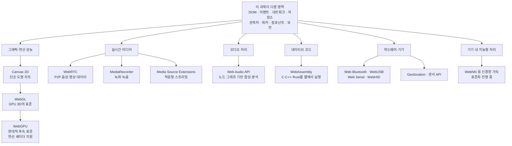

<Callout type="info">
  **이번 문서의 목표:** 이 파일을 다 읽으면 이 과목에서 배운 표준 Web API로 풀리는 문제와 특화 API가 필요한 문제를 구분하고, 각 특화 영역의 진입점과 학습 순서를 스스로 정할 수 있다.
</Callout>

## 왜 부록이 필요한가

29편까지 오면서 상당히 넓은 영역을 다뤘습니다. 문서 모델과 이벤트, 네트워크와 스트림, 저장소와 캐시, 관측자와 워커, 컴포넌트와 보안까지 — 웹 애플리케이션의 뼈대는 거의 이 도구들로 세울 수 있습니다.

그런데 어느 순간 이런 요구가 들어옵니다.

> "3차원 지도를 60프레임으로 돌려야 합니다."
> "브라우저에서 화상 통화를 붙여주세요."
> "이 영상 인코딩 라이브러리를 웹에서 그대로 쓰고 싶습니다."

이런 요구는 지금까지 배운 API로 **못 하는 것이 아니라, 하면 안 되는 것**입니다. `canvas`의 2D 컨텍스트로 3차원 장면을 그릴 수는 있지만 GPU를 쓰지 못해 실용적이지 않고, `WebSocket`으로 영상 데이터를 주고받을 수는 있지만 지연과 손실 처리를 직접 만들어야 합니다. 이럴 때 필요한 것이 **도메인 특화 API**입니다.

> **쉽게 말하면:** 이 과목이 준 것은 만능 공구함이다. 대부분의 집수리는 이걸로 된다. 하지만 벽을 뚫어야 하는 순간이 오면 해머드릴을 빌리러 가야 한다 — 문제는 "언제 공구함을 내려놓을지" 아는 것이다.

이 부록은 새 API를 가르치지 않습니다. **지도와 이정표**를 드립니다.

## 전체 지도 — 무엇이 어디에 있는가

이 지도의 규칙은 하나입니다 — **왼쪽에서 오른쪽으로 갈수록 강력해지지만, 복잡도와 지원 편차와 권한 요구가 함께 커집니다.**

## 분기 결정 기준 — 넘어갈 때인지 판단하는 다섯 질문

특화 API로 넘어가기 전에 다음을 순서대로 자문하세요. 성급한 이동은 유지보수 비용만 늘립니다.

<Steps>

### 표준 API로 정말 안 되는가, 아니면 느린 것인가

"느리다"의 원인이 알고리즘이나 렌더링 방식일 때가 많습니다. 23편에서 다룬 배치 처리와 워커 이전으로 해결되는 문제를 WebGL로 가져가면, 얻는 것 없이 코드만 열 배 복잡해집니다. 먼저 측정하고, 병목이 진짜 하드웨어 한계인지 확인하세요.

### 대상 사용자의 브라우저가 그것을 지원하는가

특화 API일수록 지원 편차가 큽니다. WebGPU와 Web Bluetooth 계열은 아직 특정 브라우저·플랫폼에서만 동작합니다. 2편에서 배운 호환성 표기와 기능 탐지(feature detection)로 확인하고, 미지원 환경의 대체 경로를 반드시 준비해야 합니다.

### 권한과 보안 요구를 받아들일 수 있는가

카메라·마이크·블루투스·시리얼 포트는 전부 명시적 권한과 안전한 컨텍스트를 요구하고, 상당수는 사용자 제스처 안에서만 시작할 수 있습니다. 26편에서 본 문지기 구조가 특화 영역에서는 더 엄격합니다. 사용자가 거부했을 때 서비스가 성립하는지 먼저 답해야 합니다.

### 학습·유지보수 비용을 감당할 팀인가

WebGL 셰이더나 WebRTC의 시그널링은 웹 개발과 별개의 전문 영역에 가깝습니다. 한 사람만 이해하는 코드가 되면 그 자체가 위험입니다. 검증된 라이브러리를 쓰는 선택지를 항상 함께 검토하세요.

### 서버 쪽에서 푸는 것이 나은 문제는 아닌가

영상 트랜스코딩, 대규모 데이터 집계, 무거운 이미지 처리는 서버가 하는 편이 나은 경우가 많습니다. 브라우저에서 할 수 있다는 사실이 브라우저에서 해야 한다는 뜻은 아닙니다.

</Steps>

### 기능 탐지로 현재 위치 확인하기

두 번째 질문 — "대상 브라우저가 지원하는가" — 는 문서를 찾아보기 전에 코드로 바로 확인할 수 있습니다. 아래 실습기를 지금 쓰는 브라우저에서 실행하면, 이 지도의 어느 지점까지 갈 수 있는지 한눈에 나옵니다. 다른 브라우저에서도 열어 결과를 비교해 보세요.

<CodePlayground
  template="vanilla"
  activeFile="/index.js"
  showConsole
  label="특화 API 기능 탐지 — 지금 이 브라우저가 어디까지 지원하는가"
  files={{
    '/index.js': `// 기능 탐지는 "이름이 존재하는가"를 묻는 것이지
// 사용자 에이전트 문자열을 파싱하는 것이 아니다 (2편 참고)
const 점검표 = [
  ["Canvas 2D", function () {
    return !!document.createElement("canvas").getContext("2d");
  }],
  ["WebGL", function () {
    const c = document.createElement("canvas");
    return !!(c.getContext("webgl") || c.getContext("experimental-webgl"));
  }],
  ["WebGL2", function () {
    return !!document.createElement("canvas").getContext("webgl2");
  }],
  ["WebGPU", function () { return "gpu" in navigator; }],
  ["OffscreenCanvas", function () { return typeof OffscreenCanvas !== "undefined"; }],
  ["WebAssembly", function () { return typeof WebAssembly === "object"; }],
  ["Web Audio", function () { return typeof AudioContext !== "undefined"; }],
  ["WebRTC (RTCPeerConnection)", function () {
    return typeof RTCPeerConnection !== "undefined";
  }],
  ["MediaRecorder", function () { return typeof MediaRecorder !== "undefined"; }],
  ["Media Source Extensions", function () { return typeof MediaSource !== "undefined"; }],
  ["Web Bluetooth", function () { return "bluetooth" in navigator; }],
  ["WebUSB", function () { return "usb" in navigator; }],
  ["Web Serial", function () { return "serial" in navigator; }],
  ["WebHID", function () { return "hid" in navigator; }],
  ["Geolocation", function () { return "geolocation" in navigator; }],
  ["File System Access", function () { return "showOpenFilePicker" in window; }],
  ["View Transitions", function () { return "startViewTransition" in document; }],
  ["Service Worker", function () { return "serviceWorker" in navigator; }],
  ["Web Authentication", function () { return typeof PublicKeyCredential !== "undefined"; }]
];

console.log("=== 이 브라우저의 특화 API 지원 현황 ===");
console.log("안전한 컨텍스트:", window.isSecureContext, "(다수 API의 전제 조건)");

let 가능 = 0;
for (const [이름, 검사] of 점검표) {
  let 결과;
  try {
    결과 = 검사();
  } catch (에러) {
    결과 = false;
  }
  if (결과) 가능 = 가능 + 1;
  console.log((결과 ? "O" : "X") + "  " + 이름);
}

console.log("---");
console.log("지원:", 가능, "/", 점검표.length);
console.log("주의: 이름이 존재해도 권한이 거부되면 실제로는 쓸 수 없습니다.");
console.log("또한 iframe 안에서는 권한 정책에 따라 차단될 수 있습니다.");`,
  }}
/>

여기서 얻는 교훈이 하나 더 있습니다. **이름의 존재는 사용 가능의 필요조건이지 충분조건이 아닙니다.** `navigator.bluetooth`가 있어도 사용자가 기기 선택을 거부하면 아무것도 못 합니다. 기능 탐지는 첫 관문일 뿐이고, 그다음은 항상 권한과 사용자 선택입니다.

## 영역별 진입점

### 그래픽 — Canvas 2D에서 WebGL, 그리고 WebGPU로

**언제 넘어가는가.** 그리는 도형이 수천 개를 넘거나, 3차원 원근·조명·텍스처가 필요하거나, 픽셀 단위 필터를 실시간으로 적용해야 할 때입니다. Canvas 2D는 CPU 기반이라 요소가 늘어나면 선형으로 느려집니다.

- **Canvas 2D** — 이 과목의 지식으로 바로 쓸 수 있습니다. `canvas` 요소에서 컨텍스트를 얻어 도형과 이미지를 그립니다. 차트, 간단한 게임, 이미지 자르기 정도는 여기서 충분합니다.
- **WebGL** — OpenGL ES를 웹에 옮긴 표준으로, GPU를 직접 다룹니다. 정점 셰이더와 프래그먼트 셰이더라는 GPU 프로그램을 GLSL 언어로 작성해야 하므로 진입 장벽이 뚜렷합니다. 실무에서는 대부분 Three.js 같은 상위 라이브러리를 거칩니다.
- **WebGPU** — 현대 GPU 구조에 맞춘 후속 표준입니다. 렌더링뿐 아니라 **연산 셰이더**(compute shader)로 범용 GPU 계산도 지원해 머신러닝 추론 등에 쓰입니다. 지원 범위를 반드시 확인하고 WebGL 대체 경로를 준비하세요.

**이 과목과의 연결.** 캔버스를 워커에서 그리려면 `OffscreenCanvas`를 워커로 이전(transfer)합니다. 19편의 이전 가능 객체 개념이 그대로 쓰이고, 렌더 루프는 18편의 `requestAnimationFrame`으로 돌립니다.

### 실시간 미디어 — WebRTC

**언제 넘어가는가.** 화상 통화, 화면 공유, 지연에 민감한 P2P 데이터 전송이 필요할 때입니다. 12편의 WebSocket은 서버를 거치는 신뢰성 있는 전송이라 수백 밀리초의 지연이 문제가 되는 실시간 미디어에는 맞지 않습니다.

WebRTC는 Web Real-Time Communication의 약어로, Real-Time(실시간) Communication(통신)입니다. 브라우저끼리 직접 연결을 맺는 것이 목표이며, 세 가지 구성 요소를 이해해야 합니다.

- **시그널링**(signaling) — 두 브라우저가 서로를 찾기 위해 연결 정보를 교환하는 과정입니다. 흥미롭게도 **이 부분은 표준이 정하지 않습니다.** 직접 만들어야 하고, 대개 12편의 WebSocket으로 구현합니다.
- **STUN·TURN 서버** — 공유기 뒤에 있는 기기가 자신의 공인 주소를 알아내거나, 직접 연결이 불가능할 때 중계하는 서버입니다. 서버 인프라가 필요하다는 뜻입니다.
- **미디어 트랙과 데이터 채널** — 26편의 `getUserMedia`로 얻은 트랙을 연결에 실어 보내고, 임의 데이터는 데이터 채널로 보냅니다.

**현실적인 조언.** WebRTC를 밑바닥부터 구현하는 프로젝트는 드뭅니다. 대부분 상용 서비스나 미디어 서버 오픈소스를 씁니다. 배워야 할 것은 API 사용법보다 **연결 수립 과정의 개념**입니다.

### 오디오 — Web Audio API

**언제 넘어가는가.** 소리를 단순 재생하는 것을 넘어 합성·믹싱·실시간 분석·공간 배치가 필요할 때입니다. 26편의 `audio` 요소는 재생만 담당합니다.

Web Audio API는 **노드 그래프**(node graph) 모델을 씁니다. 소스 노드에서 시작해 필터·게인·분석 노드를 거쳐 출력 노드로 연결하는 신호 경로를 코드로 조립합니다. 음악 앱, 게임 사운드, 시각화(주파수 스펙트럼 표시)가 전형적 용도입니다.

주의할 점 하나 — `AudioContext`는 사용자 제스처 없이 생성하면 `suspended` 상태로 시작합니다. 26편에서 다룬 자동 재생 정책이 여기에도 적용되므로, 첫 사용자 클릭에서 `resume()`을 호출하는 패턴이 필수입니다.

### 네이티브 코드 — WebAssembly

**언제 넘어가는가.** 이미 존재하는 C·C++·Rust 코드를 웹으로 가져와야 하거나, 자바스크립트로는 도달할 수 없는 계산 성능이 필요할 때입니다.

WebAssembly는 줄여서 Wasm이라 부르며, 브라우저가 실행할 수 있는 **이진 명령 형식**입니다. 자바스크립트를 대체하는 것이 아니라 함께 쓰이며, 이미지·영상 코덱, 압축 라이브러리, 물리 엔진, 데이터베이스 엔진 등이 이 방식으로 웹에 올라와 있습니다.

**이 과목과의 연결이 특히 깊습니다.** Wasm 모듈은 대개 워커에서 실행합니다. 무거운 계산을 메인 스레드에서 돌리면 Wasm이든 자바스크립트든 화면이 멈추기 때문입니다. 28편에서 세운 "긴 작업은 워커로" 원칙이 그대로 적용되고, 메모리는 `ArrayBuffer`로 오가므로 21편의 바이너리 지식과 이전 가능 객체 개념이 필요합니다.

<Callout type="warning">
  **자주 틀리는 점:** "WebAssembly는 자바스크립트보다 항상 빠르다"는 오해가 널리 퍼져 있습니다. Wasm이 유리한 것은 **긴 시간 이어지는 수치 계산**이고, DOM 조작이 섞이면 오히려 자바스크립트와의 경계를 넘나드는 비용이 이득을 상쇄합니다. Wasm은 DOM에 직접 접근할 수 없어 결국 자바스크립트를 거쳐야 하기 때문입니다. 도입 전에 반드시 실제 작업으로 측정하세요.
</Callout>

### 하드웨어·기기 API

브라우저에서 주변 기기에 접근하는 API들입니다. 공통 특성은 **강한 권한 요구와 큰 지원 편차**입니다.

| API | 용도 | 특징 |
|-----|------|------|
| Web Bluetooth | 저전력 블루투스 기기 통신 | 사용자가 기기 선택 창에서 직접 고른 기기만 접근 가능 |
| WebUSB | USB 장치 직접 제어 | 사용자 선택 필수, 일부 장치 클래스는 차단 |
| Web Serial | 시리얼 포트 통신 | 마이크로컨트롤러 개발 도구 등에 사용 |
| WebHID | 게임패드 외 입력 장치 | 표준 게임패드는 Gamepad API가 별도로 존재 |
| Geolocation | 위치 정보 | 권한 프롬프트 필수, 정확도와 배터리 소모의 절충 |
| 센서 API 계열 | 가속도·자이로 등 | 안전한 컨텍스트와 권한 정책 요구 |

이 계열의 공통 설계 패턴은 24편·26편에서 본 그대로입니다. **사용자 제스처 안에서 선택 창을 띄우고, 사용자가 고른 대상에만 접근 권한이 부여됩니다.** 페이지가 주변 기기 목록을 몰래 훑는 것은 어떤 API로도 불가능합니다.

### 그 밖에 알아두면 좋은 이웃들

- **View Transitions API** — 페이지 상태 전환에 애니메이션을 붙이는 최신 API로, 8편의 History API와 함께 쓰면 부드러운 화면 전환을 만듭니다.
- **Background Sync·Periodic Sync** — 20편의 Service Worker 위에 얹히는 확장으로, 오프라인 중 쌓인 작업을 온라인 복귀 시 처리합니다.
- **Push API·Notifications API** — 서버 푸시 알림. Service Worker와 권한 모델이 결합된 대표 사례입니다.
- **File System Access API** — 21편의 파일 읽기를 넘어 사용자가 선택한 파일·디렉터리에 **쓰기**까지 지원합니다.
- **Payment Request API·Web Authentication** — 결제와 생체 인증. 후자는 25편의 암호 지식이 실제 인증 프로토콜로 연결되는 지점입니다.

## 이 과목을 마친 뒤의 학습 순서 제안

무엇을 만들고 싶은지에 따라 다음 경로를 권합니다.

| 목표 | 다음에 볼 것 | 이 과목에서 다시 확인할 편 |
|------|--------------|---------------------------|
| 데이터 시각화·인터랙티브 그래픽 | Canvas 2D → WebGL 기반 라이브러리 | 18편 rAF, 19편 워커 |
| 오프라인 우선 애플리케이션 | Service Worker 심화, Background Sync | 14편, 15편, 20편 |
| 실시간 협업 도구 | WebRTC 데이터 채널, CRDT 개념 | 12편, 13편, 19편 |
| 미디어 편집·처리 도구 | WebCodecs, WebAssembly, Web Audio | 21편, 25편, 28편 |
| 기기 연동 웹 앱 | Web Bluetooth·Serial, 센서 API | 24편, 26편 |
| 고성능 계산 웹 앱 | WebAssembly, WebGPU 연산 셰이더 | 19편, 23편 |

## 마지막 조언 — 스펙을 읽는 습관

이 과목에서 가장 오래 쓸 기술은 특정 API 사용법이 아니라 **2편에서 익힌 스펙을 읽는 방법**입니다. 특화 API들은 변화가 빠르고 한국어 자료가 적습니다. 인터페이스 정의를 읽고, 알고리즘 문단에서 예외 조건을 찾고, 호환성 표를 확인하는 습관이 있으면 어떤 새 API가 나와도 스스로 배울 수 있습니다.

그리고 언제나 같은 질문으로 시작하세요 — **이 API는 어떤 문제를 풀려고 만들어졌는가, 무엇을 대가로 요구하는가.** 이 두 질문에 답할 수 있으면 도구를 고르는 일은 어렵지 않습니다.

## 핵심 정리

- 특화 API로 넘어가기 전에 표준 API의 최적화 여지, 브라우저 지원, 권한 요구, 팀의 유지보수 역량, 서버 처리 가능성을 순서대로 점검한다.
- 그래픽은 Canvas 2D에서 WebGL, WebGPU 순으로 강력해지며 복잡도도 함께 커진다. 렌더 루프와 오프스크린 캔버스는 이 과목의 rAF·워커 지식과 직접 이어진다.
- WebRTC는 P2P 실시간 미디어용이며 시그널링은 표준이 정하지 않아 WebSocket 등으로 직접 구현해야 하고 STUN·TURN 인프라가 필요하다.
- WebAssembly는 긴 수치 계산에서 유리하지만 DOM 접근이 불가능해 자바스크립트 경계 비용이 있으며, 대개 워커에서 실행한다.
- 하드웨어 API 계열은 사용자가 선택 창에서 고른 대상에만 접근이 허용되는 공통 패턴을 가지며, 지원 편차가 커서 대체 경로가 필수다.

## 마무리 복습

<Quiz
  questionNumber={1}
  question="이 과목의 표준 API에서 특화 API로 넘어가기 전에 가장 먼저 확인해야 할 것은?"
  options={['새 API의 최신 명세 초안', '느린 원인이 진짜 하드웨어 한계인지, 배치 처리나 워커 이전으로 해결되는 문제인지 측정하는 것', '팀원들의 선호도', '경쟁사가 어떤 기술을 쓰는지']}
  correctAnswer={2}
  explanation="성능 문제의 상당수는 렌더링 순서나 메인 스레드 점유에서 온다. 측정 없이 특화 API로 이동하면 복잡도만 늘고 개선은 없을 수 있다."
  optionExplanations={['명세를 읽는 것은 이동을 결정한 뒤의 일이다', '정답 — 측정이 모든 판단의 출발점이다', '선호도는 판단 기준이 될 수 없다', '맥락이 다르면 같은 선택이 옳지 않을 수 있다']}
/>

<Quiz
  questionNumber={2}
  question="WebRTC를 도입할 때 표준이 정해주지 않아 직접 구현해야 하는 부분은?"
  options={['미디어 코덱 협상', '두 브라우저가 서로를 찾기 위해 연결 정보를 교환하는 시그널링', '패킷 암호화', '카메라 접근 권한 요청']}
  correctAnswer={2}
  explanation="WebRTC 명세는 연결 수립 이후를 정의하지만, 두 피어가 연결 정보를 주고받는 경로는 애플리케이션에 맡긴다. 대개 WebSocket으로 직접 구현한다."
  optionExplanations={['코덱 협상은 명세가 정의한다', '정답 — 시그널링 채널은 개발자 몫이다', 'WebRTC는 암호화를 의무로 규정한다', '권한 요청은 getUserMedia가 담당한다']}
/>

<Quiz
  questionNumber={3}
  question="WebAssembly에 대한 설명으로 옳은 것은?"
  options={['자바스크립트를 대체하며 DOM을 직접 조작할 수 있다', '긴 수치 계산에 유리하지만 DOM에 직접 접근할 수 없어 자바스크립트를 거쳐야 하며 경계 비용이 있다', '모든 작업에서 자바스크립트보다 빠르다', '브라우저에서만 동작하며 워커에서는 쓸 수 없다']}
  correctAnswer={2}
  explanation="Wasm은 자바스크립트와 함께 쓰이는 이진 실행 형식이다. DOM 접근이 없어 화면 조작은 자바스크립트가 맡으며, 두 세계를 오가는 비용 때문에 짧은 작업에서는 이득이 없을 수 있다."
  optionExplanations={['DOM 직접 조작은 불가능하다', '정답 — 강점과 한계를 함께 이해해야 한다', '작업 성격에 따라 다르다', '워커에서 실행하는 것이 오히려 권장 패턴이다']}
/>

<Quiz
  questionNumber={4}
  question="Web Bluetooth, WebUSB, Web Serial 같은 하드웨어 API 계열의 공통 보안 패턴은?"
  options={['페이지가 주변 기기 목록을 자유롭게 조회할 수 있다', '사용자 제스처 안에서 선택 창을 띄우고, 사용자가 고른 대상에만 접근 권한이 부여된다', '권한 없이도 안전한 컨텍스트면 접근 가능하다', '한 번 허용하면 모든 기기에 접근할 수 있다']}
  correctAnswer={2}
  explanation="페이지가 주변 기기를 훑는 것은 어떤 API로도 불가능하다. 사용자가 브라우저가 제공하는 선택 창에서 직접 고른 특정 기기만 접근 대상이 되며, 이는 26편에서 본 문지기 구조의 연장이다."
  optionExplanations={['목록 훑기는 지문 채취 위험 때문에 차단된다', '정답 — 사용자 선택이 곧 권한 범위다', '권한 없이는 접근할 수 없다', '허용 범위는 선택한 기기에 한정된다']}
/>

<Quiz
  questionNumber={5}
  question="AudioContext를 페이지 로드 직후 만들었는데 소리가 나지 않는다. 가장 유력한 원인과 해결은?"
  options={['샘플레이트가 맞지 않아서 – 값을 다시 지정한다', '자동 재생 정책으로 suspended 상태로 시작해서 – 사용자 제스처 안에서 resume을 호출한다', '오디오 파일 형식이 지원되지 않아서 – 형식을 바꾼다', '워커에서 생성해야 해서 – 워커로 옮긴다']}
  correctAnswer={2}
  explanation="26편에서 다룬 자동 재생 정책이 Web Audio에도 적용된다. 사용자 제스처 없이 만든 컨텍스트는 정지 상태로 시작하므로, 첫 클릭 핸들러에서 resume을 호출하는 패턴이 필요하다."
  optionExplanations={['샘플레이트 문제라면 소리가 왜곡되지 아예 안 나지는 않는다', '정답 — 제스처 기반 resume이 표준 대응이다', '합성 음원에는 파일 형식이 관여하지 않는다', 'AudioContext는 메인 스레드에서 생성한다']}
/>

<Quiz
  questionNumber={6}
  question="이 과목을 마친 뒤 오프라인 우선 애플리케이션을 만들려 할 때 다시 확인하면 좋은 편의 조합으로 가장 알맞은 것은?"
  options={['Cache Storage, IndexedDB, Service Worker를 다룬 편들', 'Web Components와 Web Crypto를 다룬 편들', 'DOM Range와 Selection을 다룬 편', 'URLPattern과 History API를 다룬 편']}
  correctAnswer={1}
  explanation="오프라인 동작의 핵심은 응답 캐시와 구조화 데이터 저장, 그리고 요청을 가로채는 Service Worker의 조합이다. 여기에 Background Sync 같은 확장을 얹는 것이 다음 단계다."
  optionExplanations={['정답 — 저장소와 요청 가로채기가 오프라인의 기둥이다', '보안·컴포넌트 영역으로 오프라인의 핵심은 아니다', '문서 편집 기능에 가까운 주제다', '라우팅 주제로 오프라인 지원과 직결되지 않는다']}
/>

## 참고 자료

- [MDN - Web APIs 전체 카탈로그](https://developer.mozilla.org/en-US/docs/Web/API)
- [MDN - WebGL API](https://developer.mozilla.org/en-US/docs/Web/API/WebGL_API)
- [MDN - WebRTC API](https://developer.mozilla.org/en-US/docs/Web/API/WebRTC_API)
- [MDN - Web Audio API](https://developer.mozilla.org/en-US/docs/Web/API/Web_Audio_API)
- [MDN - WebAssembly](https://developer.mozilla.org/en-US/docs/WebAssembly)
- [MDN - Web Bluetooth API](https://developer.mozilla.org/en-US/docs/Web/API/Web_Bluetooth_API)
- [MDN - Service Worker API](https://developer.mozilla.org/en-US/docs/Web/API/Service_Worker_API)
