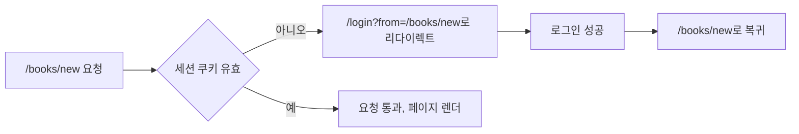

<Callout type="info">
  **이번 편의 결과물:** 로그인하지 않고 책 등록 페이지(`/books/new`)에 접근하면 로그인 페이지로 이동했다가 로그인 후 원래 페이지로 돌아옵니다. 목록·상세에 남아 있는 수정·삭제 Server Action도 로그인하지 않은 요청은 거부합니다. · **다루는 개념:** `proxy.js`(Next.js 16에서 `middleware.js`를 대체), `matcher` 설정, 세션 쿠키 검사 후 리다이렉트, 로그인 후 원래 경로 복귀
</Callout>

## 이 편에서 만드는 파일

```
bookshelf-next/
├── proxy.js                         (+, /books/new 접근 시 세션 검사 후 리다이렉트)
├── lib/
│   └── auth.js                      (~, SESSION_COOKIE_NAME·verifySessionToken을 export)
└── app/
    ├── books/
    │   └── actions.js               (~, 각 액션 맨 앞에 로그인 확인 추가)
    └── login/
        ├── page.js                  (~, redirectTo를 searchParams에서 읽어 폼에 전달)
        ├── login-form.js            (~, redirectTo 히든 필드 추가)
        └── actions.js                (~, 로그인 성공 시 redirectTo로 이동)
```

## 개념 정리

### middleware.js에서 proxy.js로

Next.js 16 이전에는 이 역할을 하는 파일 이름이 `middleware.js`였습니다. "미들웨어"라는 이름이 Express.js의 미들웨어와 혼동을 준다는 이유로, Next.js 16부터 파일 컨벤션 이름이 `proxy.js`로 바뀌었습니다. 역할은 같습니다. 요청이 라우트에 도달해 실제로 렌더링되기 전에 서버에서 실행되어, 응답을 리다이렉트·재작성하거나 헤더를 바꿀 수 있습니다. 프로젝트 루트에 `app`과 같은 위치에 두어야 하며, `app` 폴더 안에 넣으면 인식되지 않습니다.

### 기본 런타임이 Node.js로 바뀐 이유

이전 버전의 미들웨어는 기본이 Edge 런타임이라 Node 전용 모듈(`crypto` 등)을 쓸 수 없었습니다. Next.js 16부터 `proxy.js`는 기본 런타임이 Node.js로 바뀌어, 15편에서 만든 `crypto.createHmac` 기반 서명 검증을 별도 설정 없이 그대로 재사용할 수 있습니다.

### matcher로 실행 범위 좁히기

`matcher`를 지정하지 않으면 `proxy.js`는 정적 파일과 이미지 최적화 요청을 포함한 **모든 요청**에서 실행됩니다. 인증 로직은 반드시 `matcher`로 범위를 좁혀, 관계없는 요청까지 검사하며 속도를 떨어뜨리지 않게 합니다.

| matcher 값 | 의미 |
|---|---|
| `'/books/new'` | `/books/new` 경로에서만 실행 |

이 과목은 책 등록 페이지(`/books/new`)만 matcher로 보호합니다. 09편에서 만든 수정·삭제는 `/books`, `/books/[bookId]`라는 공개 페이지 안에 그대로 남아 있는 폼이라, 그 페이지 자체를 막으면 목록·상세 열람까지 함께 막혀버립니다. 목록과 상세는 로그인 없이도 볼 수 있어야 하므로 matcher에 넣지 않습니다.

### 페이지가 없는 기능은 액션 안에서 지킨다

수정·삭제 폼은 별도 URL 없이 공개 페이지에 얹혀 있으므로, `matcher`로는 애초에 겨냥할 경로가 없습니다. 이런 기능은 그 폼이 호출하는 `app/books/actions.js`의 `updateBookAction`·`deleteBookAction` 내부에서 직접 `getSession()`으로 로그인 여부를 확인합니다. "페이지 단위 보호는 proxy, 개별 변경 단위 보호는 액션 안"이라는 원칙으로 기억해 둡니다.

### proxy.js에서 쿠키 읽기

`proxy.js`는 `request.cookies.get('bookshelf_session')?.value`처럼 들어온 요청의 쿠키를 바로 읽습니다. `next/headers`의 `cookies()`와 달리 `await`가 필요하지 않습니다. 검증 로직을 두 번 만들지 않도록 15편의 `lib/auth.js` 함수를 그대로 재사용합니다.

### 세션이 없을 때 원래 경로로 되돌아오기

로그인 페이지로 보낼 때 원래 가려던 경로를 쿼리 문자열(`from`)에 실어 보냅니다. 로그인 페이지는 이 값을 읽어 숨은 입력 필드에 담고, 로그인 액션은 로그인이 성공하면 그 경로로 `redirect`합니다.



### proxy만으로는 부족하다

Next.js 공식 문서는 Server Action이 별도 라우트가 아니라 자신이 쓰이는 페이지로의 POST 요청으로 처리된다는 점을 짚습니다. 나중에 `matcher`를 바꾸거나 폼을 다른 경로로 옮기면, `proxy.js`가 보호하던 Server Action이 조용히 보호 범위에서 빠질 수 있습니다. `matcher`가 지켜주는 것은 그 페이지에 처음 접근하는 요청뿐이고, `createBookAction` 자체가 로그인 여부를 확인하지 않으면 그 함수를 직접 호출하려는 시도까지는 막지 못합니다. 그래서 `proxy.js`는 첫 번째 방어선일 뿐이고, 등록·수정·삭제를 처리하는 Server Action 안에도 `getSession()` 확인을 넣습니다.

## 실습

<Steps>

### 1. lib/auth.js에서 필요한 값 export

`proxy.js`가 재사용할 수 있도록 `lib/auth.js`에서 두 곳만 `export`로 바꿉니다. 나머지 함수·로직은 15편과 완전히 같습니다.

```js
// lib/auth.js (변경분 — 나머지 내용은 15편과 동일)
- const SESSION_COOKIE_NAME = 'bookshelf_session'
+ export const SESSION_COOKIE_NAME = 'bookshelf_session'

- function verifySessionToken(token) {
+ export function verifySessionToken(token) {
```

`SESSION_COOKIE_NAME`과 `verifySessionToken`은 원래도 파일 안에서만 쓰이는 값이었지만, 이제 `proxy.js`라는 다른 파일에서도 같은 로직으로 쿠키를 검증해야 하므로 밖으로 공개합니다. `login`, `logout`, `getSession`은 이미 `export` 상태였으므로 그대로 둡니다.

### 2. 수정·삭제 액션에 로그인 확인 추가

`app/books/actions.js` 맨 위에 `getSession`을 가져오고, `updateBookAction`과 `deleteBookAction` 맨 앞에 로그인 확인을 추가합니다. 나머지 로직은 그대로 둡니다.

```js
// app/books/actions.js (변경분 — import 한 줄과 두 함수 맨 앞 확인 코드만 추가)
import { getSession } from '@/lib/auth.js'

export async function updateBookAction(id, formData) {
  const session = await getSession()
  if (!session) {
    redirect('/login')
  }
  // ...기존 로직(상태·메모 업데이트, revalidatePath)은 그대로
}

export async function deleteBookAction(id) {
  const session = await getSession()
  if (!session) {
    redirect('/login')
  }
  // ...기존 로직(삭제, revalidatePath)은 그대로
}
```

`createBookAction`은 `/books/new`가 이미 `proxy.js`로 막혀 있어 로그인한 사용자만 그 폼에 도달하지만, URL을 직접 조작해 함수 자체를 호출하려는 시도까지 막으려면 같은 확인 코드를 여기에도 넣는 것이 안전합니다. `redirect`는 이미 이 파일에서 다른 용도로 `import`되어 있으므로 새로 추가할 필요가 없습니다.

### 3. proxy.js 작성

프로젝트 루트(`bookshelf-next/proxy.js`, `app` 폴더와 같은 위치)에 파일을 만듭니다.

```js
// bookshelf-next/proxy.js
import { NextResponse } from 'next/server'
import { SESSION_COOKIE_NAME, verifySessionToken } from './lib/auth.js'

export default function proxy(request) {
  const token = request.cookies.get(SESSION_COOKIE_NAME)?.value
  const session = verifySessionToken(token)

  if (session) {
    return NextResponse.next()
  }

  const loginUrl = new URL('/login', request.url)
  loginUrl.searchParams.set('from', request.nextUrl.pathname)
  return NextResponse.redirect(loginUrl)
}

export const config = {
  matcher: ['/books/new'],
}
```

`matcher`가 이미 보호 대상 경로만 골라 `proxy` 함수를 호출하므로, 함수 안에서 경로를 다시 확인할 필요가 없습니다. 세션이 유효하면 `NextResponse.next()`로 원래 요청을 그대로 통과시키고, 없거나 무효하면 `from` 쿼리 문자열에 원래 경로를 담아 `/login`으로 리다이렉트합니다.

### 4. 로그인 페이지가 원래 경로를 받도록 수정

`app/login/page.js`를 수정합니다.

```js
// app/login/page.js
import LoginForm from './login-form.js'

export const metadata = {
  title: '로그인 — bookshelf-next',
}

export default async function LoginPage({ searchParams }) {
  const { from } = await searchParams

  return (
    <section className="login-page">
      <h1>로그인</h1>
      <p>시드 계정: reader@bookshelf.dev / bookshelf1234!</p>
      <LoginForm redirectTo={from || '/books'} />
    </section>
  )
}
```

`searchParams`도 `params`와 마찬가지로 Promise이므로 `await`로 값을 꺼냅니다. `from`이 없으면(직접 `/login`으로 들어온 경우) 기본값으로 `/books`를 씁니다.

### 5. 로그인 폼에 히든 필드 추가

`app/login/login-form.js`를 수정합니다.

```js
// app/login/login-form.js
'use client'

import { useActionState } from 'react'
import { useFormStatus } from 'react-dom'
import { login } from './actions.js'

const initialState = { error: null }

function SubmitButton() {
  const { pending } = useFormStatus()
  return (
    <button type="submit" disabled={pending}>
      {pending ? '로그인하는 중...' : '로그인'}
    </button>
  )
}

export default function LoginForm({ redirectTo }) {
  const [state, formAction] = useActionState(login, initialState)

  return (
    <form action={formAction} className="login-form">
      <input type="hidden" name="redirectTo" value={redirectTo} />
      <div>
        <label htmlFor="email">이메일</label>
        <input id="email" name="email" type="email" required />
      </div>
      <div>
        <label htmlFor="password">비밀번호</label>
        <input id="password" name="password" type="password" required />
      </div>
      {state?.error && <p role="alert">{state.error}</p>}
      <SubmitButton />
    </form>
  )
}
```

### 6. 로그인 액션이 redirectTo로 이동하도록 수정

`app/login/actions.js`를 수정합니다.

```js
// app/login/actions.js
'use server'

import { redirect } from 'next/navigation'
import { login as loginUser, logout as clearSession } from '@/lib/auth.js'

export async function login(prevState, formData) {
  const email = formData.get('email')?.toString().trim() ?? ''
  const password = formData.get('password')?.toString() ?? ''
  const redirectTo = formData.get('redirectTo')?.toString() || '/books'

  if (!email || !password) {
    return { error: '이메일과 비밀번호를 모두 입력합니다.' }
  }

  const user = await loginUser(email, password)

  if (!user) {
    return { error: '이메일 또는 비밀번호가 올바르지 않습니다.' }
  }

  redirect(redirectTo)
}

export async function logout() {
  await clearSession()
  redirect('/login')
}
```

### 7. 실행과 확인

```text
npm run dev
```

</Steps>

## 확인

- 로그아웃한 상태에서 주소창에 `/books/new`를 직접 입력하면 `/login?from=%2Fbooks%2Fnew`로 이동합니다.
- 그 상태에서 로그인에 성공하면 `/books`가 아니라 원래 가려던 `/books/new`로 이동합니다.
- 로그인한 상태에서 `/books/new`에 접근하면 리다이렉트 없이 09편에서 만든 등록 페이지가 그대로 보입니다.
- `/books`, `/books/1`처럼 matcher에 없는 경로는 로그인 여부와 상관없이 항상 접근됩니다.
- 로그아웃한 상태에서 `/books/1`의 수정 폼을 그대로 제출하면(폼 자체는 여전히 화면에 보입니다) 페이지가 저장되지 않고 `/login`으로 이동합니다. 로그인한 뒤 같은 폼을 제출하면 정상적으로 저장됩니다.

## 직접 해보기

지금은 로그아웃한 상태에서도 목록의 "+ 새 책 등록" 링크나 상세 페이지의 수정·삭제 폼이 화면에 그대로 보이고, 제출해야만 로그인 페이지로 튕겨납니다. `app/books/page.js`와 `app/books/[bookId]/page.js`에서 `getSession()`을 호출해, 로그인하지 않았을 때는 그 링크와 폼 자체를 안 보이게 만들어보세요.

<details>
<summary>정답 보기</summary>

두 파일 모두 서버 컴포넌트이므로 `const session = await getSession()`을 추가하고, `{session && (...)}` 형태로 등록 링크와 수정·삭제 폼을 감싸면 됩니다. 다만 이 화면 숨김은 사용자 경험을 다듬는 장치일 뿐이고, 실제 보안 경계는 이번 편에서 액션 내부에 넣은 `getSession()` 확인입니다. 화면에서 숨겨도 요청을 직접 조작하면 액션이 호출될 수 있으므로, 두 가지를 함께 갖춰야 합니다.

</details>

## 자주 하는 실수

| 증상 | 원인 | 고치는 법 |
|------|------|-----------|
| proxy.js를 만들었는데 전혀 실행되지 않음 | `app` 폴더 안에 넣거나 파일명을 `middleware.js`로 씀 | `proxy.js`를 프로젝트 루트, `app`과 같은 위치에 정확한 이름으로 둔다 |
| 로그인 없이도 모든 페이지가 느려짐 | `matcher`를 지정하지 않아 정적 파일까지 매 요청마다 검사함 | `matcher`에 실제로 보호할 경로만 남긴다 |
| 로그인 후 항상 `/books`로만 이동함 | 로그인 폼에 `redirectTo` 히든 필드를 빠뜨림 | `input type="hidden" name="redirectTo"`를 추가하고 액션에서 그 값을 읽는다 |
| 수정·삭제 폼이 로그아웃 상태에서도 그대로 저장됨 | `updateBookAction`·`deleteBookAction`에 로그인 확인을 추가하지 않음 | 두 함수 맨 앞에 `getSession()` 확인과 `redirect('/login')`을 넣는다 |

## 확인 문제

<Quiz
  questionNumber={1}
  question="Next.js 16에서 middleware.js 대신 쓰는 파일 컨벤션 이름은"
  options={['handler.js', 'proxy.js', 'guard.js', 'gateway.js']}
  correctAnswer={2}
  explanation="Next.js 16부터 middleware라는 이름이 proxy로 바뀌었고 역할은 같습니다."
  optionExplanations={['해당하는 파일 컨벤션이 아닙니다', '정답입니다', '해당하는 파일 컨벤션이 아닙니다', '해당하는 파일 컨벤션이 아닙니다']}
/>

<Quiz
  questionNumber={2}
  question="proxy.js에 matcher를 지정하지 않으면 벌어지는 일은"
  options={['proxy가 아예 실행되지 않는다', '정적 파일과 이미지 최적화 요청을 포함한 모든 요청에서 실행된다', 'API 경로에서만 실행된다', '로그인한 사용자에게만 실행된다']}
  correctAnswer={2}
  explanation="matcher가 없으면 proxy는 기본적으로 모든 요청에서 실행되므로, 관계없는 정적 자원까지 거치며 성능에 영향을 줄 수 있습니다."
  optionExplanations={['오히려 반대로 모든 요청에서 실행됩니다', '정답입니다', 'API 경로로 한정되지 않습니다', '로그인 여부와 무관하게 실행됩니다']}
/>

<Quiz
  questionNumber={3}
  question="이 과목의 proxy.js에서 15편의 crypto 기반 서명 검증을 그대로 재사용할 수 있는 이유는"
  options={['proxy.js는 항상 브라우저에서 실행되기 때문에', 'Next.js 16부터 proxy가 기본으로 Node.js 런타임을 쓰기 때문에', 'crypto 모듈이 Edge 런타임 전용이기 때문에', 'matcher 설정이 런타임을 자동으로 바꿔주기 때문에']}
  correctAnswer={2}
  explanation="이전 버전의 미들웨어는 기본이 Edge 런타임이라 Node 전용 모듈을 쓸 수 없었지만, Next.js 16부터 proxy는 기본 런타임이 Node.js로 바뀌어 crypto 모듈을 그대로 쓸 수 있습니다."
  optionExplanations={['proxy.js는 서버에서 실행됩니다', '정답입니다', 'crypto는 Node.js 전용 모듈입니다', 'matcher는 실행 범위만 정합니다']}
/>

<Quiz
  questionNumber={4}
  question="proxy.js만으로 인증을 전부 처리해서는 안 되는 이유는"
  options={['proxy.js는 쿠키를 읽을 수 없어서', 'Server Action은 별도 라우트가 아니라 해당 페이지로의 POST 요청으로 처리되어 matcher 변경 시 보호가 빠질 수 있어서', 'proxy.js는 리다이렉트를 지원하지 않아서', 'Next.js가 proxy.js를 곧 완전히 제거할 예정이라서']}
  correctAnswer={2}
  explanation="Server Action은 그것이 쓰인 페이지의 POST 요청으로 처리되므로, matcher를 바꾸거나 폼을 옮기면 조용히 보호 범위에서 빠질 수 있습니다. 그래서 Server Action 내부에서도 세션을 다시 확인해야 합니다."
  optionExplanations={['request.cookies로 읽을 수 있습니다', '정답입니다', 'NextResponse.redirect를 지원합니다', '제거 계획과는 무관한 이유입니다']}
/>

## 참고 자료

- [Next.js Docs — proxy.js 파일 컨벤션](https://nextjs.org/docs/app/api-reference/file-conventions/proxy)
- [Next.js Docs — Authentication 가이드](https://nextjs.org/docs/app/guides/authentication)
