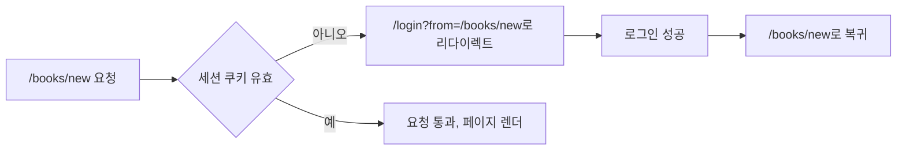

## 개념 정리

### middleware.js에서 proxy.js로

Next.js 16 이전에는 이 역할을 하는 파일 이름이 `middleware.js`였습니다. "미들웨어"라는 이름이 Express.js의 미들웨어와 혼동을 준다는 이유로, Next.js 16부터 파일 컨벤션 이름이 `proxy.js`로 바뀌었습니다.

### 기본 런타임이 Node.js로 바뀐 이유

이전 버전의 미들웨어는 기본이 Edge 런타임이라 Node 전용 모듈(`crypto` 등)을 쓸 수 없었습니다. Next.js 16부터 `proxy.js`는 기본 런타임이 Node.js로 바뀌어, 15편에서 만든 `crypto.createHmac` 기반 서명 검증을 별도 설정 없이 그대로 재사용할 수 있습니다.

### matcher로 실행 범위 좁히기

`matcher`를 지정하지 않으면 `proxy.js`는 정적 파일과 이미지 최적화 요청을 포함한 **모든 요청**에서 실행됩니다. 인증 로직은 반드시 `matcher`로 범위를 좁혀, 관계없는 요청까지 검사하며 속도를 떨어뜨리지 않게 합니다.

| matcher 값 | 의미 |
|---|---|
| `'/books/new'` | `/books/new` 경로에서만 실행 |

09편에서 만든 수정·삭제는 `/books`, `/books/[bookId]`라는 공개 페이지 안에 그대로 남아 있는 폼이라, 그 페이지 자체를 막으면 목록·상세 열람까지 함께 막혀버립니다. 목록과 상세는 로그인 없이도 볼 수 있어야 하므로 matcher에 넣지 않습니다.

### 페이지가 없는 기능은 액션 안에서 지킨다

수정·삭제 폼은 별도 URL 없이 공개 페이지에 얹혀 있으므로, `matcher`로는 애초에 겨냥할 경로가 없습니다. 이런 기능은 그 폼이 호출하는 `app/books/actions.js`의 `updateBookAction`·`deleteBookAction` 내부에서 직접 `getSession()`으로 로그인 여부를 확인합니다.

### proxy.js에서 쿠키 읽기

`next/headers`의 `cookies()`와 달리 `await`가 필요하지 않습니다. 검증 로직을 두 번 만들지 않도록 15편의 `lib/auth.js` 함수를 그대로 재사용합니다.

### 세션이 없을 때 원래 경로로 되돌아오기

로그인 페이지로 보낼 때 원래 가려던 경로를 쿼리 문자열(`from`)에 실어 보냅니다. 로그인 페이지는 이 값을 읽어 숨은 입력 필드에 담고, 로그인 액션은 로그인이 성공하면 그 경로로 `redirect`합니다.

```mermaid
flowchart LR
  A["/books/new 요청"] --> B{세션 쿠키 유효}
  B -- 아니오 --> C["/login?from=/books/new로 리다이렉트"]
  C --> D[로그인 성공]
  D --> E["/books/new로 복귀"]
  B -- 예 --> F[요청 통과, 페이지 렌더]
```

### proxy만으로는 부족하다

Next.js 공식 문서는 Server Action이 별도 라우트가 아니라 자신이 쓰이는 페이지로의 POST 요청으로 처리된다는 점을 짚습니다. 나중에 `matcher`를 바꾸거나 폼을 다른 경로로 옮기면, `proxy.js`가 보호하던 Server Action이 조용히 보호 범위에서 빠질 수 있습니다.

## 자주 하는 실수

| 증상 | 원인 | 고치는 법 |
|------|------|-----------|
| proxy.js를 만들었는데 전혀 실행되지 않음 | `app` 폴더 안에 넣거나 파일명을 `middleware.js`로 씀 | `proxy.js`를 프로젝트 루트, `app`과 같은 위치에 정확한 이름으로 둔다 |
| 로그인 없이도 모든 페이지가 느려짐 | `matcher`를 지정하지 않아 정적 파일까지 매 요청마다 검사함 | `matcher`에 실제로 보호할 경로만 남긴다 |
| 로그인 후 항상 `/books`로만 이동함 | 로그인 폼에 `redirectTo` 히든 필드를 빠뜨림 | `input type="hidden" name="redirectTo"`를 추가하고 액션에서 그 값을 읽는다 |

## 확인 문제

<Quiz
  questionNumber={1}
  question={"Next.js 16에서 middleware.js 대신 쓰는 파일 컨벤션 이름은"}
  options={["handler.js","proxy.js","guard.js","gateway.js"]}
  correctAnswer={2}
  explanation={"Next.js 16부터 middleware라는 이름이 proxy로 바뀌었고 역할은 같습니다."}
/>

<Quiz
  questionNumber={2}
  question={"proxy.js에 matcher를 지정하지 않으면 벌어지는 일은"}
  options={["proxy가 아예 실행되지 않는다","정적 파일과 이미지 최적화 요청을 포함한 모든 요청에서 실행된다","API 경로에서만 실행된다","로그인한 사용자에게만 실행된다"]}
  correctAnswer={2}
  explanation={"matcher가 없으면 proxy는 기본적으로 모든 요청에서 실행되므로, 관계없는 정적 자원까지 거치며 성능에 영향을 줄 수 있습니다."}
/>

<Quiz
  questionNumber={3}
  question={"proxy.js만으로 인증을 전부 처리해서는 안 되는 이유는"}
  options={["proxy.js는 쿠키를 읽을 수 없어서","Server Action은 별도 라우트가 아니라 해당 페이지로의 POST 요청으로 처리되어 matcher 변경 시 보호가 빠질 수 있어서","proxy.js는 리다이렉트를 지원하지 않아서","Next.js가 proxy.js를 곧 완전히 제거할 예정이라서"]}
  correctAnswer={2}
  explanation={"Server Action은 그것이 쓰인 페이지의 POST 요청으로 처리되므로, matcher를 바꾸거나 폼을 옮기면 조용히 보호 범위에서 빠질 수 있습니다. 그래서 Server Action 내부에서도 세션을 다시 확인해야 합니다."}
/>

## 참고 자료

- [Next.js Docs — proxy.js 파일 컨벤션](https://nextjs.org/docs/app/api-reference/file-conventions/proxy)
- [Next.js Docs — Authentication 가이드](https://nextjs.org/docs/app/guides/authentication)
