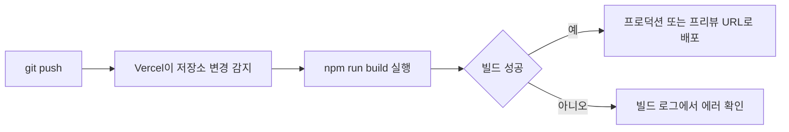

<Callout type="info">
  **이번 편의 결과물:** `bookshelf-next`가 실제 URL로 배포되어 브라우저에서 접속되고, 배포 환경의 mock DB 쓰기 제약이 안내 문구로 남습니다. · **다루는 개념:** `next build` 프로덕션 빌드, `.env` 환경 변수 분리, Vercel 배포, 서버리스 환경에서 파일 쓰기 mock DB가 갖는 한계와 대안
</Callout>

## 이 편에서 만드는 파일

```
bookshelf-next/
├── .env.example                     (+, 배포에 필요한 환경 변수 키 목록)
└── app/
    ├── layout.js                    (~, DeploymentNotice 렌더)
    ├── components/
    │   └── deployment-notice.js     (+, 서버리스 파일 쓰기 제약 안내 배너)
    └── globals.css                  (~, 안내 배너 스타일 추가)
```

## 개념 정리

### next build가 하는 일

`npm run dev`는 개발 중 빠른 반영을 위해 매번 필요한 부분만 컴파일합니다. `npm run build`는 배포용 프로덕션 빌드를 한 번에 만듭니다. 코드를 최적화하고, 각 라우트가 정적으로 미리 만들어질 수 있는지 요청마다 서버에서 다시 그려야 하는지를 구분해 터미널에 표로 보여줍니다. 정확한 기호와 표기는 Next.js 버전마다 조금씩 바뀔 수 있지만, 큰 틀은 "정적(Static)"과 "동적(Dynamic)" 두 갈래입니다.

15편에서 `app/layout.js`에 `getSession()`을 추가하면서 모든 페이지가 이 레이아웃을 거치게 됐습니다. `getSession()`은 내부에서 `cookies()`를 호출하는데, `cookies()`는 요청이 와야만 값을 알 수 있는 요청 시점 API라서, 이를 쓰는 레이아웃 아래의 모든 라우트는 정적으로 미리 만들어지지 못하고 요청마다 서버에서 다시 그려지는 동적 라우트가 됩니다. 08편에서 다룬 캐싱 전략과 반대 방향의 트레이드오프입니다. 로그인 상태를 즉시 반영하려면 이 비용을 받아들여야 합니다.

### .env.local과 .env.example의 역할 분리

| 파일 | 내용 | git 커밋 여부 |
|---|---|---|
| `.env.local` | 실제 비밀 값(`SESSION_SECRET`의 진짜 문자열) | 안 함(`.gitignore`에 이미 포함) |
| `.env.example` | 필요한 환경 변수 이름만, 값은 비움 | 함(다른 사람이 프로젝트를 받았을 때 무엇을 채워야 하는지 알려주는 문서 역할) |

Vercel은 배포할 때 로컬의 `.env.local`을 함께 가져가지 않습니다. 배포 환경에서 쓸 값은 Vercel 프로젝트 설정 화면에 따로 등록해야 합니다.

### Vercel 배포 흐름



GitHub 저장소를 Vercel 프로젝트에 연결해두면, 이후로는 커밋을 `push`할 때마다 이 과정이 자동으로 반복됩니다. 기본 브랜치(main 등)에 올린 커밋은 프로덕션 배포로, 그 외 브랜치는 프리뷰 배포로 구분됩니다.

### Vercel Functions의 읽기 전용 파일 시스템

`bookshelf-next`가 07편부터 써온 `lib/db.js`의 쓰기 함수는 `node:fs/promises`의 `writeFile`로 프로젝트 안의 `data/db.json` 파일을 직접 덮어씁니다. 로컬 개발 환경에서는 문제없이 동작하지만, Vercel에 배포된 서버리스 함수는 배포된 코드가 담긴 파일 시스템이 **읽기 전용**입니다. 쓰기가 가능한 공간은 `/tmp` 뿐이고 그마저도 최대 500MB, 함수 인스턴스가 새로 뜨거나 재활용될 때마다 초기화되어 영구 저장소로 쓸 수 없습니다.

그 결과 배포 환경에서 책 등록·수정·삭제를 시도하면 `lib/db.js`의 쓰기 시도가 실패해 서버 에러가 됩니다. 반대로 로그인·로그아웃은 파일을 쓰지 않고 쿠키만 주고받으므로 배포 환경에서도 그대로 동작합니다. 실제 서비스라면 Postgres, PlanetScale 같은 외부 데이터베이스나 Vercel Blob 같은 저장소가 필요하지만, 01_학습방향에서 정한 대로 이 과목은 그 구현까지는 다루지 않고 한계를 안내하는 것으로 마무리합니다.

### process.env.VERCEL로 배포 환경 감지

Vercel은 배포된 함수에 `VERCEL`, `VERCEL_ENV` 같은 시스템 환경 변수를 자동으로 주입합니다. 다만 프로젝트 설정의 **System Environment Variables** 접근 옵션을 켜야 코드에서 `process.env.VERCEL` 값을 읽을 수 있습니다. 로컬 `npm run dev`·`npm run build` 환경에는 이 값이 없으므로, 이 값의 존재 여부로 "지금 Vercel에 배포된 상태인지"를 구분할 수 있습니다.

## 실습

<Steps>

### 1. 로컬에서 프로덕션 빌드 확인

```text
npm run build
```

터미널에 라우트별 정적/동적 구분표가 출력됩니다. `/`, `/books`, `/books/[bookId]` 모두 동적 라우트로 표시되는지 확인합니다(15편에서 추가한 `getSession()` 때문입니다).

빌드가 끝나면 프로덕션 서버로 실행해봅니다.

```text
npm run start
```

`npm run dev`와 달리 코드 수정이 즉시 반영되지 않고, 실제 배포와 같은 최적화된 번들로 동작합니다. 확인이 끝나면 `Ctrl + C`로 종료합니다.

### 2. 환경 변수 예시 파일 작성

프로젝트 루트에 `.env.example`을 만듭니다.

```text
# .env.example
SESSION_SECRET=
```

값은 비워두고 키 이름만 남깁니다. 이 파일은 `.env.local`과 달리 git에 커밋합니다.

### 3. 배포 안내 배너 컴포넌트 작성

`app/components/deployment-notice.js`를 만듭니다.

```js
// app/components/deployment-notice.js
export default function DeploymentNotice() {
  if (!process.env.VERCEL) {
    return null
  }

  return (
    <div className="deployment-notice" role="note">
      배포 환경에서는 책 등록·수정·삭제가 저장되지 않습니다. 서버리스 함수의 파일
      시스템이 읽기 전용이라 db.json에 쓸 수 없기 때문입니다. 로그인 등 쿠키 기반
      기능은 정상 동작합니다.
    </div>
  )
}
```

`process.env.VERCEL`이 없는 로컬 환경에서는 `null`을 반환해 아무것도 렌더링하지 않습니다.

### 4. 루트 레이아웃에 배너 연결

`app/layout.js`를 수정합니다.

```js
// app/layout.js
import './globals.css'
import SiteHeader from './components/site-header.js'
import DeploymentNotice from './components/deployment-notice.js'
import { getSession } from '@/lib/auth.js'

export const metadata = {
  title: 'bookshelf-next',
  description: 'bookshelf를 Next.js App Router로 새로 만드는 연습 프로젝트입니다.',
}

export default async function RootLayout({ children }) {
  const session = await getSession()

  return (
    <html lang="ko">
      <body>
        <DeploymentNotice />
        <SiteHeader session={session} />
        <main className="page-content">{children}</main>
      </body>
    </html>
  )
}
```

### 5. 배너 스타일 추가

`app/globals.css`에 아래 규칙을 이어서 추가합니다.

```css
/* app/globals.css (추가분) */
.deployment-notice {
  background-color: #fef3c7;
  color: #92400e;
  padding: 12px 16px;
  text-align: center;
  font-size: 0.9rem;
}
```

### 6. GitHub에 올리기

`create-next-app`이 만들어둔 저장소에 원격 저장소를 연결하고 올립니다.

```text
git add .
git commit -m "add session auth, proxy protection, deployment notice"
git remote add origin 본인의_GitHub_저장소_URL
git push -u origin main
```

### 7. Vercel 프로젝트 생성과 배포

1. [vercel.com](https://vercel.com)에 GitHub 계정으로 로그인합니다.
2. "Add New Project"에서 방금 올린 저장소를 선택해 Import합니다.
3. 프레임워크가 Next.js로 자동 인식됩니다. 빌드 명령·출력 폴더는 기본값을 그대로 둡니다.
4. 아직 배포 버튼을 누르지 않고, 같은 화면의 Environment Variables 항목에 `SESSION_SECRET`과 15편에서 만든 값을 추가합니다.
5. Deploy를 눌러 첫 배포를 시작합니다.

CLI로도 같은 작업을 할 수 있습니다.

```text
npm i -g vercel
vercel login
vercel --prod
```

### 8. System Environment Variables 활성화

Vercel 대시보드에서 프로젝트의 Settings → Environment Variables로 이동해 **Enable access to System Environment Variables** 체크박스를 켭니다. 이 설정을 켜야 3단계에서 만든 `DeploymentNotice`가 `process.env.VERCEL` 값을 읽을 수 있습니다. 설정을 바꾼 뒤에는 재배포가 필요합니다(Deployments 탭에서 최신 배포를 다시 배포).

### 9. 배포 확인

배포가 끝나면 Vercel이 알려주는 URL(예: `https://bookshelf-next.vercel.app`)로 접속합니다.

</Steps>

## 확인

- `npm run build` 로그에 라우트별 정적/동적 구분이 출력되고, `/books`처럼 세션을 읽는 라우트는 동적으로 표시됩니다.
- 배포된 URL에 접속하면 홈 화면과 책 목록이 정상적으로 보입니다.
- 페이지 상단에 노란 배경의 안내 배너("배포 환경에서는 책 등록·수정·삭제가 저장되지 않습니다...")가 보입니다. 같은 코드를 `npm run dev`로 로컬에서 실행하면 이 배너는 보이지 않습니다.
- 배포된 사이트에서 시드 계정으로 로그인·로그아웃이 정상 동작합니다.
- 로그인한 상태로 책 등록을 시도하면 서버 에러가 발생합니다. 개발자 도구 네트워크 탭에서 실패한 요청을 확인할 수 있습니다. 이는 07편에서 만든 쓰기 함수가 읽기 전용 파일 시스템에 막혔기 때문입니다.
- Vercel 대시보드의 Deployments 탭에 방금 올린 커밋을 기준으로 한 배포 기록이 남아 있습니다.

## 직접 해보기

1. 새 브랜치를 만들어 아무 텍스트나 한 줄 고친 뒤 그 브랜치로 push해보고, Vercel이 만들어주는 프리뷰 배포 URL이 프로덕션 URL과 어떻게 다른지 비교해보세요.
2. `.env.example`에는 있지만 Vercel 프로젝트 설정에는 등록하지 않은 환경 변수를 하나 상상해보고, 그 값을 읽는 코드가 배포 환경에서 어떤 문제를 일으킬지 예상해보세요.

<details>
<summary>정답 보기</summary>

1번은 기본 브랜치(main)로 올린 커밋은 프로덕션 URL(고정된 도메인)에 반영되고, 다른 브랜치는 커밋마다 별도의 프리뷰 URL이 새로 생깁니다. 두 URL 모두 같은 프로젝트의 배포지만 프로덕션 URL만 실제 서비스 주소로 취급됩니다.

2번은 `SESSION_SECRET`이 등록되지 않았다고 가정하면, `lib/auth.js`의 `getSecretKey()`가 `SESSION_SECRET 환경 변수가 설정되지 않았습니다` 에러를 던집니다. 로그인·세션 확인 코드 전체가 이 함수를 거치므로, 로그인 시도와 페이지 렌더링(레이아웃의 `getSession()`) 모두 서버 에러로 실패합니다.

</details>

## 자주 하는 실수

| 증상 | 원인 | 고치는 법 |
|------|------|-----------|
| `.env.local`이 GitHub 저장소에 그대로 올라감 | `.gitignore`를 확인하지 않고 강제로 추가함(`git add -f` 등) | `.env.local`은 절대 커밋하지 않는다. 실수로 올렸다면 값을 즉시 교체하고 커밋 이력에서 제거한다 |
| 배포 후 로그인 시도마다 서버 에러 | Vercel 프로젝트에 `SESSION_SECRET`을 등록하지 않음 | Settings → Environment Variables에 값을 추가하고 다시 배포한다 |
| 배포 환경에서 안내 배너가 안 보임 | System Environment Variables 접근을 켜지 않아 `process.env.VERCEL`이 항상 비어 있음 | Settings에서 체크박스를 켜고 재배포한다 |
| `npm run dev`만 확인하고 실제 배포 동작을 예측함 | 개발 서버와 프로덕션 빌드의 차이를 확인하지 않음 | 배포 전 로컬에서 `npm run build && npm run start`로 먼저 확인한다 |
| 배포 후 책 등록이 안 되는 것을 코드 버그로 오해 | 서버리스 함수의 읽기 전용 파일 시스템 제약을 모름 | 로컬에서는 정상 동작하는 것을 확인하고, 원인이 배포 환경의 파일 시스템 제약임을 안내 배너로 알린다 |

## 확인 문제

<Quiz
  questionNumber={1}
  question="npm run build가 npm run dev와 다른 점은"
  options={['둘 다 완전히 같은 동작을 한다', '프로덕션에 최적화된 번들을 만들고 라우트별 정적/동적 구분을 보여준다', 'npm run build는 코드를 전혀 검사하지 않는다', 'npm run build는 브라우저에서만 실행된다']}
  correctAnswer={2}
  explanation="npm run build는 배포용으로 코드를 최적화한 프로덕션 번들을 만들고, 각 라우트가 정적으로 미리 만들어지는지 요청마다 서버에서 다시 그려지는지를 구분해 보여줍니다."
  optionExplanations={['개발 서버와 프로덕션 빌드는 동작이 다릅니다', '정답입니다', '타입·린트 오류도 함께 확인합니다', '서버에서 실행되는 빌드 과정입니다']}
/>

<Quiz
  questionNumber={2}
  question=".env.example 파일을 git에 커밋하는 이유는"
  options={['실제 비밀 값을 안전하게 배포하기 위해서', '어떤 환경 변수가 필요한지 키 이름만 문서처럼 남기기 위해서', 'Next.js가 빌드 시 이 파일의 값을 실제로 사용하기 때문에', '.env.local 대신 항상 이 파일을 읽기 때문에']}
  correctAnswer={2}
  explanation=".env.example은 값 없이 키 이름만 담아, 프로젝트를 받은 사람이 어떤 환경 변수를 채워야 하는지 알 수 있게 하는 문서 역할을 합니다."
  optionExplanations={['비밀 값은 여기 담지 않습니다', '정답입니다', '실제 실행에는 .env.local이나 배포 환경 변수가 쓰입니다', '두 파일의 역할이 다릅니다']}
/>

<Quiz
  questionNumber={3}
  question="Vercel Functions의 파일 시스템 특징으로 옳은 것은"
  options={['모든 경로에 자유롭게 쓸 수 있다', '배포된 코드 영역은 읽기 전용이고 /tmp만 제한된 용량으로 쓸 수 있다', '파일 쓰기가 완전히 금지되어 있다', '쓰기는 가능하지만 속도가 느릴 뿐이다']}
  correctAnswer={2}
  explanation="Vercel Functions는 배포된 코드가 담긴 파일 시스템이 읽기 전용이고, /tmp에만 최대 500MB까지 쓸 수 있으며 그마저 영구 저장되지 않습니다."
  optionExplanations={['자유로운 쓰기는 불가능합니다', '정답입니다', '/tmp에는 쓸 수 있습니다', '느린 것이 아니라 애초에 불가능한 위치가 있습니다']}
/>

<Quiz
  questionNumber={4}
  question="DeploymentNotice 컴포넌트가 process.env.VERCEL 값을 읽으려면 미리 해야 하는 설정은"
  options={['next.config.js에 배너 문구를 등록한다', 'Vercel 프로젝트 설정에서 System Environment Variables 접근을 켠다', 'SESSION_SECRET을 두 번 등록한다', 'app/layout.js를 클라이언트 컴포넌트로 바꾼다']}
  correctAnswer={2}
  explanation="Vercel은 System Environment Variables 접근을 켜야 VERCEL 같은 시스템 환경 변수를 함수 코드에서 읽을 수 있게 해줍니다."
  optionExplanations={['배너 문구는 컴포넌트 코드에 직접 있습니다', '정답입니다', 'SESSION_SECRET과는 별개의 설정입니다', '클라이언트 컴포넌트 여부와 무관합니다']}
/>

<Quiz
  questionNumber={5}
  question="app/layout.js에서 getSession()을 호출한 뒤로 하위 라우트들이 정적 대신 동적으로 렌더링되는 이유는"
  options={['getSession이 항상 에러를 던지기 때문에', 'getSession 내부의 cookies()가 요청이 와야 값을 알 수 있는 요청 시점 API이기 때문에', 'layout.js는 원래 정적 렌더링을 지원하지 않기 때문에', 'DeploymentNotice 컴포넌트가 정적 렌더링을 막기 때문에']}
  correctAnswer={2}
  explanation="cookies()는 실제 요청이 도착해야 값을 알 수 있는 요청 시점 API이므로, 이를 쓰는 레이아웃 아래의 라우트는 빌드 시점에 미리 만들어질 수 없고 요청마다 서버에서 다시 그려집니다."
  optionExplanations={['정상적으로 세션 정보를 반환합니다', '정답입니다', 'layout.js도 조건에 따라 정적으로 렌더링될 수 있습니다', 'DeploymentNotice는 단순 조건부 렌더링일 뿐입니다']}
/>

## 참고 자료

- [Next.js Docs — Deploying](https://nextjs.org/docs/app/getting-started/deploying)
- [Vercel Docs — Deployments](https://vercel.com/docs/deployments)
- [Vercel Docs — System Environment Variables](https://vercel.com/docs/environment-variables/system-environment-variables)
