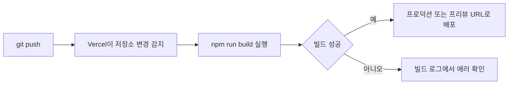

## 개념 정리

### next build가 하는 일

`npm run dev`는 개발 중 빠른 반영을 위해 매번 필요한 부분만 컴파일합니다. `npm run build`는 배포용 프로덕션 빌드를 한 번에 만듭니다.

15편에서 `app/layout.js`에 `getSession()`을 추가하면서 모든 페이지가 이 레이아웃을 거치게 됐습니다. `getSession()`은 내부에서 `cookies()`를 호출하는데, `cookies()`는 요청이 와야만 값을 알 수 있는 요청 시점 API라서, 이를 쓰는 레이아웃 아래의 모든 라우트는 정적으로 미리 만들어지지 못하고 요청마다 서버에서 다시 그려지는 동적 라우트가 됩니다.

### .env.local과 .env.example의 역할 분리

| 파일 | 내용 | git 커밋 여부 |
|---|---|---|
| `.env.local` | 실제 비밀 값(`SESSION_SECRET`의 진짜 문자열) | 안 함(`.gitignore`에 이미 포함) |
| `.env.example` | 필요한 환경 변수 이름만, 값은 비움 | 함(다른 사람이 프로젝트를 받았을 때 무엇을 채워야 하는지 알려주는 문서 역할) |

Vercel은 배포할 때 로컬의 `.env.local`을 함께 가져가지 않습니다. 배포 환경에서 쓸 값은 Vercel 프로젝트 설정 화면에 따로 등록해야 합니다.

### Vercel 배포 흐름

```mermaid
flowchart LR
  A[git push] --> B[Vercel이 저장소 변경 감지]
  B --> C[npm run build 실행]
  C --> D{빌드 성공}
  D -- 예 --> E[프로덕션 또는 프리뷰 URL로 배포]
  D -- 아니오 --> F[빌드 로그에서 에러 확인]
```

GitHub 저장소를 Vercel 프로젝트에 연결해두면, 이후로는 커밋을 `push`할 때마다 이 과정이 자동으로 반복됩니다. 기본 브랜치(main 등)에 올린 커밋은 프로덕션 배포로, 그 외 브랜치는 프리뷰 배포로 구분됩니다.

### Vercel Functions의 읽기 전용 파일 시스템

로컬 개발 환경에서는 문제없이 동작하지만, Vercel에 배포된 서버리스 함수는 배포된 코드가 담긴 파일 시스템이 **읽기 전용**입니다. 쓰기가 가능한 공간은 `/tmp` 뿐이고 그마저도 최대 500MB, 함수 인스턴스가 새로 뜨거나 재활용될 때마다 초기화되어 영구 저장소로 쓸 수 없습니다.

그 결과 배포 환경에서 책 등록·수정·삭제를 시도하면 `lib/db.js`의 쓰기 시도가 실패해 서버 에러가 됩니다. 반대로 로그인·로그아웃은 파일을 쓰지 않고 쿠키만 주고받으므로 배포 환경에서도 그대로 동작합니다.

### process.env.VERCEL로 배포 환경 감지

Vercel은 배포된 함수에 `VERCEL`, `VERCEL_ENV` 같은 시스템 환경 변수를 자동으로 주입합니다. 다만 프로젝트 설정의 **System Environment Variables** 접근 옵션을 켜야 코드에서 `process.env.VERCEL` 값을 읽을 수 있습니다.

## 자주 하는 실수

| 증상 | 원인 | 고치는 법 |
|------|------|-----------|
| `.env.local`이 GitHub 저장소에 그대로 올라감 | `.gitignore`를 확인하지 않고 강제로 추가함(`git add -f` 등) | `.env.local`은 절대 커밋하지 않는다. 실수로 올렸다면 값을 즉시 교체하고 커밋 이력에서 제거한다 |
| 배포 후 로그인 시도마다 서버 에러 | Vercel 프로젝트에 `SESSION_SECRET`을 등록하지 않음 | Settings → Environment Variables에 값을 추가하고 다시 배포한다 |
| 배포 환경에서 안내 배너가 안 보임 | System Environment Variables 접근을 켜지 않아 `process.env.VERCEL`이 항상 비어 있음 | Settings에서 체크박스를 켜고 재배포한다 |

## 확인 문제

<Quiz
  questionNumber={1}
  question={".env.example 파일을 git에 커밋하는 이유는"}
  options={["실제 비밀 값을 안전하게 배포하기 위해서","어떤 환경 변수가 필요한지 키 이름만 문서처럼 남기기 위해서","Next.js가 빌드 시 이 파일의 값을 실제로 사용하기 때문에",".env.local 대신 항상 이 파일을 읽기 때문에"]}
  correctAnswer={2}
  explanation={".env.example은 값 없이 키 이름만 담아, 프로젝트를 받은 사람이 어떤 환경 변수를 채워야 하는지 알 수 있게 하는 문서 역할을 합니다."}
/>

<Quiz
  questionNumber={2}
  question={"Vercel Functions의 파일 시스템 특징으로 옳은 것은"}
  options={["모든 경로에 자유롭게 쓸 수 있다","배포된 코드 영역은 읽기 전용이고 /tmp만 제한된 용량으로 쓸 수 있다","파일 쓰기가 완전히 금지되어 있다","쓰기는 가능하지만 속도가 느릴 뿐이다"]}
  correctAnswer={2}
  explanation={"Vercel Functions는 배포된 코드가 담긴 파일 시스템이 읽기 전용이고, /tmp에만 최대 500MB까지 쓸 수 있으며 그마저 영구 저장되지 않습니다."}
/>

<Quiz
  questionNumber={3}
  question={"DeploymentNotice 컴포넌트가 process.env.VERCEL 값을 읽으려면 미리 해야 하는 설정은"}
  options={["next.config.js에 배너 문구를 등록한다","Vercel 프로젝트 설정에서 System Environment Variables 접근을 켠다","SESSION_SECRET을 두 번 등록한다","app/layout.js를 클라이언트 컴포넌트로 바꾼다"]}
  correctAnswer={2}
  explanation={"Vercel은 System Environment Variables 접근을 켜야 VERCEL 같은 시스템 환경 변수를 함수 코드에서 읽을 수 있게 해줍니다."}
/>

## 참고 자료

- [Next.js Docs — Deploying](https://nextjs.org/docs/app/getting-started/deploying)
- [Vercel Docs — Deployments](https://vercel.com/docs/deployments)
- [Vercel Docs — System Environment Variables](https://vercel.com/docs/environment-variables/system-environment-variables)
