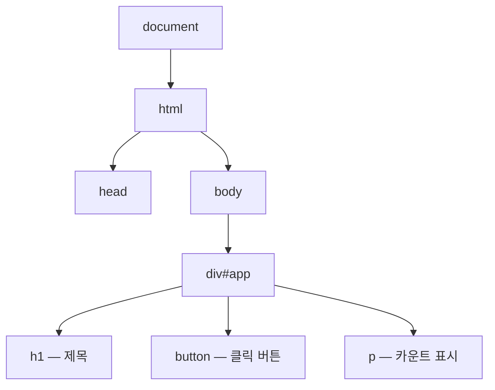
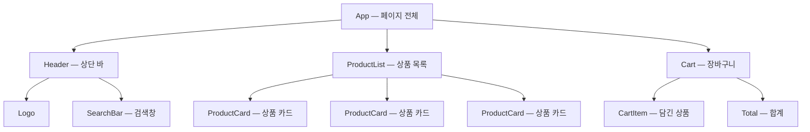

<Callout type="info">
  **이번 문서의 목표:** React 문법을 배우기 전에, React가 없던 시절의 문제를 직접 겪어보고 — 선언적 UI, 컴포넌트 모델, 렌더는 함수 호출이라는 React의 세 가지 핵심 사고방식을 내 언어로 설명할 수 있게 된다.
</Callout>

## 왜 이 문서부터 시작하는가

React 강의 대부분은 "React는 UI 라이브러리입니다"라는 문장으로 시작합니다. 그런데 이 문장은 **React가 없어서 고통받아 본 적 없는 사람에게는 아무 의미가 없습니다.** 덧셈의 불편함을 모르면 곱셈이 왜 필요한지 모르는 것과 같습니다.

그래서 이 문서는 순서를 뒤집습니다. 먼저 React 없이 자바스크립트(JavaScript)만으로 화면을 만들어보고, 그 방식이 왜 규모가 커지면 무너지는지 직접 확인합니다. 그 고통이 손에 잡힌 다음에야 React의 해결책이 "아, 그래서 이렇게 만들었구나"로 다가옵니다.

## 1. React 이전의 세계 — 명령형 DOM 조작

### DOM이란 무엇이었나

먼저 용어부터 잡고 갑니다. **DOM**(Document Object Model, 문서 객체 모델)은 브라우저가 HTML 문서를 읽어서 만든 **객체 트리**입니다. document라는 뿌리에서 시작해, 모든 태그가 트리의 마디(node, 노드)로 매달려 있습니다. 자바스크립트(JavaScript)는 이 트리를 붙잡고 내용을 바꾸거나, 마디를 추가·삭제할 수 있습니다.



> **쉽게 말하면:** DOM은 브라우저가 들고 있는 화면의 설계도이고, 자바스크립트는 그 설계도를 펜으로 직접 고치는 손입니다.

### 명령형으로 카운터 만들기 — 직접 겪어보기

버튼을 누르면 숫자가 1씩 올라가는 카운터를 React 없이 만들어 봅시다. 아래 실습기에서 버튼을 눌러보고, 코드도 직접 바꿔보세요.

<CodePlayground
  template="vanilla"
  activeFile="/index.js"
  label="React 없이 만든 카운터 — 명령형(imperative) 방식"
  files={{
    '/index.js': `// 1. 상태를 변수로 직접 들고 있는다
let count = 0;

// 2. 화면 요소를 하나하나 손으로 찾아온다
const app = document.getElementById("app");
const button = document.createElement("button");
button.textContent = "+1 올리기";
const display = document.createElement("p");
display.textContent = "현재 카운트: 0";

app.appendChild(button);
app.appendChild(display);

// 3. 이벤트가 일어나면, 데이터도 바꾸고 화면도 "직접" 바꾼다
button.addEventListener("click", function () {
  count = count + 1;              // 데이터 갱신
  display.textContent = "현재 카운트: " + count; // 화면 갱신 (잊으면 안 됨!)
});`,
  }}
/>

이 코드에서 주목할 점은 **한 번의 클릭에 해야 할 일이 두 가지**라는 것입니다.

1. 데이터 갱신 — `count = count + 1`
2. 화면 갱신 — `display.textContent = ...`

이렇게 "무엇을 할지"가 아니라 **"어떻게 할지"를 한 단계씩 브라우저에게 지시하는 방식**을 **명령형**(imperative, 임퍼러티브) 프로그래밍이라고 부릅니다. 요리로 치면 "양파를 썰고, 팬을 달구고, 기름을 두르고…"처럼 절차를 일일이 부르는 방식입니다.

### 이 방식이 무너지는 순간

카운터 하나면 문제없습니다. 그런데 실제 서비스를 상상해 봅시다. 쇼핑몰 장바구니에 상품을 하나 담으면 화면에서 바뀌어야 하는 곳이 몇 군데일까요?

- 장바구니 아이콘의 숫자 배지
- 장바구니 목록의 상품 행
- 합계 금액
- "구매하기" 버튼의 활성화 여부
- 무료배송까지 남은 금액 안내 문구

**데이터는 한 번 바뀌었는데, 화면 갱신 코드는 다섯 군데**에 필요합니다. 명령형 방식에서는 이 다섯 군데를 전부 개발자가 기억하고 직접 갱신해야 합니다. 한 군데라도 빠뜨리면 — 데이터는 3개인데 배지는 2개로 표시되는, 그 유명한 "**화면과 데이터가 어긋난 버그**"가 태어납니다.

화면을 바꾸는 코드가 이벤트 핸들러마다 흩어져 있으니, 서비스가 커질수록 "지금 이 화면이 왜 이 상태이지?"를 추적하는 일이 기하급수적으로 어려워집니다. 2010년대 초반의 프론트엔드 개발자들이 매일 겪던 고통이고, React는 정확히 이 문제를 겨냥해 2013년에 등장했습니다.

## 2. React의 답 ① — 선언적 UI

### 발상의 전환: 화면을 갱신하지 말고, 다시 그리자

React의 첫 번째 답은 이렇습니다.

> **쉽게 말하면:** "데이터가 바뀔 때마다 화면 어디를 고칠지 고민하지 마라. 그냥 **데이터가 이럴 때 화면은 이렇게 생겼다**고 선언만 해라. 갱신은 React가 알아서 한다."

이런 방식을 **선언형**(declarative, 디클래러티브) 프로그래밍이라고 합니다. 명령형이 "어떻게(how)"의 절차를 나열한다면, 선언형은 **"무엇**(what)**"이 되어야 하는지 결과만 기술**합니다.

같은 카운터를 React로 쓰면 이렇게 됩니다. 버튼을 눌러보고, 명령형 버전과 코드 구조를 비교해 보세요.

<CodePlayground
  template="react"
  activeFile="/App.js"
  label="React로 만든 카운터 — 선언형(declarative) 방식"
  files={{
    '/App.js': `import { useState } from "react";

export default function App() {
  const [count, setCount] = useState(0);

  // "화면이 어떻게 생겼는지"만 선언한다.
  // display.textContent = ... 같은 화면 갱신 코드가 없다!
  return (
    <div>
      <button onClick={() => setCount(count + 1)}>+1 올리기</button>
      <p>현재 카운트: {count}</p>
    </div>
  );
}`,
  }}
/>

차이가 보이시나요? React 버전에는 **화면을 갱신하는 코드가 한 줄도 없습니다.** `setCount`로 데이터만 바꾸면, "현재 카운트: `{count}`"라는 선언에 따라 화면이 알아서 다시 그려집니다. 장바구니 예시로 돌아가면 — 상품 배열에 하나를 추가하기만 하면, 배지·목록·합계·버튼·안내 문구가 각자의 선언에 따라 전부 자동으로 갱신됩니다. 다섯 군데를 기억할 필요가 사라졌습니다.

### 핵심 공식: UI는 상태의 함수다

이 사고방식을 프론트엔드 세계에서는 공식 하나로 요약합니다.

$$
UI = f(state)
$$

- $UI$ : 지금 화면에 보이는 모습
- $f$ : 컴포넌트(component) — 화면 조각을 만들어내는 **함수**
- $state$ (스테이트, 상태) : 화면을 그리는 데 필요한 **데이터**

읽는 법은 "UI는 state를 넣었을 때 f가 뱉어내는 결과물이다"입니다. 수학에서 $f(x) = 2x$에 $x=3$을 넣으면 항상 6이 나오듯, **같은 상태**(state)**를 넣으면 항상 같은 화면**(UI)**이 나온다** — 이것이 React 전체를 관통하는 단 하나의 공식입니다. 상태가 3에서 4로 바뀌면? 함수를 다시 호출해서 새 화면을 얻으면 됩니다. "고치는" 게 아니라 "다시 계산하는" 겁니다.

### 두 방식 비교 정리

| 비교 항목 | 명령형 — React 이전 | 선언형 — React |
|-----------|--------------------|----------------|
| 개발자가 쓰는 코드 | 절차: 요소를 찾고, 만들고, 바꾼다 | 결과: 상태가 이럴 때 화면은 이렇다 |
| 데이터 변경 시 | 관련된 화면 갱신 코드를 전부 직접 호출 | 상태만 바꾸면 React가 다시 그림 |
| 화면–데이터 불일치 버그 | 개발자가 갱신을 빠뜨리면 발생 | 구조적으로 일어나기 어려움 |
| 코드가 커질수록 | 갱신 지점이 흩어져 추적 곤란 | 선언이 모여 있어 읽기 쉬움 |

<Callout type="warning">
  **자주 틀리는 점:** "선언형이 명령형보다 무조건 우월하다"로 외우면 안 됩니다. 선언형의 대가는 **다시 그리는 비용**입니다. React는 이 비용을 줄이려고 실제 DOM을 통째로 갈아엎지 않고, 이전 화면과 새 화면을 비교해 **달라진 부분만** 실제 DOM에 반영합니다. 이 비교 과정을 재조정(reconciliation, 리컨실리에이션)이라고 부르는데, 4편에서 key와 함께 자세히 다룹니다. 지금은 "React가 손해를 안 보려고 똑똑한 비교를 한다" 정도만 기억하면 충분합니다.
</Callout>

## 3. React의 답 ② — 컴포넌트 모델

### 화면을 레고 블록으로 쪼갠다

React의 두 번째 답은 화면 구성 방식에 대한 것입니다. 페이지 전체를 하나의 거대한 HTML 덩어리로 짜는 대신, **컴포넌트**(component, 구성 요소)라는 작은 조각으로 쪼개서 조립합니다.

> **쉽게 말하면:** 컴포넌트는 자기 화면 조각과 그 조각의 동작을 함께 들고 있는 레고 블록입니다. 블록을 조립해 페이지를 만들고, 같은 블록은 몇 번이든 재사용합니다.

쇼핑몰 페이지를 컴포넌트로 쪼개면 이런 트리(tree, 나무 구조)가 됩니다.



여기서 두 가지를 관찰할 수 있습니다.

1. **재사용**: ProductCard 블록 하나를 만들어두면 상품이 100개여도 같은 블록을 100번 찍어냅니다. 카드 디자인 수정은 한 파일에서 끝납니다.
2. **관심사의 분리**: 검색창의 버그는 SearchBar 안에만 있습니다. 장바구니 코드를 뒤질 필요가 없습니다. 문제의 범위가 블록 단위로 좁혀집니다.

### 컴포넌트의 정체는 그냥 함수다

그럼 컴포넌트는 실제 코드에서 뭘까요? 특별한 문법일 것 같지만, 현대 React에서 컴포넌트의 정체는 **화면 조각을 반환**(return)**하는 자바스크립트 함수**입니다.

```jsx
// 이것이 컴포넌트의 전부다 — 화면 조각을 반환하는 함수
function Greeting() {
  return <h1>안녕하세요!</h1>;
}
```

함수 안의 HTML처럼 생긴 `<h1>...</h1>` 부분은 **JSX**(JavaScript XML, 자바스크립트 XML)라는 문법 확장입니다. "자바스크립트 파일 안에 화면 모양을 함께 적을 수 있게 해주는 문법"인데, 브라우저가 직접 읽지는 못해서 변환 과정을 거칩니다 — 그 원리는 다음 2편에서 통째로 다룹니다.

### 렌더 = 함수 호출

여기서 이 과목 전체를 지탱할 가장 중요한 문장이 나옵니다.

<Callout type="info">
  **렌더**(render, 화면 그리기)**란 React가 컴포넌트 함수를 호출하는 것이다.**
</Callout>

과장이 아니라 문자 그대로입니다. React가 Greeting 컴포넌트를 화면에 그린다는 것은, 내부적으로 `Greeting()`을 **호출해서 반환값을 받아보는 일**입니다. 앞의 공식과 연결하면:

- 컴포넌트 = 함수 $f$
- 렌더 = $f(state)$를 **호출**하는 것
- 리렌더(re-render, 다시 그리기) = 상태가 바뀌어서 $f$를 **다시 호출**하는 것

이 관점이 잡혀 있으면 뒤에서 배울 내용이 전부 자연스러워집니다. "상태가 바뀌면 리렌더된다"(7편)는 "인자가 바뀌었으니 함수를 다시 호출한다"는 뜻이고, "렌더는 순수해야 한다"(8편)는 "같은 입력이면 같은 출력을 내는 함수여야 한다"는 뜻입니다. 반대로 이 관점 없이 문법만 외우면, useState와 useEffect에서 반드시 길을 잃습니다.

## 4. React의 자리 — 라이브러리, SPA, 그리고 생태계

### React는 프레임워크가 아니라 라이브러리다

React 공식 문서는 React를 **라이브러리**(library, 부품 모음)라고 부릅니다. 프레임워크(framework, 뼈대)와의 차이는 **주도권**입니다.

| 구분 | 라이브러리 — React | 프레임워크 — Angular, Next.js 등 |
|------|--------------------|----------------------------------|
| 주도권 | 내 코드가 필요할 때 부품을 가져다 씀 | 뼈대가 정한 구조에 내 코드를 끼워 넣음 |
| 담당 범위 | UI를 그리는 일에 집중 | 라우팅·데이터·빌드까지 포괄 |
| 자유도 | 높음 — 조합을 스스로 결정 | 낮은 대신 결정할 것이 적음 |

React 자체는 "UI 그리기"만 담당합니다. 페이지 이동(라우팅), 서버 데이터 관리, 전역 상태 같은 것들은 React 생태계의 다른 도구들이 맡고, 그것들은 이 사이트의 후속 과목(react-2, react-3)에서 다룹니다. 이 과목은 React라는 부품 자체를 깊게 파는 단계입니다.

### SPA라는 맥락

React가 주로 쓰이는 무대는 **SPA**(Single Page Application, 단일 페이지 애플리케이션)입니다. 전통적인 웹은 링크를 누를 때마다 서버가 새 HTML 페이지를 통째로 보내줬습니다. SPA는 **HTML 페이지를 처음에 한 번만** 받고, 그 뒤로는 자바스크립트가 데이터만 받아 화면을 갈아 끼웁니다. 앱처럼 부드럽게 동작하는 대신, "자바스크립트로 화면을 계속 다시 그리는 일"이 폭증하죠 — 바로 그 일을 잘하라고 만든 도구가 React입니다.

### 요즘도 React인가?

2013년에 나온 도구를 지금 배워도 되는지 궁금할 수 있습니다. 현 시점에도 React는 프론트엔드 채용·사용률 통계에서 가장 널리 쓰이는 UI 라이브러리이고, 이 사이트가 다루는 Next.js 같은 최신 프레임워크들도 React를 심장으로 삼고 있습니다. 무엇보다 — 선언적 UI와 컴포넌트 모델은 React를 넘어 Vue, Svelte, 모바일의 SwiftUI·Jetpack Compose까지 퍼진 **현대 UI 개발의 공용 사고방식**이라, 여기서 익힌 원리는 도구가 바뀌어도 그대로 이월됩니다.

## 핵심 정리

- 명령형 DOM 조작은 데이터 변경과 화면 갱신을 개발자가 전부 챙겨야 해서, 규모가 커지면 화면–데이터 불일치 버그가 필연적으로 생긴다.
- React의 답 ①은 **선언적 UI** — 상태가 이럴 때 화면이 이렇다고 선언만 하면, 갱신은 React가 맡는다. 공식은 $UI = f(state)$.
- React의 답 ②는 **컴포넌트 모델** — 화면을 재사용 가능한 블록으로 쪼개 조립하며, 컴포넌트의 정체는 화면 조각을 반환하는 함수다.
- **렌더 = 컴포넌트 함수 호출, 리렌더 = 다시 호출.** 이 관점이 이 과목 전체의 기둥이다.
- React는 UI만 담당하는 라이브러리이며, SPA라는 무대에서 "화면을 계속 다시 그리는 일"을 잘하기 위해 태어났다.

## 마무리 복습

<Quiz
  questionNumber={1}
  question="명령형(imperative) DOM 조작 방식의 가장 본질적인 문제로 알맞은 것은?"
  options={['자바스크립트 실행 속도가 항상 React보다 느리다', '데이터가 바뀔 때 관련된 화면 갱신을 개발자가 전부 직접 챙겨야 해서 불일치 버그가 생기기 쉽다', 'HTML과 CSS를 함께 사용할 수 없다', 'DOM 트리에는 이벤트를 연결할 수 없다']}
  correctAnswer={2}
  explanation="명령형 방식은 데이터 갱신과 화면 갱신이 분리되어 있어, 개발자가 갱신 지점을 하나라도 빠뜨리면 화면과 데이터가 어긋난다. 속도나 CSS 사용 여부의 문제가 아니다."
  optionExplanations={['속도는 방식의 본질적 차이가 아니며, 단순한 화면에서는 명령형이 더 빠를 수도 있다', '정답 — 갱신 지점이 코드 곳곳에 흩어지고, 하나만 놓쳐도 화면과 데이터가 어긋난다', 'HTML·CSS 사용과는 무관하다', 'addEventListener로 이벤트 연결이 가능하다 — 본문 카운터 예제가 그 예다']}
/>

<Quiz
  questionNumber={2}
  question="공식 UI = f(state) 에서 f 에 해당하는 것은?"
  options={['브라우저의 DOM', '컴포넌트', 'state 데이터', '이벤트 핸들러']}
  correctAnswer={2}
  explanation="컴포넌트가 함수 f이고, 상태 state를 입력받아 화면 UI를 출력한다. DOM은 출력이 최종 반영되는 곳이고, state는 입력값이다."
  optionExplanations={['DOM은 f의 결과가 반영되는 대상이지 f 자체가 아니다', '정답 — 컴포넌트는 상태를 받아 화면을 반환하는 함수다', 'state는 f에 들어가는 입력값이다', '이벤트 핸들러는 state를 바꾸는 계기일 뿐, 화면을 만들어내는 함수가 아니다']}
/>

<Quiz
  questionNumber={3}
  question="React에서 렌더(render)의 의미를 가장 정확하게 표현한 것은?"
  options={['컴포넌트 함수를 호출해서 화면 조각을 얻는 것', 'HTML 파일을 서버에서 새로 내려받는 것', 'CSS를 다시 계산하는 것', 'DOM 트리를 전부 삭제하고 처음부터 다시 만드는 것']}
  correctAnswer={1}
  explanation="렌더는 React가 컴포넌트 함수를 호출하는 것이다. 리렌더는 그 함수를 다시 호출하는 것이며, 실제 DOM에는 이전 결과와 비교해 달라진 부분만 반영된다."
  optionExplanations={['정답 — 렌더 = 함수 호출이라는 관점이 이 과목 전체의 기둥이다', '그건 전통적인 다중 페이지 방식의 동작이다', 'CSS 재계산은 브라우저의 별도 과정이다', 'React는 재조정 과정을 통해 달라진 부분만 반영하지, 전부 삭제 후 재생성하지 않는다']}
/>

<Quiz
  questionNumber={4}
  question="선언형 UI 방식에 대한 설명으로 틀린 것은?"
  options={['상태가 바뀌면 React가 화면을 다시 그려준다', '개발자는 상태에 따른 화면의 모습만 기술한다', '어떤 요소를 어떤 순서로 고칠지 절차를 직접 나열한다', '화면과 데이터의 불일치 버그가 구조적으로 일어나기 어렵다']}
  correctAnswer={3}
  explanation="절차를 한 단계씩 직접 나열하는 것은 명령형 방식의 특징이다. 선언형은 결과만 기술하고 절차는 React에 맡긴다."
  optionExplanations={['선언형의 특징이 맞다 — 상태 변경 후 갱신은 React 담당', '선언형의 정의 그 자체다', '정답(틀린 설명) — 이것은 명령형의 특징이다', '갱신을 React가 일괄 담당하므로 맞는 설명이다']}
/>

<Quiz
  questionNumber={5}
  question="컴포넌트 모델의 장점으로 보기 어려운 것은?"
  options={['같은 블록을 여러 곳에서 재사용할 수 있다', '버그의 범위가 해당 블록 안으로 좁혀진다', '화면 조각과 그 동작을 한 단위로 묶어 관리한다', '컴포넌트를 쓰면 자바스크립트 없이도 동적인 화면을 만들 수 있다']}
  correctAnswer={4}
  explanation="컴포넌트는 자바스크립트 함수이므로 자바스크립트 없이는 성립하지 않는다. 재사용, 문제 범위 축소, 화면과 동작의 응집이 컴포넌트 모델의 실제 장점이다."
  optionExplanations={['ProductCard 하나로 상품 100개를 그리는 것이 재사용의 예다', '검색창 버그는 SearchBar 안에서만 찾으면 된다', '레고 블록 비유의 핵심이다', '정답(장점 아님) — 컴포넌트의 정체가 곧 자바스크립트 함수다']}
/>

<Quiz
  questionNumber={6}
  question="React를 프레임워크가 아니라 라이브러리라고 부르는 이유로 가장 알맞은 것은?"
  options={['규모가 작은 프로젝트에서만 쓸 수 있기 때문', 'UI를 그리는 일에 집중하고, 라우팅·데이터 관리 등은 다른 도구와 조합해 쓰기 때문', '설치 없이 브라우저에 내장되어 있기 때문', '자바스크립트가 아닌 별도 언어를 사용하기 때문']}
  correctAnswer={2}
  explanation="React는 UI 그리기라는 한 가지 역할에 집중하는 부품이며, 전체 앱의 구조를 강제하지 않는다. 라우팅·상태관리 등은 생태계의 다른 도구를 조합한다."
  optionExplanations={['페이스북 규모의 서비스도 React로 만들어진다', '정답 — 담당 범위가 UI에 집중되어 있고 주도권이 내 코드에 있다', 'React는 npm 등으로 설치하는 외부 라이브러리다', 'React는 자바스크립트로 작성하며 JSX도 결국 자바스크립트로 변환된다']}
/>

## 참고 자료

- [React 공식 문서 - Learn: Your First Component](https://react.dev/learn)
- [MDN - React 시작하기 튜토리얼](https://developer.mozilla.org/en-US/docs/Learn_web_development/Core/Frameworks_libraries/React)
