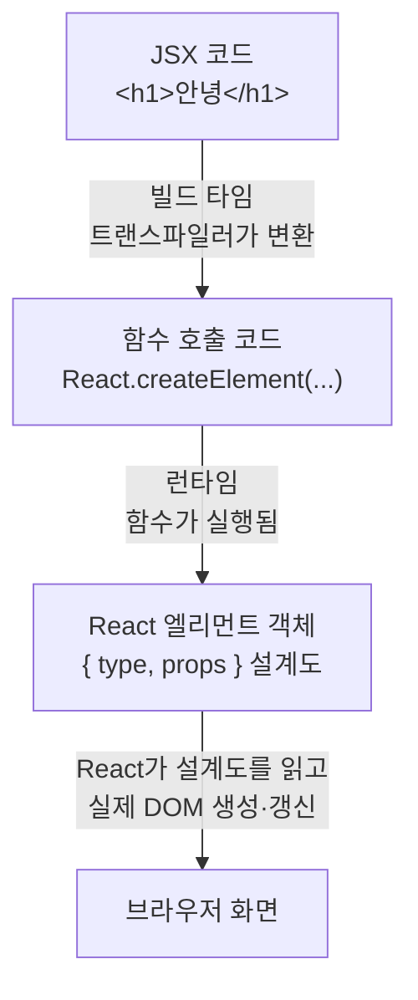

<Callout type="info">
  **이번 문서의 목표:** JSX가 브라우저가 모르는 문법 확장이라는 사실, 그리고 Babel 같은 트랜스파일러가 JSX를 `React.createElement` 함수 호출로 바꿔주는 전체 과정을 원리 수준에서 설명할 수 있게 된다.
</Callout>

## 왜 JSX부터 따로 배우는가

1편에서 컴포넌트의 정체는 "화면 조각을 반환하는 함수"라고 했습니다. 그런데 그 함수 안에는 이런 코드가 들어 있었습니다.

```jsx
function Greeting() {
  return <h1>안녕하세요!</h1>;
}
```

자바스크립트(JavaScript)를 배운 사람이라면 여기서 멈칫해야 정상입니다. **자바스크립트 함수가 어떻게 HTML 태그를 반환하지?** 자바스크립트 문법책 어디에도 `return <h1>...` 같은 문법은 없습니다. 실제로 이 코드를 브라우저 콘솔에 그대로 붙여넣으면 **문법 오류**(SyntaxError, 신택스 에러)가 납니다.

이 "말이 안 되는 문법"이 어떻게 동작하는지를 모른 채 React를 배우면, JSX를 마법 같은 특수 언어로 오해하게 되고, 조건부 렌더링이나 리스트 렌더링(4편)에서 "왜 if문은 안 되고 삼항 연산자는 되지?" 같은 질문에 답할 수 없게 됩니다. 반대로 이 문서에서 변환 원리를 잡아두면, JSX의 모든 규칙이 "아, 결국 자바스크립트라서 그렇구나"라는 한 문장으로 정리됩니다.

## 1. JSX의 정체 — 자바스크립트 문법 확장

### JSX라는 이름 풀어보기

**JSX**는 JavaScript XML의 줄임말입니다. 이름을 쪼개 보면 정체가 보입니다.

- **JS** — JavaScript. 바탕이 되는 언어는 어디까지나 자바스크립트입니다.
- **X** — XML(eXtensible Markup Language, 확장 가능한 마크업 언어). HTML처럼 꺾쇠 태그로 구조를 표현하는 표기법의 큰 분류입니다. HTML도 XML과 사촌지간인 마크업(markup, 문서에 구조 표시를 붙이는 것) 언어입니다.

즉 JSX는 "자바스크립트 안에 XML풍 태그 표기를 섞어 쓸 수 있게 한 것"이라는 뜻입니다. 여기서 결정적인 단어가 **문법 확장**(syntax extension, 신택스 익스텐션)입니다.

> **쉽게 말하면:** JSX는 새로운 언어가 아니라, 자바스크립트에 "태그 모양 표기법"을 얹은 사투리입니다. 표준 자바스크립트가 아니므로 브라우저는 못 읽고, 읽을 수 있는 표준어로 번역해 줘야 합니다.

### 문법 확장이란 무엇인가

자바스크립트라는 언어에는 **ECMAScript**(에크마스크립트)라는 공식 표준 문법이 있습니다. 브라우저의 자바스크립트 엔진(engine, 코드를 해석·실행하는 프로그램)은 이 표준에 있는 문법만 이해합니다. `let`, 화살표 함수, `import` 같은 것들이 전부 표준에 등재된 문법입니다.

JSX는 이 표준에 **없습니다**. React 팀이 "표준 밖에서" 추가로 정의한 문법 규칙이라서, 표준만 아는 브라우저 엔진에게 JSX는 그냥 오타 덩어리입니다. 비유하면 이렇습니다 — 한국어 표준어 사전만 가진 번역기에 제주 방언을 넣으면 번역이 실패합니다. 방언을 쓰고 싶으면, 먼저 **방언을 표준어로 바꿔주는 중간 번역가**가 필요합니다. 그 중간 번역가가 곧 이 문서의 후반부 주인공인 트랜스파일러(transpiler)입니다.

### 왜 이런 사투리를 만들었을까

React 팀이 굳이 표준에 없는 문법을 만든 이유는 1편의 컴포넌트 모델과 이어집니다. 컴포넌트는 "화면 조각과 그 동작을 한 단위로" 묶습니다. 그런데 화면 모양은 HTML 파일에, 동작은 JS 파일에 따로 쓰던 기존 방식으로는 이 묶음이 어렵습니다. 그래서 **화면 모양을 자바스크립트 코드 안에 직접 적을 수 있는 표기법**을 만든 것입니다. 로직과 화면이 한 함수 안에 살게 되면서, "이 버튼이 눌리면 이 화면이 이렇게 변한다"를 한눈에 읽을 수 있게 됩니다.

참고로 JSX 없이도 React는 쓸 수 있습니다. 다만 곧 보게 될 변환 결과물을 손으로 직접 써야 해서 몹시 고통스러울 뿐입니다.

## 2. JSX 요소 — 태그처럼 생긴 값

### JSX 표현식은 값이다

JSX에서 가장 먼저 익혀야 할 감각은 이것입니다. **JSX 태그 덩어리 하나는 통째로 하나의 값이다.**

자바스크립트에서 값(value)이란 변수에 담거나, 함수 인자로 넘기거나, 함수에서 반환할 수 있는 모든 것입니다. 숫자 `42`, 문자열 `"hello"`, 객체가 값이듯, JSX 요소도 값입니다. 그래서 이런 코드가 전부 성립합니다.

```jsx
// 변수에 담기
const 인사말 = <h1>안녕하세요!</h1>;

// 함수에서 반환하기
function Greeting() {
  return 인사말;
}

// 배열에 넣기
const 목록 = [<li>사과</li>, <li>배</li>];
```

값으로 취급되는 표기를 문법 용어로 **표현식**(expression, 익스프레션)이라고 합니다. 표현식이란 "평가하면 하나의 값이 나오는 코드 조각"입니다. `1 + 2`는 평가하면 3이 나오는 표현식이고, `<h1>안녕</h1>`은 평가하면 어떤 값이 나오는 표현식입니다. 무슨 값이 나오는지는 4절에서 밝혀집니다 — 미리 말하면, HTML도 DOM 노드도 아닌 **평범한 자바스크립트 객체**가 나옵니다.

> **쉽게 말하면:** JSX 태그는 문서에 박히는 마크업이 아니라, 계산하면 객체가 나오는 수식입니다. `1 + 2`를 쓰는 자리라면 어디든 JSX도 쓸 수 있습니다.

### HTML과 닮았지만 다른 규칙들

JSX는 HTML을 닮게 디자인됐지만, 정체가 자바스크립트라서 HTML과 어긋나는 규칙이 몇 가지 있습니다. 원리를 알면 전부 외울 필요가 없어집니다 — **자바스크립트의 기존 문법과 충돌하는 부분만 바뀌었기 때문**입니다.

| 항목 | HTML | JSX | 이유 |
|------|------|-----|------|
| 클래스 지정 | `class="box"` | `className="box"` | `class`는 자바스크립트의 예약어(클래스 문법)라 충돌 |
| 라벨 연결 | `for="id"` | `htmlFor="id"` | `for`도 반복문 예약어라 충돌 |
| 속성 이름 표기 | `onclick`, `tabindex` | `onClick`, `tabIndex` | 자바스크립트 관례인 카멜케이스(camelCase)를 따름 |
| 홑태그 닫기 | `<br>` 허용 | `<br />` 필수 | XML 문법 기반이라 모든 태그는 반드시 닫아야 함 |
| 주석 | `<!-- 주석 -->` | `{/* 주석 */}` | 자바스크립트 주석을 중괄호 표현식으로 삽입 |

여기서 **예약어**(reserved word)란 언어가 자기 문법용으로 미리 찜해 둔 단어를 말합니다. 자바스크립트에서 `class`는 클래스를 선언하는 키워드로 이미 쓰이고 있어서, JSX 속성 이름으로 그대로 쓰면 해석이 꼬입니다. 그래서 DOM(Document Object Model, 문서 객체 모델 — 1편 참고)이 원래 쓰던 속성명 `className`을 가져온 것입니다.

**카멜케이스**(camelCase)는 `tabIndex`처럼 단어 경계마다 대문자를 넣는 표기법으로, 낙타(camel) 등의 혹처럼 생겨서 붙은 이름입니다. 자바스크립트 세계의 변수·속성 명명 관례이고, JSX 속성은 결국 자바스크립트 객체의 속성이 되므로 이 관례를 따릅니다.

### 반드시 닫고, 반드시 하나로 감싼다

JSX에는 HTML보다 엄격한 구조 규칙이 두 가지 있습니다.

**규칙 1 — 모든 태그는 닫는다.** HTML에서는 `<br>`, ``처럼 닫지 않는 홑태그가 허용되지만, JSX는 XML 문법을 따르므로 `<br />`, ``처럼 스스로 닫는 표기(self-closing, 셀프 클로징)를 써야 합니다.

**규칙 2 — 반환하는 JSX는 뿌리 요소가 하나여야 한다.** 아래 코드는 오류입니다.

```jsx
// ❌ 오류 — 나란히 놓인 두 요소를 반환할 수 없다
function Profile() {
  return (
    <h1>이름</h1>
    <p>소개</p>
  );
}
```

왜일까요? 표현식은 "평가하면 **하나의** 값"이어야 하기 때문입니다. `return 1 2;`가 자바스크립트에서 말이 안 되는 것과 정확히 같은 이유입니다. 함수는 값을 하나만 반환할 수 있으니, JSX도 하나의 뿌리로 묶어야 합니다. 해결책은 두 가지입니다.

```jsx
// ✅ 방법 1 — div로 감싸기 (실제 DOM에 div가 생김)
return (
  <div>
    <h1>이름</h1>
    <p>소개</p>
  </div>
);

// ✅ 방법 2 — Fragment로 감싸기 (DOM에 아무 흔적도 남기지 않음)
return (
  <>
    <h1>이름</h1>
    <p>소개</p>
  </>
);
```

빈 태그처럼 생긴 `<>...</>`는 **Fragment**(프래그먼트, 조각)라는 특수 문법으로, "묶긴 묶되 실제 DOM에는 아무 태그도 만들지 마라"는 뜻입니다. 불필요한 `div`가 쌓이는 것을 막을 때 씁니다.

<Callout type="warning">
  **자주 틀리는 점:** `return` 뒤에서 줄을 바꾸고 JSX를 쓰면, 자바스크립트의 자동 세미콜론 삽입(ASI, Automatic Semicolon Insertion) 규칙이 `return;`으로 문장을 끝내버려 아무것도 반환되지 않습니다. 여러 줄 JSX는 반드시 소괄호 `( )`로 감싸는 습관을 들이세요. 위 예시들이 전부 소괄호를 쓰는 이유입니다.
</Callout>

### 중괄호 — 자바스크립트로 돌아가는 문

JSX 안에서 중괄호 `{ }`를 열면, 그 안은 다시 자바스크립트 세계입니다. 중괄호 안에는 **표현식**이라면 무엇이든 넣을 수 있습니다.

```jsx
const 이름 = "제노";
const 요소 = <h1>{이름}님, {1 + 1}번째 방문입니다</h1>;
```

"표현식이라면 무엇이든"이라는 조건이 곧 제약이기도 합니다. `if`문, `for`문 같은 **문**(statement, 스테이트먼트 — 값이 나오지 않는 실행 단위)은 중괄호 안에 넣을 수 없습니다. 값이 안 나오는 코드는 "이 자리에 무엇을 그릴지"를 답할 수 없기 때문입니다. 이 제약을 우회하는 조건부 렌더링·리스트 렌더링 패턴은 4편에서 통째로 다룹니다.

이 중괄호 규칙이 실제로 어떻게 동작하는지, 아래 실습기에서 값을 바꿔가며 확인해 보세요.

<CodePlayground
  template="react"
  activeFile="/App.js"
  label="JSX 중괄호 실험 — 표현식은 되고, 문은 안 된다"
  files={{
    '/App.js': `export default function App() {
  const 이름 = "제노";
  const 나이 = 20;
  const 취미들 = ["등산", "독서", "코딩"];

  return (
    <div>
      {/* 1. 변수 — 표현식이므로 OK */}
      <h2>{이름}의 프로필</h2>

      {/* 2. 계산식 — 표현식이므로 OK */}
      <p>내년 나이: {나이 + 1}살</p>

      {/* 3. 함수 호출 — 표현식이므로 OK */}
      <p>취미 개수: {취미들.length}개, 첫 취미: {취미들[0]}</p>

      {/* 4. 삼항 연산자 — 값이 나오는 표현식이므로 OK */}
      <p>{나이 >= 20 ? "성인" : "미성년자"}</p>

      {/* 5. if문은 여기 못 들어온다 — 값이 안 나오는 "문"이기 때문
          {if (나이 >= 20) { ... }}  ← 주석을 풀면 문법 오류! */}
    </div>
  );
}`,
  }}
/>

문자열 속성값에도 중괄호를 쓸 수 있습니다. ``처럼 속성값 자리에 중괄호를 쓰면 변수·표현식이 들어가고, ``처럼 따옴표를 쓰면 고정 문자열이 들어갑니다. 둘을 겹쳐 `src="{이미지주소}"`라고 쓰면 중괄호까지 포함된 문자 그대로의 문자열이 되어버리니 주의하세요.

## 3. 트랜스파일 — 사투리를 표준어로

### 컴파일과 트랜스파일

브라우저가 JSX를 못 읽는다면, 누군가 미리 번역해 둬야 합니다. 이 번역을 이해하려면 용어 두 개를 구분해야 합니다.

- **컴파일**(compile, 번역하다): 어떤 언어로 쓴 코드를 다른 형태의 코드로 변환하는 일 전반. 보통은 사람이 읽는 고수준 언어를 기계가 읽는 저수준 언어로 바꾸는 것을 가리킵니다.
- **트랜스파일**(transpile): 컴파일 중에서도 **비슷한 수준의 언어끼리** 변환하는 것. trans(가로질러) + compile의 합성어입니다. JSX가 섞인 자바스크립트를 표준 자바스크립트로 바꾸는 일은, 결과물도 여전히 사람이 읽을 수 있는 자바스크립트이므로 트랜스파일이라 부릅니다.

> **쉽게 말하면:** 컴파일이 "한국어를 기계어 신호로 바꾸는 일"이라면, 트랜스파일은 "제주 방언을 표준어로 바꾸는 일"입니다. 결과물도 같은 한국어(자바스크립트)입니다.

이 일을 해주는 도구가 **트랜스파일러**(transpiler)이고, React 세계에서 가장 유명한 트랜스파일러가 **Babel**(바벨)입니다. 이름은 성경의 바벨탑 이야기 — 언어가 갈라진 사건 — 에서 따왔습니다. 갈라진 언어들 사이를 이어주는 도구라는 재치 있는 작명이죠. 요즘 개발 환경(12편에서 다룰 Vite 등)에서는 esbuild, SWC 같은 더 빠른 트랜스파일러가 같은 역할을 맡기도 하지만, 하는 일의 본질은 동일합니다.

### 언제, 어디서 변환되는가

중요한 사실: 트랜스파일은 **브라우저에서 코드가 실행되기 전에, 개발자의 컴퓨터**(또는 빌드 서버)**에서 미리** 일어납니다. 전체 흐름은 이렇습니다.


- **개발 단계**: 개발자는 JSX가 섞인 파일을 씁니다.
- **빌드 단계**: 트랜스파일러가 JSX를 표준 자바스크립트 함수 호출로 바꿉니다. 이 시점을 빌드 타임(build time)이라 합니다.
- **실행 단계**: 브라우저에는 변환이 끝난 표준 자바스크립트만 도착하므로, 브라우저는 JSX의 존재조차 모릅니다. 이 시점이 런타임(runtime, 실행 시점)입니다.

비유하자면 해외 출판입니다. 한국어 원고(JSX 포함 코드)를 쓰고, 출판 전에 번역가(Babel)가 영어판(표준 JS)을 만들어 서점(브라우저)에 보냅니다. 독자는 영어판만 읽으므로 원고가 한국어였다는 사실을 알 필요가 없습니다.

<Callout type="warning">
  **자주 틀리는 점:** "브라우저가 JSX를 해석한다"고 이해하면 안 됩니다. 브라우저에 도착하는 코드에는 JSX가 한 글자도 없습니다. 개발 중 브라우저 개발자 도구에서 JSX가 보이는 것은 소스맵(source map)이라는 "원본 대조표" 덕분에 원본을 보여주는 것일 뿐, 실제 실행되는 코드는 변환본입니다.
</Callout>

## 4. 변환의 실체 — JSX는 함수 호출이 된다

### React.createElement

그럼 JSX 한 줄은 정확히 무엇으로 바뀔까요? 답은 **함수 호출**입니다.

```jsx
// 개발자가 쓴 JSX
const 요소 = <h1 className="title">안녕하세요!</h1>;
```

```js
// 트랜스파일 결과 — 고전적 변환 (React 17 이전 기본)
const 요소 = React.createElement(
  "h1",                      // 1. 무엇을 그릴지 (태그 이름 또는 컴포넌트)
  { className: "title" },    // 2. 속성 묶음 (props가 될 객체)
  "안녕하세요!"               // 3. 태그 안의 내용 (children)
);
```

`React.createElement`는 인자 세 종류를 받습니다.

1. **타입**(type): 그릴 대상. `"h1"`처럼 문자열이면 HTML 태그, `Greeting`처럼 대문자로 시작하는 식별자면 컴포넌트 함수 자체가 전달됩니다. **JSX에서 컴포넌트 이름이 반드시 대문자로 시작해야 하는 이유가 바로 이것입니다** — 소문자면 트랜스파일러가 문자열 `"greeting"`으로, 대문자면 변수 `Greeting`으로 변환하기 때문입니다.
2. **속성 객체**(props): 태그에 적은 속성들이 자바스크립트 객체 하나로 묶입니다. 속성이 없으면 `null`이 들어갑니다. 이 객체가 5편에서 다룰 props의 원료입니다.
3. **자식**(children): 태그 사이의 내용. 자식이 여러 개면 네 번째, 다섯 번째 인자로 계속 이어집니다.

중첩된 JSX는 중첩된 함수 호출이 됩니다.

```jsx
// JSX
const 카드 = (
  <div className="card">
    <h2>제목</h2>
    <p>본문</p>
  </div>
);
```

```js
// 변환 결과 — 자식들이 다시 createElement 호출
const 카드 = React.createElement(
  "div",
  { className: "card" },
  React.createElement("h2", null, "제목"),
  React.createElement("p", null, "본문")
);
```

태그의 중첩 구조가 함수 호출의 중첩 구조로 그대로 옮겨지는 것을 볼 수 있습니다. JSX가 없던 시절의 React 개발자는 오른쪽 코드를 손으로 썼습니다 — JSX가 왜 "고통을 덜어주는 설탕"인지 체감되는 대목입니다. 이렇게 원리는 같지만 쓰기 편하게 입힌 문법을 **문법 설탕**(syntactic sugar, 신택틱 슈거)이라고 부릅니다.

참고로 React 17부터는 `React.createElement` 대신 `jsx`라는 전용 함수를 자동으로 불러와 호출하는 **새 JSX 변환**(new JSX transform)이 기본이 되었습니다. 함수 이름과 세부 형태만 다를 뿐 "JSX가 함수 호출이 된다"는 원리는 완전히 같으므로, 이 과목에서는 이해하기 쉬운 `React.createElement` 기준으로 설명합니다. 새 변환 덕분에 최신 프로젝트에서는 JSX만 쓰는 파일에 `import React`를 생략할 수 있게 되었다는 점만 알아두면 됩니다.

### 함수 호출의 결과물 — React 엘리먼트 객체

함수를 호출했으니 반환값이 있을 것입니다. `React.createElement`가 반환하는 것은 실제 DOM 노드가 아니라, **화면에 그릴 내용을 묘사한 평범한 자바스크립트 객체**입니다. 이 객체를 **React 엘리먼트**(React element)라고 부릅니다.

```js
// <h1 className="title">안녕하세요!</h1> 가 최종적으로 만들어내는 값 (핵심만 추림)
{
  type: "h1",
  props: {
    className: "title",
    children: "안녕하세요!"
  }
}
```

이 객체는 화면 그 자체가 아니라 **화면의 설계도·주문서**입니다. "h1 태그 하나, 클래스는 title, 내용은 안녕하세요"라고 적힌 주문서를 React에게 건네면, React가 이 주문서를 읽고 실제 DOM을 만들어 브라우저에 반영합니다. 1편의 공식 $UI = f(state)$에서 함수 $f$가 반환하는 값의 정체가 바로 이 엘리먼트 객체입니다.

전체 여정을 한 장으로 정리하면 이렇습니다.



엘리먼트 객체와 컴포넌트의 관계, 그리고 React가 이 설계도를 언제 어떻게 실제 DOM으로 바꾸는지는 3편에서 본격적으로 다룹니다.

### 눈으로 확인하기

아래 실습기는 JSX 없이 `React.createElement`만으로 화면을 만든 것입니다. 위에서 본 변환 결과를 손으로 쓴 셈입니다. `createElement`의 인자를 바꿔보고, 콘솔에 찍힌 엘리먼트 객체의 생김새도 확인해 보세요.

<CodePlayground
  template="react"
  activeFile="/App.js"
  showConsole
  label="JSX 없이 React 쓰기 — 트랜스파일 결과를 직접 손으로"
  files={{
    '/App.js': `import { createElement } from "react";

export default function App() {
  // JSX로 쓰면: <h1 className="title">JSX 없이 만든 제목</h1>
  const 제목 = createElement(
    "h1",
    { className: "title" },
    "JSX 없이 만든 제목"
  );

  // 엘리먼트의 정체는 평범한 객체 — 콘솔에서 type과 props를 확인!
  console.log("type:", 제목.type);
  console.log("props:", 제목.props);

  // JSX로 쓰면:
  // <div>
  //   {제목}
  //   <p>이 화면 전체가 함수 호출의 결과물입니다</p>
  // </div>
  return createElement(
    "div",
    null,
    제목,
    createElement("p", null, "이 화면 전체가 함수 호출의 결과물입니다")
  );
}`,
  }}
/>

이제 JSX의 모든 규칙이 하나로 꿰어집니다. 뿌리 요소가 하나여야 하는 이유는 함수가 값을 하나만 반환하기 때문이고, 중괄호에 표현식만 되는 이유는 함수 인자 자리에 값만 들어갈 수 있기 때문이며, `class` 대신 `className`인 이유는 속성이 자바스크립트 객체의 키가 되기 때문입니다. **JSX의 규칙은 전부 "결국 자바스크립트다"의 따름정리입니다.**

## 핵심 정리

- JSX는 새 언어가 아니라 자바스크립트의 **문법 확장**이다. 표준 문법이 아니므로 브라우저는 직접 읽지 못한다.
- JSX 태그 하나는 통째로 **표현식** — 평가하면 값이 나오므로 변수에 담고, 인자로 넘기고, 반환할 수 있다.
- Babel 같은 **트랜스파일러**가 빌드 타임에 JSX를 표준 자바스크립트로 변환한다. 브라우저에는 JSX가 도착하지 않는다.
- JSX는 `React.createElement(타입, 속성객체, 자식...)` **함수 호출**로 변환되고, 그 반환값은 `{ type, props }` 모양의 **React 엘리먼트 객체** — 화면의 설계도다.
- 뿌리 하나 규칙, 중괄호에 표현식만, `className`, 대문자 컴포넌트 이름 — JSX의 규칙은 전부 "정체가 자바스크립트"라는 사실에서 나온다.

## 마무리 복습

<Quiz
  questionNumber={1}
  question="브라우저가 JSX가 포함된 코드를 직접 실행할 수 없는 이유로 가장 정확한 것은?"
  options={['JSX는 실행 속도가 너무 느려서 브라우저가 차단하기 때문', 'JSX는 ECMAScript 표준에 없는 문법 확장이라 자바스크립트 엔진이 해석하지 못하기 때문', 'JSX는 서버에서만 실행되도록 설계된 언어이기 때문', '브라우저마다 JSX 지원 버전이 달라 호환성이 깨지기 때문']}
  correctAnswer={2}
  explanation="JSX는 자바스크립트 표준(ECMAScript)에 등재되지 않은 문법 확장이다. 표준 문법만 아는 브라우저 엔진에게 JSX는 문법 오류이므로, 실행 전에 트랜스파일러가 표준 자바스크립트로 변환해야 한다."
  optionExplanations={['속도 문제가 아니라 해석 자체가 불가능한 것이다', '정답 — 표준에 없는 사투리라서 표준어로 번역이 필요하다', 'JSX는 서버 전용 언어가 아니며 언어 자체도 아니다', '어떤 브라우저도 JSX를 지원하지 않으므로 버전 차이 문제가 아니다']}
/>

<Quiz
  questionNumber={2}
  question="JSX 중괄호 안에 if문을 직접 쓸 수 없는 근본적인 이유는?"
  options={['React 팀이 보안상의 이유로 금지했기 때문', 'if문은 평가해도 값이 나오지 않는 문이고, 중괄호 자리에는 값이 나오는 표현식만 올 수 있기 때문', '중괄호 안에서는 영어 키워드를 쓸 수 없기 때문', 'if문은 트랜스파일러가 삭제해버리기 때문']}
  correctAnswer={2}
  explanation="JSX의 중괄호 자리는 변환 후 함수 호출의 인자 자리가 된다. 인자 자리에는 값이 들어가야 하므로, 값이 나오는 표현식만 허용되고 값이 나오지 않는 문(statement)은 올 수 없다."
  optionExplanations={['보안 정책이 아니라 문법 구조의 문제다', '정답 — 표현식은 값이 나오지만 if문 같은 문은 값이 나오지 않는다', '삼항 연산자 등 영어 키워드가 포함된 표현식은 잘 동작한다', '트랜스파일러는 삭제하는 것이 아니라 애초에 문법 오류로 처리한다']}
/>

<Quiz
  questionNumber={3}
  question="JSX에서 CSS 클래스를 지정할 때 class 대신 className을 쓰는 이유는?"
  options={['className이 class보다 렌더링 속도가 빠르기 때문', 'class는 자바스크립트의 예약어라서 속성 이름으로 쓰면 충돌하기 때문', 'HTML5에서 class 속성이 폐기되었기 때문', 'CSS 파일과 이름을 구분하기 위한 React만의 규칙이기 때문']}
  correctAnswer={2}
  explanation="JSX 속성은 변환 후 자바스크립트 객체의 키가 된다. class는 자바스크립트에서 클래스 선언에 쓰이는 예약어라 충돌하므로, DOM이 원래 쓰던 속성명 className을 채택했다."
  optionExplanations={['속도 차이는 없다 — 문법 충돌 회피가 목적이다', '정답 — JSX의 정체가 자바스크립트라서 예약어를 피해야 한다', 'HTML의 class 속성은 여전히 표준이다', '임의 규칙이 아니라 예약어 충돌이라는 기술적 이유가 있다']}
/>

<Quiz
  questionNumber={4}
  question="트랜스파일이 일어나는 시점과 장소로 옳은 것은?"
  options={['사용자의 브라우저에서 페이지를 열 때마다', '빌드 타임에 개발자의 컴퓨터나 빌드 서버에서 미리', 'React 서버가 요청을 받을 때마다 실시간으로', '자바스크립트 엔진이 코드를 실행하는 도중에']}
  correctAnswer={2}
  explanation="트랜스파일은 코드가 배포되기 전, 빌드 단계에서 미리 완료된다. 브라우저에는 변환이 끝난 표준 자바스크립트만 도착하므로 브라우저는 JSX의 존재를 모른다."
  optionExplanations={['브라우저에는 이미 변환된 코드만 도착한다', '정답 — 빌드 타임에 Babel 등 트랜스파일러가 미리 변환한다', 'React는 별도의 변환 서버를 두지 않는다', '실행 시점에는 이미 표준 자바스크립트가 되어 있다']}
/>

<Quiz
  questionNumber={5}
  question="JSX 태그 h1을 트랜스파일하면 React.createElement가 받는 첫 번째 인자는 무엇인가?"
  options={['문자열 h1', '실제 DOM의 h1 노드', 'h1이라는 이름의 컴포넌트 함수', 'HTML 파일에서 찾은 h1 요소의 참조']}
  correctAnswer={1}
  explanation="소문자로 시작하는 태그는 문자열로 변환된다. HTML 태그는 문자열, 대문자로 시작하는 컴포넌트는 함수 참조로 변환되며, 이것이 컴포넌트 이름이 대문자로 시작해야 하는 이유다."
  optionExplanations={['정답 — 소문자 태그는 문자열이 되어 HTML 태그를 뜻하게 된다', '실제 DOM 노드는 나중에 React가 엘리먼트 객체를 읽고 만든다', '함수가 전달되는 것은 대문자로 시작하는 컴포넌트일 때다', 'createElement는 기존 HTML을 찾는 것이 아니라 새 설계도를 만든다']}
/>

<Quiz
  questionNumber={6}
  question="React.createElement 호출이 반환하는 것의 정체는?"
  options={['브라우저에 즉시 삽입되는 실제 DOM 노드', 'type과 props를 가진, 화면을 묘사하는 평범한 자바스크립트 객체', 'HTML 문자열', '컴포넌트 함수 그 자체']}
  correctAnswer={2}
  explanation="createElement는 실제 DOM이 아니라 화면의 설계도 역할을 하는 React 엘리먼트 객체를 반환한다. React가 나중에 이 객체를 읽어 실제 DOM을 만들고 갱신한다."
  optionExplanations={['DOM 생성은 그다음 단계에서 React가 담당한다', '정답 — 엘리먼트는 화면의 주문서 역할을 하는 순수 객체다', '문자열이 아니라 구조화된 객체다', '컴포넌트 함수는 인자로 전달되는 쪽이지 반환값이 아니다']}
/>

<Quiz
  questionNumber={7}
  question="컴포넌트가 나란히 놓인 두 개의 태그를 그대로 반환할 수 없는 이유와, 그 해결책의 짝으로 옳은 것은?"
  options={['브라우저 성능 때문이며, 태그를 하나 삭제해야 한다', '함수는 하나의 값만 반환할 수 있기 때문이며, div나 Fragment로 하나의 뿌리로 감싼다', 'HTML 표준 위반이기 때문이며, 반드시 body 태그로 감싼다', '트랜스파일러 버그 때문이며, 최신 버전으로 업데이트한다']}
  correctAnswer={2}
  explanation="JSX는 변환되면 함수 호출이고 그 결과는 하나의 값이어야 한다. 자바스크립트 함수가 값 두 개를 나란히 반환할 수 없는 것과 같은 이유이며, div 또는 DOM에 흔적을 남기지 않는 Fragment로 감싸 하나의 뿌리를 만들면 해결된다."
  optionExplanations={['성능 문제가 아니라 문법 구조의 문제다', '정답 — return 1 2가 안 되는 것과 같은 이유이며 Fragment가 깔끔한 해결책이다', 'body 태그는 페이지에 하나뿐이라 컴포넌트마다 쓸 수 없다', '버그가 아니라 언어의 정상적인 규칙이다']}
/>

## 참고 자료

- [React 공식 문서 - JSX 소개](https://legacy.reactjs.org/docs/introducing-jsx.html)
- [React 공식 문서 - Writing Markup with JSX](https://react.dev/learn/writing-markup-with-jsx)
