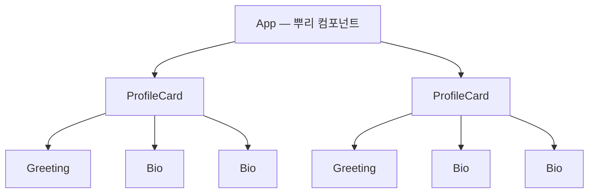
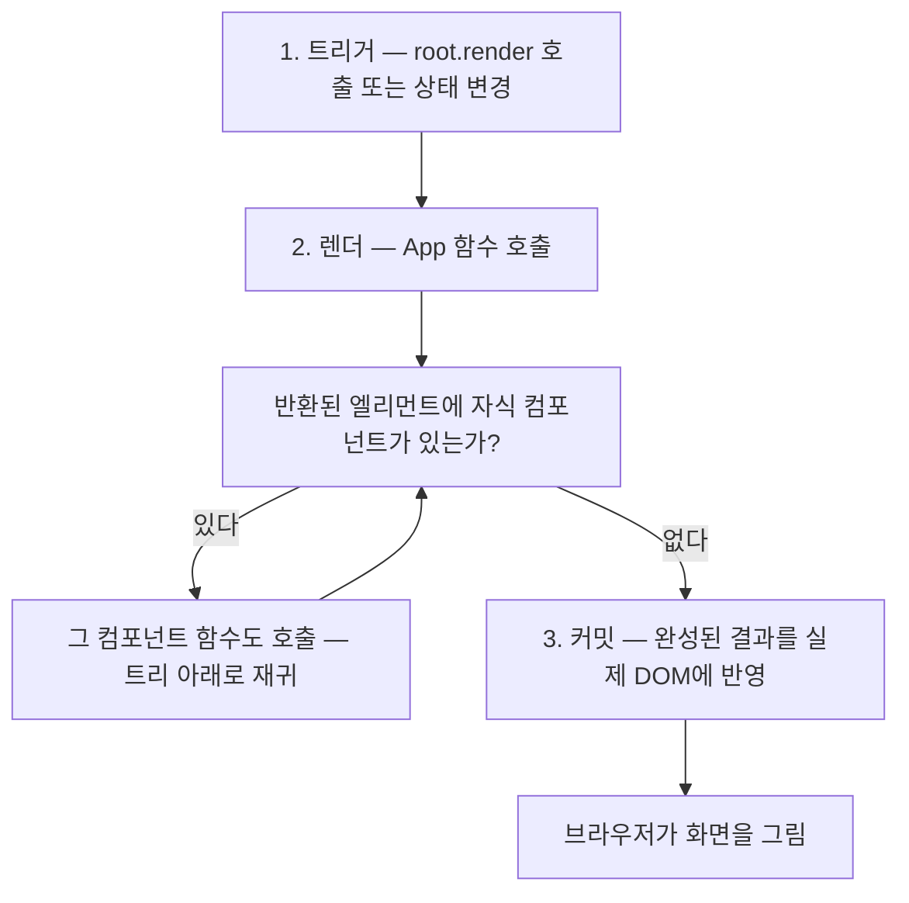

<Callout type="info">
  **이번 문서의 목표:** 함수 컴포넌트를 직접 정의하고 화면에 렌더링할 수 있으며, "컴포넌트와 엘리먼트는 무엇이 다른가", "React는 어떤 순서로 트리를 그리는가"를 남에게 설명할 수 있게 된다.
</Callout>

## 이 문서의 위치

1편에서 "컴포넌트의 정체는 화면 조각을 반환하는 함수"라는 것을, 2편에서 "JSX는 결국 자바스크립트(JavaScript) 표현식으로 변환된다"는 것을 배웠습니다. 이번 편에서는 그 두 지식을 합쳐, **함수 컴포넌트**(function component)라는 실체를 처음부터 끝까지 해부합니다. 이후 편에서 다룰 props(5편), 상태(7편), 생명주기 감각(8편)이 전부 이 문서의 구조 위에 세워지므로, 여기서 형태를 확실히 잡아두는 것이 중요합니다.

## 1. 함수 컴포넌트 정의하기 — 규칙은 단 두 가지

### 왜 "함수"인가

React 초창기에는 컴포넌트를 클래스(class)로 작성했습니다. 하지만 클래스 문법은 `this`의 동작을 이해해야 하고, 상태·생명주기 코드가 여러 메서드에 흩어지는 문제가 있었습니다. 2019년 React 16.8에서 **훅**(Hook, 갈고리라는 뜻 — 함수 컴포넌트에 React의 기능을 "걸어서" 끌어오는 도구)이 도입되면서, 함수만으로 상태와 생명주기를 전부 다룰 수 있게 되었습니다. 현대 React 공식 문서(react.dev)는 함수 컴포넌트를 표준으로 삼고 있고, 이 과목도 클래스는 이 문단의 역사적 배경 언급으로 끝냅니다.

> **쉽게 말하면:** 함수 컴포넌트는 "화면 조각을 반환하는 평범한 자바스크립트 함수"이고, 훅은 그 함수에 React의 초능력을 꽂아주는 소켓입니다.

### 정의 규칙

함수 컴포넌트가 되기 위한 규칙은 딱 두 가지입니다.

1. **이름이 대문자로 시작**해야 한다 — `Greeting` (O), `greeting` (X)
2. **JSX**(JavaScript XML — 자바스크립트 안에 화면 모양을 적는 문법 확장, 자세한 내용은 2편)를 **반환**해야 한다

```jsx
// 가장 작은 함수 컴포넌트
function Greeting() {
  return <h1>안녕하세요!</h1>;
}

// 화살표 함수로도 동일하게 정의할 수 있다
const Farewell = () => {
  return <p>안녕히 가세요!</p>;
};
```

두 방식 모두 유효합니다. `function` 선언이든 화살표 함수든, "대문자 이름 + JSX 반환"이면 React는 컴포넌트로 취급합니다. 이 과목에서는 공식 문서의 관례를 따라 `function` 선언을 기본으로 씁니다.

### 대문자 규칙은 장식이 아니다

왜 이름이 대문자여야 할까요? 2편에서 배웠듯 JSX는 `React.createElement` 호출(현대 빌드에서는 `jsx` 함수 호출)로 변환됩니다. 이때 변환기는 **태그 이름의 첫 글자**를 보고 분기합니다.

| JSX 표기 | 변환 결과 | 의미 |
|----------|-----------|------|
| `<div />` | `createElement('div')` — 문자열 | HTML 기본 태그를 찾아라 |
| `<Greeting />` | `createElement(Greeting)` — 함수 참조 | 이 이름의 컴포넌트 함수를 호출해라 |

소문자로 시작하면 문자열 `'greeting'`으로 변환되어, 브라우저에 존재하지 않는 HTML 태그를 찾다가 아무것도 그려지지 않습니다. 즉 대문자 규칙은 스타일 취향이 아니라 **변환기가 "HTML 태그"와 "내가 만든 컴포넌트"를 구분하는 유일한 신호**입니다. 실무에서 컴포넌트가 화면에 안 나올 때 가장 먼저 확인하는 항목이기도 합니다.

### 반환 규칙 — 하나의 뿌리

함수 컴포넌트의 반환값에는 제약이 하나 있습니다. **최상위 요소가 하나**여야 합니다. 함수는 값을 하나만 반환할 수 있는데, JSX 요소 하나가 곧 값 하나이기 때문입니다(원리는 2편의 변환 구조 참고).

```jsx
// ❌ 형제 두 개를 나란히 반환 — 문법 에러
function Profile() {
  return (
    <h1>제노</h1>
    <p>프론트엔드 학습자</p>
  );
}

// ✅ 방법 1: div 하나로 감싼다
function Profile() {
  return (
    <div>
      <h1>제노</h1>
      <p>프론트엔드 학습자</p>
    </div>
  );
}

// ✅ 방법 2: Fragment — 실제 DOM에 여분의 태그를 남기지 않는 투명 포장지
function Profile() {
  return (
    <>
      <h1>제노</h1>
      <p>프론트엔드 학습자</p>
    </>
  );
}
```

빈 태그처럼 생긴 `<>...</>`는 **Fragment**(프래그먼트, 조각)라고 부릅니다. `div`로 감싸면 실제 DOM에도 `div`가 하나 생기지만, Fragment는 문법상 뿌리 역할만 하고 **실제 DOM에는 아무 흔적을 남기지 않습니다.** 불필요한 중첩 `div`가 CSS 레이아웃을 방해할 때 특히 유용합니다.

## 2. 컴포넌트 vs 엘리먼트 — 헷갈리면 뒤가 전부 무너지는 구분

### 왜 이 구분이 필요한가

React 입문자가 가장 많이 섞어 쓰는 두 용어가 **컴포넌트**(component)와 **엘리먼트**(element)입니다. 대충 넘어가면 "컴포넌트를 화면에 그린다"와 "엘리먼트를 만든다"가 뒤죽박죽되어, 7편의 리렌더 이야기를 따라갈 수 없게 됩니다. 요리 비유로 먼저 감을 잡아봅시다.

> **쉽게 말하면:** 컴포넌트는 **레시피**(만드는 방법이 적힌 함수)이고, 엘리먼트는 그 레시피로 찍어낸 **주문서 한 장**(이번에 뭘 그릴지 적힌 객체)이며, 실제 DOM 노드는 완성되어 나온 **요리**입니다.

### 정의

- **컴포넌트**: 화면 조각을 반환하는 **함수**. `function Greeting() {...}` 그 자체.
- **엘리먼트**: 그 함수가 반환하는 **평범한 자바스크립트 객체**. "type이 무엇이고 속성이 무엇이다"라는 설명서.

2편에서 본 것처럼 `<Greeting />`이라는 JSX는 대략 이런 객체로 평가됩니다.

```js
// <Greeting /> 이 만들어내는 엘리먼트(개념적 형태)
const element = {
  type: Greeting,   // 어떤 컴포넌트(또는 태그)인지
  props: {},        // 전달된 속성들 (5편에서 자세히)
};
```

여기서 결정적인 사실 — **엘리먼트를 만드는 것과 컴포넌트 함수를 호출하는 것은 별개의 사건**입니다. `<Greeting />`을 쓰는 순간에는 `Greeting()`이 호출되지 않습니다. "Greeting이라는 레시피로 요리해 주세요"라는 주문서 객체만 만들어질 뿐이고, 실제 호출은 React가 렌더 과정에서 수행합니다. 주도권이 내 코드가 아니라 React에 있다는 것 — 이것이 다음 절 렌더 사이클의 핵심 전제입니다.

### 비교 정리

| 구분 | 컴포넌트 | 엘리먼트 |
|------|----------|----------|
| 정체 | 자바스크립트 함수 | 자바스크립트 객체 |
| 만드는 방법 | `function App() {...}` 정의 | JSX 작성 — `<App />` |
| 개수 | 정의는 한 번 | 렌더할 때마다 새로 생성 |
| 변경 가능성 | 코드 수정으로만 바뀜 | 불변 — 한 번 만들면 수정하지 않고 새로 만듦 |
| 비유 | 레시피 | 주문서 한 장 |

엘리먼트가 **불변**(immutable, 이뮤터블 — 만든 뒤 바꾸지 않음)이라는 점을 기억해 두세요. React는 화면을 갱신할 때 기존 엘리먼트를 고치는 게 아니라 **새 엘리먼트 객체를 통째로 다시 만들고**, 이전 것과 비교합니다. 이 비교가 4편에서 다룰 재조정(reconciliation)의 재료가 됩니다.

## 3. 컴포넌트 트리 — 조립의 구조

### 컴포넌트 안에서 컴포넌트 쓰기

컴포넌트의 진짜 힘은 **조합**에서 나옵니다. 컴포넌트가 반환하는 JSX 안에 다른 컴포넌트를 태그처럼 쓸 수 있습니다.

<CodePlayground
  template="react"
  activeFile="/App.js"
  label="컴포넌트 조합 — 작은 부품으로 화면 조립하기"
  files={{
    '/App.js': `// 부품 1: 인사말
function Greeting() {
  return <h1>안녕하세요, 제노입니다</h1>;
}

// 부품 2: 소개 문장
function Bio() {
  return <p>React를 배우는 중입니다.</p>;
}

// 부품 3: 프로필 카드 — 부품 1, 2를 조립
function ProfileCard() {
  return (
    <section>
      <Greeting />
      <Bio />
      <Bio />
    </section>
  );
}

// 최상위: 앱 전체
export default function App() {
  return (
    <div>
      <ProfileCard />
      <hr />
      <ProfileCard />
    </div>
  );
}`,
  }}
/>

`Bio`를 두 번, `ProfileCard`를 두 번 썼습니다. 같은 레시피로 주문서를 여러 장 발행한 것이므로, 화면에는 독립적인 결과물이 각각 그려집니다. `Bio`의 문장을 고치면 네 군데가 한 번에 바뀌는 것도 실습기에서 직접 확인해 보세요.

### 트리로 보기

이 조합 관계를 그림으로 그리면 **컴포넌트 트리**(component tree)가 됩니다. HTML의 DOM이 트리이듯(1편), React 앱도 컴포넌트들의 트리입니다.



트리 용어로, `App`은 **부모**(parent), `ProfileCard`는 그 **자식**(child)입니다. 이 부모–자식 관계는 단순한 그림이 아니라 **데이터가 흐르는 길**입니다. React에서 데이터는 부모에서 자식으로, 트리의 위에서 아래로만 흐릅니다(자세한 내용은 5편). 지금은 "화면 전체가 하나의 트리이고, 뿌리는 보통 App"이라는 그림만 확실히 챙기면 됩니다.

## 4. 렌더링 — 트리가 실제 화면이 되기까지

### 시작점: 루트에 심기

컴포넌트 트리는 어떻게 브라우저 화면이 될까요? 모든 React 앱의 진입점에는 이 두 줄이 있습니다.

```jsx
import { createRoot } from "react-dom/client";

// 1. HTML에 있는 실제 DOM 노드 하나를 "React의 영토"로 선언하고
const root = createRoot(document.getElementById("root"));

// 2. 그 영토에 컴포넌트 트리의 뿌리를 심는다
root.render(<App />);
```

`react-dom`은 React의 결과물을 **브라우저 DOM에 연결하는 다리** 역할의 패키지입니다. React 본체는 "무엇을 그릴지" 계산만 하고, 실제 DOM 조작은 react-dom이 맡습니다 — 역할이 분리되어 있어서 같은 React가 모바일(React Native) 같은 다른 환경에서도 쓰일 수 있습니다. 참고로 옛 자료에 보이는 `ReactDOM.render(...)`는 React 17까지의 레거시 API이고, React 18부터는 위의 `createRoot` 방식이 표준입니다.

### 렌더 사이클 — 주문서가 요리가 되는 3단계

`root.render(<App />)`가 실행되면 React 내부에서는 다음 흐름이 진행됩니다.



말로 풀면 이렇습니다.

1. **트리거**(trigger, 방아쇠): 렌더를 시작할 계기가 생깁니다. 최초에는 `root.render` 호출, 그 이후에는 상태 변경(7편)이 방아쇠입니다.
2. **렌더**(render): React가 `App()`을 **호출**합니다. 반환된 엘리먼트 안에 `<ProfileCard />` 같은 컴포넌트가 있으면 `ProfileCard()`도 호출하고, 그 안의 `Greeting()`, `Bio()`도 호출하고… 이렇게 **트리를 뿌리부터 잎까지 재귀적으로 내려가며** 전체 그림을 계산합니다. 1편의 "렌더 = 함수 호출"이 바로 이 단계의 이야기입니다.
3. **커밋**(commit, 확정): 계산이 끝난 결과를 react-dom이 **실제 DOM에 반영**합니다. 최초 렌더에서는 노드를 전부 새로 만들고, 이후 렌더에서는 이전 계산 결과와 비교해 달라진 부분만 고칩니다.

"렌더"와 "커밋"이 **별개의 단계**라는 것이 포인트입니다. 렌더 단계에서는 아직 실제 DOM에 아무 일도 일어나지 않습니다 — 계산만 합니다. 이 구분은 8편의 생명주기 감각, 9편의 useEffect 실행 타이밍을 이해하는 열쇠이므로, 여기서는 "계산 따로, 반영 따로"라는 그림만 새겨두면 됩니다.

### 직접 관찰하기

함수 호출이라는 말이 실감 나도록, 컴포넌트 함수 안에 `console.log`를 심어봅시다.

<CodePlayground
  template="react"
  activeFile="/App.js"
  showConsole
  label="렌더 = 함수 호출 — 콘솔로 직접 확인하기"
  files={{
    '/App.js': `function Child() {
  console.log("Child 함수가 호출되었습니다!");
  return <p>나는 자식 컴포넌트</p>;
}

export default function App() {
  console.log("App 함수가 호출되었습니다!");
  return (
    <div>
      <h1>렌더 관찰 실험</h1>
      <Child />
      <Child />
    </div>
  );
}`,
  }}
/>

콘솔을 보면 App 로그 1번, Child 로그 2번이 찍힙니다. `<Child />`를 두 번 썼으니 함수가 두 번 호출된 것 — 렌더가 문자 그대로 함수 호출임을 눈으로 확인할 수 있습니다. 개발 모드의 StrictMode 환경에서는 React가 순수성 검사를 위해 일부러 두 번씩 호출해 로그가 2배로 찍히기도 하는데, 이는 버그가 아니라 검사 장치입니다(렌더의 순수성은 8편에서 깊게 다룹니다).

<Callout type="warning">
  **자주 틀리는 점:** 컴포넌트 함수를 `Greeting()`처럼 **직접 호출해서 쓰면 안 됩니다.** `{Greeting()}`이 아니라 `<Greeting />`으로 써야 합니다. 직접 호출하면 React가 그 컴포넌트를 독립된 존재로 관리하지 못해, 나중에 훅을 쓰는 순간 "훅 호출 규칙 위반" 에러(8편)로 터집니다. 호출의 주도권은 항상 React에게 넘기세요 — 우리는 주문서만 씁니다.
</Callout>

## 5. 훅 시대의 철학 — 왜 이 형태로 정착했나

함수 컴포넌트 + 훅이라는 현재의 표준에는 일관된 철학이 있습니다.

- **UI는 상태의 함수다**: 1편의 공식 $UI = f(state)$에서 $f$를 문자 그대로 "함수"로 구현한 것이 함수 컴포넌트입니다. 모델과 코드가 일치하니 사고 비용이 줄어듭니다.
- **기능은 필요한 만큼 걸어 쓴다**: 상태가 필요하면 useState를, 부수 효과가 필요하면 useEffect를 함수 안에 "걸어서"(hook) 가져옵니다. 클래스처럼 모든 기능이 미리 내장된 무거운 틀을 강요받지 않습니다.
- **로직을 관심사별로 묶는다**: 클래스에서는 하나의 기능(예: 타이머 구독·해제)이 여러 생명주기 메서드에 찢어졌지만, 훅에서는 관련 로직이 한자리에 모입니다. 이 장점은 9편(useEffect)과 11편(커스텀 훅)에서 실감하게 됩니다.

각 훅의 실제 사용법은 7편(useState)부터 본격적으로 다루고, 이번 편의 임무는 그 훅들이 꽂힐 **소켓 — 함수 컴포넌트의 형태**를 완성하는 것까지입니다.

## 핵심 정리

- 함수 컴포넌트의 규칙은 두 가지 — **대문자로 시작하는 이름**, **JSX 반환**(최상위 요소는 하나, 필요하면 Fragment).
- 대문자 규칙은 변환기가 HTML 태그와 사용자 컴포넌트를 구분하는 신호다.
- **컴포넌트는 레시피**(함수), **엘리먼트는 주문서**(불변 객체) — JSX를 쓰는 순간이 아니라 렌더 과정에서 React가 함수를 호출한다.
- 앱 전체는 하나의 **컴포넌트 트리**이고, 렌더는 **트리거 → 렌더**(뿌리부터 재귀 호출) **→ 커밋**(실제 DOM 반영)의 3단계로 진행된다.
- 컴포넌트 함수를 직접 호출하지 말 것 — `<Greeting />`으로 쓰고 호출은 React에 맡긴다.

## 마무리 복습

<Quiz
  questionNumber={1}
  question="함수 컴포넌트로 인정받기 위한 두 가지 규칙으로 알맞은 것은?"
  options={['이름이 소문자로 시작하고 문자열을 반환한다', '이름이 대문자로 시작하고 JSX를 반환한다', 'class 키워드로 정의하고 render 메서드를 가진다', '반드시 화살표 함수로만 정의한다']}
  correctAnswer={2}
  explanation="함수 컴포넌트는 대문자로 시작하는 이름을 갖고 JSX를 반환하는 함수다. function 선언과 화살표 함수 모두 가능하며, class와 render 메서드는 레거시 클래스 컴포넌트의 방식이다."
  optionExplanations={['소문자로 시작하면 HTML 태그로 취급되어 컴포넌트로 동작하지 않는다', '정답 — 대문자 이름과 JSX 반환이 함수 컴포넌트의 조건이다', 'class 기반은 훅 도입 이전의 방식으로 이 과목에서는 다루지 않는다', 'function 선언으로도 화살표 함수로도 정의할 수 있다']}
/>

<Quiz
  questionNumber={2}
  question="컴포넌트 이름이 반드시 대문자로 시작해야 하는 근본적인 이유는?"
  options={['자바스크립트 문법이 소문자 함수명을 금지하기 때문', 'JSX 변환기가 첫 글자를 보고 HTML 태그와 사용자 컴포넌트를 구분하기 때문', '대문자가 실행 속도를 높이기 때문', 'CSS 클래스 이름과 겹치지 않게 하기 위해서']}
  correctAnswer={2}
  explanation="변환기는 소문자 태그를 문자열(HTML 태그)로, 대문자 태그를 함수 참조(컴포넌트)로 변환한다. 소문자로 쓰면 존재하지 않는 HTML 태그를 찾게 되어 화면에 아무것도 그려지지 않는다."
  optionExplanations={['자바스크립트 자체는 소문자 함수명을 허용한다', '정답 — 첫 글자가 문자열 변환과 함수 참조 변환을 가르는 유일한 신호다', '실행 속도와는 무관하다', 'CSS 클래스와의 충돌 방지는 이 규칙의 목적이 아니다']}
/>

<Quiz
  questionNumber={3}
  question="컴포넌트와 엘리먼트의 관계를 가장 정확히 설명한 것은?"
  options={['컴포넌트는 객체이고 엘리먼트는 함수다', '둘은 같은 것을 부르는 다른 이름이다', '컴포넌트는 화면 조각을 만드는 함수이고, 엘리먼트는 그 함수로 무엇을 그릴지 기술한 불변 객체다', '엘리먼트는 실제 브라우저 DOM 노드 그 자체다']}
  correctAnswer={3}
  explanation="컴포넌트는 레시피(함수), 엘리먼트는 주문서(불변 객체)다. 엘리먼트는 실제 DOM 노드가 아니라 무엇을 그릴지 담은 설명서이며, 커밋 단계에서 react-dom이 이를 실제 DOM에 반영한다."
  optionExplanations={['반대다 — 컴포넌트가 함수, 엘리먼트가 객체다', '별개의 개념이며 이 구분이 무너지면 리렌더 이해가 어려워진다', '정답 — 레시피와 주문서의 관계다', '엘리먼트는 DOM 노드가 아니라 DOM에 반영되기 전의 자바스크립트 객체다']}
/>

<Quiz
  questionNumber={4}
  question="JSX에서 형제 요소 두 개를 여분의 DOM 태그 없이 하나로 묶어 반환하고 싶을 때 사용하는 것은?"
  options={['div 태그로 감싼다', 'Fragment로 감싼다', '배열 없이 쉼표로 나열한다', 'return 문을 두 번 쓴다']}
  correctAnswer={2}
  explanation="Fragment는 문법상 하나의 뿌리 역할만 하고 실제 DOM에는 아무 태그도 남기지 않는다. div로 감싸면 실제 DOM에 여분의 div가 생긴다."
  optionExplanations={['div도 묶을 수는 있지만 실제 DOM에 여분의 태그가 남는다', '정답 — 빈 태그 문법의 Fragment는 DOM에 흔적을 남기지 않는 투명 포장지다', '쉼표 나열은 문법 에러다', '함수는 return을 한 번만 실행할 수 있다']}
/>

<Quiz
  questionNumber={5}
  question="React의 렌더 사이클 3단계를 순서대로 나열한 것은?"
  options={['커밋 → 렌더 → 트리거', '트리거 → 렌더 → 커밋', '렌더 → 트리거 → 커밋', '트리거 → 커밋 → 렌더']}
  correctAnswer={2}
  explanation="렌더를 시작할 계기(트리거)가 생기면, 컴포넌트 함수를 뿌리부터 재귀적으로 호출해 그림을 계산(렌더)하고, 그 결과를 실제 DOM에 반영(커밋)한다. 계산과 반영이 분리되어 있다는 점이 핵심이다."
  optionExplanations={['커밋은 계산이 끝난 뒤의 마지막 단계다', '정답 — 방아쇠, 계산, 반영의 순서다', '트리거가 없으면 렌더가 시작되지 않는다', '커밋할 내용은 렌더 단계에서 먼저 계산되어야 한다']}
/>

<Quiz
  questionNumber={6}
  question="컴포넌트를 사용할 때 Greeting() 처럼 직접 호출하지 않고 태그 형태로 쓰는 이유로 가장 알맞은 것은?"
  options={['직접 호출이 문법 에러이기 때문', '태그 형태가 실행 속도가 더 빠르기 때문', '호출 주도권을 React에 넘겨야 React가 컴포넌트를 독립된 존재로 관리하고 훅도 올바르게 동작하기 때문', '태그 형태로 써야 CSS가 적용되기 때문']}
  correctAnswer={3}
  explanation="태그 형태는 엘리먼트(주문서)만 만들고 호출은 React가 렌더 과정에서 수행한다. 직접 호출하면 React가 그 컴포넌트를 관리하지 못해 훅 호출 규칙 위반 등의 문제가 생긴다."
  optionExplanations={['자바스크립트 문법상 호출 자체는 가능하지만 React 관리 밖에서 실행된다', '속도 문제가 아니라 관리 주체의 문제다', '정답 — 주문서만 쓰고 요리는 React에 맡기는 구조다', 'CSS 적용 여부와는 무관하다']}
/>

<Quiz
  questionNumber={7}
  question="렌더 단계와 커밋 단계에 대한 설명으로 틀린 것은?"
  options={['렌더 단계에서 컴포넌트 함수들이 호출된다', '렌더 단계에서 이미 실제 DOM이 수정된다', '커밋 단계에서 계산 결과가 실제 DOM에 반영된다', '최초 렌더의 커밋에서는 DOM 노드가 새로 만들어진다']}
  correctAnswer={2}
  explanation="렌더 단계는 순수한 계산 단계로, 실제 DOM에는 아무 일도 일어나지 않는다. 실제 DOM 반영은 커밋 단계의 일이다. 이 분리가 useEffect 실행 타이밍 이해의 기초가 된다."
  optionExplanations={['맞는 설명 — 렌더는 트리를 따라 함수를 재귀 호출하는 계산 과정이다', '정답(틀린 설명) — 렌더 단계는 계산만 하고 DOM은 건드리지 않는다', '맞는 설명 — 반영은 커밋의 역할이다', '맞는 설명 — 최초 커밋은 노드 생성, 이후 커밋은 달라진 부분만 수정한다']}
/>

## 참고 자료

- [React 공식 문서 - Learn: Your First Component](https://react.dev/learn)
- [React 공식 문서 - Hooks 개요](https://legacy.reactjs.org/docs/hooks-overview.html)
- [MDN - React 기본 튜토리얼 시리즈](https://developer.mozilla.org/en-US/docs/Learn_web_development/Core/Frameworks_libraries/React)
