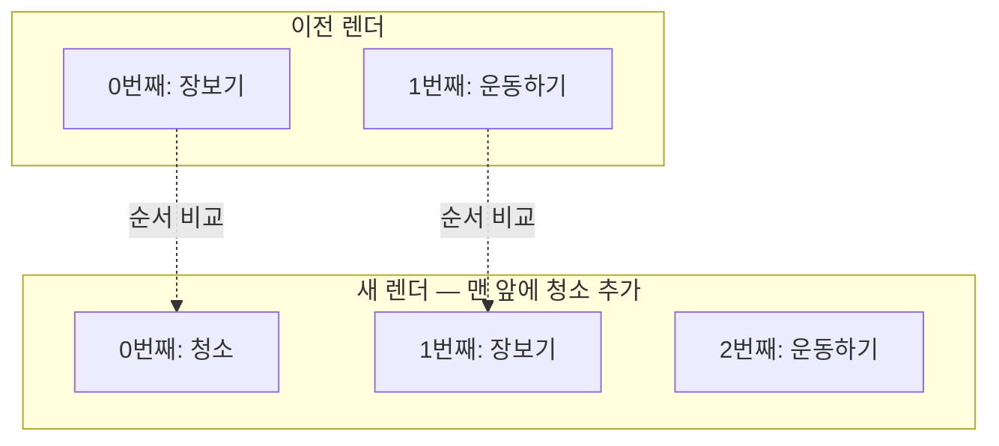

<Callout type="info">
  **이번 문서의 목표:** 중괄호 표현식·조건부 렌더링·리스트 렌더링을 자유롭게 조합해 "데이터가 이럴 때 화면은 이렇다"를 JSX로 선언할 수 있고, key가 왜 필요한지 재조정 원리로 설명할 수 있게 된다.
</Callout>

## 이 문서의 위치

2편에서 JSX가 `React.createElement` 호출로 변환되는 **원리**를 배웠고, 3편에서 그 JSX를 반환하는 함수 컴포넌트의 **형태**를 잡았습니다. 이번 편은 실전입니다 — JSX라는 도구로 **선언적 UI를 실제로 작성하는 문법 패턴**을 전부 다룹니다. 조건에 따라 다른 화면, 배열 데이터로 만드는 목록, 그리고 목록에 반드시 붙는 `key`까지. 특히 key는 "경고 없애려고 붙이는 것"이 아니라 React의 비교 알고리즘에 직접 개입하는 장치라는 것을 원리부터 파고듭니다.

## 1. JSX 실전 문법 — 태그, 속성, 중괄호

### 중괄호 = JS 세계로 나가는 창문

JSX 안에서 중괄호 `{ }`를 열면 그 안은 **자바스크립트 표현식**(expression — 평가하면 하나의 값이 나오는 코드, 자세한 내용은 2편)의 세계입니다.

> **쉽게 말하면:** JSX는 벽이 HTML 무늬인 방이고, 중괄호는 그 방에 뚫린 창문입니다. 창문 밖(자바스크립트 세계)의 값을 끌어와 벽에 걸 수 있습니다.

```jsx
function Profile() {
  const name = "제노";
  const birthYear = 2000;

  return (
    <div>
      <h1>{name}의 프로필</h1>
      <p>나이: {2026 - birthYear}세</p>
      <p>대문자 이름: {name.toUpperCase()}</p>
    </div>
  );
}
```

변수, 계산식, 함수 호출 — **값으로 평가되는 것이라면 무엇이든** 중괄호에 넣을 수 있습니다. 반대로 `if` 문이나 `for` 문처럼 값이 아닌 **문**(statement)은 넣을 수 없습니다. 이 제약이 잠시 뒤 조건부 렌더링에서 "왜 삼항 연산자와 `&&`를 쓰는가"의 이유가 됩니다.

### 속성 — HTML과 어긋나는 지점 세 가지

JSX의 속성(attribute)은 HTML과 거의 같지만, JSX가 결국 자바스크립트라는 사실 때문에 어긋나는 지점이 있습니다.

| 구분 | HTML | JSX | 이유 |
|------|------|-----|------|
| CSS 클래스 | `class="card"` | `className="card"` | `class`는 JS의 예약어라서 충돌 |
| label 연결 | `for="email"` | `htmlFor="email"` | `for`도 JS의 예약어 |
| 여러 단어 속성 | `tabindex`, `onclick` | `tabIndex`, `onClick` | JS 객체 프로퍼티 관례인 camelCase |

속성값에도 중괄호를 쓸 수 있습니다. 문자열 고정값이면 따옴표, 동적인 값이면 중괄호입니다.

```jsx
const imageUrl = "https://example.com/cat.png";
const size = 200;

// 따옴표 = 고정 문자열, 중괄호 = JS 값
const element = ;
```

<Callout type="warning">
  **자주 틀리는 점:** `width="{size}"`처럼 **따옴표 안에 중괄호**를 넣으면, 중괄호가 창문이 아니라 그냥 글자가 됩니다 — 문자열 그대로 전달됩니다. 동적 값은 따옴표 없이 `width={size}`로 써야 합니다.
</Callout>

### 표현식이 렌더링되는 방식 — 무엇이 보이고 무엇이 숨는가

중괄호에 넣은 값이 화면에 어떻게 나타나는지는 값의 종류에 따라 다릅니다. 이 규칙이 곧이어 배울 조건부 렌더링의 기반입니다.

| 중괄호 속 값 | 화면 표시 |
|--------------|-----------|
| 문자열, 숫자 | 그대로 텍스트로 표시 |
| `true`, `false`, `null`, `undefined` | **아무것도 표시하지 않음** |
| 배열 | 원소를 순서대로 이어서 표시 |
| JSX 엘리먼트 | 그 엘리먼트를 렌더링 |
| 일반 객체 | 에러 — 객체는 직접 렌더링 불가 |

`false`와 `null`이 "아무것도 안 그림"이라는 점, 배열이 "쭉 펼쳐서 그림"이라는 점 — 이 두 가지가 각각 조건부 렌더링과 리스트 렌더링의 문법적 토대입니다.

## 2. 조건부 렌더링 — 상태에 따라 다른 화면 선언하기

### 왜 필요한가

로그인 여부에 따라 "환영합니다"와 "로그인하세요"를 다르게 보여줘야 한다고 합시다. 명령형(1편)이라면 "요소를 찾아서 내용을 바꿔라"라고 지시하겠지만, 선언형에서는 **"조건이 이럴 때 화면은 이렇다"를 값으로 표현**해야 합니다. 그런데 중괄호에는 `if` 문을 넣을 수 없다고 했죠. 그래서 React 세계에는 값으로 조건을 표현하는 세 가지 정형 패턴이 있습니다.

### 패턴 1 — if 문으로 반환 자체를 나누기

중괄호 안에는 `if`를 못 쓰지만, **JSX 밖** 함수 본문에서는 자유롭게 쓸 수 있습니다.

```jsx
function Greeting({ isLoggedIn }) {
  if (isLoggedIn) {
    return <h1>환영합니다!</h1>;
  }
  return <h1>로그인해 주세요.</h1>;
}
```

두 화면이 통째로 다를 때 가장 읽기 좋은 방법입니다. `return null`을 쓰면 "아무것도 그리지 않는다"는 선언도 가능합니다.

### 패턴 2 — 삼항 연산자: 둘 중 하나

JSX **안에서** 갈라야 한다면 삼항 연산자(ternary operator)를 씁니다. `조건 ? 참일 때 값 : 거짓일 때 값` — 문이 아니라 **표현식**이라 중괄호에 들어갈 수 있습니다.

```jsx
<p>{isLoggedIn ? "환영합니다!" : "로그인해 주세요."}</p>
```

### 패턴 3 — 논리 AND 연산자: 보이거나, 숨거나

"조건이 참일 때만 보여주고, 아니면 아무것도 없음"이라면 `&&`가 간결합니다. 자바스크립트에서 `A && B`는 A가 참이면 B를, A가 거짓이면 **A를 그대로** 반환합니다. A가 `false`면 결과가 `false`인데, 앞 절의 표에서 봤듯 `false`는 화면에 아무것도 그리지 않으므로 — "조건부 표시"가 됩니다.

```jsx
<div>
  {unreadCount > 0 && <span>읽지 않은 메시지 {unreadCount}개</span>}
</div>
```

<Callout type="warning">
  **자주 틀리는 점 — `&&` 왼쪽에 숫자 0.** `{count && <p>...</p>}`에서 `count`가 `0`이면, 결과는 `false`가 아니라 **숫자 0**이고, 숫자는 화면에 그대로 표시됩니다. 화면에 덜렁 "0"이 찍히는 유명한 버그입니다. 왼쪽을 반드시 불리언으로 만들어 주세요 — `{count > 0 && <p>...</p>}`.
</Callout>

세 패턴의 선택 기준을 정리하면:

| 상황 | 패턴 |
|------|------|
| 화면 구조가 통째로 다름 | if 문으로 return 분기 |
| 한 자리에서 둘 중 하나 표시 | 삼항 연산자 |
| 참일 때만 표시, 거짓이면 없음 | `&&` (왼쪽은 불리언으로) |

## 3. 리스트 렌더링 — 배열 데이터를 화면 목록으로

### map: 데이터 배열 → 엘리먼트 배열

실제 서비스의 화면 대부분은 목록입니다 — 상품 목록, 댓글 목록, 할 일 목록. 데이터는 배열로 오는데, 화면은 JSX 엘리먼트여야 하죠. 이 변환을 담당하는 것이 배열 메서드 `map`입니다. `map`은 배열의 각 원소에 함수를 적용해 **같은 길이의 새 배열**을 만듭니다.

```jsx
const todos = ["장보기", "운동하기", "React 공부"];

// 문자열 배열 → JSX 엘리먼트 배열
const listItems = todos.map((todo) => <li>{todo}</li>);

// 배열을 중괄호에 넣으면 원소가 순서대로 펼쳐진다
function TodoList() {
  return <ul>{listItems}</ul>;
}
```

앞 절 표의 "배열은 순서대로 이어서 표시" 규칙 덕분에, 엘리먼트 배열을 중괄호에 넣는 것만으로 목록이 완성됩니다. 데이터가 4개로 늘면? 배열에 하나 추가하면 끝 — 화면 갱신 코드는 없습니다. 이것이 선언적 리스트입니다.

그런데 위 코드를 실행하면 콘솔에 경고가 뜹니다 — "Each child in a list should have a unique key prop." 이제 이 과목에서 가장 중요한 원리 하나를 만날 시간입니다.

### key가 왜 필요한가 — 재조정의 원리

React는 상태가 바뀌면 컴포넌트 함수를 다시 호출해 **새 엘리먼트 트리**를 얻습니다(3편). 그리고 이전 트리와 새 트리를 비교해 **달라진 부분만** 실제 DOM에 반영합니다. 이 비교·갱신 과정을 **재조정**(reconciliation, 리컨실리에이션 — "둘을 대조해 맞춘다"는 뜻)이라고 합니다.

문제는 목록입니다. 이전 렌더의 목록과 새 렌더의 목록을 비교할 때, React는 기본적으로 **순서**(몇 번째인지)로 짝을 맞춥니다. 그런데 목록 **맨 앞에** 항목이 하나 추가되면 어떻게 될까요?



사람 눈에는 "청소 하나가 추가됐을 뿐"이지만, 순서로 비교하는 React 눈에는 **0번째가 장보기에서 청소로 바뀌었고, 1번째가 운동하기에서 장보기로 바뀌었고, 2번째가 새로 생긴 것**입니다. 항목 전부를 수정하는 낭비가 일어나고, 더 심각하게는 — 각 항목이 자기만의 상태(입력값, 체크 여부 등)를 갖고 있다면 **그 상태가 엉뚱한 항목에 붙어버리는 버그**가 생깁니다. 출석부를 이름 없이 "앞에서 몇 번째 자리"로만 관리하는 반에서, 맨 앞에 전학생이 앉으면 모든 학생의 출석 기록이 한 칸씩 밀리는 것과 같습니다.

### key: 순서 대신 이름표로 비교하라

해결책이 `key`입니다. 각 항목에 **형제들 사이에서 유일하고, 렌더가 반복되어도 변하지 않는 이름표**를 달아주면, React는 순서 대신 이름표로 짝을 맞춥니다.

```jsx
const todos = [
  { id: 101, text: "장보기" },
  { id: 102, text: "운동하기" },
  { id: 103, text: "React 공부" },
];

function TodoList() {
  return (
    <ul>
      {todos.map((todo) => (
        <li key={todo.id}>{todo.text}</li>
      ))}
    </ul>
  );
}
```

이제 맨 앞에 항목이 추가되어도, React는 key 101·102·103이 그대로 있음을 확인하고 **새 key의 항목 하나만 새로 만듭니다.** 기존 항목의 DOM과 상태는 자기 key를 따라 그대로 보존됩니다.

<Callout type="warning">
  **자주 틀리는 점 — 배열 인덱스를 key로 쓰기.** `todos.map((todo, index) => <li key={index}>...)` 는 경고는 사라지지만, 인덱스는 곧 "순서"이므로 **key를 안 단 것과 본질적으로 같은 상황**으로 되돌아갑니다. 항목의 추가·삭제·정렬이 일어나는 목록에서는 반드시 데이터 고유의 id를 key로 쓰세요. 순서가 절대 바뀌지 않고 추가·삭제도 없는 고정 목록에서만 인덱스가 허용됩니다. 또 하나 — key는 같은 목록의 형제들 사이에서만 유일하면 되고, `Math.random()`처럼 렌더마다 바뀌는 값은 "매번 다른 이름표"라서 최악의 선택입니다.
</Callout>

### 직접 관찰하기 — key가 상태를 지키는 현장

말로만 들으면 실감이 안 나니, 인덱스 key의 버그를 직접 목격해 봅시다. 아래 앱은 같은 목록을 두 방식으로 그립니다. 각 항목의 입력창에 아무 글자나 적고 "맨 앞에 추가" 버튼을 눌러보세요.

<CodePlayground
  template="react"
  activeFile="/App.js"
  label="인덱스 key vs id key — 입력값이 누구를 따라가는지 관찰"
  files={{
    '/App.js': `import { useState } from "react";

const initial = [
  { id: 101, text: "장보기" },
  { id: 102, text: "운동하기" },
];

export default function App() {
  const [todos, setTodos] = useState(initial);
  const [nextId, setNextId] = useState(1);

  function addToFront() {
    const newTodo = { id: nextId, text: "새 할 일 " + nextId };
    setTodos([newTodo, ...todos]);
    setNextId(nextId + 1);
  }

  return (
    <div>
      <button onClick={addToFront}>맨 앞에 추가</button>

      <h3>인덱스를 key로 (버그)</h3>
      <ul>
        {todos.map((todo, index) => (
          <li key={index}>
            {todo.text} <input placeholder="메모" />
          </li>
        ))}
      </ul>

      <h3>id를 key로 (정상)</h3>
      <ul>
        {todos.map((todo) => (
          <li key={todo.id}>
            {todo.text} <input placeholder="메모" />
          </li>
        ))}
      </ul>
    </div>
  );
}`,
  }}
/>

입력창에 메모를 적은 뒤 추가 버튼을 누르면 — 인덱스 key 쪽은 **메모가 엉뚱한 항목에 남고**, id key 쪽은 메모가 원래 항목을 정확히 따라갑니다. 입력창의 값은 DOM 노드에 붙어 있는데, 인덱스 key에서는 "0번째 노드"가 재활용되어 새 항목이 남의 메모를 물려받기 때문입니다. 이 한 번의 관찰이 key 규칙을 평생 기억하게 해줄 겁니다.

## 4. 컴포넌트 조합 — 패턴을 부품 안으로

지금까지의 패턴(중괄호·조건·리스트)은 컴포넌트 조합(3편)과 합쳐질 때 완성됩니다. 목록의 항목을 별도 컴포넌트로 추출하면, 조건부 렌더링은 항목 안에, 리스트 순회는 목록에 남아 역할이 분리됩니다.

```jsx
function TodoItem({ text, done }) {
  return (
    <li>
      {done ? "✅" : "⬜"} {text}
    </li>
  );
}

function TodoList({ todos }) {
  return (
    <ul>
      {todos.map((todo) => (
        <TodoItem key={todo.id} text={todo.text} done={todo.done} />
      ))}
    </ul>
  );
}
```

여기서 주의할 디테일 하나 — **key는 map을 도는 자리, 즉 배열에 직접 담기는 엘리먼트에 답니다.** `TodoItem` 내부의 `li`에 달면 React가 목록 비교에 쓸 수 없습니다. "목록의 이름표는 목록을 만드는 곳에서"라고 기억하세요. `text`나 `done`처럼 컴포넌트에 값을 넘기는 속성들의 정체는 props인데, 자세한 내용은 5편에서 다룹니다.

## 핵심 정리

- 중괄호는 JSX에 뚫린 자바스크립트 창문 — **표현식만** 들어가고, 문(if·for)은 못 들어간다.
- `className`·`htmlFor`·camelCase — JSX 속성은 자바스크립트라서 HTML과 어긋나는 지점이 있다.
- 조건부 렌더링 3패턴: **return 분기**(구조가 다를 때), **삼항**(둘 중 하나), **`&&`**(참일 때만 — 왼쪽은 불리언으로).
- 리스트는 `map`으로 데이터 배열을 엘리먼트 배열로 변환하고, 각 항목에 **안정적이고 유일한 key**를 단다.
- key는 재조정에서 순서 대신 쓰이는 이름표 — 인덱스 key는 순서 비교로 되돌아가는 함정이며, 추가·삭제·정렬되는 목록에서는 데이터 고유 id를 쓴다.

## 마무리 복습

<Quiz
  questionNumber={1}
  question="JSX의 중괄호 안에 넣을 수 없는 것은?"
  options={['변수 이름', 'if 문', '함수 호출', '삼항 연산자 식']}
  correctAnswer={2}
  explanation="중괄호에는 값으로 평가되는 표현식만 들어간다. if 문은 값이 아닌 문이므로 넣을 수 없고, 대신 함수 본문에서 return을 분기하거나 삼항 연산자를 쓴다."
  optionExplanations={['변수는 값으로 평가되는 표현식이다', '정답 — if는 문이라서 중괄호에 들어갈 수 없다', '함수 호출은 반환값으로 평가되는 표현식이다', '삼항 연산자는 값을 만들어내는 표현식이라 가능하다']}
/>

<Quiz
  questionNumber={2}
  question="JSX에서 CSS 클래스를 지정할 때 class 대신 className을 쓰는 이유는?"
  options={['className이 더 짧아서', 'class가 자바스크립트의 예약어라서 충돌하기 때문', 'HTML5에서 class가 폐기되었기 때문', 'CSS 파일과 이름을 맞추기 위해서']}
  correctAnswer={2}
  explanation="JSX는 결국 자바스크립트로 변환되는데, class는 자바스크립트에서 클래스를 정의하는 예약어라서 속성 이름으로 쓸 수 없다. 같은 이유로 for 대신 htmlFor를 쓴다."
  optionExplanations={['오히려 className이 더 길다', '정답 — 예약어 충돌을 피하기 위한 이름이다', 'HTML에서 class 속성은 여전히 표준이다', 'CSS 파일의 표기와는 무관하다']}
/>

<Quiz
  questionNumber={3}
  question="중괄호에 넣었을 때 화면에 아무것도 표시하지 않는 값의 묶음은?"
  options={['숫자 0과 빈 문자열', 'false, null, undefined', '빈 배열과 숫자 0', '문자열 false']}
  correctAnswer={2}
  explanation="불리언 값과 null, undefined는 렌더링되지 않는다. 이 규칙이 && 조건부 렌더링의 토대다. 반면 숫자 0은 화면에 0으로 표시되므로 && 왼쪽에 숫자를 두면 버그가 된다."
  optionExplanations={['숫자 0은 화면에 0으로 표시된다', '정답 — 이 값들은 아무것도 그리지 않으며 && 패턴의 기반이 된다', '빈 배열은 표시할 원소가 없을 뿐이고 숫자 0은 표시된다', '따옴표로 감싼 false는 문자열이라 그대로 표시된다']}
/>

<Quiz
  questionNumber={4}
  question="count가 0일 때 {count && 알림} 형태의 코드에서 화면에 나타나는 것은?"
  options={['아무것도 나타나지 않는다', '알림 내용이 나타난다', '숫자 0이 나타난다', '에러가 발생한다']}
  correctAnswer={3}
  explanation="&& 연산자는 왼쪽이 거짓 값이면 왼쪽 값을 그대로 반환한다. count가 0이면 결과는 숫자 0이고, 숫자는 화면에 표시되므로 0이 덜렁 찍힌다. count &gt; 0 처럼 왼쪽을 불리언으로 만들어야 한다."
  optionExplanations={['false나 null이라면 그렇지만 숫자 0은 표시된다', '왼쪽이 거짓 값이라 오른쪽은 평가 결과에 포함되지 않는다', '정답 — 숫자 0이 반환되어 그대로 렌더링되는 유명한 버그다', '에러 없이 조용히 0이 표시되어 더 찾기 어렵다']}
/>

<Quiz
  questionNumber={5}
  question="재조정(reconciliation) 과정에서 key의 역할을 가장 정확히 설명한 것은?"
  options={['항목의 CSS 스타일을 지정한다', '이전 렌더와 새 렌더의 목록 항목을 순서 대신 이름표로 짝지어 비교하게 한다', '항목의 렌더링 순서를 정렬한다', '항목을 데이터베이스에 저장할 때 기본 키가 된다']}
  correctAnswer={2}
  explanation="React는 기본적으로 순서로 목록을 비교하는데, key가 있으면 key가 같은 항목끼리 짝지어 비교한다. 덕분에 맨 앞 추가 같은 변화에서도 기존 항목의 DOM과 상태가 보존된다."
  optionExplanations={['스타일과는 무관하다', '정답 — 순서 비교를 이름표 비교로 바꾸는 것이 key의 본질이다', 'key는 정렬 기준이 아니라 식별자다', '화면 비교용 식별자일 뿐 데이터베이스와는 무관하다']}
/>

<Quiz
  questionNumber={6}
  question="배열 인덱스를 key로 쓰면 안 되는 목록의 조건은?"
  options={['항목이 3개 이하인 목록', '항목의 추가·삭제·정렬이 일어나는 목록', '문자열만 담긴 목록', '컴포넌트가 아닌 li 태그를 쓰는 목록']}
  correctAnswer={2}
  explanation="인덱스는 곧 순서이므로, 순서가 변하는 목록에서 인덱스 key는 key를 안 단 것과 같은 상태 뒤섞임을 일으킨다. 순서가 절대 변하지 않는 고정 목록에서만 인덱스가 허용된다."
  optionExplanations={['개수와는 무관하다', '정답 — 순서가 변하면 인덱스라는 이름표가 다른 항목을 가리키게 된다', '데이터 타입과는 무관하다', '태그 종류와는 무관하다']}
/>

<Quiz
  questionNumber={7}
  question="key를 다는 올바른 위치는?"
  options={['map 안에서 배열에 직접 담기는 엘리먼트', '항목 컴포넌트 내부의 최상위 태그', '목록을 감싸는 ul 태그', '어디에 달아도 동일하게 동작한다']}
  correctAnswer={1}
  explanation="key는 React가 목록을 비교할 때 쓰는 정보이므로, 목록을 만드는 자리 즉 map이 반환하는 엘리먼트에 직접 달아야 한다. 항목 컴포넌트 내부에 달면 React가 목록 비교에 활용하지 못한다."
  optionExplanations={['정답 — 목록의 이름표는 목록을 만드는 곳에 단다', '컴포넌트 안쪽에 달면 목록 비교에 쓰이지 못한다', 'ul은 목록의 부모일 뿐 비교 대상 항목이 아니다', '위치에 따라 동작이 달라지며 잘못 달면 경고가 계속 뜬다']}
/>

## 참고 자료

- [React 공식 문서 - Learn 섹션](https://react.dev/learn)
- [React 공식 문서 - JSX 소개](https://legacy.reactjs.org/docs/introducing-jsx.html)
- [MDN - React 기본 튜토리얼 시리즈](https://developer.mozilla.org/en-US/docs/Learn_web_development/Core/Frameworks_libraries/React)
