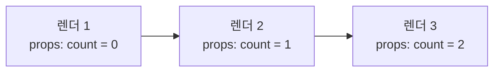
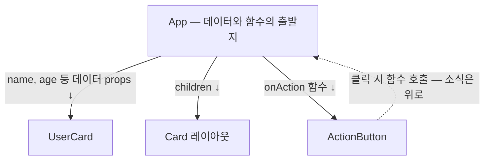

<Callout type="info">
  **이번 문서의 목표:** props가 왜 읽기 전용 스냅샷인지 원리로 설명할 수 있고, children으로 레이아웃 컴포넌트를, 함수 props로 부모–자식 통신 통로를 직접 설계할 수 있게 된다.
</Callout>

## 이 문서의 위치

3편에서 컴포넌트를 트리로 조립했고, 4편에서 `<TodoItem text={todo.text} />`처럼 컴포넌트에 값을 넘기는 장면을 이미 봤습니다. 그 값의 정체가 이번 편의 주인공 **props**입니다. props는 단순한 문법이 아니라 React의 **데이터 흐름 설계 그 자체**입니다 — "데이터는 위에서 아래로, 읽기 전용으로"라는 원칙이 여기서 세워지고, 7편의 상태(state), 나중의 상태 끌어올리기까지 전부 이 원칙 위에서 움직입니다.

## 1. Props — 컴포넌트의 매개변수

### 왜 필요한가

4편의 `Bio` 컴포넌트를 떠올려 봅시다. 항상 같은 문장만 반환하니, 백 번 재사용해도 백 번 똑같은 화면입니다. 재사용이 진짜 가치를 가지려면 **같은 틀에 다른 내용**을 부을 수 있어야 합니다. 함수의 세계에서 이 역할은 매개변수(parameter)가 합니다 — `f(x)`에 3을 넣으면 6, 5를 넣으면 10이 나오듯이. 컴포넌트도 함수이므로(3편), 매개변수를 받으면 됩니다. 그 매개변수의 React식 이름이 **props**(프롭스 — properties, 속성들의 줄임말)입니다.

> **쉽게 말하면:** props는 부모가 자식 컴포넌트에게 건네주는 **주문 옵션**입니다. "아메리카노, 아이스로, 샷 추가" — 같은 메뉴(컴포넌트)라도 옵션(props)에 따라 다른 결과가 나옵니다.

### 전달과 수신 — 문법

부모는 JSX 속성 문법으로 전달하고, 자식은 함수의 **첫 번째 매개변수**로 받습니다.

```jsx
// 부모: JSX 속성으로 전달한다
function App() {
  return (
    <div>
      <UserCard name="제노" age={26} isOnline={true} />
      <UserCard name="하나" age={30} isOnline={false} />
    </div>
  );
}

// 자식: 첫 번째 매개변수로 받는다 — props는 하나의 객체다
function UserCard(props) {
  return (
    <div>
      <h2>{props.name} ({props.age}세)</h2>
      <p>{props.isOnline ? "접속 중" : "오프라인"}</p>
    </div>
  );
}
```

핵심은 **props가 낱개가 아니라 객체 하나**라는 점입니다. 부모가 쓴 속성들이 전부 `{ name: "제노", age: 26, isOnline: true }`라는 한 객체로 묶여 전달됩니다. 2편에서 본 변환 구조를 떠올리면 자연스럽습니다 — JSX 속성들은 `createElement(UserCard, { name: "제노", age: 26, ... })`의 두 번째 인자, 즉 원래부터 객체 하나였습니다. 문자열이 아닌 값(숫자·불리언·배열·객체·함수)은 4편의 규칙대로 중괄호로 넘깁니다.

### 구조 분해로 받기 — 실무 표준

`props.name`, `props.age`를 반복하는 대신, 자바스크립트의 **구조 분해 할당**(destructuring — 객체에서 원하는 프로퍼티를 꺼내 같은 이름의 변수로 만드는 문법)을 매개변수 자리에 바로 적용하는 것이 실무 표준입니다.

```jsx
// 매개변수 자리에서 바로 구조 분해 — 어떤 props를 받는지 시그니처만 봐도 보인다
function UserCard({ name, age, isOnline }) {
  return (
    <div>
      <h2>{name} ({age}세)</h2>
      <p>{isOnline ? "접속 중" : "오프라인"}</p>
    </div>
  );
}
```

기본값도 구조 분해 문법으로 함께 지정할 수 있습니다. 부모가 해당 props를 아예 안 넘겼거나 `undefined`를 넘겼을 때 대신 쓰입니다.

```jsx
function UserCard({ name, age = 20, isOnline = false }) {
  // age를 안 넘기면 20, isOnline을 안 넘기면 false
}
```

## 2. Props의 불변성 — 읽기 전용 스냅샷

### 규칙: 자식은 props를 절대 수정하지 않는다

React 공식 문서가 강조하는 대원칙입니다 — **props는 읽기 전용**(read-only)입니다.

```jsx
function UserCard({ name, age }) {
  age = age + 1;   // ❌ 하지 마세요 — props를 받은 쪽에서 수정
  ...
}
```

왜 안 될까요? 두 층위의 이유가 있습니다.

**첫째, 데이터 흐름의 신뢰가 무너집니다.** React의 데이터는 트리의 위에서 아래로만 흐릅니다(단방향 데이터 흐름, one-way data flow). 이 규칙 덕분에 "화면의 이 값이 왜 이렇지?"라는 질문의 답을 찾을 때 **위쪽만 거슬러 올라가면** 됩니다. 그런데 자식이 받은 props를 마음대로 바꾸면, 값의 출처가 부모인지 자식인지 알 수 없어져 명령형 시절의 "추적 불가능한 화면"(1편)으로 되돌아갑니다.

**둘째, React의 갱신 모델과 충돌합니다.** props는 엘리먼트 객체의 일부이고, 엘리먼트는 불변입니다(3편). React는 "값이 바뀌었으면 새 엘리먼트가 온다"를 전제로 이전과 새것을 비교합니다. 기존 객체를 몰래 고치면 React는 변화를 알아챌 수 없습니다.

### 스냅샷이라는 관점

그럼 값을 바꾸고 싶으면 어떻게 할까요? **바꾸는 것이 아니라, 부모가 새 props로 다시 렌더링해 달라고 요청**합니다. 시간의 흐름으로 보면 이렇습니다.

> **쉽게 말하면:** props는 영화 필름의 한 프레임 같은 **스냅샷**(snapshot, 그 순간의 사진)입니다. 화면이 움직이는 건 사진을 고쳐 그려서가 아니라, 매 렌더마다 새 사진을 받아서입니다.



각 렌더에서 자식이 받는 props는 **그 렌더 순간의 값으로 고정**되어 있습니다. 다음 렌더에서는 완전히 새로운 props 객체가 옵니다. "props는 고정인데 화면은 어떻게 변하지?"의 답은 — 변화를 일으키는 근원이 따로 있기 때문입니다. 그 근원이 **상태**(state)이고, 부모의 상태가 바뀌면 부모가 리렌더되면서 자식에게 새 스냅샷을 건넵니다. 상태의 원리는 7편에서 통째로 다루고, 이번 편에서는 "props는 받아 읽기만 한다, 바꾸는 힘은 위에 있다"는 역할 분담만 확실히 잡습니다.

### props와 상태의 역할 비교 (미리보기)

| 구분 | props | state |
|------|-------|-------|
| 값의 출처 | 부모가 내려줌 | 컴포넌트 자신이 소유 |
| 수정 가능 여부 | 읽기 전용 | 전용 함수로 변경 가능 |
| 비유 | 부모에게 받은 주문서 | 내 주머니 속 메모장 |
| 자세한 내용 | 이번 편 | 7편 |

## 3. Children — 태그 사이의 내용물

### 왜 필요한가

지금까지의 props는 "이름 있는 옵션"이었습니다. 그런데 이런 컴포넌트를 만들고 싶다면 어떨까요 — 테두리와 그림자가 있는 **카드 틀**인데, 그 안에 뭐가 들어갈지는 쓰는 쪽이 자유롭게 정하는. 제목·문단이 들어갈 수도, 이미지가 들어갈 수도, 다른 컴포넌트가 통째로 들어갈 수도 있습니다. "내용물"을 name·age 같은 개별 props로 일일이 정의하는 건 불가능합니다.

HTML을 떠올려 보세요. `<div>` 태그는 여는 태그와 닫는 태그 **사이에** 무엇이든 품을 수 있습니다. React 컴포넌트도 똑같이 할 수 있고, 그 "사이에 품은 것"이 자동으로 전달되는 특별한 props가 **children**(칠드런, 자식들)입니다.

### 문법과 동작

```jsx
// 카드 틀 — 내용물은 children으로 받는다
function Card({ children }) {
  return (
    <div style={{ border: "1px solid gray", borderRadius: 8, padding: 16 }}>
      {children}
    </div>
  );
}

// 쓰는 쪽 — 여는 태그와 닫는 태그 사이가 곧 children이 된다
function App() {
  return (
    <Card>
      <h2>공지사항</h2>
      <p>이번 주 스터디는 토요일입니다.</p>
    </Card>
  );
}
```

`<Card>`와 `</Card>` 사이에 적은 JSX 전체가 `children`이라는 이름의 props로 `Card`에 전달되고, `Card`는 그것을 자기 틀 안의 원하는 자리에 `{children}`으로 끼워 넣습니다. 액자 비유가 정확합니다 — **Card는 액자를 만들고, 그 액자에 어떤 그림을 넣을지는 쓰는 쪽이 정합니다.**

이 패턴의 힘은 **레이아웃과 내용의 분리**입니다. 모달 창, 사이드바, 페이지 레이아웃처럼 "틀은 같고 내용만 다른" UI를 children 하나로 전부 해결할 수 있습니다. 틀의 디자인 수정은 컴포넌트 한 곳에서 끝나고, 내용의 자유도는 무제한입니다.

## 4. 함수와 컴포넌트도 props로 — 값이면 무엇이든

props로 넘길 수 있는 것은 문자열·숫자만이 아닙니다. 자바스크립트에서 **함수는 값**이고, JSX 엘리먼트도 객체 즉 값입니다(3편). 값이면 무엇이든 props로 흐를 수 있습니다.

### 함수 전달 — 아래에서 위로 소식을 알리는 통로

데이터는 위에서 아래로만 흐른다고 했습니다. 그럼 자식에게 일어난 일(버튼 클릭 등)을 부모가 알아야 할 때는 어떻게 할까요? **부모가 함수를 만들어 props로 내려주고, 자식이 그 함수를 호출**합니다. 데이터는 아래로, 소식은 함수 호출을 통해 위로 — 단방향 원칙을 지키면서 통신하는 표준 패턴입니다.

<CodePlayground
  template="react"
  activeFile="/App.js"
  showConsole
  label="함수 props — 자식의 클릭을 부모가 전달받는 구조"
  files={{
    '/App.js': `// 자식: 어떤 일을 할지 모른다. 받은 함수를 호출할 뿐.
function ActionButton({ label, onAction }) {
  return <button onClick={onAction}>{label}</button>;
}

// 부모: 무슨 일이 일어날지를 결정해서 함수로 내려준다
export default function App() {
  function handleSave() {
    console.log("저장을 실행합니다!");
  }

  function handleDelete() {
    console.log("삭제를 실행합니다!");
  }

  return (
    <div>
      <ActionButton label="저장" onAction={handleSave} />
      <ActionButton label="삭제" onAction={handleDelete} />
    </div>
  );
}`,
  }}
/>

`ActionButton`은 완전히 재사용 가능합니다 — 자기가 눌리면 무슨 일이 벌어질지 전혀 모르고, 알 필요도 없습니다. 결정권은 전부 부모에 있습니다. 여기서 쓰인 `onClick` 같은 이벤트 처리의 세부는 6편에서 깊게 다룹니다.

<Callout type="warning">
  **자주 틀리는 점:** `onAction={handleSave}`와 `onAction={handleSave()}`는 하늘과 땅 차이입니다. 괄호를 붙이면 **렌더 시점에 즉시 호출**되어 그 반환값이 전달됩니다. 우리가 넘길 것은 "나중에 호출할 함수 그 자체"이므로 괄호 없이 이름만 넘깁니다.
</Callout>

### 엘리먼트 전달 — 이름 있는 구멍 여러 개

children은 구멍이 하나일 때의 도구입니다. 틀에 구멍이 여러 개라면(예: 헤더 자리 + 본문 자리), 엘리먼트를 **이름 있는 props**로 넘기면 됩니다.

```jsx
function SplitLayout({ top, bottom }) {
  return (
    <div>
      <header>{top}</header>
      <main>{bottom}</main>
    </div>
  );
}

// JSX 엘리먼트도 값이므로 props에 담을 수 있다
<SplitLayout top={<h1>제목 영역</h1>} bottom={<p>본문 영역</p>} />
```

정리하면 — children은 "기본 구멍", 이름 있는 엘리먼트 props는 "추가 구멍"입니다. 두 방식을 섞어 쓰는 것이 실무 레이아웃 컴포넌트의 일반적인 모습입니다.

## 5. 흐름 전체 보기

이번 편의 내용을 트리 하나에 모으면 이렇게 됩니다.



- **데이터**는 props로 아래로.
- **내용물**은 children으로 아래로.
- **소식**은 내려받은 함수를 호출해 위로.

이 세 화살표가 React 데이터 흐름의 전부입니다. 이 구조 위에 "그럼 맨 위의 데이터는 누가 바꾸나?"라는 질문이 남는데, 그 답인 state가 7편에서 기다리고 있습니다.

## 핵심 정리

- props는 부모가 자식에게 건네는 **주문 옵션**이며, 실체는 함수의 첫 매개변수로 오는 **객체 하나**다 — 구조 분해로 받는 것이 표준.
- props는 **읽기 전용 스냅샷** — 자식은 절대 수정하지 않고, 값의 변경은 부모가 새 props로 리렌더하는 방식으로만 일어난다.
- 단방향 데이터 흐름 덕분에 값의 출처 추적은 항상 "위로 거슬러 올라가기"로 끝난다.
- **children**은 여는 태그와 닫는 태그 사이의 내용물이 자동 전달되는 특별한 props — 틀과 내용을 분리하는 레이아웃 도구.
- 함수도 값이므로 props로 내려줄 수 있고, 자식이 그 함수를 호출하는 것이 "아래에서 위로 소식 전달"의 표준 패턴이다.

## 마무리 복습

<Quiz
  questionNumber={1}
  question="부모가 age={26} 으로 넘긴 값을 자식 컴포넌트가 받는 방식으로 올바른 것은?"
  options={['전역 변수 age로 자동 등록된다', '함수의 첫 번째 매개변수인 props 객체의 프로퍼티로 전달된다', '두 번째 매개변수로 낱개 전달된다', 'import 문으로 가져와야 한다']}
  correctAnswer={2}
  explanation="부모가 쓴 모든 JSX 속성은 하나의 객체로 묶여 자식 함수의 첫 번째 매개변수로 전달된다. 구조 분해 문법으로 매개변수 자리에서 바로 꺼내 쓰는 것이 실무 표준이다."
  optionExplanations={['전역 변수로 등록되지 않는다', '정답 — props는 낱개가 아니라 객체 하나로 전달된다', '모든 속성이 첫 번째 매개변수 하나에 객체로 묶인다', 'import는 모듈을 가져오는 문법으로 props 전달과 무관하다']}
/>

<Quiz
  questionNumber={2}
  question="props가 읽기 전용이어야 하는 이유로 가장 본질적인 것은?"
  options={['자바스크립트 객체는 원래 수정이 불가능하기 때문', '수정하면 브라우저가 느려지기 때문', '단방향 데이터 흐름의 추적 가능성과 React의 비교 기반 갱신 모델이 모두 무너지기 때문', '메모리를 절약하기 위해서']}
  correctAnswer={3}
  explanation="자식이 props를 수정하면 값의 출처를 추적할 수 없게 되고, 기존 객체를 몰래 고치면 React가 이전과 새것을 비교해 변화를 감지하는 갱신 모델도 동작하지 않는다."
  optionExplanations={['자바스크립트 객체는 기본적으로 수정 가능하다 — 규칙으로 막는 것이다', '성능이 아니라 데이터 흐름 설계의 문제다', '정답 — 추적 가능성과 비교 기반 갱신이라는 두 층위의 이유가 있다', '메모리 절약과는 무관하다']}
/>

<Quiz
  questionNumber={3}
  question="props를 스냅샷이라고 부르는 이유로 알맞은 것은?"
  options={['각 렌더에서 받은 props는 그 순간의 값으로 고정이고, 값이 변하면 새 렌더에서 새 props 객체가 오기 때문', 'props가 화면을 캡처한 이미지이기 때문', '한 번 정하면 앱이 끝날 때까지 절대 바뀌지 않기 때문', 'props가 브라우저에 파일로 저장되기 때문']}
  correctAnswer={1}
  explanation="props는 렌더 한 번의 순간을 담은 사진과 같다. 화면이 변하는 것은 사진을 고쳐서가 아니라 부모가 리렌더하며 새 사진(새 props 객체)을 건네기 때문이다."
  optionExplanations={['정답 — 프레임마다 새 사진을 받는 영화 필름의 구조다', '이미지 캡처가 아니라 값의 고정성을 비유한 표현이다', '렌더마다 새 값이 올 수 있다 — 한 렌더 안에서 고정일 뿐이다', '파일 저장과는 무관하다']}
/>

<Quiz
  questionNumber={4}
  question="children props에 담기는 것은?"
  options={['컴포넌트가 정의한 하위 함수들', '컴포넌트의 여는 태그와 닫는 태그 사이에 적은 JSX 내용물', '컴포넌트 트리에서 자기 아래의 모든 컴포넌트 목록', '부모 컴포넌트 자신에 대한 참조']}
  correctAnswer={2}
  explanation="여는 태그와 닫는 태그 사이의 내용이 children이라는 이름의 props로 자동 전달된다. 틀 컴포넌트가 내용물의 자리만 정해두는 레이아웃 패턴의 핵심이다."
  optionExplanations={['내부 함수와는 무관하다', '정답 — 태그 사이의 내용물이 그대로 전달된다', '트리 전체 목록이 아니라 태그 사이에 직접 적은 것만 담긴다', '부모 참조는 전달되지 않는다']}
/>

<Quiz
  questionNumber={5}
  question="자식 컴포넌트에서 일어난 클릭을 부모가 알게 하는 React의 표준 방법은?"
  options={['자식이 부모의 변수를 직접 수정한다', '부모가 함수를 props로 내려주고 자식이 그 함수를 호출한다', '전역 이벤트 버스에 신호를 쏜다', '자식이 부모 컴포넌트를 다시 렌더링하는 명령을 보낸다']}
  correctAnswer={2}
  explanation="데이터는 아래로만 흐르므로, 위로 소식을 전할 때는 부모가 내려준 함수를 자식이 호출하는 방식을 쓴다. 단방향 원칙을 지키면서 통신하는 표준 패턴이다."
  optionExplanations={['자식은 부모의 데이터에 직접 접근하거나 수정할 수 없다', '정답 — 데이터는 아래로, 소식은 함수 호출로 위로 전달된다', 'React 기본 모델에는 전역 이벤트 버스가 없다', '렌더링 명령을 보내는 API는 존재하지 않는다']}
/>

<Quiz
  questionNumber={6}
  question="onAction={handleSave} 대신 onAction={handleSave()} 라고 쓰면 생기는 일은?"
  options={['동일하게 동작한다', '렌더 시점에 함수가 즉시 호출되고, 클릭 시 실행할 함수 대신 그 반환값이 전달된다', '클릭할 때마다 두 번씩 호출된다', '문법 에러로 빌드가 실패한다']}
  correctAnswer={2}
  explanation="괄호를 붙이면 그 자리에서 함수가 실행된다. props로 넘겨야 할 것은 나중에 호출될 함수 자체이므로 괄호 없이 이름만 넘겨야 한다."
  optionExplanations={['괄호 유무로 전달되는 값 자체가 달라진다', '정답 — 렌더 중 즉시 실행되어 의도한 클릭 동작이 사라진다', '두 번 호출이 아니라 렌더 시 한 번, 잘못된 시점에 호출된다', '문법상 유효한 코드라서 에러 없이 조용히 오동작한다']}
/>

## 참고 자료

- [React 공식 문서 - Passing Props to a Component](https://react.dev/learn/passing-props-to-a-component)
- [React 공식 문서 - Learn 섹션](https://react.dev/learn)
- [MDN - React 기본 튜토리얼 시리즈](https://developer.mozilla.org/en-US/docs/Learn_web_development/Core/Frameworks_libraries/React)
