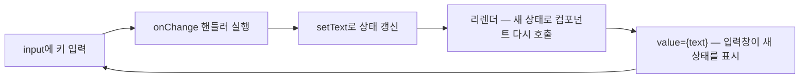

<Callout type="info">
  **이번 문서의 목표:** onClick·onChange 핸들러를 올바르게 연결하고 Synthetic Event가 무엇인지 설명할 수 있으며, 제어 컴포넌트 방식으로 입력창 하나짜리 폼을 완전히 통제할 수 있게 된다.
</Callout>

## 이 문서의 위치

지금까지 만든 화면은 전부 **구경만 가능한** 화면이었습니다. 선언적 UI(4편)와 props(5편)로 화면을 그렸지만, 사용자가 클릭하고 입력하는 **상호작용**은 아직 없습니다. 이번 편에서 그 문을 엽니다 — React가 이벤트를 다루는 방식, 그 뒤에 숨은 Synthetic Event라는 장치, 그리고 웹 상호작용의 왕인 **폼**(form, 입력 양식)을 React식으로 통제하는 두 가지 노선(제어·비제어)까지. 상호작용이 "왜 상태가 필요한가"라는 질문을 낳고, 그 답이 7편의 useState로 이어집니다.

## 1. React의 이벤트 핸들러

### 왜 필요한가 — 이벤트라는 개념부터

브라우저에서 일어나는 모든 사건 — 클릭, 키 입력, 스크롤, 마우스 이동 — 을 **이벤트**(event, 사건)라고 부릅니다. "이 사건이 일어나면 이 함수를 실행해 달라"고 등록해 두는 함수가 **이벤트 핸들러**(event handler, 사건 처리기)입니다. React 이전의 방식(1편)에서는 `addEventListener`로 DOM 노드에 핸들러를 직접 매달았습니다 — 요소를 찾고, 매달고, 필요하면 떼는 것까지 전부 수동이었죠.

React의 선언적 철학은 이벤트에도 그대로 적용됩니다.

> **쉽게 말하면:** "이 버튼을 찾아서 핸들러를 매달아라"(명령)가 아니라, "이 버튼은 클릭되면 이 함수가 실행되는 버튼이다"(선언)라고 JSX에 적습니다.

### 문법 — 세 가지 관찰 포인트

```jsx
function AlarmButton() {
  function handleClick() {
    alert("알람이 울립니다!");
  }

  return <button onClick={handleClick}>알람 울리기</button>;
}
```

이 짧은 코드에 규칙 세 개가 들어 있습니다.

1. **camelCase 이름** — HTML의 `onclick`이 아니라 `onClick`입니다. JSX 속성은 자바스크립트 세계의 관례를 따릅니다(4편). `onChange`, `onSubmit`, `onMouseEnter`, `onKeyDown` 등 모두 마찬가지입니다.
2. **중괄호로 함수 자체를 전달** — HTML의 `onclick="handleClick()"`처럼 문자열이 아니라, `{handleClick}`으로 **함수라는 값**을 넘깁니다.
3. **괄호를 붙이지 않는다** — `onClick={handleClick()}`이라고 쓰면 렌더 시점에 즉시 실행됩니다(5편에서 함수 props로 이미 본 함정). "나중에 클릭되면 호출해 줘"이므로 이름만 넘깁니다.

핸들러 이름은 관례상 `handle` + 이벤트명(handleClick, handleChange)으로 짓고, 그것을 받는 props 쪽은 `on` + 의미(onClick, onDelete)로 짓습니다. 5편의 `ActionButton` 예제가 정확히 이 관례였습니다.

### 인자를 넘기고 싶다면 — 화살표 함수로 감싸기

핸들러에 인자를 넘겨야 할 때가 있습니다. 예컨대 목록의 삭제 버튼마다 "몇 번을 지울지"가 달라야 하는 경우죠. 괄호를 붙이면 즉시 실행되니, **화살표 함수로 한 겹 감싸서** "클릭되면 이 호출을 실행하는 함수"를 만들어 넘깁니다.

```jsx
function TodoItem({ id, text, onDelete }) {
  return (
    <li>
      {text}
      {/* 클릭 시점에 비로소 onDelete(id)가 실행된다 */}
      <button onClick={() => onDelete(id)}>삭제</button>
    </li>
  );
}
```

`() => onDelete(id)` 전체가 하나의 새 함수이고, 이 함수는 클릭 전까지 실행되지 않습니다. "즉시 실행 금지"와 "인자 전달"을 동시에 만족하는 표준 패턴입니다.

## 2. Synthetic Event — 핸들러가 받는 그 객체의 정체

### 이벤트 객체

핸들러 함수는 첫 번째 인자로 **이벤트 객체**를 받습니다. 사건의 조서 같은 것입니다 — 어떤 요소에서, 어떤 키가, 어떤 좌표에서 일어났는지가 전부 담겨 있습니다.

```jsx
function NameInput() {
  function handleChange(event) {
    // event.target = 사건이 일어난 요소, .value = 그 요소의 현재 입력값
    console.log("현재 입력값:", event.target.value);
  }

  return <input onChange={handleChange} placeholder="이름 입력" />;
}
```

가장 자주 쓰는 프로퍼티는 둘입니다.

- `event.target` — 이벤트가 발생한 DOM 요소. 입력창이라면 `event.target.value`가 현재 입력값.
- `event.preventDefault()` — 브라우저의 **기본 동작을 취소**하는 메서드. 잠시 뒤 폼에서 주인공이 됩니다.

### 그런데 이 객체, 브라우저의 원본이 아니다

여기서 React의 숨은 장치가 등장합니다. React 핸들러가 받는 이벤트 객체는 브라우저가 만든 원본(native event)이 아니라, React가 원본을 감싸서 만든 **SyntheticEvent**(신세틱 이벤트 — synthetic은 "합성된, 인공의"라는 뜻)입니다.

> **쉽게 말하면:** 브라우저마다 사투리가 조금씩 다른 원본 이벤트 위에, React가 **표준어 통역사**를 한 겹 씌운 것입니다. 우리는 어느 브라우저에서든 같은 표준어로 대화합니다.

왜 이런 겹을 만들었을까요?

1. **브라우저 간 일관성** — 과거 브라우저들은 이벤트 객체의 프로퍼티·동작이 제각각이었습니다. SyntheticEvent는 W3C 표준 명세에 맞춘 동일한 인터페이스를 모든 브라우저에서 보장합니다. `event.target`도 `preventDefault()`도 어디서나 같은 방식으로 동작합니다.
2. **React의 이벤트 관리 최적화** — React는 핸들러를 각 DOM 노드에 일일이 매달지 않고, 앱의 루트에서 이벤트를 한꺼번에 받아 해당 컴포넌트의 핸들러로 배달하는 구조(이벤트 위임)를 씁니다. 수천 개의 목록 항목에 핸들러를 붙여도 실제 등록은 소수로 유지됩니다. 이 배달 체계의 화폐가 SyntheticEvent입니다.

실용적 결론은 단순합니다 — **평소에는 원본 이벤트와 똑같이 쓰면 되고**, 정말 원본이 필요한 드문 경우에만 `event.nativeEvent`로 꺼낼 수 있다는 것만 알아두면 됩니다.

## 3. 폼 — 브라우저의 기본 동작과 싸우기

### submit 이벤트와 preventDefault

폼의 핵심 이벤트는 **submit**(제출)입니다. 사용자가 제출 버튼을 누르거나 입력창에서 Enter를 치면 발생합니다. 그런데 브라우저의 폼에는 뿌리 깊은 기본 동작이 있습니다 — **제출되면 서버로 데이터를 보내며 페이지 전체를 새로고침**하는 것. 전통적인 웹(1편의 다중 페이지 방식)의 유산입니다.

SPA(Single Page Application, 단일 페이지 애플리케이션 — 1편)에서 페이지 새로고침은 재앙입니다. 애써 쌓아온 화면과 데이터가 전부 날아가니까요. 그래서 React 폼의 제출 핸들러는 거의 항상 이 한 줄로 시작합니다.

```jsx
function handleSubmit(event) {
  event.preventDefault(); // 새로고침이라는 기본 동작을 취소한다
  // 이제 데이터를 우리가 원하는 방식으로 처리한다
}
```

그리고 제출 처리는 버튼의 `onClick`이 아니라 **form 태그의 `onSubmit`**에 답니다. Enter 키 제출까지 한 번에 잡히기 때문입니다.

### 입력값은 누가 관리하는가 — 두 노선

새로고침을 막았으면, 이제 진짜 질문이 남습니다. **사용자가 입력창에 친 값은 누가 들고 있는가?** 여기서 React 폼의 두 노선이 갈립니다.

- **비제어 컴포넌트**(uncontrolled component): 입력값을 **DOM이 들고 있게 둡니다.** 브라우저의 input은 원래 자기 값을 스스로 기억합니다. React는 개입하지 않다가, 필요한 순간(제출 등)에만 DOM에서 값을 꺼내 읽습니다.
- **제어 컴포넌트**(controlled component): 입력값을 **React가 들고 있습니다.** 입력창에 보이는 값 자체가 React의 상태이고, 키 입력마다 상태를 갱신하며, 입력창은 그 상태를 비추는 거울이 됩니다.

> **쉽게 말하면:** 비제어는 "직원(DOM)이 알아서 장부를 쓰고 사장(React)은 마감 때만 확인"하는 가게, 제어는 "모든 거래가 실시간으로 사장의 장부에 기록되고 진열대는 그 장부를 비추는" 가게입니다.

### 제어 컴포넌트의 구조 — 한 바퀴 도는 데이터

제어 컴포넌트를 만들려면 "React가 값을 들고 있을 곳"이 필요합니다. 그곳이 **상태**(state)이고, `useState`라는 훅으로 만듭니다. useState의 원리(왜 이렇게 생겼는지, 리렌더와의 관계)는 7편에서 통째로 파고들 예정이니, 여기서는 사용 형태만 받아들입시다 — `const [value, setValue] = useState("")`는 "value라는 상태와, 그것을 바꾸는 전용 함수 setValue를 만든다"는 뜻입니다.



키 입력 → 핸들러 → 상태 갱신 → 리렌더 → 입력창 반영. 이 한 바퀴가 키 하나 칠 때마다 돕니다. 입력창의 표시값이 항상 상태와 일치하므로, **화면과 데이터가 어긋날 수 없는 구조**입니다 — 1편에서 명령형의 고질병이라 했던 바로 그 불일치가 원천 차단됩니다.

직접 만져봅시다. 입력창에 타이핑하면서 미리보기와 글자 수가 실시간으로 따라오는 것을 확인해 보세요.

<CodePlayground
  template="react"
  activeFile="/App.js"
  showConsole
  label="제어 컴포넌트 — 단일 입력 폼의 완성형"
  files={{
    '/App.js': `import { useState } from "react";

export default function App() {
  // 입력값의 유일한 보관소는 React 상태다
  const [nickname, setNickname] = useState("");

  function handleChange(event) {
    // 키 입력마다: DOM에서 읽어와 상태에 기록
    setNickname(event.target.value);
  }

  function handleSubmit(event) {
    event.preventDefault(); // 새로고침 차단
    console.log("제출된 닉네임:", nickname);
    setNickname(""); // 상태를 비우면 입력창도 함께 비워진다
  }

  return (
    <form onSubmit={handleSubmit}>
      <input
        value={nickname}
        onChange={handleChange}
        placeholder="닉네임을 입력하세요"
      />
      <button type="submit">가입</button>

      <p>미리보기: {nickname || "(아직 입력 없음)"}</p>
      <p>글자 수: {nickname.length} / 10</p>
      {nickname.length > 10 && <p>닉네임이 너무 깁니다!</p>}
    </form>
  );
}`,
  }}
/>

구조의 핵심은 input의 두 props입니다.

- `value={nickname}` — 입력창의 표시값을 상태에 **묶는다**(바인딩). 이 순간부터 입력창은 상태의 거울이 됩니다.
- `onChange={handleChange}` — 키 입력마다 상태를 갱신한다. 이게 없으면 상태가 영영 안 바뀌어 **아무리 쳐도 글자가 안 써지는** 얼어붙은 입력창이 됩니다.

그리고 제어 방식의 보상이 예제 하단에 보입니다 — 미리보기, 글자 수 세기, 실시간 경고. **값이 항상 React 손안에 있으니, 키 입력마다 무엇이든 할 수 있습니다.** 실시간 유효성 검사, 입력값 변형(자동 대문자화 등), 조건부 버튼 활성화가 전부 이 구조에서 공짜로 나옵니다. `handleSubmit`에서 `setNickname("")` 한 줄로 입력창이 비워지는 것도 같은 원리입니다 — DOM을 만진 게 아니라 상태를 바꿨을 뿐인데 거울이 따라옵니다.

<Callout type="warning">
  **자주 틀리는 점:** `value`만 주고 `onChange`를 빼먹으면 입력이 안 되는 읽기 전용 입력창이 됩니다(React가 콘솔 경고도 띄웁니다). 상태로 묶었으면 갱신 통로도 반드시 함께 열어야 합니다. 정말 읽기 전용을 원한다면 `readOnly` 속성을 명시하세요.
</Callout>

### 두 노선 비교 — 언제 무엇을 쓰나

| 구분 | 제어 컴포넌트 | 비제어 컴포넌트 |
|------|---------------|-----------------|
| 값의 보관소 | React 상태 | DOM 노드 자신 |
| 값 읽는 시점 | 항상 (키 입력마다) | 필요한 순간만 |
| 실시간 검증·변형 | 자연스럽게 가능 | 어려움 |
| 코드량 | 상태 + 핸들러 필요 | 적음 |
| 적합한 곳 | 대부분의 폼, 검증·미리보기가 필요할 때 | 파일 입력, 아주 단순한 일회성 폼 |

React 공식 문서와 커뮤니티의 기본 권장은 **제어 컴포넌트**입니다. 이 과목도 폼은 제어 방식을 기본으로 갑니다. 비제어 방식은 DOM 노드를 직접 참조하는 도구인 `useRef`와 짝을 이루는데, 그 구현은 10편에서 다룹니다.

## 4. 남은 질문 — 상태란 대체 무엇인가

이번 편에서 우리는 `useState`를 "일단 받아들이고" 썼습니다. 그런데 곱씹어 보면 이상한 점이 있습니다. 컴포넌트는 함수이고 렌더는 그 함수를 다시 호출하는 것인데(3편), 함수가 다시 호출되면 지역 변수는 초기화되어야 정상입니다. **nickname은 어떻게 리렌더를 넘어 살아남을까요?** 그리고 `setNickname`을 호출하면 **왜 리렌더가 일어날까요?** 이 두 질문의 답 — 상태의 저장 위치, 상태 변경과 리렌더의 연결 고리 — 이 다음 7편의 전부입니다.

## 핵심 정리

- React 이벤트는 JSX에 선언한다 — **camelCase 이름**(onClick), **중괄호로 함수 자체**를, **괄호 없이** 전달.
- 인자가 필요하면 `onClick={() => handler(id)}`처럼 화살표 함수로 감싼다.
- 핸들러가 받는 이벤트 객체는 **SyntheticEvent** — 브라우저 원본을 감싸 모든 브라우저에서 동일한 표준 인터페이스를 보장하는 React의 통역사.
- 폼 제출은 form의 `onSubmit`에서 받고, `event.preventDefault()`로 페이지 새로고침이라는 기본 동작을 차단한다.
- **제어 컴포넌트**는 입력값의 보관소를 DOM에서 React 상태로 옮긴 것 — `value`로 묶고 `onChange`로 갱신하며, 실시간 검증·미리보기가 공짜로 따라온다.

## 마무리 복습

<Quiz
  questionNumber={1}
  question="React에서 클릭 이벤트 핸들러를 올바르게 연결한 것은?"
  options={['onclick 속성에 문자열로 함수 이름을 적는다', 'onClick={handleClick} 처럼 중괄호로 함수 자체를 전달한다', 'onClick={handleClick()} 처럼 호출 결과를 전달한다', 'addEventListener를 렌더 함수 안에서 직접 호출한다']}
  correctAnswer={2}
  explanation="JSX에서는 camelCase 이름의 props에 중괄호로 함수 값을 전달한다. 괄호를 붙이면 렌더 시점에 즉시 실행되고, addEventListener 직접 호출은 React의 선언적 모델을 벗어난다."
  optionExplanations={['HTML 방식이며 JSX에서는 camelCase와 중괄호를 쓴다', '정답 — 나중에 호출될 함수 자체를 값으로 넘긴다', '렌더 순간 즉시 실행되어 클릭과 무관하게 동작한다', '수동 등록은 React의 관리 밖이라 권장되지 않는다']}
/>

<Quiz
  questionNumber={2}
  question="목록의 삭제 버튼에서 항목의 id를 핸들러에 넘기는 올바른 방법은?"
  options={['괄호를 붙여 onDelete(id)를 그대로 onClick에 넣는다', '화살표 함수로 감싸 클릭 시 onDelete(id)를 호출하는 새 함수를 onClick에 넘긴다', 'HTML처럼 문자열로 함수 호출 코드를 적는다', 'id는 핸들러에 넘길 수 없다']}
  correctAnswer={2}
  explanation="화살표 함수로 감싸면 클릭 시점에 비로소 onDelete(id)가 실행된다. 괄호를 바로 붙이면 렌더 중 즉시 실행되고, 문자열 방식은 HTML의 문법이다."
  optionExplanations={['렌더 시점에 즉시 실행되는 함정이다', '정답 — 즉시 실행을 막으면서 인자도 전달하는 표준 패턴이다', '문자열 전달은 JSX에서 함수로 동작하지 않는다', '화살표 함수로 감싸면 얼마든지 넘길 수 있다']}
/>

<Quiz
  questionNumber={3}
  question="SyntheticEvent에 대한 설명으로 틀린 것은?"
  options={['브라우저의 원본 이벤트를 감싼 React의 래퍼 객체다', '모든 브라우저에서 동일한 표준 인터페이스를 보장한다', '원본 이벤트와 사용법이 완전히 달라 별도 문법을 배워야 한다', 'event.nativeEvent로 원본 이벤트에 접근할 수 있다']}
  correctAnswer={3}
  explanation="SyntheticEvent는 표준 명세에 맞춘 래퍼라서 target, preventDefault 등 원본과 같은 방식으로 쓰면 된다. 사용법이 다른 것이 아니라 오히려 브라우저 간 차이를 없애 일관되게 만든 것이다."
  optionExplanations={['맞는 설명 — 원본 위에 한 겹 씌운 통역사다', '맞는 설명 — 래퍼의 존재 이유가 일관성 보장이다', '정답(틀린 설명) — 평소에는 원본과 똑같이 쓰면 된다', '맞는 설명 — 드물게 원본이 필요하면 꺼낼 수 있다']}
/>

<Quiz
  questionNumber={4}
  question="폼 제출 핸들러에서 event.preventDefault()를 호출하는 이유는?"
  options={['이벤트 객체를 메모리에서 해제하려고', '제출 시 페이지 전체가 새로고침되는 브라우저 기본 동작을 취소하려고', '제출 버튼을 비활성화하려고', '입력값을 자동으로 검증하려고']}
  correctAnswer={2}
  explanation="폼의 기본 동작은 서버로 데이터를 보내며 페이지를 새로고침하는 것인데, SPA에서는 화면과 데이터가 전부 초기화되므로 이를 취소하고 자바스크립트로 직접 처리한다."
  optionExplanations={['메모리 해제와는 무관하다', '정답 — 새로고침을 막아야 SPA의 화면과 상태가 유지된다', '버튼 비활성화는 disabled 속성의 역할이다', '검증은 별도 로직으로 직접 작성해야 한다']}
/>

<Quiz
  questionNumber={5}
  question="제어 컴포넌트와 비제어 컴포넌트를 가르는 기준은?"
  options={['클래스 컴포넌트인지 함수 컴포넌트인지', '입력값의 보관소가 React 상태인지 DOM 노드인지', '이벤트 핸들러의 개수', 'CSS 적용 여부']}
  correctAnswer={2}
  explanation="제어 컴포넌트는 입력값을 React 상태가 들고 있고 입력창은 그 거울이 된다. 비제어 컴포넌트는 DOM이 스스로 값을 기억하고 React는 필요한 순간에만 읽는다."
  optionExplanations={['컴포넌트 정의 방식과는 무관하다', '정답 — 값을 누가 들고 있느냐가 두 노선의 구분점이다', '핸들러 개수는 기준이 아니다', '스타일과는 무관하다']}
/>

<Quiz
  questionNumber={6}
  question="input에 value={text}만 지정하고 onChange를 지정하지 않으면 생기는 일은?"
  options={['평소처럼 자유롭게 입력할 수 있다', '입력할 때마다 자동으로 상태가 갱신된다', '상태가 갱신될 통로가 없어 타이핑해도 글자가 써지지 않는 얼어붙은 입력창이 된다', '빌드 에러가 발생한다']}
  correctAnswer={3}
  explanation="value로 상태에 묶인 입력창은 상태가 바뀌어야만 표시값이 바뀐다. onChange가 없으면 상태를 갱신할 방법이 없어 입력이 반영되지 않고, React는 콘솔 경고를 띄운다."
  optionExplanations={['표시값이 상태에 고정되어 자유 입력이 불가능하다', '자동 갱신 장치는 없다 — onChange로 직접 연결해야 한다', '정답 — 거울만 있고 장부 기록 통로가 없는 상태다', '빌드는 통과하고 런타임 경고와 함께 오동작한다']}
/>

<Quiz
  questionNumber={7}
  question="제어 컴포넌트 방식의 대표적인 이점이 아닌 것은?"
  options={['키 입력마다 실시간 유효성 검사를 할 수 있다', '입력값 미리보기·글자 수 표시가 자연스럽다', '상태를 바꾸는 것만으로 입력창을 비울 수 있다', '상태와 핸들러 코드를 전혀 쓰지 않아도 된다']}
  correctAnswer={4}
  explanation="제어 컴포넌트는 상태와 onChange 핸들러를 반드시 작성해야 한다. 코드가 적은 쪽은 비제어 방식이며, 그 대가로 실시간 검증·미리보기 같은 능력을 포기한다."
  optionExplanations={['값이 항상 React 손안에 있어 키 입력마다 검사할 수 있다', '상태를 화면 어디에든 비출 수 있어 자연스럽다', '보관소가 상태이므로 상태를 비우면 입력창도 비워진다', '정답(이점 아님) — 상태와 핸들러 작성은 제어 방식의 필수 비용이다']}
/>

## 참고 자료

- [React 공식 문서 - Learn 섹션](https://react.dev/learn)
- [MDN - React 인터랙티비티: 이벤트와 상태](https://developer.mozilla.org/en-US/docs/Learn_web_development/Core/Frameworks_libraries/React_interactivity_events_state)
- [MDN - React 기본 튜토리얼 시리즈](https://developer.mozilla.org/en-US/docs/Learn_web_development/Core/Frameworks_libraries/React)
