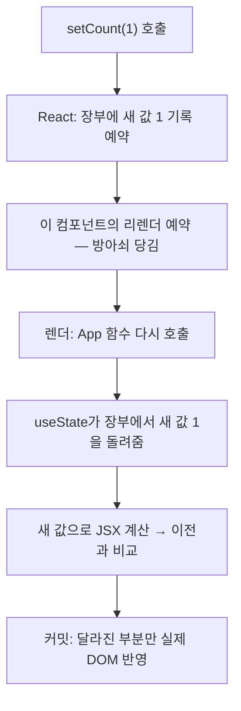

<Callout type="info">
  **이번 문서의 목표:** "일반 변수는 왜 안 되고 useState는 왜 되는가"를 저장 위치와 리렌더 메커니즘으로 설명할 수 있고, 배열·객체 상태를 불변 방식으로 추가·수정·삭제할 수 있게 된다.
</Callout>

## 이 문서의 위치

6편 끝에서 두 가지 질문이 남았습니다 — 함수가 다시 호출되는데 상태는 어떻게 살아남는가, 그리고 setNickname은 왜 리렌더를 일으키는가. 이번 편이 그 답입니다. **useState는 React에서 가장 많이 쓰는 훅이자, "상태가 바뀌면 화면이 바뀐다"는 React의 심장 그 자체**입니다. 문법 암기가 아니라 메커니즘 이해가 목표입니다 — 이게 잡히면 8편(생명주기 감각)과 9편(useEffect)이 순탄해지고, 안 잡히면 계속 미궁입니다.

## 1. 왜 일반 변수로는 안 되는가 — 실패를 먼저 목격하기

상태 없이, 일반 지역 변수로 카운터를 만들어 봅시다. 버튼을 아무리 눌러도 화면의 숫자는 꿈쩍하지 않습니다.

<CodePlayground
  template="react"
  activeFile="/App.js"
  showConsole
  label="일반 변수 카운터 — 눌러도 화면이 바뀌지 않는 이유 관찰"
  files={{
    '/App.js': `export default function App() {
  let count = 0; // 일반 지역 변수

  function handleClick() {
    count = count + 1;
    console.log("변수 값은 분명 올라간다:", count);
  }

  return (
    <div>
      <p>카운트: {count}</p>
      <button onClick={handleClick}>+1</button>
    </div>
  );
}`,
  }}
/>

콘솔을 보면 변수 값은 분명 1, 2, 3으로 올라갑니다. 그런데 화면은 0 그대로입니다. 실패의 원인은 두 겹입니다.

1. **React가 변화를 모른다.** 지역 변수를 바꾸는 것은 React 입장에서 아무 신호가 아닙니다. 렌더(= 함수 재호출, 3편)를 시작할 방아쇠가 당겨지지 않으니, 화면을 다시 계산할 기회 자체가 없습니다.
2. **다시 호출돼도 소용없다.** 설령 어떤 이유로 리렌더가 일어나도, 함수가 다시 실행되면 `let count = 0`부터 다시 시작합니다. 지역 변수는 함수 호출이 끝나면 사라지는 운명입니다.

그러니 상태라는 도구는 정확히 두 가지를 해결해야 합니다 — **렌더 사이에 값이 살아남을 것**, 그리고 **값이 바뀌면 리렌더가 일어날 것**. useState가 바로 그 두 가지를 묶은 장치입니다.

## 2. useState의 시그니처 — 한 줄 해부

```jsx
import { useState } from "react";

const [count, setCount] = useState(0);
```

> **쉽게 말하면:** useState(0)은 React에게 "초깃값 0짜리 보관함 하나 주세요"라고 요청하는 것이고, React는 **현재 값**과 **값을 바꾸는 전용 리모컨**을 쌍으로 돌려줍니다.

부분별로 뜯어봅시다.

- `useState(0)` — 인자는 **초깃값**(initial value)입니다. 첫 렌더에서 딱 한 번만 의미가 있고, 이후 렌더에서는 무시됩니다(보관함은 이미 있으니까요).
- 반환값은 **원소 두 개짜리 배열**입니다 — `[현재 값, 변경 함수]`. 배열이라서 구조 분해 할당(5편에서 객체 구조 분해를 봤죠 — 이건 배열판)으로 받으며, 배열 구조 분해는 순서 기반이라 **이름을 마음대로** 지을 수 있습니다. `[count, setCount]`, `[nickname, setNickname]` — "값, set값" 짝으로 짓는 것이 관례입니다.
- `count`는 **상태 변수**(state variable) — 이번 렌더에서 읽는 현재 값.
- `setCount`는 **세터 함수**(setter function) — 값을 바꾸는 유일한 정식 통로. `count = 5` 같은 직접 대입은 지역 변수만 바꿀 뿐 React에 아무 신호도 주지 못합니다.

### 값은 어디에 저장되는가

함수 밖 어딘가에 살아남는다면, 어디일까요? **React가 컴포넌트 트리 상의 그 컴포넌트 자리에 연결해 보관합니다.** React는 화면의 각 컴포넌트마다 내부 장부를 갖고 있고, useState 호출은 그 장부의 칸 하나를 배정받는 일입니다. 함수는 렌더마다 왔다가 사라지지만 장부는 React가 계속 들고 있으므로, 다음 렌더의 useState 호출은 **새 보관함을 만드는 게 아니라 기존 칸의 값을 돌려받습니다.**

이 구조에서 중요한 따름정리 하나 — 장부는 **컴포넌트 자리마다 독립**입니다. 같은 컴포넌트를 세 번 렌더링하면 트리에 자리가 세 개 생기고, 각자 자기만의 상태를 가집니다. 카운터 컴포넌트 세 개는 서로의 숫자에 아무 영향을 주지 않습니다.

그리고 "장부의 칸"이 **호출 순서로 배정**된다는 사실이 훅 호출 규칙(조건문 안에서 훅 금지)의 뿌리인데, 이 이야기는 8편에서 제대로 다룹니다.

## 3. 상태 변경 → 리렌더 — 메커니즘 전체 흐름

`setCount(1)`을 호출하면 무슨 일이 벌어질까요?



세터 함수는 사실 **두 가지 일을 묶어서** 합니다 — 새 값을 장부에 기록하는 것, 그리고 **리렌더를 예약**하는 것. 1절의 실패 두 가지가 정확히 이 두 동작으로 해결되는 것을 확인하세요. 값은 장부에 살아남고, 변경은 방아쇠를 당깁니다. 이후는 3편에서 배운 렌더 사이클 그대로입니다 — 렌더(재호출·계산)와 커밋(달라진 부분만 DOM 반영).

### 스냅샷: 한 렌더 안에서 상태는 상수다

여기서 입문자를 가장 크게 넘어뜨리는 지점이 나옵니다. 다음 코드에서 버튼 한 번 클릭에 카운트는 몇이 될까요?

```jsx
function handleClick() {
  setCount(count + 1);
  setCount(count + 1);
  setCount(count + 1);
}
```

3이 아니라 **1**입니다. 왜일까요 — `count`는 **이번 렌더의 스냅샷**이기 때문입니다. 5편에서 props가 렌더 한 번의 스냅샷이라고 했는데, 상태도 정확히 같습니다. 이번 렌더에서 `count`는 0이라는 **상수**입니다. 세 줄은 전부 `setCount(0 + 1)`, 즉 "다음 렌더의 값을 1로 해줘"를 세 번 예약한 것에 불과합니다.

또 하나 — `setCount`를 호출해도 **그 자리에서 `count`가 바뀌지 않습니다.** 세터는 "다음 렌더를 예약"할 뿐, 진행 중인 이번 렌더의 스냅샷은 끝까지 0입니다. `setCount(count + 1); console.log(count);`가 여전히 0을 찍는 이유입니다. React는 핸들러 안의 여러 상태 변경을 모아 한 번에 처리(배칭, batching)한 뒤 리렌더 한 번으로 끝냅니다 — 그래서 세 번 호출해도 렌더는 한 번입니다.

### 함수형 업데이트: 예약에 계산식을 넘기기

"진짜로 세 번 올리고 싶다"면, 값 대신 **함수**를 세터에 넘깁니다.

```jsx
function handleClick() {
  setCount((prev) => prev + 1);
  setCount((prev) => prev + 1);
  setCount((prev) => prev + 1);
}
```

`(prev) => prev + 1`은 "그 시점의 최신 값을 받아 1 더한 값을 돌려주는" **업데이터 함수**(updater function)입니다. React는 예약 목록을 처리할 때 이 함수들을 **순서대로 이어서** 실행합니다 — 0을 받아 1을, 1을 받아 2를, 2를 받아 3을. 결과는 3입니다. "다음 값이 이전 값에 의존하는 갱신"에서는 함수형 업데이트가 정답이라고 기억해 두세요. 9편에서 useEffect와 얽힐 때 이 습관이 버그 하나를 통째로 예방해 줍니다.

## 4. 불변 업데이트 — 객체·배열 상태의 철칙

### 왜 수정하면 안 되고 교체해야 하는가

숫자·문자열 상태는 세터에 새 값을 주면 끝입니다. 문제는 **객체와 배열**입니다. 다음 코드는 왜 화면을 못 바꿀까요?

```jsx
const [user, setUser] = useState({ name: "제노", age: 26 });

function handleBirthday() {
  user.age = 27;      // ❌ 기존 객체를 직접 수정 (mutation)
  setUser(user);      // 같은 객체를 다시 전달
}
```

React는 세터가 받은 새 값과 기존 값을 **`Object.is`로 비교해서, 같으면 리렌더를 생략**합니다. 그리고 자바스크립트에서 객체 변수는 내용물이 아니라 **참조**(reference — 객체가 놓인 위치를 가리키는 값)를 담습니다. `user.age = 27`로 속을 고쳐도 `user`가 가리키는 위치는 그대로이므로, React 눈에는 "같은 값이 또 왔네" — 리렌더 없음. 내용을 일일이 뒤져보는 깊은 비교는 큰 객체에서 너무 비싸기 때문에, React는 참조 비교라는 빠른 방식을 택했고, 그 대가로 우리에게 규칙 하나를 요구합니다.

> **쉽게 말하면:** React는 상자 안을 열어보지 않고 **상자가 새것인지만** 봅니다. 내용을 바꿨으면 반드시 **새 상자에 담아** 건네야 합니다. 이것이 불변(immutable) 업데이트입니다.

```jsx
function handleBirthday() {
  // ✅ 새 객체를 만들어 교체 — 스프레드로 복사 후 바꿀 부분만 덮어쓰기
  setUser({ ...user, age: 27 });
}
```

`...user`는 **스프레드 문법**(spread syntax) — 기존 객체의 프로퍼티를 새 객체 안에 펼쳐 복사합니다. 그 뒤에 적은 `age: 27`이 같은 이름을 덮어씁니다. "기존 것을 복사한 새 상자 + 바뀔 부분만 갱신"이 불변 업데이트의 기본 공식입니다.

### 배열의 CRUD — 수정하는 메서드를 버리고 새 배열을 만드는 메서드로

배열도 객체이므로 같은 철칙이 적용됩니다. `push`, `splice`, 인덱스 대입처럼 **원본을 수정하는** 메서드 대신, **새 배열을 반환하는** 메서드를 씁니다.

| 하고 싶은 일 | ❌ 원본 수정 | ✅ 새 배열 반환 |
|--------------|--------------|-----------------|
| 추가 | `todos.push(item)` | `[...todos, item]` |
| 삭제 | `todos.splice(i, 1)` | `todos.filter(...)` |
| 수정 | `todos[i] = newItem` | `todos.map(...)` |
| 정렬 | `todos.sort()` | `[...todos].sort()` — 복사 후 정렬 |

이 표가 곧 리스트 **CRUD**(Create·Read·Update·Delete — 만들기·읽기·고치기·지우기, 데이터 다루기의 4대 기본 동작)의 React 버전입니다. 실제 할 일 목록으로 세 가지를 한 번에 구현해 봅시다. 4편의 리스트 렌더링·key가 그대로 재등장하는 것도 확인하세요.

<CodePlayground
  template="react"
  activeFile="/App.js"
  label="배열 상태 CRUD — 추가·완료 토글·삭제를 전부 불변 방식으로"
  files={{
    '/App.js': `import { useState } from "react";

let nextId = 3;

export default function App() {
  const [text, setText] = useState("");
  const [todos, setTodos] = useState([
    { id: 1, text: "장보기", done: false },
    { id: 2, text: "운동하기", done: true },
  ]);

  function handleAdd(event) {
    event.preventDefault();
    if (text === "") return;
    // 추가: 스프레드로 복사한 새 배열 끝에 새 항목
    setTodos([...todos, { id: nextId, text: text, done: false }]);
    nextId = nextId + 1;
    setText("");
  }

  function handleToggle(id) {
    // 수정: map으로 새 배열 — 대상 항목만 새 객체로 교체
    setTodos(
      todos.map((todo) =>
        todo.id === id ? { ...todo, done: !todo.done } : todo
      )
    );
  }

  function handleDelete(id) {
    // 삭제: filter로 대상만 뺀 새 배열
    setTodos(todos.filter((todo) => todo.id !== id));
  }

  return (
    <div>
      <form onSubmit={handleAdd}>
        <input
          value={text}
          onChange={(e) => setText(e.target.value)}
          placeholder="할 일 입력"
        />
        <button type="submit">추가</button>
      </form>
      <ul>
        {todos.map((todo) => (
          <li key={todo.id}>
            <span
              onClick={() => handleToggle(todo.id)}
              style={{ textDecoration: todo.done ? "line-through" : "none" }}
            >
              {todo.text}
            </span>
            <button onClick={() => handleDelete(todo.id)}>삭제</button>
          </li>
        ))}
      </ul>
    </div>
  );
}`,
  }}
/>

세 핸들러를 눈여겨보세요 — 전부 "기존 배열은 건드리지 않고, 원하는 모양의 **새 배열을 만들어 세터에 준다**"는 한 문장으로 요약됩니다. `handleToggle`의 `{ ...todo, done: !todo.done }`처럼, 배열 속 객체를 고칠 때는 **배열도 새로, 그 객체도 새로** 만든다는 점까지 챙기면 불변 업데이트는 끝입니다.

<Callout type="warning">
  **자주 틀리는 점:** 불변 업데이트를 어기면 에러가 나는 게 아니라 **화면이 조용히 안 바뀌거나, 어떨 때는 우연히 바뀌는** 애매한 버그가 됩니다(다른 상태 변경에 묻어가서 갱신된 것처럼 보이는 경우). 에러 메시지가 없어서 초보자가 몇 시간씩 헤매는 대표 유형이니, "객체·배열 상태는 무조건 새로 만들어 교체"를 반사신경으로 만들어 두세요. 스프레드 복사는 한 겹만 복사하는 얕은 복사라서, 중첩이 깊은 객체는 바뀌는 경로의 겹마다 새로 만들어야 한다는 것도 함께 기억해 두면 좋습니다.
</Callout>

## 5. 상태 끌어올리기 맛보기 — 상태는 어디에 두는가

상태를 만들 수 있게 되면 바로 다음 질문이 옵니다 — **어느 컴포넌트에 둘 것인가?** 원칙은 하나입니다. **그 상태를 쓰는 컴포넌트들의 가장 가까운 공통 부모에 둔다.** 형제 컴포넌트 둘이 같은 값을 보여줘야 한다면, 상태를 각자 갖는 게 아니라 부모로 올리고(상태 끌어올리기, lifting state up), 부모가 props로 내려줍니다(5편). 값을 바꿀 권한이 필요한 자식에게는 세터를 호출하는 함수를 내려주면 되고요(5편의 함수 props). 이 패턴의 종합 연습은 14편에서 다루고, 여기서는 "상태의 주소는 공통 부모"라는 원칙만 챙깁니다.

## 핵심 정리

- 일반 변수는 리렌더를 못 일으키고 리렌더에서 살아남지도 못한다 — useState는 이 둘을 해결하는 장치다.
- `const [값, 세터] = useState(초깃값)` — 값은 React가 컴포넌트 자리별 장부에 보관하고, 초깃값은 첫 렌더에만 쓰인다.
- 세터는 **새 값 기록 + 리렌더 예약**을 함께 한다. 이번 렌더의 상태 변수는 끝까지 안 바뀌는 **스냅샷**이다.
- 이전 값 기반 갱신은 `set((prev) => ...)` **함수형 업데이트**로 — 여러 번 호출해도 순서대로 정확히 누적된다.
- 객체·배열 상태는 **불변 업데이트** — React는 참조만 비교하므로, 직접 수정하지 말고 스프레드·map·filter로 새것을 만들어 교체한다.

## 마무리 복습

<Quiz
  questionNumber={1}
  question="컴포넌트 안의 일반 지역 변수를 바꿔도 화면이 갱신되지 않는 두 가지 이유는?"
  options={['변수가 상수로 선언되었고 브라우저가 차단하기 때문', 'React에 리렌더 신호가 가지 않고, 리렌더되어도 지역 변수는 초깃값부터 다시 시작하기 때문', '이벤트 핸들러 안에서는 변수 수정이 금지되기 때문', 'JSX가 변수를 읽지 못하기 때문']}
  correctAnswer={2}
  explanation="지역 변수 수정은 React에 아무 신호를 주지 못해 렌더의 방아쇠가 당겨지지 않고, 설령 리렌더가 일어나도 함수 재호출과 함께 지역 변수는 초기화된다. useState는 이 두 문제를 함께 해결한다."
  optionExplanations={['let 변수는 수정 가능하고 브라우저 차단도 없다', '정답 — 신호 부재와 값 소실이라는 두 겹의 실패다', '핸들러 안에서 변수 수정 자체는 자유롭다', 'JSX는 중괄호로 변수를 잘 읽는다 — 다시 계산할 기회가 없을 뿐이다']}
/>

<Quiz
  questionNumber={2}
  question="useState(0)의 반환값에 대한 설명으로 옳은 것은?"
  options={['현재 값 하나만 반환한다', '현재 값과 세터 함수가 담긴 원소 두 개짜리 배열을 반환한다', '세터 함수 하나만 반환한다', '상태를 담은 객체를 반환하며 이름이 고정되어 있다']}
  correctAnswer={2}
  explanation="useState는 현재 값과 변경 함수의 쌍을 배열로 반환한다. 배열 구조 분해는 순서 기반이라 두 이름을 자유롭게 지을 수 있고, 값과 set값 짝으로 짓는 것이 관례다."
  optionExplanations={['값만 있으면 바꿀 통로가 없다', '정답 — 보관함의 현재 값과 리모컨의 쌍이다', '세터만 있으면 읽을 방법이 없다', '객체가 아니라 배열이며 이름은 자유다']}
/>

<Quiz
  questionNumber={3}
  question="count가 0일 때 한 클릭 핸들러 안에서 setCount(count + 1)을 세 번 호출하면 다음 렌더의 count는?"
  options={['3', '1', '0', '호출 횟수에 따라 무작위']}
  correctAnswer={2}
  explanation="count는 이번 렌더의 스냅샷으로 핸들러 안에서 끝까지 0이다. 세 번 모두 setCount(1)을 예약한 것이라 결과는 1이며, 누적하려면 함수형 업데이트를 써야 한다."
  optionExplanations={['3이 되려면 set((prev) 형태의 함수형 업데이트가 필요하다', '정답 — 세 번 모두 0 더하기 1의 예약이다', '예약이 하나라도 처리되므로 0은 아니다', '동작은 결정적이며 무작위성이 없다']}
/>

<Quiz
  questionNumber={4}
  question="함수형 업데이트 set((prev) 형태가 꼭 필요한 상황은?"
  options={['상태를 처음 만들 때', '다음 값이 이전 값에 의존하는 갱신을 정확히 누적해야 할 때', '문자열 상태를 다룰 때', '컴포넌트를 삭제할 때']}
  correctAnswer={2}
  explanation="업데이터 함수는 예약 처리 시점의 최신 값을 받아 계산하므로, 여러 번 호출해도 순서대로 정확히 누적된다. 스냅샷 값 기반의 예약이 겹쳐 덮어써지는 문제를 피할 수 있다."
  optionExplanations={['초깃값은 useState의 인자로 준다', '정답 — 이전 값 의존 갱신의 표준 해법이다', '타입과는 무관하며 숫자든 문자열이든 의존 관계가 기준이다', '컴포넌트 삭제와는 무관하다']}
/>

<Quiz
  questionNumber={5}
  question="객체 상태를 user.age = 27 로 직접 수정한 뒤 setUser(user)를 호출하면 화면이 안 바뀌는 이유는?"
  options={['세터 함수가 객체를 받지 못하기 때문', 'React가 이전 값과 참조를 비교하는데 같은 객체라서 리렌더를 생략하기 때문', 'age 프로퍼티가 읽기 전용이기 때문', '숫자 27이 유효하지 않은 값이기 때문']}
  correctAnswer={2}
  explanation="React는 세터가 받은 값을 기존 값과 참조 수준에서 비교해 같으면 리렌더를 건너뛴다. 속을 고쳐도 참조가 그대로면 변화로 인식되지 않으므로, 스프레드로 새 객체를 만들어 교체해야 한다."
  optionExplanations={['세터는 객체를 얼마든지 받는다', '정답 — 상자 안이 아니라 상자가 새것인지만 본다', '일반 객체의 프로퍼티는 수정 가능하다 — 문제는 감지되지 않는 것이다', '값 자체는 유효하다']}
/>

<Quiz
  questionNumber={6}
  question="배열 상태에서 특정 id의 항목만 제거하는 올바른 불변 업데이트는?"
  options={['splice로 해당 인덱스를 잘라낸다', 'filter로 해당 id를 제외한 새 배열을 만들어 세터에 넘긴다', 'delete 연산자로 원소를 지운다', '해당 인덱스에 null을 대입한다']}
  correctAnswer={2}
  explanation="filter는 원본을 건드리지 않고 조건을 통과한 원소만 담은 새 배열을 반환하므로 불변 업데이트에 적합하다. splice, delete, 인덱스 대입은 모두 원본을 수정해 React가 변화를 감지하지 못한다."
  optionExplanations={['splice는 원본 배열을 직접 수정한다', '정답 — 새 배열 반환 메서드가 불변 업데이트의 도구다', 'delete는 원본을 수정하며 빈 구멍까지 남긴다', '원본 수정인 데다 목록에 null이 남는다']}
/>

<Quiz
  questionNumber={7}
  question="같은 카운터 컴포넌트를 화면에 세 번 렌더링했을 때 상태에 대한 설명으로 옳은 것은?"
  options={['셋이 하나의 상태를 공유한다', '트리 상의 자리마다 독립된 상태를 가져 서로 영향을 주지 않는다', '마지막에 렌더링된 것만 상태를 가진다', '부모가 상태를 대신 보관한다']}
  correctAnswer={2}
  explanation="React의 상태 장부는 컴포넌트 정의가 아니라 트리 상의 자리마다 독립적으로 배정된다. 같은 컴포넌트라도 자리가 다르면 완전히 별개의 상태를 가진다."
  optionExplanations={['공유하려면 상태를 공통 부모로 끌어올려 props로 내려야 한다', '정답 — 장부는 자리 단위로 독립이다', '모든 자리가 각자 상태를 가진다', '부모 보관은 상태 끌어올리기를 명시적으로 했을 때의 이야기다']}
/>

<Quiz
  questionNumber={8}
  question="형제 컴포넌트 두 개가 같은 상태를 보여주고 함께 갱신해야 할 때의 올바른 설계는?"
  options={['각자 useState로 같은 초깃값의 상태를 만든다', '가장 가까운 공통 부모에 상태를 두고 값과 변경 함수를 props로 내려준다', '전역 변수에 값을 저장한다', '한 형제가 다른 형제의 상태를 직접 수정한다']}
  correctAnswer={2}
  explanation="상태 끌어올리기 패턴이다. 상태를 공통 부모에 두면 두 자식이 같은 값을 props로 받아 항상 일치하고, 변경 함수를 내려받은 자식이 갱신을 요청할 수 있다."
  optionExplanations={['각자 만들면 서로 다른 값으로 어긋나게 된다', '정답 — 상태의 주소는 사용처들의 공통 부모다', '전역 변수는 리렌더를 일으키지 못한다', '형제의 상태에 직접 접근할 방법은 없다']}
/>

## 참고 자료

- [React 공식 문서 - useState 레퍼런스](https://react.dev/reference/react/useState)
- [React 공식 문서 - Learn 섹션](https://react.dev/learn)
- [React 공식 문서 - Hooks API Reference](https://legacy.reactjs.org/docs/hooks-reference.html)
- [MDN - React 인터랙티비티: 이벤트와 상태](https://developer.mozilla.org/en-US/docs/Learn_web_development/Core/Frameworks_libraries/React_interactivity_events_state)
