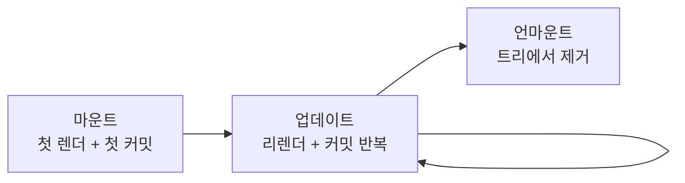

<Callout type="info">
  **이번 문서의 목표:** 컴포넌트의 탄생부터 소멸까지를 렌더·커밋 단계로 나눠 설명할 수 있고, "렌더는 왜 순수해야 하는가"와 "훅은 왜 최상위에서만 호출해야 하는가"를 원리로 답할 수 있게 된다.
</Callout>

## 이 문서의 위치

7편까지 우리는 상태가 바뀌면 리렌더가 일어난다는 것을 배웠습니다. 이번 편은 그 리렌더가 반복되는 **시간 축 전체** — 컴포넌트가 태어나고(마운트), 갱신되고(업데이트), 사라지는(언마운트) 일생 — 을 조망합니다. 클래스 컴포넌트 시절에는 이것을 **생명주기**(lifecycle, 라이프사이클)라는 이름의 메서드들로 다뤘지만, 함수 컴포넌트에는 그런 메서드가 없습니다. 대신 필요한 것이 **감각**입니다 — "지금 내 코드는 일생의 어느 시점에 실행되는가"를 아는 감각. 이 감각이 9편 useEffect를 이해하는 유일한 열쇠라서, 목차에서 useEffect보다 이 편이 먼저입니다.

## 1. 컴포넌트의 일생 — 마운트, 업데이트, 언마운트

먼저 큰 그림부터. 컴포넌트의 일생은 세 국면으로 나뉩니다.

- **마운트**(mount, 장착): 컴포넌트가 **처음으로** 트리에 자리를 얻고 실제 DOM에 나타나는 순간. 상태 장부(7편)가 이때 초깃값으로 만들어집니다.
- **업데이트**(update, 갱신): 상태 변경이나 부모의 리렌더로 **함수가 다시 호출**되어 화면이 갱신되는 것. 일생 동안 0번일 수도, 수천 번일 수도 있습니다.
- **언마운트**(unmount, 탈착): 컴포넌트가 트리에서 **제거**되는 순간 — 조건부 렌더링(4편)이 false가 되거나 목록에서 항목이 삭제될 때. 상태 장부도 이때 폐기됩니다.

> **쉽게 말하면:** 마운트는 입주, 업데이트는 거주 중의 생활, 언마운트는 퇴거입니다. 그리고 퇴거 후 다시 입주하면 — 이전 기억(상태)은 없는 **새 입주**입니다.



## 2. 렌더 단계와 커밋 단계 — 계산과 반영의 분리

### 두 단계를 다시, 이번엔 정밀하게

3편에서 "렌더는 계산, 커밋은 반영"이라고 스케치했습니다. 이제 그 구분이 왜 설계의 중심인지 파고듭니다.

- **렌더 단계**(render phase): React가 컴포넌트 함수들을 호출해 "화면이 어떻게 생겨야 하는지"를 **계산**하는 단계. 결과물은 엘리먼트 트리(3편의 주문서 더미)이고, **실제 DOM은 전혀 건드리지 않습니다.**
- **커밋 단계**(commit phase): 계산된 새 트리를 이전 트리와 비교(재조정, 4편)한 결과 — 달라진 부분만 — 을 실제 DOM에 **반영**하는 단계. 브라우저 화면이 바뀌는 것은 이 단계 이후입니다.

왜 분리했을까요? 계산과 반영을 분리하면 React가 **계산을 자유롭게 다룰 수 있기 때문**입니다. 계산은 부작용이 없으니(잠시 뒤 순수성에서 자세히) 급한 일이 생기면 중단했다가 다시 할 수도, 버릴 수도, 미래에는 나눠서 할 수도 있습니다. 반면 실제 DOM 반영은 사용자 눈에 보이는 일이라 한 번에 일관되게 끝내야 합니다. "연습은 몇 번이든 다시 할 수 있지만 본 공연은 한 번"인 구조입니다.

이 분리가 학습자에게 주는 실용적 결론은 두 가지입니다.

1. **"함수가 호출됐다 ≠ DOM이 바뀌었다."** 렌더는 계산일 뿐이며, 리렌더가 일어나도 결과가 이전과 같은 부분의 DOM은 전혀 수정되지 않습니다.
2. **DOM을 만지는 코드는 렌더 중에 실행되면 안 된다.** 아직 반영 전이니까요. "커밋이 끝난 뒤에 실행해 줘"라고 예약하는 공식 통로가 바로 9편의 useEffect입니다.

## 3. 렌더 = 순수 함수 — 이 모델의 규칙과 이유

### 순수 함수란

**순수 함수**(pure function)는 두 조건을 만족하는 함수입니다.

1. **같은 입력이면 항상 같은 출력** — 계산이 외부의 변덕(현재 시각, 전역 변수 등)에 의존하지 않는다.
2. **부수 효과가 없다** — 계산 말고는 아무 일도 하지 않는다. 여기서 **부수 효과**(side effect, 사이드 이펙트)란 함수 바깥 세계를 바꾸는 모든 일입니다: 외부 변수 수정, DOM 조작, 네트워크 요청, 타이머 등록...

수학의 함수가 원형입니다 — $f(x) = 2x$는 언제 계산해도 3을 넣으면 6이고, 계산했다고 세상이 바뀌지 않습니다.

### React의 요구: 컴포넌트 함수 본문은 순수해야 한다

React는 **렌더 단계에서 실행되는 코드, 즉 컴포넌트 함수의 본문이 순수할 것**을 요구합니다. 1편의 공식 $UI = f(state)$가 성립하려면 $f$가 순수해야 합니다 — 같은 상태에서 같은 화면이 나와야 "상태만 관리하면 화면은 따라온다"는 React의 약속이 지켜지니까요.

더 현실적인 이유는 앞 절에 있습니다. React는 렌더(계산)를 **여러 번 하거나, 중단하거나, 버릴 수 있는 것**으로 취급합니다. 그런데 렌더 중에 부수 효과가 있다면? 계산을 두 번 하면 효과도 두 번 일어나고, 버린 계산의 효과는 되돌릴 수 없습니다. 순수해야만 "몇 번을 다시 계산해도 안전"이 보장됩니다.

```jsx
let guestCount = 0; // 컴포넌트 밖의 변수

// ❌ 순수하지 않은 컴포넌트 — 렌더가 바깥 세상을 바꾼다
function Cup() {
  guestCount = guestCount + 1; // 부수 효과!
  return <p>{guestCount}번째 손님의 컵</p>;
}
```

이 컴포넌트를 세 번 렌더링하면 1, 2, 3번째 컵이 나올까요? React가 렌더를 몇 번 수행하느냐에 따라 숫자가 제멋대로 됩니다 — 같은 입력인데 출력이 달라지는, 예측 불가능한 UI입니다. 올바른 형태는 필요한 값을 props로 받는 것입니다: `function Cup({ guest })`.

### 그럼 부수 효과는 어디에 두는가

앱은 부수 효과 없이는 아무것도 못 합니다 — 서버에서 데이터도 받아야 하고, 상태도 바꿔야 하죠. React의 답은 "하지 마라"가 아니라 "**렌더 밖으로 옮겨라**"입니다. 허용된 자리는 두 곳입니다.

| 부수 효과의 자리 | 실행 시점 | 예 |
|------------------|-----------|-----|
| 이벤트 핸들러 | 사용자의 행동에 반응해서 (렌더 중 아님) | 클릭 시 setCount, 제출 시 서버 전송 |
| useEffect | 커밋이 끝난 뒤 | 데이터 불러오기, 타이머·구독 등록 |

대부분의 부수 효과는 이벤트 핸들러의 몫입니다. "특정 이벤트 없이, 화면에 나타났다는 사실 자체 때문에" 실행해야 하는 효과만 useEffect로 갑니다 — 그 도구의 사용법 전부가 9편입니다.

### StrictMode — 순수성을 검사하는 장치

3편의 실습에서 콘솔 로그가 두 번씩 찍히는 현상을 예고했었죠. 개발 모드의 **StrictMode**(스트릭트 모드, 엄격 모드)는 **컴포넌트 함수를 일부러 두 번 호출**합니다. 순수한 컴포넌트는 두 번 호출해도 결과가 같으니 아무 문제가 없지만, 위의 `Cup`처럼 불순한 컴포넌트는 두 번 호출하면 숫자가 두 배로 뛰며 **정체를 드러냅니다.** 즉 StrictMode의 이중 호출은 버그가 아니라 버그 탐지기이고, 배포 빌드에서는 일어나지 않습니다.

## 4. 훅 호출 규칙 — 왜 최상위에서만인가

### 규칙 두 줄

React의 모든 훅(useState, useEffect, useRef...)에는 공식 규칙이 있습니다.

1. **컴포넌트 함수**(또는 커스텀 훅)**의 최상위에서만 호출한다** — 조건문·반복문·중첩 함수 안에서 호출 금지.
2. **React 함수 안에서만 호출한다** — 일반 자바스크립트 함수에서 호출 금지.

외우라면 외울 수 있지만, 이 과목의 방식대로 **이유**를 파봅시다. 이유를 알면 규칙을 어겼을 때의 증상까지 예측할 수 있습니다.

### 이유: 장부의 칸은 호출 순서로 배정된다

7편에서 React가 컴포넌트 자리마다 상태 장부를 갖는다고 했습니다. 그런데 useState를 세 번 호출하는 컴포넌트에서, React는 어떤 호출이 어떤 칸인지 **어떻게 알까요?** 훅 호출에는 이름이 없습니다 — `useState(0)`이라고만 하지 "count용입니다"라고 말해주지 않죠.

답은 놀랄 만큼 단순합니다. **순서**입니다. React는 "이 컴포넌트의 첫 번째 훅 호출은 1번 칸, 두 번째는 2번 칸..."이라고 순번으로 장부를 배정합니다. 마운트 때 이 순서로 칸이 만들어지고, 이후 모든 리렌더에서 **같은 순서로 호출된다는 전제** 아래 칸을 돌려줍니다.

이제 조건문 안의 훅이 왜 재앙인지 보입니다.

```jsx
function Profile({ showAge }) {
  const [name, setName] = useState("제노");     // 훅 1번
  if (showAge) {
    const [age, setAge] = useState(26);          // ❌ 훅 2번 — 있다가 없다가
  }
  const [nickname, setNickname] = useState("z"); // 훅 2번? 3번?
}
```

`showAge`가 true인 렌더에서는 nickname이 3번 칸, false가 되는 순간 nickname이 **2번 칸** — age의 칸을 물려받습니다. 문자열이 와야 할 자리에 숫자 26이 오는 순간 앱은 무너집니다. 창구 번호표와 같습니다 — 모두가 같은 순서로 줄을 서야 "3번 번호표 = 그 사람"이 성립하는데, 중간에 한 명이 사라지면 그 뒤 전원의 번호가 밀립니다.

그래서 React는 "호출 순서가 렌더마다 달라질 가능성" 자체를 봉쇄합니다 — 조건문·반복문·중첩 함수 금지, 항상 최상위. 조건부로 상태가 필요하더라도 훅은 무조건 호출하고, **사용을 조건부로** 하면 됩니다. 3편에서 "컴포넌트 함수를 직접 호출하지 마라"고 한 것도 같은 뿌리입니다 — 직접 호출하면 그 훅들이 호출한 쪽의 장부에 순번으로 끼어들어 순서를 망칩니다.

### 눈으로 확인하기

<CodePlayground
  template="react"
  activeFile="/App.js"
  showConsole
  label="일생 관찰 — 마운트·업데이트·언마운트에서 렌더가 언제 일어나는지"
  files={{
    '/App.js': `import { useState } from "react";

function Timer() {
  const [count, setCount] = useState(0);
  console.log("Timer 렌더 — count:", count);

  return (
    <div>
      <p>카운트: {count}</p>
      <button onClick={() => setCount(count + 1)}>+1 (업데이트)</button>
    </div>
  );
}

export default function App() {
  const [visible, setVisible] = useState(true);

  return (
    <div>
      <button onClick={() => setVisible(!visible)}>
        {visible ? "언마운트시키기" : "마운트시키기"}
      </button>
      {visible && <Timer />}
    </div>
  );
}`,
  }}
/>

콘솔을 보며 세 국면을 확인하세요. 처음 나타날 때 렌더 로그(마운트 — StrictMode라면 두 번 찍힐 수 있습니다), +1을 누를 때마다 로그(업데이트), 토글로 숨기면 로그 없음(언마운트 — 함수 호출 자체가 없음). 그리고 다시 마운트하면 **count가 0부터** 시작합니다 — 언마운트 때 상태 장부가 폐기되고 새 입주가 시작됐다는 증거입니다.

## 5. 클래스 생명주기와의 개념적 대응 — 지도만 그려두기

옛 자료나 면접 질문에는 클래스 컴포넌트의 생명주기 **메서드** 이름이 등장합니다. 함수 컴포넌트를 배운 우리에게 필요한 것은 그 메서드들의 사용법이 아니라 **번역표**입니다.

| 클래스 시절의 메서드 | 시점 | 함수 컴포넌트에서의 대응 |
|----------------------|------|--------------------------|
| constructor | 탄생 준비 — 상태 초기화 | `useState(초깃값)` |
| render | 화면 계산 | 함수 본문 그 자체 |
| componentDidMount | 마운트 커밋 직후 | useEffect (9편) |
| componentDidUpdate | 업데이트 커밋 직후 | useEffect + 의존성 배열 (9편) |
| componentWillUnmount | 언마운트 직전 정리 | useEffect의 클린업 함수 (9편) |

주의할 것은 이 표가 **개념적 대응이지 1:1 번역이 아니라는 점**입니다. 클래스는 "시점"을 기준으로 코드를 쪼갰고(마운트 때 할 일, 업데이트 때 할 일...), 함수 컴포넌트의 useEffect는 "관심사"를 기준으로 묶습니다(타이머에 관한 일, 데이터에 관한 일...). 사고방식 자체가 다르므로, 이 표는 옛 자료를 읽을 때의 지도로만 쓰고 — 함수 컴포넌트를 클래스식 시점 분할로 설계하려 하지 마세요. 클래스 컴포넌트 자체는 이 과목 범위 밖이며(학습 방향 문서 기준), 이 표로 역사적 맥락 정리를 마칩니다.

## 핵심 정리

- 컴포넌트의 일생: **마운트**(입주, 상태 장부 생성) → **업데이트**(리렌더 반복) → **언마운트**(퇴거, 장부 폐기).
- **렌더 단계는 계산, 커밋 단계는 반영** — 함수 호출이 곧 DOM 변경이 아니며, 계산은 반복·중단·폐기될 수 있는 것으로 취급된다.
- 렌더 중 실행되는 코드는 **순수**해야 한다 — 부수 효과는 이벤트 핸들러 또는 useEffect(9편)로. StrictMode의 이중 호출은 순수성 탐지기다.
- 훅의 상태 칸은 **호출 순서**로 배정되므로, 훅은 조건문·반복문 밖 최상위에서 항상 같은 순서로 호출해야 한다.
- 클래스 생명주기 메서드는 개념 번역표로만 — 함수 컴포넌트는 시점이 아니라 관심사로 코드를 묶는다.

## 마무리 복습

<Quiz
  questionNumber={1}
  question="마운트·업데이트·언마운트에 대한 설명으로 틀린 것은?"
  options={['마운트는 컴포넌트가 처음 트리에 자리를 얻어 DOM에 나타나는 것이다', '업데이트는 리렌더로 화면이 갱신되는 것으로 여러 번 일어날 수 있다', '언마운트된 컴포넌트가 다시 마운트되면 이전 상태를 그대로 이어받는다', '언마운트 시 그 컴포넌트의 상태 장부는 폐기된다']}
  correctAnswer={3}
  explanation="언마운트 시 상태 장부가 폐기되므로, 다시 마운트되면 초깃값부터 시작하는 새 입주다. 이전 기억은 남지 않는다."
  optionExplanations={['맞는 설명 — 입주에 해당하며 상태 장부도 이때 생성된다', '맞는 설명 — 일생 동안 수천 번도 가능하다', '정답(틀린 설명) — 퇴거 시 장부가 폐기되어 새 마운트는 초깃값부터다', '맞는 설명 — 그래서 재마운트 시 상태가 초기화된다']}
/>

<Quiz
  questionNumber={2}
  question="렌더 단계와 커밋 단계를 분리한 설계의 이점으로 가장 알맞은 것은?"
  options={['렌더 단계에서 DOM을 더 빨리 수정할 수 있다', '계산은 반복·중단·폐기가 자유로워지고, 사용자에게 보이는 DOM 반영은 한 번에 일관되게 끝낼 수 있다', '커밋 단계를 생략할 수 있다', '상태를 여러 컴포넌트가 공유할 수 있다']}
  correctAnswer={2}
  explanation="렌더는 부수 효과 없는 순수한 계산이라 몇 번을 다시 해도 안전하고, 실제 반영은 커밋에서 한 번에 처리된다. 연습은 자유롭게, 본 공연은 한 번이라는 구조다."
  optionExplanations={['렌더 단계는 DOM을 아예 건드리지 않는다', '정답 — 계산의 자유와 반영의 일관성을 동시에 얻는 분리다', '화면이 바뀌려면 커밋은 반드시 필요하다', '상태 공유는 상태 끌어올리기의 주제로 이 분리와 무관하다']}
/>

<Quiz
  questionNumber={3}
  question="순수 함수의 두 가지 조건은?"
  options={['빠른 실행 속도와 짧은 코드', '같은 입력에 같은 출력, 그리고 부수 효과 없음', '매개변수 없음과 반환값 없음', '비동기 처리와 에러 처리']}
  correctAnswer={2}
  explanation="순수 함수는 외부 상황에 관계없이 같은 입력이면 항상 같은 출력을 내고, 계산 외에 바깥 세계를 바꾸는 일을 하지 않는다. React는 컴포넌트 함수 본문에 이 순수성을 요구한다."
  optionExplanations={['속도·길이는 순수성과 무관하다', '정답 — 예측 가능성과 무해성이 두 기둥이다', '순수 함수도 매개변수와 반환값을 가진다 — 오히려 그것이 전부인 함수다', '비동기·에러 처리는 별개의 주제다']}
/>

<Quiz
  questionNumber={4}
  question="React가 렌더 중 부수 효과를 금지하는 실질적인 이유는?"
  options={['부수 효과는 문법 에러를 일으키기 때문', 'React가 렌더를 여러 번 수행하거나 버릴 수 있어, 렌더에 효과가 섞이면 예측 불가능하게 중복 실행되기 때문', '부수 효과가 CSS를 깨뜨리기 때문', '메모리 사용량이 늘어나기 때문']}
  correctAnswer={2}
  explanation="렌더는 반복·중단·폐기될 수 있는 계산이다. 거기에 부수 효과가 섞이면 계산 횟수만큼 효과가 중복되고 버린 계산의 효과는 되돌릴 수 없다. 효과는 이벤트 핸들러나 useEffect로 옮긴다."
  optionExplanations={['문법상으로는 실행된다 — 그래서 더 위험하다', '정답 — 계산의 자유가 성립하려면 계산이 무해해야 한다', 'CSS 문제가 아니라 실행 횟수 예측의 문제다', '메모리가 아니라 정확성의 문제다']}
/>

<Quiz
  questionNumber={5}
  question="개발 모드에서 StrictMode가 컴포넌트 함수를 두 번 호출하는 목적은?"
  options={['렌더링 속도를 두 배로 높이려고', '두 번 호출해도 결과가 같은지 확인해 순수하지 않은 컴포넌트를 드러내려고', '브라우저 호환성을 검사하려고', '메모리 누수를 자동으로 수정하려고']}
  correctAnswer={2}
  explanation="순수한 컴포넌트는 이중 호출에도 결과가 같지만, 불순한 컴포넌트는 부수 효과가 두 배로 일어나 정체를 드러낸다. 배포 빌드에서는 이중 호출이 일어나지 않는다."
  optionExplanations={['속도는 오히려 개발 모드에서 느려진다', '정답 — 이중 호출은 버그가 아니라 순수성 탐지기다', '브라우저 호환성 검사와는 무관하다', '자동 수정 기능은 없다 — 드러낼 뿐이다']}
/>

<Quiz
  questionNumber={6}
  question="훅을 조건문 안에서 호출하면 안 되는 근본적인 이유는?"
  options={['조건문 안에서는 함수 호출이 금지되어 있어서', 'React가 훅의 상태 칸을 호출 순서로 배정하는데, 조건에 따라 순서가 흔들리면 칸이 어긋나기 때문', '조건문이 렌더 속도를 늦추기 때문', '훅이 조건문의 블록 스코프를 읽지 못하기 때문']}
  correctAnswer={2}
  explanation="훅 호출에는 이름이 없어 React는 순번으로 장부의 칸을 배정한다. 렌더마다 호출 순서가 같아야 칸이 맞아떨어지는데, 조건문 안의 훅은 있다가 없다가 하며 뒤의 모든 훅의 순번을 밀어버린다."
  optionExplanations={['일반 함수 호출은 조건문 안에서 자유롭다', '정답 — 번호표 순서가 흔들리면 뒤 전원의 칸이 어긋난다', '속도 문제가 아니라 상태 배정의 정합성 문제다', '스코프와는 무관하다']}
/>

<Quiz
  questionNumber={7}
  question="클래스 생명주기 메서드와 함수 컴포넌트의 관계를 가장 올바르게 이해한 것은?"
  options={['함수 컴포넌트에도 componentDidMount를 정의하면 호출된다', '두 방식은 개념적으로 대응시킬 수 있지만, 클래스는 시점 기준·훅은 관심사 기준으로 코드를 묶는 다른 사고방식이다', '클래스 생명주기를 먼저 완벽히 배워야 훅을 쓸 수 있다', '함수 컴포넌트에는 생명주기라는 개념 자체가 없다']}
  correctAnswer={2}
  explanation="constructor는 useState 초깃값, 커밋 직후의 메서드들은 useEffect에 개념적으로 대응하지만 1:1 번역은 아니다. 클래스는 시점으로 쪼개고 훅은 관심사로 묶는다는 사고방식 차이가 본질이다."
  optionExplanations={['함수 컴포넌트에서 그 이름의 함수는 그냥 일반 함수일 뿐 호출되지 않는다', '정답 — 번역표는 옛 자료를 읽는 지도로만 쓴다', '현대 React 학습에 클래스 선행은 필요 없다', '마운트·업데이트·언마운트라는 일생 개념은 여전히 존재한다 — 메서드가 없을 뿐이다']}
/>

## 참고 자료

- [React 공식 문서 - Learn 섹션](https://react.dev/learn)
- [React 공식 문서 - Hooks 개요](https://legacy.reactjs.org/docs/hooks-overview.html)
- [React 공식 문서 - useState 레퍼런스](https://react.dev/reference/react/useState)
- [React 공식 문서 - Hooks API Reference](https://legacy.reactjs.org/docs/hooks-reference.html)
