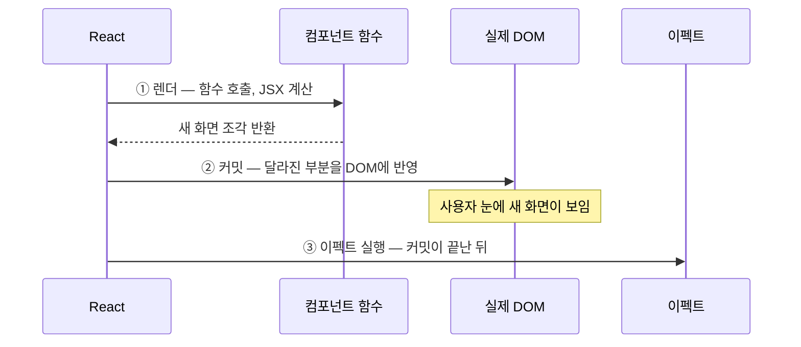
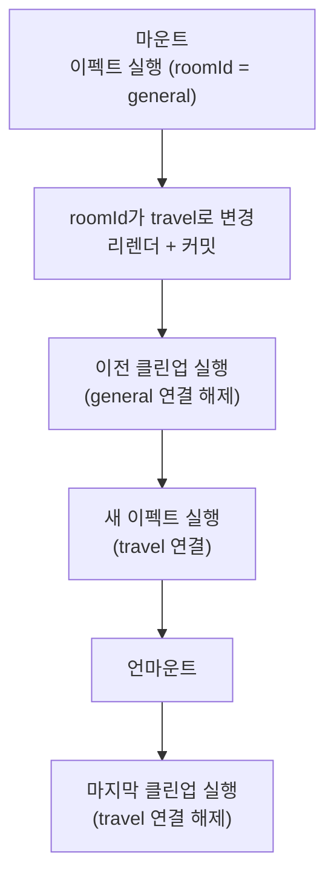

<Callout type="info">
  **이번 문서의 목표:** useEffect의 의존성 배열 세 가지 형태가 각각 언제 실행되는지 정확히 예측하고, 클린업 함수로 타이머·구독을 안전하게 정리하며, 무한 루프·stale closure 같은 대표 버그를 스스로 찾아 고칠 수 있게 된다.
</Callout>

## 왜 useEffect가 필요한가 — 렌더가 하지 못하는 일

8편에서 우리는 **렌더는 순수 함수여야 한다**는 원칙을 배웠습니다. 컴포넌트 함수는 같은 입력(props, state)을 받으면 같은 JSX를 반환해야 하고, 그 과정에서 바깥세상을 건드리면 안 됩니다. 자세한 내용은 08편에서 다뤘습니다.

그런데 실제 앱은 바깥세상을 건드려야만 합니다. 예를 들어:

- 서버에서 **데이터를 받아오기**(fetch, 페치)
- 1초마다 시계를 갱신하는 **타이머**(timer) 걸기
- 브라우저 창 크기 변화를 감시하는 **이벤트 구독**(subscription, 서브스크립션)
- 문서 제목(`document.title`) 바꾸기
- 채팅 서버에 **연결**(connect)하고 나갈 때 **해제**(disconnect)하기

이런 일들을 **부수 효과**(side effect, 사이드 이펙트)라고 부릅니다. side(옆), effect(효과) — 함수의 본업(입력을 받아 출력을 계산하는 일) 옆에서 일어나는, 바깥세상에 흔적을 남기는 효과라는 뜻입니다. "화면 조각을 계산해 반환한다"는 렌더의 본업이 아니면서, 컴포넌트가 화면에 존재하는 동안 함께 일어나야 하는 일들이죠.

문제는 이겁니다. **부수 효과를 컴포넌트 함수 본문에 그냥 쓰면 렌더의 순수성이 깨집니다.** 렌더는 React가 필요할 때마다 몇 번이든 다시 호출할 수 있는데, 본문에 `fetch` 요청이 있다면 리렌더될 때마다 서버에 요청이 날아갑니다. 타이머라면 리렌더마다 새 타이머가 겹겹이 쌓입니다.

> **쉽게 말하면:** useEffect는 "이 일은 렌더 계산이 아니니까, **렌더가 끝나고 화면에 반영된 다음에** 따로 실행해줘"라고 React에 맡기는 예약 창구입니다.

React는 이 예약 창구로 **useEffect**(유즈 이펙트)라는 훅(hook, 갈고리 — 함수 컴포넌트에 React 기능을 걸어 쓰는 함수, 자세한 내용은 08편)을 제공합니다.

## 1. useEffect의 기본 형태

### 시그니처 뜯어보기

```jsx
import { useEffect } from "react";

function MyComponent() {
  useEffect(() => {
    // ① 이펙트 함수: 부수 효과를 실행하는 코드
    return () => {
      // ② 클린업 함수: 뒷정리 코드 (선택 사항)
    };
  }, [/* ③ 의존성 배열 */]);

  return <div>...</div>;
}
```

세 부분을 하나씩 이름 붙여 봅시다.

1. **이펙트 함수**(effect function) — 첫 번째 인자로 넘기는 함수. 부수 효과 본체가 여기 들어갑니다.
2. **클린업 함수**(cleanup function, 뒷정리 함수) — 이펙트 함수가 **반환**하는 함수. 걸어둔 타이머·구독을 해제하는 코드가 들어갑니다. 필요 없으면 아무것도 반환하지 않아도 됩니다.
3. **의존성 배열**(dependency array, 디펜던시 어레이) — 두 번째 인자로 넘기는 배열. "이 배열 안의 값이 바뀌었을 때만 이펙트를 다시 실행해라"는 조건표입니다.

### 실행 타이밍 — 렌더 후, 커밋 후

가장 중요한 사실: **이펙트 함수는 렌더 중에 실행되지 않습니다.** 8편에서 배운 렌더 단계(render phase)와 커밋 단계(commit phase)를 떠올려 봅시다. 컴포넌트 함수를 호출해 JSX를 계산하는 것이 렌더 단계, 그 결과를 실제 DOM(Document Object Model, 문서 객체 모델 — 브라우저가 들고 있는 화면 객체 트리)에 반영하는 것이 커밋 단계입니다.

useEffect에 예약한 코드는 **커밋이 끝나 화면이 실제로 갱신된 뒤에** 실행됩니다.



왜 이 순서일까요? 이펙트는 대개 "화면에 이미 존재하는 것"을 전제로 하기 때문입니다. DOM 노드를 측정하거나, 화면이 뜬 다음 데이터를 요청하는 일은 커밋 이전엔 할 수도 없고 해서도 안 됩니다. 그리고 무엇보다 — 이펙트가 렌더 밖으로 격리되어 있기 때문에 **렌더 함수 자체는 순수하게 유지**됩니다. 비유하자면, 렌더는 요리사가 요리(화면)를 만드는 일이고, 이펙트는 요리가 손님상에 나간 뒤에 하는 배달 전화·설거지 예약 같은 부대 업무입니다. 요리하는 도중에 설거지를 하면 요리가 엉키니까, "요리가 나간 다음에 해라"라고 순서를 정해둔 것이죠.

## 2. 의존성 배열 — 세 가지 형태와 실행 시점

> **쉽게 말하면:** 의존성 배열은 "언제 또 실행할까?"에 대한 답안지입니다. 안 주면 "매번", 빈 배열이면 "처음 한 번만", 값을 넣으면 "그 값이 바뀔 때만"입니다.

useEffect의 행동은 두 번째 인자인 의존성 배열의 형태에 따라 완전히 달라집니다. 세 가지 형태를 표로 먼저 보고, 하나씩 실험해 봅시다.

| 형태 | 코드 | 실행 시점 |
|------|------|-----------|
| 배열 생략 | `useEffect(fn)` | **모든 렌더 후마다** 실행 |
| 빈 배열 | `useEffect(fn, [])` | **첫 렌더 후 한 번만** 실행 (마운트 시) |
| 값이 있는 배열 | `useEffect(fn, [a, b])` | 첫 렌더 후 + **a나 b가 이전 렌더와 달라진 렌더 후** 실행 |

여기서 **마운트**(mount, 장착)라는 용어가 나왔습니다. 컴포넌트가 처음으로 화면에 나타나는 것을 마운트, 화면에서 사라지는 것을 **언마운트**(unmount, 탈착), 그 사이에 다시 그려지는 것을 **업데이트**(update, 갱신)라고 부릅니다. 자세한 생명주기 감각은 08편에서 다뤘습니다.

### 직접 실험하기

아래 실습기에서 세 개의 useEffect가 각각 언제 실행되는지 콘솔로 확인해 보세요. 버튼을 눌러 count를 바꾸고, 입력창에 글자를 쳐서 text를 바꿔보면 차이가 선명해집니다.

<CodePlayground
  template="react"
  activeFile="/App.js"
  showConsole
  label="의존성 배열 세 가지 형태 — 콘솔에서 실행 시점 관찰하기"
  files={{
    '/App.js': `import { useState, useEffect } from "react";

export default function App() {
  const [count, setCount] = useState(0);
  const [text, setText] = useState("");

  // ① 배열 생략: 모든 렌더 후마다
  useEffect(() => {
    console.log("① 매번 실행 — count:", count, "text:", text);
  });

  // ② 빈 배열: 첫 렌더 후 한 번만
  useEffect(() => {
    console.log("② 마운트 때 한 번만 실행");
  }, []);

  // ③ [count]: count가 바뀐 렌더 후에만
  useEffect(() => {
    console.log("③ count가 바뀔 때만 실행 — count:", count);
  }, [count]);

  return (
    <div>
      <button onClick={() => setCount(count + 1)}>count +1 (현재 {count})</button>
      <input
        value={text}
        onChange={(e) => setText(e.target.value)}
        placeholder="여기 입력하면 text만 바뀜"
      />
    </div>
  );
}`,
  }}
/>

입력창에 글자를 치면 ①은 실행되지만 ③은 조용합니다. text는 ③의 의존성 배열에 없기 때문입니다. React는 렌더가 끝날 때마다 **의존성 배열의 각 값을 이전 렌더 때의 값과 `Object.is`로 비교**해서, 하나라도 다르면 이펙트를 다시 실행합니다. `Object.is`(오브젝트 이즈)는 두 값이 같은지 판별하는 자바스크립트(JavaScript) 내장 함수로, `===`(일치 연산자)와 거의 같게 동작합니다. 숫자·문자열 같은 원시값은 값 자체를 비교하고, 객체·배열·함수는 **참조**(reference, 메모리상의 주소)를 비교한다는 점이 뒤에서 버그의 씨앗이 됩니다.

### 의존성 배열은 "요청"이 아니라 "신고"다

여기서 정말 많은 입문자가 오해하는 지점을 짚고 갑니다. 의존성 배열은 "이 타이밍에 실행해 주세요"라고 **원하는 시점을 고르는 옵션이 아닙니다.** 공식 문서의 관점은 반대입니다 — 의존성 배열은 **"내 이펙트 코드가 이 값들을 읽고 있습니다"라고 정직하게 신고하는 목록**입니다.

이펙트 함수 안에서 읽는 반응형 값(props, state, 그리고 그것들로 계산한 값)은 **전부** 의존성 배열에 넣는 것이 원칙입니다. 실행 시점은 그 신고의 **결과로 따라오는 것**이지, 개발자가 임의로 고르는 것이 아닙니다. "마운트 때 한 번만 실행하고 싶으니까 count를 빼야지"라고 거짓 신고를 하면, 곧이어 배울 stale closure 버그가 찾아옵니다.

## 3. 클린업 함수 — 뒷정리를 예약하는 방법

### 왜 뒷정리가 필요한가

타이머를 거는 이펙트를 생각해 봅시다. 컴포넌트가 화면에서 사라져도(언마운트) 타이머는 브라우저 안에서 계속 돌아갑니다. 사라진 컴포넌트의 state를 갱신하려는 유령 타이머가 되는 거죠. 구독도 마찬가지입니다 — 채팅방 컴포넌트가 사라졌는데 서버 연결이 살아 있으면, 연결이 계속 쌓여 메모리 누수(memory leak, 메모리 새어나감)와 중복 수신이 일어납니다.

그래서 이펙트는 **자기가 벌인 일을 자기가 치우는 함수**를 반환할 수 있습니다. 이것이 클린업 함수입니다.

```jsx
useEffect(() => {
  const timerId = setInterval(() => {
    console.log("똑딱");
  }, 1000);

  // 이펙트가 반환하는 함수 = 클린업
  return () => {
    clearInterval(timerId);
  };
}, []);
```

### 클린업은 언제 실행되는가

클린업의 실행 시점은 두 가지입니다.

1. **언마운트 직전** — 컴포넌트가 화면에서 사라질 때, 마지막 뒷정리로 실행됩니다.
2. **다음 이펙트 실행 직전** — 의존성이 바뀌어 이펙트를 다시 실행해야 할 때, **먼저 이전 이펙트의 클린업을 실행한 뒤** 새 이펙트를 실행합니다.

두 번째가 특히 중요합니다. 흐름을 그림으로 보면:



즉 이펙트의 생애는 항상 **"연결 → 해제 → 연결 → 해제 → … → 해제"** 짝으로 돌아갑니다. 호텔 객실 비유가 정확합니다 — 새 손님(새 의존성 값)을 받기 전에 반드시 이전 손님의 방을 치우고(클린업), 마지막 손님이 나가면 최종 청소를 합니다. 방 청소를 건너뛰면 이전 손님의 짐(이전 타이머, 이전 연결)이 방에 쌓입니다.

### 실험: 클린업이 없으면 어떻게 되나

아래 실습기는 클린업이 있는 타이머와 없는 타이머를 비교합니다. "타이머 켜기/끄기" 버튼을 여러 번 눌러보세요. 클린업 없는 쪽은 누를 때마다 유령 타이머가 겹쳐 카운트가 미친 듯이 뛰기 시작합니다.

<CodePlayground
  template="react"
  activeFile="/App.js"
  showConsole
  label="클린업이 있는 타이머 vs 없는 타이머 — 유령 타이머 관찰"
  files={{
    '/App.js': `import { useState, useEffect } from "react";

function GoodTimer() {
  const [tick, setTick] = useState(0);
  useEffect(() => {
    const id = setInterval(() => setTick((t) => t + 1), 1000);
    console.log("착한 타이머 시작:", id);
    return () => {
      console.log("착한 타이머 정리:", id);
      clearInterval(id);
    };
  }, []);
  return <p>클린업 있음: {tick}</p>;
}

function LeakyTimer() {
  const [tick, setTick] = useState(0);
  useEffect(() => {
    const id = setInterval(() => setTick((t) => t + 1), 1000);
    console.log("유령 타이머 시작:", id);
    // 클린업 없음! 언마운트돼도 타이머가 살아남는다
  }, []);
  return <p>클린업 없음: {tick}</p>;
}

export default function App() {
  const [show, setShow] = useState(true);
  return (
    <div>
      <button onClick={() => setShow(!show)}>
        타이머 {show ? "끄기" : "켜기"}
      </button>
      {show && (
        <div>
          <GoodTimer />
          <LeakyTimer />
        </div>
      )}
    </div>
  );
}`,
  }}
/>

콘솔을 보면 착한 타이머는 꺼질 때마다 "정리" 로그가 찍히지만, 유령 타이머는 시작 로그만 쌓입니다. 켜고 끄기를 세 번 반복하면 유령 타이머는 세 개가 동시에 돌아갑니다. 실제 서비스에서 이 패턴은 웹소켓 연결이 수십 개 쌓이거나, 이벤트 리스너가 중복 등록되어 클릭 한 번에 핸들러가 다섯 번 실행되는 버그로 나타납니다.

<Callout type="warning">
  **자주 틀리는 점:** 클린업이 필요한 이펙트의 판별법은 간단합니다 — 이펙트가 **"시작하는" 동작**(구독 시작, 연결 시작, 타이머 시작, 리스너 등록)을 하면 반드시 **"끝내는" 동작**을 클린업으로 반환해야 합니다. `document.title` 변경처럼 시작–끝 짝이 없는 일회성 동작만 클린업이 없어도 됩니다.
</Callout>

## 4. 외부 시스템과의 동기화 — useEffect를 보는 올바른 관점

공식 문서(react.dev)는 useEffect를 이렇게 정의합니다: **"컴포넌트를 외부 시스템과 동기화하는 훅"**. 이 관점이 왜 중요한지 봅시다.

> **쉽게 말하면:** useEffect는 "무언가가 일어난 뒤에 코드를 실행하는" 도구가 아니라, "React 바깥의 시스템을 지금 props·state와 **일치하는 상태로 맞춰두는**" 도구입니다.

여기서 **외부 시스템**(external system)이란 React가 관리하지 않는 모든 것입니다 — 브라우저의 타이머 API, 네트워크, 웹소켓 서버, 브라우저 이벤트, 서드파티 라이브러리(지도, 차트 위젯 등). **동기화**(synchronization, 싱크로나이제이션)는 두 세계의 상태를 일치시킨다는 뜻입니다. sync(함께)와 chrono(시간)에서 온 말로, "같은 시간·같은 상태를 공유하게 만든다"는 어원 그대로입니다.

채팅방 예시로 보면 관점의 차이가 분명해집니다.

- ❌ 낡은 관점(생명주기 중심): "마운트 때 연결하고, roomId가 업데이트되면 재연결하고, 언마운트 때 해제한다" — 시점 세 개를 각각 관리
- ✅ 동기화 관점: "**화면에 있는 동안, 현재 roomId의 방에 연결되어 있어야 한다**" — 조건 하나만 선언

동기화 관점으로 쓰면 코드는 이 형태가 됩니다.

```jsx
useEffect(() => {
  const connection = createConnection(roomId); // 지금 roomId와 동기화 시작
  connection.connect();
  return () => connection.disconnect();        // 동기화 중단
}, [roomId]);                                  // roomId가 바뀌면 다시 동기화
```

roomId가 general에서 travel로 바뀌면 React가 알아서 "general 해제 → travel 연결"을 수행합니다. 마운트·업데이트·언마운트라는 세 시점을 개발자가 따로 챙길 필요가 없습니다 — 1편에서 배운 선언형(declarative) 사고방식이 부수 효과에도 그대로 적용된 것입니다.

### StrictMode의 이중 실행 — 버그가 아니라 검사다

개발 중에 이펙트의 console.log가 **두 번씩 찍히는 것**을 보게 될 겁니다. 이것은 React의 **StrictMode**(스트릭트 모드, 엄격 모드)가 개발 환경에서만 일부러 "마운트 → 언마운트 → 재마운트"를 한 번 더 돌려보는 검사 기능입니다. 목적은 명확합니다 — **클린업을 제대로 썼다면 두 번 실행돼도 아무 문제가 없어야 하기 때문**입니다. 연결→해제→연결이 되니까요. 두 번 실행 때문에 앱이 이상해진다면, 그것은 StrictMode의 잘못이 아니라 클린업이 빠졌다는 신호입니다. 배포 빌드에서는 한 번만 실행됩니다.

## 5. 데이터 가져오기 — useEffect의 대표 활용과 함정

서버에서 데이터를 받아오는 것은 useEffect의 가장 흔한 사용처입니다. 기본 패턴부터 봅시다.

<CodePlayground
  template="react"
  activeFile="/App.js"
  showConsole
  label="useEffect로 데이터 가져오기 — 로딩·성공 상태 관리"
  files={{
    '/App.js': `import { useState, useEffect } from "react";

// 서버 흉내: userId를 주면 0.8초 뒤 사용자 정보를 돌려준다
function fakeFetchUser(userId) {
  return new Promise((resolve) => {
    setTimeout(() => {
      resolve({ id: userId, name: "사용자" + userId, age: 20 + userId });
    }, 800);
  });
}

export default function App() {
  const [userId, setUserId] = useState(1);
  const [user, setUser] = useState(null);
  const [loading, setLoading] = useState(true);

  useEffect(() => {
    let ignore = false;        // 경쟁 상태 방지 깃발
    setLoading(true);

    fakeFetchUser(userId).then((data) => {
      if (!ignore) {           // 이 이펙트가 아직 유효할 때만 반영
        setUser(data);
        setLoading(false);
      }
    });

    return () => {
      ignore = true;           // 다음 요청이 시작되면 이 응답은 무시
    };
  }, [userId]);

  return (
    <div>
      <button onClick={() => setUserId(userId + 1)}>다음 사용자</button>
      {loading ? <p>불러오는 중...</p> : (
        <p>{user.name} ({user.age}세)</p>
      )}
    </div>
  );
}`,
  }}
/>

### ignore 깃발은 왜 필요한가 — 경쟁 상태

버튼을 빠르게 두 번 누르면 userId 1 → 2 → 3으로 요청이 연달아 나갑니다. 네트워크 세계에서는 **먼저 보낸 요청이 나중에 도착할 수 있습니다.** 사용자 3의 요청을 보냈는데 사용자 2의 응답이 뒤늦게 도착해 화면을 덮어쓰면, 화면에는 3번을 보고 있어야 할 자리에 2번이 표시됩니다. 이렇게 **여러 비동기 작업이 도착 순서를 다투는 상황**을 경쟁 상태(race condition, 레이스 컨디션)라고 합니다.

클린업이 이 문제를 우아하게 풉니다. userId가 바뀌어 새 이펙트가 실행되기 직전, **이전 이펙트의 클린업이 먼저 실행되며 이전 이펙트의 `ignore`를 true로** 바꿉니다. 뒤늦게 도착한 이전 응답은 `if (!ignore)` 검문에 걸려 버려집니다. 최신 이펙트의 응답만 화면에 반영되는 것이죠.

### async 함수를 직접 넘기면 안 되는 이유

```jsx
// ❌ 빌드는 되지만 잘못된 패턴
useEffect(async () => {
  const data = await fetchUser(userId);
}, [userId]);
```

`async` 함수는 항상 **프로미스**(Promise, 약속 객체 — 나중에 완료될 비동기 작업을 담는 객체)를 반환합니다. 그런데 React는 이펙트 함수의 반환값을 **클린업 함수**로 해석합니다. 프로미스는 함수가 아니므로 클린업 체계가 통째로 망가집니다. 올바른 방법은 **이펙트 안에 async 함수를 정의하고 호출**하는 것입니다.

```jsx
// ✅ 올바른 패턴
useEffect(() => {
  let ignore = false;
  async function load() {
    const data = await fetchUser(userId);
    if (!ignore) setUser(data);
  }
  load();
  return () => { ignore = true; };
}, [userId]);
```

<Callout type="info">
  참고로, 실무 규모의 앱에서는 데이터 가져오기를 useEffect로 직접 짜기보다 React Query 같은 전용 라이브러리나 프레임워크 기능을 쓰는 경우가 많습니다. 캐싱·재시도·경쟁 상태를 대신 처리해 주기 때문인데, 그 도구들도 내부적으로는 지금 배운 원리 위에 서 있습니다. 이 과목 범위에서는 원리를 아는 것까지가 목표입니다.
</Callout>

## 6. 대표 버그 패턴 — 상태와 이펙트가 꼬이는 세 가지 방식

### 버그 ① 무한 루프 — 이펙트가 자기 의존성을 바꿀 때

가장 악명 높은 버그입니다. 재료는 두 가지: **이펙트 안에서 setState를 호출**하고, **그 state가 이펙트의 재실행 조건에 걸리는** 경우입니다.

```jsx
// ❌ 무한 루프: 렌더 → 이펙트 → setState → 리렌더 → 이펙트 → ...
const [count, setCount] = useState(0);
useEffect(() => {
  setCount(count + 1);   // state 변경 → 리렌더 유발
});                       // 의존성 배열 생략 → 모든 렌더 후 재실행
```

흐름을 따라가 보면: 렌더 → 이펙트 실행 → `setCount`로 state 변경 → 리렌더(7편에서 배운 state 변경→리렌더 메커니즘) → 배열이 없으니 이펙트 또 실행 → 또 setCount → … 브라우저가 멈출 때까지 돕니다.

객체·배열 의존성으로도 같은 루프가 생깁니다. 더 교묘해서 실전에서 더 자주 만납니다.

```jsx
// ❌ 숨은 무한 루프
const options = { page: 1 };        // 렌더마다 "새로" 만들어지는 객체
useEffect(() => {
  fetchList(options).then(setList); // setList → 리렌더
}, [options]);                      // 리렌더마다 options는 새 참조 → "바뀜"으로 판정
```

앞서 말했듯 의존성 비교는 `Object.is`, 즉 객체는 **참조 비교**입니다. 컴포넌트 함수가 다시 호출되면(렌더 = 함수 호출, 1편) 본문의 `{ page: 1 }`은 내용이 같아도 **매번 새 객체**입니다. React 눈에는 렌더마다 의존성이 바뀐 것으로 보여 이펙트가 무한 재실행됩니다. 해결책은 객체 대신 **원시값을 의존성에 넣는 것**입니다 — `[options]` 대신 `[options.page]`, 혹은 객체 생성 자체를 이펙트 안으로 옮기기.

### 버그 ② stale closure — 낡은 값을 붙잡은 이펙트

**클로저**(closure, 폐쇄 — 함수가 자기가 만들어질 당시의 주변 변수를 기억하는 자바스크립트의 성질)를 떠올려 봅시다. 이펙트 함수도 클로저라서, **자기가 만들어진 렌더 시점의 state 값**을 기억합니다. 이 값이 낡아서(stale, 스테일 — 신선하지 않은) 생기는 버그가 stale closure입니다.

<CodePlayground
  template="react"
  activeFile="/App.js"
  showConsole
  label="stale closure 버그 — 1에서 멈추는 카운터"
  files={{
    '/App.js': `import { useState, useEffect } from "react";

export default function App() {
  const [count, setCount] = useState(0);

  useEffect(() => {
    const id = setInterval(() => {
      // 이 함수는 "마운트 시점의 count = 0"을 영원히 기억한다
      setCount(count + 1);   // 항상 0 + 1 = 1
      console.log("타이머가 기억하는 count:", count);
    }, 1000);
    return () => clearInterval(id);
  }, []);   // 빈 배열: 이펙트는 마운트 때 한 번만 만들어짐

  return <h2>카운트: {count} (1에서 멈춘다!)</h2>;
}`,
  }}
/>

의도는 1초마다 1씩 증가였지만, 화면은 1에서 멈춥니다. 빈 배열 때문에 이펙트는 **첫 렌더 때 한 번만** 만들어졌고, 그 안의 함수는 첫 렌더의 `count = 0`을 클로저로 붙잡았습니다. 매초 `setCount(0 + 1)`만 반복하는 거죠. 콘솔에도 count가 계속 0으로 찍힙니다.

해결책은 두 가지입니다.

```jsx
// 해결 A: 함수형 업데이트 — 최신 state를 React가 넣어준다 (7편에서 배운 패턴)
setCount((prev) => prev + 1);   // 의존성에 count가 필요 없어짐

// 해결 B: 정직한 의존성 신고 — count가 바뀔 때마다 타이머를 재설치
useEffect(() => {
  const id = setInterval(() => setCount(count + 1), 1000);
  return () => clearInterval(id);
}, [count]);   // 매초 클린업→재설치가 일어나므로 A가 더 낫다
```

타이머처럼 오래 살아 있는 이펙트에서는 **해결 A**(함수형 업데이트)가 정석입니다. 의존성을 줄이면서도 항상 최신 값으로 계산되기 때문입니다.

### 버그 ③ 의존성 누락 — 거짓 신고의 대가

"count를 의존성에 넣으면 너무 자주 실행되니까 빼야지"라는 유혹이 stale closure의 온상입니다. 린터(linter, 코드 검사 도구 — eslint-plugin-react-hooks)가 "React Hook useEffect has a missing dependency" 경고를 띄우는 이유가 바로 이것입니다. **경고를 주석으로 억누르지 말고**, 다음 순서로 대응하세요.

1. 정말 그 값이 이펙트에 필요한가? → 필요 없으면 이펙트 안에서 그 값을 읽지 않게 코드를 고친다.
2. state 갱신 때문이라면 → 함수형 업데이트로 바꿔 의존성 자체를 없앤다.
3. 객체·함수 의존성 때문이라면 → 원시값으로 좁히거나, 생성을 이펙트 안으로 옮긴다.
4. 그래도 필요하면 → 정직하게 배열에 넣는다. 자주 실행되는 게 정상 동작이다.

### 이펙트가 아예 필요 없는 경우

마지막 함정은 "이펙트 과용"입니다. 다음은 이펙트를 쓰면 **안 되는** 대표 사례입니다.

| 하려는 일 | 잘못된 방법 | 올바른 방법 |
|-----------|------------|------------|
| state로부터 다른 값 계산 | 이펙트에서 setState로 파생 state 만들기 | 렌더 중에 그냥 계산한다 — `const total = items.length` |
| 이벤트에 대한 반응 | 이펙트에서 state 변화를 감지해 처리 | 이벤트 핸들러에서 직접 처리한다 (6편) |
| props 변화 시 state 초기화 | 이펙트에서 감지 후 리셋 | key를 바꿔 컴포넌트를 새로 마운트한다 (4편) |

기준은 하나입니다 — **"사용자에게 화면이 보였기 때문에 일어나야 하는 일인가?"** 그렇다면 이펙트가 맞습니다. "사용자가 무언가를 했기 때문에 일어나야 하는 일"이라면 이벤트 핸들러의 몫이고, "기존 state로 계산할 수 있는 값"이라면 렌더 중 계산의 몫입니다. 렌더할 때마다 어차피 함수 전체가 다시 실행되므로(렌더 = 함수 호출), 파생 값은 이펙트 없이도 항상 최신입니다.

## 핵심 정리

- useEffect는 부수 효과를 **렌더 밖으로 격리**해, 커밋(화면 반영)이 끝난 뒤 실행되게 하는 예약 창구다. 덕분에 렌더는 순수함을 유지한다.
- 의존성 배열: **생략 = 매 렌더 후, `[]` = 마운트 때 한 번, `[a]` = a가 바뀐 렌더 후.** 비교는 `Object.is`라서 객체·배열·함수는 참조가 바뀌면 "바뀐 것"이다.
- 의존성 배열은 실행 시점을 고르는 옵션이 아니라 **이펙트가 읽는 값의 정직한 신고 목록**이다. 거짓 신고는 stale closure로 돌아온다.
- 클린업 함수는 **다음 이펙트 실행 직전**과 **언마운트 직전**에 실행된다. 시작하는 동작(타이머·구독·연결)에는 반드시 끝내는 클린업을 짝지어라.
- useEffect의 본질은 "외부 시스템과의 **동기화**"다. 데이터 가져오기에서는 ignore 깃발 클린업으로 경쟁 상태를 막고, 이펙트 안 setState는 함수형 업데이트로 무한 루프·낡은 값을 피한다.

## 마무리 복습

<Quiz
  questionNumber={1}
  question="useEffect의 이펙트 함수가 실행되는 시점으로 옳은 것은?"
  options={['컴포넌트 함수가 호출되는 도중, JSX 계산 직전', '렌더 단계와 커밋 단계가 모두 끝나 화면이 갱신된 뒤', '커밋 단계가 시작되기 직전', '사용자가 화면을 클릭하는 순간']}
  correctAnswer={2}
  explanation="이펙트는 렌더 중이 아니라, 커밋까지 끝나 실제 DOM에 화면이 반영된 뒤에 실행된다. 그래서 렌더 함수의 순수성이 유지되고, 화면에 존재하는 DOM을 전제로 한 작업이 가능하다."
  optionExplanations={['렌더 도중에 실행되면 렌더의 순수성이 깨진다 — 이펙트는 정확히 그걸 피하려는 장치다', '정답 — 렌더 후, 커밋 후가 이펙트의 실행 시점이다', '커밋 전에는 화면에 DOM이 반영되어 있지 않아 이펙트의 전제가 성립하지 않는다', '클릭에 반응하는 코드는 이벤트 핸들러의 몫이다']}
/>

<Quiz
  questionNumber={2}
  question="useEffect(fn, [])처럼 빈 의존성 배열을 넘겼을 때의 동작으로 옳은 것은?"
  options={['모든 렌더 후마다 fn이 실행된다', 'fn이 아예 실행되지 않는다', '첫 렌더 후 한 번만 실행되고, 클린업은 언마운트 직전에 실행된다', '언마운트 시점에만 fn이 실행된다']}
  correctAnswer={3}
  explanation="빈 배열은 비교할 의존성이 없다는 뜻이므로 이펙트는 마운트 직후 한 번만 실행된다. 반환한 클린업 함수는 컴포넌트가 사라지는 언마운트 직전에 실행된다."
  optionExplanations={['배열을 아예 생략했을 때의 동작이다', '한 번도 실행되지 않는 것이 아니라 마운트 때 한 번 실행된다', '정답 — 마운트 때 한 번, 클린업은 언마운트 직전이다', '언마운트 시점에 실행되는 것은 fn이 아니라 fn이 반환한 클린업이다']}
/>

<Quiz
  questionNumber={3}
  question="의존성 배열의 값이 바뀌었는지 React가 판정하는 방법으로 옳은 것은?"
  options={['JSON 문자열로 바꿔 내용 전체를 비교한다', 'Object.is로 각 값을 이전 렌더의 값과 비교하며, 객체는 참조를 비교한다', '객체의 프로퍼티를 하나씩 재귀적으로 깊게 비교한다', '값의 타입만 비교하고 내용은 비교하지 않는다']}
  correctAnswer={2}
  explanation="React는 Object.is로 얕은 비교를 한다. 숫자·문자열은 값으로, 객체·배열·함수는 참조로 비교하므로, 렌더마다 새로 만들어지는 객체를 의존성에 넣으면 매번 바뀐 것으로 판정된다."
  optionExplanations={['JSON 직렬화 비교는 하지 않는다', '정답 — Object.is의 참조 비교가 객체 의존성 무한 루프의 원인이다', '깊은 비교는 비용이 커서 React가 채택하지 않았다', '타입만 보는 것이 아니라 값 또는 참조를 비교한다']}
/>

<Quiz
  questionNumber={4}
  question="클린업 함수의 실행 시점을 모두 올바르게 짝지은 것은?"
  options={['마운트 직후 한 번만', '다음 이펙트 실행 직전과 언마운트 직전', '매 렌더 직전마다', '이펙트 함수가 실행된 직후 곧바로']}
  correctAnswer={2}
  explanation="클린업은 의존성이 바뀌어 이펙트를 다시 실행하기 직전에 이전 것을 정리하는 용도로, 그리고 컴포넌트가 사라지는 언마운트 직전에 마지막 정리 용도로 실행된다."
  optionExplanations={['마운트 직후에 실행되는 것은 이펙트 함수 본체다', '정답 — 연결과 해제가 항상 짝으로 돌아가는 구조다', '렌더 직전이 아니라 다음 이펙트 직전이다 — 렌더·커밋 이후의 이야기다', '이펙트 직후 곧바로 실행되면 정리할 의미가 없다']}
/>

<Quiz
  questionNumber={5}
  question="빈 의존성 배열의 이펙트 안에서 setInterval(() =&gt; setCount(count + 1), 1000)을 실행했더니 카운트가 1에서 멈췄다. 원인으로 옳은 것은?"
  options={['setInterval이 React 컴포넌트 안에서는 한 번만 동작하기 때문', '타이머 콜백이 마운트 시점의 count 값을 클로저로 붙잡고 있어 항상 같은 값으로 계산하기 때문', '클린업 함수가 타이머를 매초 삭제하기 때문', 'setCount는 1초에 한 번만 호출할 수 있기 때문']}
  correctAnswer={2}
  explanation="stale closure 버그다. 이펙트가 마운트 때 한 번만 만들어졌으므로 그 안의 콜백은 당시의 count = 0을 기억하고, 매초 setCount(0 + 1)만 반복한다. 함수형 업데이트 setCount(prev =&gt; prev + 1)로 고칠 수 있다."
  optionExplanations={['setInterval 자체는 정상적으로 매초 콜백을 실행하고 있다', '정답 — 낡은 클로저가 옛 count를 붙잡은 것이 원인이다', '클린업은 언마운트나 재실행 직전에만 동작하며 이 상황에는 개입하지 않는다', 'setCount 호출 횟수에는 그런 제한이 없다']}
/>

<Quiz
  questionNumber={6}
  question="렌더 함수 본문에서 const options = { page: 1 } 을 만들고 useEffect의 의존성 배열에 [options]를 넣었더니, 이펙트 안의 setState와 맞물려 무한 루프가 생겼다. 가장 근본적인 원인은?"
  options={['page 값이 1이라서 항상 참으로 평가되기 때문', '리렌더마다 options가 새 객체로 만들어져 참조 비교에서 매번 바뀐 것으로 판정되기 때문', 'useEffect는 객체를 의존성으로 받으면 무조건 에러를 던지기 때문', 'setState가 이펙트 안에서는 항상 두 번 실행되기 때문']}
  correctAnswer={2}
  explanation="렌더는 함수 호출이므로 본문에서 만든 객체는 렌더마다 새 참조다. Object.is 비교에서 매번 다르다고 판정되어 이펙트가 재실행되고, 그 안의 setState가 다시 리렌더를 부르며 루프가 완성된다. 원시값 의존성으로 좁히거나 객체 생성을 이펙트 안으로 옮겨 해결한다."
  optionExplanations={['page의 값 자체는 비교 방식과 무관하다', '정답 — 새 참조가 매번 변경으로 판정되는 것이 근본 원인이다', '객체 의존성은 에러가 아니라 조용히 참조 비교될 뿐이라 더 위험하다', 'StrictMode의 이중 실행은 개발용 검사일 뿐 무한 루프의 원인이 아니다']}
/>

<Quiz
  questionNumber={7}
  question="useEffect에 async 함수를 직접 넘기면 안 되는 이유로 옳은 것은?"
  options={['async 함수는 프로미스를 반환하는데, React는 이펙트의 반환값을 클린업 함수로 기대하기 때문', 'async 함수 안에서는 setState를 호출할 수 없기 때문', 'await가 렌더를 영원히 멈추기 때문', 'async 함수는 의존성 배열을 읽지 못하기 때문']}
  correctAnswer={1}
  explanation="이펙트 함수의 반환값 자리는 클린업 함수의 자리다. async 함수는 항상 프로미스를 반환하므로 클린업 체계가 깨진다. 이펙트 안에 async 함수를 정의하고 호출하는 패턴이 올바르다."
  optionExplanations={['정답 — 반환값 규약 충돌이 핵심 이유다', 'async 함수 안에서도 setState는 정상 호출된다', 'await는 해당 비동기 함수의 진행만 기다릴 뿐 렌더를 멈추지 않는다', '의존성 배열은 useEffect의 두 번째 인자일 뿐 함수 형태와 무관하게 동작한다']}
/>

<Quiz
  questionNumber={8}
  question="다음 중 useEffect를 쓰는 것이 적절한 경우는?"
  options={['장바구니 배열 state로부터 합계 금액을 계산해 보여줄 때', '버튼 클릭에 반응해 알림을 띄울 때', '컴포넌트가 화면에 있는 동안 채팅 서버와의 연결을 유지해야 할 때', '두 state를 더한 값을 새 state로 저장하고 싶을 때']}
  correctAnswer={3}
  explanation="외부 시스템과의 동기화 — 화면에 존재하는 동안 연결을 유지하고 사라질 때 해제하는 일 — 가 useEffect의 본령이다. 파생 값 계산은 렌더 중에, 사용자 행동에 대한 반응은 이벤트 핸들러에서 처리한다."
  optionExplanations={['합계는 렌더 중에 계산하면 되는 파생 값이다 — 이펙트와 추가 state가 모두 불필요하다', '클릭 반응은 이벤트 핸들러의 몫이다', '정답 — 연결 시작과 클린업의 해제가 짝을 이루는 전형적인 동기화 사례다', '파생 값을 별도 state로 두는 것 자체가 안티 패턴이다']}
/>

## 참고 자료

- [React 공식 문서 - useEffect 레퍼런스](https://react.dev/reference/react/useEffect)
- [React 공식 문서 - Learn: Synchronizing with Effects](https://react.dev/learn)
- [React 공식 문서 - Hooks API Reference](https://legacy.reactjs.org/docs/hooks-reference.html)
- [Pluralsight 블로그 - Fetching Data and Updating State with Hooks](https://www.pluralsight.com/resources/blog/guides/fetching-data-updating-state-hooks)
- [W3Schools - React useEffect Hooks](https://www.w3schools.com/React/react_useeffect.asp)
- [Dev.to - React: useState and useEffect](https://dev.to/keoshaug/react-usestate-and-useeffect-55fk)
