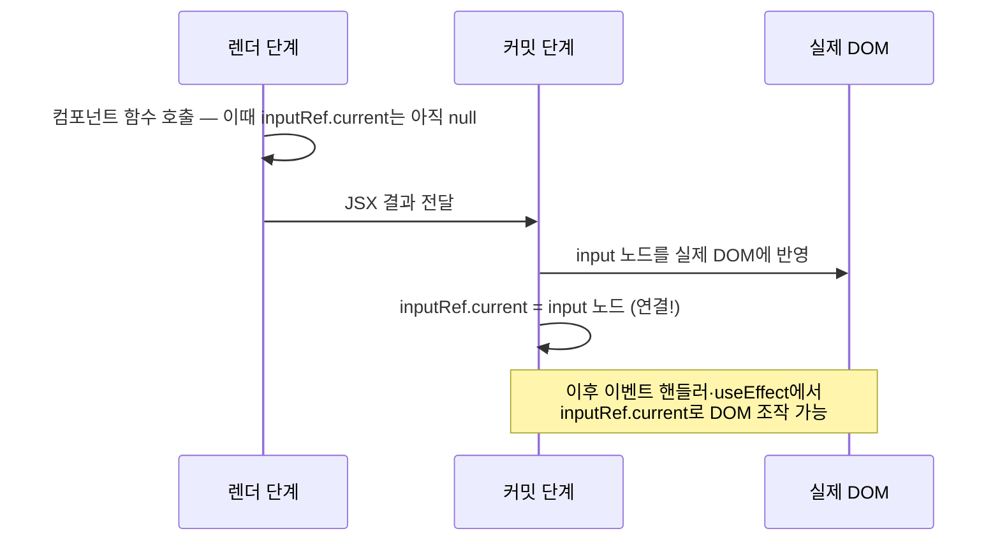
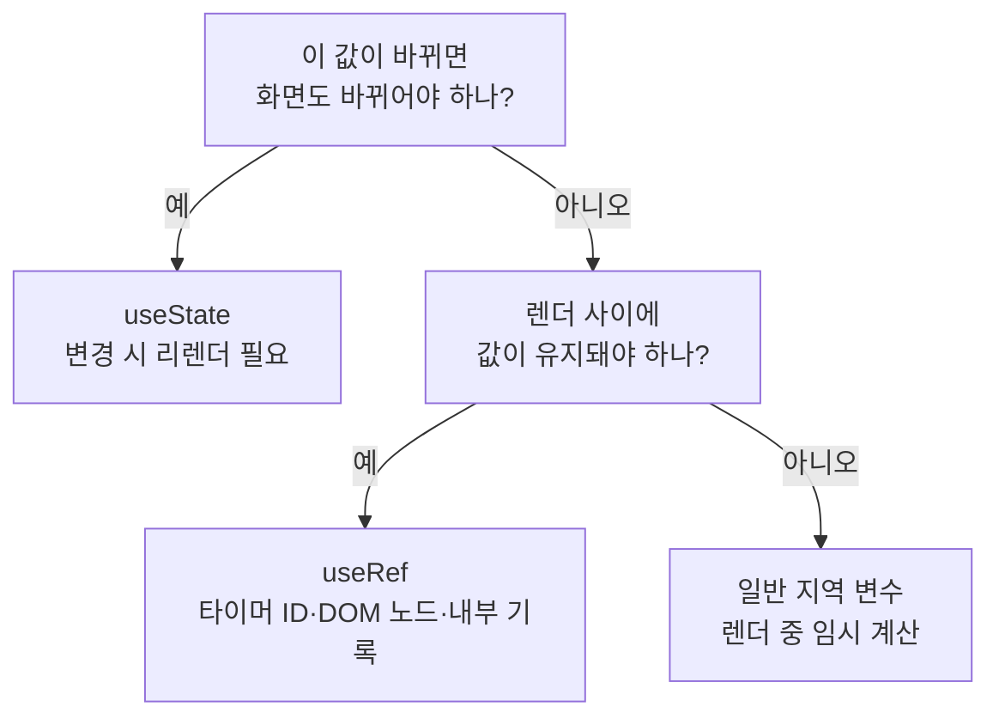

<Callout type="info">
  **이번 문서의 목표:** useRef가 만들어주는 ref 객체의 정체를 이해하고 — 리렌더 없이 값을 유지하는 저장소로, 그리고 실제 DOM 노드를 붙잡는 손잡이로 — 두 가지 용도를 상황에 맞게 골라 쓸 수 있게 된다.
</Callout>

## 왜 useRef가 필요한가

7편에서 우리는 **상태**(state, 스테이트)를 배웠습니다. `useState`로 만든 상태는 두 가지 특징이 있었죠.

1. 값이 바뀌면 **리렌더**(re-render, 다시 그리기)가 일어난다.
2. 리렌더가 일어나도 값이 **유지**된다. (일반 지역 변수는 함수가 다시 호출되면 초기화되는데, 상태는 React가 함수 밖에서 보관해 주기 때문)

그런데 개발을 하다 보면 이런 요구가 생깁니다.

- "값을 기억하고 싶긴 한데, 이 값이 바뀔 때마다 **화면을 다시 그릴 필요는 없는데**?" — 예: 타이머의 ID, 이전 렌더의 값, 클릭 횟수 같은 내부 기록용 데이터
- "React가 그려준 실제 **DOM**(Document Object Model, 문서 객체 모델) 노드를 **직접 만지고 싶은데**? — 예: 입력창에 포커스 주기, 스크롤 위치 옮기기, 동영상 재생하기

첫 번째 요구에 `useState`를 쓰면 불필요한 리렌더가 일어나 낭비이고, 심하면 무한 루프 버그가 됩니다. 두 번째 요구는 애초에 상태로는 해결이 안 됩니다 — 1편에서 봤듯 React는 "선언만 해라, DOM은 내가 만진다"는 철학인데, 포커스나 스크롤처럼 **선언만으로는 표현할 수 없는 명령형 조작**이 실제로는 가끔 필요하기 때문입니다.

이 두 요구를 모두 해결하는 훅이 **useRef**(유즈레프)입니다. ref는 reference(레퍼런스, 참조)의 준말로, "무언가를 가리키는 손잡이"라는 뜻입니다.

> **쉽게 말하면:** useState가 "바뀌면 화면도 바뀌는 전광판"이라면, useRef는 "바꿔도 화면은 조용한 개인 메모장"입니다. 그리고 그 메모장에는 실제 DOM 노드도 적어둘 수 있습니다.

## 1. useRef의 기본 형태 — ref 객체의 정체

### 시그니처와 반환값

```jsx
import { useRef } from "react";

function MyComponent() {
  const ref = useRef(초깃값);
  // ref는 { current: 초깃값 } 모양의 객체
}
```

`useRef(초깃값)`을 호출하면 React는 **`{ current: 초깃값 }` 모양의 객체 하나**를 만들어 돌려줍니다. 이 객체를 **ref 객체**라고 부릅니다. current(커런트)는 "현재 값"이라는 뜻의 프로퍼티(property, 속성) 이름입니다.

ref 객체의 성질 세 가지가 useRef의 전부라고 해도 과언이 아닙니다.

1. **`ref.current`는 자유롭게 읽고 쓸 수 있다.** `ref.current = 새값`으로 언제든 바꿀 수 있습니다. 이렇게 바꿀 수 있는 성질을 **가변**(mutable, 뮤터블)이라고 합니다. props나 state가 **불변**(immutable, 이뮤터블)으로 다뤄야 했던 것과 정반대입니다.
2. **`ref.current`를 바꿔도 리렌더가 일어나지 않는다.** React는 ref의 변경을 감시하지 않습니다. 화면에 보여줄 값이 아니라, 컴포넌트가 몰래 들고 있는 값이기 때문입니다.
3. **리렌더가 일어나도 같은 객체가 유지된다.** 컴포넌트 함수가 다시 호출되어도 `useRef`는 **처음 만들었던 그 객체를 그대로** 돌려줍니다. 초깃값은 첫 렌더에서 한 번만 쓰이고, 이후 렌더에서는 무시됩니다.

3번이 지역 변수와의 결정적 차이입니다. 컴포넌트 함수 안의 `let x = 0` 같은 지역 변수는 리렌더 때마다 함수가 새로 호출되므로 매번 0으로 초기화됩니다(렌더 = 함수 호출, 3편). ref는 React가 컴포넌트 밖의 보관소에 들고 있다가 매 렌더에 같은 것을 건네주므로 살아남습니다.

### 세 가지 저장 수단 비교

| 비교 항목 | 지역 변수 `let x` | 상태 `useState` | 참조 `useRef` |
|-----------|------------------|-----------------|---------------|
| 리렌더 후 값 유지 | 안 됨 — 매번 초기화 | 유지됨 | 유지됨 |
| 값 변경 시 리렌더 | 일어나지 않음 | 일어남 | 일어나지 않음 |
| 값 바꾸는 방법 | `x = 값` 직접 대입 | `setX(값)` 함수 호출 | `ref.current = 값` 직접 대입 |
| 화면에 보여줄 값 | 부적합 | 적합 | 부적합 |
| 대표 용도 | 렌더 중 임시 계산 | 화면을 결정하는 데이터 | 타이머 ID, DOM 노드, 내부 기록 |

<Callout type="warning">
  **자주 틀리는 점:** "ref 값을 바꿨는데 화면이 안 바뀌어요"는 버그가 아니라 **useRef의 설계 그 자체**입니다. 화면에 보여야 하는 값이면 처음부터 useState를 써야 합니다. 반대로 "이 값 때문에 리렌더가 너무 자주 일어나요"라면 그 값이 정말 화면에 필요한지 의심하고 useRef로 옮기는 것을 검토합니다.
</Callout>

## 2. 용도 ① — 리렌더 없이 값 유지하기 (mutable ref)

### 대표 사례: 타이머 ID 보관

가장 교과서적인 사례가 **타이머 ID**입니다. `setInterval`(셋인터벌, 일정 간격마다 함수를 실행하는 브라우저 기능)을 시작하면 "나중에 멈출 때 쓰라"고 숫자 ID를 돌려주는데, 이 ID는:

- 화면에 보여줄 값이 아니고 (리렌더 불필요 → state 부적합)
- 시작 버튼을 누른 렌더와 정지 버튼을 누른 렌더 **사이에서 살아남아야** 하므로 (지역 변수 부적합)

useRef의 자리입니다. 스톱워치로 직접 확인해 봅시다. 시작·정지를 눌러보고, `intervalIdRef`를 지역 변수로 바꾸면 왜 정지가 안 되는지도 상상해 보세요.

<CodePlayground
  template="react"
  activeFile="/App.js"
  showConsole
  label="스톱워치 — 화면용 값은 state, 내부 기록용 값은 ref"
  files={{
    '/App.js': `import { useState, useRef } from "react";

export default function App() {
  // 화면에 보여줄 값 → state (바뀌면 다시 그려야 하므로)
  const [seconds, setSeconds] = useState(0);

  // 화면과 무관한 내부 기록 → ref (바뀌어도 그릴 필요 없으므로)
  const intervalIdRef = useRef(null);

  function handleStart() {
    if (intervalIdRef.current !== null) return; // 중복 시작 방지
    intervalIdRef.current = setInterval(() => {
      setSeconds((prev) => prev + 1); // 함수형 업데이트 (7편)
    }, 1000);
    console.log("타이머 시작, ID:", intervalIdRef.current);
  }

  function handleStop() {
    clearInterval(intervalIdRef.current);
    intervalIdRef.current = null; // 바꿔도 리렌더 없음!
    console.log("타이머 정지");
  }

  return (
    <div>
      <h1>{seconds}초</h1>
      <button onClick={handleStart}>시작</button>
      <button onClick={handleStop}>정지</button>
    </div>
  );
}`,
  }}
/>

코드를 뜯어봅시다.

- `seconds`는 1초마다 화면 숫자가 바뀌어야 하므로 **state**입니다. `setSeconds`가 호출될 때마다 리렌더가 일어나 새 숫자가 그려집니다.
- `intervalIdRef`는 타이머의 ID라는 **내부 기록**입니다. 시작할 때 적어두고 정지할 때 꺼내 쓸 뿐, 화면에는 등장하지 않습니다. `intervalIdRef.current = null`로 바꿔도 리렌더는 일어나지 않습니다.
- 만약 ID를 지역 변수 `let intervalId`에 담았다면 — 1초마다 리렌더가 일어나 함수가 다시 호출되고, 변수는 매번 새로 만들어져 ID를 잃어버립니다. 정지 버튼이 영원히 듣지 않는 버그가 됩니다.

생활 비유로 정리하면, state는 **가게 앞 전광판**입니다. 내용을 바꾸면 지나가는 손님 모두에게 다시 보여줘야 합니다(리렌더). ref는 **계산대 밑 메모지**입니다. 아무리 고쳐 적어도 가게 밖에서는 아무 일도 안 일어나지만, 필요할 때 꺼내 보면 항상 최신 내용이 적혀 있습니다.

### 렌더 중에는 ref를 읽고 쓰지 않는다

useRef에는 중요한 사용 규칙이 하나 있습니다. **렌더 중** — 즉 컴포넌트 함수의 본문에서 JSX를 계산하는 동안 — 에는 `ref.current`를 읽거나 쓰지 않는 것이 원칙입니다.

8편에서 배운 "렌더는 순수 함수여야 한다"를 떠올려 보세요. 렌더 도중 `ref.current`를 바꾸는 것은 함수 바깥의 값을 몰래 고치는 **부수 효과**(side effect, 사이드 이펙트)이고, 렌더 도중 읽으면 같은 상태인데도 렌더마다 다른 화면이 나올 수 있어 순수성이 깨집니다. ref를 읽고 쓰는 올바른 자리는 **이벤트 핸들러 안**과 **useEffect 안**입니다 — 둘 다 렌더가 끝난 뒤에 실행되는 코드이기 때문입니다(자세한 내용은 8편·9편).

```jsx
function Bad() {
  const countRef = useRef(0);
  countRef.current = countRef.current + 1; // ❌ 렌더 중 쓰기 — 순수성 위반
  return <p>렌더 횟수 비슷한 것: {countRef.current}</p>; // ❌ 렌더 중 읽어 화면에 사용
}

function Good() {
  const countRef = useRef(0);
  function handleClick() {
    countRef.current = countRef.current + 1; // ✅ 이벤트 핸들러 안 — OK
    console.log("클릭 누적:", countRef.current);
  }
  return <button onClick={handleClick}>클릭</button>;
}
```

## 3. 용도 ② — 실제 DOM 노드 붙잡기

### ref 어트리뷰트와 연결 시점

useRef의 두 번째 용도이자 더 유명한 용도입니다. JSX 태그에 `ref` 어트리뷰트(attribute, 속성)로 ref 객체를 넘기면, React가 **커밋 단계에서 실제 DOM 노드를 `ref.current`에 넣어 줍니다.**

```jsx
const inputRef = useRef(null);
// ...
<input ref={inputRef} />
// 커밋 후: inputRef.current === 실제 <input> DOM 노드
```

흐름을 그림으로 보면 이렇습니다.



여기서 **시점**이 중요합니다. 8편에서 배웠듯 React의 화면 갱신은 렌더 단계(함수 호출로 그림 계산) → 커밋 단계(실제 DOM 반영) 순서입니다. ref와 DOM의 연결은 **커밋 단계에서** 일어나므로, **렌더 중에는 `ref.current`가 아직 `null`이거나 이전 노드**입니다. 첫 렌더의 함수 본문에서 `inputRef.current.focus()`를 부르면 "null의 focus를 읽을 수 없다"는 에러가 나는 이유가 바로 이것입니다. DOM ref를 쓰는 안전한 자리도 결국 이벤트 핸들러와 useEffect(커밋 후 실행, 9편)입니다.

### 대표 사례: 포커스, 스크롤

DOM ref가 필요한 전형적인 상황은 "선언만으로 표현할 수 없는 브라우저 명령"입니다.

- `node.focus()` — 입력창에 커서 깜빡이게 하기
- `node.scrollIntoView()` — 해당 요소가 보이도록 스크롤하기
- `node.play()` / `node.pause()` — 동영상·오디오 제어
- `node.getBoundingClientRect()` — 요소의 실제 크기·위치 측정

"포커스가 가 있는 상태"는 JSX로 선언할 방법이 없습니다(브라우저의 일시적 동작이지, 데이터로 표현되는 화면 모양이 아니므로). 이런 틈새를 ref가 메꿉니다.

<CodePlayground
  template="react"
  activeFile="/App.js"
  label="DOM ref 실습 — 버튼으로 입력창 포커스 주기"
  files={{
    '/App.js': `import { useRef } from "react";

export default function App() {
  const inputRef = useRef(null); // 처음엔 null

  function handleFocusClick() {
    // 커밋이 끝난 뒤의 이벤트 핸들러이므로 current에 DOM 노드가 들어있다
    inputRef.current.focus();
    inputRef.current.select(); // 기존 내용 전체 선택까지
  }

  return (
    <div>
      <input ref={inputRef} defaultValue="눌러서 포커스 받기" />
      <button onClick={handleFocusClick}>입력창에 포커스</button>
    </div>
  );
}`,
  }}
/>

### 비제어 폼과 useRef

6편에서 **제어 컴포넌트**(controlled component)와 **비제어 컴포넌트**(uncontrolled component)를 배웠습니다. 제어 컴포넌트는 입력값을 state로 쥐고 매 타이핑마다 리렌더하는 방식이었죠. 비제어 컴포넌트는 반대로 **값을 브라우저 DOM에 맡겨두고, 필요한 순간에만 꺼내 읽는** 방식인데 — 그 "꺼내 읽는" 도구가 바로 DOM ref입니다.

```jsx
function SignupForm() {
  const emailRef = useRef(null);

  function handleSubmit(event) {
    event.preventDefault();
    // 제출하는 순간에만 DOM에서 직접 값을 읽는다
    alert("입력된 이메일: " + emailRef.current.value);
  }

  return (
    <form onSubmit={handleSubmit}>
      <input ref={emailRef} type="email" defaultValue="" />
      <button type="submit">가입</button>
    </form>
  );
}
```

타이핑 중에는 리렌더가 한 번도 일어나지 않고, 제출 순간에 `emailRef.current.value`로 최종값만 가져옵니다. 실시간 유효성 검사가 필요 없는 단순 제출 폼이라면 이 방식이 더 가볍습니다. 어떤 폼에 어느 방식을 쓸지의 판단 기준은 6편에서 정리했으니, 여기서는 "비제어의 구현 수단이 ref"라는 연결만 기억하면 됩니다.

<Callout type="warning">
  **자주 틀리는 점:** ref로 DOM을 잡았다고 해서 `inputRef.current.value = "값"`처럼 **React가 관리하는 화면 내용을 ref로 바꾸는 것**은 금물입니다. React는 자신이 계산한 화면과 실제 DOM이 같다고 믿고 있는데, 등 뒤에서 DOM을 바꿔버리면 다음 리렌더 때 React가 그 변경을 덮어쓰거나 화면과 데이터가 어긋납니다. ref로 하는 DOM 조작은 포커스·스크롤·측정처럼 **React가 관여하지 않는 영역**에 한정하는 것이 원칙입니다.
</Callout>

## 4. state vs ref — 선택 기준 총정리

두 훅의 선택 기준을 한 장으로 정리합니다. 판단 질문은 단 하나 — **"이 값이 바뀌면 화면이 바뀌어야 하는가?"**



- 카운터의 숫자, 입력창의 실시간 값, 할 일 목록 배열 → 화면을 결정하는 값 → **state**
- 타이머 ID, 마지막 스크롤 위치 기록, DOM 노드, "이전 렌더의 값" 백업 → 화면과 무관하게 기억만 하면 되는 값 → **ref**
- JSX를 만들며 잠깐 쓰는 합계·포맷팅 결과 → 유지될 필요 없는 값 → **일반 변수**

마지막으로 한 가지 — useRef도 **훅**이므로 8편의 훅 호출 규칙을 그대로 따릅니다. 컴포넌트 함수(또는 커스텀 훅)의 **최상위**에서만 호출해야 하고, 조건문·반복문 안에서 호출하면 안 됩니다(자세한 내용은 8편).

## 핵심 정리

- `useRef(초깃값)`은 `{ current: 초깃값 }` 모양의 **ref 객체**를 돌려주며, 이 객체는 리렌더를 겪어도 같은 것이 유지된다.
- `ref.current`는 자유롭게 읽고 쓸 수 있는 **가변** 값이지만, 바꿔도 **리렌더가 일어나지 않는다** — 이것이 state와의 결정적 차이다.
- 용도 ①: 타이머 ID·내부 기록처럼 **화면과 무관하지만 렌더 사이에 살아남아야 하는 값**의 보관.
- 용도 ②: JSX 태그에 `ref` 어트리뷰트로 넘기면 **커밋 단계에서 실제 DOM 노드**가 `current`에 담기고, 포커스·스크롤 같은 명령형 조작에 쓴다. 렌더 중에는 아직 `null`일 수 있다.
- 판단 기준은 하나 — **바뀌면 화면도 바뀌어야 하는 값은 state, 기억만 하면 되는 값은 ref.**

## 마무리 복습

<Quiz
  questionNumber={1}
  question="useRef(0)이 반환하는 것의 정체로 알맞은 것은?"
  options={['숫자 0 그 자체', 'current 프로퍼티에 0이 담긴 객체', '0을 반환하는 함수', '값 0과 변경 함수가 담긴 배열']}
  correctAnswer={2}
  explanation="useRef는 항상 current 프로퍼티 하나를 가진 객체를 반환한다. 배열을 반환하는 것은 useState이며, ref의 값은 ref.current로 읽고 쓴다."
  optionExplanations={['숫자가 아니라 그 숫자를 담은 객체를 반환한다', '정답 — 형태는 항상 current 프로퍼티가 있는 객체다', '함수가 아니라 일반 객체다', '배열 구조 분해로 받는 것은 useState의 방식이다']}
/>

<Quiz
  questionNumber={2}
  question="ref.current 값을 변경했을 때 일어나는 일로 옳은 것은?"
  options={['컴포넌트가 즉시 리렌더된다', '아무 리렌더도 일어나지 않고 값만 바뀐다', '다음 이벤트가 발생할 때 리렌더가 예약된다', '에러가 발생한다 — ref는 읽기 전용이다']}
  correctAnswer={2}
  explanation="React는 ref의 변경을 감시하지 않으므로 ref.current를 바꿔도 리렌더가 일어나지 않는다. 이것이 useRef의 핵심 설계이며, 리렌더가 필요한 값은 useState를 써야 한다."
  optionExplanations={['리렌더를 일으키는 것은 setState 호출이다', '정답 — ref 변경은 React의 감시 대상이 아니다', '그런 예약 메커니즘은 없다', 'ref.current는 자유롭게 쓸 수 있는 가변 값이다']}
/>

<Quiz
  questionNumber={3}
  question="1초마다 화면의 숫자가 올라가는 스톱워치에서, 각 값의 올바른 저장 수단 조합은?"
  options={['초 숫자도 타이머 ID도 모두 useState', '초 숫자는 useState, 타이머 ID는 useRef', '초 숫자는 useRef, 타이머 ID는 useState', '초 숫자도 타이머 ID도 모두 지역 변수']}
  correctAnswer={2}
  explanation="초 숫자는 바뀔 때마다 화면이 갱신되어야 하므로 state, 타이머 ID는 화면과 무관하지만 렌더 사이에 살아남아야 하므로 ref가 맞다."
  optionExplanations={['타이머 ID를 state로 두면 불필요한 리렌더가 생긴다', '정답 — 화면용은 state, 내부 기록용은 ref라는 기준 그대로다', '반대다 — 초 숫자를 ref에 두면 화면이 갱신되지 않는다', '지역 변수는 리렌더 때마다 초기화되어 둘 다 부적합하다']}
/>

<Quiz
  questionNumber={4}
  question="JSX 태그에 ref 어트리뷰트로 넘긴 ref 객체의 current에 실제 DOM 노드가 채워지는 시점은?"
  options={['컴포넌트 함수가 호출되는 렌더 단계', 'React가 실제 DOM에 반영을 마치는 커밋 단계', 'useRef를 호출하는 즉시', '사용자가 해당 요소를 처음 클릭할 때']}
  correctAnswer={2}
  explanation="ref와 DOM의 연결은 커밋 단계에서 이루어진다. 따라서 렌더 중에는 current가 null일 수 있으며, DOM ref는 커밋 후에 실행되는 이벤트 핸들러나 useEffect에서 사용해야 안전하다."
  optionExplanations={['렌더 단계에서는 아직 실제 DOM이 만들어지지 않았다', '정답 — DOM 반영이 끝난 커밋 단계에 연결된다', 'useRef 호출 시점에는 초깃값(보통 null)만 들어있다', '클릭과 무관하게 커밋 시점에 이미 연결되어 있다']}
/>

<Quiz
  questionNumber={5}
  question="첫 렌더의 함수 본문(return 위)에서 inputRef.current.focus()를 호출하면 에러가 나는 이유는?"
  options={['focus는 useEffect 안에서만 존재하는 함수라서', '렌더 중에는 아직 DOM 연결 전이라 current가 null이기 때문', 'input 태그는 포커스를 받을 수 없는 요소라서', 'useRef는 이벤트 핸들러 안에서만 호출할 수 있어서']}
  correctAnswer={2}
  explanation="ref와 DOM의 연결은 커밋 단계에서 일어나므로, 렌더 중에는 current가 초깃값 null이다. null.focus()를 호출하니 에러가 난다. 포커스는 커밋 후인 useEffect나 이벤트 핸들러에서 줘야 한다."
  optionExplanations={['focus는 DOM 노드의 표준 메서드다', '정답 — 연결 시점이 커밋 단계이므로 렌더 중엔 null이다', 'input은 대표적으로 포커스를 받는 요소다', 'useRef 호출 자체는 컴포넌트 최상위에서 해야 하며, 이벤트 핸들러 안 호출은 오히려 규칙 위반이다']}
/>

<Quiz
  questionNumber={6}
  question="ref로 DOM을 조작할 때의 원칙으로 가장 알맞은 것은?"
  options={['React가 그리는 텍스트 내용도 ref로 자유롭게 바꾼다', '포커스·스크롤·크기 측정처럼 React가 관여하지 않는 영역에 한정한다', '모든 state를 ref로 대체해 리렌더를 없앤다', '렌더 함수 본문에서 ref.current를 수시로 갱신한다']}
  correctAnswer={2}
  explanation="React가 관리하는 화면 내용을 ref로 직접 바꾸면 React의 내부 계산과 실제 DOM이 어긋난다. ref의 DOM 조작은 포커스·스크롤·측정처럼 선언으로 표현할 수 없는 명령형 영역에만 쓴다."
  optionExplanations={['React가 관리하는 내용을 등 뒤에서 바꾸면 다음 리렌더 때 어긋나거나 덮어써진다', '정답 — 선언으로 표현 불가능한 브라우저 명령이 ref의 정당한 영역이다', '화면을 결정하는 값을 ref로 옮기면 화면이 갱신되지 않는다', '렌더 중 ref 읽기·쓰기는 순수성을 깨는 부수 효과다']}
/>

<Quiz
  questionNumber={7}
  question="다음 중 useRef가 가장 적합한 데이터는?"
  options={['화면에 표시되는 장바구니 상품 개수', '입력창에 타이핑될 때마다 실시간 검증에 쓰이는 값', 'setInterval이 돌려준 타이머 ID', '조건부 렌더링을 결정하는 로그인 여부']}
  correctAnswer={3}
  explanation="타이머 ID는 화면에 보이지 않지만 렌더 사이에 유지되어야 하는 내부 기록이므로 ref가 적합하다. 나머지 셋은 값이 바뀌면 화면이 바뀌어야 하므로 state의 영역이다."
  optionExplanations={['화면에 표시되는 값이므로 state가 맞다', '실시간 검증은 매 입력마다 리렌더가 필요한 제어 컴포넌트 패턴으로, state가 맞다', '정답 — 화면과 무관하고 렌더 사이 생존만 필요한 전형적 ref 용도다', '렌더 결과를 바꾸는 값이므로 state가 맞다']}
/>

## 참고 자료

- [React 공식 문서 - Hooks API Reference: useRef](https://legacy.reactjs.org/docs/hooks-reference.html#useref)
- [React 공식 문서 - Learn 섹션](https://react.dev/learn)
