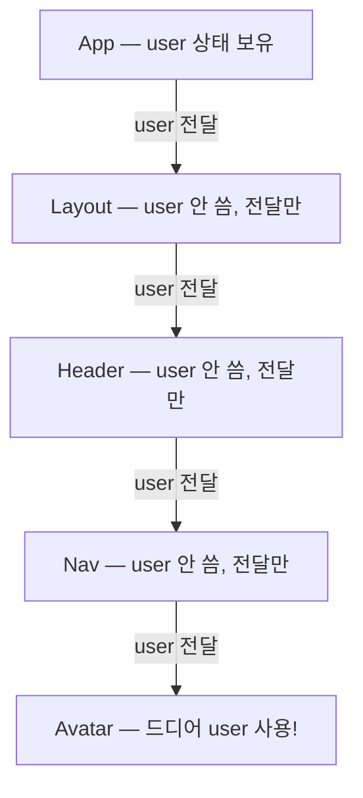

<Callout type="info">
  **이번 문서의 목표:** props 내려주기가 고통스러워지는 지점을 이해하고, Context + useContext로 멀리 있는 컴포넌트에 데이터를 직접 전달할 수 있으며, 반복되는 상태 로직을 use로 시작하는 커스텀 훅 하나로 뽑아낼 수 있게 된다.
</Callout>

## 왜 이 두 가지가 한 편에 있는가

이번 편의 두 주제 — **Context**(컨텍스트, 맥락)와 **커스텀 훅**(custom hook, 직접 만드는 훅) — 는 서로 다른 문제를 풀지만, 공통점이 하나 있습니다. 둘 다 "**컴포넌트가 커지고 많아질 때 생기는 반복과 소음을 줄이는 도구**"라는 점입니다.

- Context는 **데이터 전달의 반복**을 줄입니다. props를 여러 층 아래로 릴레이하는 수고를 없앱니다.
- 커스텀 훅은 **로직의 반복**을 줄입니다. 여러 컴포넌트에서 똑같이 쓰는 useState + useEffect 조합을 한 함수로 묶습니다.

이 과목에서는 둘 다 **입문 수준**만 다룹니다. 전역 상태 관리의 본격적인 설계는 후속 과목의 몫이고, 여기서는 "이런 도구가 왜 존재하고, 기본형이 어떻게 생겼는지"를 정확히 잡는 것이 목표입니다.

## 1. 문제 상황 — props 릴레이의 고통

### props drilling이란

5편에서 배웠듯 React의 데이터는 **부모에서 자식으로, props를 통해** 흐릅니다. 이 단방향 흐름은 데이터의 출처를 추적하기 쉽게 해주는 훌륭한 원칙이지만, 트리가 깊어지면 부작용이 생깁니다.

앱 최상단에 로그인한 사용자 정보 `user`가 있고, 트리 저 밑바닥의 아바타 컴포넌트가 그 값을 쓴다고 합시다.



`Layout`, `Header`, `Nav`는 `user`에 관심이 전혀 없습니다. 그저 아래로 **넘겨주기 위해서만** props를 받습니다. 이런 현상을 **props 드릴링**(props drilling, 프롭스 뚫고 내려가기)이라고 부릅니다. 층마다 구멍을 뚫어 파이프를 내려보내는 모습에서 온 이름입니다.

드릴링의 실질적 비용은 이렇습니다.

- 중간 컴포넌트들의 시그니처가 **자기와 무관한 props로 오염**됩니다.
- `user`의 모양이 바뀌면 **관계없는 파일 서너 개를 함께 수정**해야 합니다.
- 새 데이터를 밑바닥까지 보내려면 또 전 구간에 파이프 공사를 해야 합니다.

> **쉽게 말하면:** props 드릴링은 5층 사무실에서 1층 문서를 5층까지 보내려고, 관심도 없는 2·3·4층 직원들 손을 일일이 거치게 하는 것입니다. Context는 건물에 **방송 스피커**를 다는 일입니다 — 1층에서 방송하면, 필요한 층에서만 수신기를 켜고 듣습니다.

한두 층 내려보내는 정도는 드릴링이라 부르지도 않고, 오히려 명시적이라 좋습니다. 문제는 "안 쓰는 중간층"이 세 층, 네 층 쌓일 때입니다.

## 2. React의 답 — Context와 useContext

### 세 단계 구조: 만들기, 공급하기, 구독하기

Context는 **트리 아래 전체에 데이터를 방송하는 통로**입니다. 사용법은 항상 세 단계입니다.

<Steps>

### createContext — 통로 만들기

```jsx
import { createContext } from "react";

// 컴포넌트 밖(모듈 최상위)에서 만든다
export const UserContext = createContext(null);
```

`createContext(기본값)`은 Context 객체를 만듭니다. 인자로 준 **기본값**은 위쪽에 공급자가 하나도 없을 때만 쓰이는 비상용 값입니다. 컴포넌트 안이 아니라 **모듈 최상위에서 한 번만** 만들고, 여러 파일에서 쓰도록 `export`(내보내기) 해두는 것이 일반적입니다.

### Provider — 값 공급하기

```jsx
function App() {
  const [user, setUser] = useState({ name: "제노" });

  return (
    <UserContext.Provider value={user}>
      <Layout />
    </UserContext.Provider>
  );
}
```

`Context.Provider`(프로바이더, 공급자)로 트리를 감싸고 `value` prop에 방송할 값을 넣습니다. **Provider로 감싼 범위 안의 모든 자손**이 이 값을 받을 수 있습니다. 방송 범위가 트리 구조로 정해지는 셈입니다.

### useContext — 값 구독하기

```jsx
import { useContext } from "react";
import { UserContext } from "./UserContext";

function Avatar() {
  const user = useContext(UserContext); // 중간층 생략, 직접 수신!
  return <p>{user.name}님의 아바타</p>;
}
```

값이 필요한 컴포넌트에서 `useContext(Context객체)`를 호출하면, **트리 위쪽에서 가장 가까운 Provider의 value**를 돌려받습니다. `Layout`, `Header`, `Nav`는 이제 `user`를 몰라도 됩니다.

</Steps>

useContext도 훅이므로 8편의 규칙 그대로 — 컴포넌트(또는 커스텀 훅) 최상위에서만 호출합니다.

### Context 값이 바뀌면 어떻게 되나

중요한 동작 원리 하나: **Provider의 `value`가 바뀌면, 그 Context를 구독하는 모든 컴포넌트가 리렌더됩니다.** 위 예제에서 `setUser`로 상태를 바꾸면 → `App`이 리렌더되고 → 새 `user`가 `value`로 공급되고 → `useContext(UserContext)`를 부른 `Avatar`도 새 값으로 리렌더됩니다. 상태 변경 → 리렌더라는 7편의 메커니즘이 Context라는 통로를 타고 멀리까지 전파되는 것입니다.

이 "Context + useState 조합"이 입문 수준 전역 데이터의 표준 패턴입니다. 다크 모드 전환으로 직접 확인해 봅시다.

<CodePlayground
  template="react"
  activeFile="/App.js"
  label="Context + useState — 다크 모드 테마를 트리 전체에 방송하기"
  files={{
    '/App.js': `import { createContext, useContext, useState } from "react";

// 1단계: 통로 만들기 (컴포넌트 밖)
const ThemeContext = createContext("light");

export default function App() {
  const [theme, setTheme] = useState("light");

  // 2단계: Provider로 값 공급 — 상태와 짝지으면 "바뀌는 전역 값"이 된다
  return (
    <ThemeContext.Provider value={theme}>
      <button onClick={() => setTheme(theme === "light" ? "dark" : "light")}>
        테마 전환
      </button>
      <Page />
    </ThemeContext.Provider>
  );
}

// 중간층 — theme을 전혀 모른다 (드릴링 없음!)
function Page() {
  return (
    <div>
      <Card />
      <Card />
    </div>
  );
}

// 3단계: 필요한 곳에서 직접 구독
function Card() {
  const theme = useContext(ThemeContext);
  const styles =
    theme === "dark"
      ? { background: "#222", color: "#eee", padding: 16, margin: 8 }
      : { background: "#eee", color: "#222", padding: 16, margin: 8 };
  return <div style={styles}>지금 테마: {theme}</div>;
}`,
  }}
/>

`Page`가 `theme`이라는 단어조차 모른다는 점, 그런데도 버튼을 누르면 두 `Card`가 모두 바뀐다는 점을 확인하세요. 이것이 Context의 전부입니다.

### Context를 꺼내 쓸 때의 판단 기준

Context는 만능이 아닙니다. 공식 문서도 "일단 props부터"를 권합니다.

| 상황 | 권장 수단 |
|------|-----------|
| 한두 층 아래로 전달 | 그냥 props — 명시적이라 추적 쉬움 |
| 중간층 하나만 건너뛰면 됨 | `children` 조합 패턴 검토 (5편) |
| 트리 전반에서 쓰는 테마·로그인 사용자·언어 설정 | Context 적합 |
| 자주 바뀌는 대규모 앱 상태 전체 | Context만으로는 무리 — 후속 과목의 상태 관리 도구 영역 |

Context의 단점도 알아둡시다. 값의 출처가 코드에서 안 보이게 되므로(props처럼 명시적으로 흐르지 않으므로) **남용하면 데이터 흐름 추적이 오히려 어려워지고**, value가 바뀔 때 구독자 전원이 리렌더되므로 **너무 자주 바뀌는 값을 담으면 성능 부담**이 됩니다. "멀리, 넓게, 가끔 바뀌는 값"이 Context의 최적 영역입니다.

## 3. 커스텀 훅 — 반복되는 로직을 함수로 묶기

### 문제 상황: 컴포넌트마다 복붙되는 훅 조합

이제 두 번째 주제입니다. 9편에서 만든 "브라우저 창 너비를 추적하는" 코드를 떠올려 봅시다. 창 크기에 반응하는 컴포넌트가 셋이라면, 셋 모두에 이 덩어리가 복붙됩니다.

```jsx
const [width, setWidth] = useState(window.innerWidth);

useEffect(() => {
  function handleResize() {
    setWidth(window.innerWidth);
  }
  window.addEventListener("resize", handleResize);
  return () => window.removeEventListener("resize", handleResize); // 클린업 (9편)
}, []);
```

일반 함수의 중복이라면 함수로 뽑으면 그만입니다. 그런데 이 덩어리는 안에서 **훅을 호출**하고 있어서, 아무 함수로나 뽑을 수 없습니다 — 훅은 "React 함수" 안에서만 호출할 수 있다는 규칙(8편) 때문입니다. 그래서 React는 규칙에 맞는 탈출구를 마련해 두었습니다. 바로 커스텀 훅입니다.

### 커스텀 훅의 정의: use로 시작하는, 훅을 쓰는 함수

> **쉽게 말하면:** 커스텀 훅은 "useState·useEffect 조합 레시피"에 이름을 붙여 함수로 만든 것입니다. 특별한 등록 절차는 없고, **이름을 use로 시작하게 짓는 것**이 전부입니다.

```jsx
// use로 시작하는 이름 — 이것이 커스텀 훅의 표식
function useWindowWidth() {
  const [width, setWidth] = useState(window.innerWidth);

  useEffect(() => {
    function handleResize() {
      setWidth(window.innerWidth);
    }
    window.addEventListener("resize", handleResize);
    return () => window.removeEventListener("resize", handleResize);
  }, []);

  return width; // 컴포넌트에게 돌려줄 값
}

// 사용하는 쪽 — 한 줄이 됐다
function Header() {
  const width = useWindowWidth();
  return <h1>{width < 600 ? "모바일 메뉴" : "전체 메뉴"}</h1>;
}
```

`use` 접두사는 단순한 관례가 아니라 **약속이자 신호**입니다. 이 이름 덕분에 사람도 도구(ESLint의 훅 검사 규칙)도 "이 함수 안에서 훅이 호출되는구나, 그러니 이 함수 자체도 훅 규칙(최상위 호출, 조건문 금지)을 지켜야 하는구나"를 알 수 있습니다. use로 시작하는 함수는 컴포넌트 최상위 또는 다른 커스텀 훅 안에서만 호출해야 합니다.

### 상태는 공유되지 않는다 — 로직만 공유된다

가장 많이 오해하는 지점입니다. **커스텀 훅을 두 컴포넌트에서 쓰면, 각자 독립적인 상태를 갖습니다.**

`Header`와 `Sidebar`가 둘 다 `useWindowWidth()`를 호출하면, React는 각 컴포넌트마다 **별도의 useState 저장 칸**을 만듭니다(훅의 상태는 컴포넌트 인스턴스별로 관리된다는 8편의 원리 그대로). 공유되는 것은 "너비를 추적하는 **방법**"이지, "너비라는 **값 하나**"가 아닙니다. 값 자체를 여러 컴포넌트가 공유해야 한다면 그건 Context나 상태 끌어올리기(7편)의 일입니다.

| 구분 | 커스텀 훅 | Context |
|------|-----------|---------|
| 공유하는 것 | 로직(레시피) | 값(데이터) |
| 두 컴포넌트가 쓰면 | 각자 독립 상태 | 같은 값을 함께 구독 |
| 대표 예 | useWindowWidth, useInput | 테마, 로그인 사용자 |

### 훅 설계의 입력·출력 패턴

커스텀 훅도 함수이므로 설계의 핵심은 **무엇을 받고 무엇을 돌려줄 것인가**입니다. 자주 쓰는 패턴 세 가지를 봅시다.

1. **값 하나 반환** — `useWindowWidth()`처럼 읽기 전용 값이 하나면 그 값만 반환.
2. **배열 반환** — `useState`처럼 `[값, 조작함수]` 짝이면 배열로. 받는 쪽에서 구조 분해로 **원하는 이름을 붙일 수 있는** 장점이 있습니다.
3. **객체 반환** — 돌려줄 것이 3개 이상이면 `{ value, onChange, reset }`처럼 객체로. 이름이 고정되는 대신 순서를 외울 필요가 없습니다.

폼 입력 로직을 배열 패턴으로 묶은 `useInput`을 만들어 봅시다. 6편의 제어 컴포넌트 보일러플레이트가 어떻게 압축되는지 확인하세요.

<CodePlayground
  template="react"
  activeFile="/App.js"
  label="커스텀 훅 useInput — 제어 컴포넌트 로직 재사용 (입력·출력 패턴 연습)"
  files={{
    '/App.js': `import { useState } from "react";

// 입력: 초깃값 / 출력: [현재값, input에 그대로 펼칠 props, 리셋 함수]
function useInput(initialValue) {
  const [value, setValue] = useState(initialValue);

  function handleChange(event) {
    setValue(event.target.value);
  }

  const inputProps = { value: value, onChange: handleChange };
  const reset = () => setValue(initialValue);

  return [value, inputProps, reset];
}

export default function App() {
  // 같은 레시피, 서로 독립적인 상태 두 벌
  const [name, nameProps, resetName] = useInput("");
  const [email, emailProps, resetEmail] = useInput("");

  function handleSubmit(event) {
    event.preventDefault();
    alert("이름: " + name + " / 이메일: " + email);
    resetName();
    resetEmail();
  }

  return (
    <form onSubmit={handleSubmit}>
      <p>이름: <input {...nameProps} /></p>
      <p>이메일: <input {...emailProps} /></p>
      <button type="submit">제출</button>
    </form>
  );
}`,
  }}
/>

`useInput`을 두 번 호출해서 `name`과 `email`이라는 **독립적인 상태 두 벌**이 생겼습니다. 로직은 한 번만 작성했는데 말이죠. 이것이 커스텀 훅의 존재 이유 전부입니다 — 그리고 훗날 데이터 패칭(useFetch), 로컬 저장(useLocalStorage) 같은 실전 훅들도 전부 이 구조의 확장일 뿐입니다.

<Callout type="warning">
  **자주 틀리는 점:** JSX를 반환하면 그건 훅이 아니라 **컴포넌트**입니다. 커스텀 훅은 값·함수만 반환하고 화면은 그리지 않습니다. 또 하나 — use로 시작하지만 안에서 훅을 하나도 안 부르는 함수는 커스텀 훅이라 부르지 않는 게 관례입니다. 훅 규칙의 제약만 뒤집어쓰고 이득이 없기 때문에, 그냥 일반 함수로 두고 use 접두사를 떼는 것이 맞습니다.
</Callout>

## 핵심 정리

- 안 쓰는 중간층을 여러 개 거쳐 props를 내려보내는 **props 드릴링**이 Context가 푸는 문제다.
- Context는 **createContext로 만들고, Provider의 value로 공급하고, useContext로 구독**하는 세 단계이며, useContext는 가장 가까운 위쪽 Provider의 값을 받는다.
- Provider의 value가 바뀌면 **구독자 전원이 리렌더**된다 — Context + useState 조합이 "바뀌는 전역 값"의 입문 패턴이다.
- 커스텀 훅은 **use로 시작하는 이름의, 안에서 훅을 호출하는 함수**로, 상태 로직을 재사용하게 해준다.
- 커스텀 훅이 공유하는 것은 **로직뿐, 상태는 호출한 컴포넌트마다 독립**이다. 값 공유가 필요하면 Context·상태 끌어올리기의 일이다.

## 마무리 복습

<Quiz
  questionNumber={1}
  question="props 드릴링(props drilling)에 대한 설명으로 가장 알맞은 것은?"
  options={['자식이 부모의 상태를 직접 수정하는 패턴', '데이터를 쓰지 않는 중간 컴포넌트들이 전달만을 위해 props를 받는 현상', 'props의 이름을 층마다 바꿔 전달하는 기법', '하나의 props에 여러 값을 객체로 묶어 보내는 최적화']}
  correctAnswer={2}
  explanation="드릴링은 데이터에 관심 없는 중간층들이 오직 아래로 넘기기 위해 props를 받는 현상이다. 층이 깊어질수록 중간 컴포넌트의 시그니처가 오염되고 수정 범위가 넓어진다."
  optionExplanations={['자식은 props를 수정할 수 없으며 데이터는 단방향으로 흐른다', '정답 — 전달만 하는 중간층이 쌓이는 것이 드릴링이다', '이름 변경은 드릴링의 정의와 무관하다', '객체로 묶는 것은 드릴링과 무관한 별개 습관이다']}
/>

<Quiz
  questionNumber={2}
  question="Context 사용의 올바른 세 단계 순서는?"
  options={['useContext로 만들기 → Provider로 공급 → createContext로 구독', 'createContext로 만들기 → Provider의 value로 공급 → useContext로 구독', 'Provider로 만들기 → useContext로 공급 → value로 구독', 'createContext로 만들기 → useContext로 공급 → Provider로 구독']}
  correctAnswer={2}
  explanation="Context 객체를 createContext로 만들고, 트리를 Provider로 감싸 value를 공급하며, 필요한 컴포넌트에서 useContext로 구독한다."
  optionExplanations={['만드는 것은 createContext, 구독은 useContext다 — 역할이 뒤바뀌었다', '정답 — 만들기·공급하기·구독하기 순서 그대로다', 'Provider는 만드는 도구가 아니라 공급하는 감싸개다', '공급은 Provider, 구독은 useContext다 — 역할이 뒤바뀌었다']}
/>

<Quiz
  questionNumber={3}
  question="useContext(SomeContext)가 돌려주는 값은?"
  options={['createContext에 넘긴 기본값이 항상 반환된다', '트리 위쪽에서 가장 가까운 해당 Provider의 value', '트리 최상단 Provider의 value만 반환된다', '모든 Provider의 value를 배열로 모아 반환한다']}
  correctAnswer={2}
  explanation="useContext는 자신을 감싸는 가장 가까운 위쪽 Provider의 value를 반환한다. 기본값은 위쪽에 Provider가 하나도 없을 때만 쓰이는 비상용 값이다."
  optionExplanations={['기본값은 Provider가 전혀 없을 때만 쓰인다', '정답 — 가장 가까운 상위 Provider의 값을 받는다', '중첩된 경우 최상단이 아니라 가장 가까운 쪽이 이긴다', '배열로 모으는 동작은 존재하지 않는다']}
/>

<Quiz
  questionNumber={4}
  question="Provider의 value로 useState의 상태를 넘긴 경우, 그 상태가 setState로 바뀌면 일어나는 일은?"
  options={['아무 일도 일어나지 않는다 — Context 값은 최초 한 번만 전달된다', '해당 Context를 useContext로 구독 중인 컴포넌트들이 새 값으로 리렌더된다', '구독 여부와 관계없이 앱의 모든 컴포넌트가 무조건 리렌더된다', '에러가 발생한다 — Context에는 바뀌는 값을 넣을 수 없다']}
  correctAnswer={2}
  explanation="value가 바뀌면 그 Context의 구독자들이 새 값으로 리렌더된다. 이 성질 덕분에 Context + useState 조합이 바뀌는 전역 값의 패턴이 된다."
  optionExplanations={['value는 바뀔 때마다 새로 방송된다', '정답 — 구독자 전원이 새 값을 받아 리렌더된다', '구독하지 않는 컴포넌트까지 Context 때문에 리렌더되는 것은 아니다', '상태를 value로 넘기는 것이 오히려 표준 패턴이다']}
/>

<Quiz
  questionNumber={5}
  question="커스텀 훅의 이름을 use로 시작하게 짓는 이유로 가장 알맞은 것은?"
  options={['use가 없으면 자바스크립트 문법 에러가 나기 때문', '안에서 훅이 호출되므로 훅 규칙을 적용해야 함을 사람과 검사 도구에 알리는 약속이기 때문', 'use 접두사가 성능을 자동으로 최적화해 주기 때문', 'React가 use로 시작하는 함수만 화면에 렌더링하기 때문']}
  correctAnswer={2}
  explanation="use 접두사는 이 함수가 내부에서 훅을 호출하므로 자신도 훅 호출 규칙(최상위, 조건문 금지)을 따라야 한다는 신호다. 사람과 ESLint 검사 도구가 이 이름을 보고 규칙을 적용한다."
  optionExplanations={['문법 에러는 나지 않는다 — 관례이자 도구가 읽는 약속이다', '정답 — 훅 규칙 적용 대상임을 알리는 표식이다', '이름이 성능을 바꾸지는 않는다', '화면을 렌더링하는 것은 컴포넌트이며, 훅은 JSX를 반환하지 않는다']}
/>

<Quiz
  questionNumber={6}
  question="Header와 Sidebar 두 컴포넌트가 같은 커스텀 훅 useWindowWidth()를 각각 호출했다. 옳은 설명은?"
  options={['두 컴포넌트가 하나의 width 상태를 공유한다', '각 컴포넌트가 서로 독립적인 자기만의 상태를 갖는다', '먼저 호출한 컴포넌트만 상태를 갖는다', '에러가 발생한다 — 커스텀 훅은 앱에서 한 번만 호출할 수 있다']}
  correctAnswer={2}
  explanation="커스텀 훅이 공유하는 것은 로직뿐이다. 훅 안의 useState는 호출한 컴포넌트마다 별도의 저장 칸을 가지므로 상태는 독립이다. 값 자체를 공유하려면 Context나 상태 끌어올리기가 필요하다."
  optionExplanations={['상태 공유는 일어나지 않는다 — 공유되는 것은 레시피다', '정답 — 컴포넌트 인스턴스마다 독립 상태가 만들어진다', '호출 순서와 무관하게 각자 상태를 갖는다', '커스텀 훅은 몇 번이든 호출할 수 있다']}
/>

<Quiz
  questionNumber={7}
  question="다음 중 Context보다 커스텀 훅이 적합한 상황은?"
  options={['로그인한 사용자 정보를 트리 전체 컴포넌트가 함께 봐야 할 때', '다크 모드 설정을 멀리 있는 여러 컴포넌트에 전달할 때', '여러 컴포넌트가 각자 자기만의 입력창 상태 관리 로직을 반복 작성하고 있을 때', '부모의 상태 하나를 형제 컴포넌트 둘이 같이 써야 할 때']}
  correctAnswer={3}
  explanation="같은 로직이 반복되지만 상태는 각자 독립이어야 하는 상황이 커스텀 훅의 영역이다. 나머지는 하나의 값을 여러 컴포넌트가 공유하는 상황이므로 Context 또는 상태 끌어올리기의 영역이다."
  optionExplanations={['하나의 값을 널리 공유 — Context의 전형적 용도다', '멀리 있는 곳까지 값 공유 — Context의 전형적 용도다', '정답 — 로직 반복 제거는 커스텀 훅, 상태는 각자 독립', '형제 간 공유는 상태 끌어올리기(7편)의 영역이다']}
/>

<Quiz
  questionNumber={8}
  question="커스텀 훅에 대한 설명으로 틀린 것은?"
  options={['다른 커스텀 훅 안에서 호출할 수 있다', '값과 함수를 반환할 수 있다', 'JSX를 반환해 화면 일부를 그릴 수 있다', '내부에서 useState와 useEffect를 함께 쓸 수 있다']}
  correctAnswer={3}
  explanation="JSX를 반환하면 그것은 훅이 아니라 컴포넌트다. 커스텀 훅은 값·함수만 반환하며 화면을 직접 그리지 않는다. 훅은 컴포넌트 최상위 또는 다른 커스텀 훅 안에서 호출 가능하고, 내부에서 기본 훅들을 조합할 수 있다."
  optionExplanations={['커스텀 훅 안에서 다른 훅 호출은 허용된다', '값·조작 함수 반환이 훅의 기본 출력 패턴이다', '정답(틀린 설명) — JSX 반환은 컴포넌트의 일이다', 'useState + useEffect 조합이 커스텀 훅의 가장 흔한 내용물이다']}
/>

## 참고 자료

- [React 공식 문서 - Hooks API Reference: useContext](https://legacy.reactjs.org/docs/hooks-reference.html#usecontext)
- [React 공식 문서 - Hooks 개요](https://legacy.reactjs.org/docs/hooks-overview.html)
- [Pluralsight 블로그 - Fetching Data and Updating State with Hooks](https://www.pluralsight.com/resources/blog/guides/fetching-data-updating-state-hooks)
