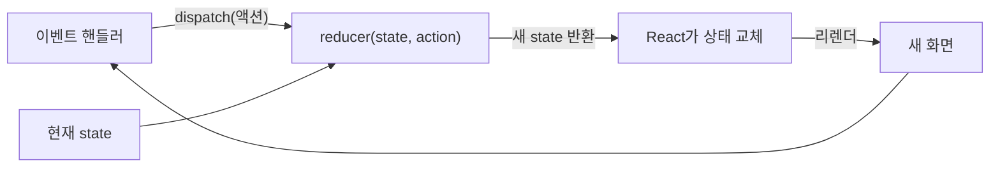

<Callout type="info">
  **이번 문서의 목표:** reducer 함수와 액션이라는 설계를 이해하고, useState로 흩어져 있던 상태 변경 로직을 useReducer 하나로 모아 폼·리스트 상태에 적용할 수 있으며, 두 훅 중 무엇을 쓸지 스스로 판단할 수 있게 된다.
</Callout>

## 왜 useState만으로는 버거워지는가

7편에서 배운 **useState**(유즈스테이트)는 상태 관리의 기본기입니다. 카운터, 입력창 하나, 켜짐·꺼짐 토글 — 이런 상태에는 useState가 정답이고, 앞으로도 그렇습니다.

그런데 상태가 **커지고**, 상태를 바꾸는 **경우의 수가 많아지면** 이야기가 달라집니다. 할 일 목록 앱을 상상해 봅시다. `todos`라는 배열 상태 하나에 대해 일어나는 변경만 해도:

- 추가하기
- 삭제하기
- 완료 체크 토글하기
- 내용 수정하기
- 완료된 항목 전부 지우기

다섯 가지입니다. useState로 만들면 이 다섯 가지 **변경 로직이 다섯 개의 이벤트 핸들러에 흩어집니다.** 컴포넌트가 커지면 핸들러들은 JSX 사이사이에 파묻히고, "todos가 대체 어떤 규칙으로 바뀌는 거야?"라는 질문에 답하려면 파일 전체를 훑어야 합니다. 게다가 흩어진 각 핸들러마다 불변 업데이트(7편)를 올바르게 반복해야 하니 실수할 자리도 다섯 배가 됩니다.

문제의 본질은 이것입니다 — **"상태를 어떻게 바꾸는가"라는 규칙이 한곳에 모여 있지 않다.**

React가 준비해 둔 답이 **useReducer**(유즈리듀서)입니다. reducer(리듀서)는 reduce(리듀스, 여러 개를 하나로 줄이다)에서 온 이름으로, 배열 메서드 `Array.reduce`가 여러 원소를 값 하나로 접듯이 "여러 사건을 하나의 다음 상태로 접는 함수"라는 뜻입니다.

> **쉽게 말하면:** useState가 각자 알아서 장부를 고치는 방식이라면, useReducer는 **경리 담당자 한 명**(reducer 함수)을 두는 방식입니다. 누구든 장부를 고치고 싶으면 "이런 일이 있었어요"라는 **전표**(액션)만 제출하고, 장부를 실제로 고치는 규칙은 경리 담당자 혼자, 한곳에서 관리합니다.

## 1. useReducer의 구조 — 세 등장인물

### 시그니처

```jsx
import { useReducer } from "react";

const [state, dispatch] = useReducer(reducer, initialState);
```

- `state` — 현재 상태. useState의 상태 변수와 같은 역할입니다.
- `dispatch`(디스패치, 발송하다) — **액션을 제출하는 함수**. useState의 setState 자리를 대신합니다.
- `reducer` — **상태 변경 규칙을 전부 담은 함수**. 내가 작성해서 넘깁니다.
- `initialState`(이니셜 스테이트) — 초기 상태.

세 등장인물의 관계를 그림으로 보면:



흐름을 말로 풀면 이렇습니다.

1. 이벤트 핸들러는 상태를 직접 바꾸지 않고, `dispatch({ type: "added", text: "장보기" })`처럼 **"무슨 일이 일어났는지"를 담은 객체를 발송**합니다.
2. React는 그 객체와 현재 상태를 들고 **내가 등록해 둔 reducer 함수를 호출**합니다.
3. reducer가 **다음 상태를 계산해 반환**하면, React가 상태를 교체하고 리렌더합니다(상태 교체 → 리렌더 메커니즘은 7편과 동일).

### 액션 — "무슨 일이 일어났는가"를 담은 객체

**액션**(action, 사건)은 dispatch로 발송하는 평범한 자바스크립트 객체입니다. 관례상 두 부분으로 구성합니다.

```js
{ type: "deleted", id: 3 }
```

- `type`(타입) — 사건의 **종류**를 나타내는 문자열. 필수 관례입니다.
- 나머지 프로퍼티 — 그 사건을 처리하는 데 필요한 **추가 정보**(어떤 항목인지, 무슨 내용인지).

액션 설계에서 중요한 감각 하나: 액션은 **"무엇을 하라"**(set 명령)가 아니라 **"무슨 일이 있었다"**(사건 보고)로 짓는 것이 좋습니다. `{ type: "set_todos", todos: [...] }`처럼 결과를 통째로 실어 보내면 변경 규칙이 다시 핸들러 쪽으로 새어 나가 useReducer를 쓰는 의미가 없어집니다. `{ type: "added", text: "장보기" }`처럼 사건만 보고하고, 그 사건으로 상태가 어떻게 변할지는 reducer가 결정하게 합니다.

### reducer — 규칙이 모이는 단 한 곳

reducer는 정해진 모양의 함수입니다.

```js
function reducer(state, action) {
  // 현재 상태와 액션을 받아 → "다음 상태"를 반환한다
}
```

두 가지 계약을 지켜야 합니다.

1. **순수 함수여야 한다.** 같은 `(state, action)`이면 항상 같은 다음 상태를 반환해야 하고, 네트워크 요청·타이머 같은 부수 효과를 일으키면 안 됩니다. React는 렌더 중에 reducer를 호출하므로, 8편의 "렌더는 순수해야 한다" 규칙이 그대로 적용됩니다.
2. **기존 state를 수정하지 말고 새 객체·배열을 반환해야 한다.** 7편의 불변 업데이트 습관이 여기서도 그대로입니다. `state.push(...)`는 금물이고, 전개 구문(spread)·`map`·`filter`로 새 것을 만들어 반환합니다.

type별 분기에는 관례적으로 `switch` 문을 씁니다. 모르는 type이 오면 조용히 넘기지 말고 에러를 던져 오타를 즉시 잡는 것이 좋은 습관입니다.

```js
function todosReducer(state, action) {
  switch (action.type) {
    case "added":
      return [...state, { id: action.id, text: action.text, done: false }];
    case "deleted":
      return state.filter((todo) => todo.id !== action.id);
    case "toggled":
      return state.map((todo) =>
        todo.id === action.id ? { ...todo, done: !todo.done } : todo
      );
    default:
      throw new Error("알 수 없는 액션: " + action.type);
  }
}
```

이 함수를 보세요 — **todos가 바뀔 수 있는 모든 경우가 한 함수 안에 나열되어 있습니다.** "이 상태는 어떤 규칙으로 변하는가?"에 대한 답이 이제 파일 전체가 아니라 이 함수 하나입니다. 이것이 useReducer가 사는 이유입니다.

또 하나의 보너스 — reducer는 React와 무관한 순수 자바스크립트 함수이므로, 컴포넌트 **밖**에(심지어 별도 파일에) 둘 수 있고, 컴포넌트 없이 단독으로 테스트할 수도 있습니다.

## 2. 실전 — 할 일 목록을 useReducer로

7편에서 useState로 만들었던 리스트 CRUD(Create·Read·Update·Delete, 생성·조회·수정·삭제)를 useReducer로 다시 구성해 봅시다. 추가·토글·삭제를 눌러보고, reducer에 "완료 전부 지우기" case를 직접 추가해 보세요.

<CodePlayground
  template="react"
  activeFile="/App.js"
  label="할 일 목록 — 변경 규칙을 reducer 한곳에 모으기"
  files={{
    '/App.js': `import { useReducer, useState } from "react";

let nextId = 3;

// 상태 변경 규칙 전부가 이 함수 하나에 모인다 (컴포넌트 밖!)
function todosReducer(state, action) {
  switch (action.type) {
    case "added":
      return [...state, { id: action.id, text: action.text, done: false }];
    case "toggled":
      return state.map((todo) =>
        todo.id === action.id ? { ...todo, done: !todo.done } : todo
      );
    case "deleted":
      return state.filter((todo) => todo.id !== action.id);
    default:
      throw new Error("알 수 없는 액션: " + action.type);
  }
}

const initialTodos = [
  { id: 1, text: "React 문서 읽기", done: true },
  { id: 2, text: "useReducer 실습", done: false },
];

export default function App() {
  const [todos, dispatch] = useReducer(todosReducer, initialTodos);
  const [text, setText] = useState(""); // 입력창 하나 → useState면 충분

  function handleAdd() {
    if (text.trim() === "") return;
    dispatch({ type: "added", id: nextId++, text: text });
    setText("");
  }

  return (
    <div>
      <input value={text} onChange={(e) => setText(e.target.value)} />
      <button onClick={handleAdd}>추가</button>
      <ul>
        {todos.map((todo) => (
          <li key={todo.id}>
            <label style={{ textDecoration: todo.done ? "line-through" : "none" }}>
              <input
                type="checkbox"
                checked={todo.done}
                onChange={() => dispatch({ type: "toggled", id: todo.id })}
              />
              {todo.text}
            </label>
            <button onClick={() => dispatch({ type: "deleted", id: todo.id })}>
              삭제
            </button>
          </li>
        ))}
      </ul>
    </div>
  );
}`,
  }}
/>

읽는 포인트 세 가지입니다.

- **이벤트 핸들러가 홀쭉해졌습니다.** 핸들러는 "무슨 일이 있었는지" 보고서(액션)만 씁니다. 불변 업데이트 코드가 핸들러에서 전부 사라져 reducer로 이사했습니다.
- **입력창 `text`는 여전히 useState입니다.** useReducer 도입이 useState 추방을 뜻하지 않습니다. 단순한 상태는 단순한 도구로 — 한 컴포넌트 안에서 둘을 섞어 쓰는 것이 자연스럽습니다.
- `key`와 리스트 렌더링은 4편, 불변 업데이트의 원리는 7편에서 다룬 그대로입니다.

### 폼 상태에 적용하면

여러 필드를 가진 폼도 useReducer의 좋은 무대입니다. 필드가 5개면 useState 5개 대신, 객체 상태 하나 + "필드가 변경됐다" 액션 하나로 정리됩니다.

```js
function formReducer(state, action) {
  switch (action.type) {
    case "field_changed":
      return { ...state, [action.field]: action.value }; // 계산된 프로퍼티명
    case "reset":
      return { name: "", email: "", password: "" };
    default:
      throw new Error("알 수 없는 액션: " + action.type);
  }
}
```

```jsx
<input
  value={state.email}
  onChange={(e) => dispatch({ type: "field_changed", field: "email", value: e.target.value })}
/>
```

"제출 시 전체 초기화" 같은 여러 필드에 걸친 변경도 `reset` 액션 하나로 표현됩니다 — 규칙은 언제나 reducer 한곳에.

## 3. useState vs useReducer — 선택 기준

둘은 우열 관계가 아니라 **역할 분담** 관계입니다. 실제로 useState는 내부적으로 useReducer와 같은 메커니즘 위에 있는, "규칙이 '주는 값으로 교체' 하나뿐인 간이 reducer"라고 볼 수 있습니다.

| 판단 질문 | 예 → useReducer | 아니오 → useState |
|-----------|-----------------|-------------------|
| 상태를 바꾸는 경우의 수가 3–4가지를 넘는가 | 규칙을 한곳에 모을 가치가 있음 | 핸들러 몇 개로 충분 |
| 다음 상태 계산이 여러 필드에 걸쳐 복잡한가 | reducer에서 일괄 계산 | 한 줄 setState로 충분 |
| 같은 변경 로직을 여러 핸들러가 공유하는가 | 액션 하나로 통일 | 공유할 것이 없음 |
| 상태 변경 로직을 단독 테스트하고 싶은가 | 순수 함수라 테스트 용이 | 필요성 낮음 |

경험적인 가이드는 이렇습니다 — **일단 useState로 시작하고**, 핸들러들이 비대해지고 불변 업데이트가 여기저기 반복되기 시작하면 그때 useReducer로 리팩터링합니다. useState → useReducer 전환은 기계적입니다(핸들러 본문을 reducer의 case로 옮기고, 그 자리를 dispatch로 바꾸면 끝).

<Callout type="warning">
  **자주 틀리는 점 모음:** ① reducer 안에서 `state.push(...)`처럼 기존 상태를 직접 수정하면 React가 변경을 감지하지 못해 화면이 갱신되지 않습니다 — 반드시 새 배열·객체를 반환하세요. ② reducer 안에서 fetch·alert 같은 부수 효과 금지 — 부수 효과는 이벤트 핸들러나 useEffect(9편)의 자리입니다. ③ dispatch 직후에 state를 읽어도 아직 이전 값입니다 — setState와 마찬가지로 **다음 렌더에서** 새 값이 됩니다(7편의 스냅샷 원리 그대로). ④ dispatch 함수 자체는 리렌더돼도 바뀌지 않는 안정적인 함수이므로 자식에게 그대로 내려줘도 됩니다.
</Callout>

마지막으로 시야 넓히기 — 이 "액션을 발송하면 reducer가 상태를 계산한다"는 설계는 React 밖에서 온 검증된 패턴(Redux 등 상태 관리 라이브러리의 핵심)입니다. useReducer로 이 사고방식을 익혀두면, 후속 과목에서 전역 상태 관리 도구를 만날 때 이미 절반은 아는 상태로 시작하게 됩니다.

## 핵심 정리

- useState는 상태 변경 로직이 **여러 핸들러에 흩어지는** 한계가 있고, useReducer는 그 규칙을 **reducer 함수 한곳에** 모은다.
- `const [state, dispatch] = useReducer(reducer, initialState)` — 핸들러는 **dispatch로 액션 발송**, reducer가 `(state, action)`을 받아 **다음 상태를 반환**한다.
- 액션은 `type` + 추가 정보를 담은 객체이며, "무엇을 하라"보다 "**무슨 일이 있었다**"로 설계한다.
- reducer는 **순수 함수**여야 하고, 기존 상태 수정 없이 **새 객체·배열을 반환**해야 한다(불변 업데이트).
- 변경 경우의 수가 많고 로직이 복잡하면 useReducer, 단순하면 useState — 한 컴포넌트에서 섞어 써도 된다.

## 마무리 복습

<Quiz
  questionNumber={1}
  question="useState 대비 useReducer가 해결하는 핵심 문제는?"
  options={['상태 변경 시 리렌더가 일어나지 않는 문제', '상태 변경 규칙이 여러 이벤트 핸들러에 흩어져 관리가 어려워지는 문제', '상태를 브라우저에 영구 저장하지 못하는 문제', '컴포넌트 간에 상태를 공유하지 못하는 문제']}
  correctAnswer={2}
  explanation="useReducer의 존재 이유는 흩어진 상태 변경 로직을 reducer 함수 한곳에 모으는 것이다. 리렌더는 두 훅 모두 일으키며, 영구 저장이나 컴포넌트 간 공유는 별개 주제다."
  optionExplanations={['useReducer도 useState처럼 상태 교체 시 리렌더를 일으킨다', '정답 — 규칙을 한곳에 모으는 것이 핵심 가치다', '영구 저장은 두 훅 모두의 역할이 아니다', '컴포넌트 간 공유는 Context나 상태 끌어올리기의 영역이다(11편·7편)']}
/>

<Quiz
  questionNumber={2}
  question="useReducer(reducer, initialState)가 반환하는 배열의 구성은?"
  options={['현재 상태와, 액션을 발송하는 dispatch 함수', '현재 상태와, 상태를 직접 교체하는 setState 함수', 'reducer 함수와 초기 상태', '이전 상태와 다음 상태']}
  correctAnswer={1}
  explanation="useReducer는 현재 상태와 dispatch 함수의 쌍을 반환한다. dispatch는 상태를 직접 바꾸는 함수가 아니라, 액션 객체를 reducer에게 전달해 다음 상태 계산을 맡기는 발송 함수다."
  optionExplanations={['정답 — 상태와 dispatch의 쌍이다', 'setState처럼 값을 직접 넣는 함수가 아니라 액션을 발송하는 dispatch다', 'reducer와 초기 상태는 반환값이 아니라 내가 넘기는 인자다', '이전·다음 상태 쌍을 주는 API가 아니다']}
/>

<Quiz
  questionNumber={3}
  question="액션 객체 설계로 가장 권장되는 것은?"
  options={['다음 상태 전체를 담아 보낸다', '사건의 종류를 나타내는 type과 처리에 필요한 최소 정보를 담는다', '변경을 수행할 함수를 담아 보낸다', 'DOM 노드를 담아 보낸다']}
  correctAnswer={2}
  explanation="액션은 type으로 사건의 종류를, 나머지 프로퍼티로 필요한 최소 정보를 담는 것이 관례다. 다음 상태를 통째로 실어 보내면 변경 규칙이 핸들러로 새어 나가 useReducer의 의미가 없어진다."
  optionExplanations={['결과를 통째로 보내면 규칙이 reducer 밖으로 흩어진다', '정답 — 사건 보고만 하고 계산은 reducer에 맡긴다', '함수 전달은 관례가 아니며 로직이 다시 흩어진다', 'DOM은 상태 변경 규칙과 무관하다']}
/>

<Quiz
  questionNumber={4}
  question="reducer 함수가 지켜야 할 계약으로 옳은 것을 모두 고른 조합은? ㄱ. 순수 함수여야 한다 ㄴ. 기존 state를 수정하지 않고 새 값을 반환한다 ㄷ. 내부에서 네트워크 요청을 수행해도 된다 ㄹ. 같은 입력이면 같은 출력을 낸다"
  options={['ㄱ, ㄴ', 'ㄱ, ㄴ, ㄹ', 'ㄴ, ㄷ', 'ㄱ, ㄷ, ㄹ']}
  correctAnswer={2}
  explanation="reducer는 순수 함수여야 하므로 같은 입력에 같은 출력을 내야 하고(ㄱ, ㄹ은 같은 말), 불변 업데이트로 새 값을 반환해야 한다(ㄴ). 네트워크 요청 같은 부수 효과(ㄷ)는 금지이며 이벤트 핸들러나 useEffect의 자리다."
  optionExplanations={['ㄹ도 순수 함수의 정의에 포함되는 옳은 항목이다', '정답 — ㄷ만 계약 위반이다', 'ㄷ은 부수 효과라서 금지다', 'ㄷ이 포함되어 틀렸다']}
/>

<Quiz
  questionNumber={5}
  question="reducer 안에서 state.push(newItem); return state; 라고 작성했다. 예상되는 문제는?"
  options={['문법 에러로 빌드가 실패한다', '기존 배열을 직접 수정했으므로 React가 변경을 감지하지 못해 화면이 갱신되지 않을 수 있다', '항목이 두 번 추가된다', '아무 문제 없다 — push도 정상 동작한다']}
  correctAnswer={2}
  explanation="같은 배열 객체를 반환하면 React는 상태가 그대로라고 판단할 수 있어 리렌더가 생략된다. 반드시 전개 구문 등으로 새 배열을 만들어 반환해야 한다(불변 업데이트, 7편)."
  optionExplanations={['문법상으로는 유효해서 빌드는 통과한다 — 그래서 더 위험하다', '정답 — 참조가 같으면 변경으로 인정되지 않는다', '두 번 추가가 아니라 화면 미갱신이 전형적 증상이다', '동작이 보장되지 않으며 원칙 위반이다']}
/>

<Quiz
  questionNumber={6}
  question="useState와 useReducer의 선택 기준으로 가장 알맞은 것은?"
  options={['useReducer가 항상 우월하므로 모든 상태에 쓴다', '변경 경우의 수가 많고 로직이 복잡하면 useReducer, 단순하면 useState를 쓰며 섞어 써도 된다', 'useState는 문자열 전용, useReducer는 객체 전용이다', '한 컴포넌트에는 둘 중 하나만 쓸 수 있다']}
  correctAnswer={2}
  explanation="둘은 역할 분담 관계다. 단순한 상태는 useState, 변경 규칙이 많고 복잡한 상태는 useReducer가 맞으며, 본문 예제처럼 한 컴포넌트에서 함께 쓰는 것이 자연스럽다."
  optionExplanations={['입력창 하나에 reducer를 두는 것은 과잉 설계다', '정답 — 복잡도에 따라 고르고 혼용 가능하다', '두 훅 모두 모든 타입의 상태를 다룰 수 있다', '혼용에 아무 제약이 없다 — 본문 예제가 그 예다']}
/>

<Quiz
  questionNumber={7}
  question="이벤트 핸들러에서 dispatch({ type: 'toggled', id: 3 })을 호출한 직후, 바로 다음 줄에서 state를 읽으면?"
  options={['이미 토글이 반영된 새 상태가 읽힌다', '아직 이전 상태가 읽히며, 새 상태는 다음 렌더에서 받는다', 'undefined가 읽힌다', '에러가 발생한다']}
  correctAnswer={2}
  explanation="setState와 마찬가지로 dispatch도 다음 렌더를 예약할 뿐, 현재 실행 중인 코드의 state 변수를 바꾸지 않는다. 상태는 렌더 시점의 스냅샷이다(7편)."
  optionExplanations={['즉시 반영되지 않는다 — 다음 렌더의 일이다', '정답 — 스냅샷 원리가 useReducer에도 동일하게 적용된다', 'undefined가 되는 것이 아니라 이전 값 그대로다', '읽는 것 자체는 에러가 아니다']}
/>

<Quiz
  questionNumber={8}
  question="reducer 함수를 컴포넌트 바깥(또는 별도 파일)에 둘 수 있는 이유는?"
  options={['React가 바깥에 있는 함수만 reducer로 인정하기 때문', 'props와 state에 의존하지 않는, 인자만으로 동작하는 순수 자바스크립트 함수이기 때문', '컴포넌트 안에 두면 빌드 에러가 나기 때문', '바깥에 두면 자동으로 전역 상태가 되기 때문']}
  correctAnswer={2}
  explanation="reducer는 현재 상태와 액션을 인자로 받아 다음 상태를 반환할 뿐, 특정 컴포넌트의 내부 값에 의존하지 않는 순수 함수다. 그래서 밖에 둘 수 있고 단독 테스트도 가능하다."
  optionExplanations={['위치 제약은 없다 — 안에 둬도 동작은 한다', '정답 — 인자만으로 완결되는 순수 함수라서 가능하다', '빌드 에러는 나지 않는다', '전역 상태가 되는 마법은 없다 — 상태는 여전히 훅을 호출한 컴포넌트의 것이다']}
/>

## 참고 자료

- [React 공식 문서 - Hooks API Reference: useReducer](https://legacy.reactjs.org/docs/hooks-reference.html#usereducer)
- [React 공식 문서 - useState 레퍼런스](https://react.dev/reference/react/useState)
- [React 공식 문서 - Learn 섹션](https://react.dev/learn)
