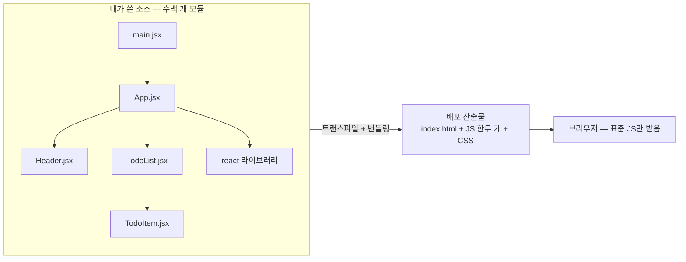
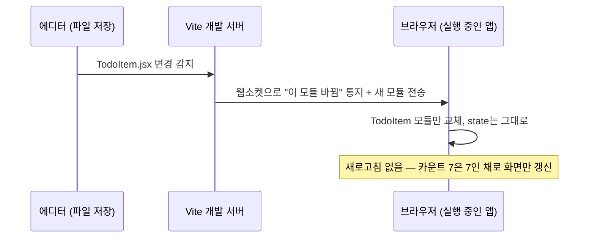

<Callout type="info">
  **이번 문서의 목표:** Vite로 React 프로젝트를 직접 만들어 구조를 이해하고, 번들링과 HMR이 무엇인지 원리 수준에서 설명할 수 있으며, React DevTools로 컴포넌트 트리·props·state와 리렌더를 눈으로 확인할 수 있게 된다.
</Callout>

## 왜 이제야 개발 환경을 배우는가

이 과목은 일부러 개발 환경을 마지막 본론으로 미뤘습니다. 도구부터 배우면 "명령어는 따라 쳤는데 안에서 무슨 일이 벌어지는지 모르는" 상태가 되기 쉽기 때문입니다. 지금 우리는 JSX가 무엇으로 변환되는지(2편), 렌더가 함수 호출이라는 것(3편), 상태가 리렌더를 일으키는 원리(7편)를 이미 압니다. 이제 도구를 열어도 도구가 개념을 가리지 않습니다.

이번 편에서 답할 질문은 세 가지입니다.

1. 왜 브라우저에 파일만 던져서는 안 되고 **개발 서버·빌드 도구**가 필요한가?
2. **Vite**(비트)는 무엇을 해주는가 — 번들링과 HMR의 원리?
3. 지금까지 머리로 이해한 렌더·상태를 **DevTools로 눈으로** 어떻게 확인하는가?

## 1. 왜 빌드 도구가 필요한가

### 브라우저가 못 읽는 것들

우리가 지금까지 쓴 코드를 브라우저 입장에서 보면 문제가 두 가지 있습니다.

첫째, **JSX는 자바스크립트 표준 문법이 아닙니다.** 2편에서 배웠듯 `<h1>안녕</h1>` 같은 JSX는 브라우저가 직접 실행할 수 없고, 트랜스파일(transpile, 같은 수준의 다른 코드로 변환)을 거쳐 `React.createElement(...)` 혹은 그에 준하는 함수 호출로 바뀌어야 합니다(자세한 원리는 2편). 누군가는 이 변환을 **매번, 자동으로** 해줘야 합니다.

둘째, **모듈이 많아지면 로딩이 문제가 됩니다.** 현대 자바스크립트는 `import`/`export`로 파일을 잘게 쪼개 작성합니다. 컴포넌트 파일 수십 개에 라이브러리까지 합치면 모듈이 수백~수천 개가 되는데, 이걸 브라우저가 하나하나 네트워크로 요청하면 초기 로딩이 느려집니다.

이 두 문제를 해결하는 도구 묶음이 **빌드 도구**(build tool)이고, 그 대표적 해법이 **번들링**입니다.

### 번들링이란

**번들링**(bundling, 묶기)은 흩어진 모듈 파일들을 **의존 관계를 따라가며 소수의 파일로 합치는** 작업입니다. bundle은 "꾸러미"라는 뜻입니다. 번들링을 하는 프로그램을 **번들러**(bundler)라고 부르며, Webpack(웹팩)이 오랫동안 대표였고 Vite는 배포용 빌드에 Rollup(롤업)이라는 번들러를 씁니다.



> **쉽게 말하면:** 번들러는 이삿짐센터입니다. 방마다 흩어진 짐(모듈)을 목록(의존 관계)대로 추적해서, 트럭 몇 대(번들 파일)에 착착 실어 보냅니다. 받는 쪽(브라우저)은 트럭 몇 대만 맞이하면 됩니다.

정리하면 빌드 도구의 일은 크게 둘입니다 — **변환**(JSX·최신 문법 → 브라우저가 아는 표준 JS)과 **묶기**(수많은 모듈 → 소수의 파일). 여기에 개발 중 편의 기능(개발 서버, 즉시 반영)이 얹어집니다.

## 2. Vite — 빠른 개발 서버 + 번들러

### Vite가 특별한 이유: 개발과 배포를 다르게 처리한다

**Vite**는 프랑스어로 "빠르다"라는 뜻의 빌드 도구로, 현재 React 공식 문서와 커뮤니티가 새 프로젝트에 가장 널리 권하는 선택지입니다. Vite의 핵심 아이디어는 **개발할 때와 배포할 때 전략을 다르게 가져가는 것**입니다.

| 구분 | 개발 서버(dev) | 배포 빌드(build) |
|------|----------------|------------------|
| 명령 | `npm run dev` | `npm run build` |
| 전략 | 번들링 없이, 브라우저의 네이티브 ESM으로 **요청받은 모듈만 즉시 변환해 전달** | Rollup으로 전체를 **번들링·압축·최적화** |
| 목표 | 시작·반영 속도 | 사용자 로딩 성능 |
| 산출물 | 없음 — 메모리에서 즉석 처리 | `dist` 폴더의 정적 파일들 |

과거의 번들러 기반 개발 서버는 시작할 때 **앱 전체를 먼저 번들링**해야 해서, 프로젝트가 크면 서버 켜는 데만 수십 초가 걸렸습니다. Vite는 발상을 뒤집었습니다 — 요즘 브라우저는 `import` 문(ESM, ECMAScript Modules, 표준 모듈 시스템)을 스스로 처리할 수 있으니, 개발 중에는 번들링을 아예 생략하고 **브라우저가 요청하는 모듈만 그때그때 트랜스파일해서** 던져줍니다. 앱이 아무리 커도 "지금 열린 화면에 필요한 모듈"만 처리하면 되니 서버가 즉시 뜹니다.

### HMR — 저장하면 상태를 유지한 채 바뀐다

Vite 개발 서버의 두 번째 무기가 **HMR**(Hot Module Replacement, 핫 모듈 교체)입니다. hot은 "전원이 켜진 채로"라는 뜻입니다 — 서버를 껐다 켜지 않고, 실행 중인 앱에서 **바뀐 모듈만 뜨거운 채로 갈아 끼운다**는 의미입니다.

HMR이 없다면: 코드 저장 → 브라우저 전체 새로고침 → **앱의 모든 상태가 초기화** → 확인하려던 화면까지 다시 클릭해서 이동. 폼에 10칸을 채우고 버그를 고치는 중이라면 저장할 때마다 10칸을 다시 채워야 합니다.

HMR이 있다면: 코드 저장 → 개발 서버가 변경 감지 → **바뀐 모듈만 브라우저로 전송해 교체** → React 컴포넌트라면 **state를 유지한 채** 새 코드로 다시 렌더. 카운터가 7인 상태에서 버튼 색을 바꾸면, 카운터는 7인 채로 색만 바뀝니다.



이것이 7편에서 배운 "상태는 React가 컴포넌트 밖에서 보관한다"는 사실의 실용적 보상이기도 합니다 — 컴포넌트 함수 코드를 갈아 끼워도 보관소의 상태는 살아 있으니, 새 함수로 다시 렌더만 하면 되는 것입니다.

### 프로젝트 만들어 보기

터미널(terminal, 명령어 입력 창)에서 다음을 실행합니다. Node.js(노드, 브라우저 밖 자바스크립트 실행 환경)가 설치되어 있어야 하며, npm(Node Package Manager, 노드 패키지 관리자)은 Node.js와 함께 설치됩니다.

```bash
npm create vite@latest my-react-app -- --template react
cd my-react-app
npm install   # package.json에 적힌 의존성(react 등) 내려받기
npm run dev   # 개발 서버 시작 → http://localhost:5173
```

생성된 구조에서 알아야 할 파일만 짚습니다.

| 파일·폴더 | 역할 |
|-----------|------|
| `index.html` | 진입점. `div id="root"` 하나와 `main.jsx`를 불러오는 script 태그가 있음 |
| `src/main.jsx` | 자바스크립트 진입점. `createRoot(...).render(App)`으로 React를 root에 연결 |
| `src/App.jsx` | 최상위 컴포넌트 — 우리가 주로 고치는 곳 |
| `package.json` | 프로젝트 정보·의존성·명령어(`dev`, `build`) 목록 |
| `vite.config.js` | Vite 설정 — React 플러그인(JSX 변환 담당)이 등록되어 있음 |
| `node_modules` | 내려받은 라이브러리 창고 — 직접 수정하지 않음 |

`src/main.jsx`의 핵심 두 줄은 지금까지 배운 개념 그대로입니다.

```jsx
import { createRoot } from "react-dom/client";
import App from "./App.jsx";

createRoot(document.getElementById("root")).render(<App />);
```

"HTML의 root라는 빈 div를 React에게 넘기고, 그 안을 App 컴포넌트 트리로 채워라" — 1편의 명령형 세계와 React 세계가 만나는 접점이 바로 이 한 줄입니다.

`npm run dev`를 켠 채 `App.jsx`의 문구를 고쳐 저장해 보세요. 새로고침 없이 화면이 바뀌는 것, 카운터 예제라면 숫자가 유지되는 것 — 그게 HMR입니다.

## 3. DevTools로 렌더를 눈으로 확인하기

### 브라우저 DevTools — 실제 DOM 관찰

브라우저에 내장된 **개발자 도구**(DevTools, 데브툴즈)는 F12 키(또는 마우스 오른쪽 클릭 → 검사)로 엽니다. React 학습에서 유용한 탭 두 개만 짚습니다.

- **Elements 탭**(엘리먼츠) — 현재 실제 DOM 트리를 보여줍니다. React 컴포넌트를 클릭했을 때 **실제 DOM이 어느 부분만 바뀌는지** 관찰할 수 있습니다. 값이 바뀐 노드가 잠깐 반짝이는데, 상태를 바꿔보면 1편에서 말한 "달라진 부분만 실제 DOM에 반영"이 눈에 보입니다. 단, 여기 보이는 것은 컴포넌트가 아니라 **변환이 끝난 결과물인 HTML 태그들**입니다.
- **Console 탭**(콘솔) — `console.log` 출력이 보이는 곳입니다. 컴포넌트 함수 첫 줄에 `console.log("App 렌더!")`를 넣어두면 **리렌더가 언제, 몇 번 일어나는지** 확인할 수 있습니다. 8편에서 본 것처럼 개발 모드의 StrictMode(스트릭트 모드)에서는 순수성 검사를 위해 렌더가 두 번씩 찍힐 수 있다는 점만 기억하세요.

### React DevTools — 컴포넌트의 세계 관찰

Elements 탭에는 컴포넌트·props·state가 보이지 않습니다. 그건 React 내부의 세계이기 때문입니다. 그래서 React 팀이 만든 브라우저 확장 프로그램이 **React DevTools**(리액트 데브툴즈)입니다. 크롬·엣지·파이어폭스의 확장 스토어에서 "React Developer Tools"를 설치하면 개발자 도구에 탭이 두 개 추가됩니다.

**Components 탭**(컴포넌츠) — 이 과목 내내 그림으로만 그려온 **컴포넌트 트리를 실물로** 보여줍니다.

- 트리에서 컴포넌트를 클릭하면 오른쪽에 그 컴포넌트의 **props**와 **hooks**(State·Reducer·Ref·Context 등 훅별 현재 값)가 표시됩니다.
- state 값을 패널에서 **직접 수정**할 수도 있습니다 — 값을 바꾸는 순간 리렌더가 일어나 화면이 바뀌는 것을 보면, "상태 교체 → 리렌더"(7편)가 손끝에서 확인됩니다.
- 설정에서 "Highlight updates when components render"(렌더 시 컴포넌트 강조)를 켜면, **리렌더되는 컴포넌트가 화면에서 테두리로 반짝입니다.** 부모의 상태를 바꿨을 때 자식들까지 함께 반짝이는 것을 보면, "부모가 리렌더되면 자식도 다시 호출된다"(7편·8편)가 시각적으로 이해됩니다.

**Profiler 탭**(프로파일러) — 녹화 버튼을 누르고 앱을 조작하면, 그동안 **어떤 컴포넌트가 몇 번, 왜, 얼마나 오래 렌더됐는지**를 기록해 보여줍니다. 지금 단계에서는 "리렌더 횟수를 세는 카메라가 있다" 정도로만 알아두면 됩니다. 이 도구는 후속 과목의 성능 최적화에서 주인공이 됩니다.

### 관찰 실습 — 상태·리렌더·DOM을 한 번에

아래 앱을 Vite 프로젝트의 `App.jsx`에 붙여 넣고(또는 여기서 바로 실행하고), 관찰 순서를 따라가 보세요.

<CodePlayground
  template="react"
  activeFile="/App.js"
  showConsole
  label="DevTools 관찰용 앱 — 콘솔에서 렌더 로그를 먼저 확인해 보자"
  files={{
    '/App.js': `import { useState } from "react";

function Child({ label }) {
  console.log("  Child 렌더:", label);
  return <p>자식 컴포넌트: {label}</p>;
}

export default function App() {
  const [count, setCount] = useState(0);
  console.log("App 렌더! count =", count);

  return (
    <div>
      <h1>카운트: {count}</h1>
      <button onClick={() => setCount(count + 1)}>+1</button>
      <Child label="A" />
      <Child label="B" />
    </div>
  );
}`,
  }}
/>

Vite 프로젝트 + 브라우저에서의 관찰 체크리스트입니다.

<Steps>

### 콘솔로 리렌더 세기

Console 탭을 열고 +1 버튼을 누릅니다. `App 렌더!`와 함께 두 `Child 렌더` 로그가 매번 찍히는 것을 확인하세요 — 부모의 상태 변경이 자식 함수 호출까지 이어집니다.

### Elements로 DOM 변경 범위 보기

Elements 탭에서 h1 노드를 펼쳐두고 +1을 누릅니다. 숫자 텍스트 부분만 반짝이고 나머지 트리는 그대로인 것 — 이것이 재조정의 결과입니다(4편).

### Components로 state 직접 조작하기

React DevTools의 Components 탭에서 App을 클릭 → hooks의 State 값을 99로 고쳐봅니다. 화면의 카운트가 즉시 99가 되면, setState 없이도 "상태 교체가 곧 리렌더"임을 확인한 것입니다.

### 렌더 하이라이트 켜기

Components 탭 설정에서 렌더 강조를 켜고 +1을 누릅니다. App과 두 Child가 함께 테두리로 반짝이는 것을 확인합니다.

</Steps>

<Callout type="warning">
  **자주 틀리는 점:** ① React DevTools의 두 탭은 **개발 빌드에서만 정보가 온전히** 보입니다. `npm run build`로 만든 배포 빌드는 컴포넌트 이름이 뭉개져 있을 수 있습니다. ② "리렌더가 많다 = 느리다"로 바로 등치하지 마세요. 리렌더는 함수 호출일 뿐이고 실제 DOM 반영은 달라진 부분만 일어나므로, 대부분의 앱에서 문제가 되지 않습니다. 최적화는 측정으로 문제가 확인된 뒤의 일이며 후속 과목에서 다룹니다. ③ Elements 탭에서 컴포넌트를 찾으려 하지 마세요 — 컴포넌트는 React 세계의 존재라 Components 탭에만 보입니다.
</Callout>

## 핵심 정리

- 브라우저는 JSX를 못 읽고 수백 개 모듈 로딩은 느리므로, **변환 + 번들링**을 해주는 빌드 도구가 필요하다.
- **Vite**는 개발 중에는 번들링 없이 네이티브 ESM으로 요청받은 모듈만 즉시 변환해 서버가 빠르고, 배포 시에는 Rollup으로 번들링·최적화한다.
- **HMR**은 새로고침 없이 바뀐 모듈만 갈아 끼우는 기능으로, React 컴포넌트의 **state를 유지한 채** 코드 변경이 반영된다.
- 브라우저 DevTools의 Elements·Console로 **실제 DOM 변경 범위와 렌더 횟수**를, React DevTools의 Components 탭으로 **컴포넌트 트리·props·훅 상태**를 관찰할 수 있다.
- 리렌더 횟수는 관찰 대상이지 그 자체로 죄가 아니다 — 최적화는 측정 이후의 일이다.

## 마무리 복습

<Quiz
  questionNumber={1}
  question="React 개발에 빌드 도구가 필요한 근본 이유 두 가지의 올바른 조합은?"
  options={['JSX가 표준 문법이 아니라 변환이 필요하고, 수많은 모듈을 효율적으로 전달해야 하므로', 'React가 유료 라이브러리라 인증이 필요하고, HTML을 압축해야 하므로', '브라우저가 자바스크립트를 실행하지 못하고, CSS를 읽지 못하므로', '컴포넌트는 서버에서만 실행 가능하고, 상태는 데이터베이스에 저장되므로']}
  correctAnswer={1}
  explanation="JSX는 브라우저가 직접 실행할 수 없어 트랜스파일이 필요하고, import로 쪼개진 수많은 모듈을 그대로 로딩하면 느리므로 번들링이 필요하다. 이 변환과 묶기가 빌드 도구의 두 가지 핵심 역할이다."
  optionExplanations={['정답 — 변환과 번들링이 빌드 도구의 존재 이유다', 'React는 무료 오픈소스이며 HTML 압축은 부차적 기능이다', '브라우저는 표준 자바스크립트와 CSS를 잘 실행하고 읽는다', 'React 컴포넌트는 브라우저에서 실행되며 상태는 메모리에 있다']}
/>

<Quiz
  questionNumber={2}
  question="번들링(bundling)의 정의로 가장 알맞은 것은?"
  options={['코드의 오타를 자동으로 고치는 작업', '흩어진 모듈들을 의존 관계를 따라 소수의 파일로 합치는 작업', '자바스크립트를 기계어로 컴파일하는 작업', '이미지를 자동으로 리사이즈하는 작업']}
  correctAnswer={2}
  explanation="번들링은 import/export로 연결된 수많은 모듈을 의존 관계 그래프를 따라가며 소수의 파일 꾸러미로 묶는 작업이다. 브라우저의 요청 횟수를 줄여 로딩 성능을 높인다."
  optionExplanations={['오타 수정은 린터·에디터의 영역이다', '정답 — 모듈을 꾸러미로 묶는 것이 번들링이다', '기계어 컴파일이 아니라 JS 파일을 합치고 변환하는 수준이다', '이미지 처리는 번들러의 부가 기능일 수는 있으나 정의가 아니다']}
/>

<Quiz
  questionNumber={3}
  question="Vite 개발 서버(npm run dev)가 대형 프로젝트에서도 즉시 시작되는 이유는?"
  options={['앱 전체를 미리 번들링해 캐시에 저장해 두기 때문', '개발 중에는 번들링을 생략하고, 브라우저가 네이티브 ESM으로 요청하는 모듈만 그때그때 변환해 주기 때문', '자바스크립트 대신 더 빠른 언어로 코드를 재작성하기 때문', '모듈을 전부 하나의 HTML 파일 안에 인라인으로 넣기 때문']}
  correctAnswer={2}
  explanation="Vite는 개발 중 번들링을 생략하는 것이 핵심이다. 브라우저의 표준 모듈 시스템(ESM)에 로딩을 맡기고, 요청된 모듈만 즉석에서 트랜스파일해 전달하므로 앱 크기와 무관하게 서버가 바로 뜬다."
  optionExplanations={['미리 전체 번들링하는 것은 과거 방식의 특징이다', '정답 — 요청 기반 즉석 변환이 Vite 개발 서버의 발상이다', '내 코드를 다른 언어로 재작성하지 않는다', '인라인 HTML 방식이 아니라 모듈 단위 전달이다']}
/>

<Quiz
  questionNumber={4}
  question="HMR(Hot Module Replacement)의 효과로 옳은 것은?"
  options={['저장할 때마다 브라우저 전체가 새로고침된다', '바뀐 모듈만 교체되어, React 컴포넌트의 state가 유지된 채 변경이 반영된다', '코드를 저장하지 않아도 에디터의 내용이 실시간 반영된다', '배포된 서비스의 코드를 사용자 몰래 교체한다']}
  correctAnswer={2}
  explanation="HMR은 실행 중인 앱에서 변경된 모듈만 갈아 끼우는 개발 서버 기능이다. 전체 새로고침이 없으므로 앱의 상태가 초기화되지 않고, 카운터가 7이면 7인 채로 새 코드가 반영된다."
  optionExplanations={['전체 새로고침을 없애는 것이 HMR의 목적이다', '정답 — 모듈 단위 교체 + state 유지가 핵심이다', '파일 저장이 변경 감지의 계기다', 'HMR은 개발 서버의 기능이지 배포 환경 기능이 아니다']}
/>

<Quiz
  questionNumber={5}
  question="Vite React 프로젝트에서 createRoot(document.getElementById('root')).render(...) 코드가 위치하는 파일과 그 역할은?"
  options={['index.html — 화면의 뼈대를 정의한다', 'src/main.jsx — HTML의 빈 root 요소를 React에 넘기고 컴포넌트 트리로 채우게 하는 진입점이다', 'vite.config.js — 빌드 설정을 담당한다', 'package.json — 의존성 목록을 관리한다']}
  correctAnswer={2}
  explanation="src/main.jsx가 자바스크립트 진입점으로, HTML의 root div를 React에 연결하고 App 컴포넌트 렌더를 시작시킨다. 명령형 DOM 세계와 React 세계가 만나는 접점이다."
  optionExplanations={['index.html에는 빈 div와 script 태그만 있다', '정답 — main.jsx가 React를 시동 거는 진입점이다', 'vite.config.js는 플러그인·빌드 설정 파일이다', 'package.json은 프로젝트 메타 정보와 의존성 목록이다']}
/>

<Quiz
  questionNumber={6}
  question="브라우저 기본 DevTools의 Elements 탭에서 볼 수 있는 것은?"
  options={['컴포넌트 트리와 각 컴포넌트의 props', '변환이 끝나 실제 DOM에 반영된 HTML 태그들', '각 훅의 현재 state 값', '컴포넌트별 렌더 횟수 기록']}
  correctAnswer={2}
  explanation="Elements 탭은 실제 DOM 트리를 보여준다. 컴포넌트·props·훅 상태는 React 내부 세계의 정보라 React DevTools의 Components 탭에서만 볼 수 있고, 렌더 기록은 Profiler 탭의 영역이다."
  optionExplanations={['컴포넌트 트리는 React DevTools Components 탭의 영역이다', '정답 — Elements에는 최종 결과물인 DOM만 보인다', '훅 상태 역시 Components 탭에서 확인한다', '렌더 기록은 Profiler 탭이 담당한다']}
/>

<Quiz
  questionNumber={7}
  question="React DevTools의 Components 탭에서 App의 State 값을 0에서 99로 직접 고치자 화면 숫자도 99로 바뀌었다. 이 관찰이 확인해 주는 원리는?"
  options={['DOM을 직접 수정하면 상태도 바뀐다는 것', '상태가 교체되면 리렌더가 일어나 새 상태로 화면이 다시 그려진다는 것', 'DevTools가 HTML을 직접 편집한다는 것', '상태는 브라우저 저장소에 보관된다는 것']}
  correctAnswer={2}
  explanation="DevTools는 React의 상태 저장소 값을 교체했고, 그 교체가 리렌더를 일으켜 새 값으로 화면이 그려졌다. setState를 눌러 확인하던 상태 교체 → 리렌더 메커니즘(7편)을 도구로 재현한 것이다."
  optionExplanations={['DOM이 아니라 React의 상태 값을 고친 것이다', '정답 — 상태 교체가 곧 리렌더의 방아쇠임을 보여준다', 'HTML 편집이 아니라 React 내부 상태 조작이다', '상태는 브라우저 저장소가 아닌 React의 메모리에 있다']}
/>

<Quiz
  questionNumber={8}
  question="렌더 하이라이트를 켜고 부모의 버튼을 누르자 자식 컴포넌트들까지 함께 반짝였다. 이에 대한 올바른 해석은?"
  options={['버그다 — 자식은 리렌더되면 안 된다', '부모가 리렌더되면 자식 함수도 다시 호출되는 정상 동작이며, 실제 DOM은 달라진 부분만 갱신되므로 대개 문제없다', '자식의 state가 초기화되었다는 뜻이다', '즉시 최적화 도구를 도입해야 한다는 신호다']}
  correctAnswer={2}
  explanation="부모 리렌더 시 자식 함수가 다시 호출되는 것은 React의 기본 동작이다. 리렌더는 함수 호출일 뿐이고 실제 DOM 반영은 재조정으로 최소화되므로, 측정으로 성능 문제가 확인되기 전까지는 최적화 대상이 아니다."
  optionExplanations={['기본 동작이지 버그가 아니다', '정답 — 리렌더와 실제 DOM 갱신을 구분해서 해석해야 한다', '리렌더돼도 state는 React가 보관하므로 유지된다', '최적화는 측정으로 문제가 확인된 뒤의 일이다(후속 과목)']}
/>

## 참고 자료

- [Vite 공식 문서 - 시작하기](https://vitejs.dev/guide/)
- [React 공식 문서 - Learn 섹션](https://react.dev/learn)
- [React 공식 문서 - React Developer Tools](https://react.dev/learn/react-developer-tools)
