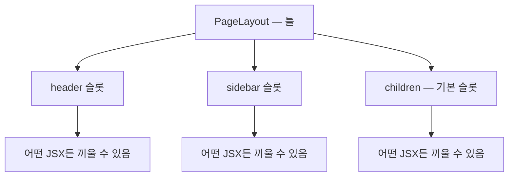

<Callout type="info">
  **이번 문서의 목표:** 이 과목 전체를 지탱할 설계 관점 — "컴포넌트는 상속하지 않고 합성한다"를 이해하고, children과 슬롯(slot)으로 컴포넌트를 조립하는 판단 기준을 세운다. 이 관점은 뒤의 커스텀 훅·Context·패턴 편에서 계속 재사용된다.
</Callout>

## 왜 중급의 첫 편이 "합성"인가

react_1에서 우리는 컴포넌트를 만들고 props로 데이터를 내려보내는 법을 배웠습니다. 그런데 실무 코드를 보면 이상한 갈림길이 나타납니다 — 버튼이 조금 다른 모양으로 필요할 때, 여러분은 무엇을 하나요?

- 길 A: `Button`에 props를 하나 더 추가한다 (`variant`, `size`, `iconPosition`, `isLoading`…)
- 길 B: `IconButton`, `LoadingButton`처럼 파생 컴포넌트를 계속 만든다
- 길 C: **조각을 조립할 수 있게 설계를 바꾼다**

길 A를 반복하면 props가 15개인 괴물 컴포넌트가 되고, 길 B를 반복하면 거의 같은 코드가 수십 개 파일에 흩어집니다. React가 권하는 답은 길 C — **합성**(composition, 컴포지션)이고, 이 편은 그 사고방식을 세우는 시간입니다. 커스텀 훅 설계(05편), Context 쪼개기(06편), compound·headless 패턴(11~12편)은 전부 이 관점의 응용입니다.

## 1. 상속 vs 합성 — 두 가지 재사용 전략

### 용어부터

- **상속**(inheritance, 인헤리턴스): "B는 A의 일종이다"라며 A의 기능을 물려받아 B를 만드는 방식. 객체지향(OOP, Object-Oriented Programming) 언어의 대표 재사용 수단입니다.
- **합성**(composition, 컴포지션): 작은 부품들을 **끼워 맞춰서** 더 큰 것을 만드는 방식. "B는 A를 **포함한다**"에 가깝습니다.

> **쉽게 말하면:** 상속은 족보를 만드는 것이고, 합성은 레고를 조립하는 것입니다. React는 족보 대신 레고를 택했습니다.

### 상속으로 UI를 만들면 생기는 일

상속 관점으로 대화 상자(dialog)를 만든다고 해봅시다.

```
Dialog (기본 대화 상자)
└─ WarningDialog (경고용 — 노란 테두리)
   └─ WarningDialogWithButton (경고 + 확인 버튼)
      └─ WarningDialogWithTwoButtons (경고 + 버튼 2개)
```

요구사항이 늘어날 때마다 족보가 한 층씩 깊어집니다. 그러다 "버튼 2개인데 파란 테두리"가 필요해지는 순간 — 족보의 어느 가지에도 끼울 수 없어 전체 구조를 갈아엎게 됩니다. 이런 현상을 흔히 **클래스 폭발**(class explosion)이라고 부릅니다.

React 팀은 공식 문서에서 명확히 밝혔습니다: 수천 개의 컴포넌트를 운영하면서 **상속 계층으로 만들 것을 권한 사례가 없다** — props와 합성만으로 충분하다고요. 그래서 React에는 컴포넌트 상속 문법 자체가 사실상 쓰이지 않습니다.

### 합성으로 같은 문제를 풀면

합성 관점에서는 대화 상자를 "테두리·배경을 담당하는 **틀**"과 "그 안에 들어가는 **내용물**"로 분리합니다. 내용물은 그때그때 끼워 넣는 거죠. 틀은 하나면 되고, 경고든 확인이든 버튼 2개든 **조합**으로 표현됩니다.

이 "끼워 넣기"를 문법으로 가능하게 해주는 것이 바로 `children`입니다.

## 2. children — 합성의 문법적 심장

### children의 정체

JSX에서 컴포넌트 태그를 여는 태그와 닫는 태그 사이에 넣은 내용은, 그 컴포넌트의 **`children`이라는 이름의 prop**으로 전달됩니다. 특별한 마법이 아니라 그냥 props의 한 종류입니다.

```jsx
<Card>
  <h2>제목</h2>       {/* ← 이 두 줄이 통째로 */}
  <p>본문 내용</p>     {/*    Card의 props.children이 된다 */}
</Card>
```

받는 쪽은 그 값을 원하는 위치에 놓기만 하면 됩니다. 아래 실습기에서 Card 안의 내용물을 바꿔보세요 — 틀은 그대로인데 내용만 갈아 끼워지는 감각이 합성의 핵심입니다.

<CodePlayground
  template="react"
  activeFile="/App.js"
  label="children으로 틀과 내용물 분리하기 — 내용물을 자유롭게 바꿔보세요"
  files={{
    '/App.js': `// [틀] 테두리와 여백만 책임진다. 안에 뭐가 들어올지는 모른다(알 필요도 없다).
function Card({ children }) {
  return (
    <div style={{ border: "2px solid #7c6df2", borderRadius: 8, padding: 16, marginBottom: 12 }}>
      {children}
    </div>
  );
}

export default function App() {
  return (
    <div>
      {/* 같은 Card 틀에 완전히 다른 내용물을 끼운다 */}
      <Card>
        <h3>공지사항</h3>
        <p>오늘 저녁 서버 점검이 있습니다.</p>
      </Card>

      <Card>
        <button>확인</button>
        <button>취소</button>
      </Card>
    </div>
  );
}`,
  }}
/>

### 왜 이게 강력한가 — 결합도 이야기

`Card`는 내용물이 뭔지 **전혀 모릅니다**. 제목인지, 버튼인지, 다른 Card인지 신경 쓰지 않죠. 이렇게 서로를 모르는 정도를 소프트웨어 설계에서는 **결합도가 낮다**(loosely coupled, 루즐리 커플드)고 표현합니다. 결합도가 낮으면:

- Card를 고쳐도 내용물 코드는 안 깨진다
- 내용물을 새로 만들어도 Card는 그대로 재사용된다
- 조합의 수는 곱셈으로 늘어난다 — 틀 3종 × 내용물 10종 = 30가지 화면, 파일은 13개

상속(족보)이었다면 30가지 화면에 30개의 클래스가 필요했을 일입니다.

<Callout type="warning">
  **자주 틀리는 점:** children을 "텍스트 넣는 구멍" 정도로만 쓰는 경우가 많습니다. children에는 **어떤 JSX든** — 컴포넌트, 배열, 심지어 함수까지 — 들어갈 수 있습니다. children을 적극적으로 설계에 쓰기 시작하는 순간이 초급과 중급의 갈림길입니다.
</Callout>

## 3. 슬롯 — 구멍이 여러 개 필요할 때

children은 구멍이 **하나**입니다. 그런데 페이지 레이아웃처럼 "왼쪽엔 사이드바, 위엔 헤더, 가운데엔 본문"으로 **여러 구멍**이 필요하면 어떻게 할까요?

답은 허무할 만큼 단순합니다 — **JSX를 일반 props로 넘기면 됩니다.** 이렇게 이름 붙은 구멍을 관례적으로 **슬롯**(slot, 끼움 자리)이라고 부릅니다.

<CodePlayground
  template="react"
  activeFile="/App.js"
  label="슬롯 패턴 — 이름 붙은 구멍 여러 개로 레이아웃 조립하기"
  files={{
    '/App.js': `// [틀] header/sidebar 슬롯 + 기본 구멍 children
function PageLayout({ header, sidebar, children }) {
  return (
    <div style={{ border: "1px solid #ccc" }}>
      <div style={{ background: "#efeaff", padding: 8 }}>{header}</div>
      <div style={{ display: "flex" }}>
        <div style={{ width: 110, background: "#f5f5f5", padding: 8 }}>{sidebar}</div>
        <div style={{ flex: 1, padding: 8 }}>{children}</div>
      </div>
    </div>
  );
}

export default function App() {
  return (
    <PageLayout
      header={<b>우리 서비스</b>}
      sidebar={
        <ul>
          <li>홈</li>
          <li>설정</li>
        </ul>
      }
    >
      <h3>본문 영역</h3>
      <p>children은 이름 없는 기본 슬롯인 셈입니다.</p>
    </PageLayout>
  );
}`,
  }}
/>

구조를 그림으로 보면:



> **쉽게 말하면:** children은 이름 없는 슬롯 1개, 슬롯 패턴은 이름 붙은 슬롯 여러 개입니다. 본질은 둘 다 "JSX를 값처럼 props로 전달한다"로 같습니다.

이게 가능한 이유는 react_1의 4편에서 배운 사실 때문입니다 — **JSX는 결국 자바스크립트 값**(객체)이라서, 숫자나 문자열처럼 변수에 담고 props로 넘길 수 있습니다.

## 4. 역할 분리의 원형 — 로직 담당과 표시 담당

합성 사고방식이 자리 잡으면 자연스럽게 다음 질문이 나옵니다: "데이터를 불러오고 가공하는 코드와, 화면을 예쁘게 그리는 코드를 **한 컴포넌트에** 두는 게 맞나?"

전통적으로 이 분리를 **컨테이너 컴포넌트**(container, 로직 담당)와 **프레젠테이션 컴포넌트**(presentational, 표시 담당)라고 불렀습니다.

| 구분 | 컨테이너 — 로직 담당 | 프레젠테이션 — 표시 담당 |
|------|--------------------|------------------------|
| 하는 일 | 데이터 불러오기, 상태 관리, 이벤트 로직 | props를 받아 화면만 그림 |
| 상태(state) | 가진다 | 거의 안 가진다 |
| 재사용성 | 낮음 — 특정 데이터에 묶임 | 높음 — 어떤 데이터든 props로 받으면 그림 |
| 테스트 | 로직 위주 | "이 props면 이 화면" 확인 위주 |

예를 들어 사용자 목록 화면이라면:

```jsx
// [표시 담당] 어디서 온 데이터든 상관없이 그리기만 한다 → 재사용·테스트 쉬움
function UserList({ users }) {
  return (
    <ul>
      {users.map((user) => <li key={user.id}>{user.name}</li>)}
    </ul>
  );
}

// [로직 담당] 데이터를 구해서 표시 담당에게 넘긴다
function UserListContainer() {
  const users = useUsers(); // 데이터 로직 (커스텀 훅 — 03편에서 다룬다)
  return <UserList users={users} />;
}
```

<Callout type="info">
  **미리 보는 지도:** 훅이 등장한 현대 React에서는 "로직 담당"의 역할이 컨테이너 컴포넌트에서 **커스텀 훅**으로 많이 옮겨갔고, 이 흐름의 끝이 12편에서 배울 headless 패턴입니다. 즉 이 과목의 흐름은 — 합성(1편) → 로직을 훅으로 추출(3·5편) → 로직·표시 완전 분리(12편) — 하나의 이야기입니다.
</Callout>

## 5. 판단 기준 정리 — 언제 무엇을 쓰나

이 편의 내용을 실무 판단 기준으로 압축하면:

1. **파생 컴포넌트를 만들고 싶어지면** → 멈추고, 틀+내용물로 쪼갤 수 있는지 먼저 본다 (상속 금지, 합성 우선)
2. **"이 안에 뭐가 들어올지 틀이 알 필요 없다"** → children
3. **구멍이 여러 개 필요하다** → 이름 붙은 슬롯 props
4. **불리언 props가 늘어난다** (`showIcon`, `hasFooter`, `isCompact`…) → 슬롯·children으로 바꿀 수 있는 신호일 때가 많다
5. **로직과 표시가 한 파일에 엉킨다** → 표시 담당을 분리해 props만 받게 한다

이 기준들은 앞으로 매 편에서 다시 등장합니다. 특히 4번은 11편의 compound 패턴에서 본격적으로 해부합니다.

## 핵심 정리

- React의 재사용 전략은 **상속이 아니라 합성** — 족보가 아니라 레고다. 상속 계층은 요구사항 변화에 부서지지만, 합성은 조합의 곱셈으로 대응한다.
- `children`은 여는 태그와 닫는 태그 사이의 JSX가 담기는 **평범한 prop**이며, 합성의 기본 구멍이다.
- 구멍이 여러 개 필요하면 **JSX를 이름 붙은 props로 전달**한다 — 슬롯 패턴. JSX가 자바스크립트 값이기에 가능하다.
- 틀은 내용물을 모른다 = **낮은 결합도** — 서로 몰라야 재사용과 수정이 자유롭다.
- 로직 담당과 표시 담당을 분리하는 컨테이너/프레젠테이션 구분은 훅 시대에 "로직은 훅으로"라는 형태로 진화했다 (3·5·12편으로 이어짐).

## 마무리 복습

<Quiz
  questionNumber={1}
  question="React 공식 문서가 컴포넌트 재사용 수단으로 상속 대신 권장하는 것은?"
  options={['고차 클래스 상속 계층', 'props와 합성', '전역 변수 공유', '컴포넌트 복사·붙여넣기']}
  correctAnswer={2}
  explanation="React 팀은 수천 개 컴포넌트를 운영하며 상속 계층이 필요했던 사례가 없었다고 밝히며, props와 합성만으로 충분하다고 권장한다."
  optionExplanations={['상속 계층은 클래스 폭발 문제를 일으키는 방식이다', '정답 — children·슬롯 등 합성 도구가 React의 공식 답이다', '전역 변수 공유는 재사용 전략이 아니라 결합도를 높이는 안티패턴이다', '복사·붙여넣기는 수정 시 모든 사본을 고쳐야 하는 최악의 재사용이다']}
/>

<Quiz
  questionNumber={2}
  question="children prop에 대한 설명으로 옳은 것은?"
  options={['문자열만 넣을 수 있다', '여는 태그와 닫는 태그 사이의 JSX가 전달되는 일반적인 prop이다', 'React가 내부적으로만 쓰는 예약 prop이라 직접 렌더링할 수 없다', '컴포넌트당 최대 3개까지 지정할 수 있다']}
  correctAnswer={2}
  explanation="children은 태그 사이의 내용이 담기는 평범한 prop이며, 받는 컴포넌트가 원하는 위치에 자유롭게 렌더링할 수 있다. 어떤 JSX든 담을 수 있다."
  optionExplanations={['텍스트뿐 아니라 컴포넌트·배열 등 어떤 JSX든 가능하다', '정답 — 특별한 마법이 아니라 props의 한 종류다', '받는 쪽에서 자유롭게 배치해 렌더링하는 것이 핵심 용도다', 'children은 하나의 prop이며 개수 제한 개념이 없다']}
/>

<Quiz
  questionNumber={3}
  question="레이아웃에 header·sidebar·본문처럼 끼움 자리가 여러 개 필요할 때 React다운 해법은?"
  options={['전역 상태에 각 영역의 JSX를 저장한다', 'JSX를 이름 붙은 props로 전달하는 슬롯 패턴을 쓴다', '레이아웃 컴포넌트를 상속받아 영역별 하위 클래스를 만든다', 'DOM API로 각 영역에 직접 삽입한다']}
  correctAnswer={2}
  explanation="JSX는 자바스크립트 값이므로 header={&lt;b&gt;...&lt;/b&gt;} 처럼 일반 props로 전달할 수 있다. 이름 붙은 구멍을 여러 개 만드는 이 방식이 슬롯 패턴이다."
  optionExplanations={['화면 조각을 전역 상태에 두면 결합도가 치솟는 안티패턴이 된다', '정답 — children은 기본 슬롯, 나머지는 이름 붙은 슬롯으로', '상속 계층은 React가 권장하지 않는 방식이다', '명령형 DOM 조작으로 돌아가는 것으로, 선언적 UI 모델을 깨뜨린다']}
/>

<Quiz
  questionNumber={4}
  question="틀 컴포넌트가 내용물이 무엇인지 모르는 설계가 좋은 이유로 가장 알맞은 것은?"
  options={['렌더링 속도가 항상 2배 빨라진다', '결합도가 낮아져 서로 독립적으로 수정·재사용할 수 있다', '코드 줄 수가 반드시 줄어든다', 'props 검증을 생략할 수 있다']}
  correctAnswer={2}
  explanation="서로를 모르는 낮은 결합도 덕분에 틀과 내용물을 각각 고치고 재사용할 수 있으며, 조합의 수가 곱셈으로 늘어난다. 속도나 줄 수가 보장되는 것은 아니다."
  optionExplanations={['성능은 결합도와 별개의 문제다', '정답 — 낮은 결합도가 합성의 실질적 이득이다', '오히려 파일 수는 늘 수도 있다 — 이득은 유지보수성과 조합성이다', '결합도와 props 검증은 무관하다']}
/>

<Quiz
  questionNumber={5}
  question="컨테이너/프레젠테이션 구분에서 프레젠테이션 컴포넌트의 특징은?"
  options={['데이터를 직접 불러오고 상태를 많이 가진다', 'props를 받아 화면을 그리는 데 집중하며 재사용성이 높다', '반드시 클래스 컴포넌트로 작성한다', '이벤트를 절대 다룰 수 없다']}
  correctAnswer={2}
  explanation="프레젠테이션 컴포넌트는 어디서 온 데이터든 props로 받아 그리기만 하므로 재사용과 테스트가 쉽다. 데이터 로직은 컨테이너 또는 커스텀 훅이 맡는다."
  optionExplanations={['그것은 컨테이너 쪽의 특징이다', '정답 — 표시에만 집중하는 것이 프레젠테이션 컴포넌트다', '함수 컴포넌트로 작성하는 것이 현대 표준이다', '이벤트 핸들러를 props로 받아 연결하는 것은 흔한 일이다']}
/>

<Quiz
  questionNumber={6}
  question="다음 중 합성 관점에서 설계를 다시 점검해야 한다는 신호에 가장 가까운 것은?"
  options={['컴포넌트가 children을 받고 있다', 'showHeader, hasIcon, isCompact 같은 불리언 props가 계속 늘어난다', '표시 담당 컴포넌트가 상태를 갖지 않는다', '레이아웃이 슬롯 props를 3개 받는다']}
  correctAnswer={2}
  explanation="불리언 props가 계속 늘어나는 것은 틀 하나가 너무 많은 변형을 스스로 책임지고 있다는 신호로, children·슬롯 합성으로 변형을 밖으로 빼는 것을 검토해야 한다."
  optionExplanations={['children 사용은 합성의 정상적인 모습이다', '정답 — props 폭발은 합성으로 풀 수 있는 대표 신호다', '표시 담당이 상태가 없는 것은 바람직한 분리다', '이름 붙은 슬롯 여러 개는 슬롯 패턴의 정상적인 사용이다']}
/>

## 참고 자료

- [React 공식 문서 - Composition vs Inheritance](https://legacy.reactjs.org/docs/composition-vs-inheritance.html)
- [React 공식 문서 - Passing Props to a Component](https://react.dev/learn/passing-props-to-a-component)
