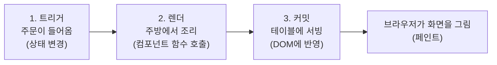
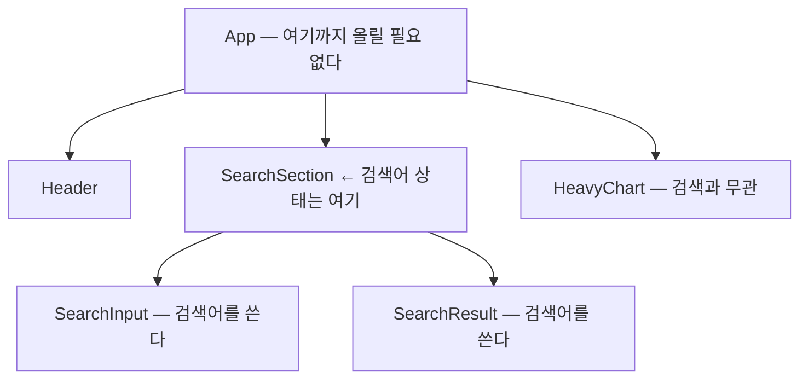
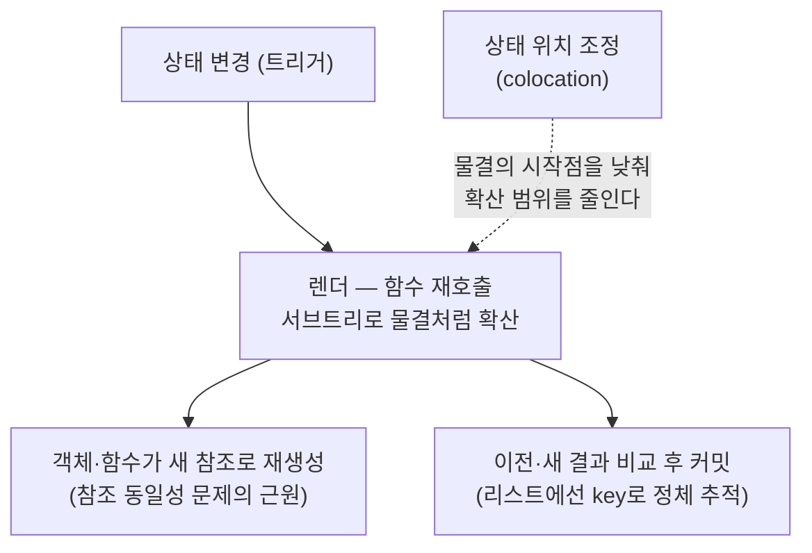

<Callout type="info">
  **이번 문서의 목표:** "내 컴포넌트는 왜, 언제 다시 렌더링되는가"를 React의 렌더-커밋 모델로 정확히 설명할 수 있고, 상태를 트리의 어느 위치에 둘지 판단하는 기준과 리스트 키·참조 동일성의 원리를 갖춘다. 이 지식은 성능 편(10편)과 Context 심화(06편)의 전제가 된다.
</Callout>

## 왜 이 복습이 중급의 관문인가

react_1에서 `useState`로 상태를 만들고 값이 바뀌면 화면이 갱신된다는 것은 배웠습니다. 그런데 중급 주제들은 전부 다음 질문에서 시작합니다.

- Context 값이 바뀌면 **어디까지** 다시 렌더링되는가? (06편)
- `React.memo`는 **무엇을 기준으로** 렌더를 건너뛰는가? (10편)
- 상태를 부모로 올리면 **왜** 갑자기 앱이 느려지는가?

이 질문들에 답하려면 "화면이 갱신된다"는 뭉뚱그린 이해를 버리고, React가 실제로 밟는 단계 — **렌더**(render)와 **커밋**(commit) — 를 분리해서 봐야 합니다. 이 편은 그 해부도입니다. 여기서 세운 모델은 뒤의 모든 편에서 "렌더가 퍼진다", "참조가 바뀐다" 같은 표현으로 계속 재사용됩니다.

## 1. 렌더-커밋 모델 — 화면 갱신의 3단계

### 용어부터

- **렌더링**(rendering): React가 컴포넌트 **함수를 호출해서** "화면이 어떻게 생겨야 하는지"를 계산하는 일. 이 시점엔 아직 화면에 아무 일도 일어나지 않습니다.
- **커밋**(commit): 렌더링으로 계산한 결과를 실제 **DOM**(Document Object Model, 브라우저가 HTML을 객체 트리로 표현한 것)에 반영하는 일. 이때 비로소 화면이 바뀝니다.
- **트리거**(trigger): 렌더링을 시작하게 만드는 방아쇠. 최초 마운트, 그리고 상태 변경입니다.

> **쉽게 말하면:** 렌더링은 주방에서 요리를 만드는 것이고, 커밋은 완성된 접시를 손님 테이블에 내가는 것입니다. 주방에서 아무리 요리해도(렌더) 서빙(커밋) 전에는 손님이 아무것도 못 봅니다.

React 공식 문서는 이 과정을 식당에 비유해 3단계로 설명합니다.



### 1단계 — 트리거: 렌더링은 딱 두 가지 이유로 시작된다

1. **최초 렌더링**: 앱이 처음 화면에 붙을 때 (`createRoot`로 마운트).
2. **상태 변경**: 컴포넌트(또는 그 조상)의 상태가 `set` 함수로 갱신될 때.

여기서 중급자가 반드시 새겨야 할 사실이 하나 있습니다. **"props가 바뀌어서 렌더링된다"는 말은 엄밀히는 틀렸습니다.** props는 스스로 바뀌지 않습니다 — props가 바뀌었다는 건 **부모가 다시 렌더링되면서 새 props를 계산해 내려보냈다**는 뜻입니다. 즉 모든 리렌더의 뿌리를 따라가면 결국 어딘가의 **상태 변경**이 있습니다. 이 관점이 10편에서 렌더 원인을 추적할 때의 출발점입니다.

### 2단계 — 렌더: 함수를 호출하고, 자식으로 재귀한다

렌더 단계에서 React는 트리거된 컴포넌트의 **함수를 호출**합니다. 함수가 반환한 JSX 안에 자식 컴포넌트가 있으면 그 자식의 함수도 호출하고, 또 그 자식도… 이렇게 트리를 따라 **재귀적으로**(recursively, 자기 자신을 반복 적용하며) 내려갑니다.

여기서 두 번째 핵심 사실이 나옵니다.

<Callout type="warning">
  **자주 틀리는 점:** "부모가 리렌더되어도 자식은 props가 안 바뀌면 렌더링 안 되겠지"라고 생각하기 쉽지만, **기본 동작은 정반대**입니다. 부모가 렌더링되면 자식은 **props가 바뀌었든 아니든 함께 렌더링됩니다.** props 비교로 렌더를 건너뛰는 것은 `React.memo`를 명시적으로 적용했을 때만 일어나는 예외 동작입니다 (자세한 내용은 10편).
</Callout>

즉 렌더는 상태가 바뀐 컴포넌트에서 시작해 **그 아래 서브트리 전체로 퍼지는 물결**입니다. 이 "물결의 범위"를 줄이는 것이 상태 위치 조정(이 편의 3장)과 메모이제이션(10편)의 공통 목표입니다.

### 3단계 — 커밋: 달라진 부분만 DOM에 반영한다

렌더가 끝나면 React는 이전 렌더 결과와 새 렌더 결과를 **비교**(diffing, 디핑)해서, **실제로 달라진 최소한의 부분만** DOM에 반영합니다. 컴포넌트 함수가 100번 호출됐어도 결과물이 같으면 DOM은 건드리지 않습니다.

여기서 세 번째 핵심 사실 — **"렌더링됨"과 "DOM이 바뀜"은 다른 사건**입니다. 렌더는 자주 일어나도 커밋할 변경이 없으면 화면 깜빡임도, 입력창 포커스가 날아가는 일도 없습니다. 그래서 "리렌더 = 무조건 나쁨"이 아닙니다. 문제는 **렌더 계산 자체가 비쌀 때**(무거운 계산, 거대한 리스트)만 생깁니다. 이 구분이 10편에서 "메모이제이션을 쓰지 말아야 할 때"를 판단하는 근거가 됩니다.

### 눈으로 확인하기 — 렌더의 물결

아래 실습기에서 버튼을 눌러 부모의 상태를 바꿔보세요. 콘솔을 보면 **props를 하나도 안 받는 자식까지** 함께 렌더링되는 것을 확인할 수 있습니다.

<CodePlayground
  template="react"
  activeFile="/App.js"
  showConsole
  label="부모의 상태 변경이 자식 렌더로 퍼지는 것을 콘솔로 확인해보세요"
  files={{
    '/App.js': `import { useState } from "react";

// props를 전혀 받지 않는 자식 — 그런데도 부모를 따라 렌더링된다
function StaticChild() {
  console.log("StaticChild 렌더링됨");
  return <p>나는 props도 상태도 없는 자식입니다.</p>;
}

function CountDisplay({ count }) {
  console.log("CountDisplay 렌더링됨");
  return <p>현재 카운트: {count}</p>;
}

export default function App() {
  const [count, setCount] = useState(0);
  console.log("--- App 렌더링됨 ---");

  return (
    <div>
      <button onClick={() => setCount(count + 1)}>+1</button>
      <CountDisplay count={count} />
      <StaticChild />
    </div>
  );
}`,
  }}
/>

버튼을 누를 때마다 콘솔에 세 컴포넌트가 전부 찍힙니다. `StaticChild`는 결과물이 매번 같으므로 **커밋 단계에서 DOM 변경은 없지만**, 렌더(함수 호출)는 매번 일어납니다. 이것이 React의 기본 동작입니다.

## 2. 참조 동일성 — 렌더마다 다시 태어나는 값들

### 왜 여기서 이 얘기가 나오는가

렌더링이 "함수를 다시 호출하는 것"이라는 사실은 중대한 부작용을 낳습니다. **함수 본문 안에서 만든 객체·배열·함수는 렌더링마다 새로 만들어집니다.** 이 사실이 `React.memo`가 무력해지는 원인(10편), `useEffect`가 무한 반복되는 원인, Context 리렌더 함정(06편)의 공통 뿌리입니다.

### 값 비교의 두 종류

자바스크립트에서 `===` 비교는 타입에 따라 다르게 동작합니다.

- **원시값**(primitive, 프리미티브 — 숫자·문자열·불리언 등)은 **내용**으로 비교합니다. `1 === 1`은 참입니다.
- **객체·배열·함수**는 **참조**(reference, 레퍼런스 — 메모리에서 그 값이 있는 위치)로 비교합니다. 내용이 같아도 따로 만들어졌으면 다른 값입니다.

```js
1 === 1                          // true — 내용 비교
"안녕" === "안녕"                 // true — 내용 비교

{ 이름: "김" } === { 이름: "김" }  // false! — 서로 다른 위치의 다른 객체
[1, 2] === [1, 2]                // false!
(() => {}) === (() => {})        // false!
```

> **쉽게 말하면:** 원시값 비교는 "내용물이 같은 편지인가"를 보고, 객체 비교는 "같은 집 주소인가"를 봅니다. 내용이 똑같은 편지 두 통이라도 다른 집에서 왔으면 객체 세계에서는 다른 값입니다.

### 렌더와 참조 동일성이 만나면

컴포넌트 함수 안에서 이렇게 쓰면:

```jsx
function Parent() {
  const [count, setCount] = useState(0);

  // 렌더링될 때마다 이 객체와 함수는 "새 집 주소"로 다시 태어난다
  const 옵션 = { 테마: "dark" };
  const 클릭핸들러 = () => console.log("클릭");

  return <Child options={옵션} onClick={클릭핸들러} />;
}
```

`Parent`가 리렌더될 때마다 `옵션`과 `클릭핸들러`는 내용이 같아도 **참조가 다른 새 값**입니다. React가 "props가 바뀌었나?"를 판단할 때 쓰는 비교가 바로 이 참조 비교(`Object.is`, 사실상 `===`와 같은 규칙)이기 때문에, React 입장에서는 **매번 새 props를 받은 것**이 됩니다. 지금 당장은 문제가 안 됩니다 — 어차피 기본 동작으로 자식은 항상 리렌더되니까요. 하지만 10편에서 `React.memo`로 "props가 같으면 건너뛰기"를 시도하는 순간, 이 새 참조들이 최적화를 전부 무력화합니다. 그 함정을 미리 알고 가는 것이 이 절의 목적입니다.

| 값의 종류 | 비교 방식 | 렌더마다 새로 생성되면 |
|-----------|----------|----------------------|
| 숫자·문자열·불리언 | 내용 비교 | 내용이 같으면 같은 값으로 취급 |
| 객체 리터럴 | 참조 비교 | 매번 다른 값으로 취급됨 |
| 배열 리터럴 | 참조 비교 | 매번 다른 값으로 취급됨 |
| 함수 | 참조 비교 | 매번 다른 값으로 취급됨 |

## 3. 상태 위치 — state colocation

### 왜 필요한가 — 상태를 올렸더니 앱이 느려졌다

react_1에서 두 컴포넌트가 같은 상태를 공유해야 하면 **상태 끌어올리기**(lifting state up)를 한다고 배웠습니다. 문제는 이걸 습관적으로 반복하면 상태가 전부 최상위 `App`에 모인다는 것입니다. 그러면 1장의 모델대로 — **`App`의 어떤 상태가 바뀌어도 앱 전체가 렌더의 물결에 휩쓸립니다.** 검색창에 한 글자 칠 때마다 무거운 차트, 긴 목록까지 전부 다시 계산되는 거죠.

### 정의

**상태 배치**(state colocation, 스테이트 콜로케이션)는 상태를 **그 상태를 실제로 쓰는 컴포넌트들과 최대한 가까운 곳**에 두는 원칙입니다. colocation은 co(함께) + location(위치), 즉 "쓰는 곳 곁에 두기"라는 뜻입니다.

> **쉽게 말하면:** 주방 가위는 주방에, 손톱깎이는 화장대에 두라는 것입니다. 모든 물건을 거실 한가운데 모아두면 찾기도 힘들고, 거실을 청소할 때마다 온 집안 물건을 다 들었다 놔야 합니다.

판단 규칙은 하나입니다: **상태는 그것을 필요로 하는 모든 컴포넌트의 "가장 가까운 공통 부모"에 둔다 — 그보다 위로 올리지 않는다.**



검색어를 쓰는 곳은 `SearchInput`과 `SearchResult`뿐이므로, 둘의 가장 가까운 공통 부모인 `SearchSection`에 두면 됩니다. 이제 타이핑할 때 렌더의 물결은 `SearchSection` 아래에서만 일렁이고, `HeavyChart`는 조용합니다.

### 눈으로 확인하기 — 상태를 내렸을 때의 차이

<CodePlayground
  template="react"
  activeFile="/App.js"
  showConsole
  label="입력해보세요 — 상태를 SearchSection에 내렸더니 HeavyChart는 렌더되지 않습니다"
  files={{
    '/App.js': `import { useState } from "react";

function HeavyChart() {
  console.log("HeavyChart 렌더링됨 (무거운 계산이라 가정)");
  return <div style={{ padding: 8, background: "#efeaff" }}>[무거운 차트]</div>;
}

// 검색어 상태를 App이 아니라 이 컴포넌트가 가진다 (colocation)
function SearchSection() {
  const [검색어, set검색어] = useState("");
  console.log("SearchSection 렌더링됨");
  return (
    <div style={{ padding: 8, border: "1px solid #ccc", marginBottom: 8 }}>
      <input
        value={검색어}
        onChange={(e) => set검색어(e.target.value)}
        placeholder="검색어 입력"
      />
      <p>검색 결과: {검색어 ? 검색어 + " 관련 3건" : "없음"}</p>
    </div>
  );
}

export default function App() {
  console.log("--- App 렌더링됨 ---");
  return (
    <div>
      <SearchSection />
      <HeavyChart />
    </div>
  );
}`,
  }}
/>

타이핑해보면 콘솔에 `SearchSection`만 찍힙니다. 만약 검색어 상태를 `App`으로 올렸다면 글자마다 `HeavyChart`까지 렌더링됐을 것입니다. **메모이제이션을 한 줄도 쓰지 않고** 렌더 범위를 줄인 것 — 10편에서 배우겠지만, `React.memo`를 붙이기 전에 항상 먼저 검토해야 할 수단이 바로 이 상태 위치 조정입니다.

### 판단 기준 정리

1. 상태를 쓰는 컴포넌트가 하나뿐이다 → 그 컴포넌트 안에 둔다.
2. 형제끼리 공유해야 한다 → **가장 가까운** 공통 부모까지만 올린다.
3. 트리에서 멀리 떨어진 여러 곳이 쓴다 → 그때 비로소 Context·전역 스토어를 검토한다 (자세한 내용은 04편).
4. "나중에 다른 데서도 쓸지 몰라"라는 이유로 미리 올리지 않는다 — 필요해질 때 올려도 늦지 않습니다.

## 4. 리스트 키 — React가 항목의 정체를 추적하는 방법

### 왜 key가 필요한가

react_1에서 리스트를 렌더링할 때 `key`를 넣으라고 배웠습니다. 중급에서 알아야 할 것은 **key가 무엇을 하는지**입니다. 커밋 단계에서 React는 이전 렌더와 새 렌더를 비교한다고 했습니다(1장). 리스트가 재정렬·삽입·삭제되면, React는 "이전의 어느 항목이 지금의 어느 항목과 **같은 존재**인가"를 알아야 상태와 DOM을 올바르게 이어줄 수 있습니다. 그 신분증이 key입니다.

> **쉽게 말하면:** key는 반 학생들의 학번입니다. 자리를 바꿔 앉아도 학번으로 각자를 알아봅니다. 만약 "앞에서 몇 번째 자리인가"(배열 인덱스)로 학생을 식별하면, 자리를 바꾸는 순간 성적표가 엉뚱한 학생에게 갑니다.

### 인덱스를 key로 쓰면 생기는 사고

배열 인덱스를 key로 쓰면, **맨 앞에 항목을 추가하거나 중간을 삭제하는 순간** 모든 항목의 인덱스가 밀립니다. React는 key가 같은 항목을 "같은 존재"로 취급하므로:

- 이전의 0번(철수)과 새 0번(새 항목)을 같은 존재로 오인 → 철수의 **컴포넌트 상태**(체크박스, 입력값 등)가 새 항목에 그대로 남는 사고가 납니다.
- 항목 내용만 전부 갈아끼우는 비효율적인 DOM 갱신이 일어납니다.

| key 선택 | 재정렬·삽입·삭제 시 | 사용해도 되는 경우 |
|----------|--------------------|--------------------|
| 데이터 고유 id | 상태·DOM이 올바르게 따라감 | 항상 안전 — 기본 선택 |
| 배열 인덱스 | 상태가 엉뚱한 항목에 붙는 사고 | 추가·삭제·정렬이 절대 없는 정적 목록뿐 |
| `Math.random()` | 매 렌더마다 전 항목 파괴·재생성 | 없음 — 항상 잘못된 선택 |

### key와 참조 동일성의 연결

key는 사실 2장의 참조 동일성과 같은 문제를 푸는 다른 도구입니다. 참조 동일성이 "이 **값**이 저번의 그 값과 같은가"라면, key는 "이 **리스트 항목**이 저번의 그 항목과 같은가"입니다. 둘 다 React가 **이전과 지금을 비교해 정체를 추적**하기 위한 장치이고, 이 추적이 어긋날 때 상태 유실·불필요한 재생성 같은 버그가 생깁니다. 한 걸음 더 — key를 **일부러 바꾸면** React가 "다른 존재"로 판단해 컴포넌트를 버리고 새로 만들기 때문에, 상태를 강제로 초기화하는 실무 기법으로도 쓰입니다 (예: `key={사용자id}`를 준 프로필 폼은 사용자가 바뀌면 입력값이 자동으로 리셋됩니다).

## 5. 세 개념을 하나의 지도로

이 편의 세 주제는 따로가 아니라 하나의 모델입니다.



- 렌더의 물결이 **어디서 시작해 어디까지 퍼지는지**가 모든 성능 논의의 출발점이고,
- 물결이 지나갈 때마다 객체·함수가 **새 참조로 태어나는 것**이 메모이제이션 함정의 근원이며,
- 물결의 시작점을 낮추는 **상태 배치**가 가장 값싼 최적화이고,
- 비교 단계에서 항목의 정체를 지켜주는 것이 **key**입니다.

10편에서는 이 지도 위에 `React.memo`, `useMemo`, `useCallback`을 얹고, 06편에서는 Context가 이 물결을 어떻게 일으키는지 봅니다.

## 핵심 정리

- 화면 갱신은 **트리거 → 렌더 → 커밋**의 3단계다. 렌더는 함수 호출(계산)이고, 커밋만이 DOM을 바꾼다 — 리렌더 자체는 죄가 아니다.
- 부모가 렌더링되면 자식은 **props와 무관하게** 기본적으로 함께 렌더링된다. props 비교로 건너뛰는 것은 `React.memo`를 쓸 때만이다.
- 렌더마다 함수 안의 객체·배열·함수는 **새 참조**로 다시 태어난다 — `===` 비교에서 매번 다른 값이다.
- 상태는 그것을 쓰는 컴포넌트들의 **가장 가까운 공통 부모**까지만 올린다(state colocation) — 메모이제이션보다 먼저 검토할 최적화다.
- 리스트 key는 항목의 **신분증**이다. 고유 id를 쓰고, 추가·삭제·정렬이 있는 목록에 인덱스 key를 쓰지 않는다.

## 마무리 복습

<Quiz
  questionNumber={1}
  question="React의 화면 갱신 단계에서 실제로 DOM이 변경되는 시점은?"
  options={['트리거 단계', '렌더 단계', '커밋 단계', '상태를 set 함수로 갱신한 즉시']}
  correctAnswer={3}
  explanation="렌더 단계는 컴포넌트 함수를 호출해 결과를 계산할 뿐이고, 계산된 차이를 실제 DOM에 반영하는 것은 커밋 단계다. set 함수 호출은 렌더를 예약하는 트리거일 뿐 즉시 DOM을 바꾸지 않는다."
  optionExplanations={['트리거는 렌더를 시작하게 만드는 방아쇠일 뿐이다', '렌더는 계산 단계로, 이 시점엔 화면에 아무 일도 일어나지 않는다', '정답 — 이전 결과와 비교해 달라진 최소 부분만 DOM에 반영한다', 'set 함수는 렌더를 예약할 뿐이며 DOM 변경은 커밋에서 일어난다']}
/>

<Quiz
  questionNumber={2}
  question="아무 props도 받지 않는 자식 컴포넌트가 있을 때, 부모의 상태가 바뀌면 이 자식은 어떻게 되는가?"
  options={['props가 없으므로 렌더링되지 않는다', 'React가 자동으로 memo 처리해 건너뛴다', '기본 동작으로 부모와 함께 렌더링된다', '에러가 발생한다']}
  correctAnswer={3}
  explanation="부모가 렌더링되면 자식은 props 유무·변경 여부와 무관하게 기본적으로 함께 렌더링된다. props 비교로 렌더를 건너뛰는 것은 React.memo를 명시적으로 적용했을 때만이다."
  optionExplanations={['props 유무는 렌더 여부와 무관하다', 'React는 자동 memo를 하지 않는다 — 명시적으로 적용해야 한다', '정답 — 렌더는 상태가 바뀐 지점에서 서브트리 전체로 퍼진다', '지극히 정상적인 동작이며 에러가 아니다']}
/>

<Quiz
  questionNumber={3}
  question="컴포넌트 함수 본문에서 만든 객체 리터럴이 리렌더 때마다 어떻게 취급되는지 옳게 설명한 것은?"
  options={['내용이 같으면 같은 값으로 재사용된다', '내용과 무관하게 매번 참조가 다른 새 값이 된다', 'React가 자동으로 캐싱한다', '원시값으로 변환되어 비교된다']}
  correctAnswer={2}
  explanation="렌더링은 함수를 다시 호출하는 것이므로 본문 안의 객체·배열·함수는 매번 새로 생성되고, 객체는 참조로 비교되므로 내용이 같아도 다른 값으로 취급된다."
  optionExplanations={['객체는 내용이 아니라 참조로 비교된다', '정답 — 이 사실이 memo 무력화와 의존성 배열 함정의 근원이다', '자동 캐싱은 없다 — useMemo 등을 명시적으로 써야 한다', '객체가 원시값으로 변환되어 비교되는 일은 없다']}
/>

<Quiz
  questionNumber={4}
  question="state colocation 원칙에 가장 부합하는 상태 배치는?"
  options={['모든 상태를 최상위 App에 모아 한눈에 관리한다', '상태를 쓰는 컴포넌트들의 가장 가까운 공통 부모에 둔다', '나중을 대비해 가능한 한 위쪽에 둔다', '모든 상태를 전역 스토어로 옮긴다']}
  correctAnswer={2}
  explanation="상태는 실제로 쓰는 곳과 최대한 가까이 — 쓰는 컴포넌트들의 가장 가까운 공통 부모까지만 올리는 것이 colocation이다. 불필요하게 올리면 렌더 범위가 넓어진다."
  optionExplanations={['App에 모으면 어떤 상태가 바뀌어도 앱 전체가 리렌더된다', '정답 — 렌더의 물결 시작점을 최대한 낮추는 배치다', '미리 올리는 것은 렌더 범위만 넓히는 습관이다 — 필요할 때 올리면 된다', '전역 스토어는 멀리 떨어진 여러 곳이 쓸 때 검토하는 수단이다']}
/>

<Quiz
  questionNumber={5}
  question="검색창 타이핑마다 무관한 무거운 차트까지 리렌더되는 문제를 메모이제이션 없이 해결하는 방법은?"
  options={['검색어 상태를 App으로 올린다', '검색어 상태를 검색 관련 컴포넌트들의 공통 부모로 내려 렌더 범위를 좁힌다', '차트를 삭제한다', '검색어를 전역 변수에 저장한다']}
  correctAnswer={2}
  explanation="상태를 쓰는 곳 가까이로 내리면 렌더의 물결이 그 서브트리 안에서만 일어나므로, 무관한 차트는 렌더되지 않는다. memo를 붙이기 전에 먼저 검토해야 할 수단이다."
  optionExplanations={['올리면 오히려 물결의 시작점이 높아져 차트까지 휩쓸린다', '정답 — 상태 위치 조정은 가장 값싼 렌더 최적화다', '기능을 없애는 것은 해결이 아니다', '전역 변수는 React의 렌더 모델 밖에 있어 화면 갱신 자체가 깨진다']}
/>

<Quiz
  questionNumber={6}
  question="배열 인덱스를 리스트 key로 썼을 때 사고가 나는 대표적인 상황은?"
  options={['목록이 절대 변하지 않는 정적 목록일 때', '맨 앞에 항목을 추가하거나 중간 항목을 삭제할 때', '항목이 문자열일 때', '목록이 10개 이하일 때']}
  correctAnswer={2}
  explanation="앞쪽 추가나 중간 삭제가 일어나면 모든 항목의 인덱스가 밀려, React가 이전 항목과 새 항목의 정체를 잘못 이어붙인다. 그 결과 체크박스나 입력값 같은 항목별 상태가 엉뚱한 항목에 남는다."
  optionExplanations={['정적 목록은 인덱스가 밀릴 일이 없어 예외적으로 허용된다', '정답 — 인덱스가 밀리는 순간 정체 추적이 어긋난다', '항목의 타입은 key 문제와 무관하다', '개수가 적어도 인덱스가 밀리면 같은 사고가 난다']}
/>

<Quiz
  questionNumber={7}
  question="key를 일부러 바꾸는 기법의 효과로 옳은 것은?"
  options={['컴포넌트의 렌더 속도가 빨라진다', 'React가 다른 존재로 판단해 컴포넌트를 새로 만들고 상태가 초기화된다', '커밋 단계가 생략된다', '부모의 리렌더가 차단된다']}
  correctAnswer={2}
  explanation="key가 바뀌면 React는 이전 컴포넌트와 같은 존재가 아니라고 판단해 기존 인스턴스를 버리고 새로 마운트한다. 이때 내부 상태가 전부 초기값으로 돌아가므로, 사용자 전환 시 폼 리셋 같은 실무 기법으로 쓰인다."
  optionExplanations={['오히려 파괴·재생성 비용이 든다 — 속도 기법이 아니다', '정답 — key 변경은 상태를 강제 초기화하는 공식적인 방법이다', '커밋은 항상 렌더 결과를 반영하기 위해 수행된다', 'key는 자식의 정체 추적 장치일 뿐 부모 렌더와 무관하다']}
/>

## 참고 자료

- [React 공식 문서 - Render and Commit](https://react.dev/learn/render-and-commit)
- [React 공식 문서 - Forms & Controlled Components](https://react.dev/learn/forms)
