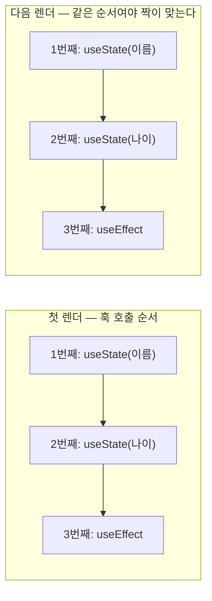
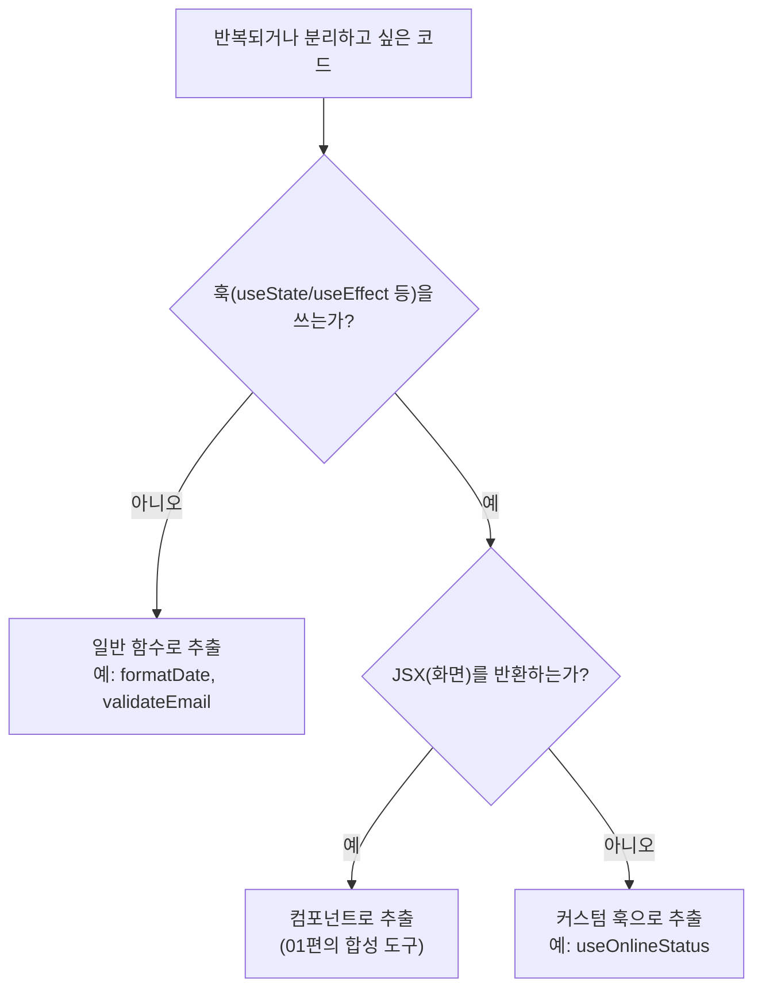

<Callout type="info">
  **이번 문서의 목표:** 커스텀 훅의 정의와 규칙을 정확히 이해하고, "훅은 로직을 공유하지 상태를 공유하지 않는다"는 원리를 코드로 설명할 수 있으며, 어떤 코드를 훅으로 추출할지 판단하는 책임 경계 기준을 갖춘다. 구체적인 설계 기법과 안티패턴은 05편에서 이어진다.
</Callout>

## 왜 커스텀 훅인가 — 반복되는 것은 UI만이 아니다

01편에서 우리는 **반복되는 UI**를 children과 슬롯으로 재사용하는 법을 세웠습니다. 그런데 실무에서 반복되는 것은 화면만이 아닙니다. 이런 코드를 떠올려보세요.

- 채팅 화면: 온라인 상태를 감지해서 "연결됨/끊김" 표시
- 저장 버튼: 온라인일 때만 활성화

두 컴포넌트는 **화면은 완전히 다르지만**, "브라우저의 온라인 여부를 구독하고, 바뀌면 상태를 갱신하고, 떠날 때 구독을 해제한다"는 **로직이 똑같습니다**. `useState`와 `useEffect` 조합을 두 파일에 복사해 붙이는 순간, 버그를 고칠 때도 두 곳을 고쳐야 하는 빚이 생깁니다.

컴포넌트가 **UI의 재사용 단위**라면, 이 반복되는 **상태 로직의 재사용 단위**가 바로 **커스텀 훅**(custom hook)입니다. 01편의 "로직 담당을 분리한다"는 이야기가 훅이라는 그릇을 만나 실체가 되는 지점입니다.

## 1. 커스텀 훅의 정의 — 특별한 문법이 아니라 관례다

### 정의

> **쉽게 말하면:** 커스텀 훅은 "이름이 use로 시작하고, 안에서 다른 훅을 호출하는 평범한 자바스크립트 함수"입니다. React가 제공하는 별도 API가 아닙니다.

- **훅**(hook, 갈고리): 함수 컴포넌트가 React의 기능 — 상태, 생명주기 등 — 에 "걸어 들어가게"(hook into) 해주는 함수들. `useState`, `useEffect`처럼 React가 내장으로 제공하는 것을 **내장 훅**(built-in hook)이라 합니다.
- **커스텀 훅**(custom hook): 개발자가 내장 훅(또는 다른 커스텀 훅)을 조합해 직접 만든 함수. custom은 "주문 제작"이라는 뜻 — 내 앱의 필요에 맞춰 만든 훅입니다.

앞의 온라인 감지 로직을 훅으로 추출하면:

```jsx
// useOnlineStatus.js — 커스텀 훅: 그냥 함수다
import { useState, useEffect } from "react";

export function useOnlineStatus() {
  const [isOnline, setIsOnline] = useState(true);

  useEffect(() => {
    const handleOnline = () => setIsOnline(true);
    const handleOffline = () => setIsOnline(false);
    window.addEventListener("online", handleOnline);
    window.addEventListener("offline", handleOffline);
    return () => {
      window.removeEventListener("online", handleOnline);
      window.removeEventListener("offline", handleOffline);
    };
  }, []);

  return isOnline;
}
```

쓰는 쪽은 이렇게 단순해집니다.

```jsx
function ChatStatus() {
  const isOnline = useOnlineStatus();
  return <p>{isOnline ? "연결됨" : "끊김"}</p>;
}

function SaveButton() {
  const isOnline = useOnlineStatus();
  return <button disabled={!isOnline}>저장</button>;
}
```

주목할 점: 쓰는 쪽 코드에서 `addEventListener` 같은 **구현 세부가 사라지고 의도만 남았습니다.** "온라인 상태가 필요하다"는 선언이죠. 이것이 훅 추출의 첫 번째 이득 — 컴포넌트가 "무엇을"에 집중하고 "어떻게"는 훅이 감춥니다.

### 이름 규칙 — use 접두사는 장식이 아니다

커스텀 훅의 이름은 **반드시 `use`로 시작하고 이어서 대문자**가 와야 합니다 (`useOnlineStatus`, `useFormInput`). 이것은 단순 관례가 아니라 React 생태계의 **약속이자 검사 장치**입니다.

1. **사람에게**: 이 함수 안에 상태가 숨어 있을 수 있다 — 즉 아래에서 설명할 "훅 규칙"을 지켜서 호출해야 한다는 경고 표지판입니다.
2. **도구에게**: **린터**(linter, 코드 검사 도구 — React에서는 eslint-plugin-react-hooks)가 `use`로 시작하는 함수를 훅으로 인식해, 훅 규칙 위반을 자동으로 잡아줍니다. 이름이 `getOnlineStatus`라면 린터는 검사하지 않습니다.

반대 방향의 규칙도 있습니다 — **안에서 훅을 호출하지 않는 함수에는 use를 붙이지 않습니다.** 예를 들어 날짜를 포맷하기만 하는 함수를 `useFormatDate`라 이름 붙이면, 훅 규칙의 제약(조건문 안 호출 금지 등)을 불필요하게 뒤집어쓰고 읽는 사람을 오도합니다. 그냥 `formatDate`라는 일반 함수로 두면 됩니다.

### 훅 규칙 — 왜 최상위에서만 호출해야 하는가

react_1에서 "훅은 컴포넌트 최상위에서만 호출한다"는 규칙을 외웠을 겁니다. 중급에서는 **이유**를 알아야 합니다. React는 한 컴포넌트 안의 훅들을 **호출 순서**로 구분합니다. 변수 이름표가 붙어 있는 게 아니라, "첫 번째 `useState`는 첫 칸, 두 번째는 둘째 칸"처럼 **순서 기반의 목록**으로 상태를 보관합니다.



만약 `if` 문 안에서 훅을 호출하면, 조건이 참일 때와 거짓일 때 호출 순서가 달라져 **2번째 칸의 상태가 엉뚱한 훅에 연결**됩니다. 그래서 규칙은 두 줄로 정리됩니다.

1. 훅은 **컴포넌트 함수 또는 다른 훅의 최상위**에서만 호출한다 — 조건문·반복문·중첩 함수·이벤트 핸들러 안에서 호출 금지.
2. 훅은 **React 함수 컴포넌트 또는 커스텀 훅 안**에서만 호출한다 — 일반 함수·클래스 안 금지.

커스텀 훅도 "다른 훅"이므로 1번의 호출 위치가 됩니다 — 즉 `useOnlineStatus` 안에서 `useState`를 부르는 것은 합법이고, 컴포넌트가 `useOnlineStatus`를 조건문 안에서 부르는 것은 불법입니다. 훅을 커스텀 훅으로 감싸도 규칙은 사라지지 않고 **그대로 전파됩니다.**

## 2. 로직 공유 vs 상태 공유 — 커스텀 훅 최대의 오해

### 문제 상황

`ChatStatus`와 `SaveButton`이 같은 `useOnlineStatus`를 씁니다. 그럼 둘은 **같은 상태를 보고 있는 걸까요?** 여기서 커스텀 훅에 대한 가장 흔하고 가장 위험한 오해가 갈립니다.

### 정답: 훅은 상태 "만드는 법"을 공유한다

> **쉽게 말하면:** 커스텀 훅은 요리 레시피 공유이지, 완성된 요리 한 그릇을 나눠 먹는 게 아닙니다. 레시피(로직)는 하나지만, 각자 자기 주방에서 만든 요리(상태)는 각자의 것입니다.

**커스텀 훅을 호출할 때마다 그 안의 모든 상태는 독립적으로 새로 만들어집니다.** `useOnlineStatus`를 두 컴포넌트가 호출하면, `isOnline`이라는 `useState`도 두 벌 존재합니다. 이유는 간단합니다 — 커스텀 훅은 그냥 함수이고, 그 안의 `useState` 호출은 **호출한 컴포넌트의 상태 목록**(1장의 순서 기반 목록)에 등록되기 때문입니다. 훅 자체는 상태를 "소유"하지 않습니다.

온라인 상태 예시에서는 둘 다 같은 브라우저 이벤트를 구독하니 우연히 값이 같아 보일 뿐입니다. 값을 직접 바꾸는 훅으로 실험하면 차이가 선명해집니다.

<CodePlayground
  template="react"
  activeFile="/App.js"
  label="두 카운터를 각각 눌러보세요 — 같은 훅을 써도 상태는 완전히 독립입니다"
  files={{
    '/App.js': `import { useState } from "react";

// 커스텀 훅: 카운터 로직(레시피)을 담는다
function useCounter(초기값) {
  const [count, setCount] = useState(초기값);
  const 증가 = () => setCount(count + 1);
  const 초기화 = () => setCount(초기값);
  return { count, 증가, 초기화 };
}

function CounterCard({ 이름 }) {
  // 호출할 때마다 독립적인 상태가 새로 만들어진다
  const { count, 증가, 초기화 } = useCounter(0);
  return (
    <div style={{ border: "1px solid #aaa", padding: 12, marginBottom: 8 }}>
      <b>{이름}</b>: {count}
      <button onClick={증가} style={{ marginLeft: 8 }}>+1</button>
      <button onClick={초기화} style={{ marginLeft: 4 }}>리셋</button>
    </div>
  );
}

export default function App() {
  return (
    <div>
      <CounterCard 이름="A 카운터" />
      <CounterCard 이름="B 카운터" />
      <p>A를 눌러도 B는 꿈쩍하지 않습니다 — 훅은 로직만 공유합니다.</p>
    </div>
  );
}`,
  }}
/>

A의 +1을 눌러도 B는 0에 머뭅니다. `useCounter`라는 레시피는 하나지만 요리는 두 그릇인 거죠. 심지어 **한 컴포넌트가 같은 훅을 두 번 호출해도** 두 벌의 독립 상태가 생깁니다.

### 그럼 상태를 정말 "공유"하고 싶다면?

이 구분이 중요한 이유는, 실무에서 "여러 컴포넌트가 **같은 하나의 값**을 봐야 하는" 요구가 실제로 있기 때문입니다 — 로그인한 사용자 정보, 장바구니, 테마 설정 등. 이때 커스텀 훅만으로는 해결되지 않습니다. 선택지는:

- 상태를 공통 부모로 올리고 props로 내려보내기 (02편의 끌어올리기 + colocation 판단)
- 트리 전체가 봐야 한다면 Context 또는 전역 스토어 (자세한 내용은 04편)

| 구분 | 커스텀 훅 | Context·전역 스토어 |
|------|-----------|---------------------|
| 공유하는 것 | 로직 — 상태를 만들고 다루는 방법 | 상태 — 하나의 실제 값 |
| 호출·구독한 곳들의 값 | 각자 독립, 서로 무관 | 모두 같은 값을 바라봄 |
| 비유 | 레시피 배포 | 한 냄비를 같이 떠먹기 |
| 대표 용도 | 폼 입력, 타이머, 구독 로직 재사용 | 로그인 정보, 테마, 장바구니 |

둘은 대립이 아니라 **조합**됩니다 — 06편에서 보겠지만 "Context에서 값을 꺼내는 커스텀 훅"(`useTheme` 같은)은 두 도구를 합친 실무 표준 패턴입니다.

## 3. 훅 추출 기준 — 무엇을 뽑고 무엇을 남기는가

이제 핵심 질문입니다. 컴포넌트의 어떤 코드를 훅으로 뽑아야 할까요? "중복이면 뽑는다"는 답은 절반만 맞습니다. 판단 기준을 세 겹으로 세워봅시다.

### 기준 1 — 뽑을 수 있는가: 훅이 되는 코드의 조건

훅으로 추출할 수 있는 코드는 **상태 로직**(stateful logic) — 즉 `useState`·`useEffect`·다른 훅이 얽혀 있는 코드입니다. 반대로:

- **훅이 전혀 없는 순수 계산** (포맷팅, 정렬, 검증) → 커스텀 훅이 아니라 **일반 함수**로 뽑습니다. 일반 함수는 훅 규칙의 제약이 없어 어디서든 부를 수 있으니 오히려 더 좋은 그릇입니다.
- **JSX가 섞인 코드** → 훅이 아니라 **컴포넌트**로 뽑습니다. 훅은 화면을 반환하지 않습니다 — 값과 함수만 반환합니다.



### 기준 2 — 뽑을 가치가 있는가: 이름을 붙일 수 있는 하나의 책임

기계적 중복 제거보다 중요한 질문은 이것입니다: **"이 코드 덩어리에 목적을 나타내는 이름을 붙일 수 있는가?"**

- `useChatRoom(roomId)` — "채팅방에 접속을 유지한다" ✅ 하나의 목적
- `useOnlineStatus()` — "온라인 여부를 추적한다" ✅ 하나의 목적
- `useStateAndEffect()` — 목적이 아니라 재료의 나열 ❌
- `useEverythingForMyPage()` — 페이지의 잡동사니 전부 ❌

이름을 붙여봤을 때 **"무엇을 하는지"가 아니라 "무엇으로 만들었는지"밖에 말할 수 없다면**, 그것은 책임 단위가 아니라 코드 조각일 뿐입니다. 좋은 커스텀 훅의 이름은 구체적인 **하나의 관심사**(concern, 컨선 — 프로그램이 신경 써야 할 하나의 주제)를 가리킵니다. 이것을 **관심사의 분리**(separation of concerns)라고 하며, 01편에서 틀과 내용물을 분리한 것과 같은 원리를 로직에 적용한 것입니다.

실전 감각: **중복이 없어도 뽑을 가치가 있는 경우**가 있습니다. 한 컴포넌트 안에서 "접속 관리 로직"과 "화면 그리기"가 뒤엉켜 200줄이 됐다면, 단 한 곳에서만 쓰더라도 `useChatConnection`으로 뽑는 순간 컴포넌트는 읽을 수 있는 30줄이 됩니다. 재사용은 훅의 여러 이득 중 하나일 뿐, **가독성과 책임 분리 자체가 목적**이 될 수 있습니다.

### 기준 3 — 지금 뽑아야 하는가: 반복이 확인될 때까지 기다리기

반대로, **아직 한 번밖에 안 쓴 단순한 로직을 "나중에 재사용할 것 같아서" 미리 훅으로 만드는 것**은 경계해야 합니다. 미래의 요구사항을 상상해서 만든 추상화는 대개 빗나가고, 빗나간 추상화는 없느니만 못합니다 (이 안티패턴의 해부는 05편). 실용적인 순서는:

1. 일단 컴포넌트 안에 씁니다.
2. **두 번째 사용처가 실제로 나타나거나**, 컴포넌트가 로직에 짓눌려 읽기 어려워지면 뽑습니다.
3. 뽑을 때는 두 사용처의 **공통 부분만** 담습니다 — 한쪽에만 필요한 옵션을 훅에 욱여넣지 않습니다.

> **쉽게 말하면:** 옷장 정리와 같습니다. 옷이 두세 벌일 때 수납 시스템부터 사는 사람은 없습니다. 옷이 쌓여 문제가 눈에 보일 때 정리해도 늦지 않습니다.

### 판단 기준 요약표

| 신호 | 판단 |
|------|------|
| 같은 훅 조합 로직이 두 곳 이상에서 반복된다 | 커스텀 훅으로 추출 |
| 한 곳뿐이지만 컴포넌트가 로직에 짓눌려 있다 | 가독성 목적으로 추출 검토 |
| 목적을 나타내는 이름이 안 붙는다 | 추출 단위가 잘못됨 — 쪼개거나 보류 |
| 훅을 안 쓰는 순수 계산이다 | 일반 함수로 추출 |
| JSX를 반환해야 한다 | 컴포넌트로 추출 |
| 언젠가 재사용할 것 같은 예감뿐이다 | 보류 — 두 번째 사용처를 기다린다 |

## 4. 추출 실습 — 컴포넌트에서 훅이 태어나는 과정

기준을 실제로 적용해봅시다. 아래는 흔한 "폼 입력" 컴포넌트입니다. 이름과 이메일, 두 입력이 **완전히 같은 패턴**(값 상태 + onChange 핸들러)을 반복합니다.

<CodePlayground
  template="react"
  activeFile="/App.js"
  label="반복되는 입력 로직을 useFormInput 훅으로 추출한 결과 — 입력해보고, 훅 안 로직을 바꿔보세요"
  files={{
    '/App.js': `import { useState } from "react";

// [추출된 훅] "제어되는 입력 하나"라는 이름 붙일 수 있는 책임
function useFormInput(초기값) {
  const [value, setValue] = useState(초기값);

  function handleChange(e) {
    setValue(e.target.value);
  }

  // input에 그대로 펼칠 수 있는 props 묶음을 반환
  return { value, onChange: handleChange };
}

export default function App() {
  // 두 번 호출 = 독립 상태 두 벌 (2장에서 확인한 원리)
  const 이름입력 = useFormInput("");
  const 이메일입력 = useFormInput("");

  return (
    <div>
      <label>
        이름: <input {...이름입력} placeholder="이름" />
      </label>
      <br />
      <label>
        이메일: <input {...이메일입력} placeholder="이메일" />
      </label>
      <p>
        입력값 확인 — 이름: {이름입력.value || "(비어 있음)"} / 이메일:{" "}
        {이메일입력.value || "(비어 있음)"}
      </p>
    </div>
  );
}`,
  }}
/>

추출 전후를 비교하면 이득이 보입니다.

- **추출 전**: `useState` 두 개 + `handleChange` 두 개 — 입력이 늘 때마다 두 줄씩 복붙.
- **추출 후**: 입력 하나당 훅 호출 한 줄. "제어되는 입력"이라는 개념에 `useFormInput`이라는 **이름**이 생겼고, 나중에 이 훅 안에 검증·트림 같은 로직을 추가하면 **모든 입력이 한 번에** 개선됩니다.

여기서 `useFormInput`이 **무엇을 받고**(초기값) **무엇을 돌려주는지**(value와 onChange 묶음)가 이 훅의 계약입니다. 이 입력·출력 계약을 어떻게 설계하는지 — 객체로 줄지 배열로 줄지, 함수를 어떻게 넘길지 — 는 05편의 주제입니다.

## 핵심 정리

- 커스텀 훅은 **use + 대문자**로 시작하며 내부에서 다른 훅을 호출하는 **평범한 함수**다. use 접두사는 사람과 린터를 위한 약속이며, 훅을 안 쓰는 함수에는 붙이지 않는다.
- 훅 규칙(최상위에서만, React 함수 안에서만)은 React가 훅을 **호출 순서**로 추적하기 때문에 존재하며, 커스텀 훅에도 그대로 전파된다.
- 커스텀 훅은 **로직**(레시피)**을 공유하지 상태**(요리)**를 공유하지 않는다** — 호출할 때마다 독립적인 상태가 새로 만들어진다. 상태 자체의 공유는 끌어올리기·Context·전역 스토어의 일이다(04편).
- 추출 판단: 훅이 얽힌 상태 로직인가(아니면 일반 함수·컴포넌트로) → 목적을 나타내는 **이름이 붙는 하나의 책임**인가 → 반복이 확인됐거나 가독성 이득이 분명한가.
- 미래를 상상한 선제적 추출은 보류한다 — 두 번째 사용처가 나타날 때 공통 부분만 뽑는다.

## 마무리 복습

<Quiz
  questionNumber={1}
  question="커스텀 훅에 대한 설명으로 옳은 것은?"
  options={['React가 제공하는 특수 문법으로 별도 등록 절차가 필요하다', 'use로 시작하는 이름으로 다른 훅을 호출하는 일반 자바스크립트 함수다', '클래스 컴포넌트에서만 사용할 수 있다', 'JSX를 반환해야 한다']}
  correctAnswer={2}
  explanation="커스텀 훅은 특별한 API가 아니라, use 접두사 관례를 따르고 내부에서 내장 훅이나 다른 커스텀 훅을 호출하는 평범한 함수다. JSX가 아니라 값과 함수를 반환한다."
  optionExplanations={['등록 절차 같은 것은 없다 — 그냥 함수를 만들어 export하면 된다', '정답 — 문법이 아니라 관례와 규칙을 따르는 일반 함수다', '훅은 함수 컴포넌트와 다른 훅 안에서만 쓸 수 있다', 'JSX를 반환하면 그것은 훅이 아니라 컴포넌트로 추출할 대상이다']}
/>

<Quiz
  questionNumber={2}
  question="훅 이름에 use 접두사를 붙이는 실질적인 이유로 가장 알맞은 것은?"
  options={['React가 use 접두사 없는 훅을 실행하지 못하게 막기 때문', '린터가 훅으로 인식해 훅 규칙 위반을 자동 검사하고, 읽는 사람에게 상태가 숨어 있을 수 있음을 알리기 때문', '번들 크기가 줄어들기 때문', '자동으로 메모이제이션되기 때문']}
  correctAnswer={2}
  explanation="use 접두사는 eslint-plugin-react-hooks 같은 린터가 그 함수를 훅으로 취급해 규칙 위반을 잡게 하고, 개발자에게는 호출 위치 제약이 있는 함수라는 신호를 준다."
  optionExplanations={['실행 자체는 이름과 무관하게 된다 — 다만 검사와 소통이 무너진다', '정답 — 도구와 사람 모두를 위한 약속이다', '이름은 번들 크기와 무관하다', '접두사가 메모이제이션을 일으키는 일은 없다']}
/>

<Quiz
  questionNumber={3}
  question="훅을 조건문 안에서 호출하면 안 되는 근본 이유는?"
  options={['조건문 안은 실행 속도가 느려서', 'React가 훅을 이름이 아닌 호출 순서로 추적하므로 순서가 달라지면 상태가 엉뚱한 훅에 연결되어서', '조건문 안에서는 클로저가 생기지 않아서', '린터가 조건문을 해석하지 못해서']}
  correctAnswer={2}
  explanation="React는 한 컴포넌트의 훅들을 호출 순서 기반 목록으로 보관한다. 조건에 따라 호출 순서가 바뀌면 렌더 간에 짝이 어긋나 상태가 잘못 연결된다."
  optionExplanations={['속도 문제가 아니라 상태 추적 방식의 문제다', '정답 — 순서 기반 추적이 규칙의 존재 이유다', '클로저는 조건문 안에서도 정상적으로 생긴다', '린터는 결과를 검사하는 도구일 뿐 규칙의 이유가 아니다']}
/>

<Quiz
  questionNumber={4}
  question="두 컴포넌트가 같은 useCounter 훅을 각각 호출했다. 한쪽에서 증가시키면 다른 쪽 값은?"
  options={['함께 증가한다 — 훅이 상태를 공유하기 때문', '변하지 않는다 — 호출마다 독립적인 상태가 만들어지기 때문', 'React 버전에 따라 다르다', '첫 번째 호출한 컴포넌트의 값만 유효하다']}
  correctAnswer={2}
  explanation="커스텀 훅은 로직을 공유할 뿐 상태를 공유하지 않는다. 훅 안의 useState는 호출한 컴포넌트의 상태 목록에 각각 등록되므로, 호출할 때마다 독립적인 상태가 새로 생긴다."
  optionExplanations={['훅은 레시피 공유이지 한 그릇 나눠 먹기가 아니다', '정답 — 상태 공유가 필요하면 끌어올리기나 Context, 전역 스토어를 쓴다', '버전과 무관한 훅의 기본 원리다', '모든 호출이 각자 유효한 독립 상태를 가진다']}
/>

<Quiz
  questionNumber={5}
  question="여러 컴포넌트가 하나의 같은 값(예: 로그인 사용자 정보)을 바라봐야 할 때 커스텀 훅만으로 해결되지 않는 이유는?"
  options={['훅은 문자열을 다룰 수 없어서', '훅 호출마다 독립 상태가 생기므로 같은 하나의 값이 되지 않아서', '훅은 컴포넌트당 한 번만 호출 가능해서', '로그인 정보는 훅 규칙상 다룰 수 없어서']}
  correctAnswer={2}
  explanation="커스텀 훅은 상태를 만드는 방법을 공유할 뿐이므로, 각 컴포넌트가 호출하면 서로 무관한 별도 상태가 생긴다. 하나의 값을 함께 보려면 상태 끌어올리기, Context, 전역 스토어 같은 상태 공유 수단이 필요하다."
  optionExplanations={['다루는 값의 타입과는 무관하다', '정답 — 로직 공유와 상태 공유의 구분이 핵심이다', '같은 훅을 여러 번 호출해도 되며, 그때마다 독립 상태가 생긴다', '훅 규칙은 호출 위치에 관한 것이지 데이터 종류와 무관하다']}
/>

<Quiz
  questionNumber={6}
  question="날짜 문자열을 보기 좋게 바꾸는 순수 계산 함수를 분리하려 한다. 올바른 선택은?"
  options={['useFormatDate라는 커스텀 훅으로 만든다', 'formatDate라는 일반 함수로 만든다', 'FormatDate 컴포넌트로 만든다', '전역 스토어에 넣는다']}
  correctAnswer={2}
  explanation="훅을 전혀 쓰지 않는 순수 계산은 일반 함수로 추출한다. use를 붙이면 훅 규칙의 호출 제약을 불필요하게 뒤집어쓰고 읽는 사람을 오도한다."
  optionExplanations={['훅을 안 쓰는 함수에 use를 붙이는 것은 관례 위반이다', '정답 — 일반 함수는 어디서든 자유롭게 호출할 수 있는 더 좋은 그릇이다', '화면을 그리는 일이 아니므로 컴포넌트로 만들 이유가 없다', '계산 로직은 상태가 아니므로 스토어에 둘 대상이 아니다']}
/>

<Quiz
  questionNumber={7}
  question="다음 중 훅 추출을 보류해야 할 상황에 가장 가까운 것은?"
  options={['같은 구독 로직이 세 컴포넌트에 복사되어 있다', '한 곳에서만 쓰는 단순 로직인데 언젠가 재사용할 것 같은 예감이 든다', '컴포넌트가 접속 관리 로직에 짓눌려 200줄이 되었다', '로직에 useChatRoom이라는 명확한 이름을 붙일 수 있다']}
  correctAnswer={2}
  explanation="미래의 재사용을 상상해서 미리 만드는 추상화는 대개 빗나간다. 두 번째 사용처가 실제로 나타나거나 가독성 문제가 분명해질 때 추출해도 늦지 않다."
  optionExplanations={['이미 반복이 확인됐으므로 추출할 때다', '정답 — 예감만으로 하는 선제 추출은 보류 대상이다', '한 곳뿐이어도 가독성·책임 분리 목적의 추출은 정당하다', '목적이 담긴 이름이 붙는다는 것은 좋은 추출 단위라는 신호다']}
/>

## 참고 자료

- [React 공식 문서 - Reusing Logic with Custom Hooks](https://react.dev/learn/reusing-logic-with-custom-hooks)
- [React 레거시 문서 - Building Your Own Hooks](https://legacy.reactjs.org/docs/hooks-custom.html)
- [W3Schools - React Custom Hooks](https://www.w3schools.com/react/react_customhooks.asp)
