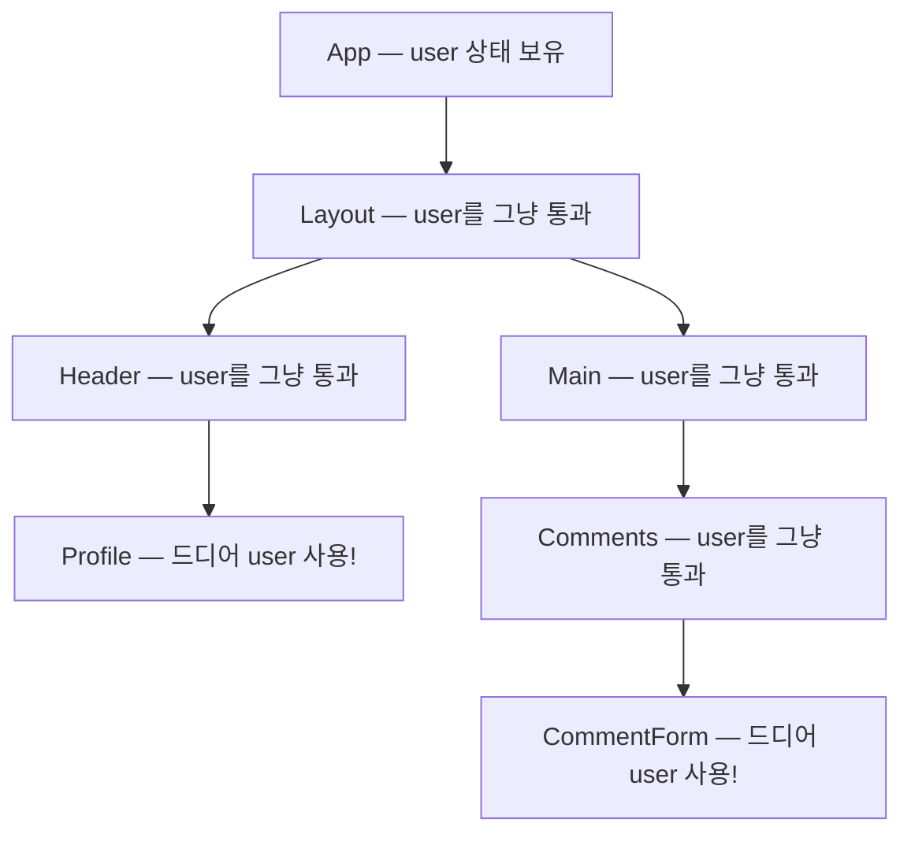
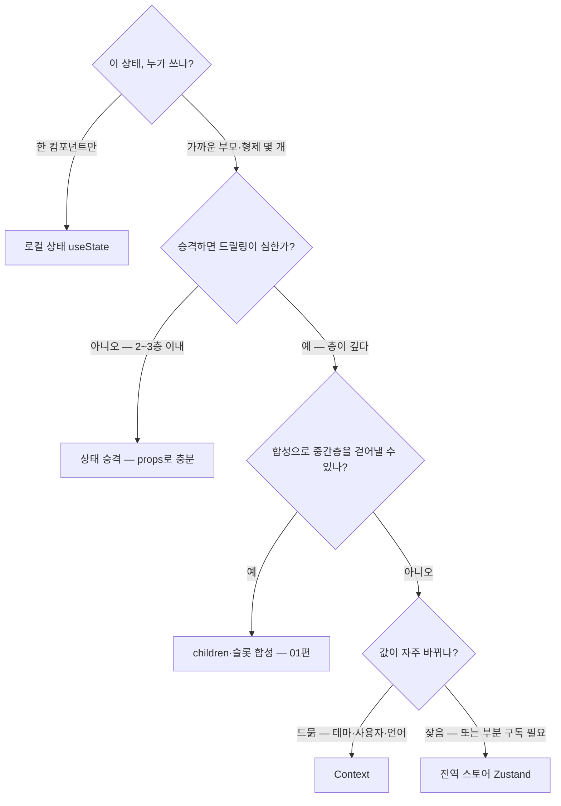

<Callout type="info">
  **이번 문서의 목표:** 어떤 상태를 로컬에 두고, 어떤 상태를 Context로 공유하고, 어떤 상태를 전역 스토어로 보낼지 — 코드를 쓰기 전에 머릿속에서 판단할 수 있는 **선택 기준 지도**를 완성한다. 구현 세부는 06~07편에서 다루므로, 이 편은 순수하게 "판단"에 집중한다.
</Callout>

## 왜 "선택 기준"부터 배우는가

react_1에서 우리는 `useState`로 상태를 만들고, 필요하면 부모로 끌어올리는 **상태 승격**(lifting state up)을 배웠습니다. 그런데 앱이 커지면 이 방식만으로는 이상한 고통이 시작됩니다.

로그인한 사용자 정보를 생각해 봅시다. 헤더의 프로필 사진, 사이드바의 이름, 설정 페이지의 이메일, 댓글 작성란의 닉네임 — **트리 곳곳에 흩어진 컴포넌트**가 같은 데이터를 원합니다. 상태 승격의 논리대로라면 이 상태는 모든 사용처의 공통 조상, 즉 거의 항상 **최상위 컴포넌트**까지 올라가야 하고, 거기서 각 사용처까지 props로 한 층 한 층 내려보내야 합니다.



중간의 `Layout`, `Header`, `Main`, `Comments`는 user가 **필요하지도 않은데** 단지 아래로 전달하기 위해 props를 받습니다. 이 현상을 **props 드릴링**(props drilling, 프롭스 뚫고 내려보내기)이라고 부릅니다. 드릴(drill)로 지층을 뚫듯, 데이터가 관계없는 층들을 관통해 내려간다는 뜻입니다.

> **쉽게 말하면:** props 드릴링은 3층에 사는 사람에게 택배를 주려고 1층·2층 주민에게 차례로 손에서 손으로 전달시키는 것입니다. 1층·2층 주민은 택배와 아무 상관이 없는데도요.

props 드릴링이 왜 문제인지 구체적으로 짚으면:

- **중간 컴포넌트가 오염됩니다.** `Layout`은 레이아웃만 책임져야 하는데, user라는 무관한 prop을 시그니처에 갖게 됩니다. 01편에서 세운 낮은 결합도 원칙이 깨지는 거죠.
- **수정 비용이 층수만큼 커집니다.** user 대신 userProfile로 이름을 바꾸면, 통과만 시키던 모든 중간 컴포넌트를 함께 고쳐야 합니다.
- **재사용이 어려워집니다.** `Comments`를 다른 페이지에서 쓰려면 그 페이지도 user를 구해서 넘겨줘야 합니다.

이 문제를 풀기 위한 도구가 Context와 전역 스토어입니다. 그런데 도구가 둘 이상이면 반드시 "언제 무엇을 쓰나"라는 판단 문제가 따라옵니다. 도구부터 배우고 판단을 나중에 배우면, 손에 든 망치로 모든 것을 못으로 보게 됩니다 — 실제로 "일단 다 Context에 넣거나", "일단 다 전역 스토어에 넣는" 실무 사고가 매우 흔합니다. 그래서 이 과목은 순서를 뒤집어 **판단 기준을 먼저** 세웁니다.

## 1. Context — React에 내장된 "방송 채널"

### 왜 필요한가

props 드릴링의 본질적 원인은 "데이터는 부모에서 자식으로, 한 층씩만 흐른다"는 React의 기본 규칙입니다. 이 규칙은 데이터 흐름을 추적하기 쉽게 해주는 좋은 규칙이지만, **트리 전체가 공유하는 데이터**에는 비효율적입니다. 그래서 React는 예외 통로를 하나 마련해 두었습니다 — 그것이 **Context**(컨텍스트, 문맥)입니다.

### 정의

> **쉽게 말하면:** Context는 부모가 값을 방송하면, 그 아래 자손 중 **원하는 컴포넌트만** 골라서 수신하는 방송 채널입니다. 중간층은 손도 대지 않습니다.

Context는 세 부품으로 이뤄집니다. 지금은 역할만 파악하면 됩니다 — 실전 사용법과 함정은 06편에서 깊게 다룹니다.

| 부품 | 역할 | 비유 |
|------|------|------|
| `createContext` | 채널을 개설한다 | 라디오 주파수 만들기 |
| `Provider` | 트리의 한 지점에서 값을 방송한다 | 방송국 송출 |
| `useContext` | 자손 어디서든 값을 수신한다 | 라디오 켜기 |

```jsx
// 채널 개설
const UserContext = createContext(null);

// 방송: Provider 아래의 모든 자손이 이 값에 접근 가능해진다
function App() {
  const [user, setUser] = useState({ name: '제노' });
  return (
    <UserContext.Provider value={user}>
      <Layout />   {/* Layout·Header는 user를 몰라도 된다 */}
    </UserContext.Provider>
  );
}

// 수신: 몇 층 아래든 상관없이 직접 받는다
function Profile() {
  const user = useContext(UserContext);
  return <b>{user.name}</b>;
}
```

중간의 `Layout`과 `Header`는 시그니처가 깨끗해졌습니다. 택배 비유로 돌아가면, Context는 1층·2층 주민을 거치지 않고 3층으로 바로 배달하는 엘리베이터인 셈입니다.

### Context가 잘 맞는 데이터의 성격

여기가 이 편의 첫 번째 핵심 판단입니다. Context는 "전역 상태 관리 도구"가 아니라 "**트리에 값을 주입하는 통로**"입니다. React 공식 문서가 Context의 대표 용도로 드는 것들을 보면 공통점이 있습니다.

- 테마(다크/라이트 모드)
- 현재 로그인한 사용자 정보
- 현재 언어(locale, 로케일 — 지역·언어 설정)
- 라우팅 정보 (실제로 React Router도 내부적으로 Context를 씁니다 — 08편)

공통점이 보이나요? 전부 **넓은 범위가 함께 읽고, 자주 바뀌지 않는** 값입니다. 테마는 하루에 몇 번 바뀌지 않고, 로그인 사용자는 세션 동안 거의 고정입니다. 반대로 "장바구니 수량"이나 "실시간 입력값"처럼 **자주 바뀌는** 값을 Context에 넣으면 문제가 생기는데, 그 이유는 Context의 갱신 방식에 있습니다.

### Context의 구조적 한계 — 판단에 필요한 만큼만

Context에는 selector(셀렉터, 골라 읽기) 개념이 없습니다. **Provider의 value가 바뀌면, 그 Context를 구독하는 모든 컴포넌트가 다시 렌더링됩니다** — 값의 어느 조각을 쓰든 상관없이요. 사용자 객체 `{ name, email, theme }`을 하나의 Context로 방송하면, theme만 쓰는 컴포넌트도 name이 바뀔 때 함께 다시 렌더링됩니다. 02편에서 본 대로 리렌더 자체가 항상 느린 건 아니지만, 구독자가 수십 개이고 값이 자주 바뀌면 실제 성능 문제가 됩니다.

또 하나 — Context는 상태를 **만들어주지 않습니다**. 값을 바꾸는 로직은 여전히 `useState`/`useReducer`로 직접 짜야 하고, Context는 그 값을 나르기만 합니다. "Context = 전역 상태 관리 라이브러리"라는 흔한 오해와 달리, Context는 **운송 수단이지 창고가 아닙니다**.

<Callout type="warning">
  **자주 틀리는 점:** "props 드릴링이 보이면 무조건 Context"가 아닙니다. 두세 층 정도의 드릴링은 그냥 props로 두는 것이 데이터 흐름을 명시적으로 유지해서 더 낫습니다. 또 01편의 합성으로 풀리는 경우도 많습니다 — 중간 컴포넌트가 children을 받게 바꾸면, 부모가 완성된 JSX를 직접 끼워 넣으므로 드릴링 자체가 사라집니다. Context는 이 두 방법으로 안 될 때 꺼내는 세 번째 카드입니다.
</Callout>

## 2. 전역 스토어 — React 바깥의 독립 창고

### 왜 또 다른 도구가 필요한가

Context의 두 한계 — 골라 읽기가 안 된다는 점, 상태 로직을 스스로 담지 못한다는 점 — 를 정면으로 해결하는 도구가 **전역 스토어**(global store, 글로벌 스토어)입니다. Zustand(주스탄트 — 독일어로 "상태"라는 뜻), Redux(리덕스), Jotai(조타이) 같은 라이브러리가 여기 속하며, 이 과목에서는 Zustand를 씁니다.

### 정의

> **쉽게 말하면:** 전역 스토어는 컴포넌트 트리 **바깥**에 세운 독립 창고입니다. 어떤 컴포넌트든 창고에 직접 가서, **필요한 물건만** 꺼내 옵니다.

전역 스토어의 구조적 특징을 Context와 대비해 보면:

- **트리 밖에 존재합니다.** Provider로 감쌀 필요조차 없는 경우가 많고(Zustand가 그렇습니다), 상태가 컴포넌트의 생성·소멸과 무관하게 살아 있습니다.
- **상태와 갱신 로직을 함께 담습니다.** 값뿐 아니라 "값을 바꾸는 함수"(액션)까지 창고 안에 정의합니다. 운송 수단이 아니라 진짜 창고입니다.
- **selector로 골라 읽습니다.** "창고에서 장바구니 수량만 주세요"라고 요청하면, **그 조각이 바뀔 때만** 다시 렌더링됩니다. Context의 전체 방송 문제가 구조적으로 해결됩니다.

```jsx
// Zustand 스토어 — 맛보기만. 상세 설계는 06~07편에서
import { create } from 'zustand';

const useCartStore = create((set) => ({
  items: [],                                          // 상태
  addItem: (item) =>                                  // 갱신 로직도 창고 안에
    set((state) => ({ items: [...state.items, item] })),
}));

// 컴포넌트는 필요한 조각만 골라 구독한다
function CartBadge() {
  const count = useCartStore((state) => state.items.length);
  return <span>{count}</span>; // items.length가 바뀔 때만 리렌더
}
```

### 공짜가 아니다 — 전역 스토어의 비용

그럼 처음부터 전부 전역 스토어에 넣으면 되지 않을까요? 안 됩니다. 전역 스토어에는 뚜렷한 비용이 있습니다.

- **데이터 흐름이 암묵적이 됩니다.** props는 "이 컴포넌트가 무엇을 받는지"가 시그니처에 드러나지만, 스토어 구독은 컴포넌트 내부를 열어봐야 보입니다. 아무 데서나 읽고 쓸 수 있다는 건, 아무 데서나 읽고 쓰는 코드가 실제로 생긴다는 뜻입니다.
- **컴포넌트가 창고에 결합됩니다.** 스토어를 구독한 컴포넌트는 그 스토어 없이는 재사용·테스트가 어려워집니다. 01편에서 배운 "표시 담당은 props만 받는다" 원칙과 정면 충돌하죠.
- **상태의 수명이 컴포넌트와 분리됩니다.** 화면을 떠나도 상태가 남는 것은 장점이자 단점입니다 — 검색 페이지의 필터 상태가 다음 방문에도 남아 있어 사용자를 어리둥절하게 만드는 버그는 실무에서 아주 흔합니다.

즉 전역 스토어는 강력한 만큼, **정말 전역이어야 하는 상태**에만 써야 하는 도구입니다.

## 3. 판단의 첫 질문 — 상태의 "사정거리"

이제 세 도구가 손에 있습니다: 로컬 상태(`useState`), Context, 전역 스토어. 선택의 첫 번째 기준은 도구의 기능이 아니라 **상태 자신의 성격**입니다. 스스로에게 물어보세요 — "이 상태를 읽거나 바꾸는 컴포넌트가 트리의 어디까지 퍼져 있나?" 이것을 상태의 **사정거리**라고 부르겠습니다.



이 순서도가 이 편의 뼈대입니다. 위에서 아래로, **가장 좁은 도구부터** 시도하고 안 될 때만 다음으로 넘어갑니다. 각 단계를 사례로 확인해 봅시다.

### 사정거리 1 — 한 컴포넌트: 로컬 상태

드롭다운의 열림/닫힘, 입력창의 현재 값, 마우스 호버 여부. 이런 상태는 그 컴포넌트 말고는 아무도 관심이 없습니다. **고민 없이 `useState`입니다.** 그리고 02편에서 다룬 **state colocation**(상태 콜로케이션 — 상태를 쓰는 곳 곁에 두기) 원칙에 따라, 이런 상태를 위로 올리지 않는 것 자체가 성능 최적화입니다. 상태가 낮게 있을수록, 바뀔 때 다시 렌더링되는 범위가 좁아지니까요.

실무 통계적으로 앱 상태의 대부분은 이 부류입니다. "전역 상태 관리를 어떻게 하죠?"라는 질문의 절반은 "그거 전역 아니어도 됩니다"가 답입니다.

### 사정거리 2 — 가까운 가족: 상태 승격

같은 화면 안의 형제 컴포넌트 둘이 공유하는 상태 — 예를 들어 검색 입력창과 결과 목록. 공통 부모로 올리고 props로 내리면 됩니다. 층수가 2~3층 이내라면 드릴링이라 부르기도 민망한 수준이고, **데이터 흐름이 눈에 보인다는 장점**이 사소한 전달 비용을 압도합니다.

### 사정거리 3 — 깊은 트리, 그러나 느린 값: Context

앱 전체 또는 큰 영역이 함께 읽되, 갱신이 드문 값 — 테마, 로그인 사용자, 언어. Context의 "전체 방송" 한계는 값이 드물게 바뀔 때는 문제가 되지 않으므로, 별도 라이브러리 없이 React 내장 기능으로 깔끔하게 풀립니다.

또 하나의 좋은 용도는 **영역 한정 공유**입니다. Provider는 트리 어디에나 세울 수 있으므로, 앱 전체가 아니라 특정 서브트리에만 값을 주입할 수 있습니다 — 예컨대 하나의 폼 영역 안에서만 공유되는 폼 설정. 이 성질은 11편의 compound 패턴에서 핵심 재료가 됩니다.

### 사정거리 4 — 깊고 넓고 빠른 값: 전역 스토어

트리 곳곳에서 읽고 쓰며, 갱신도 잦은 값 — 장바구니, 알림 목록, 복잡한 필터 조합, 여러 화면이 공유하는 편집 중 데이터. 이런 값을 Context에 넣으면 갱신마다 구독자 전원이 다시 렌더링되는 비용을 치릅니다. selector로 부분 구독이 되는 전역 스토어가 구조적으로 맞는 자리입니다.

<Callout type="info">
  **서버에서 온 데이터는요?** API로 받아온 목록·상세 데이터는 성격이 또 다릅니다 — 원본이 서버에 있고 우리 것은 사본이라, 신선도·캐싱·재요청이라는 별개의 문제가 붙습니다. 이런 **서버 상태**는 TanStack Query 같은 전용 도구의 영역이며 이 과목 범위 밖입니다. 다만 판단 기준은 기억해 두세요: "이거 전역 스토어에 넣을까?"의 답이 "그건 서버 상태라서 애초에 다른 문제"인 경우가 실무에 아주 많습니다.
</Callout>

## 4. 두 번째 질문 — 갱신 빈도와 구독 범위

사정거리가 같아도 결론이 달라지는 두 번째 축이 있습니다. 위 순서도의 마지막 갈림길, **갱신 빈도**입니다. 같은 "앱 전체 공유"라도:

| 상태 | 사정거리 | 갱신 빈도 | 부분 구독 필요? | 결론 |
|------|---------|----------|---------------|------|
| 다크 모드 여부 | 앱 전체 | 드묾 | 불필요 — 다 같이 바뀌는 게 목적 | Context |
| 로그인 사용자 | 앱 전체 | 드묾 | 거의 불필요 | Context |
| 장바구니 | 헤더·목록·결제 등 곳곳 | 잦음 | 필요 — 배지는 수량만, 목록은 항목만 | 전역 스토어 |
| 실시간 알림 | 곳곳 | 매우 잦음 | 필요 | 전역 스토어 |
| 모달 열림 여부 | 그 모달 주변 | 잦음 | 무관 | 로컬 상태 — 애초에 전역이 아님 |

표의 마지막 행이 중요합니다. 갱신이 잦다고 전역 스토어가 아니라, **사정거리가 좁으면 여전히 로컬**입니다. 두 축을 곱해서 판단하는 것이지, 한 축만 보고 결정하지 않습니다.

그리고 이 표는 "상태 하나마다 따로 판단한다"는 것을 전제합니다. 실무에서 가장 흔한 실수가 **앱의 모든 상태를 한 바구니에 담는 것**입니다 — 전부 하나의 거대한 Context에 넣거나, 전부 하나의 스토어에 넣는 식으로요. 상태마다 성격이 다르므로 놓이는 자리도 달라야 합니다. 한 앱 안에 로컬 상태 + Context 두어 개 + 작은 스토어 한두 개가 **공존하는 것이 정상**입니다.

## 5. 판단 연습 — 미니 사례 다섯 개

기준을 실제로 굴려 봅시다. 각 사례에서 먼저 스스로 판단해 보고 해설을 읽으세요.

**사례 1 — 아코디언의 펼침 상태.** FAQ 페이지에서 각 질문을 클릭하면 답이 펼쳐진다.
→ 사정거리: 각 아코디언 항목 하나. **로컬 상태.** "여러 항목 중 하나만 펼치기" 요구가 생기면 공통 부모로 한 층 승격 — 그래도 여전히 사정거리 2입니다.

**사례 2 — 다국어 지원.** 사용자가 한국어/영어를 고르면 앱 전체 문구가 바뀐다.
→ 사정거리: 앱 전체. 갱신: 드묾. **Context.** 언어 변경 시 어차피 화면 전체가 다시 그려져야 하므로, "전체 방송"이 한계가 아니라 오히려 원하는 동작입니다.

**사례 3 — 쇼핑몰 장바구니.** 헤더 배지에 수량, 사이드 패널에 목록, 결제 페이지에 합계가 필요하고, 담기/빼기가 수시로 일어난다.
→ 사정거리: 곳곳. 갱신: 잦음. 부분 구독: 필요(배지는 수량만 관심). **전역 스토어.**

**사례 4 — 게시글 상세 페이지의 데이터.** URL의 글 번호로 API를 호출해 제목·본문을 받아 그린다.
→ 이건 **서버 상태**입니다. 함정 사례였습니다 — "여러 컴포넌트가 쓰니 전역"으로 달려가기 전에, 원본이 어디 있는지 먼저 물어야 합니다. 과목 범위 안에서는 해당 페이지의 로컬 상태(또는 로직을 커스텀 훅으로 추출 — 03편)로 충분합니다.

**사례 5 — 관리자 페이지의 사이드바 접힘 상태.** 사이드바 토글 버튼은 헤더에 있고, 접힘 여부는 사이드바와 본문 레이아웃이 읽는다.
→ 사정거리: 헤더·사이드바·본문 — 전부 최상위 레이아웃의 직계 자식입니다. 공통 부모가 바로 위에 있으므로 **상태 승격**으로 충분합니다. "여러 컴포넌트가 쓴다 = 전역"이 아니라는 좋은 반례입니다.

<Callout type="warning">
  **자주 틀리는 점:** 판단이 애매하면 **좁은 쪽을 고르세요.** 로컬에서 시작해 필요해지면 승격하고, 그래도 아프면 Context나 스토어로 옮기는 리팩터링은 쉽습니다. 반대로 이미 전역이 된 상태를 로컬로 되돌리는 일은 — 어디서 읽고 쓰는지 전부 추적해야 해서 — 몇 배로 고통스럽습니다. 상태는 **승격은 쉽고 강등은 어렵습니다.**
</Callout>

## 핵심 정리

- props 드릴링은 데이터가 무관한 중간층을 관통하는 현상 — 하지만 첫 처방은 Context가 아니라 **합성과 상태 승격**이고, Context는 그다음 카드다.
- Context는 창고가 아니라 **운송 수단** — 트리에 값을 주입하는 통로이며, 상태 로직은 담지 않는다. 값이 바뀌면 구독자 **전원**이 다시 렌더링된다.
- 전역 스토어는 트리 밖의 독립 창고 — 상태와 갱신 로직을 함께 담고, **selector로 필요한 조각만** 구독한다. 대신 데이터 흐름이 암묵적이 되는 비용을 치른다.
- 판단의 두 축은 **사정거리**(누가 쓰나)와 **갱신 빈도·구독 범위**(얼마나 자주, 얼마나 골라서). 넓고 느리면 Context, 넓고 빠르면 스토어, 좁으면 무조건 로컬.
- 상태마다 따로 판단해 여러 도구가 공존하는 것이 정상이며, 애매하면 **좁은 쪽** — 승격은 쉽고 강등은 어렵다.

## 마무리 복습

<Quiz
  questionNumber={1}
  question="props 드릴링에 대한 설명으로 옳은 것은?"
  options={['자식이 부모의 상태를 직접 수정하는 현상', '데이터를 쓰지 않는 중간 컴포넌트들이 전달만을 위해 props를 받는 현상', 'Context의 value가 바뀔 때 구독자가 모두 리렌더되는 현상', '전역 스토어를 여러 컴포넌트가 구독하는 현상']}
  correctAnswer={2}
  explanation="props 드릴링은 깊은 곳의 자손에게 데이터를 주기 위해, 그 데이터와 무관한 중간 컴포넌트들이 props를 받아 내려보내기만 하는 현상이다."
  optionExplanations={['자식이 부모 상태를 직접 수정하는 것은 단방향 데이터 흐름 위반이라는 별개 문제다', '정답 — 택배를 층마다 손에서 손으로 전달시키는 상황에 비유된다', 'Context의 전체 리렌더는 드릴링이 아니라 Context 자체의 한계다', '스토어 구독은 드릴링을 피하는 수단이지 드릴링이 아니다']}
/>

<Quiz
  questionNumber={2}
  question="props 드릴링이 발견됐을 때 가장 먼저 검토할 순서로 알맞은 것은?"
  options={['즉시 전역 스토어를 도입한다', '즉시 Context를 도입한다', '드릴링 층수가 얕으면 그대로 두거나, 합성으로 중간층을 걷어낼 수 있는지 먼저 본다', '상태를 삭제하고 URL에 저장한다']}
  correctAnswer={3}
  explanation="두세 층 이내의 전달은 명시적 데이터 흐름이라는 장점이 크므로 그대로 두는 편이 낫고, children·슬롯 합성으로 드릴링 자체가 사라지는 경우도 많다. Context는 그 다음 카드다."
  optionExplanations={['전역 스토어는 가장 마지막에 검토할 가장 강한 도구다', 'Context보다 먼저 합성·승격 유지로 풀리는지 확인해야 한다', '정답 — 좁은 도구부터 시도하고 안 될 때 넓은 도구로 간다', 'URL 저장은 공유 가능한 화면 상태라는 특수한 경우에만 해당한다']}
/>

<Quiz
  questionNumber={3}
  question="Context에 담기에 가장 적합한 상태는?"
  options={['입력 중인 검색어처럼 매 타이핑마다 바뀌는 값', '앱 전체가 읽고 갱신은 드문 테마·로그인 사용자 정보', '한 컴포넌트만 쓰는 드롭다운 열림 여부', '초당 여러 번 갱신되는 실시간 시세 데이터']}
  correctAnswer={2}
  explanation="Context는 value가 바뀌면 구독자 전원이 리렌더되므로, 넓게 읽히되 드물게 바뀌는 테마·사용자·언어 같은 값에 적합하다."
  optionExplanations={['타이핑마다 구독자 전원이 리렌더되어 비용이 크다', '정답 — 공식 문서가 드는 대표 용도들이 모두 이 성격이다', '사정거리가 한 컴포넌트면 로컬 상태로 충분하다', '고빈도 갱신 값은 부분 구독이 되는 전역 스토어 쪽이 구조적으로 맞다']}
/>

<Quiz
  questionNumber={4}
  question="전역 스토어가 Context와 구조적으로 다른 점으로 옳은 것은?"
  options={['전역 스토어는 React 컴포넌트 안에서만 정의할 수 있다', '전역 스토어는 selector로 필요한 조각만 구독해 그 조각이 바뀔 때만 리렌더할 수 있다', '전역 스토어는 상태 값만 담고 갱신 로직은 담을 수 없다', '전역 스토어는 반드시 Provider로 트리를 감싸야 동작한다']}
  correctAnswer={2}
  explanation="전역 스토어는 트리 밖에 존재하며 상태와 갱신 로직을 함께 담고, selector 기반 부분 구독으로 Context의 전체 방송 문제를 해결한다."
  optionExplanations={['오히려 반대로, 트리 바깥에 정의되는 독립 창고다', '정답 — 부분 구독이 Context 대비 핵심 차별점이다', '값을 바꾸는 액션까지 함께 담는 것이 스토어의 특징이다', 'Zustand는 Provider 없이도 동작한다']}
/>

<Quiz
  questionNumber={5}
  question="상태를 둘 곳을 판단하는 두 가지 핵심 축으로 이 편이 제시한 것은?"
  options={['코드 줄 수와 파일 개수', '상태의 사정거리와 갱신 빈도·구독 범위', '팀원 수와 마감 일정', '컴포넌트 이름과 폴더 구조']}
  correctAnswer={2}
  explanation="누가 어디까지 쓰는지의 사정거리와, 얼마나 자주 바뀌고 얼마나 골라 읽어야 하는지의 갱신 빈도·구독 범위를 곱해서 판단한다."
  optionExplanations={['코드 분량은 판단 기준이 아니다', '정답 — 두 축을 함께 봐야 하며 한 축만으로 결정하지 않는다', '조직 사정은 상태 배치의 본질적 기준이 아니다', '이름·폴더는 배치 결정의 결과이지 원인이 아니다']}
/>

<Quiz
  questionNumber={6}
  question="여러 컴포넌트가 함께 쓰는 사이드바 접힘 상태 — 토글 버튼은 헤더, 읽는 곳은 사이드바와 본문이며 셋 다 최상위 레이아웃의 직계 자식이다. 알맞은 배치는?"
  options={['전역 스토어 — 여러 컴포넌트가 쓰므로', 'Context — 트리를 관통해야 하므로', '공통 부모인 레이아웃 컴포넌트로 상태 승격', '각 컴포넌트에 로컬 상태를 따로 두고 수동 동기화']}
  correctAnswer={3}
  explanation="사용처의 공통 부모가 바로 위에 있으므로 승격 후 props 전달이면 충분하다. 여러 컴포넌트가 쓴다는 사실만으로 전역이 되는 것은 아니다."
  optionExplanations={['사정거리가 한 화면의 직계 가족 수준이면 스토어는 과잉이다', '드릴링이 사실상 없는데 Context를 세울 이유가 없다', '정답 — 사정거리 2에 해당하는 전형적 상태 승격 사례다', '같은 상태의 사본을 여럿 두고 동기화하는 것은 대표적 안티패턴이다']}
/>

<Quiz
  questionNumber={7}
  question="판단이 애매할 때 좁은 쪽을 고르라고 권하는 이유는?"
  options={['좁은 상태가 항상 메모리를 적게 쓰기 때문', '로컬에서 넓히는 리팩터링은 쉽지만, 이미 전역이 된 상태를 좁히는 일은 사용처 전부를 추적해야 해서 어렵기 때문', 'Context와 스토어는 유료 기능이기 때문', '좁은 상태는 버그가 발생하지 않기 때문']}
  correctAnswer={2}
  explanation="상태는 승격은 쉽고 강등은 어렵다. 전역이 된 상태는 어디서 읽고 쓰는지 전부 찾아야 좁힐 수 있으므로, 애매하면 좁게 시작하는 편이 안전하다."
  optionExplanations={['메모리 차이는 이 판단의 근거가 아니다', '정답 — 승격은 쉽고 강등은 어렵다는 비대칭이 근거다', 'React 기능과 오픈소스 라이브러리는 모두 무료다', '좁은 상태도 당연히 버그가 날 수 있다 — 다만 영향 범위가 좁다']}
/>

## 참고 자료

- [React 공식 문서 - Context 소개 및 API](https://react.dev/reference/react/Context)
- [React 공식 문서 - Passing Data Deeply with Context](https://react.dev/learn/passing-data-deeply-with-context)
- [Zustand 공식 문서](https://github.com/pmndrs/zustand)
