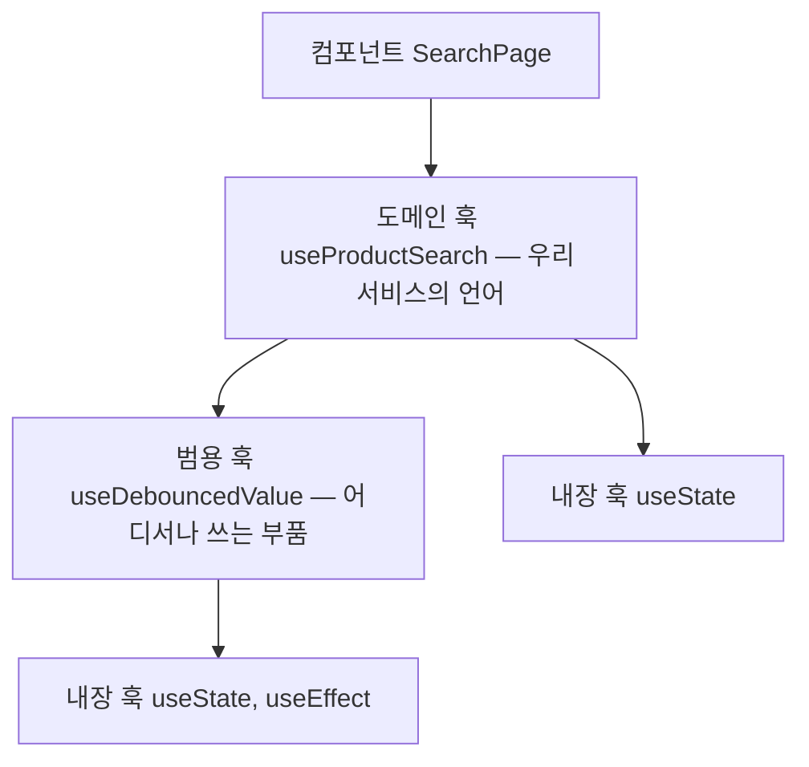

<Callout type="info">
  **이번 문서의 목표:** 커스텀 훅의 입력과 반환을 하나의 계약으로 설계하고, 작은 훅을 합성해 큰 훅을 만들며, 숨은 부작용·과한 추상화 같은 안티패턴을 코드에서 알아보고 피할 수 있다.
</Callout>

## 왜 "설계"를 따로 배우는가

03편에서 우리는 커스텀 훅이 무엇이고 언제 추출하는지를 배웠습니다 — "책임 하나가 이름으로 말해질 때 뽑는다"까지가 거기까지의 결론이었죠. 그런데 뽑기로 결정한 다음에는 전혀 다른 질문들이 기다립니다.

- 이 훅은 **무엇을 인자로 받아야** 하는가? 값? 함수? 옵션 객체?
- **무엇을 반환해야** 하는가? 배열? 객체? 값 하나?
- 훅 안에서 다른 훅을 불러도 되는가? 어디까지?
- 이 훅, 나중에 **테스트할 수 있는 모양**인가?

이 질문들에 답하는 것이 훅 **설계**입니다. 함수를 만들 줄 아는 것과 좋은 함수를 설계하는 것이 다르듯, 훅도 추출할 줄 아는 것과 잘 설계하는 것은 다른 기술입니다. 그리고 잘못 설계된 훅은 안 만든 것보다 나쁩니다 — 여러 컴포넌트가 이미 쓰고 있는 훅의 시그니처를 바꾸는 일은, 컴포넌트 하나를 고치는 일보다 훨씬 비싸기 때문입니다.

> **쉽게 말하면:** 훅을 뽑는 것이 "방을 하나 만드는 일"이라면, 훅을 설계하는 것은 "그 방의 문과 창문을 어디에 낼지 정하는 일"입니다. 문 위치가 잘못된 방은 지은 뒤에 고치기 어렵습니다.

## 1. 입력·출력 계약 — 훅의 문과 창문

### 계약이라는 관점

**계약**(contract, 콘트랙트)이란 "이 훅을 쓰려면 이것을 주고, 그러면 이것을 받는다"는 약속입니다. 계약이 잘 설계된 훅은 내부 구현을 읽지 않고 시그니처만 보고 쓸 수 있습니다. 03편에서 본 대표 예시로 계약을 읽어 봅시다.

```jsx
const { data, isLoading, error } = useFetch(url);
```

- **입력 계약**: URL 문자열 하나를 달라.
- **출력 계약**: 데이터·로딩 여부·에러, 세 가지 상태를 주겠다.

이 한 줄에 훅의 정체가 다 드러납니다. 좋은 계약의 조건을 하나씩 뜯어봅니다.

### 입력 설계 — 무엇을 받을 것인가

**원칙 1: 훅이 결정할 수 없는 것만 받는다.** 훅 안에서 알 수 있는 값을 인자로 또 받으면 계약만 넓어집니다. 반대로 사용처마다 달라지는 값 — URL, 초기값, 딜레이 시간 — 은 반드시 밖에서 받아야 합니다. 이 구분이 03편에서 말한 "책임 경계"를 시그니처에 새기는 작업입니다.

**원칙 2: 필수는 낱개 인자, 선택은 옵션 객체.** 인자가 3개를 넘어가면 호출부에서 순서를 외울 수 없습니다. 필수 값 한두 개를 앞에 두고, 나머지는 이름 있는 **옵션 객체**(options object)로 묶는 것이 관례입니다.

```jsx
// ❌ 넷째 인자가 뭔지 호출부만 보고 알 수 없다
useFetch(url, true, 3, false);

// ✅ 필수는 낱개, 선택은 이름으로
useFetch(url, { retry: 3, suspend: false });
```

**원칙 3: 함수를 받을 때는 참조 변화를 각오한다.** 훅이 콜백 함수를 인자로 받는 순간, 골치 아픈 문제가 하나 따라옵니다. 02편에서 본 대로 컴포넌트 안에서 만든 함수는 **렌더마다 새 참조**입니다. 그 함수를 훅 내부의 `useEffect` 의존성 배열에 넣으면 렌더마다 이펙트가 재실행됩니다. 흔한 해법은 두 가지입니다 — 호출자에게 `useCallback`으로 감싸 달라고 요구하거나(계약이 무거워짐), 훅 내부에서 ref에 담아 최신 함수를 참조하는 방식으로 흡수하거나(구현이 무거워짐). 어느 쪽이든 **콜백을 받는 계약은 공짜가 아니다**라는 사실을 알고 설계해야 합니다. `useMemo`/`useCallback` 자체는 10편에서 깊게 다룹니다.

### 출력 설계 — 배열인가 객체인가

React 내장 훅부터 두 진영이 있습니다. `useState`는 배열 `[value, setValue]`를, 대부분의 데이터 훅은 객체 `{ data, isLoading }`을 반환하죠. 기준은 명확합니다.

| 반환 형태 | 성질 | 맞는 경우 |
|-----------|------|----------|
| 배열 `[a, b]` | 이름을 **호출부가** 정한다 — 구조 분해에서 자유 작명 | 같은 훅을 한 컴포넌트에서 여러 번 쓰는 경우, 반환값이 1–2개인 경우 |
| 객체 `{ a, b, c }` | 이름을 **훅이** 정한다 — 순서 무관, 골라 꺼내기 가능 | 반환값이 3개 이상, 일부만 쓰는 사용처가 많은 경우 |

`useState`가 배열인 이유가 바로 첫 행입니다 — `const [name, setName] = useState('')`, `const [age, setAge] = useState(0)`처럼 한 컴포넌트에서 여러 번 쓰면서 매번 다른 이름을 붙여야 하니까요. 객체였다면 `const { value: name } = ...` 식의 이름 바꾸기를 매번 해야 했을 겁니다. 반대로 `useFetch`처럼 보통 한 번만 쓰고 반환값이 많은 훅은 객체가 맞습니다.

**원칙 4: 내부 구현을 새어 나가게 하지 않는다.** 반환값은 사용자가 필요로 하는 것만 담습니다. 내부에서 쓰는 타이머 ID, 원시 상태 setter를 그대로 노출하면, 사용자가 그것에 의존하기 시작하고 이후 내부 구현을 바꿀 수 없게 됩니다. 예를 들어 `useCounter`가 `setCount`를 그대로 반환하면 사용자는 아무 값이나 넣을 수 있지만, `increment`/`decrement`/`reset`만 반환하면 **허용된 조작만** 가능해집니다. 좁은 출력 계약이 곧 훅의 불변 규칙을 지키는 힘입니다.

<CodePlayground
  template="react"
  activeFile="/App.js"
  label="출력 계약 좁히기 — setCount 대신 의미 있는 조작만 노출한 useCounter"
  files={{
    '/App.js': `import { useState } from "react";

// 출력 계약: 값 + 허용된 조작 3가지. setCount는 노출하지 않는다.
function useCounter(initial, options) {
  const step = (options && options.step) || 1;   // 선택 입력은 옵션 객체로
  const [count, setCount] = useState(initial);

  const increment = () => setCount((c) => c + step);
  const decrement = () => setCount((c) => Math.max(0, c - step)); // 음수 금지 규칙
  const reset = () => setCount(initial);

  return { count, increment, decrement, reset };
}

export default function App() {
  // 같은 훅, 다른 계약 인자 — 재사용의 실감
  const cart = useCounter(1);
  const volume = useCounter(50, { step: 10 });

  return (
    <div>
      <h3>장바구니 수량: {cart.count}</h3>
      <button onClick={cart.increment}>+1</button>
      <button onClick={cart.decrement}>-1</button>
      <button onClick={cart.reset}>리셋</button>

      <h3>볼륨: {volume.count}</h3>
      <button onClick={volume.increment}>+10</button>
      <button onClick={volume.decrement}>-10</button>
    </div>
  );
}`,
  }}
/>

setCount를 감춘 덕분에 "음수가 되지 않는다"는 규칙을 훅이 **강제**할 수 있게 됐습니다. 계약이 좁을수록 훅은 자기 규칙을 지킬 수 있습니다.

## 2. 훅 합성 — 작은 훅으로 큰 훅 만들기

### 훅도 레고다

01편에서 컴포넌트를 레고처럼 조립했듯, 훅도 **훅 안에서 다른 훅을 호출**해 조립할 수 있습니다. 커스텀 훅도 결국 훅 규칙(03편)을 지키는 함수일 뿐이므로, 내장 훅이든 다른 커스텀 훅이든 자유롭게 부를 수 있습니다. 이것을 **훅 합성**(hook composition)이라고 부릅니다.

실전 예: "입력창에 타이핑을 멈추고 0.5초 지나면 검색"이라는 흔한 요구를 봅시다. 여기엔 두 가지 독립된 로직이 숨어 있습니다 — ① 값이 바뀌고 일정 시간 지난 뒤의 값만 취하는 **디바운스**(debounce — 연타를 무시하고 마지막 신호만 받는 기법), ② 그 값으로 목록을 필터링하는 로직.

```jsx
// 부품 1: 어떤 값이든 디바운스한다 — 검색을 모른다
function useDebouncedValue(value, delay) {
  const [debounced, setDebounced] = useState(value);
  useEffect(() => {
    const id = setTimeout(() => setDebounced(value), delay);
    return () => clearTimeout(id); // 값이 또 바뀌면 이전 타이머 취소
  }, [value, delay]);
  return debounced;
}

// 조립: 디바운스 훅 + 필터 로직 = 검색 훅
function useProductSearch(products) {
  const [keyword, setKeyword] = useState('');
  const debouncedKeyword = useDebouncedValue(keyword, 500); // ← 합성!
  const results = products.filter((p) => p.name.includes(debouncedKeyword));
  return { keyword, setKeyword, results };
}
```

`useDebouncedValue`는 검색을 전혀 모릅니다 — 자동 저장, 창 크기 감지 등 어디든 재사용됩니다. `useProductSearch`는 디바운스가 **어떻게** 구현됐는지 모릅니다. 01편의 결합도 이야기가 훅 세계에서 그대로 반복되는 것입니다.

### 합성의 방향 — 범용이 아래, 도메인이 위

합성에는 자연스러운 층이 생깁니다.



- 아래층: **범용 훅** — `useDebouncedValue`, `useToggle`, `useLocalStorage`처럼 도메인을 모르는 부품.
- 위층: **도메인 훅** — `useProductSearch`, `useCart`처럼 우리 서비스의 개념을 이름에 담은 훅.
- 컴포넌트는 가급적 **도메인 훅 하나**만 부르게 하면, 컴포넌트가 읽기 쉬워집니다.

> **쉽게 말하면:** 범용 훅은 나사와 볼트, 도메인 훅은 그것으로 조립한 서랍장입니다. 방(컴포넌트)에는 완성된 서랍장을 들여놓지, 나사 봉지를 흩어 놓지 않습니다.

<Callout type="warning">
  **자주 틀리는 점:** 합성이 좋다고 층을 무한정 쌓으면 안 됩니다. 훅 A가 B를 부르고 B가 C를, C가 D를 부르는 4층 구조가 되면, 버그 하나를 추적할 때 네 파일을 넘나들어야 합니다. 실무 감각으로는 **도메인 훅 1층 + 범용 훅 1층**, 깊어도 3층 이내가 읽기 좋은 한계선입니다.
</Callout>

## 3. 테스트하기 쉬운 경계

### 테스트 프레임워크 없이도 판단할 수 있다

이 과목은 테스트 프레임워크 본론을 다루지 않지만, "**테스트하기 쉬운 모양인가**"는 프레임워크 없이도 판단할 수 있는 설계 품질 지표입니다. 핵심 질문은 하나입니다 — **"이 훅을 실행하는 데 무엇이 필요한가?"**

테스트하기 어려운 훅의 전형은 이렇습니다.

```jsx
// ❌ 테스트하려면: 실제 서버 + 브라우저 저장소 + 현재 시각까지 필요
function useTodayOrders() {
  const [orders, setOrders] = useState([]);
  useEffect(() => {
    const token = localStorage.getItem('token');        // 브라우저 저장소에 의존
    const today = new Date().toISOString().slice(0, 10); // 실행 시각에 의존
    fetch('https://api.shop.com/orders?date=' + today, { // 실제 서버에 의존
      headers: { Authorization: token },
    }).then((r) => r.json()).then(setOrders);
  }, []);
  return orders;
}
```

이 훅의 결과는 서버 상태, 브라우저 저장소, 오늘 날짜에 따라 매번 달라집니다. 같은 입력에 같은 출력이 보장되지 않으니 검증할 방법이 없죠. 문제의 원인은 훅이 **외부 세계를 직접 움켜쥐고 있다**는 것입니다.

### 처방 — 의존을 계약으로 끌어올리기

외부 세계와 닿는 지점을 인자로 받으면, 테스트에서는 가짜를 넣고 실제 앱에서는 진짜를 넣을 수 있습니다.

```jsx
// ✅ 외부 의존을 전부 입력 계약으로: 날짜와 토큰은 값으로 받는다
function useOrders(date, token) {
  const [orders, setOrders] = useState([]);
  useEffect(() => {
    fetch('https://api.shop.com/orders?date=' + date, {
      headers: { Authorization: token },
    }).then((r) => r.json()).then(setOrders);
  }, [date, token]);
  return orders;
}
```

날짜·토큰이 계약으로 올라오자 "오늘"과 "저장소"라는 숨은 의존이 사라졌습니다. 남은 fetch 의존도 필요하면 같은 방식으로 — 요청 함수 자체를 인자로 받아 — 밀어낼 수 있습니다. 그리고 이렇게 하고 보면 또 하나가 보입니다: 순수 계산(응답 가공, 필터링)은 훅 밖의 **일반 함수**로 빼는 게 최선입니다. 일반 함수는 React 없이도 그냥 호출해서 검증할 수 있으니까요.

정리하면 테스트 가능성의 층위는 이렇습니다.

| 층 | 내용 | 테스트 난이도 |
|----|------|-------------|
| 순수 함수 | 가공·계산·검증 로직 | 쉬움 — 그냥 호출하면 됨 |
| 훅 | 상태·이펙트 + 순수 함수 호출 | 중간 — 렌더 환경 필요 |
| 컴포넌트 | 훅 호출 + JSX | 어려움 — 화면까지 검증 |

**로직을 가능한 한 위 표의 윗줄로 밀어 올리는 것**, 이것이 테스트하기 쉬운 경계의 요체입니다. 12편의 headless 패턴은 이 원칙을 컴포넌트 전체 규모로 확장한 것입니다.

## 4. 안티패턴 — 만들지 말았어야 할 훅들

이제 반대편을 봅니다. 실무 코드 리뷰에서 반복적으로 만나는 훅 안티패턴 네 가지입니다.

### 안티패턴 1 — 숨은 부작용

**부작용**(side effect, 사이드 이펙트)이란 함수가 반환값 계산 외에 바깥세상을 건드리는 일 — 네트워크 요청, 저장소 쓰기, 전역 변수 수정 — 을 말합니다. 부작용 자체는 죄가 아닙니다. 문제는 **이름이 약속하지 않은 부작용**입니다.

```jsx
// ❌ 이름은 "읽기"인데 몰래 "쓰기"까지 한다
function useUserProfile(userId) {
  const { data } = useFetch('/api/users/' + userId);
  useEffect(() => {
    if (data) {
      localStorage.setItem('lastViewedUser', userId);  // 몰래 저장
      analytics.track('profile_view', { userId });     // 몰래 전송
    }
  }, [data, userId]);
  return data;
}
```

이 훅을 쓴 사람은 프로필을 "읽었을" 뿐인데, 저장소가 바뀌고 분석 이벤트가 날아갑니다. 최악의 순간은 이 훅을 **다른 화면에서 재사용할 때** 옵니다 — 관리자 화면에서 사용자 목록을 그리려고 이 훅을 썼더니, 방문 기록이 오염되고 가짜 조회 이벤트가 쌓입니다. 훅은 재사용을 위해 만드는 물건인데, 숨은 부작용은 재사용되는 순간 터지는 지뢰입니다.

처방은 단순합니다 — **부작용을 이름에 드러내거나, 분리하거나.** `useUserProfile`은 읽기만 하고, 기록·추적은 `useTrackProfileView`처럼 이름이 부작용을 선언하는 별도 훅으로 나눠, 필요한 화면만 명시적으로 호출하게 합니다.

### 안티패턴 2 — 과한 추상화

두 사용처가 조금 다르다는 이유로 옵션을 하나씩 추가하다 보면 이런 괴물이 태어납니다.

```jsx
// ❌ 모든 것을 다 하려는 훅 — 아무것도 잘 못하게 된다
useDataManager(url, {
  method, cache, retry, retryDelay, transform, onSuccess,
  onError, pollingInterval, dependencies, skip, debounce, ...
});
```

01편에서 본 **props 폭발**의 훅 버전입니다. 옵션 12개짜리 훅은 어떤 조합이 함께 쓰일 수 있는지 아무도 모르고, 옵션 하나를 고치면 12개 조합 전부를 의심해야 합니다. 신호는 명확합니다 — **옵션끼리 서로를 모르는데 한 훅에 산다면, 원래 여러 훅이었어야 합니다.** 처방은 합성으로의 회귀: `useFetch` + `usePolling` + `useDebouncedValue`처럼 각자 한 가지를 잘하는 훅으로 쪼개고, 필요한 조합은 사용처(또는 도메인 훅)가 조립합니다.

과한 추상화의 또 다른 얼굴은 **너무 이른 추상화**입니다. 사용처가 하나뿐인데 "나중에 재사용할 것 같아서" 범용 옵션을 미리 파 두는 것 — 03편의 추출 기준을 다시 떠올리세요. 두 번째 사용처가 나타나기 전의 범용화는 대개 미래를 잘못 예측합니다.

### 안티패턴 3 — 상태를 공유한다고 착각하기

03편에서 확립한 사실 — 커스텀 훅은 **로직을 공유하지, 상태를 공유하지 않는다** — 을 위반하는 설계입니다.

```jsx
// ❌ 의도: 어디서든 useCart()를 부르면 같은 장바구니이길 기대
function Header() { const { items } = useCart(); ... }   // 장바구니 A
function CartPage() { const { items } = useCart(); ... } // 장바구니 B (다른 상태!)
```

훅 호출은 호출한 컴포넌트마다 **독립된 상태**를 만듭니다. 두 컴포넌트의 items는 서로 남남이라, 헤더 배지와 장바구니 페이지가 서로 다른 수량을 보여주는 버그가 됩니다. 상태 자체를 공유하려면 훅이 아니라 4편의 지도에서 고른 도구 — Context 또는 전역 스토어(06~07편) — 가 필요합니다. 훅은 그 위에 얹는 로직 포장지일 수는 있어도, 공유 저장소일 수는 없습니다.

### 안티패턴 4 — 훅일 이유가 없는 훅

```jsx
// ❌ 상태도 이펙트도 없다 — 이건 그냥 함수다
function useFormatPrice(price) {
  return price.toLocaleString('ko-KR') + '원';
}
```

내장 훅을 하나도 쓰지 않는 함수에 use를 붙이면 손해만 생깁니다 — 훅 규칙(최상위에서만 호출, 조건문 금지)이라는 **불필요한 제약**이 걸리고, 읽는 사람은 "무슨 상태가 있나?" 하고 내부를 열어보게 됩니다. `formatPrice`라는 일반 함수로 두면 어디서든, 조건문 안에서든, React 밖에서든 자유롭게 쓸 수 있습니다. **use 접두사는 "나는 내장 훅에 닿아 있다"는 선언**일 때만 붙입니다.

### 안티패턴 감지 체크리스트

코드 리뷰 때 이 순서로 물으면 대부분 걸러집니다.

1. 이름이 약속하지 않은 부작용이 안에 있는가? → **숨은 부작용**
2. 서로 무관한 옵션이 5개 이상인가? 사용처가 아직 하나뿐인가? → **과한·이른 추상화**
3. 이 훅으로 상태가 "공유"된다고 기대하는 코드가 있는가? → **로직 공유 착각**
4. 내장 훅을 하나도 안 쓰는가? → **그냥 함수로**

## 핵심 정리

- 훅 설계는 **입력·출력 계약** 설계다 — 훅이 결정할 수 없는 것만 받고(필수는 낱개·선택은 옵션 객체), 반환은 배열(호출부 작명)과 객체(다수 반환·골라 쓰기) 중 성격에 맞게 고르며, 내부 구현과 원시 setter는 노출하지 않는다.
- **훅 합성**으로 범용 훅(부품) 위에 도메인 훅(조립품)을 쌓는다 — 컴포넌트는 도메인 훅 하나만 부르는 것이 이상적이고, 층은 3층 이내로.
- 테스트 가능성은 "이 훅을 실행하는 데 무엇이 필요한가"로 판단한다 — 외부 의존은 계약으로 끌어올리고, 순수 계산은 훅 밖 일반 함수로 밀어 올린다.
- 4대 안티패턴: 이름이 약속하지 않은 **숨은 부작용**, 옵션 폭발의 **과한 추상화**, 훅으로 상태가 공유된다는 **착각**, 내장 훅 없이 use를 붙인 **가짜 훅**.
- 판단이 애매하면 덜 추상화하는 쪽으로 — 중복 두 번은 견딜 만하지만, 잘못된 추상화는 모든 사용처를 인질로 잡는다.

## 마무리 복습

<Quiz
  questionNumber={1}
  question="훅의 입력 계약 설계 원칙으로 옳은 것은?"
  options={['가능한 모든 값을 인자로 받아 유연성을 극대화한다', '훅이 스스로 결정할 수 없는 값만 받고, 선택적 값은 옵션 객체로 묶는다', '인자는 반드시 하나만 받아야 한다', '함수는 인자로 받을 수 없다']}
  correctAnswer={2}
  explanation="사용처마다 달라지는 값만 인자로 받고, 필수는 낱개·선택은 옵션 객체로 정리하는 것이 계약을 읽기 쉽게 만든다. 함수도 받을 수 있지만 참조 변화 비용을 각오해야 한다."
  optionExplanations={['불필요한 인자는 계약만 넓혀 이해 비용을 높인다', '정답 — 책임 경계를 시그니처에 새기는 원칙이다', '개수 제한 규칙은 없다 — 다만 3개를 넘으면 옵션 객체를 검토한다', '콜백을 받는 계약은 가능하며, 다만 참조 동일성 문제가 따라온다']}
/>

<Quiz
  questionNumber={2}
  question="useState가 객체가 아니라 배열을 반환하는 이유로 가장 알맞은 것은?"
  options={['배열이 객체보다 항상 빠르기 때문', '한 컴포넌트에서 여러 번 호출하며 호출부가 매번 다른 이름을 붙일 수 있어야 하기 때문', '객체 반환은 훅 규칙 위반이기 때문', '배열은 구조 분해가 불가능하기 때문']}
  correctAnswer={2}
  explanation="배열 반환은 구조 분해 시 이름을 호출부가 자유롭게 정할 수 있어, 같은 훅을 여러 번 쓰는 useState에 적합하다. 반환값이 많고 골라 쓰는 훅은 객체가 맞다."
  optionExplanations={['성능 차이는 반환 형태 선택의 기준이 아니다', '정답 — name과 setName, age와 setAge처럼 자유 작명이 필요하다', '객체 반환 훅은 매우 흔하며 규칙 위반이 아니다', '배열도 객체도 구조 분해가 가능하다 — 차이는 작명의 주체다']}
/>

<Quiz
  questionNumber={3}
  question="useCounter가 setCount 대신 increment·decrement·reset만 반환하도록 설계하는 이유는?"
  options={['함수 세 개가 setter 하나보다 메모리를 적게 쓰기 때문', '허용된 조작만 노출해 음수 금지 같은 훅의 규칙을 강제할 수 있기 때문', 'setCount는 컴포넌트에서 호출하면 에러가 나기 때문', 'React가 setter 반환을 금지하기 때문']}
  correctAnswer={2}
  explanation="원시 setter를 감추고 의미 있는 조작만 노출하면 사용자가 규칙을 우회할 수 없어, 훅이 자신의 불변 규칙을 지킬 수 있다. 좁은 출력 계약의 힘이다."
  optionExplanations={['오히려 함수가 늘어난다 — 이득은 메모리가 아니라 규칙 강제다', '정답 — 계약이 좁을수록 훅이 자기 규칙을 지킨다', 'setter 반환도 동작은 한다 — 설계 품질의 문제다', '금지 규정은 없다 — 설계상의 선택이다']}
/>

<Quiz
  questionNumber={4}
  question="훅 합성 구조에서 컴포넌트가 가급적 도메인 훅 하나만 호출하게 하는 이유는?"
  options={['훅은 컴포넌트당 한 번만 호출할 수 있기 때문', '범용 부품 조립을 도메인 훅에 맡기면 컴포넌트가 서비스의 언어로 읽히기 때문', '범용 훅은 컴포넌트에서 직접 호출하면 에러가 나기 때문', '도메인 훅이 범용 훅보다 항상 빠르기 때문']}
  correctAnswer={2}
  explanation="나사와 볼트의 조립은 도메인 훅이 맡고, 컴포넌트는 완성된 서랍장 하나를 들여놓는 구조가 읽기 쉽다. 강제 규칙이 아니라 가독성을 위한 설계 지향이다."
  optionExplanations={['훅 호출 횟수 제한은 없다', '정답 — 컴포넌트에서 저수준 부품이 안 보일수록 의도가 잘 읽힌다', '범용 훅 직접 호출도 완전히 유효하다', '성능 차이는 없다 — 구조와 가독성의 문제다']}
/>

<Quiz
  questionNumber={5}
  question="테스트하기 어려운 훅의 특징과 그 처방으로 옳은 것은?"
  options={['반환값이 많은 훅 — 반환을 배열로 바꾼다', '현재 시각·저장소·서버를 내부에서 직접 움켜쥔 훅 — 그 의존을 인자로 끌어올린다', '내장 훅을 여러 개 쓰는 훅 — 내장 훅을 하나로 줄인다', '이름이 긴 훅 — 이름을 줄인다']}
  correctAnswer={2}
  explanation="외부 세계에 직접 닿아 있으면 같은 입력에 같은 출력이 보장되지 않는다. 외부 의존을 입력 계약으로 올리면 테스트에서 가짜를 주입할 수 있게 된다."
  optionExplanations={['반환 형태는 테스트 가능성과 무관하다', '정답 — 의존을 계약으로 끌어올리는 것이 핵심 처방이다', '내장 훅 개수 자체는 문제가 아니다', '이름 길이는 테스트 가능성과 무관하다']}
/>

<Quiz
  questionNumber={6}
  question="프로필을 읽는 useUserProfile 안에서 몰래 localStorage 기록과 분석 이벤트 전송을 하는 설계가 위험한 이유는?"
  options={['localStorage는 훅 안에서 금지되어 있기 때문', '이름이 약속하지 않은 부작용이라, 다른 화면에서 재사용되는 순간 방문 기록·이벤트가 오염되기 때문', '분석 이벤트는 컴포넌트에서만 보낼 수 있기 때문', '부작용은 React에서 항상 금지이기 때문']}
  correctAnswer={2}
  explanation="훅은 재사용을 위한 도구인데, 이름에 없는 부작용은 재사용되는 순간 의도치 않게 함께 실행된다. 부작용은 이름에 드러내거나 별도 훅으로 분리해야 한다."
  optionExplanations={['localStorage 사용 자체는 금지가 아니다 — 숨겨진 것이 문제다', '정답 — 숨은 부작용은 재사용 시 터지는 지뢰다', '이벤트 전송 위치에 그런 제한은 없다', '부작용 자체는 필요한 것이며, 문제는 이름과의 불일치다']}
/>

<Quiz
  questionNumber={7}
  question="Header와 CartPage가 각각 useCart를 호출했는데 두 화면의 장바구니 수량이 다르게 표시된다. 원인은?"
  options={['훅 이름에 use를 붙이지 않아서', '커스텀 훅은 호출마다 독립된 상태를 만들므로 두 컴포넌트의 상태가 서로 남남이라서', 'CartPage가 Header보다 늦게 렌더링되어서', 'useCart 안에서 useState를 두 번 써서']}
  correctAnswer={2}
  explanation="커스텀 훅은 로직을 공유할 뿐 상태를 공유하지 않는다. 상태 자체를 공유하려면 Context나 전역 스토어가 필요하고, 훅은 그 위의 포장지 역할만 할 수 있다."
  optionExplanations={['이름 규칙과는 무관한 문제다', '정답 — 로직 공유와 상태 공유를 혼동한 대표 사례다', '렌더 순서는 상태 분리의 원인이 아니다', 'useState 개수와 무관하다 — 호출 위치마다 독립이라는 성질이 원인이다']}
/>

<Quiz
  questionNumber={8}
  question="내장 훅을 전혀 쓰지 않는 가격 포맷 함수에 use 접두사를 붙여 useFormatPrice로 만들면 생기는 손해는?"
  options={['실행 속도가 크게 느려진다', '훅 규칙이라는 불필요한 제약이 걸리고, 읽는 사람이 없는 상태를 찾게 만든다', 'React 빌드가 실패한다', '다른 훅과 이름이 충돌한다']}
  correctAnswer={2}
  explanation="use 접두사는 내장 훅에 닿아 있다는 선언이다. 상태도 이펙트도 없는 함수에 붙이면 조건문 호출 금지 등 훅 제약만 떠안고, 일반 함수의 자유를 잃는다."
  optionExplanations={['성능 저하는 사실상 없다 — 문제는 제약과 오해다', '정답 — 일반 함수로 두면 어디서든 자유롭게 쓸 수 있다', '빌드는 통과한다 — 설계 품질의 문제다', '이름 충돌은 접두사와 무관한 별개 문제다']}
/>

## 참고 자료

- [React 공식 문서 - Reusing Logic with Custom Hooks](https://react.dev/learn/reusing-logic-with-custom-hooks)
- [React 레거시 문서 - Building Your Own Hooks](https://legacy.reactjs.org/docs/hooks-custom.html)
