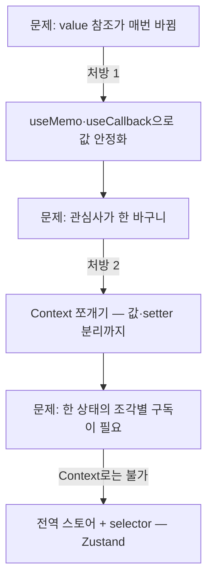

<Callout type="info">
  **이번 문서의 목표:** Context의 value가 바뀔 때 리렌더가 어디까지 퍼지는지 정확히 추적하고, 값 안정화·Context 쪼개기로 함정을 피하며, Zustand 스토어와 selector로 "필요한 조각만 구독"하는 전역 상태를 설계할 수 있다.
</Callout>

## 왜 심화가 필요한가 — "Context 넣었더니 앱이 느려졌어요"

04편에서 우리는 지도를 그렸습니다 — 넓고 느린 값은 Context, 넓고 빠른 값은 전역 스토어. 이번 편은 그 지도의 "왜"를 코드 수준에서 해부합니다. 출발점은 실무에서 정말 자주 듣는 하소연입니다.

> "props 드릴링이 싫어서 상태를 전부 Context로 옮겼더니, 글자 하나 입력할 때마다 화면 전체가 다시 그려져요."

이 증상의 원인은 두 겹입니다 — Context의 **구독 갱신 규칙**과, React의 **값 비교 방식**. 둘을 순서대로 해부한 뒤, 해결책의 끝에서 Zustand를 만나게 됩니다.

## 1. Context 리렌더의 정확한 규칙

### 규칙부터 정확히

> **쉽게 말하면:** Provider의 value가 "다른 값"이 되면, 그 Context를 `useContext`로 읽는 컴포넌트는 **전원, 예외 없이** 다시 렌더링됩니다. 중간에 어떤 최적화가 있어도요.

여기서 정밀하게 알아야 할 포인트가 세 가지입니다.

**첫째, 리렌더 대상은 "구독자"이지 "Provider 아래 전체"가 아닙니다.** 흔한 오해와 달리, Provider 아래에 있어도 `useContext`를 호출하지 않은 컴포넌트는 value 변경만으로 다시 렌더링되지 않습니다. (물론 구독자의 자식이라면 02편의 규칙 — 부모가 렌더되면 자식도 렌더 — 에 따라 딸려서 렌더됩니다.)

**둘째, 구독자는 `React.memo`로도 못 피합니다.** `React.memo`는 props 비교로 렌더를 건너뛰는 도구인데(10편), Context 값은 props가 아니라 **옆문으로 직접** 들어옵니다. 그래서 memo로 감싼 컴포넌트도 자기가 구독한 Context가 바뀌면 무조건 렌더됩니다. 이건 버그가 아니라 설계입니다 — 구독했으면 새 값을 받아야 하니까요.

**셋째, "다른 값"의 판정은 `Object.is` 비교입니다.** `Object.is`(오브젝트 이즈)는 `===`와 거의 같은 엄격한 비교로, 객체라면 **내용이 아니라 참조**를 봅니다. 02편에서 다룬 참조 동일성이 여기서 폭탄이 됩니다 — 내용이 같아도 새로 만든 객체는 "다른 값"입니다.

### 폭탄이 터지는 코드

세 규칙을 합치면, 아주 흔한 코드가 왜 문제인지 보입니다.

```jsx
function App() {
  const [user, setUser] = useState(null);
  const [theme, setTheme] = useState('light');

  return (
    // ❌ 렌더마다 새 객체 리터럴 — value의 참조가 매번 바뀐다
    <AppContext.Provider value={{ user, setUser, theme, setTheme }}>
      <Page />
    </AppContext.Provider>
  );
}
```

`{ user, setUser, theme, setTheme }`는 App이 렌더될 때마다 **새로 만들어지는 객체**입니다. user도 theme도 안 바뀌었는데 App이 다른 이유(예: 다른 로컬 상태)로 렌더되기만 해도, value의 참조가 바뀌고 → `Object.is` 판정상 "다른 값"이고 → **구독자 전원이 다시 렌더링**됩니다. 이것이 **값 안정성**(value stability) 문제 — 내용은 그대로인데 참조가 매번 흔들리는 상태입니다.

직접 눈으로 확인해 봅시다. 아래 실습기에서 "무관한 상태 변경" 버튼을 눌러 보세요 — 테마는 그대로인데 테마 구독자가 다시 렌더링되는 것을 콘솔에서 볼 수 있습니다.

<CodePlayground
  template="react"
  activeFile="/App.js"
  showConsole
  label="값 불안정 체험 — 무관한 상태가 바뀌어도 구독자가 리렌더된다"
  files={{
    '/App.js': `import { createContext, useContext, useState } from "react";

const ThemeContext = createContext(null);

function ThemePanel() {
  const ctx = useContext(ThemeContext);
  console.log("ThemePanel 렌더!"); // 언제 다시 그려지는지 관찰
  return (
    <div style={{ padding: 8, background: ctx.theme === "dark" ? "#333" : "#eee", color: ctx.theme === "dark" ? "#fff" : "#000" }}>
      현재 테마: {ctx.theme}
      <button onClick={ctx.toggle} style={{ marginLeft: 8 }}>테마 전환</button>
    </div>
  );
}

export default function App() {
  const [theme, setTheme] = useState("light");
  const [count, setCount] = useState(0); // 테마와 무관한 상태

  const toggle = () => setTheme((t) => (t === "light" ? "dark" : "light"));

  return (
    // 렌더마다 새 객체 → count만 바뀌어도 ThemePanel이 리렌더된다
    <ThemeContext.Provider value={{ theme, toggle }}>
      <button onClick={() => setCount(count + 1)}>무관한 상태 변경 ({count})</button>
      <ThemePanel />
    </ThemeContext.Provider>
  );
}`,
  }}
/>

콘솔을 보면 "무관한 상태 변경"을 누를 때마다 ThemePanel 렌더가 찍힙니다. 구독자가 지금은 하나라 티가 안 나지만, 이것이 구독자 50개짜리 실제 앱이라면 — 그리고 value가 타이핑마다 바뀌는 값을 담고 있다면 — 04편의 하소연이 그대로 재현됩니다.

## 2. 처방 1 — value 안정화

첫 처방은 "내용이 안 바뀌면 참조도 안 바뀌게" 만드는 것입니다. `useMemo`(값 기억)와 `useCallback`(함수 기억)으로 value를 고정합니다 — 두 훅의 완전한 해부는 10편에서 하고, 여기서는 "의존성이 안 바뀌면 이전 참조를 그대로 돌려준다"는 계약만 쓰면 됩니다.

```jsx
function App() {
  const [theme, setTheme] = useState('light');
  const [count, setCount] = useState(0);

  // 함수 참조 고정: 의존성이 없으니 처음 만든 함수를 계속 재사용
  const toggle = useCallback(
    () => setTheme((t) => (t === 'light' ? 'dark' : 'light')),
    []
  );

  // 객체 참조 고정: theme·toggle이 그대로면 같은 객체를 돌려준다
  const value = useMemo(() => ({ theme, toggle }), [theme, toggle]);

  return (
    <ThemeContext.Provider value={value}>
      {/* 이제 count가 바뀌어도 구독자는 조용하다 */}
    </ThemeContext.Provider>
  );
}
```

이제 count가 바뀌어 App이 렌더되어도, value는 이전과 **같은 참조**이므로 구독자는 렌더되지 않습니다. 이것이 **값 안정성 확보**이고, Provider를 만들 때의 기본기입니다.

한 가지 구조적 팁 — Provider를 전용 컴포넌트로 분리하면 안정화 코드가 한 곳에 모이고, App은 깨끗해집니다.

```jsx
function ThemeProvider({ children }) {
  const [theme, setTheme] = useState('light');
  const toggle = useCallback(() => setTheme((t) => (t === 'light' ? 'dark' : 'light')), []);
  const value = useMemo(() => ({ theme, toggle }), [theme, toggle]);
  return <ThemeContext.Provider value={value}>{children}</ThemeContext.Provider>;
}
```

여기서 01편의 합성이 또 등장합니다 — children 덕분에 ThemeProvider의 상태가 바뀌어도, children으로 받은 JSX는 부모(App)가 만든 **그대로의 참조**라서 React가 렌더를 건너뛸 수 있습니다. 합성이 곧 성능 최적화가 되는 지점입니다.

<Callout type="warning">
  **자주 틀리는 점:** 값 안정화는 "무관한 렌더가 구독자에게 번지는 것"만 막습니다. **value가 정말로 바뀔 때 구독자 전원이 렌더되는 것**은 안정화로 못 막습니다 — 그건 Context의 본질입니다. theme만 쓰는 컴포넌트가 user 변경에 반응하는 문제는 다음 처방이 필요합니다.
</Callout>

## 3. 처방 2 — Context 쪼개기

### 한 바구니가 문제다

value에 여러 관심사가 함께 담기면, 어느 하나만 바뀌어도 전부를 구독하는 셈이 됩니다.

```jsx
// ❌ user만 바뀌어도 theme 구독자까지 전원 리렌더
<AppContext.Provider value={{ user, setUser, theme, toggle }}>
```

처방은 **바뀌는 주기가 다른 값을 다른 Context로 나누는 것**입니다.

```jsx
// ✅ 관심사별로 채널 분리
<UserContext.Provider value={userValue}>
  <ThemeContext.Provider value={themeValue}>
    <Page />
  </ThemeContext.Provider>
</UserContext.Provider>
```

이제 theme만 쓰는 컴포넌트는 `useContext(ThemeContext)`만 호출하므로, user가 바뀌어도 조용합니다. 방송 비유로 돌아가면 — 뉴스와 음악을 한 주파수로 내보내지 말고, 채널을 나눠서 각자 원하는 방송만 듣게 하는 것입니다.

### 한 단계 더 — 값과 setter의 분리

쪼개기의 고급형으로, **읽는 쪽과 바꾸는 쪽을 분리**하는 패턴이 있습니다. "테마 전환 버튼"은 toggle 함수만 필요하지 현재 테마 값은 필요 없습니다. 그런데 값과 함수가 한 Context에 있으면, 버튼도 theme 변경 때마다 리렌더됩니다.

```jsx
const ThemeValueContext = createContext('light');   // 값 채널 — theme이 바뀌면 갱신
const ThemeToggleContext = createContext(null);      // 조작 채널 — toggle은 useCallback으로 고정 → 갱신 없음

function ToggleButton() {
  const toggle = useContext(ThemeToggleContext); // 값 채널은 구독 안 함
  return <button onClick={toggle}>전환</button>;  // theme이 바뀌어도 리렌더 없음
}
```

setter·액션 함수는 안정화해 두면 사실상 영원히 안 바뀌는 값이므로, 조작 채널 구독자는 **한 번 렌더된 뒤 다시는 그 Context 때문에 렌더되지 않습니다.**

### 쪼개기의 한계 — 여기까지가 Context의 체급

그런데 이 길의 끝을 상상해 봅시다. 장바구니 상태를 Context로 관리하는데, 배지는 수량만, 목록은 항목만, 결제는 합계만 필요하다면? 쪼개기 논리대로면 CountContext, ItemsContext, TotalContext... 게다가 세 값은 한 상태에서 파생되는 값이라 애초에 따로 놀 수도 없습니다. Provider는 탑처럼 쌓이고(일명 Provider 지옥), 상태 갱신 로직은 여전히 우리가 useState·useReducer로 직접 엮어야 합니다.

요구사항의 정체는 이것입니다 — **"상태는 하나로 두되, 컴포넌트마다 필요한 조각만 골라 구독하고 싶다."** Context에는 이 "골라 구독"(selector) 기능이 없습니다. 이 지점이 Context의 체급 한계이고, 전역 스토어가 등판하는 이유입니다.



## 4. Zustand — 스토어와 selector

### 첫 스토어

Zustand(주스탄트)는 "작고 빠르고 확장 가능한" 것을 내세우는 전역 상태 라이브러리입니다. `npm install zustand` 하나로 설치하고, 보일러플레이트(boilerplate — 반복적으로 써야 하는 틀 코드)가 거의 없습니다. 외부 패키지이므로 이 편의 Zustand 코드는 정적 예제로 보여줍니다 — 로컬 프로젝트에서 직접 따라 해 보세요.

```jsx
// store/cartStore.js
import { create } from 'zustand';

export const useCartStore = create((set) => ({
  // 상태
  items: [],

  // 액션 — 상태를 바꾸는 함수도 스토어 안에 함께 정의
  addItem: (product) =>
    set((state) => ({ items: [...state.items, product] })),
  removeItem: (id) =>
    set((state) => ({ items: state.items.filter((item) => item.id !== id) })),
  clear: () => set({ items: [] }),
}));
```

구조를 해부하면:

- `create(...)`는 **스토어를 만들고, 그 스토어를 구독하는 훅을 반환**합니다. 반환값이 훅이라서 이름을 use로 시작하게 짓습니다.
- 인자로 넘긴 함수가 스토어의 **초기 내용**을 정의합니다 — 상태(items)와 액션(addItem 등)이 한 객체에 삽니다. 04편에서 말한 "운송 수단이 아니라 창고" — 값을 바꾸는 로직까지 창고 안에 있습니다.
- `set`이 상태 갱신 도구입니다. `set((state) => ({ ... }))` 형태로 이전 상태를 받아 **바뀐 조각만 담은 객체**를 반환하면, Zustand가 기존 상태에 병합(merge)해 줍니다. `useState`처럼 전체를 갈아 끼우는 게 아니라, 반환한 키만 덮어씁니다.
- Provider가 **없습니다.** 스토어는 컴포넌트 트리 밖의 모듈 스코프에 살아 있으므로, 트리를 감쌀 필요 자체가 없습니다.

불변성 규칙은 여전합니다 — `state.items.push(product)`처럼 기존 배열을 직접 수정하면 참조가 그대로라 Zustand가 변경을 감지하지 못합니다. 스프레드로 **새 배열·새 객체**를 만드는 습관은 useState 때와 동일합니다.

### selector — 이 편의 심장

컴포넌트에서 스토어를 읽는 방법이 승부처입니다.

```jsx
// ❌ 스토어 전체를 구독 — 어떤 조각이 바뀌어도 리렌더
function CartBadge() {
  const store = useCartStore();
  return <span>{store.items.length}</span>;
}

// ✅ selector로 필요한 조각만 구독
function CartBadge() {
  const count = useCartStore((state) => state.items.length);
  return <span>{count}</span>;
}
```

`useCartStore((state) => state.items.length)`에 넘긴 함수가 **selector**(셀렉터, 선택기)입니다. 동작 원리는 이렇습니다.

1. 스토어의 상태가 바뀔 때마다, Zustand는 각 구독자의 selector를 **다시 실행**합니다.
2. selector의 **반환값**을 이전 반환값과 `Object.is`로 비교합니다.
3. **다를 때만** 그 컴포넌트를 리렌더합니다.

CartBadge의 selector는 `items.length`라는 숫자를 반환합니다. 장바구니에 담긴 상품의 이름이 수정되어 items 배열이 새로 만들어져도, 길이가 3에서 3이면 반환값이 같으므로 배지는 **조용합니다**. Context에서는 구조적으로 불가능했던 "한 상태, 조각별 구독"이 selector 한 줄로 해결된 것입니다.

> **쉽게 말하면:** Context는 채널을 통째로 트는 라디오였다면, selector는 "이 곡이 나올 때만 알려줘"라고 예약하는 알림입니다. 방송국은 하나여도 각자 다른 조건으로 알림을 받습니다.

### selector의 함정 — 새 객체를 반환하지 마라

selector에도 참조 동일성 지뢰가 있습니다. 판정이 `Object.is`라는 점을 기억하세요.

```jsx
// ❌ selector가 매번 새 객체를 반환 → 항상 "다른 값" 판정 → 매번 리렌더
const { items, clear } = useCartStore((state) => ({
  items: state.items,
  clear: state.clear,
}));
```

스토어의 **무엇이** 바뀌든 이 selector는 새 객체 리터럴을 반환하므로, 비교는 항상 실패하고 컴포넌트는 스토어의 모든 변경에 반응합니다 — selector를 쓴 의미가 사라집니다. 1절에서 본 Provider value의 새-객체 문제와 완전히 같은 병입니다. 처방은 두 가지:

```jsx
// ✅ 처방 A: 낱개로 나눠 구독 — 각각 원시값·안정된 참조를 반환
const items = useCartStore((state) => state.items);
const clear = useCartStore((state) => state.clear);

// ✅ 처방 B: 여러 조각을 꼭 한 번에 원하면 useShallow — 얕은 비교로 판정
import { useShallow } from 'zustand/react/shallow';
const { items, clear } = useCartStore(
  useShallow((state) => ({ items: state.items, clear: state.clear }))
);
```

`useShallow`(얕은 비교)는 객체의 **한 단계 속 값들**을 각각 비교해, 전부 같으면 같은 값으로 판정하게 해 줍니다. 다만 기본기는 처방 A입니다 — selector 하나가 **원시값 하나 또는 스토어에 이미 존재하는 참조 하나**를 반환하게 하면 함정 자체가 없습니다.

액션은 특히 안전합니다 — `state.addItem`은 스토어 생성 때 만들어진 뒤 **참조가 영원히 바뀌지 않으므로**, 액션만 구독하는 컴포넌트는 상태가 아무리 바뀌어도 리렌더되지 않습니다. 3절의 "값·setter 분리" 패턴이 Zustand에서는 selector로 자연스럽게 공짜로 얻어지는 셈입니다.

### 파생값 selector와 계산 비용

selector는 조각을 꺼내는 것을 넘어 **파생값 계산**도 담을 수 있습니다.

```jsx
const total = useCartStore((state) =>
  state.items.reduce((sum, item) => sum + item.price * item.qty, 0)
);
```

반환값이 숫자이므로, 합계가 실제로 달라질 때만 리렌더됩니다. 다만 selector는 **모든 상태 변경마다 실행**된다는 점을 기억하세요 — 수천 개 항목의 정렬처럼 비싼 계산을 selector에 넣으면, 리렌더는 안 해도 계산 자체가 매번 돕니다. 그런 경우 계산 결과를 상태로 승격해 액션에서 갱신하거나, 10편의 `useMemo`와 조합합니다.

## 5. 정리 — 같은 문제, 두 도구의 답

이 편에서 해부한 내용을 한 표로 맞대 봅니다.

| 관점 | Context | Zustand |
|------|---------|---------|
| 상태의 위치 | 트리 안 — Provider를 세운 컴포넌트의 useState | 트리 밖 — 모듈 스코프의 스토어 |
| 갱신 로직 | 직접 작성해 value에 실어야 함 | 액션으로 스토어 안에 동거 |
| 구독 단위 | Context 전체 — 골라 읽기 불가 | selector 반환값 단위 — 조각별 구독 |
| 리렌더 판정 | value의 `Object.is` 비교 | selector 반환값의 `Object.is` 비교 |
| 참조 함정 | value에 새 객체 리터럴 | selector가 새 객체 반환 |
| 함정 처방 | useMemo·useCallback, Context 쪼개기 | 낱개 구독, useShallow |
| Provider | 필요 — 위치가 곧 공유 범위 | 불필요 — 항상 앱 전역 |

흥미롭게도 **리렌더 판정이 둘 다 `Object.is`**라는 점에 주목하세요. 참조 동일성이라는 하나의 원리가 도구를 바꿔도 계속 따라옵니다 — 이 원리는 10편의 memo·useMemo에서 세 번째로 다시 만나게 됩니다. 그리고 마지막 행이 실전에서 중요합니다: Provider가 없다는 것은 Zustand의 상태가 **항상 앱 전역**이라는 뜻이기도 합니다. "특정 서브트리에서만 공유"라는 요구에는 여전히 Context가 정답입니다. 두 도구의 실무 역할 분담과 스토어 모듈화는 07편에서 이어집니다.

## 핵심 정리

- Context 리렌더 규칙: value가 `Object.is` 기준으로 달라지면 **구독자 전원**이 리렌더된다 — `React.memo`로도 못 피하고, Provider 아래 비구독자는 대상이 아니다.
- 렌더마다 만든 객체 리터럴 value는 내용이 같아도 참조가 바뀌는 **값 불안정** 상태 — `useMemo`·`useCallback`으로 안정화하고, Provider 전용 컴포넌트로 분리한다.
- 갱신 주기가 다른 값은 **Context를 쪼개고**, 값 채널과 조작 채널을 분리하면 조작만 쓰는 구독자는 다시 렌더되지 않는다.
- 그래도 "한 상태의 조각별 구독"은 Context로 불가능 — Zustand는 상태와 액션을 트리 밖 스토어에 담고, **selector 반환값이 바뀔 때만** 리렌더한다.
- selector가 새 객체를 반환하면 함정이 재발한다 — 낱개 구독이 기본기, 묶음이 필요하면 `useShallow`. 액션 참조는 영원히 안정적이라 액션만 구독하면 리렌더가 없다.

## 마무리 복습

<Quiz
  questionNumber={1}
  question="Context value 변경 시 리렌더 규칙으로 옳은 것은?"
  options={['Provider 아래 모든 컴포넌트가 구독 여부와 무관하게 리렌더된다', 'useContext로 그 Context를 읽는 구독자 전원이 리렌더되며, React.memo로도 막을 수 없다', '구독자 중 화면에 보이는 것만 리렌더된다', 'React.memo로 감싼 구독자는 리렌더되지 않는다']}
  correctAnswer={2}
  explanation="리렌더 대상은 구독자 전원이다. Context 값은 props가 아닌 경로로 들어오므로 memo의 props 비교로는 막을 수 없고, 반대로 비구독자는 value 변경만으로는 리렌더되지 않는다."
  optionExplanations={['비구독자는 value 변경의 직접 대상이 아니다', '정답 — 구독했다면 새 값을 받아야 하므로 설계상 당연한 동작이다', '화면 표시 여부는 판정 기준이 아니다', 'memo는 props만 비교하므로 옆문으로 들어오는 Context 값을 막지 못한다']}
/>

<Quiz
  questionNumber={2}
  question="Provider에 value={{ theme, toggle }}처럼 객체 리터럴을 직접 쓰면 생기는 문제는?"
  options={['빌드 에러가 발생한다', '부모가 어떤 이유로든 렌더될 때마다 새 참조의 객체가 만들어져, 내용이 같아도 구독자 전원이 리렌더된다', 'theme 값이 저장되지 않는다', 'toggle 함수를 호출할 수 없게 된다']}
  correctAnswer={2}
  explanation="객체 리터럴은 렌더마다 새로 만들어지고, 판정이 Object.is 참조 비교이므로 내용이 같아도 다른 값으로 취급된다. 무관한 상태 변경까지 구독자에게 번지는 값 불안정 문제다."
  optionExplanations={['문법적으로는 완전히 유효해서 더 위험하다', '정답 — useMemo로 참조를 고정하는 것이 처방이다', '값 전달 자체는 정상 동작한다', '함수 호출도 정상이다 — 문제는 불필요한 리렌더 전파다']}
/>

<Quiz
  questionNumber={3}
  question="테마 전환 버튼이 toggle 함수만 쓰는데도 theme 값이 바뀔 때마다 리렌더된다. 이를 없애는 설계는?"
  options={['버튼을 React.memo로 감싼다', '값 Context와 조작 Context를 분리하고 버튼은 조작 Context만 구독한다', 'toggle을 전역 변수로 옮긴다', '버튼을 Provider 밖으로 옮긴다']}
  correctAnswer={2}
  explanation="안정화된 toggle만 담은 조작 채널을 분리하면, 그 채널의 value는 사실상 영원히 바뀌지 않으므로 버튼은 theme 변경에 반응하지 않게 된다."
  optionExplanations={['memo는 자신이 구독한 Context 변경을 막지 못한다', '정답 — 값·setter 분리는 Context 쪼개기의 고급형이다', '전역 변수는 React의 갱신 감지 밖이라 다른 문제를 만든다', 'Provider 밖으로 나가면 toggle에 접근할 수 없다']}
/>

<Quiz
  questionNumber={4}
  question="Context 쪼개기로도 해결되지 않아 전역 스토어가 필요해지는 요구는?"
  options={['값을 트리 깊은 곳까지 전달하기', '하나의 상태에서 컴포넌트마다 다른 조각만 골라 구독하기', '테마처럼 드물게 바뀌는 값 공유하기', '특정 서브트리에만 값을 주입하기']}
  correctAnswer={2}
  explanation="Context에는 selector가 없어 한 상태의 조각별 구독이 불가능하다. 쪼개기로 흉내 내면 파생값마다 Provider가 쌓이는 지옥이 된다. 서브트리 한정 주입은 오히려 Context의 강점이다."
  optionExplanations={['깊은 전달은 Context의 기본 기능으로 충분하다', '정답 — selector 기반 부분 구독이 스토어의 결정적 차별점이다', '드물게 바뀌는 넓은 값은 Context의 적소다', '서브트리 한정은 Provider 위치로 조절하는 Context의 강점이다']}
/>

<Quiz
  questionNumber={5}
  question="Zustand의 create로 만든 스토어에 대한 설명으로 옳은 것은?"
  options={['반드시 Provider로 앱을 감싸야 동작한다', '상태와 그것을 바꾸는 액션이 한 스토어 안에 함께 정의되며, 스토어는 트리 밖 모듈 스코프에 존재한다', '상태만 담을 수 있고 함수는 담을 수 없다', 'set은 반환된 객체로 기존 상태 전체를 교체한다']}
  correctAnswer={2}
  explanation="create는 상태와 액션을 함께 담은 스토어를 트리 밖에 만들고 구독용 훅을 반환한다. Provider는 불필요하며, set이 반환받은 객체는 전체 교체가 아니라 기존 상태에 병합된다."
  optionExplanations={['Provider 없이 동작하는 것이 Zustand의 특징이다', '정답 — 창고에 값과 갱신 로직이 동거한다', '액션 함수를 함께 담는 것이 스토어 설계의 핵심이다', 'set은 병합이다 — 반환한 키만 덮어쓴다']}
/>

<Quiz
  questionNumber={6}
  question="useCartStore((state) =&gt; state.items.length)로 구독한 배지 컴포넌트가 리렌더되는 시점은?"
  options={['스토어의 어떤 상태든 바뀔 때마다', 'selector의 반환값인 items.length가 이전과 Object.is로 다를 때만', 'items 배열의 참조가 바뀔 때마다', '배지가 화면에 보일 때마다']}
  correctAnswer={2}
  explanation="Zustand는 상태 변경 시 selector를 재실행하고 반환값을 이전과 비교해 다를 때만 리렌더한다. 항목 내용이 바뀌어 배열 참조가 갱신되어도 길이가 같으면 배지는 조용하다."
  optionExplanations={['전체 구독이 아니라 selector 반환값 단위의 구독이다', '정답 — 반환값 비교가 리렌더 판정의 전부다', '배열 참조가 아니라 length라는 숫자 반환값을 비교한다', '표시 여부는 구독 판정과 무관하다']}
/>

<Quiz
  questionNumber={7}
  question="selector에서 (state) =&gt; ({ items: state.items, clear: state.clear })처럼 새 객체를 반환하면 생기는 일과 처방은?"
  options={['빌드가 실패한다 — 객체 반환을 제거한다', '매번 새 참조라 항상 다른 값으로 판정되어 모든 변경에 리렌더된다 — 낱개 구독으로 나누거나 useShallow를 쓴다', '상태가 두 배로 복사된다 — 스토어를 쪼갠다', '액션이 호출 불가가 된다 — 액션을 컴포넌트로 옮긴다']}
  correctAnswer={2}
  explanation="새 객체 리터럴은 Object.is 비교를 항상 실패시켜 selector의 이점을 없앤다. selector 하나가 원시값 하나 또는 기존 참조 하나를 반환하게 나누는 것이 기본기이고, 묶음이 필요하면 useShallow로 얕은 비교를 적용한다."
  optionExplanations={['문법상 유효해서 조용히 성능만 갉아먹는다', '정답 — Provider value의 새 객체 문제와 같은 병, 같은 원리다', '상태 복사 문제가 아니라 비교 판정 문제다', '액션 호출은 정상 동작한다']}
/>

<Quiz
  questionNumber={8}
  question="액션만 구독하는 컴포넌트 — 예: const addItem = useCartStore((s) =&gt; s.addItem) — 가 스토어 상태 변경에 리렌더되지 않는 이유는?"
  options={['액션은 컴포넌트 밖에서 실행되기 때문', '액션 함수의 참조는 스토어 생성 시 한 번 만들어진 뒤 바뀌지 않아, selector 반환값이 항상 같다고 판정되기 때문', 'Zustand가 액션 구독을 자동으로 차단하기 때문', '액션은 상태가 아니라서 selector로 읽을 수 없기 때문']}
  correctAnswer={2}
  explanation="액션은 create 시점에 만들어진 뒤 참조가 고정된다. selector가 그 고정 참조를 반환하므로 비교가 항상 같음으로 판정되어 리렌더가 발생하지 않는다. Context의 값·조작 분리 패턴이 공짜로 얻어지는 셈이다."
  optionExplanations={['실행 위치가 아니라 참조 안정성이 이유다', '정답 — 액션 참조의 영구 안정성이 핵심이다', '차단 기능이 아니라 비교 결과가 같을 뿐이다', '액션도 스토어의 일부라 selector로 얼마든지 읽는다']}
/>

## 참고 자료

- [React 공식 문서 - Context 소개 및 API](https://react.dev/reference/react/Context)
- [Zustand 공식 문서](https://github.com/pmndrs/zustand)
