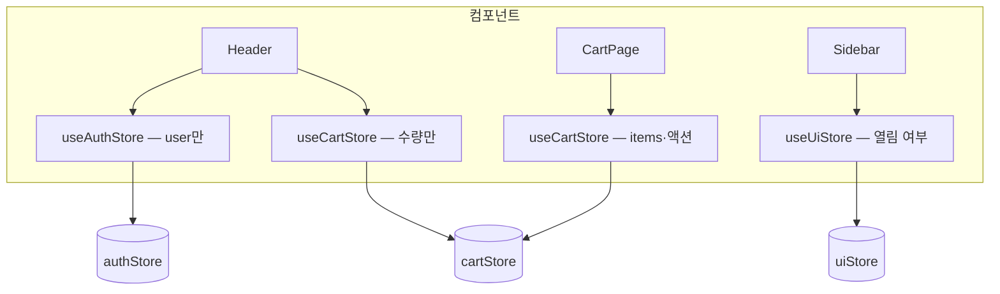

<Callout type="info">
  **이번 문서의 목표:** Zustand 스토어를 실무 규모로 키울 때 필요한 것들 — 액션을 어디에 어떻게 두는지, 미들웨어로 디버깅·영속화를 붙이는 법, 스토어를 모듈로 나누는 기준 — 을 익히고, Context와 Zustand의 역할 분담을 최종 확정한다.
</Callout>

## 왜 "실무 패턴"이 따로 필요한가

06편에서 Zustand의 원리 — 트리 밖 스토어, selector 부분 구독 — 를 해부했습니다. 그런데 원리를 아는 것과 실무 코드베이스를 운영하는 것 사이에는 간극이 있습니다. 스토어가 커지면서 이런 질문이 쏟아지기 시작합니다.

- 상태를 바꾸는 코드를 컴포넌트에 써도 되나, 꼭 스토어의 액션이어야 하나?
- 상태가 30개가 되면 스토어 하나에 다 넣나, 쪼개나?
- "지금 상태가 왜 이렇지?"를 어떻게 디버깅하나?
- 새로고침해도 장바구니가 남아 있게 하려면?
- 그래서 결국... Context는 이제 안 쓰는 건가?

이 편은 이 질문들에 하나씩 답합니다. 관통하는 주제는 하나입니다 — **스토어도 설계 대상이다.** 05편에서 훅의 입력·출력 계약을 설계했듯, 스토어에도 "무엇을 노출하고 무엇을 감출지"의 계약이 있습니다.

> **쉽게 말하면:** 06편이 창고를 짓는 법이었다면, 이 편은 창고를 **운영**하는 법입니다 — 물건 반출입 규칙(액션), CCTV(devtools), 정전 대비(persist), 창고 분리 기준(모듈화)까지.

## 1. 액션 설계 — 상태 변경 로직의 주소지

### 원칙: 갱신 로직은 스토어에 산다

Zustand는 기술적으로 컴포넌트에서 직접 상태를 바꾸는 것을 막지 않습니다. 스토어 훅에는 `setState`가 달려 있어서 이런 코드도 동작합니다.

```jsx
// ❌ 동작은 하지만 — 컴포넌트가 갱신 로직을 직접 소유
function AddButton({ product }) {
  const items = useCartStore((s) => s.items);
  const handleClick = () => {
    useCartStore.setState({ items: [...items, product] });
  };
  return <button onClick={handleClick}>담기</button>;
}
```

왜 이게 나쁠까요? "장바구니에 담기"의 규칙 — 중복 상품이면 수량만 올린다, 품절 상품은 못 담는다 — 이 나중에 생기면, **담기 버튼이 있는 모든 컴포넌트**를 찾아 고쳐야 합니다. 05편의 useCounter에서 setCount를 감추고 increment만 노출했던 것과 같은 이야기입니다 — 갱신 로직이 사용처에 흩어지면 규칙을 강제할 곳이 사라집니다.

그래서 실무 원칙은 명확합니다: **상태를 바꾸는 코드는 전부 스토어 안의 액션으로 모으고, 컴포넌트는 액션을 호출만 한다.** Zustand 공식 문서도 이 방식을 권장 패턴으로 안내합니다.

```jsx
export const useCartStore = create((set, get) => ({
  items: [],

  addItem: (product) => {
    // 규칙이 액션 안에 산다 — 사용처가 몇 개든 규칙은 여기 한 곳
    if (product.soldOut) return;
    const existing = get().items.find((item) => item.id === product.id);
    if (existing) {
      set((state) => ({
        items: state.items.map((item) =>
          item.id === product.id ? { ...item, qty: item.qty + 1 } : item
        ),
      }));
    } else {
      set((state) => ({ items: [...state.items, { ...product, qty: 1 }] }));
    }
  },
}));
```

새 얼굴 `get`에 주목하세요. `create((set, get) => ...)`의 둘째 인자로, **액션 안에서 현재 상태를 읽는 도구**입니다. "지금 이 상품이 이미 담겨 있나?"처럼 갱신 전에 현재 값을 조회해 분기할 때 씁니다. set의 함수형 인자로도 이전 상태를 받을 수 있지만, 분기 로직이 set 바깥에서 필요할 때는 get이 자연스럽습니다.

### 하나의 사용자 행동 = 하나의 액션

액션의 **단위**도 설계 문제입니다. "주문 완료" 버튼을 누르면 장바구니 비우기 + 주문 내역 추가 + 쿠폰 차감이 일어나야 한다고 합시다.

```jsx
// ❌ 컴포넌트가 낱개 액션을 조립 — 행동의 정의가 UI에 산다
const handleOrder = () => {
  clearCart();
  addOrder(items);
  useCoupon(couponId);
};

// ✅ 스토어가 행동 하나를 액션 하나로 제공
const handleOrder = () => placeOrder(couponId);
```

낱개 조립 방식의 문제는 두 가지입니다. 첫째, "주문 완료가 무엇인지"의 정의가 컴포넌트에 있어서, 다른 화면에서 주문 기능을 만들면 순서가 어긋나거나 한 단계를 빠뜨릴 수 있습니다. 둘째, set 호출이 흩어지면 상태 변경 이력을 추적하기 어렵습니다. **사용자의 의미 있는 행동 하나가 액션 하나**가 되도록 묶으세요 — 이름도 `setItems` 같은 기계적 이름 대신 `placeOrder`, `applyCoupon`처럼 **행동의 언어**로 짓습니다. 참고로 하나의 액션 안에서 set을 여러 번 불러도 React 18의 자동 배칭(02편) 덕에 리렌더는 한 번으로 합쳐지지만, 애초에 한 번의 set으로 묶을 수 있으면 그게 가장 읽기 좋습니다.

### 스토어 밖에서도 호출할 수 있다 — 트리 밖 창고의 보너스

스토어가 트리 밖에 살기 때문에 생기는 실무적 강점이 하나 있습니다. **React 컴포넌트가 아닌 코드**에서도 상태를 읽고 쓸 수 있다는 것입니다.

```jsx
// api/client.js — 컴포넌트가 아닌 일반 모듈
import { useAuthStore } from '../store/authStore';

export async function apiFetch(url) {
  const token = useAuthStore.getState().token;   // 훅 규칙 밖에서 읽기
  const res = await fetch(url, { headers: { Authorization: token } });
  if (res.status === 401) {
    useAuthStore.getState().logout();            // 액션 호출도 가능
  }
  return res.json();
}
```

`useAuthStore.getState()`는 훅이 아니라 스토어 객체의 메서드라, 훅 규칙(컴포넌트·훅 안에서만 호출)의 지배를 받지 않습니다. API 클라이언트, 웹소켓 핸들러, 라우터 가드처럼 React 밖의 코드가 상태에 접근해야 할 때 Context로는 곡예가 필요하지만 Zustand는 자연스럽습니다. 단, 구독이 아니라 **일회성 읽기**라는 점을 기억하세요 — 컴포넌트에서 getState로 읽으면 값이 바뀌어도 리렌더되지 않으므로, 컴포넌트 안에서는 반드시 훅+selector로 읽습니다.

## 2. 미들웨어 — 스토어에 능력 끼우기

**미들웨어**(middleware, 중간 장치)는 스토어의 생성 함수를 감싸 부가 기능을 끼워 넣는 장치입니다. 원리는 함수 합성입니다 — `create(devtools(persist(초기화함수)))`처럼 양파 껍질로 감싸면, set이 호출될 때마다 각 껍질이 자기 일(기록, 저장...)을 하고 안쪽으로 넘깁니다. 실무 사용 빈도가 높은 둘만 봅니다.

### devtools — 상태 변경의 블랙박스

"지금 상태가 왜 이렇지?"라는 디버깅 질문에 답하는 도구입니다. Redux DevTools라는 브라우저 확장(Redux용으로 만들어졌지만 Zustand도 호환)에 상태 변경 이력을 흘려보내 줍니다.

```jsx
import { create } from 'zustand';
import { devtools } from 'zustand/middleware';

export const useCartStore = create(
  devtools(
    (set, get) => ({
      items: [],
      addItem: (product) =>
        set(
          (state) => ({ items: [...state.items, product] }),
          undefined,
          'cart/addItem'   // 이 변경의 이름표 — 이력에 이 이름으로 찍힌다
        ),
    }),
    { name: 'CartStore' }
  )
);
```

브라우저 확장을 열면 `cart/addItem` 같은 이름표가 붙은 변경 이력이 시간순으로 쌓이고, 각 시점의 상태 스냅샷을 열람하거나 과거 시점으로 되감기(time travel)할 수 있습니다. set의 셋째 인자로 넘기는 액션 이름을 성실히 붙이는 것이 핵심 습관입니다 — 이름 없는 변경은 이력에서 anonymous로 찍혀 디버깅 가치가 없습니다.

### persist — 새로고침을 견디는 상태

새로고침하면 자바스크립트 메모리가 초기화되므로 스토어도 초기값으로 돌아갑니다. `persist`는 상태가 바뀔 때마다 브라우저 저장소(localStorage — 브라우저에 남는 키·값 저장소)에 자동 저장하고, 앱 시작 시 자동 복원해 줍니다.

```jsx
import { persist } from 'zustand/middleware';

export const useCartStore = create(
  persist(
    (set) => ({
      items: [],
      addItem: (product) => set((s) => ({ items: [...s.items, product] })),
    }),
    {
      name: 'cart-storage',                                  // 저장소의 키 이름
      partialize: (state) => ({ items: state.items }),       // 저장할 조각만 선별
    }
  )
);
```

`partialize`(부분화)에 주목하세요 — **전부 저장하지 않는 것**이 실무 요령입니다. 로딩 플래그나 열린 모달 같은 일시적 UI 상태까지 저장하면, 재방문 시 "로딩 중"인 채로 복원되는 유령 상태가 됩니다. 04편에서 경고한 "지난 방문의 필터가 남아 사용자를 어리둥절하게 하는 버그"도 persist를 무분별하게 걸었을 때의 전형입니다. **저장할 가치가 있는 상태만 골라 저장**하세요.

<Callout type="warning">
  **자주 틀리는 점:** 미들웨어는 감싸는 **순서**가 있습니다. 관례는 `devtools(persist(...))` — devtools를 바깥에 둬야 persist가 일으키는 복원 변경까지 이력에 잡힙니다. 그리고 미들웨어를 여러 겹 감싸기 시작하면 "정말 이 기능이 필요한가"를 먼저 물으세요 — Zustand의 미덕은 가벼움이고, 미들웨어는 필요할 때만 끼우는 옵션입니다.
</Callout>

## 3. 스토어 모듈화 — 창고를 나누는 기준

### 거대 단일 스토어의 냄새

앱이 크면 이런 스토어가 자라납니다.

```jsx
// ❌ 만능 스토어 — 인증·장바구니·알림·UI 상태가 한 방에
export const useAppStore = create((set) => ({
  user: null, token: null, login: ..., logout: ...,
  items: [], addItem: ..., removeItem: ...,
  notifications: [], pushNotification: ...,
  isSidebarOpen: false, toggleSidebar: ...,
}));
```

selector로 부분 구독하니 성능은 당장 문제가 아닙니다. 문제는 **설계**입니다 — 05편의 "과한 추상화" 훅과 같은 냄새죠. 서로 무관한 관심사가 한 지붕 아래 살면, 인증 로직을 고치다 장바구니를 깨뜨릴 수 있고, 파일은 수백 줄로 불어나고, "이 상태 어디 있지?"의 답이 항상 "그 큰 파일 어딘가"가 됩니다.

### 기준: 함께 바뀌는 것끼리

나누는 기준은 Context 쪼개기(06편)와 동일한 원리입니다 — **함께 읽히고 함께 바뀌는 것끼리 한 스토어**. 인증과 장바구니는 서로의 변경에 관심이 없으므로 다른 창고입니다.

```
src/
├─ store/
│  ├─ authStore.js       // user, token, login, logout
│  ├─ cartStore.js       // items, addItem, placeOrder
│  └─ uiStore.js         // isSidebarOpen, activeModal
```



스토어끼리 협업이 필요하면 — 예: 로그아웃 시 장바구니 비우기 — 한 스토어의 액션에서 다른 스토어를 직접 호출할 수 있습니다. 트리 밖 창고끼리는 그냥 모듈 import 관계니까요.

```jsx
// authStore.js
import { useCartStore } from './cartStore';

logout: () => {
  set({ user: null, token: null });
  useCartStore.getState().clear();   // 다른 창고의 액션 호출
},
```

다만 이런 **스토어 간 호출은 한 방향으로만** 유지하세요. auth가 cart를 부르는데 cart도 auth를 부르면 순환 의존이 생겨, 어느 창고가 진실의 원천인지 흐려집니다. 상호 의존이 자꾸 생긴다면 그 둘은 애초에 한 스토어였어야 한다는 신호입니다.

### slice 패턴 — 한 스토어를 파일만 나누기

반대로 "관심사는 하나인데 코드가 너무 길다"면, 스토어는 하나로 두고 **정의만 파일로 나누는** slice(슬라이스, 조각) 패턴이 있습니다.

```jsx
// store/cartSlice.js — 스토어의 조각을 만드는 함수
export const createCartSlice = (set, get) => ({
  items: [],
  addItem: (p) => set((s) => ({ items: [...s.items, p] })),
});

// store/couponSlice.js
export const createCouponSlice = (set, get) => ({
  coupons: [],
  applyCoupon: (id) => { /* get()으로 items도 읽을 수 있다 — 같은 스토어니까 */ },
});

// store/orderStore.js — 조각을 한 스토어로 병합
import { create } from 'zustand';
export const useOrderStore = create((set, get) => ({
  ...createCartSlice(set, get),
  ...createCouponSlice(set, get),
}));
```

장바구니와 쿠폰처럼 **서로의 상태를 읽어야 하는** 관심사는 slice로 한 스토어에 동거시키고, 무관한 관심사는 별도 스토어로 — 이 두 단계가 모듈화의 전부입니다.

> **쉽게 말하면:** 별도 스토어는 "다른 건물의 창고", slice는 "한 창고 안의 구역 나누기"입니다. 서로 물건을 자주 주고받으면 같은 창고 다른 구역으로, 아예 왕래가 없으면 다른 건물로.

## 4. 최종 정리 — Context와 Zustand의 역할 분담

이제 04편에서 그린 지도의 마지막 조각을 맞춥니다. 06~07편을 통과한 우리는 두 도구의 성격을 코드 수준에서 압니다. 실무 역할 분담은 다음과 같이 정리됩니다.

| 질문 | 예라면 |
|------|--------|
| 값이 자주 바뀌고, 조각별 구독이 필요한가? | Zustand |
| 상태 갱신 규칙이 복잡해 액션으로 모아야 하나? | Zustand |
| React 밖 코드(API 클라이언트 등)가 읽고 써야 하나? | Zustand |
| 새로고침 영속화·변경 이력 디버깅이 필요한가? | Zustand — persist·devtools |
| 특정 서브트리에만 값을 주입하고 싶은가? | Context — Provider 위치가 곧 범위 |
| 같은 UI 뭉치를 화면에 여러 개 띄우고 각각 독립 상태여야 하나? | Context — 인스턴스별 Provider |
| 드물게 바뀌는 앱 설정·환경값인가? | Context면 충분 — 라이브러리 추가 불필요 |

앞 네 줄은 06~07편에서 본 Zustand의 구조적 강점 그대로입니다. 뒤 세 줄이 Context가 **여전히 이기는** 자리인데, 핵심 원리는 하나입니다 — **Zustand 스토어는 모듈 스코프의 단일 창고라 항상 앱 전역 하나뿐이지만, Context는 Provider를 세우는 위치와 개수로 공유 범위를 조절할 수 있다**는 것. 탭 컴포넌트를 한 화면에 세 개 띄우면 각 탭마다 독립된 상태가 필요한데, 이건 전역 창고로는 어색하고 인스턴스별 Provider로는 자연스럽습니다. 이 성질이 11편 compound 패턴에서 Context가 주역을 맡는 이유입니다.

그래서 실무 앱의 전형적인 최종 그림은 이렇습니다.

- **로컬 상태**: 앱 상태의 대부분 — 각 컴포넌트의 useState (04편의 원칙 그대로)
- **Context**: 테마·언어·인증 여부 같은 느린 환경값 + 컴포넌트 라이브러리 내부의 범위 한정 공유
- **Zustand**: 장바구니·알림처럼 빠르고 넓은 도메인 상태, 관심사별로 나눈 소수의 스토어

세 도구는 경쟁자가 아니라 **다른 사정거리를 맡는 동료**입니다. "우리 팀은 Zustand 씁니다"가 "모든 상태를 Zustand에 넣습니다"가 되는 순간, 04편의 첫 실수로 되돌아가는 것입니다.

## 핵심 정리

- 상태 갱신 로직은 **전부 스토어 안의 액션으로** — 컴포넌트는 호출만 한다. 규칙이 한 곳에 살아야 강제된다. 액션 안에서 현재 상태가 필요하면 `get`을 쓴다.
- 액션의 단위는 **사용자의 의미 있는 행동 하나** — setItems가 아니라 placeOrder. 낱개 액션 조립을 컴포넌트에 맡기지 않는다.
- `getState`로 React 밖 코드에서도 스토어를 읽고 쓸 수 있다 — 단, 구독이 아니므로 컴포넌트 안에서는 훅+selector로.
- 미들웨어는 필요할 때만: **devtools**는 액션 이름표와 함께 변경 이력을, **persist**는 `partialize`로 고른 조각만 영속화를. 관례 순서는 devtools가 바깥.
- 스토어는 **함께 바뀌는 관심사끼리** 나눈다 — 무관하면 별도 스토어, 상호 참조가 필요하면 slice로 한 스토어. 스토어 간 호출은 한 방향으로만.
- Context는 사라지지 않는다 — 서브트리 한정 주입과 인스턴스별 독립 상태는 Context만의 자리이고, 빠르고 넓은 도메인 상태는 Zustand의 자리다.

## 마무리 복습

<Quiz
  questionNumber={1}
  question="상태 갱신 로직을 컴포넌트가 아닌 스토어의 액션에 두어야 하는 핵심 이유는?"
  options={['컴포넌트에서 setState를 호출하면 에러가 나기 때문', '갱신 규칙이 한 곳에 모여야 사용처가 늘어도 규칙을 일관되게 강제할 수 있기 때문', '액션이 컴포넌트 함수보다 실행 속도가 빠르기 때문', 'devtools가 컴포넌트 코드를 읽지 못하기 때문']}
  correctAnswer={2}
  explanation="갱신 로직이 사용처에 흩어지면 규칙 변경 시 모든 사용처를 찾아 고쳐야 한다. 액션으로 모으면 중복 상품 처리 같은 규칙이 한 곳에 살며 강제된다."
  optionExplanations={['기술적으로는 동작한다 — 설계상 나쁠 뿐이다', '정답 — useCounter에서 setter를 감추던 것과 같은 원리다', '실행 속도 차이는 없다', 'devtools는 부차적 이유일 뿐 핵심은 규칙의 단일 주소지다']}
/>

<Quiz
  questionNumber={2}
  question="create((set, get) =&gt; ...)에서 get의 용도는?"
  options={['컴포넌트에서 상태를 구독하는 함수', '액션 안에서 현재 상태를 읽어 분기 로직에 쓰는 도구', '스토어를 삭제하는 함수', 'devtools에 액션 이름을 보내는 함수']}
  correctAnswer={2}
  explanation="get은 액션 내부에서 현재 상태를 조회하는 도구다. 이미 담긴 상품인지 확인하고 분기하는 것처럼, 갱신 전에 현재 값이 필요할 때 쓴다."
  optionExplanations={['구독은 컴포넌트에서 훅+selector로 한다', '정답 — set이 쓰기라면 get은 액션 안의 읽기다', '삭제 기능이 아니다', '액션 이름은 set의 셋째 인자로 전달한다']}
/>

<Quiz
  questionNumber={3}
  question="주문 완료 시 장바구니 비우기·주문 추가·쿠폰 차감이 필요할 때 권장되는 액션 설계는?"
  options={['컴포넌트에서 clearCart, addOrder, useCoupon을 차례로 호출한다', '세 갱신을 묶은 placeOrder 액션 하나를 스토어가 제공한다', '세 갱신을 각각 다른 스토어로 분리한다', '갱신을 setTimeout으로 순차 실행한다']}
  correctAnswer={2}
  explanation="사용자의 의미 있는 행동 하나가 액션 하나가 되어야, 행동의 정의가 스토어에 살고 어느 화면에서든 순서·누락 실수 없이 재사용된다."
  optionExplanations={['행동의 정의가 UI에 흩어져 다른 화면에서 단계를 빠뜨릴 수 있다', '정답 — 이름도 행동의 언어로 짓는다', '함께 바뀌는 관심사를 억지로 나누면 오히려 결합이 늘어난다', '타이머는 순서 보장 문제와 무관하며 불필요한 비동기만 만든다']}
/>

<Quiz
  questionNumber={4}
  question="React 컴포넌트가 아닌 API 클라이언트 모듈에서 스토어의 토큰을 읽는 올바른 방법은?"
  options={['모듈 최상단에서 useAuthStore()를 호출한다', 'useAuthStore.getState().token으로 읽는다', 'Context의 useContext를 호출한다', '토큰을 전역 변수에 복사해 둔다']}
  correctAnswer={2}
  explanation="getState는 훅이 아니라 스토어 메서드라 훅 규칙 밖에서도 호출할 수 있다. 트리 밖 창고이기에 가능한 Zustand의 실무적 강점이다."
  optionExplanations={['훅은 컴포넌트·훅 안에서만 호출할 수 있다', '정답 — 단, 일회성 읽기이므로 컴포넌트 안에서는 훅+selector를 쓴다', 'useContext도 훅이라 컴포넌트 밖에서 못 쓴다', '사본 전역 변수는 원본과 어긋나는 동기화 버그의 온상이다']}
/>

<Quiz
  questionNumber={5}
  question="persist 미들웨어의 partialize 옵션이 필요한 이유는?"
  options={['저장 속도를 높이기 위해', '로딩 플래그·모달 상태 같은 일시적 상태까지 복원되는 유령 상태를 막기 위해', 'devtools와의 충돌을 피하기 위해', '저장소 용량이 무제한이라서']}
  correctAnswer={2}
  explanation="스토어 전체를 저장하면 일시적 UI 상태까지 복원되어 재방문 시 로딩 중인 채로 시작하는 등의 버그가 된다. 저장할 가치가 있는 조각만 골라 저장해야 한다."
  optionExplanations={['속도가 아니라 복원 내용의 올바름이 목적이다', '정답 — 전부 저장이 아니라 선별 저장이 실무 요령이다', '충돌 방지 기능이 아니다', '용량이 이유가 아니며 localStorage 용량은 오히려 제한적이다']}
/>

<Quiz
  questionNumber={6}
  question="스토어를 나눌지 합칠지 판단하는 기준으로 옳은 것은?"
  options={['파일이 100줄을 넘으면 무조건 별도 스토어로 나눈다', '함께 읽히고 바뀌는 관심사는 한 스토어에, 서로 무관한 관심사는 별도 스토어로 나눈다', '컴포넌트 개수만큼 스토어를 만든다', '모든 상태는 하나의 스토어에 두는 것이 표준이다']}
  correctAnswer={2}
  explanation="나누는 기준은 줄 수가 아니라 관심사의 결합도다. 상호 참조가 필요한데 코드만 길다면 slice 패턴으로 한 스토어의 정의를 파일만 나눈다."
  optionExplanations={['줄 수는 신호일 뿐 기준이 아니다 — slice로 파일만 나눌 수도 있다', '정답 — Context 쪼개기와 같은 원리다', '스토어는 관심사 단위이지 컴포넌트 단위가 아니다', '만능 단일 스토어는 과한 추상화 훅과 같은 냄새다']}
/>

<Quiz
  questionNumber={7}
  question="Zustand가 널리 쓰이는 앱에서도 Context가 여전히 맡는 역할은?"
  options={['고빈도 갱신 상태의 조각별 구독', '특정 서브트리 한정 주입과 인스턴스별 독립 상태 제공', '새로고침 후 상태 복원', 'React 밖 코드에서의 상태 접근']}
  correctAnswer={2}
  explanation="Zustand 스토어는 모듈 스코프의 단일 창고라 항상 앱 전역이지만, Context는 Provider의 위치·개수로 공유 범위를 조절할 수 있다. 같은 UI 뭉치를 여러 개 띄워 각각 독립 상태를 줄 때 Context가 자연스럽다."
  optionExplanations={['조각별 구독은 selector를 가진 Zustand의 자리다', '정답 — 이 성질이 compound 패턴에서 Context가 주역인 이유다', '영속화는 persist 미들웨어를 가진 Zustand의 강점이다', '트리 밖 접근은 getState를 가진 Zustand의 강점이다']}
/>

## 참고 자료

- [Zustand 공식 문서](https://github.com/pmndrs/zustand)
- [Zustand 공식 문서 - Practice with no store actions 및 미들웨어 가이드](https://zustand.docs.pmnd.rs/guides/practice-with-no-store-actions)
- [React 공식 문서 - Context 소개 및 API](https://react.dev/reference/react/Context)
