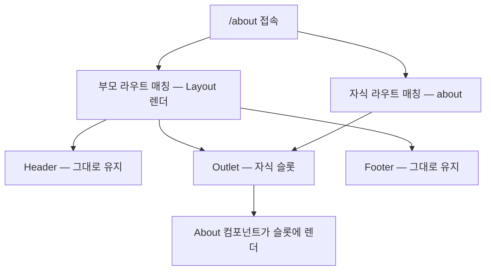

<Callout type="info">
  **이번 문서의 목표:** React Router v6로 URL과 화면을 연결하고, nested route와 layout route·Outlet으로 공통 레이아웃을 가진 다페이지 SPA의 구조를 스스로 설계할 수 있다.
</Callout>

## 왜 라우터가 필요한가 — SPA의 잃어버린 반쪽

전통적인 웹사이트에서 페이지 이동은 서버의 일이었습니다. `/about`을 클릭하면 브라우저가 서버에 요청을 보내고, 서버가 about.html을 통째로 새로 보내주고, 브라우저는 화면 전체를 갈아 끼웁니다 — 흰 화면 깜빡임과 함께요.

React 앱은 다릅니다. **SPA**(Single Page Application, 싱글 페이지 애플리케이션)라는 이름 그대로, 서버에서 받는 HTML은 사실상 **한 장**뿐이고, 이후의 모든 화면 전환은 자바스크립트가 DOM을 갈아 끼워 만듭니다. 덕분에 깜빡임 없이 매끄럽지만, 대가로 우리는 브라우저가 공짜로 주던 것들을 잃었습니다.

- **주소가 없다.** 어떤 화면을 보고 있든 URL은 `/` 그대로입니다. 상품 상세를 보다가 친구에게 링크를 보낼 수 없습니다.
- **뒤로 가기가 죽는다.** 브라우저의 뒤로 가기는 "이전 URL"로 가는 버튼인데, URL이 안 바뀌었으니 앱 밖으로 튕겨 나갑니다.
- **새로고침하면 처음부터.** 어느 화면에 있었는지를 URL이 기억해주지 않으니, 새로고침은 항상 첫 화면입니다.

정리하면 — 화면은 여러 개인데 **주소 체계가 없는 것**입니다. 이 잃어버린 반쪽을 되찾아 주는 것이 **라우터**(router, 경로 안내기)이고, React 생태계의 표준 라우터가 **React Router**입니다. 라우터가 하는 일의 본질은 한 문장입니다:

> **쉽게 말하면:** 라우터는 "URL이 이것이면 이 컴포넌트를 그려라"라는 **URL과 화면의 대응표**를 관리하고, 이동할 때 서버에 가는 대신 URL만 바꾸고 표에 따라 화면을 갈아 끼웁니다.

여기서 "URL만 바꾸고"가 기술적 핵심입니다. React Router는 브라우저의 History API — 페이지를 다시 불러오지 않고 주소창의 URL과 방문 기록을 조작할 수 있게 해주는 브라우저 내장 기능 — 를 사용합니다. 그래서 URL이 바뀌고 뒤로 가기가 살아나는데도 서버 요청과 깜빡임은 없습니다. React Router는 외부 패키지이므로(`npm install react-router-dom`) 이 편의 예제는 정적 코드로 보여줍니다 — Vite 프로젝트에 직접 붙여 보며 따라오세요.

## 1. 첫 라우팅 — 대응표 만들기

### 최소 구성

가장 작은 라우팅 앱은 세 부품으로 만들어집니다.

```jsx
// main.jsx
import { BrowserRouter } from 'react-router-dom';

createRoot(document.getElementById('root')).render(
  <BrowserRouter>
    <App />
  </BrowserRouter>
);
```

```jsx
// App.jsx
import { Routes, Route, Link } from 'react-router-dom';

function Home() { return <h2>홈</h2>; }
function About() { return <h2>소개</h2>; }

export default function App() {
  return (
    <div>
      <nav>
        <Link to="/">홈</Link> | <Link to="/about">소개</Link>
      </nav>
      <Routes>
        <Route path="/" element={<Home />} />
        <Route path="/about" element={<About />} />
      </Routes>
    </div>
  );
}
```

부품별 역할을 해부합니다.

- **BrowserRouter** — 라우팅의 전원 스위치입니다. History API와 연결되어 현재 URL을 추적하고, 그 정보를 트리 전체에 공급합니다. 무엇으로요? 바로 **Context**입니다(04편에서 예고했던 그 사례). 그래서 앱 최상단을 한 번 감싸며, 이 안에서만 라우터의 부품·훅이 동작합니다.
- **Routes와 Route** — 대응표 본체입니다. `Routes`는 현재 URL을 자식 `Route`들의 path와 대조해 **가장 잘 맞는 하나**를 골라 그 element를 렌더링합니다. v6의 매칭은 "가장 구체적인 경로 우선"이라, `/about`이 `/`보다 먼저 정의되어 있든 나중이든 결과가 같습니다 — 정의 순서에 신경 쓸 필요가 없습니다.
- **Link** — SPA용 `<a>` 태그입니다. 진짜 `<a href>`를 쓰면 브라우저가 서버로 가버려 SPA가 처음부터 다시 로드됩니다. Link는 실제로는 `<a>`로 렌더링되지만, 클릭을 가로채 History API로 URL만 바꿉니다. **앱 내부 이동은 반드시 Link**, 외부 사이트로 나갈 때만 `<a>`를 씁니다.

### 매칭에서 빠지는 경우 — 404

대응표에 없는 URL로 들어오면 `Routes`는 아무것도 그리지 않습니다 — 빈 화면은 최악의 사용자 경험이죠. 모든 경로와 매칭되는 와일드카드 `*`로 마지막 안전망을 깝니다.

```jsx
<Routes>
  <Route path="/" element={<Home />} />
  <Route path="/about" element={<About />} />
  <Route path="*" element={<NotFound />} />  {/* 그 외 전부 */}
</Routes>
```

`*`는 구체성이 가장 낮아서, 다른 어떤 라우트와도 매칭이 안 될 때만 선택됩니다.

## 2. 진짜 문제 — 공통 레이아웃은 어디에 두나

페이지가 늘어나면 곧바로 구조 문제가 나타납니다. 실제 서비스의 화면들은 대부분 **공통 틀**을 공유합니다 — 상단 헤더, 하단 푸터, 관리자 화면이라면 좌측 사이드바까지. 순진하게 접근하면 이렇게 됩니다.

```jsx
// ❌ 모든 페이지가 틀을 각자 챙긴다
function Home() {
  return (
    <div>
      <Header />
      <main>홈 내용</main>
      <Footer />
    </div>
  );
}
function About() {
  return (
    <div>
      <Header />
      <main>소개 내용</main>
      <Footer />
    </div>
  );
}
```

중복도 문제지만 더 나쁜 것이 있습니다 — 페이지를 이동하면 `Home`이 통째로 언마운트되고 `About`이 통째로 마운트되면서, **Header도 함께 죽었다 태어납니다**. Header 안에 열려 있던 드롭다운, 입력 중이던 검색어 같은 상태가 이동할 때마다 증발합니다(02편에서 본 "언마운트는 상태의 죽음"). 공통 틀은 페이지가 바뀌어도 **살아 있어야** 합니다.

요구사항을 정확히 적으면 이렇습니다 — "틀은 고정하고, **틀 안의 한 구멍만** URL에 따라 갈아 끼우고 싶다." 어디서 본 그림이죠? 01편의 슬롯입니다. React Router는 이 구멍에 이름을 붙여 두었습니다 — **Outlet**(아웃렛, 출구·배출구).

## 3. Nested Route와 Outlet — 라우터식 슬롯

### 라우트를 중첩한다

React Router v6의 답은 **라우트 정의 자체를 중첩**하는 것입니다.

```jsx
import { Routes, Route, Outlet, Link } from 'react-router-dom';

function Layout() {
  return (
    <div>
      <Header />
      <main>
        <Outlet />   {/* ← 자식 라우트가 이 자리에 렌더링된다 */}
      </main>
      <Footer />
    </div>
  );
}

export default function App() {
  return (
    <Routes>
      <Route path="/" element={<Layout />}>       {/* 부모 라우트 */}
        <Route index element={<Home />} />          {/* "/" 일 때의 자식 */}
        <Route path="about" element={<About />} />  {/* "/about" */}
        <Route path="products" element={<Products />} /> {/* "/products" */}
      </Route>
      <Route path="*" element={<NotFound />} />
    </Routes>
  );
}
```

동작을 순서대로 따라가면:

1. URL이 `/about`이면, 먼저 부모 라우트 `/`가 매칭되어 `Layout`이 렌더링됩니다.
2. 이어서 자식들 중 `about`이 매칭됩니다. 자식의 path는 부모 path에 **이어 붙는** 상대 경로입니다 — 부모 `/` + 자식 `about` = `/about`. 슬래시로 시작하지 않는 것에 주목하세요.
3. 매칭된 자식의 element(`<About />`)가, 부모 element 안의 **`Outlet` 자리에** 끼워져 렌더링됩니다.

즉 `Outlet`은 "자식 라우트 전용 슬롯"입니다. 01편 슬롯과의 차이는 단 하나 — 구멍에 뭘 끼울지를 **부모 컴포넌트가 아니라 URL이 결정**한다는 것.



이제 `/`에서 `/about`으로 이동하면 무슨 일이 벌어질까요? 부모 라우트는 계속 매칭 중이므로 **Layout·Header·Footer는 언마운트되지 않고**, Outlet 안의 내용물만 Home에서 About으로 교체됩니다. 헤더의 상태가 살아남습니다 — 앞 절의 문제가 정확히 해결된 것입니다.

### index route — "자식이 없을 때의 기본값"

위 코드의 `<Route index element={<Home />} />`가 낯설 겁니다. 부모 path인 `/`에 **정확히** 일치할 때 — 즉 자식 경로 없이 부모 주소로만 들어왔을 때 — Outlet에 무엇을 보여줄지 정하는 것이 **index route**(인덱스 라우트)입니다. path 대신 index라는 표식을 씁니다. index route가 없으면 `/`에서 Outlet이 텅 비게 됩니다 — 폴더에 index.html이 없으면 빈 목록이 뜨는 것과 같은 그림입니다.

### layout route — path 없는 부모

한 걸음 더. 위 구조에서 부모 라우트의 역할을 뜯어보면, path 매칭보다는 **틀을 씌우는 일**이 본업입니다. React Router는 아예 path가 없는 부모 라우트를 허용합니다 — 이것을 **layout route**(레이아웃 라우트)라고 부릅니다.

```jsx
<Routes>
  {/* path 없음 — URL 매칭에는 안 끼고, 틀만 씌운다 */}
  <Route element={<MarketingLayout />}>
    <Route path="/" element={<Home />} />
    <Route path="/about" element={<About />} />
  </Route>

  {/* 다른 틀을 쓰는 화면 묶음 */}
  <Route element={<DashboardLayout />}>
    <Route path="/dashboard" element={<Overview />} />
    <Route path="/dashboard/settings" element={<Settings />} />
  </Route>

  {/* 틀이 아예 없는 화면 */}
  <Route path="/login" element={<Login />} />
</Routes>
```

path 없는 layout route는 URL 구조에 아무 흔적을 남기지 않으면서, 자식들을 하나의 틀로 묶습니다. 이 코드가 말해주는 설계가 보이시나요 — 이 앱에는 **세 가지 화면 부류**가 있습니다: 마케팅용 틀을 쓰는 화면들, 대시보드 틀을 쓰는 화면들, 틀 없는 로그인. 라우트 정의가 곧 **"어떤 화면이 어떤 틀을 입는가"의 설계도**가 된 것입니다.

> **쉽게 말하면:** nested route는 "주소도 잇고 틀도 씌우는" 중첩이고, layout route는 "주소는 건드리지 않고 틀만 씌우는" 중첩입니다. 겹겹이 쌓을 수도 있습니다 — 전체 틀 안에 대시보드 틀, 그 안에 설정 틀.

<Callout type="warning">
  **자주 틀리는 점:** layout 컴포넌트에 `Outlet` 넣는 것을 잊는 실수가 압도적으로 흔합니다. 라우트 매칭은 정상이라 에러도 안 나는데, 자식이 그려질 자리가 없으니 **내용만 조용히 빈 화면**이 됩니다. "매칭은 되는 것 같은데 내용이 안 보인다" — 십중팔구 Outlet 누락입니다.
</Callout>

## 4. 다페이지 SPA 구조 설계 — 처음부터 끝까지

배운 부품으로 실제 서비스 규모의 구조를 한 번에 세워 봅니다. 요구사항: 쇼핑몰 — 일반 화면(홈·상품 목록)은 헤더+푸터 틀, 마이페이지 계열(주문 내역·설정)은 헤더+사이드바 틀, 로그인은 틀 없음.

```jsx
// App.jsx — 라우트 정의가 곧 화면 설계도
export default function App() {
  return (
    <Routes>
      <Route element={<ShopLayout />}>          {/* 헤더+푸터 틀 */}
        <Route index element={<Home />} />
        <Route path="products" element={<ProductList />} />
      </Route>

      <Route path="my" element={<MyPageLayout />}>  {/* 헤더+사이드바 틀, /my 접두 */}
        <Route index element={<MyHome />} />          {/* /my */}
        <Route path="orders" element={<OrderList />} /> {/* /my/orders */}
        <Route path="settings" element={<Settings />} /> {/* /my/settings */}
      </Route>

      <Route path="login" element={<Login />} />
      <Route path="*" element={<NotFound />} />
    </Routes>
  );
}
```

```jsx
// layouts/MyPageLayout.jsx
import { Outlet, NavLink } from 'react-router-dom';

export default function MyPageLayout() {
  return (
    <div>
      <Header />
      <div style={{ display: 'flex' }}>
        <nav>
          <NavLink to="/my">마이 홈</NavLink>
          <NavLink to="/my/orders">주문 내역</NavLink>
          <NavLink to="/my/settings">설정</NavLink>
        </nav>
        <main>
          <Outlet />
        </main>
      </div>
    </div>
  );
}
```

새 부품 **NavLink**는 Link의 형제로, 자기 to와 현재 URL이 일치하면 **active 클래스를 자동으로** 붙여줍니다. 사이드바·탭에서 "지금 어디에 있는지" 강조하는 스타일을 위해 만들어진 부품입니다 — Link로 직접 만들려면 현재 URL을 읽어 비교하는 코드를 매번 써야 하죠.

폴더 구조도 라우트 구조를 따라가게 잡으면 길을 잃지 않습니다.

```
src/
├─ layouts/        // 틀 — ShopLayout, MyPageLayout
├─ pages/          // Outlet에 끼워지는 화면 단위 — Home, ProductList, OrderList...
├─ components/     // 페이지들이 공유하는 부품 — Header, Footer...
└─ App.jsx         // 대응표 — 이 파일만 보면 앱의 전체 화면 지도가 보인다
```

이 구조의 미덕은 **App.jsx 한 파일이 앱의 지도**라는 점입니다. 새 팀원이 와도 라우트 정의만 읽으면 "무슨 화면이 있고, 어떤 틀을 입고, 주소가 뭔지"를 한눈에 파악합니다. 라우팅 설계란 결국 URL 체계·레이아웃 계층·폴더 구조, 셋을 **하나의 트리로 일치**시키는 일입니다.

여기까지가 정적인 뼈대입니다. `/products/42`처럼 URL 일부가 데이터인 **동적 파라미터**, 검색 조건을 URL에 싣는 **search params**, 코드로 이동시키는 프로그래밍 내비게이션, 로그인 안 한 사용자를 돌려보내는 **보호 라우트**는 자세한 내용은 09편에서 다룹니다.

## 핵심 정리

- SPA는 HTML 한 장으로 모든 화면을 만들다 보니 주소·뒤로 가기·새로고침을 잃는다 — 라우터는 History API로 URL만 바꾸며 **URL과 화면의 대응표**를 관리해 이를 되찾아 준다.
- 기본 부품: `BrowserRouter`(전원, Context로 URL 공급) → `Routes`(가장 구체적인 라우트 하나 선택) → `Route`(대응 항목) → `Link`/`NavLink`(서버 왕복 없는 이동). 내부 이동에 `<a>`를 쓰면 SPA가 통째로 재로드된다.
- **nested route**: 부모 라우트가 틀을 그리고, 자식 라우트의 element가 부모의 `Outlet` 자리에 끼워진다 — 화면 이동 시 틀은 언마운트되지 않아 상태가 산다. 부모 주소 그 자체의 내용물은 **index route**가 맡는다.
- **layout route**: path 없는 부모 라우트 — URL에 흔적 없이 틀만 씌운다. 라우트 정의가 곧 "어떤 화면이 어떤 틀을 입는가"의 설계도가 된다.
- 매칭 안 되는 URL은 `path="*"` 안전망으로 404를, layout 컴포넌트의 Outlet 누락은 "조용한 빈 화면"의 최다 원인임을 기억하라.

## 마무리 복습

<Quiz
  questionNumber={1}
  question="SPA에 라우터가 필요한 근본 이유는?"
  options={['서버 렌더링 속도를 높이기 위해', '화면은 여러 개인데 URL 주소 체계가 없어 링크 공유·뒤로 가기·새로고침 복원이 깨지기 때문', 'CSS를 페이지별로 분리하기 위해', 'HTML 파일을 여러 장 만들기 위해']}
  correctAnswer={2}
  explanation="SPA는 HTML 한 장으로 모든 화면을 만들므로 URL이 바뀌지 않는다. 라우터는 History API로 URL과 화면을 대응시켜 잃어버린 주소 체계를 되찾아 준다."
  optionExplanations={['라우터는 클라이언트 도구이며 서버 렌더링과 무관하다', '정답 — 주소가 없으면 공유·뒤로 가기·새로고침이 모두 무너진다', '스타일 분리는 라우터의 역할이 아니다', 'SPA는 오히려 HTML을 한 장만 쓰는 방식이다']}
/>

<Quiz
  questionNumber={2}
  question="앱 내부 이동에 a 태그 대신 Link를 써야 하는 이유는?"
  options={['a 태그는 React에서 렌더링되지 않기 때문', 'a 태그는 서버로 새 요청을 보내 SPA 전체가 다시 로드되지만, Link는 클릭을 가로채 URL만 바꾸기 때문', 'Link가 a 태그보다 스타일 지정이 쉽기 때문', 'a 태그는 뒤로 가기를 지원하지 않기 때문']}
  correctAnswer={2}
  explanation="Link는 실제로 a 태그로 렌더링되지만 클릭 시 서버 왕복 대신 History API로 URL만 바꾼다. 진짜 a 태그로 내부 이동을 하면 앱이 처음부터 재로드되어 상태가 전부 날아간다."
  optionExplanations={['a 태그도 정상 렌더링된다 — 문제는 클릭 시의 동작이다', '정답 — 외부 사이트로 나갈 때만 a 태그를 쓴다', '스타일은 둘 다 동일하게 지정할 수 있다', 'a 태그도 뒤로 가기는 되지만 SPA 재로드가 문제다']}
/>

<Quiz
  questionNumber={3}
  question="Outlet의 역할로 옳은 것은?"
  options={['현재 URL을 문자열로 반환한다', '부모 라우트의 element 안에서, 매칭된 자식 라우트의 element가 렌더링될 자리를 표시한다', '404 화면을 자동으로 보여준다', '브라우저의 방문 기록을 초기화한다']}
  correctAnswer={2}
  explanation="Outlet은 자식 라우트 전용 슬롯이다. 부모의 틀은 유지된 채, URL에 따라 매칭된 자식 element만 Outlet 자리에 갈아 끼워진다."
  optionExplanations={['URL 읽기는 별도 훅의 몫이다', '정답 — 구멍에 무엇이 끼워질지를 URL이 결정하는 슬롯이다', '404는 path 별표 라우트로 직접 처리한다', '방문 기록 조작과는 무관하다']}
/>

<Quiz
  questionNumber={4}
  question="페이지 이동 시 헤더의 검색어 입력 상태가 사라지지 않게 하는 구조는?"
  options={['각 페이지 컴포넌트가 Header를 각자 렌더링한다', '헤더를 부모 라우트의 layout 컴포넌트에 두고 페이지들은 Outlet으로 갈아 끼운다', '검색어를 alert로 백업한다', '페이지 이동마다 새로고침한다']}
  correctAnswer={2}
  explanation="부모 라우트가 계속 매칭되는 한 layout과 그 안의 Header는 언마운트되지 않으므로 상태가 유지된다. 페이지마다 Header를 각자 그리면 이동 시마다 죽었다 태어나 상태가 증발한다."
  optionExplanations={['이동할 때마다 Header가 언마운트되어 상태가 사라진다', '정답 — 틀을 살려두는 것이 nested route의 실질적 이득이다', '사용자 경험을 파괴하는 방법이며 상태 유지가 아니다', '새로고침은 오히려 모든 상태를 초기화한다']}
/>

<Quiz
  questionNumber={5}
  question="index route에 대한 설명으로 옳은 것은?"
  options={['모든 URL과 매칭되는 와일드카드 라우트다', '자식 경로 없이 부모 주소에 정확히 일치할 때 Outlet에 보여줄 기본 자식 라우트다', '가장 먼저 정의된 라우트를 가리키는 별명이다', '404 처리를 위한 전용 라우트다']}
  correctAnswer={2}
  explanation="index route는 path 대신 index 표식을 쓰며, 부모 주소로만 들어왔을 때 Outlet에 렌더링될 내용을 정한다. 없으면 부모 주소에서 Outlet이 빈다."
  optionExplanations={['와일드카드는 path 별표의 역할이다', '정답 — 폴더의 index.html에 해당하는 개념이다', '정의 순서와는 무관한 개념이다', '404는 별표 라우트가 맡는다']}
/>

<Quiz
  questionNumber={6}
  question="path 없는 layout route의 특징으로 옳은 것은?"
  options={['빌드 에러가 발생하므로 쓸 수 없다', 'URL 구조에는 관여하지 않으면서 자식 라우트들에 공통 틀만 씌운다', '자동으로 모든 URL과 매칭된다', '자식 라우트를 가질 수 없다']}
  correctAnswer={2}
  explanation="layout route는 URL 매칭에 흔적을 남기지 않고 자식들을 하나의 레이아웃으로 묶는다. 덕분에 화면 부류별로 다른 틀을 입히는 설계를 라우트 정의만으로 표현할 수 있다."
  optionExplanations={['v6가 공식 지원하는 유효한 패턴이다', '정답 — 주소는 건드리지 않고 틀만 씌우는 중첩이다', '매칭은 자식들의 path가 결정한다', '자식을 묶는 것이 존재 이유다']}
/>

<Quiz
  questionNumber={7}
  question="라우트 매칭은 되는데 자식 화면 내용만 비어 보인다. 가장 먼저 의심할 것은?"
  options={['React 버전이 낮다', 'layout 컴포넌트에 Outlet을 빠뜨렸다', 'BrowserRouter를 두 번 감쌌다', 'CSS가 로드되지 않았다']}
  correctAnswer={2}
  explanation="Outlet이 없으면 자식 라우트가 매칭되어도 그려질 자리가 없어, 에러 없이 내용만 조용히 비는 증상이 나타난다. nested route의 최다 실수 유형이다."
  optionExplanations={['버전 문제라면 다른 에러가 먼저 보인다', '정답 — 에러가 안 나기 때문에 더 찾기 어려운 실수다', '중복 Router는 보통 명시적 에러를 낸다', '스타일 문제라면 내용 자체는 DOM에 존재한다']}
/>

## 참고 자료

- [React Router v6 공식 문서](https://reactrouter.com/6.30.0)
- [React 공식 문서 - Context 소개 및 API](https://react.dev/reference/react/Context)
