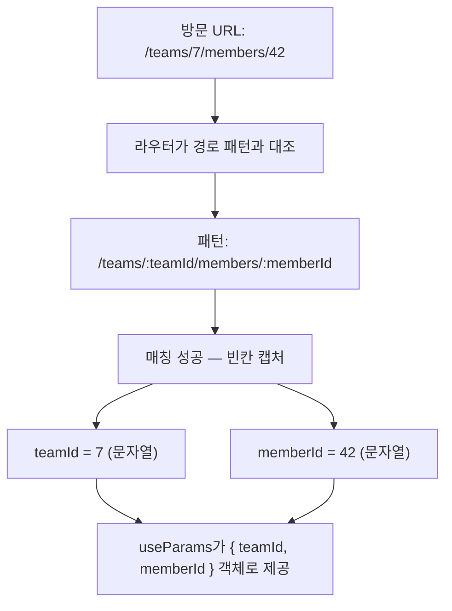
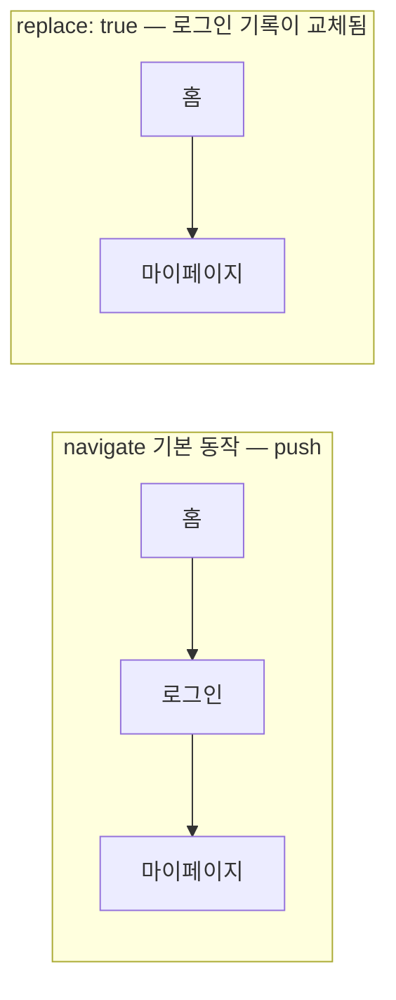
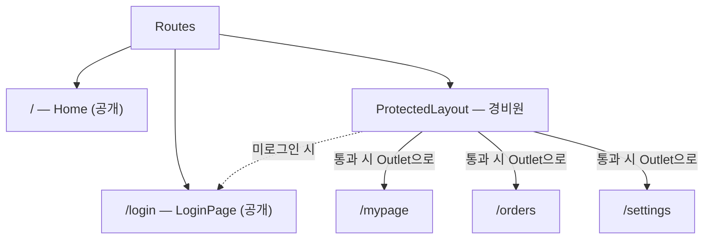

<Callout type="info">
  **이번 문서의 목표:** URL 경로와 쿼리 문자열에서 값을 읽고 쓰는 법(useParams, useSearchParams), 코드에서 화면을 이동시키는 법(useNavigate), 그리고 로그인하지 않은 사용자를 막는 보호 라우트(protected route) 패턴까지 — "URL도 상태다"라는 관점을 완성한다.
</Callout>

## 왜 URL에 값을 담는가

08편에서 우리는 라우트를 정의하고 `Outlet`으로 레이아웃을 조립해 다페이지 SPA의 뼈대를 세웠습니다. 그런데 뼈대만으로는 부족한 화면이 금방 나타납니다.

- 상품 목록에서 상품 하나를 클릭하면 → **그 상품의** 상세 페이지가 열려야 한다
- 검색 결과 화면에서 "2페이지, 가격순 정렬"을 보고 있었다면 → 새로고침해도, 링크를 친구에게 보내도 **같은 화면**이 나와야 한다
- 마이페이지는 → **로그인한 사람만** 들어올 수 있어야 한다

셋 다 공통점이 있습니다. 화면을 결정하는 정보가 컴포넌트 내부 상태(state)가 아니라 **URL 자체에** 있어야 한다는 점입니다. `useState`에 담긴 값은 새로고침하면 사라지고, 다른 사람과 공유할 수 없습니다. 반면 URL에 담긴 값은:

- **새로고침해도 살아남는다** — 브라우저 주소창이 곧 저장소니까
- **공유할 수 있다** — 링크를 복사해 보내면 상대도 같은 화면을 본다
- **뒤로 가기가 공짜다** — 브라우저 히스토리(history, 방문 기록)가 상태 이력을 대신 관리한다

> **쉽게 말하면:** URL은 "무료로 제공되는 전역 상태 저장소"입니다. 새로고침 생존, 공유, 뒤로 가기 지원까지 붙어 있는데, 안 쓸 이유가 없습니다.

이 관점 — **URL도 상태다** — 이 이번 편 전체를 관통합니다. 그리고 상태라면 당연히 "어디에 둘지"의 판단 기준이 필요하죠. 04편에서 세운 상태 배치 지도에 오늘 한 칸이 더 추가되는 셈입니다: 로컬 상태 vs Context vs 전역 스토어 vs **URL**.

## 1. 동적 파라미터 — 경로 안의 변수

### 왜 필요한가

상품이 1만 개인 쇼핑몰을 생각해 봅시다. 상품마다 라우트를 하나씩 만들 수는 없습니다.

```jsx
// 이럴 수는 없다 — 상품이 1만 개면 라우트도 1만 개?
<Route path="/products/1" element={<ProductDetail id={1} />} />
<Route path="/products/2" element={<ProductDetail id={2} />} />
<Route path="/products/3" element={<ProductDetail id={3} />} />
```

필요한 것은 "이 자리에는 **어떤 값이든** 올 수 있고, 그 값을 컴포넌트에게 알려달라"는 문법입니다. React Router에서는 경로에 콜론(`:`)을 붙여 선언합니다.

```jsx
// 라우트는 하나 — :productId 자리에 오는 값은 변수처럼 캡처된다
<Route path="/products/:productId" element={<ProductDetail />} />
```

이 `:productId` 부분을 **동적 세그먼트**(dynamic segment) 또는 **URL 파라미터**(URL parameter, 파라미터 = 매개변수)라고 부릅니다. 세그먼트(segment)는 "조각"이라는 뜻으로, URL 경로를 `/`로 자른 각 토막을 가리킵니다. `/products/42`라면 `products`와 `42`가 각각 하나의 세그먼트입니다.

> **쉽게 말하면:** 동적 세그먼트는 경로에 뚫어 놓은 빈칸입니다. 함수의 매개변수처럼, 실제 값은 방문 시점에 채워집니다.

### useParams로 값 읽기

빈칸에 채워진 값은 `useParams` 훅으로 읽습니다. 반환값은 "세그먼트 이름 → 실제 값" 형태의 객체입니다.

```jsx
import { useParams } from 'react-router-dom';

function ProductDetail() {
  // URL이 /products/42 라면 → { productId: "42" }
  const { productId } = useParams();

  return <h1>상품 번호 {productId}의 상세 페이지</h1>;
}
```

여기서 **반드시 기억할 함정** 하나 — `useParams`가 주는 값은 **항상 문자열**(string)입니다. URL은 텍스트이기 때문입니다. `/products/42`에서 꺼낸 `productId`는 숫자 `42`가 아니라 문자열 `"42"`입니다. 숫자 비교가 필요하면 직접 변환해야 합니다.

```jsx
const { productId } = useParams();

// 함정: "42" === 42 는 false — 타입이 다르다
const 상품 = 상품목록.find((p) => p.id === Number(productId)); // 변환 필수
```

이 함정은 08편의 렌더링 관점과도 연결됩니다 — URL이 바뀌면 React Router가 해당 라우트의 컴포넌트를 다시 렌더링하고, `useParams`는 새 URL에서 읽은 새 객체를 돌려줍니다. 즉 파라미터가 바뀌는 것도 결국 "props가 바뀌어 리렌더가 일어나는 것"과 같은 원리로 화면을 갱신합니다 (렌더 원리는 02편).

### 파라미터 여러 개, 그리고 중첩 라우트와의 결합

동적 세그먼트는 한 경로에 여러 개 둘 수 있고, 08편에서 배운 중첩 라우트(nested route) 안에서도 그대로 작동합니다. 부모 라우트의 파라미터를 자식이 읽을 수도 있습니다.

```jsx
// /teams/:teamId/members/:memberId
<Route path="/teams/:teamId" element={<TeamLayout />}>
  <Route path="members/:memberId" element={<MemberDetail />} />
</Route>
```

```jsx
function MemberDetail() {
  // 부모(:teamId)와 자기 자신(:memberId)의 파라미터를 모두 받는다
  const { teamId, memberId } = useParams();
  return <p>{teamId}팀의 {memberId}번 멤버</p>;
}
```

경로 매칭이 어떻게 일어나는지 흐름으로 보면:



<Callout type="warning">
  **자주 틀리는 점:** 파라미터 이름은 라우트 정의의 이름과 **정확히 일치**해야 합니다. `path="/products/:productId"`로 정의했는데 `const { id } = useParams()`로 꺼내면 — 에러가 나는 게 아니라 조용히 `undefined`가 나옵니다. "화면이 왜 비어 있지?"의 단골 원인입니다.
</Callout>

## 2. 검색 파라미터 — 물음표 뒤의 세계

### 경로 파라미터와 무엇이 다른가

URL에는 값을 담는 자리가 하나 더 있습니다. 물음표(`?`) 뒤에 붙는 **검색 파라미터**(search params)입니다. **쿼리 문자열**(query string, 질의 문자열)이라고도 부릅니다.

```
https://shop.example.com/products?category=shoes&sort=price&page=2
                        └──경로──┘└────────── 검색 파라미터 ──────────┘
```

`키=값` 쌍을 `&`(앰퍼샌드)로 이어 붙이는 형식입니다. 그럼 언제 경로에 넣고 언제 물음표 뒤에 넣을까요? 관례는 명확합니다.

| 구분 | 경로 파라미터 (`/products/:id`) | 검색 파라미터 (`?sort=price`) |
|------|-------------------------------|------------------------------|
| 담는 것 | 자원의 **정체성** — 무엇을 보는가 | 자원을 보는 **방식** — 어떻게 보는가 |
| 없으면 | 페이지 자체가 성립 안 함 | 기본값으로 대체 가능 |
| 예시 | 상품 ID, 사용자 이름, 글 번호 | 정렬 기준, 필터, 페이지 번호, 검색어 |
| 개수 | 라우트 정의에 고정 | 자유롭게 추가·생략 |

> **쉽게 말하면:** 경로는 "몇 동 몇 호"(정체성)이고, 검색 파라미터는 "커튼은 걷고 불은 켜서 봐 주세요"(보는 옵션)입니다.

### useSearchParams — 읽고 쓰기

React Router는 검색 파라미터를 다루는 훅 `useSearchParams`를 제공합니다. 형태가 `useState`와 닮았습니다 — [현재 값, 바꾸는 함수] 쌍을 돌려줍니다.

```jsx
import { useSearchParams } from 'react-router-dom';

function ProductList() {
  const [searchParams, setSearchParams] = useSearchParams();

  // 읽기 — .get()은 값이 없으면 null을 준다
  const sort = searchParams.get('sort') ?? 'latest';   // 기본값 처리
  const page = Number(searchParams.get('page') ?? '1'); // 역시 문자열이므로 변환

  // 쓰기 — 객체를 넘기면 URL의 ?~ 부분이 통째로 교체된다
  function 가격순으로 () {
    setSearchParams({ sort: 'price', page: '1' });
  }

  return (
    <div>
      <p>현재 정렬: {sort} / 페이지: {page}</p>
      <button onClick={가격순으로}>가격순 보기</button>
    </div>
  );
}
```

여기서 `searchParams`는 평범한 객체가 아니라 웹 표준 **URLSearchParams** 인스턴스입니다. 브라우저에 내장된 클래스로, 쿼리 문자열을 파싱(parsing, 해석)하고 조립하는 도구입니다. 그래서 값을 점 표기(`searchParams.sort`)가 아니라 **메서드**로 읽습니다.

- `searchParams.get('sort')` — 해당 키의 값 (없으면 `null`)
- `searchParams.getAll('tag')` — 같은 키가 여러 번 있을 때 전부 배열로 (`?tag=a&tag=b`)
- `searchParams.has('page')` — 키 존재 여부

`setSearchParams`를 호출하면 URL이 바뀌고, URL이 바뀌면 컴포넌트가 리렌더되어 새 값으로 화면이 그려집니다. `useState`의 setState → 리렌더 사이클과 완전히 같은 리듬인데, 상태의 보관 장소만 메모리에서 **주소창**으로 옮겨진 것입니다.

<Callout type="warning">
  **자주 틀리는 점 — 통째로 교체:** `setSearchParams({ sort: 'price' })`는 기존 파라미터에 sort를 **추가**하는 게 아니라 쿼리 문자열 전체를 `?sort=price` 하나로 **갈아치웁니다**. 기존에 있던 `page=2`, `category=shoes`는 사라집니다. 일부만 바꾸려면 함수형 업데이트로 기존 값을 이어받으세요.

  ```jsx
  setSearchParams((prev) => {
    prev.set('sort', 'price'); // 기존 파라미터 유지한 채 sort만 변경
    return prev;
  });
  ```
</Callout>

### 검색 파라미터를 상태로 쓰는 판단 기준

그럼 필터·정렬 상태를 `useState`에 둘까, URL에 둘까? 기준은 하나입니다 — **"이 화면 상태를 새로고침·공유·뒤로 가기에서 살려야 하는가?"**

- 살려야 한다 (검색 조건, 페이지 번호, 선택한 탭) → **URL**
- 안 살려도 된다 (열려 있는 드롭다운, 입력 중인 임시 텍스트, 호버 상태) → **useState**

검색 조건을 `useState`에 뒀다가 "새로고침하면 검색이 풀려요"라는 버그 리포트를 받는 것 — 실무에서 정말 자주 반복되는 실수입니다. 04편의 상태 배치 지도에 이 기준을 추가해 두세요.

## 3. 프로그래밍 내비게이션 — 코드로 이동하기

### Link로 안 되는 순간들

지금까지의 이동은 사용자가 `Link`를 클릭하는 방식이었습니다(08편). 그런데 클릭이 아니라 **코드의 판단**으로 이동해야 하는 순간이 있습니다.

- 로그인 폼 제출 → 성공 응답을 받은 **후에** 홈으로 이동
- 글 작성 완료 → 저장이 끝난 **후에** 그 글의 상세 페이지로 이동
- 결제 실패 → 에러 페이지로 강제 이동

이렇게 이벤트 처리나 로직의 결과로 이동시키는 것을 **프로그래밍 내비게이션**(programmatic navigation, 프로그램에 의한 이동)이라고 하고, `useNavigate` 훅이 그 도구입니다.

```jsx
import { useNavigate } from 'react-router-dom';

function LoginForm() {
  const navigate = useNavigate();

  async function handleSubmit(event) {
    event.preventDefault();
    const 성공 = await 로그인요청(/* ... */);
    if (성공) {
      navigate('/'); // 코드가 화면을 이동시킨다
    }
  }

  return <form onSubmit={handleSubmit}>{/* 입력 필드들 */}</form>;
}
```

`navigate` 함수의 주요 사용법:

- `navigate('/products/42')` — 해당 경로로 이동 (히스토리에 **쌓임** — 뒤로 가기 하면 이전 페이지로 돌아옴)
- `navigate('/login', { replace: true })` — 이동하되 현재 기록을 **교체** (뒤로 가기 해도 이 페이지로 못 돌아옴)
- `navigate(-1)` — 브라우저 뒤로 가기와 동일
- `navigate('/orders', { state: { from: 'cart' } })` — URL에 노출하지 않고 데이터를 함께 전달 (도착지에서 `useLocation().state`로 읽음)

### push vs replace — 히스토리 스택 이해하기

`replace` 옵션을 이해하려면 브라우저 **히스토리 스택**(history stack)을 알아야 합니다. 브라우저는 방문 기록을 접시 쌓듯 차곡차곡 쌓아 둡니다(스택, stack = 쌓아 올린 더미). 뒤로 가기는 맨 위 접시를 내려놓고 그 아래 접시를 보는 것입니다.



로그인 성공 후 `navigate('/mypage')`로 push 이동하면, 마이페이지에서 뒤로 가기를 눌렀을 때 **로그인 폼으로 돌아갑니다**. 이미 로그인했는데 로그인 폼이 또 나오는 어색한 경험이죠. 이럴 때 `{ replace: true }`로 로그인 페이지를 히스토리에서 지우면, 뒤로 가기가 자연스럽게 홈으로 갑니다.

> **쉽게 말하면:** push는 발자국을 하나 더 찍는 것이고, replace는 마지막 발자국을 지우고 그 자리에 새로 찍는 것입니다. "돌아올 필요 없는 페이지"는 replace로 지웁니다.

<Callout type="warning">
  **자주 틀리는 점 — 렌더 중 navigate 호출:** `navigate`는 이벤트 핸들러나 `useEffect` 안에서만 불러야 합니다. 컴포넌트 본문(렌더 중)에서 직접 호출하면 "렌더 도중 다른 컴포넌트의 상태를 바꿨다"는 경고와 함께 예측 불가능한 동작이 생깁니다. 렌더 시점에 조건부로 이동해야 한다면 뒤에서 배울 `Navigate` **컴포넌트**를 반환하는 것이 올바른 방법입니다.
</Callout>

## 4. 보호 라우트 — 문 앞의 경비원

### 왜 필요한가

마이페이지, 관리자 대시보드, 주문 내역 — 로그인한 사용자만 봐야 하는 화면이 있습니다. 순진한 접근은 각 페이지 컴포넌트마다 검사 코드를 넣는 것입니다.

```jsx
// 안티패턴 — 보호할 페이지가 10개면 이 코드가 10번 반복된다
function MyPage() {
  const { user } = useAuth();
  if (!user) {
    return <Navigate to="/login" />;
  }
  return <div>마이페이지</div>;
}
```

페이지가 늘 때마다 같은 검사를 복사하게 되고, 한 페이지에서 깜빡하면 그대로 보안 구멍입니다. 검사 로직이 바뀌면(예: 권한 등급 추가) 모든 페이지를 고쳐야 하죠. 01편에서 세운 합성 관점으로 보면 답이 보입니다 — **검사를 "틀"로 만들고, 보호할 페이지를 "내용물"로 끼우면** 됩니다.

### Navigate 컴포넌트 — 선언적 리다이렉트

먼저 도구 하나를 소개합니다. `Navigate`는 **렌더링되는 순간 이동을 일으키는 컴포넌트**입니다. `useNavigate`가 "코드 실행 시점의 이동"이라면, `Navigate`는 "이 자리가 그려지면 이동"이라는 **선언**입니다. 렌더 결과로 이동을 표현하므로, 컴포넌트가 반환하는 JSX 안에서 조건부로 쓸 수 있습니다.

```jsx
import { Navigate } from 'react-router-dom';

// user가 없으면 이 컴포넌트의 렌더 결과는 "로그인으로 이동하라"가 된다
if (!user) {
  return <Navigate to="/login" replace />;
}
```

`replace`를 붙이는 이유는 앞 절 그대로입니다 — 튕겨낸 페이지가 히스토리에 남아 뒤로 가기 루프(로그인 → 뒤로 → 튕김 → 로그인 → …)가 생기는 것을 막습니다.

### 가드 컴포넌트 만들기

이제 경비원을 컴포넌트로 만듭니다. children을 받는 **틀**로 설계합니다 (children 합성은 01편).

```jsx
import { Navigate, useLocation } from 'react-router-dom';

function RequireAuth({ children }) {
  const { user } = useAuth();       // 인증 상태 — Context 또는 Zustand에서 (06~07편)
  const location = useLocation();   // 현재 위치 정보

  if (!user) {
    // 어디서 튕겨났는지 state로 실어 보낸다 → 로그인 후 제자리로 복귀시키기 위해
    return <Navigate to="/login" replace state={{ from: location }} />;
  }

  return children; // 통과 — 내용물을 그대로 렌더
}
```

사용은 라우트 정의에서 보호할 페이지를 감싸기만 하면 됩니다.

```jsx
<Routes>
  <Route path="/" element={<Home />} />
  <Route path="/login" element={<LoginPage />} />
  <Route
    path="/mypage"
    element={
      <RequireAuth>
        <MyPage />
      </RequireAuth>
    }
  />
</Routes>
```

검사 로직은 `RequireAuth` 한 곳에만 있습니다. 보호할 페이지가 100개가 되어도 감싸기만 하면 되고, 검사 규칙이 바뀌면 한 파일만 고칩니다. 이것이 합성이 보안 요구사항을 만나 만들어 내는 실무 패턴입니다.

### 레이아웃 라우트로 한 번에 보호하기

보호할 페이지가 많다면 페이지마다 감싸는 것도 번거롭습니다. 08편에서 배운 **레이아웃 라우트**(layout route)와 `Outlet`을 활용하면, 라우트 트리의 한 가지(branch) 전체를 한 번에 보호할 수 있습니다.

```jsx
import { Navigate, Outlet, useLocation } from 'react-router-dom';

// 가드가 children 대신 Outlet을 렌더 — 자식 라우트 전부가 보호 대상이 된다
function ProtectedLayout() {
  const { user } = useAuth();
  const location = useLocation();

  if (!user) {
    return <Navigate to="/login" replace state={{ from: location }} />;
  }
  return <Outlet />;
}
```

```jsx
<Routes>
  <Route path="/" element={<Home />} />
  <Route path="/login" element={<LoginPage />} />

  {/* 이 가지 아래는 전부 로그인 필수 — path 없는 레이아웃 라우트 */}
  <Route element={<ProtectedLayout />}>
    <Route path="/mypage" element={<MyPage />} />
    <Route path="/orders" element={<Orders />} />
    <Route path="/settings" element={<Settings />} />
  </Route>
</Routes>
```

구조를 그림으로 보면:



> **쉽게 말하면:** 페이지마다 경비원을 세우는 대신, 건물 출입구 한 곳에 경비원을 세우는 것입니다. 그 건물 안의 모든 방이 자동으로 보호됩니다.

### 로그인 후 제자리로 돌려보내기

가드에서 `state={{ from: location }}`으로 실어 보낸 "튕겨나기 전 위치"는 로그인 성공 시점에 회수합니다.

```jsx
import { useNavigate, useLocation } from 'react-router-dom';

function LoginPage() {
  const navigate = useNavigate();
  const location = useLocation();

  // 가드가 실어 보낸 원래 목적지 — 직접 /login으로 온 경우엔 없으므로 기본값 '/'
  const from = location.state?.from?.pathname ?? '/';

  async function handleLogin() {
    await 로그인요청(/* ... */);
    navigate(from, { replace: true }); // 튕겨났던 바로 그 자리로 복귀
  }

  return <button onClick={handleLogin}>로그인</button>;
}
```

`/orders`에 가려다 튕긴 사용자는 로그인 직후 `/orders`로, 그냥 로그인하러 온 사용자는 홈으로 — 사용자 입장에서 "하려던 일이 끊기지 않는" 경험이 완성됩니다.

<Callout type="warning">
  **반드시 기억할 것 — 클라이언트 가드는 UX 장치이지 보안 장치가 아닙니다.** 보호 라우트는 브라우저에서 실행되는 자바스크립트일 뿐이라, 개발자 도구를 열 줄 아는 사용자는 우회할 수 있습니다. 진짜 보안은 **서버가 API 요청마다 인증을 검증**하는 것으로 달성됩니다. 가드는 "권한 없는 사용자에게 빈 화면 대신 로그인 화면을 보여주는 친절"이라고 생각하세요. 가드를 뚫고 마이페이지에 들어가도, 서버가 데이터를 안 주면 빈 껍데기만 보입니다.
</Callout>

### 인증 상태는 어디에 두나

가드가 매번 읽는 `user` 상태는 앱 전체에서 필요한 전형적인 전역 상태입니다. 06편의 판단 기준을 그대로 적용하면 — 로그인 사용자 정보처럼 "바뀌는 일이 드물고 트리 전체가 알아야 하는 값"은 Context가 잘 맞고, 인증과 함께 갱신 로직·파생 상태가 커지면 Zustand 스토어로 옮기는 것을 검토합니다 (자세한 선택 기준은 07편). 이번 편의 `useAuth()`는 그 둘 중 무엇으로 구현되어도 가드 코드는 바뀌지 않습니다 — 인터페이스 뒤에 구현을 숨긴 덕분입니다 (05편의 훅 계약 설계).

## 5. 종합 — URL 설계 한눈에 보기

이번 편의 도구들을 실제 앱의 URL 설계에 배치하면 이렇게 됩니다.

```
/products                      상품 목록 (공개)
/products?category=shoes&page=2   └ 보는 방식은 검색 파라미터로
/products/:productId           상품 상세 (공개) — 정체성은 경로 파라미터로
/login                         로그인 (공개, 성공 시 navigate로 복귀)
/mypage                        ┐
/orders                        ├ ProtectedLayout 아래 — 로그인 필수
/orders/:orderId               ┘
```

판단 기준 요약:

1. **무엇을 보는가** → 경로 파라미터 (`:id`)
2. **어떻게 보는가** → 검색 파라미터 (`?sort=`)
3. **클릭으로 이동** → `Link` / **로직의 결과로 이동** → `useNavigate` / **렌더 조건으로 이동** → `Navigate`
4. **돌아올 필요 없는 페이지**(로그인, 리다이렉트 중간 단계) → `replace: true`
5. **인증이 필요한 가지** → 가드 레이아웃 라우트 + `Outlet`

## 핵심 정리

- URL은 새로고침 생존·공유·뒤로 가기가 공짜인 **상태 저장소**다. 살려야 할 화면 상태는 `useState`가 아니라 URL에 둔다.
- 경로 파라미터(`:id`, useParams)는 자원의 **정체성**, 검색 파라미터(useSearchParams)는 보는 **방식**을 담는다. 둘 다 값은 **항상 문자열**이다.
- `useNavigate`는 로직의 결과로 이동, `Navigate` 컴포넌트는 렌더 조건으로 이동. 돌아올 필요 없는 페이지는 `replace`로 히스토리에서 지운다.
- 보호 라우트는 검사 로직을 가드 컴포넌트 한 곳에 모으는 **합성 패턴**이다. `Outlet` 가드로 라우트 가지 전체를 한 번에 보호하고, `state`로 원래 목적지를 실어 로그인 후 복귀시킨다.
- 클라이언트 가드는 UX 장치일 뿐 — **진짜 보안은 서버의 검증**이다.

## 마무리 복습

<Quiz
  questionNumber={1}
  question="라우트를 path=/products/:productId 로 정의하고 /products/42 에 방문했을 때, useParams가 돌려주는 productId 값은?"
  options={['숫자 42', '문자열 42', 'undefined', '객체로 감싸진 숫자 42']}
  correctAnswer={2}
  explanation="URL은 텍스트이므로 useParams가 캡처한 값은 항상 문자열이다. 숫자 비교가 필요하면 Number()로 직접 변환해야 한다."
  optionExplanations={['URL에서 읽은 값은 자동으로 숫자로 변환되지 않는다', '정답 — 항상 문자열이므로 숫자 id와 엄격 비교하면 false가 된다', 'undefined는 파라미터 이름을 라우트 정의와 다르게 썼을 때 나온다', 'useParams는 파라미터 이름을 키로 하는 객체를 주고 각 값은 문자열이다']}
/>

<Quiz
  questionNumber={2}
  question="상품 목록의 정렬 기준과 페이지 번호를 담기에 가장 알맞은 위치는?"
  options={['경로 파라미터', '검색 파라미터', 'useState 로컬 상태', 'Context 전역 상태']}
  correctAnswer={2}
  explanation="정렬·페이지는 자원의 정체성이 아니라 보는 방식이며, 새로고침·공유에서 살아남아야 하므로 검색 파라미터가 관례다. useState에 두면 새로고침 시 사라진다."
  optionExplanations={['경로 파라미터는 상품 ID처럼 자원의 정체성에 쓴다', '정답 — 어떻게 보는가에 해당하고 공유·새로고침 생존이 필요하다', '로컬 상태는 새로고침하면 사라져 검색 조건이 풀리는 버그가 된다', '여러 컴포넌트 공유가 목적이 아니라 URL 생존이 목적이므로 Context는 과녁이 다르다']}
/>

<Quiz
  questionNumber={3}
  question="setSearchParams({ sort: 'price' })를 호출했을 때 기존 URL이 ?page=2&category=shoes 였다면 결과는?"
  options={['?page=2&category=shoes&sort=price 로 추가된다', '?sort=price 만 남고 나머지는 사라진다', '아무 변화 없다', '에러가 발생한다']}
  correctAnswer={2}
  explanation="객체를 넘기면 쿼리 문자열 전체가 교체된다. 기존 파라미터를 유지하려면 함수형 업데이트로 이전 값을 이어받아 set 해야 한다."
  optionExplanations={['자동 병합은 일어나지 않는다 — 이것을 기대하는 것이 대표적 실수다', '정답 — 통째로 교체되므로 page와 category가 사라진다', 'URL은 실제로 바뀌고 리렌더도 일어난다', '문법적으로 유효한 호출이라 에러는 나지 않는다']}
/>

<Quiz
  questionNumber={4}
  question="로그인 성공 후 navigate를 호출할 때 replace: true 옵션을 주는 주된 이유는?"
  options={['이동 속도가 빨라지기 때문', '뒤로 가기를 눌렀을 때 로그인 폼으로 되돌아가는 어색한 경험을 막기 위해', '히스토리 스택 메모리를 절약하기 위해', 'replace 없이는 이동이 불가능하기 때문']}
  correctAnswer={2}
  explanation="push 이동하면 로그인 페이지가 히스토리에 남아 뒤로 가기 시 다시 나타난다. replace는 로그인 페이지 기록을 새 페이지로 교체해 자연스러운 뒤로 가기 흐름을 만든다."
  optionExplanations={['push와 replace의 이동 속도는 같다', '정답 — 돌아올 필요 없는 페이지를 히스토리에서 지우는 것이 목적이다', '메모리 절약은 체감할 수 없는 수준이며 목적이 아니다', 'replace 없이도 이동은 정상 작동한다 — 히스토리에 쌓일 뿐이다']}
/>

<Quiz
  questionNumber={5}
  question="useNavigate와 Navigate 컴포넌트의 올바른 사용 구분은?"
  options={['둘은 완전히 동일해 아무거나 쓴다', 'useNavigate는 이벤트 핸들러 등 로직 안에서, Navigate는 렌더 결과로 조건부 이동을 표현할 때 쓴다', 'Navigate는 클래스 컴포넌트 전용이다', 'useNavigate는 외부 사이트 이동 전용이다']}
  correctAnswer={2}
  explanation="렌더 중에 navigate 함수를 직접 호출하면 경고와 오동작이 생긴다. 렌더 조건으로 이동을 표현할 때는 Navigate 컴포넌트를 반환하고, 이벤트나 비동기 로직의 결과로는 useNavigate를 쓴다."
  optionExplanations={['호출 가능한 위치가 다르므로 동일하지 않다', '정답 — 로직 시점 이동과 렌더 선언 이동의 역할 분담이다', 'Navigate는 함수 컴포넌트의 JSX에서 쓰는 일반 컴포넌트다', '외부 사이트 이동은 보통 window.location 등을 쓰며 둘의 구분 기준이 아니다']}
/>

<Quiz
  questionNumber={6}
  question="보호할 페이지가 여러 개일 때 가장 유지보수하기 좋은 가드 구현은?"
  options={['각 페이지 컴포넌트 안에 인증 검사 코드를 복사한다', '가드 레이아웃 라우트가 Outlet을 렌더하게 하고 보호할 라우트들을 그 자식으로 둔다', '모든 페이지에서 useEffect로 alert를 띄운다', 'CSS로 화면을 가린다']}
  correctAnswer={2}
  explanation="Outlet 가드는 검사 로직을 한 곳에 모으고 라우트 가지 전체를 한 번에 보호한다. 페이지마다 검사를 복사하면 누락 시 그대로 구멍이 되고 규칙 변경 시 전부 고쳐야 한다."
  optionExplanations={['중복 코드에 누락 위험까지 있는 안티패턴이다', '정답 — 건물 출입구에 경비원 한 명을 세우는 구조다', 'alert는 이동을 막지 못하며 사용자 경험도 나쁘다', 'CSS 가림은 개발자 도구로 즉시 무력화되고 데이터도 이미 렌더된다']}
/>

<Quiz
  questionNumber={7}
  question="클라이언트 보호 라우트에 대한 설명으로 옳은 것은?"
  options={['가드만 잘 만들면 서버 검증은 생략해도 안전하다', '가드는 UX 장치이며 진짜 보안은 서버가 요청마다 인증을 검증해야 달성된다', '가드는 브라우저에서 우회가 불가능하다', '가드를 쓰면 API 응답도 자동으로 암호화된다']}
  correctAnswer={2}
  explanation="보호 라우트는 브라우저에서 실행되는 자바스크립트라 우회 가능하다. 우회해도 데이터가 노출되지 않도록 서버가 모든 API 요청의 인증을 검증하는 것이 실제 보안선이다."
  optionExplanations={['클라이언트 코드는 사용자가 제어할 수 있어 보안선이 될 수 없다', '정답 — 가드는 친절한 안내 장치이고 보안은 서버 몫이다', '개발자 도구를 쓰면 클라이언트 검사는 우회된다', '가드와 통신 암호화는 전혀 별개의 문제다']}
/>

<Quiz
  questionNumber={8}
  question="가드에서 Navigate에 state로 현재 location을 실어 보내는 이유는?"
  options={['에러 로그를 남기기 위해', '로그인 성공 후 사용자를 원래 가려던 페이지로 되돌려보내기 위해', 'URL을 암호화하기 위해', '리렌더를 방지하기 위해']}
  correctAnswer={2}
  explanation="튕겨나기 전 위치를 state로 전달하면 로그인 페이지가 그 값을 읽어 성공 시 navigate(from)으로 복귀시킬 수 있다. 사용자의 하려던 일이 끊기지 않는 경험을 만든다."
  optionExplanations={['로깅 용도가 아니라 복귀 목적지 전달이 목적이다', '정답 — from 위치를 회수해 로그인 후 제자리로 보낸다', 'state는 암호화와 무관하며 URL에 노출되지 않는 데이터 전달 통로일 뿐이다', '리렌더 방지와는 관련이 없다']}
/>

## 참고 자료

- [React Router v6 공식 문서](https://reactrouter.com/6.30.0)
