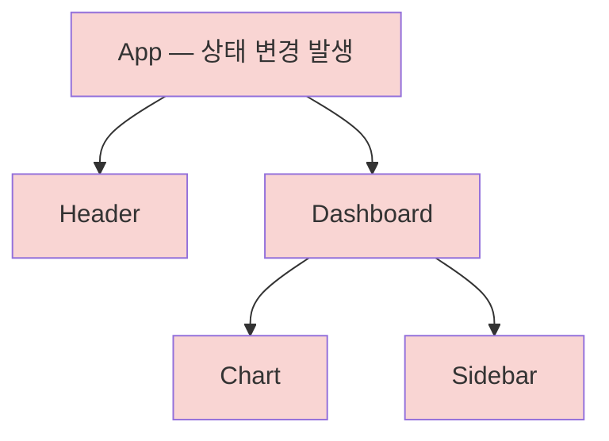
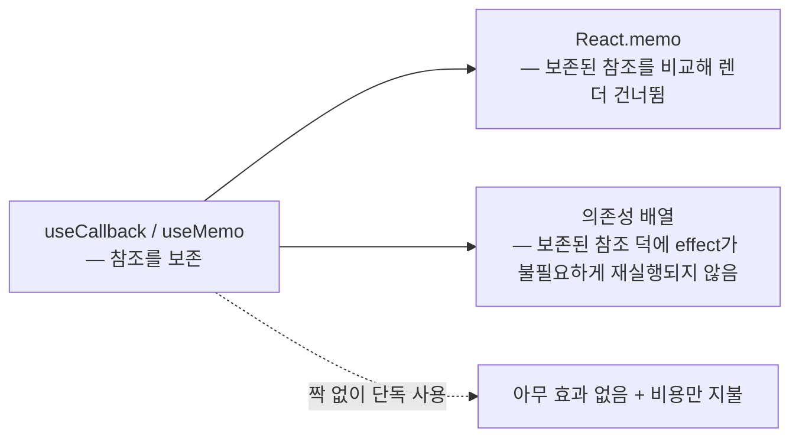

<Callout type="info">
  **이번 문서의 목표:** 컴포넌트가 다시 렌더링되는 원인을 트리와 참조 동일성 관점에서 정확히 추적하고, `React.memo`·`useMemo`·`useCallback`을 "필요한 자리에만" 적용하며, 오히려 빼야 하는 상황을 스스로 판별할 수 있다.
</Callout>

## 왜 "도구"보다 "원인 읽기"가 먼저인가

성능 이야기가 나오면 많은 개발자가 곧바로 `useMemo`와 `useCallback`을 코드 곳곳에 뿌립니다. 그런데 실무 코드 리뷰에서 가장 자주 보이는 장면은 이렇습니다.

- 메모이제이션을 잔뜩 발랐는데 **여전히 느리다** — 원인이 다른 곳에 있었기 때문
- 메모이제이션을 발랐는데 **한 번도 캐시가 적중하지 않는다** — 의존성이 매번 바뀌고 있었기 때문
- 빠르지도 않은데 코드만 **읽기 어려워졌다** — 애초에 최적화가 필요 없던 자리였기 때문

의사가 진단 없이 약부터 처방하지 않듯, 렌더 최적화도 **진단**(왜 렌더됐는가)이 **처방**(어떤 도구를 쓸까)보다 먼저여야 합니다. 그래서 이 편의 앞 절반은 도구가 아니라 "렌더 원인을 읽는 눈"에 씁니다. 렌더-커밋 단계의 기본 모델은 02편에서 정리했으니, 여기서는 그 모델 위에서 **원인 추적**으로 바로 들어갑니다.

## 1. 컴포넌트가 다시 렌더되는 이유는 정확히 두 가지

> **쉽게 말하면:** 렌더는 "내 상태가 바뀌었거나" 또는 "부모가 렌더됐거나" — 이 둘뿐입니다. props가 바뀌어서가 아닙니다.

React에서 함수 컴포넌트가 다시 호출(리렌더, re-render)되는 조건을 정확하게 쓰면 다음 두 가지입니다.

1. **자신의 상태가 바뀌었다** — `useState`의 setter가 새 값으로 호출됨 (구독 중인 Context 값이 바뀐 경우도 여기에 포함)
2. **부모 컴포넌트가 렌더됐다** — 부모가 렌더되면 자식은 **props가 바뀌었든 안 바뀌었든** 기본적으로 함께 렌더된다

여기서 많은 사람이 놀라는 지점이 2번입니다. "props가 안 바뀌면 자식은 렌더 안 되는 것 아니었나?" — 아닙니다. **기본 동작은 부모가 렌더되면 자식도 무조건 렌더**입니다. props 비교는 공짜가 아니기 때문에, React는 기본적으로 비교하지 않고 그냥 다시 호출합니다. "props가 같으면 건너뛰어라"라고 **명시적으로 요청**하는 도구가 바로 뒤에서 배울 `React.memo`입니다.

렌더 전파를 그림으로 보면:



`App`의 상태가 바뀌면 트리 전체가 붉게 물듭니다 — `Header`가 그 상태를 쓰지 않아도, `Sidebar`에 내려가는 props가 하나도 안 바뀌어도 전부 다시 호출됩니다.

### "렌더 = 화면 갱신"이 아니다 — 그래서 대부분은 문제가 아니다

02편에서 본 렌더-커밋 모델을 한 문장으로 복습하면: **렌더**(render)는 함수를 호출해 "이번 화면은 이래야 한다"는 JSX 결과물을 계산하는 단계이고, **커밋**(commit)은 이전 결과와 비교해 **달라진 부분만** 실제 DOM에 반영하는 단계입니다. 부모 때문에 자식이 렌더돼도 결과 JSX가 같으면 DOM은 건드리지 않습니다.

즉 "불필요한 렌더"의 실제 비용은 DOM 조작이 아니라 **함수 호출 + JSX 비교 계산**입니다. 이 비용은 보통 밀리초 미만이라, 컴포넌트 몇십 개가 다시 렌더되는 것은 사용자 입장에서 아무 차이가 없습니다. 문제가 되는 경우는 명확히 한정됩니다.

- 렌더되는 컴포넌트 개수가 **아주 많을 때** (수백–수천 행의 리스트·표·그리드)
- 한 컴포넌트의 렌더 함수 안에 **비싼 계산**이 있을 때 (수만 건 정렬·필터, 복잡한 파생 데이터)
- **매우 자주** 렌더가 일어날 때 (타이핑·드래그·스크롤·애니메이션마다)

이 세 조건 중 어디에도 해당하지 않는다면, 그 리렌더는 최적화 대상이 아니라 React의 정상 동작입니다. "렌더가 일어났다"는 사실 자체를 버그처럼 취급하는 것이 성능 작업에서 가장 흔한 첫 단추 오류입니다.

### 렌더 원인을 눈으로 확인하는 법 — React DevTools Profiler

원인 추적은 감이 아니라 도구로 합니다. 브라우저 확장 **React Developer Tools**의 Profiler 탭에서:

<Steps>

### 녹화 시작

Profiler 탭에서 녹화 버튼을 누르고, 느리다고 느낀 상호작용(타이핑, 클릭 등)을 실제로 수행한 뒤 녹화를 멈춥니다.

### 커밋별 화면 읽기

상호작용 한 번이 만든 커밋들이 막대로 나열됩니다. 막대가 높을수록 그 커밋이 오래 걸린 것입니다. 가장 높은 막대를 클릭합니다.

### 어떤 컴포넌트가, 왜 렌더됐는지 확인

불꽃 그래프(flame graph)에서 색이 칠해진 컴포넌트가 이번에 렌더된 것들입니다. 설정에서 "Record why each component rendered"를 켜두면 각 컴포넌트에 **렌더 이유** — 부모 렌더 때문인지, 특정 props가 바뀌어서인지, 상태·훅이 바뀌어서인지 — 가 표시됩니다.

### 진짜 병목만 골라내기

렌더 시간이 실제로 긴 컴포넌트(수 ms 이상)만 최적화 후보로 남깁니다. 0.1ms짜리 렌더 100개를 없애는 것보다 30ms짜리 렌더 하나를 없애는 게 성능에는 훨씬 큽니다.

</Steps>

> **쉽게 말하면:** Profiler는 렌더의 블랙박스 영상입니다. "누가, 얼마나 오래, 왜"가 다 찍혀 있으니, 최적화는 이 영상을 본 다음에 시작합니다.

## 2. 참조 동일성 — 모든 함정의 뿌리

> **쉽게 말하면:** 자바스크립트에서 객체·배열·함수는 "내용이 같아도" 새로 만들면 다른 값입니다. React의 모든 비교는 이 규칙 위에서 돌아갑니다.

메모이제이션 도구 3형제를 배우기 전에, 그 도구들이 전부 의존하는 단 하나의 개념을 짚어야 합니다 — **참조 동일성**(referential equality, 레퍼런셜 이퀄리티)입니다.

자바스크립트에서 원시 값(숫자, 문자열, 불리언 등)은 내용으로 비교되지만, 객체·배열·함수는 **메모리 주소**(참조, reference)로 비교됩니다.

```js
// 원시 값 — 내용이 같으면 같다
1 === 1;              // true
"abc" === "abc";      // true

// 객체·배열·함수 — 내용이 같아도 "새로 만든 것"은 다르다
[1, 2] === [1, 2];               // false! (서로 다른 배열 두 개)
({ a: 1 }) === ({ a: 1 });       // false!
(() => 1) === (() => 1);         // false!

// 같은 참조를 가리키면 같다
const arr = [1, 2];
const alias = arr;
arr === alias;                   // true
```

이게 왜 React 성능과 직결되냐면 — **함수 컴포넌트는 렌더될 때마다 함수 본문이 처음부터 다시 실행**되기 때문입니다. 본문 안에서 만든 객체 리터럴, 배열 리터럴, 화살표 함수는 렌더마다 **새로운 참조**로 다시 태어납니다.

```jsx
function Parent() {
  const [count, setCount] = useState(0);

  // 아래 세 줄은 Parent가 렌더될 때마다 "완전히 새로운 값"이 된다
  const style = { color: "purple" };          // 매번 새 객체
  const items = ["a", "b"];                   // 매번 새 배열
  const handleClick = () => console.log("!"); // 매번 새 함수

  return <Child style={style} items={items} onClick={handleClick} />;
}
```

`Child` 입장에서 보면, 받는 props의 **내용**은 매번 똑같지만 **참조**는 매번 다릅니다. React의 얕은 비교(shallow comparison, 섀로우 컴패리즌 — 객체 안까지 파고들지 않고 최상위 값들만 `===`로 비교하는 방식) 기준으로는 "props가 바뀌었다"가 되는 거죠. 이 사실이 이 편 후반의 모든 함정 — memo가 안 먹히는 이유, useEffect가 무한 반복되는 이유, 캐시가 적중하지 않는 이유 — 의 공통 뿌리입니다.

비유하자면, 참조 비교는 **책의 내용이 아니라 책의 바코드**를 비교하는 것입니다. 완전히 같은 내용의 책이라도 새로 인쇄하면 바코드가 다릅니다. React는 시간이 없어서 책을 안 읽고 바코드만 스캔합니다 — 그래서 "매번 새로 인쇄해서 건네주는" 코드는 매번 "다른 책이 왔네"로 처리됩니다.

## 3. React.memo — "props가 같으면 건너뛰어라"

### 왜 필요한가

1절에서 봤듯 부모가 렌더되면 자식은 props와 무관하게 렌더됩니다. 자식의 렌더가 비싸다면(큰 리스트, 무거운 차트) "props가 정말 안 바뀌었으면 건너뛰자"고 말하고 싶어집니다. 그 요청이 `React.memo`입니다.

### 정의

`React.memo`는 컴포넌트를 감싸는 **고차 컴포넌트**(HOC, Higher-Order Component — 컴포넌트를 받아 새 컴포넌트를 돌려주는 함수)입니다. 감싼 컴포넌트는 부모가 렌더될 때, **이전 props와 새 props를 얕은 비교**해서 모두 같으면 렌더를 건너뛰고 지난번 렌더 결과를 재사용합니다.

```jsx
const ExpensiveList = React.memo(function ExpensiveList({ items }) {
  console.log("ExpensiveList 렌더!");
  return (
    <ul>
      {items.map((item) => <li key={item.id}>{item.name}</li>)}
    </ul>
  );
});
```

정확히 짚을 점 두 가지:

- memo는 **부모 때문에 일어나는 렌더**만 막습니다. 감싼 컴포넌트 **자신의 상태**가 바뀌거나 구독 중인 Context가 바뀌면 당연히 렌더됩니다.
- 비교는 **얕은 비교**입니다 — props 객체의 각 값을 `===`로만 비교합니다. 그래서 2절의 참조 동일성 문제가 그대로 터집니다.

### 눈으로 확인 — memo가 렌더를 막는 순간

아래 실습기에서 입력창에 타이핑해 보세요. 콘솔을 보면 memo 없는 리스트는 키 입력마다 렌더 로그를 찍고, memo 리스트는 조용합니다.

<CodePlayground
  template="react"
  activeFile="/App.js"
  showConsole
  label="타이핑할 때마다 콘솔 확인 — memo가 부모발 렌더를 차단한다"
  files={{
    '/App.js': `import { useState, memo } from "react";

function NormalList({ items }) {
  console.log("NormalList 렌더 (memo 없음)");
  return <p>일반 리스트: {items.join(", ")}</p>;
}

const MemoList = memo(function MemoList({ items }) {
  console.log("MemoList 렌더 (memo 있음)");
  return <p>memo 리스트: {items.join(", ")}</p>;
});

// items를 컴포넌트 바깥에 두어 참조가 항상 같게 만들었다 (핵심!)
const FRUITS = ["사과", "배", "포도"];

export default function App() {
  const [text, setText] = useState("");
  return (
    <div>
      <input
        value={text}
        onChange={(e) => setText(e.target.value)}
        placeholder="여기에 타이핑"
      />
      <NormalList items={FRUITS} />
      <MemoList items={FRUITS} />
    </div>
  );
}`,
  }}
/>

주석에 적었듯 `FRUITS`를 컴포넌트 **바깥**에 둔 것이 핵심입니다. 만약 `App` 본문 안에서 `const fruits = ["사과", "배", "포도"]`로 만들었다면, 타이핑마다 새 배열이 태어나 memo의 얕은 비교가 매번 실패하고 — memo는 있으나 마나가 됩니다. 이것이 실무에서 "memo 발랐는데 왜 계속 렌더되지?"의 90퍼센트를 차지하는 원인이고, 이 구멍을 메우는 도구가 다음의 `useMemo`·`useCallback`입니다.

## 4. useMemo — 값의 참조와 계산을 렌더 사이에 보존한다

### 왜 필요한가

두 가지 상황에서 필요합니다.

1. **비싼 계산 캐싱**: 렌더마다 수만 건 필터·정렬을 다시 하는 것이 아깝다
2. **참조 보존**: 렌더마다 새로 만들어지는 객체·배열 때문에 memo나 의존성 배열이 무력화되는 것을 막고 싶다

### 정의

```jsx
const 결과값 = useMemo(계산함수, 의존성배열);
```

`useMemo`(유즈메모)는 첫 렌더에 계산 함수를 실행해 결과를 기억해 두고, 이후 렌더에서는 **의존성 배열**(dependency array — 이 계산이 참조하는 외부 값들의 목록)의 각 원소를 이전 렌더 때와 `===`로 비교해, **하나도 안 바뀌었으면 계산을 건너뛰고 기억해 둔 값을 그대로** 돌려줍니다. 하나라도 바뀌었으면 다시 계산하고 새 결과를 기억합니다.

```jsx
function ProductPage({ products, keyword }) {
  // products나 keyword가 바뀔 때만 필터를 다시 실행
  const filtered = useMemo(
    () => products.filter((p) => p.name.includes(keyword)),
    [products, keyword]
  );
  return <ProductList items={filtered} />;
}
```

여기서 `filtered`는 의존성이 그대로인 한 **같은 참조**를 유지합니다. 그래서 `ProductList`가 memo로 감싸져 있다면, 이 페이지의 다른 상태(예: 열린 탭)가 바뀌어도 `ProductList`는 렌더를 건너뛸 수 있습니다 — 계산 캐싱과 참조 보존, 두 가지 효과가 동시에 생기는 겁니다.

### 계산이 얼마나 비싸야 "비싼" 건가

공식 문서의 대략적 기준은 **1ms 이상** 걸리는 계산입니다. `console.time`으로 직접 재보면 됩니다.

```js
console.time("filter");
const filtered = products.filter((p) => p.name.includes(keyword));
console.timeEnd("filter"); // filter: 0.05ms 라면 → useMemo 불필요
```

수십 개짜리 배열의 filter·map은 보통 0.01ms 수준입니다. 이런 계산에 useMemo를 씌우는 것은 — 뒤에서 보겠지만 — 이득이 0에 가깝고 비용만 남습니다.

## 5. useCallback — 함수의 참조를 렌더 사이에 보존한다

### 왜 필요한가

memo로 감싼 자식에게 **이벤트 핸들러 함수**를 내려보내는 순간, 3절 실습의 함정이 재현됩니다. 함수도 객체라서 렌더마다 새 참조로 태어나고, memo의 얕은 비교는 "onClick이 바뀌었네"라며 매번 실패합니다.

### 정의

```jsx
const 기억된함수 = useCallback(함수, 의존성배열);
```

`useCallback`(유즈콜백)은 **함수 자체를** 기억해 뒀다가, 의존성이 안 바뀌면 **이전 렌더 때 만든 그 함수 참조를 그대로** 돌려줍니다. 계산 결과를 기억하는 useMemo와 달리, 함수를 실행하지 않고 함수라는 값 자체를 보존한다는 점만 다릅니다. 실제로 `useCallback(fn, deps)`는 `useMemo(() => fn, deps)`와 동등합니다 — 하는 일이 "값 보존"이라는 본질에서 같습니다.

### 3형제가 협력하는 완성형

아래 실습기는 memo + useCallback이 함께 있어야 완성되는 그림입니다. 카운터 버튼을 눌러 보세요 — `TodoInput`은 렌더되지 않습니다. 그 다음 `useCallback`을 지우고 다시 눌러 보면 매번 렌더 로그가 찍힙니다.

<CodePlayground
  template="react"
  activeFile="/App.js"
  showConsole
  label="카운터를 눌러도 TodoInput이 조용한 이유 — useCallback을 지워서 비교해보세요"
  files={{
    '/App.js': `import { useState, useCallback, memo } from "react";

const TodoInput = memo(function TodoInput({ onAdd }) {
  console.log("TodoInput 렌더");
  const [text, setText] = useState("");
  return (
    <div>
      <input value={text} onChange={(e) => setText(e.target.value)} />
      <button onClick={() => { onAdd(text); setText(""); }}>추가</button>
    </div>
  );
});

export default function App() {
  const [todos, setTodos] = useState([]);
  const [count, setCount] = useState(0);

  // useCallback 덕분에 onAdd의 참조가 렌더 사이에 유지된다
  const handleAdd = useCallback((text) => {
    setTodos((prev) => [...prev, text]);
  }, []);

  return (
    <div>
      <button onClick={() => setCount(count + 1)}>
        관계없는 카운터: {count}
      </button>
      <TodoInput onAdd={handleAdd} />
      <ul>
        {todos.map((todo, i) => <li key={i}>{todo}</li>)}
      </ul>
    </div>
  );
}`,
  }}
/>

주목할 디테일: `handleAdd` 안에서 `setTodos(prev => ...)`처럼 **함수형 업데이트**를 썼기 때문에 의존성 배열이 `[]`로 비어 있을 수 있습니다. 만약 `setTodos([...todos, text])`로 썼다면 `todos`를 의존성에 넣어야 하고, 그러면 todos가 바뀔 때마다 함수가 새로 만들어져 보존 효과가 줄어듭니다. **의존성을 줄이는 가장 좋은 방법은 의존 자체를 없애는 코드 형태**를 택하는 것 — 이 감각이 의존성 배열 설계의 핵심입니다.

### 세 도구의 관계 한눈에 정리

| 도구 | 기억하는 것 | 언제 건너뛰나 | 주 용도 |
|------|-----------|--------------|--------|
| `React.memo` | 컴포넌트의 렌더 결과 | props가 얕은 비교로 전부 같을 때 | 부모발 렌더 차단 |
| `useMemo` | 계산 함수의 **결과값** | 의존성이 전부 같을 때 | 비싼 계산 캐싱, 객체·배열 참조 보존 |
| `useCallback` | **함수 자체** | 의존성이 전부 같을 때 | memo 자식·의존성 배열에 넘길 함수의 참조 보존 |

그리고 반드시 기억할 협력 관계: **useMemo·useCallback으로 보존한 참조는, 그것을 받는 쪽에 memo가 있거나 의존성 배열이 있어야 의미가 생깁니다.** memo 없는 일반 자식에게 useCallback으로 만든 함수를 넘겨봤자 자식은 어차피 부모 따라 렌더됩니다 — 보존한 참조를 아무도 비교하지 않기 때문입니다. 이 짝이 맞지 않는 useCallback이 실무 코드에 정말 많습니다.



## 6. 메모이제이션을 쓰지 말아야 할 때

> **쉽게 말하면:** 메모이제이션은 공짜가 아닙니다 — 지불한 비용보다 아낀 비용이 클 때만 넣습니다.

이 편에서 가장 중요한 절입니다. 세 도구는 각각 비용을 청구합니다.

- **메모리 비용**: 이전 값·이전 props·이전 함수를 계속 들고 있어야 한다
- **비교 비용**: 렌더마다 의존성·props를 얕은 비교하는 연산이 추가된다
- **가독성 비용**: 코드가 길어지고, 의존성 배열이라는 관리 대상이 늘어나며, 읽는 사람이 "이게 왜 여기 있지?"를 고민해야 한다

그래서 다음 상황에서는 **넣지 않는 것이 정답**입니다.

**1) 계산이 싸다** — 수십 개 배열의 map, 문자열 몇 개 조합 같은 계산은 useMemo의 비교 비용과 비슷하거나 오히려 쌉니다. 캐시해서 아끼는 것이 0.01ms인데 비교에 0.01ms를 쓰면 남는 게 없습니다.

**2) props가 어차피 매번 바뀐다** — 채팅 메시지처럼 렌더마다 내용이 실제로 달라지는 컴포넌트에 memo를 씌우면, 비교는 매번 실행되고 매번 실패합니다. **항상 지고 시작하는 내기**입니다.

**3) 보존한 참조를 아무도 비교하지 않는다** — 5절 끝에서 본 짝 없는 useCallback. memo 자식도, 의존성 배열도 그 함수를 받지 않는다면 즉시 지워도 됩니다.

**4) 애초에 렌더 구조로 풀 수 있다** — 도구를 꺼내기 전에 검토할 두 가지 구조적 해법이 있습니다.

첫째, **상태 내리기**(state colocation, 02편). 상태를 실제로 쓰는 가장 작은 컴포넌트로 내리면, 상태 변경 시 렌더되는 범위 자체가 줄어듭니다. 검색창의 입력 상태가 페이지 최상단에 있으면 타이핑마다 페이지 전체가 렌더되지만, 검색창 컴포넌트 안으로 내리면 검색창만 렌더됩니다 — memo 한 줄 없이요.

둘째, **children 패턴**. 상태를 가진 컴포넌트가 무거운 부분을 children으로 받으면, 그 children은 부모의 상태 변경에 영향을 받지 않습니다.

```jsx
// 개선 전: ThemeWrapper의 상태가 바뀌면 ExpensiveTree도 매번 렌더
function ThemeWrapper() {
  const [dark, setDark] = useState(false);
  return (
    <div className={dark ? "dark" : "light"}>
      <button onClick={() => setDark(!dark)}>테마 전환</button>
      <ExpensiveTree />
    </div>
  );
}

// 개선 후: ExpensiveTree를 children으로 받는다
function ThemeWrapper({ children }) {
  const [dark, setDark] = useState(false);
  return (
    <div className={dark ? "dark" : "light"}>
      <button onClick={() => setDark(!dark)}>테마 전환</button>
      {children}
    </div>
  );
}
// 사용: <ThemeWrapper><ExpensiveTree /></ThemeWrapper>
```

개선 후가 렌더를 건너뛰는 원리는 정확히 참조 동일성입니다. `children`으로 넘어온 `<ExpensiveTree />`라는 JSX 값은 **ThemeWrapper의 부모**가 만든 것이라, ThemeWrapper가 자기 상태 때문에 다시 렌더돼도 그 JSX 참조는 그대로입니다. React는 "지난번과 같은 JSX 참조네"라며 그 서브트리 렌더를 건너뜁니다. 01편에서 배운 합성이 그대로 성능 도구가 되는 장면입니다.

<Callout type="warning">
  **자주 틀리는 점:** "일단 다 감싸두면 손해는 없겠지"는 틀린 직감입니다. 모든 곳의 메모이제이션은 모든 곳의 비교 비용 + 관리해야 할 의존성 배열 + 떨어진 가독성을 의미합니다. 기본값은 "안 쓴다"이고, Profiler로 확인된 병목에만 예외적으로 씁니다. 참고로 React 팀은 이 판단 자체를 컴파일러가 자동화하는 React Compiler를 만들고 있습니다 — 도구가 자동화될 정도로 "기계적 판단"이라는 뜻이자, 사람이 손으로 할 때는 실수하기 쉽다는 뜻입니다.
</Callout>

### 실전 판단 순서

성능 문제가 의심될 때의 실제 작업 순서를 정리합니다.

<Steps>

### 측정 — Profiler로 병목 확인

느린 상호작용을 녹화해 어떤 컴포넌트가 오래·자주 렌더되는지 확인합니다. 측정 없이 시작하지 않습니다.

### 구조 — 상태 내리기·children 패턴 검토

상태 위치를 옮기거나 합성 구조를 바꿔 렌더 범위 자체를 줄일 수 있는지 먼저 봅니다. 구조로 풀리면 도구가 필요 없습니다.

### 도구 — memo부터, 그다음 참조 보존

구조로 안 풀리는 병목에만 memo를 씌우고, Profiler에서 여전히 렌더된다면 어떤 props의 참조가 바뀌는지 확인해 useMemo·useCallback으로 그 참조를 보존합니다.

### 재측정 — 실제로 나아졌는지 확인

같은 상호작용을 다시 녹화해 전후를 비교합니다. 차이가 없으면 되돌립니다 — 효과 없는 최적화 코드는 부채입니다.

</Steps>

## 핵심 정리

- 리렌더의 원인은 **자신의 상태 변경** 또는 **부모의 렌더** 두 가지뿐이며, 부모가 렌더되면 자식은 props와 무관하게 기본적으로 함께 렌더된다.
- 객체·배열·함수는 렌더마다 **새 참조**로 태어난다 — 이 참조 동일성이 memo 무력화, 캐시 미스, effect 재실행의 공통 뿌리다.
- `React.memo`는 props 얕은 비교로 부모발 렌더를 건너뛰고, `useMemo`는 계산 결과와 참조를, `useCallback`은 함수 참조를 의존성이 같은 동안 보존한다 — 보존된 참조는 **비교하는 짝**(memo, 의존성 배열)이 있어야 의미가 있다.
- 메모이제이션은 메모리·비교·가독성 비용을 청구한다 — 기본값은 "안 쓴다"이고, Profiler로 확인된 병목에만 쓴다.
- 도구보다 구조가 먼저다 — 상태 내리기와 children 합성으로 렌더 범위 자체를 줄일 수 있는지 항상 먼저 검토한다.

## 마무리 복습

<Quiz
  questionNumber={1}
  question="React에서 함수 컴포넌트가 다시 렌더링되는 원인을 정확히 나열한 것은?"
  options={['props가 바뀔 때만', '자신의 상태 변경 또는 부모의 렌더', 'DOM이 바뀔 때만', '의존성 배열이 바뀔 때만']}
  correctAnswer={2}
  explanation="리렌더의 원인은 자신의 상태(구독한 Context 포함) 변경과 부모의 렌더 두 가지다. props 변경은 부모 렌더의 결과로 함께 전달될 뿐, 부모가 렌더되면 props가 그대로여도 자식은 기본적으로 렌더된다."
  optionExplanations={['부모가 렌더되면 props가 안 바뀌어도 자식은 기본적으로 렌더된다', '정답 — 이 두 가지가 리렌더의 전부다', 'DOM 반영은 렌더의 결과인 커밋 단계이지 렌더의 원인이 아니다', '의존성 배열은 훅의 재실행 여부를 정하는 장치이지 컴포넌트 렌더의 원인이 아니다']}
/>

<Quiz
  questionNumber={2}
  question="자바스크립트에서 [1,2] === [1,2]가 false인 이유는?"
  options={['배열은 비교 연산이 금지되어 있어서', '두 배열이 서로 다른 참조를 가진 별개의 객체라서', '=== 대신 ==를 써야 해서', '배열 길이가 달라서']}
  correctAnswer={2}
  explanation="객체·배열·함수는 내용이 아니라 참조로 비교된다. 리터럴로 두 번 만들면 메모리에 별개의 배열 두 개가 생기므로 내용이 같아도 다른 값이다."
  optionExplanations={['비교 자체는 가능하며 참조를 비교한다', '정답 — 참조 동일성이 React 얕은 비교의 기반이다', '==로 비교해도 객체는 참조 비교라 여전히 false다', '길이와 내용은 완전히 같다 — 참조가 다를 뿐이다']}
/>

<Quiz
  questionNumber={3}
  question="React.memo에 대한 설명으로 옳은 것은?"
  options={['감싼 컴포넌트의 모든 렌더를 영구히 막는다', '부모가 렌더될 때 props를 얕은 비교해 같으면 렌더를 건너뛴다', 'props를 깊은 비교하므로 새 객체를 넘겨도 항상 건너뛴다', '자신의 상태 변경에 의한 렌더도 막아준다']}
  correctAnswer={2}
  explanation="memo는 부모발 렌더에 한해 이전 props와 새 props를 얕은 비교하고, 전부 같으면 이전 렌더 결과를 재사용한다. 자신의 상태나 Context 변경에 의한 렌더는 막지 못하며, 비교는 얕은 비교라 참조가 바뀌면 실패한다."
  optionExplanations={['자신의 상태·Context 변경 시에는 정상적으로 렌더된다', '정답 — 부모발 렌더 + 얕은 비교가 memo의 정확한 정의다', '얕은 비교이므로 내용이 같아도 참조가 다르면 렌더된다', '상태 변경에 의한 렌더는 memo와 무관하게 일어난다']}
/>

<Quiz
  questionNumber={4}
  question="memo로 감싼 자식에게 부모가 렌더 본문 안에서 만든 화살표 함수를 onClick으로 넘기면 어떻게 되는가?"
  options={['memo가 함수 내용을 비교해 렌더를 건너뛴다', '렌더마다 새 함수 참조가 넘어와 얕은 비교가 실패하고 memo가 무력화된다', '빌드 에러가 발생한다', 'React가 자동으로 useCallback을 적용한다']}
  correctAnswer={2}
  explanation="함수도 객체이므로 렌더마다 새 참조로 만들어진다. memo의 얕은 비교는 onClick이 매번 바뀌었다고 판단해 렌더를 건너뛰지 못한다. 이때 useCallback으로 함수 참조를 보존해야 memo가 작동한다."
  optionExplanations={['얕은 비교는 함수 내용을 읽지 않고 참조만 비교한다', '정답 — 짝 없는 memo가 무력화되는 대표 패턴이다', '문법적으로 완전히 유효한 코드라 에러는 없다', 'React는 메모이제이션을 자동 적용하지 않는다 — React Compiler가 별도로 그 역할을 목표한다']}
/>

<Quiz
  questionNumber={5}
  question="useMemo와 useCallback의 차이를 가장 정확히 설명한 것은?"
  options={['useMemo는 계산 함수의 결과값을, useCallback은 함수 자체를 기억한다', 'useMemo는 컴포넌트를, useCallback은 값을 기억한다', 'useCallback은 의존성 배열이 필요 없다', '둘은 완전히 다른 원리로 동작한다']}
  correctAnswer={1}
  explanation="useMemo는 계산 함수를 실행한 결과값을 캐싱하고, useCallback은 함수를 실행하지 않은 채 함수 참조 자체를 보존한다. useCallback(fn, deps)는 useMemo(() =&gt; fn, deps)와 동등하다."
  optionExplanations={['정답 — 결과값 보존 vs 함수 참조 보존의 차이다', '컴포넌트 렌더 결과를 기억하는 것은 React.memo다', '둘 다 의존성 배열로 재계산·재생성 여부를 정한다', '본질은 같다 — 의존성이 같으면 이전 값을 돌려주는 동일한 원리다']}
/>

<Quiz
  questionNumber={6}
  question="다음 중 메모이제이션을 넣지 말아야 할 상황은?"
  options={['수만 건 배열의 정렬 결과를 여러 렌더에서 재사용할 때', '수십 개짜리 배열의 map 결과를 memo 없는 자식에게 넘길 때', 'memo 자식에게 내려가는 핸들러의 참조를 보존할 때', 'Profiler에서 수십 ms 렌더가 확인된 리스트를 감쌀 때']}
  correctAnswer={2}
  explanation="계산이 싸고 보존한 참조를 비교할 짝(memo나 의존성 배열)도 없는 자리라면, 메모이제이션은 비교·메모리·가독성 비용만 남긴다. 나머지 보기는 모두 측정되었거나 짝이 있는 적절한 사용처다."
  optionExplanations={['비싼 계산의 캐싱은 useMemo의 대표 용도다', '정답 — 싼 계산 + 비교할 짝 없음은 비용만 내는 자리다', 'memo 자식과 짝을 이루는 useCallback은 올바른 조합이다', '측정으로 확인된 병목은 정당한 최적화 대상이다']}
/>

<Quiz
  questionNumber={7}
  question="상태를 가진 래퍼 컴포넌트가 무거운 서브트리를 children으로 받으면 래퍼의 상태 변경 시 children이 렌더되지 않는 이유는?"
  options={['children은 특수 prop이라 React가 렌더를 금지해서', 'children의 JSX가 래퍼의 부모에서 만들어져 래퍼가 렌더돼도 그 JSX 참조가 그대로이기 때문', 'children이 자동으로 memo 처리되기 때문', '래퍼의 상태가 children에게 전달되지 않아 렌더할 이유가 없어서']}
  correctAnswer={2}
  explanation="children으로 전달된 JSX는 래퍼의 부모가 만든 값이다. 래퍼가 자기 상태 때문에 다시 렌더돼도 그 JSX 참조는 변하지 않으므로 React가 해당 서브트리 렌더를 건너뛴다. 합성 구조가 그대로 성능 도구가 되는 사례다."
  optionExplanations={['children은 평범한 prop이며 렌더 금지 같은 특수 규칙은 없다', '정답 — 참조 동일성이 유지되는 위치에서 JSX가 만들어지는 것이 핵심이다', '자동 memo 처리는 없다 — 참조가 같아서 건너뛰는 것이다', '전달 여부가 아니라 JSX 참조의 동일성이 건너뜀의 근거다']}
/>

<Quiz
  questionNumber={8}
  question="성능 문제가 의심될 때 올바른 작업 순서는?"
  options={['모든 컴포넌트를 memo로 감싼 뒤 문제를 관찰한다', 'Profiler로 측정하고, 상태 위치·합성 구조 개선을 검토한 뒤, 남은 병목에만 도구를 적용하고 재측정한다', 'useCallback을 전부 적용한 뒤 느린 부분만 되돌린다', '렌더 횟수를 0으로 만드는 것을 목표로 최적화한다']}
  correctAnswer={2}
  explanation="측정 → 구조 개선 → 도구 적용 → 재측정 순서가 정석이다. 측정 없는 전면 적용은 비용만 늘리고, 렌더 자체는 React의 정상 동작이므로 횟수 0이 목표가 될 수 없다."
  optionExplanations={['전면 적용은 비교 비용과 관리 부담만 늘리는 안티패턴이다', '정답 — 진단이 처방보다 먼저다', '적용 후 되돌리기는 순서가 거꾸로라 낭비가 크다', '렌더는 정상 동작이며 문제는 비싸거나 과도하게 잦은 렌더뿐이다']}
/>

## 참고 자료

- [React 공식 문서 - Render and Commit](https://react.dev/learn/render-and-commit)
- [DebugBear - Improve React Performance With useMemo And useCallback](https://www.debugbear.com/blog/react-usememo-usecallback)
- [GeeksforGeeks - Optimizing Performance with useMemo and useCallback Hooks](https://www.geeksforgeeks.org/reactjs/optimizing-performance-with-usememo-and-usecallback-hooks/)
- [Medium - React Performance Optimization: memo, useCallback, useMemo Simplified](https://medium.com/@mkgwar/react-performance-optimization-memo-usecallback-usememo-simplified-40f28edecfba)
