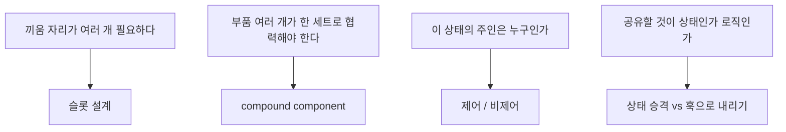
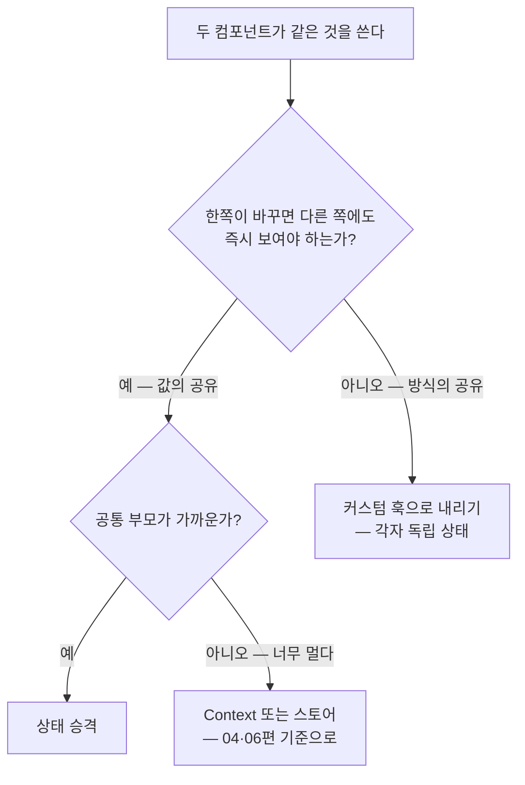

<Callout type="info">
  **이번 문서의 목표:** 실무에서 반복 등장하는 합성 패턴 네 가지 — 슬롯 설계, compound component, 제어/비제어, 상태 배치 판단 — 를 손에 익혀, "props를 늘릴까, 구조를 바꿀까"의 갈림길에서 근거 있는 선택을 할 수 있다.
</Callout>

## 이 편의 위치 — 사고방식에서 패턴으로

01편에서 우리는 "상속이 아니라 합성"이라는 **사고방식**을 세웠습니다. 이 편은 그 사고방식이 실무에서 굳어진 **패턴**들을 다룹니다. 패턴(pattern)이란 같은 문제를 여러 사람이 반복해서 풀다가 정착된 "검증된 해법의 모양"입니다. 패턴을 알면 두 가지가 좋아집니다 — 문제를 만났을 때 바퀴를 다시 발명하지 않아도 되고, 팀원과 "이건 compound로 가자" 한마디로 설계를 공유할 수 있습니다.

네 패턴이 각각 어떤 질문에 답하는지 지도를 먼저 그립니다.



## 1. 슬롯 설계 — props 폭발을 끝내는 첫 번째 도구

### 왜 필요한가 — 어느 Modal의 성장사

실무 컴포넌트가 어떻게 망가지는지, 흔한 성장 과정을 따라가 봅시다. 처음엔 소박했습니다.

```jsx
<Modal title="삭제 확인" body="정말 삭제할까요?" />
```

그런데 요구사항이 옵니다. "제목 옆에 아이콘을", "본문에 굵은 글씨를", "버튼을 두 개로", "버튼 위치를 왼쪽으로", "닫기 버튼은 숨겨서"… 6개월 뒤:

```jsx
<Modal
  title="삭제 확인"
  titleIcon="warning"
  body="정말 삭제할까요?"
  bodyBold
  showCloseButton={false}
  primaryButtonText="삭제"
  secondaryButtonText="취소"
  buttonAlign="left"
  onPrimaryClick={handleDelete}
  onSecondaryClick={handleClose}
/>
```

props가 10개를 넘었는데도 "본문에 이미지를 넣어달라"는 다음 요구를 못 받습니다. `body`가 문자열이라서요. 이 증상의 이름이 **props 폭발**(props explosion)이고, 원인은 하나입니다 — **Modal이 내용물의 모든 변형을 자기 props로 흡수하려 했기** 때문입니다.

### 처방 — 내용물의 소유권을 사용하는 쪽에 돌려준다

01편에서 배운 슬롯(slot)을 실전 강도로 적용하면, Modal은 "틀"만 소유하고 내용물은 통째로 밖에서 받습니다.

```jsx
<Modal onClose={handleClose}>
  <Modal.Header>
    <WarningIcon /> 삭제 확인
  </Modal.Header>
  <Modal.Body>
    <p>정말 <b>영구히</b> 삭제할까요?</p>
    
  </Modal.Body>
  <Modal.Footer align="left">
    <button onClick={handleDelete}>삭제</button>
    <button onClick={handleClose}>취소</button>
  </Modal.Footer>
</Modal>
```

이미지든 굵은 글씨든 버튼 세 개든, Modal은 더 이상 알 필요가 없습니다. **변형이 생겨도 Modal의 코드는 한 줄도 안 바뀝니다.** 새 요구사항의 비용이 "Modal 수정 + 전체 회귀 테스트"에서 "사용하는 자리에서 JSX 몇 줄"로 줄어드는 것 — 이것이 슬롯 설계의 실질적 이득입니다.

그런데 위 코드에는 새로운 문법이 보입니다. `Modal.Header`처럼 점으로 연결된 하위 컴포넌트들 — 이것이 바로 두 번째 패턴입니다.

## 2. Compound Component — 한 세트로 협력하는 부품들

> **쉽게 말하면:** `select`와 `option`처럼 "따로 쓰면 의미가 없고, 함께 쓰면 알아서 협력하는" 컴포넌트 세트를 만드는 패턴입니다.

### 왜 필요한가

HTML을 떠올려 보세요. `select` 태그와 `option` 태그는 별개의 태그지만 한 몸처럼 움직입니다 — option을 클릭하면 select가 알아서 값을 바꾸고, 우리는 둘 사이에 어떤 연결 코드도 쓰지 않습니다. **부모가 상태를 관리하고 자식들이 암묵적으로 그 상태에 접근하는** 이 관계를 React 컴포넌트로 재현한 것이 **compound component**(컴파운드 컴포넌트, 복합 컴포넌트) 패턴입니다.

대표 사례는 탭(tabs)입니다. 탭 UI는 "현재 어떤 탭이 열렸나"라는 상태를 탭 버튼들과 패널들이 **공유**해야 합니다. 이걸 props로 풀면 사용자가 배선을 다 해야 합니다.

```jsx
// 배선을 사용자에게 떠넘긴 버전 — activeIndex를 직접 만들고 모든 곳에 꽂아야 한다
const [activeIndex, setActiveIndex] = useState(0);
<TabButtons active={activeIndex} onChange={setActiveIndex} labels={["소개", "리뷰"]} />
<TabPanel show={activeIndex === 0}>소개 내용</TabPanel>
<TabPanel show={activeIndex === 1}>리뷰 내용</TabPanel>
```

compound 패턴은 이 배선을 **패턴 내부로 숨깁니다**. 사용자는 구조만 선언합니다.

```jsx
<Tabs defaultIndex={0}>
  <Tabs.List>
    <Tabs.Tab index={0}>소개</Tabs.Tab>
    <Tabs.Tab index={1}>리뷰</Tabs.Tab>
  </Tabs.List>
  <Tabs.Panel index={0}>소개 내용</Tabs.Panel>
  <Tabs.Panel index={1}>리뷰 내용</Tabs.Panel>
</Tabs>
```

### 구현 원리 — Context가 보이지 않는 배선이 된다

부모(`Tabs`)와 자식들(`Tab`, `Panel`) 사이에 상태를 공유해야 하는데, 자식이 트리의 어느 깊이에 있을지 모릅니다. props로는 못 꽂죠. 이럴 때 쓰는 것이 04편에서 지도를 그린 **Context**입니다 — 부모가 Provider로 상태를 깔아두면, 자식들이 깊이와 무관하게 `useContext`로 꺼내 씁니다. compound 패턴은 "라이브러리 내부용 Context"의 대표 사용처입니다.

<CodePlayground
  template="react"
  activeFile="/App.js"
  label="compound Tabs 완성본 — 탭을 클릭해 보고, Tab과 Panel을 추가해 보세요"
  files={{
    '/App.js': `import { createContext, useContext, useState } from "react";

// 1) 보이지 않는 배선 — 세트 내부 전용 Context
const TabsContext = createContext(null);

// 2) 부모: 상태를 소유하고 Provider로 깔아준다
function Tabs({ defaultIndex, children }) {
  const [active, setActive] = useState(defaultIndex);
  return (
    <TabsContext.Provider value={{ active, setActive }}>
      <div>{children}</div>
    </TabsContext.Provider>
  );
}

// 3) 자식들: 깊이와 무관하게 Context에서 상태를 꺼내 협력한다
function TabList({ children }) {
  return <div style={{ display: "flex", gap: 8 }}>{children}</div>;
}

function Tab({ index, children }) {
  const { active, setActive } = useContext(TabsContext);
  const isActive = active === index;
  return (
    <button
      onClick={() => setActive(index)}
      style={{
        padding: "6px 12px",
        fontWeight: isActive ? "bold" : "normal",
        borderBottom: isActive ? "3px solid #7c6df2" : "3px solid transparent",
      }}
    >
      {children}
    </button>
  );
}

function TabPanel({ index, children }) {
  const { active } = useContext(TabsContext);
  if (active !== index) return null;
  return <div style={{ padding: 12 }}>{children}</div>;
}

// 4) 점 표기로 세트임을 드러낸다
Tabs.List = TabList;
Tabs.Tab = Tab;
Tabs.Panel = TabPanel;

export default function App() {
  return (
    <Tabs defaultIndex={0}>
      <Tabs.List>
        <Tabs.Tab index={0}>소개</Tabs.Tab>
        <Tabs.Tab index={1}>리뷰</Tabs.Tab>
        <Tabs.Tab index={2}>문의</Tabs.Tab>
      </Tabs.List>
      <Tabs.Panel index={0}>제품 소개 내용입니다.</Tabs.Panel>
      <Tabs.Panel index={1}>구매자 리뷰 목록입니다.</Tabs.Panel>
      <Tabs.Panel index={2}>문의 폼이 들어갑니다.</Tabs.Panel>
    </Tabs>
  );
}`,
  }}
/>

구현에서 짚을 디테일 세 가지:

- **`Tabs.List = TabList`** — 점 표기(dot notation)는 기능이 아니라 **표현**입니다. 자바스크립트에서 함수도 객체라 속성을 붙일 수 있다는 사실을 이용해 "이 부품들은 Tabs 세트의 일부"라는 소속을 이름으로 드러내는 관례입니다. 별도 export로 해도 동작은 같습니다.
- **Context가 세트 내부에 캡슐화** — `TabsContext`는 export하지 않습니다. 사용자는 Context의 존재조차 몰라야 하고, 그래서 이 Context는 앱 전역 상태(06편)와는 역할이 완전히 다릅니다.
- **자식이 세트 밖에서 쓰이면?** — `Tabs` 없이 `Tabs.Tab`만 렌더하면 `useContext`가 `null`을 받아 터집니다. 실무 라이브러리들은 이때 "Tab은 Tabs 안에서 사용하세요"라는 친절한 에러를 던지도록 방어 코드를 넣습니다.

### 이 패턴의 비용 — 만능이 아니다

compound는 유연함을 주지만 대가가 있습니다. 사용자가 구조를 자유롭게 쓸 수 있다는 것은 **잘못된 구조로도 쓸 수 있다**는 뜻입니다(패널만 있고 탭이 없다든가). 또 단순한 요구에는 과합니다 — 변형이 두세 가지뿐인 컴포넌트라면 props 몇 개가 더 낫습니다. 판단 기준: **"사용처마다 구조·순서·구성이 달라질 컴포넌트인가?"** 예(디자인 시스템의 Modal·Dropdown·Accordion)라면 compound, 아니오(우리 팀만 쓰는 단순 배지)라면 props.

## 3. 제어 vs 비제어 — 이 상태의 주인은 누구인가

> **쉽게 말하면:** 제어 컴포넌트는 "부모가 값을 소유하고 매 순간 지시하는" 방식, 비제어는 "컴포넌트가 알아서 값을 들고 있고 필요할 때만 물어보는" 방식입니다.

### 폼에서 출발한 용어

이 용어는 원래 폼 입력에서 나왔습니다. react_1에서 배운 제어 입력을 한 문장으로 복습하면 — `value`와 `onChange`를 모두 연결해 **React 상태가 입력값의 유일한 원천**이 되게 하는 방식입니다.

```jsx
// 제어(controlled): React 상태가 주인. 화면의 값 = state, 항상 일치
const [name, setName] = useState("");
<input value={name} onChange={(e) => setName(e.target.value)} />

// 비제어(uncontrolled): DOM이 주인. 필요할 때 ref로 물어본다
const inputRef = useRef(null);
<input ref={inputRef} defaultValue="" />
// 제출 시점에만: inputRef.current.value
```

제어 방식은 타이핑 순간마다 검증·변환·연동이 가능하지만 키 입력마다 렌더가 일어나고, 비제어 방식은 렌더 비용이 0이지만 실시간 개입이 불가능합니다. 폼에서의 선택 기준은 "입력 도중에 React가 개입할 일이 있는가"입니다.

### 중급의 확장 — 컴포넌트 설계 전반의 질문이 된다

이 개념이 중급에서 중요한 이유는, **모든 상태 있는 컴포넌트 설계에 같은 질문이 적용**되기 때문입니다. 2절의 Tabs를 다시 보세요. `defaultIndex`를 받아 상태를 **Tabs가 스스로** 관리했습니다 — 이건 **비제어** 설계입니다. 쓰기 편하지만, 이런 요구가 오면 막힙니다: "URL 쿼리와 탭을 동기화해 주세요" — 탭 상태의 주인이 Tabs 내부라서 밖에서 손댈 수가 없습니다.

그래서 실무 라이브러리 컴포넌트들은 **두 모드를 모두** 지원하는 관례를 따릅니다.

```jsx
// 비제어 모드: 내부 상태 사용, 초깃값만 받는다
<Tabs defaultIndex={0} />

// 제어 모드: 부모 상태가 주인, Tabs는 지시대로 표시하고 변경 의사만 보고한다
<Tabs index={tabFromUrl} onIndexChange={syncToUrl} />
```

구현 골격은 "제어 prop이 들어왔으면 그걸 쓰고, 아니면 내부 상태를 쓴다"입니다.

```jsx
function Tabs({ index, defaultIndex, onIndexChange, children }) {
  const [internal, setInternal] = useState(defaultIndex);
  const isControlled = index !== undefined; // 제어 prop의 존재로 모드 판정
  const active = isControlled ? index : internal;

  const setActive = (next) => {
    if (!isControlled) setInternal(next); // 비제어일 때만 내부 상태 갱신
    if (onIndexChange) onIndexChange(next); // 어느 모드든 변경 의사는 보고
  };
  // ...이하 동일
}
```

<Callout type="warning">
  **자주 틀리는 점:** 한 컴포넌트 인스턴스가 **도중에 모드를 바꾸면 안 됩니다.** 처음엔 index 없이(비제어) 쓰다가 나중에 index를 넣으면(제어 전환) 상태의 주인이 바뀌면서 값이 튀고, React도 input에 대해 같은 상황에서 경고를 출력합니다. 흔한 원인은 제어 모드로 쓰려던 값이 초기 렌더에 undefined였다가 나중에 채워지는 경우입니다 — 제어로 쓸 거라면 첫 렌더부터 확정된 값을 넣어야 합니다.
</Callout>

## 4. 상태 승격 vs 훅으로 내리기 — 공유할 것이 무엇인지 먼저 묻는다

### 왜 헷갈리는가

두 컴포넌트가 "같은 것"을 써야 할 때 중급 개발자가 갈림길에 섭니다 — 상태를 공통 부모로 올릴까(**상태 승격**, lifting state up), 커스텀 훅으로 뽑아 각자 쓸까? 둘 다 "공유"처럼 보여서 헷갈리지만, 공유되는 것이 근본적으로 다릅니다.

- **상태 승격**: **상태 그 자체**(값)를 공유한다 — 두 컴포넌트가 **같은 순간 같은 값**을 본다
- **커스텀 훅**: **로직**(레시피)을 공유한다 — 훅을 호출한 컴포넌트마다 **각자의 독립된 상태**가 생긴다 (03편에서 세운 구분)

비유하면, 상태 승격은 **하나의 공용 냉장고**를 거실에 두는 것이고, 커스텀 훅은 **냉장고 설계도**를 나눠 갖고 각자 자기 냉장고를 들이는 것입니다. 설계도를 공유해도 내 냉장고에 넣은 우유가 남의 냉장고에 나타나지는 않습니다.

### 판단 절차



구체 사례로 확인합니다.

**사례 1 — 검색창과 결과 목록**: 검색어를 입력하면 목록이 즉시 걸러져야 합니다. 한쪽의 변경이 다른 쪽에 보여야 하죠 — **값의 공유**이므로 검색어 상태를 두 컴포넌트의 공통 부모로 **승격**합니다.

```jsx
function SearchPage() {
  const [keyword, setKeyword] = useState(""); // 승격된 상태 — 유일한 원천
  return (
    <div>
      <SearchInput value={keyword} onChange={setKeyword} />
      <ResultList keyword={keyword} />
    </div>
  );
}
```

승격하면 `SearchInput`은 자연스럽게 3절의 **제어 컴포넌트**가 됩니다 — 상태 승격과 제어 패턴은 사실 한 동작의 양면입니다. 상태를 올리는 순간, 아래 컴포넌트는 값을 지시받는 처지가 되니까요.

**사례 2 — 서로 다른 페이지의 입력 폼 두 개**: 회원가입 폼과 프로필 수정 폼이 둘 다 "입력값 관리 + 검증 + 에러 표시" 로직을 씁니다. 하지만 회원가입 폼에 타이핑한 값이 프로필 폼에 나타나면 안 되죠 — **방식의 공유**이므로 `useForm` 같은 커스텀 훅으로 내립니다. 각 폼은 훅을 호출해 자기만의 독립 상태를 갖습니다.

**흔한 실패**: 방식만 공유하면 되는데 값을 승격해 버리는 경우입니다. "여러 곳에서 쓰니까 일단 위로, 더 위로" 올리다 보면 최상위 컴포넌트가 온갖 상태의 집하장이 되고, 그 상태가 바뀔 때마다 트리 전체가 렌더됩니다(10편에서 진단한 바로 그 증상). **승격은 "동기화가 필요하다"는 증거가 있을 때만, 필요한 최소 높이까지만** — 02편의 상태 내리기 원칙과 같은 저울의 양팔입니다.

## 5. 네 패턴을 하나의 흐름으로 — 미니 설계 연습

배운 것을 종합해 봅니다. 요구사항: "상품 필터 패널 — 카테고리 선택과 가격 범위 입력이 있고, 선택 결과에 따라 목록이 즉시 갱신되며, 패널의 레이아웃은 페이지마다 다르다."

1. "목록이 즉시 갱신" → 필터 값과 목록의 **동기화** 필요 → 필터 상태를 페이지로 **승격** (4절)
2. "레이아웃이 페이지마다 다르다" → FilterPanel이 구조를 고정하면 안 됨 → `FilterPanel.Category`, `FilterPanel.PriceRange`의 **compound** 세트로 (2절)
3. FilterPanel은 승격된 상태를 지시받아야 함 → `value`/`onChange`를 받는 **제어** 설계로 (3절)
4. "입력값 검증 로직"이 다른 폼에서도 필요해짐 → 값이 아니라 방식의 공유 → **커스텀 훅**으로 분리 (4절)

한 컴포넌트에 네 패턴이 자연스럽게 겹쳐 들어가는 것 — 이것이 실무 설계의 실제 모습입니다. 패턴은 골라 쓰는 옵션이 아니라, 각 질문("구멍이 몇 개인가", "주인이 누구인가", "공유할 것이 값인가 방식인가")에 대한 답이 쌓여 만들어지는 결과물입니다. 그리고 12편에서는 이 흐름의 끝판 — 로직과 표시를 완전히 분리하는 headless 패턴 — 으로 이어집니다.

## 핵심 정리

- **props 폭발**은 틀이 내용물의 모든 변형을 흡수하려 할 때 생긴다 — 슬롯으로 내용물의 소유권을 사용하는 쪽에 돌려주면 새 요구사항의 비용이 급감한다.
- **compound component**는 부모가 상태를 소유하고 자식들이 내부 Context로 협력하는 세트 패턴이다 — 사용처마다 구조가 달라지는 컴포넌트에 적합하고, 단순한 컴포넌트에는 과하다.
- **제어/비제어**는 "상태의 주인이 부모인가 컴포넌트 자신인가"의 질문이며, 실무 라이브러리는 두 모드를 모두 지원하되 한 인스턴스가 도중에 모드를 바꾸는 것은 금지다.
- **상태 승격**은 값의 공유(동기화), **커스텀 훅**은 방식의 공유(독립 상태) — 무엇을 공유하는지 먼저 물어야 갈림길이 풀린다.
- 승격은 동기화 증거가 있을 때만, 필요한 최소 높이까지만 — 과잉 승격은 10편의 렌더 문제로 직결된다.

## 마무리 복습

<Quiz
  questionNumber={1}
  question="props 폭발의 근본 원인으로 가장 알맞은 것은?"
  options={['props 이름을 잘못 지어서', '틀 컴포넌트가 내용물의 모든 변형을 자기 props로 흡수하려 해서', 'TypeScript를 쓰지 않아서', '컴포넌트 파일이 너무 길어서']}
  correctAnswer={2}
  explanation="변형 요구가 올 때마다 props를 추가하면 틀이 모든 변형의 책임을 떠안게 된다. 슬롯으로 내용물의 소유권을 사용하는 쪽에 돌려주면 틀은 변형과 무관해진다."
  optionExplanations={['이름의 문제가 아니라 책임 배분의 문제다', '정답 — 변형의 책임이 틀에 쌓이는 구조가 원인이다', '타입은 폭발을 문서화해줄 뿐 막아주지 않는다', '파일 길이는 증상일 수는 있어도 원인이 아니다']}
/>

<Quiz
  questionNumber={2}
  question="compound component 패턴에서 부모와 자식들이 상태를 공유하는 통로는?"
  options={['전역 변수', '세트 내부에 캡슐화된 Context', 'localStorage', '각 자식의 독립적인 useState']}
  correctAnswer={2}
  explanation="부모가 Provider로 상태를 깔고 자식들이 useContext로 꺼내 쓴다. 이 Context는 export하지 않아 사용자에게 보이지 않는 내부 배선으로 동작하며, 앱 전역 상태용 Context와는 역할이 다르다."
  optionExplanations={['전역 변수는 렌더와 동기화되지 않아 React 상태 공유 수단이 될 수 없다', '정답 — 깊이와 무관하게 세트 부품을 잇는 보이지 않는 배선이다', 'localStorage는 영속 저장소이지 컴포넌트 간 실시간 상태 통로가 아니다', '각자 독립 상태를 가지면 세트로 협력할 수 없다']}
/>

<Quiz
  questionNumber={3}
  question="Tabs.List = TabList 같은 점 표기에 대한 설명으로 옳은 것은?"
  options={['React가 제공하는 특수 API로, 없으면 compound 패턴이 동작하지 않는다', '함수도 객체라는 성질을 이용해 세트 소속을 이름으로 드러내는 관례일 뿐이다', '자동으로 Context를 연결해주는 문법이다', '성능 최적화를 위한 필수 단계다']}
  correctAnswer={2}
  explanation="자바스크립트 함수는 객체이므로 속성을 붙일 수 있다. 점 표기는 이를 이용해 부품들의 소속을 표현하는 관례이며, 별도 export로 바꿔도 패턴의 동작은 동일하다."
  optionExplanations={['React의 특수 기능이 아니라 순수 자바스크립트다', '정답 — 기능이 아니라 표현의 관례다', 'Context 연결은 Provider와 useContext 코드가 하는 일이다', '성능과는 무관하다']}
/>

<Quiz
  questionNumber={4}
  question="제어 컴포넌트와 비제어 컴포넌트의 차이를 가장 정확히 설명한 것은?"
  options={['제어는 클래스, 비제어는 함수 컴포넌트로 만든다', '제어는 부모의 상태가 값의 주인이고, 비제어는 컴포넌트 내부가 값의 주인이다', '제어는 폼에만, 비제어는 폼 외에만 쓴다', '비제어 컴포넌트는 이벤트를 처리할 수 없다']}
  correctAnswer={2}
  explanation="핵심 질문은 상태의 주인이 누구인가다. 제어는 부모가 value로 지시하고 변경 의사를 보고받으며, 비제어는 내부 상태가 주인이고 초깃값만 받는다. 이 구분은 폼을 넘어 모든 상태 있는 컴포넌트 설계에 적용된다."
  optionExplanations={['컴포넌트 종류와는 무관한 설계 구분이다', '정답 — 상태 소유권의 위치가 구분 기준이다', '폼에서 출발한 용어지만 Tabs 같은 일반 컴포넌트에도 그대로 적용된다', '비제어도 내부에서 이벤트를 자유롭게 처리한다']}
/>

<Quiz
  questionNumber={5}
  question="한 컴포넌트 인스턴스를 비제어로 쓰다가 도중에 제어로 바꾸면 안 되는 이유는?"
  options={['빌드가 실패하기 때문에', '상태의 주인이 도중에 바뀌어 값이 튀고 React가 경고를 출력하기 때문에', '메모리 누수가 반드시 발생하기 때문에', '제어 모드가 항상 더 느리기 때문에']}
  correctAnswer={2}
  explanation="모드 전환은 값의 소유권이 내부 상태에서 부모 prop으로 넘어가는 것이라 표시 값이 갑자기 바뀔 수 있다. 흔한 원인은 제어용 값이 초기 렌더에 undefined였다가 나중에 채워지는 경우로, 제어로 쓸 값은 첫 렌더부터 확정해야 한다."
  optionExplanations={['런타임 동작의 문제라 빌드는 통과한다', '정답 — 소유권이 도중에 바뀌는 것이 문제의 본질이다', '메모리 누수와는 무관한 문제다', '속도가 아니라 일관성의 문제다']}
/>

<Quiz
  questionNumber={6}
  question="상태 승격과 커스텀 훅 추출의 차이로 옳은 것은?"
  options={['둘 다 상태를 공유하므로 결과가 같다', '승격은 값 자체를 공유해 동기화되고, 훅은 로직만 공유해 호출한 곳마다 독립 상태가 생긴다', '훅을 쓰면 두 컴포넌트가 같은 값을 실시간으로 본다', '승격은 함수 컴포넌트에서 불가능하다']}
  correctAnswer={2}
  explanation="승격은 하나의 상태를 공통 부모에 두어 여러 컴포넌트가 같은 순간 같은 값을 보게 하고, 커스텀 훅은 레시피만 공유해 각 호출마다 별개의 상태가 만들어진다. 공유 대상이 값인지 방식인지가 갈림길의 기준이다."
  optionExplanations={['공유되는 것이 값과 방식으로 근본적으로 다르다', '정답 — 공용 냉장고와 냉장고 설계도의 차이다', '훅 호출마다 독립 상태가 생기므로 값은 공유되지 않는다', '승격은 props 전달로 이루어지며 함수 컴포넌트의 기본 기법이다']}
/>

<Quiz
  questionNumber={7}
  question="검색창과 결과 목록이 같은 검색어로 즉시 동기화되어야 할 때 올바른 선택은?"
  options={['useSearch 커스텀 훅을 만들어 두 컴포넌트가 각자 호출한다', '검색어 상태를 두 컴포넌트의 공통 부모로 승격한다', '검색창이 결과 목록을 직접 import해서 조작한다', '전역 변수에 검색어를 저장한다']}
  correctAnswer={2}
  explanation="한쪽의 변경이 다른 쪽에 즉시 보여야 하는 값의 공유이므로 승격이 답이다. 훅을 각자 호출하면 독립 상태 두 개가 생겨 동기화되지 않는다."
  optionExplanations={['각자 호출하면 검색창의 입력이 목록의 상태에 반영되지 않는다', '정답 — 동기화가 필요한 값은 하나의 원천으로 승격한다', '컴포넌트가 다른 컴포넌트를 직접 조작하는 것은 React 모델을 벗어난다', '전역 변수는 바뀌어도 리렌더를 일으키지 못한다']}
/>

<Quiz
  questionNumber={8}
  question="다음 중 compound component 패턴이 과한 선택이 되는 경우는?"
  options={['디자인 시스템의 Modal처럼 사용처마다 구성이 달라지는 컴포넌트', '변형이 두세 가지뿐이라 props 몇 개로 충분한 단순 컴포넌트', '탭·아코디언처럼 부품들이 상태를 공유하며 협력하는 UI', '헤더·바디·푸터의 순서와 유무가 화면마다 다른 카드']}
  correctAnswer={2}
  explanation="compound는 자유로운 구성이 필요할 때 가치가 있고, 그 자유는 잘못 쓸 자유이기도 하다. 변형이 적고 고정적인 컴포넌트라면 props가 더 단순하고 안전한 선택이다."
  optionExplanations={['구성이 달라지는 컴포넌트야말로 compound의 주 무대다', '정답 — 단순한 요구에 compound는 복잡도만 더한다', '상태를 공유하는 부품 세트는 이 패턴의 대표 사례다', '순서·유무의 자유가 필요하면 compound가 적합하다']}
/>

## 참고 자료

- [ReactZ2H - Compound Components Pattern](https://reactz2h.com/chapter_14_architecture_and_design_patterns/series_01_component_design_patterns/compound_components_pattern)
- [React 공식 문서 - Forms & Controlled Components](https://react.dev/learn/forms)
- [React 공식 문서 - Composition vs Inheritance](https://legacy.reactjs.org/docs/composition-vs-inheritance.html)
