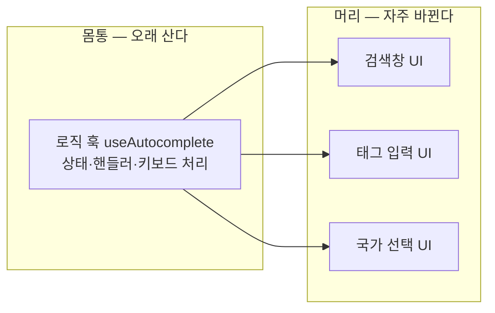
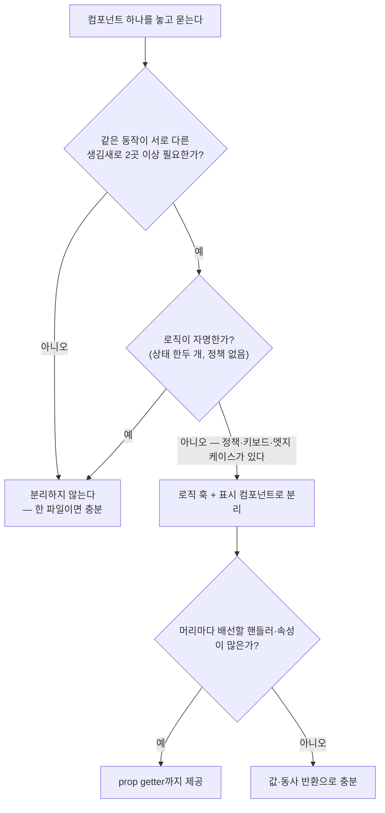

<Callout type="info">
  **이번 문서의 목표:** "동작은 재사용하고 생김새는 자유롭게"를 실현하는 headless 패턴을 이해하고, 로직 훅 + 프레젠테이션 컴포넌트 구조로 UI를 분리 설계하며, 어디까지 분리하는 것이 적절한지 판단할 수 있다.
</Callout>

## 왜 필요한가 — "똑같이 동작하는데 다르게 생긴" 문제

이 과목에서 계속 쌓아온 흐름의 마지막 조각입니다. 01편에서 컨테이너·프레젠테이션 분리의 원형을 봤고, 05편에서 로직을 커스텀 훅으로 뽑는 설계를 익혔고, 11편에서 슬롯·compound로 생김새의 자유를 확보했습니다. 이제 마지막 질문이 남습니다.

실무에서 반드시 만나는 상황: 자동완성 드롭다운이 필요합니다. 검색창에도, 태그 입력에도, 국가 선택에도요. 세 곳의 **동작은 완전히 같습니다** — 입력하면 후보가 뜨고, 방향키로 이동하고, 엔터로 선택하고, 바깥을 클릭하면 닫히고. 그런데 **생김새는 완전히 다릅니다** — 검색창은 큰 카드형, 태그 입력은 칩 목록, 국가 선택은 국기 아이콘이 붙은 컴팩트 리스트.

기존 도구로 풀어 보면:

- **스타일 props 추가?** → `variant="card"`, `chipMode`, `showFlag`… 11편에서 본 props 폭발의 재림입니다.
- **슬롯·compound?** → 구조의 자유는 얻지만, 키보드 내비게이션·열림 상태 같은 **동작 로직이 여전히 특정 마크업에 붙어** 있습니다. 마크업을 통째로 갈아엎고 싶을 때 한계가 옵니다.
- **복사-붙여넣기?** → 세 벌의 동작 로직. 버그를 세 번 고치게 됩니다.

문제의 본질은 이겁니다: **동작**(로직)**의 수명과 생김새**(마크업·스타일)**의 수명이 다르다.** 동작은 몇 년을 가지만 생김새는 리브랜딩 한 번에 갈립니다. 수명이 다른 것을 한 덩어리로 묶으면, 짧은 쪽을 바꿀 때마다 긴 쪽까지 위험해집니다. 그래서 최종 해법은 둘을 **물리적으로 분리**하는 것 — 그것이 headless 패턴입니다.

## 1. Headless 컴포넌트란 무엇인가

> **쉽게 말하면:** 머리(head — 눈에 보이는 UI)를 떼어낸 몸통(동작 로직)만 제공하는 것입니다. 머리는 쓰는 사람이 그때그때 붙입니다.

**headless**(헤드리스)는 "head가 없는"이라는 뜻의 합성어입니다. 서버 세계에서 "headless CMS"(화면 없이 데이터만 주는 콘텐츠 관리 시스템)라는 말이 먼저 유행했고, 같은 발상이 UI 컴포넌트에 적용됐습니다. 여기서 **head는 렌더링되는 마크업과 스타일**, 즉 눈에 보이는 부분을 가리킵니다.

headless 컴포넌트는:

- **제공하는 것**: 상태, 상태를 바꾸는 함수들, 접근성 속성, 키보드 처리 — 한마디로 **동작 전부**
- **제공하지 않는 것**: HTML 구조, CSS, 시각적 결정 — 한마디로 **생김새 전부**

React에서 이 "머리 없는 몸통"을 담는 가장 자연스러운 그릇이 바로 **커스텀 훅**입니다. 훅은 JSX를 반환할 의무가 없으니까요. 그래서 현대 React의 headless 패턴은 대부분 이 구조입니다.



실무에서 이 철학으로 만들어진 유명 라이브러리들이 있습니다 — TanStack Table(테이블 로직만, 마크업 없음), Downshift(자동완성 로직만), Headless UI·Radix UI(동작+접근성만, 스타일 없음). 이들이 스타일을 주지 않는 것은 게으름이 아니라 설계입니다: **스타일을 주는 순간, 그 스타일과 다른 디자인을 원하는 팀에게는 라이브러리가 짐이 되기** 때문입니다.

## 2. 직접 만들어 보기 — 별점 위젯을 headless로

원리를 몸으로 익히기 위해, 작지만 완결된 예제 — 별점(star rating) 위젯 — 를 headless로 만들어 봅니다. 별점의 **동작**을 목록으로 뽑으면:

- 현재 선택된 점수 상태
- 마우스를 올린 별까지 미리보기(hover preview) 상태
- 화면에 실제로 칠해야 할 값 = hover 중이면 hover 값, 아니면 선택 값
- 클릭하면 선택, 같은 별을 다시 클릭하면 취소

이 목록에 마크업 이야기가 하나도 없다는 점을 확인하세요. 이것이 "몸통"의 전부이고, 그대로 훅이 됩니다.

<CodePlayground
  template="react"
  activeFile="/useRating.js"
  label="같은 훅, 두 개의 머리 — 별 UI와 막대 UI가 같은 로직을 공유한다"
  files={{
    '/useRating.js': `import { useState } from "react";

// [몸통] 별점의 "동작"만 담는다. JSX가 한 줄도 없다.
export function useRating(max) {
  const [rating, setRating] = useState(0);   // 확정된 점수
  const [hovered, setHovered] = useState(0); // 미리보기 점수

  const displayValue = hovered > 0 ? hovered : rating;

  const select = (value) => {
    // 같은 값을 다시 선택하면 취소
    setRating(value === rating ? 0 : value);
  };

  // "머리"가 필요로 하는 모든 것을 계약으로 반환
  return {
    max,
    rating,
    displayValue,
    select,
    preview: setHovered,
    clearPreview: () => setHovered(0),
  };
}`,
    '/App.js': `import { useRating } from "./useRating";

// [머리 1] 클래식 별 UI
function StarRating() {
  const r = useRating(5);
  const stars = [];
  for (let i = 1; i <= r.max; i++) {
    stars.push(
      <span
        key={i}
        onClick={() => r.select(i)}
        onMouseEnter={() => r.preview(i)}
        onMouseLeave={r.clearPreview}
        style={{ cursor: "pointer", fontSize: 28, color: i <= r.displayValue ? "#f5a623" : "#ddd" }}
      >
        {"\\u2605"}
      </span>
    );
  }
  return <div>{stars} <b>{r.rating}점</b></div>;
}

// [머리 2] 완전히 다른 생김새 — 막대형 UI. 로직 코드는 재작성 0줄.
function BarRating() {
  const r = useRating(5);
  const bars = [];
  for (let i = 1; i <= r.max; i++) {
    bars.push(
      <div
        key={i}
        onClick={() => r.select(i)}
        onMouseEnter={() => r.preview(i)}
        onMouseLeave={r.clearPreview}
        style={{
          width: 32, height: 10 + i * 5, cursor: "pointer",
          background: i <= r.displayValue ? "#7c6df2" : "#e5e5e5",
        }}
      />
    );
  }
  return (
    <div style={{ display: "flex", alignItems: "flex-end", gap: 4 }}>
      {bars} <b>{r.rating}점</b>
    </div>
  );
}

export default function App() {
  return (
    <div>
      <h4>머리 1 — 별</h4>
      <StarRating />
      <h4>머리 2 — 막대</h4>
      <BarRating />
    </div>
  );
}`,
  }}
/>

두 UI에 마우스를 올리고 클릭해 보세요. 미리보기, 선택, 재클릭 취소 — 동작이 완전히 같습니다. `useRating.js`는 두 UI 중 어느 쪽의 존재도 모릅니다. 내일 "숫자 슬라이더형 별점"이 필요해져도 훅은 그대로이고 머리만 하나 더 붙입니다.

### 반환 계약이 곧 설계다

05편에서 배운 훅의 입력·반환 계약이 headless에서는 더 중요해집니다. 훅이 반환하는 것들이 곧 "**머리가 알아야 할 전부**"이기 때문입니다. 위 훅의 반환을 뜯어 보면 설계 의도가 보입니다.

- `displayValue` — "hover 중이면 hover 값"이라는 **판단을 훅이 끝내서** 줍니다. 머리마다 이 삼항 연산을 반복하게 두면 언젠가 한 곳이 어긋납니다. **판단은 몸통에, 표시는 머리에.**
- `select` — "재클릭이면 취소"라는 정책도 몸통 소관입니다. 머리는 그냥 클릭을 전달할 뿐입니다.
- `setRating`을 그대로 노출하지 않음 — 머리가 정책을 우회해 아무 값이나 꽂는 길을 만들지 않습니다. 노출하는 순간 그 우회로도 계약이 되어 영영 못 없앱니다.

<Callout type="warning">
  **자주 틀리는 점:** 훅에서 상태와 setter를 날것으로 전부 반환하는 것(`return { rating, setRating, hovered, setHovered }`)은 headless가 아니라 그냥 상태 노출입니다. 정책 없는 setter를 받은 머리들은 각자 정책을 구현하기 시작하고, 분리의 이득이 사라집니다. 반환 계약은 "무엇을 할 수 있는가"의 동사들로 구성하세요 — select, preview, clearPreview처럼.
</Callout>

## 3. prop getter — 배선 실수까지 몸통이 책임지는 한 단계 위

2절의 머리들을 다시 보면, 매 머리마다 `onClick`·`onMouseEnter`·`onMouseLeave` 세 개를 **올바른 조합으로** 연결해야 합니다. 지금은 세 개지만, 실전 자동완성쯤 되면 키보드 핸들러·포커스 처리·ARIA 속성(스크린 리더 같은 보조기술을 위한 접근성 속성)까지 열 개가 넘어갑니다. 하나라도 빠뜨리면 미묘하게 고장난 UI가 됩니다 — 그리고 빠뜨린 걸 알아채기 어렵습니다.

그래서 성숙한 headless 라이브러리들은 **prop getter**(프롭 게터)라는 관례를 씁니다: "이 요소에 얹어야 할 props 묶음"을 훅이 통째로 만들어 주는 함수입니다.

```jsx
// 훅이 이런 함수를 반환한다
const getStarProps = (i) => ({
  onClick: () => select(i),
  onMouseEnter: () => preview(i),
  onMouseLeave: clearPreview,
  role: "radio",
  "aria-checked": i <= rating,
});

// 머리는 스프레드 한 번으로 배선 끝 — 빠뜨릴 방법이 없다
<span {...getStarProps(i)} />
```

Downshift가 이 관례를 대중화했고(`getInputProps`, `getItemProps`, `getMenuProps`), TanStack 계열도 같은 발상을 씁니다. prop getter의 의미를 한 문장으로: **"무엇을 연결할지"라는 지식까지 몸통으로 옮겨, 머리에는 "어디에 붙일지"만 남긴다.** 머리가 스프레드 위에 자기 props를 덧쓰면 getter가 준 핸들러를 덮어쓸 수 있으니, 순서는 getter를 먼저 펼치고 커스텀을 뒤에 두되 같은 이름의 핸들러를 덮지 않도록 주의합니다.

## 4. 컨테이너·프레젠테이션의 현대적 해석

01편에서 봤던 전통 구분을 다시 소환합니다 — 로직 담당 **컨테이너**(container)와 표시 담당 **프레젠테이션**(presentational). 이 구분은 2015년경 클래스 컴포넌트 시대에 정립됐는데, 당시에는 로직을 담을 그릇이 **컴포넌트뿐**이었습니다. 그래서 로직 전용 컴포넌트(컨테이너)를 만들어 트리에 한 층을 끼워 넣는 방식이 표준이었죠.

훅이 등장하면서 상황이 바뀌었습니다. 로직을 담는 그릇으로 **컴포넌트가 아닌 훅**을 쓸 수 있게 됐고, 이 구분을 만든 당사자(Dan Abramov)조차 "이제는 이 구분을 예전처럼 권하지 않는다 — 훅으로 충분하다"고 글에 추기를 남겼습니다. 세 시대를 비교하면:

| 구분 | 클래스 시대 | 초기 훅 시대 | headless 시대 |
|------|-----------|-------------|--------------|
| 로직이 사는 곳 | 컨테이너 컴포넌트 | 커스텀 훅 | 커스텀 훅 + prop getter |
| 표시가 사는 곳 | 프레젠테이션 컴포넌트 | 컴포넌트 본문 | 얇은 프레젠테이션 컴포넌트 |
| 트리 구조 | 컨테이너가 한 층 차지 | 층 없음 | 층 없음 |
| 로직 재사용 | 컨테이너 재사용 — 조합이 어색함 | 훅 호출 — 자유로운 합성 | 훅 호출 — 배선까지 제공 |

핵심 통찰: **컨테이너·프레젠테이션이 틀린 게 아니라, "로직과 표시를 분리하라"는 정신은 그대로 살아남고 분리의 축이 바뀐 것**입니다. 예전에는 트리의 **수직 방향**(부모 컨테이너 → 자식 프레젠테이션)으로 분리했다면, 지금은 **컴포넌트 안팎**(훅 안의 로직 ↔ 컴포넌트의 JSX)으로 분리합니다. 수직 분리는 트리에 불필요한 층을 만들고 로직 조합이 어색했지만(로직 두 개가 필요하면 컨테이너를 두 겹?), 훅은 한 컴포넌트에서 여러 개를 자연스럽게 합성합니다 — 05편에서 본 훅 합성 그대로요.

그래서 현대 코드의 표준 형태는 이렇습니다.

```jsx
// 로직: 훅에 (테스트는 이 훅만 따로)
function useOrderList() {
  const orders = useOrders();
  const { sortKey, sorted, toggleSort } = useSort(orders);
  return { sorted, sortKey, toggleSort };
}

// 표시: 얇은 컴포넌트에 (스토리북·디자인 검토는 이쪽만 따로)
function OrderListView({ sorted, sortKey, toggleSort }) {
  return (
    <table>{/* sorted를 그리기만 한다 */}</table>
  );
}

// 조립: 접착 코드 한 줄
function OrderList() {
  const logic = useOrderList();
  return <OrderListView {...logic} />;
}
```

`OrderListView`는 props만 받는 순수한 표시 컴포넌트라 어떤 데이터든 꽂아 확인할 수 있고, `useOrderList`는 JSX가 없어 렌더링 없이 로직만 검증할 수 있습니다 — 05편에서 말한 "테스트하기 쉬운 경계"가 정확히 이 절단면에 생깁니다.

## 5. 어디까지 분리할 것인가 — 판단 기준

headless는 강력하지만 **모든 컴포넌트를 headless로 만드는 것은 명백한 과설계**입니다. 분리에는 비용이 있습니다 — 파일이 늘고, 계약을 설계·유지해야 하고, 읽는 사람이 두 파일을 오가야 합니다. 05편의 "과한 추상화" 경고가 여기서도 그대로 적용됩니다.

판단 흐름:



구체적으로:

- **분리하지 않는다**: 이 화면에만 있는 공지 배너, 상태가 `isOpen` 하나뿐인 토글 섹션. 미래의 재사용을 **상상**해서 미리 분리하는 것은 05편에서 배운 투기적 추상화입니다.
- **훅 분리까지**: 폼 검증, 페이지네이션, 정렬·필터 — 정책이 있고 재사용이 **실제로 발생한** 로직.
- **prop getter까지**: 자동완성, 콤보박스, 데이터 그리드 — 배선이 많고 접근성 속성까지 얹어야 하는 위젯. 이 수준은 직접 만들기 전에 Downshift·Radix 같은 검증된 headless 라이브러리 도입을 먼저 검토하는 것이 실무 정답인 경우가 많습니다. 키보드·포커스·스크린 리더 처리는 보기보다 훨씬 깊은 우물이라서요.

그리고 마지막 주의: 분리했다면 **경계를 지키세요**. 표시 컴포넌트에 "값이 5 이상이면 빨간색" 같은 **표시 규칙**이 있는 것은 정상이지만, "재클릭이면 취소" 같은 **동작 정책**이 스며들기 시작하면 분리가 무너집니다. 코드 리뷰에서 "이 if는 머리 소관인가 몸통 소관인가"를 묻는 습관이 경계를 지켜줍니다.

## 핵심 정리

- headless 패턴은 **수명이 다른 두 가지** — 오래 사는 동작 로직과 자주 바뀌는 생김새 — 를 물리적으로 분리한다. 몸통은 훅, 머리는 얇은 컴포넌트.
- 훅의 반환 계약은 값과 **동사**(select, preview…)로 구성한다 — 날것 setter를 노출하면 정책이 머리마다 흩어져 분리의 이득이 사라진다.
- **prop getter**는 "무엇을 연결할지"라는 지식까지 몸통으로 옮기는 관례 — 배선이 많은 위젯에서 연결 누락을 구조적으로 차단한다.
- 컨테이너·프레젠테이션 구분의 정신(로직·표시 분리)은 살아남았고, 분리의 축이 트리의 수직 방향에서 **훅 안팎**으로 이동했다.
- 분리 기준: 같은 동작 + 다른 생김새가 **실제로** 2곳 이상, 로직에 정책·엣지 케이스가 있을 때만. 그 전에는 한 파일이 정답이다.

## 마무리 복습

<Quiz
  questionNumber={1}
  question="headless 컴포넌트에서 head가 가리키는 것은?"
  options={['컴포넌트의 최상위 부모', '눈에 보이는 마크업과 스타일', 'HTML 문서의 head 태그', '커스텀 훅의 반환값']}
  correctAnswer={2}
  explanation="head는 렌더링되는 시각적 부분, 즉 마크업과 스타일을 뜻한다. headless 컴포넌트는 이를 제외한 동작 — 상태, 핸들러, 키보드 처리, 접근성 — 만 제공한다."
  optionExplanations={['트리 구조상의 부모와는 무관한 용어다', '정답 — 보이는 부분을 떼어냈다는 뜻이다', '문서의 head 태그가 아니라 UI의 시각 영역을 비유한 말이다', '반환값은 오히려 머리 없는 몸통 쪽에 해당한다']}
/>

<Quiz
  questionNumber={2}
  question="headless 패턴이 해결하는 문제의 본질로 가장 알맞은 것은?"
  options={['CSS 파일이 너무 커지는 문제', '동작 로직과 생김새의 수명이 달라 한 덩어리로 묶으면 서로를 위험하게 하는 문제', '컴포넌트 이름이 겹치는 문제', '서버 렌더링이 느려지는 문제']}
  correctAnswer={2}
  explanation="동작은 오래 유지되지만 생김새는 자주 바뀐다. 수명이 다른 것을 분리해 두면 생김새를 갈아엎어도 동작 로직이 그대로 재사용된다."
  optionExplanations={['스타일 크기는 이 패턴의 관심사가 아니다', '정답 — 수명이 다른 관심사의 분리가 본질이다', '이름 충돌과는 무관하다', '렌더링 방식의 문제가 아니라 코드 구조의 문제다']}
/>

<Quiz
  questionNumber={3}
  question="headless 로직을 담는 그릇으로 커스텀 훅이 자연스러운 이유는?"
  options={['훅은 컴파일 속도가 빠르기 때문에', '훅은 JSX를 반환할 의무가 없어 동작만 순수하게 담을 수 있기 때문에', '훅은 상태를 가질 수 없기 때문에', '훅은 트리에 층을 하나 추가해주기 때문에']}
  correctAnswer={2}
  explanation="컴포넌트는 JSX를 반환해야 하지만 훅은 값·함수만 반환하면 된다. 그래서 마크업 없는 순수 동작 묶음을 담기에 훅이 적합하며, 호출한 컴포넌트마다 독립 상태가 생겨 재사용도 자유롭다."
  optionExplanations={['컴파일 속도와는 무관하다', '정답 — JSX 의무가 없다는 성질이 핵심이다', '훅은 useState 등으로 상태를 가질 수 있다 — 그것이 존재 이유다', '층을 추가하지 않는 것이 컨테이너 방식 대비 장점이다']}
/>

<Quiz
  questionNumber={4}
  question="훅에서 setRating 같은 날것 setter 대신 select 같은 동사 함수를 반환해야 하는 이유는?"
  options={['setter는 함수라서 반환할 수 없기 때문에', '재클릭 취소 같은 정책을 몸통에 가두어 머리들이 정책을 각자 구현하는 것을 막기 위해', '동사 함수가 항상 더 빠르기 때문에', 'React 규칙상 setter 반환이 금지되어 있기 때문에']}
  correctAnswer={2}
  explanation="날것 setter를 노출하면 머리가 정책을 우회해 아무 값이나 넣을 수 있고, 그 우회로 자체가 계약이 되어 없앨 수 없게 된다. 정책이 담긴 동사로 반환해야 판단은 몸통에, 표시는 머리에 남는다."
  optionExplanations={['함수도 얼마든지 반환할 수 있다 — 설계상 하지 않는 것이다', '정답 — 정책의 위치를 지키는 것이 반환 계약 설계의 핵심이다', '성능 차이는 없다', '금지 규칙은 없으며 순수하게 설계 판단이다']}
/>

<Quiz
  questionNumber={5}
  question="prop getter 패턴의 목적으로 가장 정확한 것은?"
  options={['props의 타입을 자동 검증한다', '요소에 얹을 핸들러·속성 묶음을 훅이 만들어 주어 머리의 배선 누락을 구조적으로 막는다', '렌더 횟수를 줄인다', 'CSS를 자동 생성한다']}
  correctAnswer={2}
  explanation="배선할 핸들러와 접근성 속성이 많아지면 머리마다 연결 실수가 생긴다. getInputProps 같은 함수가 묶음을 통째로 주면 스프레드 한 번으로 배선이 끝나, 무엇을 연결할지의 지식까지 몸통이 책임진다."
  optionExplanations={['타입 검증 도구가 아니다', '정답 — 연결 지식의 이동과 누락 방지가 목적이다', '렌더 최적화와는 무관하다', '스타일은 headless가 다루지 않는 영역이다']}
/>

<Quiz
  questionNumber={6}
  question="컨테이너·프레젠테이션 구분의 현대적 해석으로 옳은 것은?"
  options={['이 구분은 완전히 틀린 것으로 판명되어 폐기됐다', '로직·표시 분리라는 정신은 유지되고, 분리의 축이 트리의 수직 방향에서 훅 안팎으로 이동했다', '훅 시대에는 로직과 표시를 분리할 필요가 없어졌다', '컨테이너 컴포넌트를 더 많이 만드는 방향으로 발전했다']}
  correctAnswer={2}
  explanation="구분을 만든 당사자도 훅 등장 이후 예전 방식을 권하지 않는다고 밝혔지만, 폐기된 것은 로직 전용 컴포넌트 층이라는 수단이지 분리의 정신이 아니다. 지금은 로직을 훅에, 표시를 얇은 컴포넌트에 두는 형태로 같은 정신이 이어진다."
  optionExplanations={['정신은 살아남았고 수단이 바뀌었다', '정답 — 수직 분리에서 훅 안팎 분리로의 이동이다', '분리의 필요는 그대로이고 그릇이 훅으로 바뀐 것이다', '컨테이너 층은 오히려 줄어드는 방향으로 발전했다']}
/>

<Quiz
  questionNumber={7}
  question="다음 중 headless 분리가 과설계가 되는 경우는?"
  options={['세 화면에서 서로 다른 UI로 쓰이는 자동완성 로직', '이 화면에만 있고 상태가 isOpen 하나뿐인 접기 섹션', '키보드 내비게이션과 접근성 속성이 얽힌 콤보박스', '정책이 많고 여러 폼에서 재사용되는 검증 로직']}
  correctAnswer={2}
  explanation="재사용처가 없고 로직이 자명한 컴포넌트를 분리하면 파일과 계약 유지 비용만 늘어난다. 미래의 재사용을 상상해 미리 분리하는 것은 투기적 추상화다."
  optionExplanations={['같은 동작 + 다른 생김새 여러 곳은 headless의 주 무대다', '정답 — 자명한 로직 + 단일 사용처는 한 파일이 정답이다', '배선 많은 위젯은 prop getter까지 갈 수 있는 대표 사례다', '정책 있고 재사용이 실재하는 로직은 훅 분리의 정당한 대상이다']}
/>

<Quiz
  questionNumber={8}
  question="로직 훅 + 표시 컴포넌트 분리가 테스트를 쉽게 만드는 이유는?"
  options={['테스트 코드가 자동 생성되기 때문에', '훅은 렌더링 없이 로직만, 표시 컴포넌트는 props만 꽂아 화면만 각각 독립적으로 검증할 수 있기 때문에', '분리하면 버그가 원천적으로 사라지기 때문에', '테스트 프레임워크가 분리된 코드만 지원하기 때문에']}
  correctAnswer={2}
  explanation="절단면이 곧 테스트 경계가 된다. JSX 없는 훅은 로직 단위로, props만 받는 표시 컴포넌트는 이 입력이면 이 화면이라는 단위로 따로 검증할 수 있어 테스트 대상이 작고 명확해진다."
  optionExplanations={['자동 생성과는 무관하다', '정답 — 05편의 테스트하기 쉬운 경계가 이 절단면에 생긴다', '버그가 사라지는 것이 아니라 찾기 쉬워지는 것이다', '프레임워크는 분리 여부와 무관하게 동작한다']}
/>

## 참고 자료

- [React 공식 문서 - Reusing Logic with Custom Hooks](https://react.dev/learn/reusing-logic-with-custom-hooks)
- [ReactZ2H - Compound Components Pattern](https://reactz2h.com/chapter_14_architecture_and_design_patterns/series_01_component_design_patterns/compound_components_pattern)
- [React 공식 문서 - Composition vs Inheritance](https://legacy.reactjs.org/docs/composition-vs-inheritance.html)
