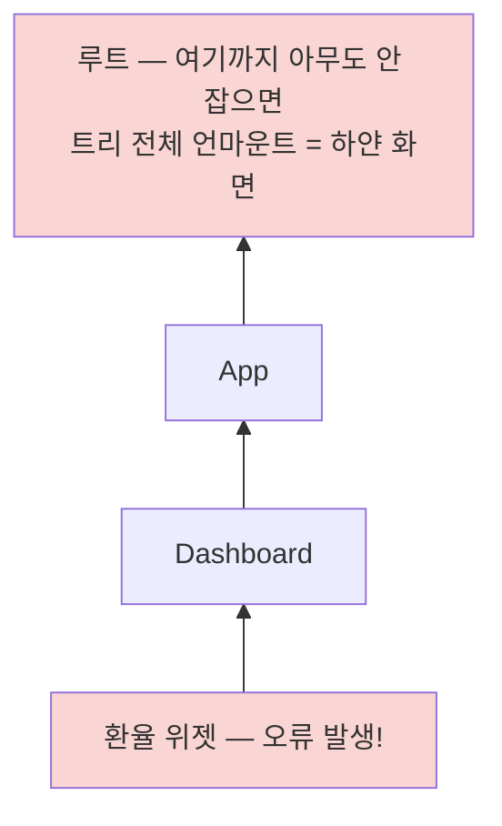
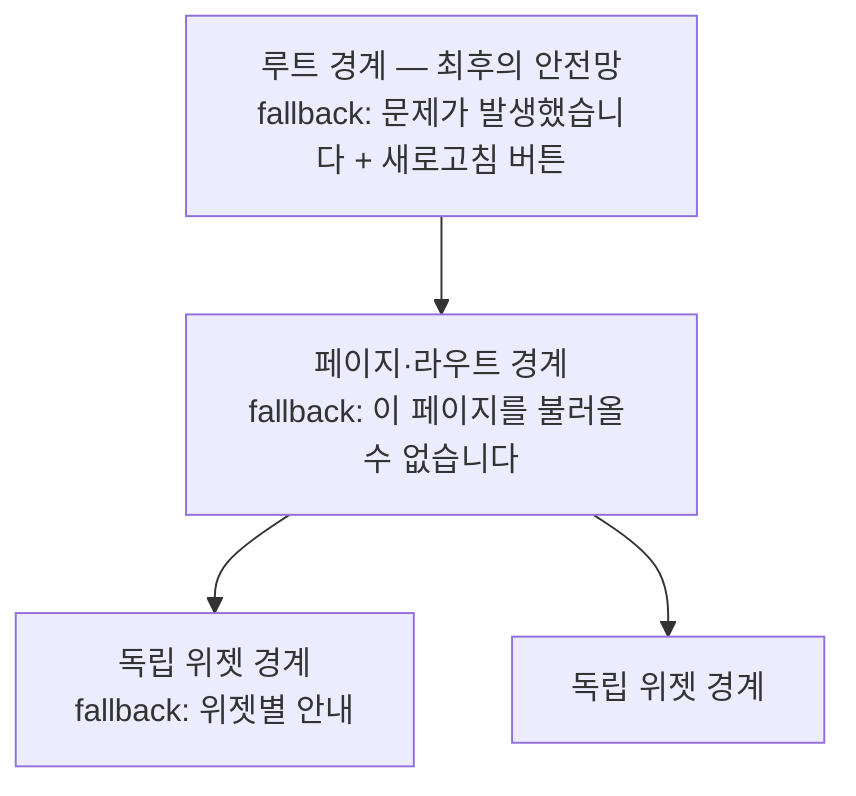

<Callout type="info">
  **이번 문서의 목표:** 렌더링 오류가 트리를 타고 전파되는 원리를 이해하고, Error Boundary를 알맞은 위치에 배치해 앱의 일부만 우아하게 실패하게 만들며, Suspense와 lazy로 로딩 상태를 선언적으로 처리할 수 있다.
</Callout>

## 왜 필요한가 — 버튼 하나가 앱 전체를 지운다

실제 서비스에서 일어나는 사고를 재현해 봅시다. 대시보드에 위젯이 다섯 개 있습니다. 그중 "환율 위젯" 하나가 API 응답의 없는 필드를 읽다가 렌더 중에 예외(exception, 익셉션 — 코드 실행을 중단시키는 오류)를 던졌습니다. 사용자가 보게 되는 화면은?

환율 위젯만 깨진 화면이 아닙니다. **완전히 하얀 빈 화면**입니다. 멀쩡하던 나머지 위젯 네 개, 헤더, 내비게이션까지 전부 사라집니다. React는 렌더 중 잡히지 않은 오류가 발생하면 **트리 전체를 언마운트**(unmount, 화면에서 제거)하기 때문입니다.

가혹해 보이지만 이유가 있습니다. 렌더가 도중에 터졌다는 것은 UI가 **반쯤 그려진 모순 상태**일 수 있다는 뜻입니다. 망가진 UI를 그대로 두면 사용자가 잘못된 정보를 보거나(잔액이 틀리게 표시된 은행 화면을 상상해 보세요) 잘못된 조작을 할 수 있습니다. React의 선택은 "망가진 채로 두느니 다 지운다"입니다 — 단, **개발자가 울타리를 쳐 두지 않았다면**요. 그 울타리가 이 편의 주인공 **Error Boundary**(에러 바운더리, 오류 경계)입니다.

이 편의 두 주인공 — Error Boundary와 Suspense — 는 사실 같은 철학의 쌍둥이입니다. 둘 다 "**이 영역이 정상 렌더될 수 없을 때 대신 보여줄 것**"을 트리 구조로 선언하는 장치입니다. 하나는 실패했을 때, 하나는 아직 준비되지 않았을 때를 맡습니다.

## 1. 렌더링 오류의 전파 — 오류는 트리를 거슬러 오른다

> **쉽게 말하면:** 렌더 중 터진 오류는 연기처럼 트리 위로 피어오르고, 잡는 사람이 없으면 지붕(루트)까지 태웁니다.

렌더 중 컴포넌트가 예외를 던지면 React는 그 오류를 **부모 방향으로** 전파시킵니다. 자바스크립트의 예외가 호출 스택을 거슬러 오르는 것과 같은 그림입니다. 도중에 오류를 잡겠다고 선언한 컴포넌트(Error Boundary)를 만나면 거기서 멈추고, 끝까지 없으면 루트에 도달해 트리 전체가 언마운트됩니다.



여기서 반드시 구분할 것 — **Error Boundary가 잡는 오류와 못 잡는 오류**가 명확히 나뉩니다.

| 오류가 난 곳 | Error Boundary가 잡는가 | 이유 |
|-------------|----------------------|------|
| 렌더 함수 본문 | 잡는다 | 렌더 과정의 일부 |
| 자식 컴포넌트의 렌더 | 잡는다 | 트리를 타고 올라오므로 |
| 이벤트 핸들러 (onClick 등) | 못 잡는다 | 렌더 중이 아니라 사용자 조작 중 실행됨 |
| setTimeout·fetch 콜백 등 비동기 코드 | 못 잡는다 | 렌더 스택 밖에서 실행됨 |
| Error Boundary 자기 자신의 렌더 | 못 잡는다 | 자기 오류는 자기 위의 경계로 올라간다 |

이벤트 핸들러의 오류를 못 잡는 이유를 조금 더 풀면 — 핸들러는 렌더가 끝난 뒤 사용자의 클릭 시점에 실행되므로, 터져도 "그려진 화면"은 이미 완성돼 있어 UI 모순이 없습니다. 그래서 React가 개입하지 않고, 일반 자바스크립트처럼 `try...catch`로 직접 잡아 상태에 담으면 됩니다. **렌더 오류는 경계로, 핸들러·비동기 오류는 try-catch + 상태로** — 이 역할 분담이 첫 번째 핵심입니다.

```jsx
function SaveButton() {
  const [error, setError] = useState(null);

  const handleSave = async () => {
    try {
      await saveData();
    } catch (err) {
      setError(err); // 잡아서 상태에 담고
    }
  };

  if (error) throw error; // 렌더 중에 다시 던지면 → 이제는 경계가 잡는다
  return <button onClick={handleSave}>저장</button>;
}
```

마지막 두 줄은 실무에서 쓰는 다리 놓기 기법입니다 — 비동기에서 잡은 오류를 상태에 실어 **렌더 중에 다시 던지면**, 렌더 오류가 되어 Error Boundary의 관할로 들어갑니다.

## 2. Error Boundary 구현 — 유일하게 클래스가 필요한 자리

Error Boundary는 "자식 트리의 렌더 오류를 잡겠다"고 선언한 특별한 컴포넌트인데, 2026년 현재까지도 **훅 버전 API가 없어 클래스 컴포넌트로만** 만들 수 있습니다. 이 과목은 클래스를 다루지 않지만, 이 한 자리만은 예외로 15줄짜리 정형 코드를 익혀 둡니다 — 어차피 앱에 한 번 작성하고 재사용하는 코드입니다.

```jsx
class ErrorBoundary extends React.Component {
  state = { hasError: false };

  // 자식 렌더에서 오류가 올라오면 React가 이 메서드를 호출한다.
  // 반환한 객체로 상태를 갱신 → 다음 렌더에서 fallback을 그린다.
  static getDerivedStateFromError(error) {
    return { hasError: true };
  }

  // 부수 효과용 — 오류 로깅 서비스에 보고하는 자리
  componentDidCatch(error, info) {
    console.error("잡은 오류:", error, info.componentStack);
  }

  render() {
    if (this.state.hasError) {
      return this.props.fallback; // 대체 UI
    }
    return this.props.children;   // 평소에는 존재감 없이 통과
  }
}
```

동작을 순서로 풀면: 평소엔 children을 그대로 렌더 → 자식 어딘가에서 렌더 오류 발생 → React가 `getDerivedStateFromError`를 호출해 `hasError`를 true로 → 경계가 다시 렌더되며 children 대신 fallback을 그림 → **오류는 여기서 멈추고, 경계 바깥의 트리는 아무 일 없이 유지**됩니다.

사용은 그냥 감싸면 됩니다.

```jsx
<ErrorBoundary fallback={<p>환율 정보를 불러올 수 없습니다.</p>}>
  <ExchangeRateWidget />
</ErrorBoundary>
```

아래 실습기에서 직접 확인해 보세요. "오류 발생" 버튼을 누르면 카운터 위젯이 렌더 중에 예외를 던지는데 — 경계 안쪽만 fallback으로 바뀌고 바깥 UI는 살아 있습니다.

<CodePlayground
  template="react"
  activeFile="/App.js"
  showConsole
  label="오류 발생 버튼을 눌러보세요 — 경계 안쪽만 죽고 바깥은 살아남습니다"
  files={{
    '/App.js': `import React, { useState } from "react";

class ErrorBoundary extends React.Component {
  state = { hasError: false };
  static getDerivedStateFromError() {
    return { hasError: true };
  }
  render() {
    if (this.state.hasError) return this.props.fallback;
    return this.props.children;
  }
}

function BuggyWidget() {
  const [broken, setBroken] = useState(false);
  if (broken) {
    throw new Error("위젯 렌더 중 오류!"); // 렌더 중에 던진다 → 경계가 잡는다
  }
  return <button onClick={() => setBroken(true)}>오류 발생</button>;
}

export default function App() {
  return (
    <div>
      <h3>대시보드 (경계 바깥 — 항상 살아있음)</h3>
      <ErrorBoundary fallback={<p style={{ color: "crimson" }}>위젯을 표시할 수 없습니다.</p>}>
        <BuggyWidget />
      </ErrorBoundary>
      <p>다른 위젯 — 옆이 터져도 멀쩡합니다.</p>
    </div>
  );
}`,
  }}
/>

<Callout type="info">
  **실무 메모:** 직접 만드는 대신 `react-error-boundary` 패키지를 쓰는 팀이 많습니다. 위 정형 코드에 더해 "다시 시도" 리셋(`resetErrorBoundary`), fallback을 함수로 받아 오류 정보를 넘겨주는 기능 등이 정리되어 있습니다. 원리는 지금 배운 것과 동일합니다.
</Callout>

## 3. 배치 전략 — 어디에 울타리를 칠 것인가

경계를 **어디에** 두느냐가 이 패턴의 진짜 설계 문제입니다. 극단 두 개를 보면 기준이 생깁니다.

- **루트에 하나만**: 하얀 화면은 면하지만, 환율 위젯 하나 때문에 **앱 전체가 fallback**으로 바뀝니다. "안 죽었을 뿐" 사용자 경험은 전멸입니다.
- **모든 컴포넌트마다**: 버튼 하나가 깨져도 티가 안 나서 오류가 **은폐**됩니다. 코드도 경계 투성이가 되죠.

기준은 이렇게 세웁니다: **"이 부분이 죽어도 나머지는 의미가 있는가?"라는 질문으로 앱을 독립 구역으로 나누고, 구역마다 경계를 하나씩** 둡니다. 전기 배선의 차단기와 정확히 같은 설계입니다 — 집 전체에 차단기 하나면 방 하나의 누전으로 온 집이 정전되고, 콘센트마다 차단기를 달면 누전을 아무도 모릅니다. 회로(구역) 단위가 답입니다.

실무의 전형적인 3층 구조:



- **루트**: 어떤 경우에도 하얀 화면만은 막는 최후의 방어선. 여기까지 왔다면 심각한 상황이니 새로고침 유도가 현실적입니다.
- **페이지·라우트 단위**: 한 페이지의 오류가 내비게이션·다른 페이지까지 막지 않게. 08편에서 만든 layout route 구조라면 `Outlet`을 감싸는 자리가 정확히 이 층입니다.
- **독립 위젯 단위**: 대시보드 위젯, 댓글 목록, 추천 영역처럼 "없어도 페이지가 성립하는" 부가 영역.

### fallback UI 설계 — 죄송합니다만으로 끝내지 않기

fallback은 오류 화면이기 전에 **UI**입니다. 좋은 fallback의 조건:

1. **무엇이 안 되는지 범위를 말한다** — "오류가 발생했습니다"보다 "환율 정보를 불러올 수 없습니다"가 낫습니다. 사용자는 나머지 기능이 안전한지 알고 싶어 합니다.
2. **다음 행동을 준다** — 다시 시도 버튼, 새로고침 안내, 문의 링크. 막다른 골목을 만들지 않습니다.
3. **원래 UI와 크기가 비슷하게** — 위젯 자리의 fallback이 한 줄짜리면 레이아웃이 무너져 오류가 두 배로 커 보입니다.
4. **기술 정보는 숨긴다** — 스택 트레이스는 로깅 서비스로 보내고(`componentDidCatch` 자리), 사용자에게는 보여주지 않습니다.

## 4. Suspense — "아직 준비 안 됨"을 선언적으로

### 로딩도 같은 구조의 문제다

오류 처리에서 배운 그림을 로딩에 겹쳐 봅시다. 지금까지 로딩 처리는 컴포넌트마다 이렇게 썼을 겁니다.

```jsx
function Widget() {
  const { data, isLoading } = useData();
  if (isLoading) return <Spinner />; // 명령적: "로딩이면 스피너를 그려라"
  return <Chart data={data} />;
}
```

이 방식을 **명령적**(imperative — 절차를 일일이 지시하는 방식)이라고 하면, Suspense는 **선언적**(declarative — 원하는 결과만 서술하는 방식)입니다. "이 영역이 준비 안 됐으면 이걸 보여줘"를 **트리 구조로** 선언합니다.

```jsx
<Suspense fallback={<Spinner />}>
  <Widget />
</Suspense>
```

`Suspense`(서스펜스)는 React에 내장된 컴포넌트로, 자식 중 누군가가 "저 아직 준비 안 됐어요"라고 신호를 보내면 자식 전체 대신 fallback을 그리고, 준비가 끝나면 자동으로 실제 내용으로 교체합니다. Error Boundary와의 대칭이 보이시나요 — 오류 신호는 경계가 받아 오류 fallback을, 준비 안 됨 신호는 Suspense가 받아 로딩 fallback을 그립니다. 신호가 트리를 거슬러 올라 가장 가까운 처리자를 만난다는 전파 모델까지 같습니다.

### 무엇이 "준비 안 됨" 신호를 보낼 수 있나

중요한 한계를 정확히 알아야 합니다. 아무 컴포넌트나 `isLoading`을 true로 둔다고 Suspense가 반응하지 않습니다. Suspense 신호를 보내는 것은 **Suspense 지원 방식으로 만들어진 소스**뿐입니다.

- **`React.lazy`로 지연 로딩되는 컴포넌트** — 이 편에서 다루는 범위
- Suspense를 지원하는 데이터 프레임워크·라이브러리 (React Query·Relay의 suspense 모드, Next.js 등 — 서버 상태 과목의 영역이라 여기서는 이름만)
- `use` API로 읽는 Promise (React 19에서 정식화 — 개요만 알아두면 충분)

즉 현시점 클라이언트 SPA에서 Suspense의 주력 용도는 **lazy 로딩**이고, 일반 fetch 로딩은 여전히 `isLoading` 패턴이 표준입니다. "Suspense로 모든 로딩을 처리한다"는 아직 절반만 사실인 문장입니다.

### React.lazy — 코드 스플리팅과 Suspense의 만남

SPA는 기본적으로 **전체 자바스크립트를 한 덩어리**(번들, bundle)로 만들어 첫 방문에 다 내려받습니다. 앱이 커지면 사용자가 안 갈 페이지의 코드까지 첫 화면이 기다리게 되죠. **코드 스플리팅**(code splitting)은 번들을 쪼개 **필요한 시점에 필요한 조각만** 내려받는 기법이고, `React.lazy`(레이지 — 게으른)는 이를 컴포넌트 단위로 해주는 API입니다.

```jsx
import { lazy, Suspense } from "react";

// 정적 import 대신 — 이 컴포넌트의 코드는 별도 파일로 쪼개지고,
// 처음 렌더가 필요해지는 순간에야 네트워크로 받아온다
const HeavyChart = lazy(() => import("./HeavyChart"));

function Dashboard() {
  return (
    <Suspense fallback={<p>차트 준비 중...</p>}>
      <HeavyChart />
    </Suspense>
  );
}
```

`lazy`가 감싼 컴포넌트는 코드가 도착할 때까지 "준비 안 됨" 신호를 보내고, Suspense가 그동안 fallback을 그립니다 — 코드 다운로드라는 비동기 과정이 선언적 로딩 UI와 자연스럽게 이어지는 겁니다. 실무에서 가장 효과가 큰 적용처는 **라우트 단위**입니다. 페이지 전환은 사용자가 "이동 중"임을 인지하는 순간이라 짧은 로딩이 자연스럽거든요.

```jsx
// 08편의 라우트 구조에 lazy를 얹은 모습 — 페이지별로 번들이 쪼개진다
const AdminPage = lazy(() => import("./pages/AdminPage"));
const StatsPage = lazy(() => import("./pages/StatsPage"));

<Route element={<Layout />}>
  <Route
    path="/admin"
    element={
      <Suspense fallback={<PageSkeleton />}>
        <AdminPage />
      </Suspense>
    }
  />
</Route>
```

일반 사용자가 영영 방문하지 않을 관리자 페이지 코드를 모든 방문자가 내려받던 낭비가 사라집니다. 라우트 스플리팅 실습은 15편에서 손으로 직접 합니다.

<Callout type="warning">
  **자주 틀리는 점 — Suspense fallback의 깜빡임:** lazy 컴포넌트가 이미 로드된 뒤에는 fallback이 나오지 않지만, 회선이 빠른 환경에서 첫 로드가 0.1초 만에 끝나면 스피너가 "번쩍" 하고 사라져 오히려 거슬립니다. fallback은 스피너보다 실제 콘텐츠의 뼈대 모양을 흉내 낸 스켈레톤(skeleton) UI가 체감이 좋고, Suspense를 너무 잘게 쪼개 화면 곳곳이 따로따로 깜빡이게 만드는 것도 피해야 합니다 — 로딩 단위는 사용자가 하나의 영역으로 인지하는 단위와 맞춥니다.
</Callout>

## 5. 두 경계를 겹쳐 쌓기 — 완성된 안전망

lazy 로딩에는 실패도 있습니다 — 배포 직후 옛 청크 파일이 사라졌거나, 네트워크가 끊겼거나. 코드 다운로드가 실패하면 lazy 컴포넌트는 **렌더 중 오류를 던지고**, 그건 정확히 Error Boundary의 관할입니다. 그래서 실무의 완성형은 두 경계의 중첩입니다.

```jsx
<ErrorBoundary fallback={<p>페이지를 불러오지 못했습니다. 새로고침해 주세요.</p>}>
  <Suspense fallback={<PageSkeleton />}>
    <AdminPage />
  </Suspense>
</ErrorBoundary>
```

읽는 법: 준비 중이면 Suspense가 스켈레톤을, 실패하면 ErrorBoundary가 오류 안내를, 성공하면 페이지를. **한 영역의 세 가지 운명**(로딩·실패·성공)**이 트리 한 조각에 전부 선언**되어 있습니다 — 이것이 "선언적 오류·로딩 처리"라는 이 편 제목의 완성된 의미입니다. if-else와 상태 플래그로 흩어져 있던 처리들이 구조로 올라온 것이죠.

순서에 관한 판단 기준 하나: 위 코드는 ErrorBoundary가 바깥입니다. Suspense fallback을 그리던 중의 문제나 lazy 로드 실패까지 잡아야 하니, **일반적으로 오류 경계가 로딩 경계보다 바깥**에 섭니다. 반대로 "로딩 스피너는 유지한 채 내용부만 오류 표시"를 원하는 특수한 경우에만 순서를 뒤집습니다.

## 핵심 정리

- 렌더 중 오류는 트리를 거슬러 오르고, 아무도 안 잡으면 **트리 전체가 언마운트**된다 — 이벤트 핸들러·비동기 오류는 이 경로 밖이라 try-catch + 상태로 처리한다.
- Error Boundary는 `getDerivedStateFromError`로 오류를 상태로 바꿔 fallback을 그리는 클래스 컴포넌트로, **경계 바깥 트리를 살려내는** 울타리다.
- 배치는 차단기 설계처럼 — "이 부분이 죽어도 나머지가 의미 있는가"로 구역을 나눠 루트·페이지·독립 위젯의 층으로 둔다.
- Suspense는 "준비 안 됨" 신호를 받아 fallback을 그리는 선언적 로딩 경계이며, 클라이언트 SPA에서의 주력 용도는 `React.lazy` 코드 스플리팅이다.
- ErrorBoundary(바깥) + Suspense(안) 중첩으로 한 영역의 로딩·실패·성공을 트리 한 조각에 선언한다 — 라우트 단위 적용이 실무의 기본기다.

## 마무리 복습

<Quiz
  questionNumber={1}
  question="Error Boundary가 없는 앱에서 한 컴포넌트가 렌더 중 예외를 던지면 일어나는 일은?"
  options={['해당 컴포넌트만 빈 칸으로 표시된다', 'React가 트리 전체를 언마운트해 화면이 사라진다', 'React가 자동으로 이전 화면을 복원한다', '오류가 무시되고 렌더가 계속된다']}
  correctAnswer={2}
  explanation="잡히지 않은 렌더 오류는 트리를 거슬러 루트까지 올라가고, React는 반쯤 그려진 모순 UI를 두지 않기 위해 트리 전체를 언마운트한다. 이것이 하얀 화면 사고의 원인이다."
  optionExplanations={['부분만 비우는 동작은 경계를 쳐야 얻을 수 있다', '정답 — 망가진 UI를 두느니 다 지운다가 React의 기본 정책이다', '자동 복원 기능은 없다', '렌더 오류는 무시되지 않고 전파된다']}
/>

<Quiz
  questionNumber={2}
  question="다음 중 Error Boundary가 잡을 수 있는 오류는?"
  options={['버튼 onClick 핸들러 안에서 던진 오류', '자식 컴포넌트의 렌더 함수 본문에서 던진 오류', 'setTimeout 콜백에서 던진 오류', 'fetch의 then 콜백에서 던진 오류']}
  correctAnswer={2}
  explanation="Error Boundary는 렌더 과정에서 트리를 타고 올라오는 오류만 잡는다. 이벤트 핸들러와 비동기 콜백은 렌더 스택 밖에서 실행되므로 try-catch로 직접 잡아 상태에 담아야 하며, 필요하면 렌더 중 다시 던져 경계 관할로 넘길 수 있다."
  optionExplanations={['핸들러는 렌더 밖에서 실행되어 경계에 도달하지 않는다', '정답 — 자식의 렌더 오류는 트리를 타고 올라와 경계가 잡는다', '타이머 콜백은 렌더 스택 밖이다', '비동기 콜백도 렌더 스택 밖이다']}
/>

<Quiz
  questionNumber={3}
  question="Error Boundary 구현에서 getDerivedStateFromError의 역할은?"
  options={['오류를 콘솔에 출력한다', '오류 발생 시 반환한 객체로 상태를 갱신해 다음 렌더에서 fallback을 그리게 한다', '오류를 서버로 전송한다', '오류가 난 컴포넌트를 자동 수리한다']}
  correctAnswer={2}
  explanation="자식 렌더에서 오류가 올라오면 React가 이 정적 메서드를 호출하고, 반환된 객체가 상태에 반영되어 경계가 children 대신 fallback을 렌더하게 된다. 로깅 같은 부수 효과는 componentDidCatch가 맡는다."
  optionExplanations={['출력·보고는 componentDidCatch의 자리다', '정답 — 오류를 상태로 변환하는 것이 이 메서드의 역할이다', '전송 같은 부수 효과는 componentDidCatch에서 한다', '자동 수리 기능은 존재하지 않는다']}
/>

<Quiz
  questionNumber={4}
  question="Error Boundary 배치 전략으로 가장 알맞은 것은?"
  options={['루트에 하나만 두어 코드를 최소화한다', '모든 컴포넌트를 각각 감싸 오류를 완전히 봉쇄한다', '이 부분이 죽어도 나머지가 의미 있는가를 기준으로 루트·페이지·독립 위젯 층에 나눠 배치한다', '오류가 실제로 발생한 뒤에만 그 자리에 추가한다']}
  correctAnswer={3}
  explanation="루트 하나만 두면 작은 오류에도 앱 전체가 fallback이 되고, 전부 감싸면 오류가 은폐된다. 독립적으로 의미 있는 구역 단위로 나눠 층층이 배치하는 것이 차단기 설계와 같은 정석이다."
  optionExplanations={['하얀 화면은 막지만 위젯 하나의 오류로 앱 전체 경험이 사라진다', '지나친 세분화는 오류를 은폐하고 코드를 오염시킨다', '정답 — 독립 구역 단위의 층상 배치가 기준이다', '경계는 사후 대응이 아니라 사전 설계 대상이다']}
/>

<Quiz
  questionNumber={5}
  question="Suspense에 대한 설명으로 옳은 것은?"
  options={['isLoading 상태가 true인 아무 컴포넌트에나 반응한다', 'lazy 컴포넌트 등 Suspense 지원 소스가 보내는 준비 안 됨 신호를 받아 fallback을 그린다', '오류가 발생한 컴포넌트를 대체하는 기능이다', '서버 없이는 사용할 수 없다']}
  correctAnswer={2}
  explanation="Suspense는 React.lazy나 suspense 지원 데이터 라이브러리처럼 정해진 방식으로 신호를 보내는 소스에만 반응한다. 일반 isLoading 플래그로는 동작하지 않으며, 오류 처리는 Error Boundary의 역할이다."
  optionExplanations={['일반 로딩 플래그는 Suspense에 신호를 보내지 못한다', '정답 — 지원 소스의 신호에만 반응하는 선언적 로딩 경계다', '오류 대체는 Error Boundary가 맡는 대칭 역할이다', '클라이언트 SPA의 lazy 로딩만으로도 충분히 사용된다']}
/>

<Quiz
  questionNumber={6}
  question="React.lazy와 코드 스플리팅의 관계로 옳은 것은?"
  options={['lazy는 컴포넌트의 렌더 속도를 높이는 메모이제이션 도구다', 'lazy로 감싼 컴포넌트의 코드는 별도 조각으로 분리되어 처음 필요해지는 순간 네트워크로 로드된다', 'lazy는 이미지 로딩 지연 전용 API다', 'lazy를 쓰면 번들이 하나로 합쳐져 빨라진다']}
  correctAnswer={2}
  explanation="lazy와 동적 import를 함께 쓰면 해당 컴포넌트 코드가 번들에서 쪼개지고, 첫 렌더가 필요할 때 내려받는다. 로드되는 동안 준비 안 됨 신호를 보내므로 Suspense fallback과 자연스럽게 이어진다."
  optionExplanations={['메모이제이션은 10편의 memo 계열 도구다', '정답 — 필요한 시점 로드가 lazy의 정확한 동작이다', '이미지가 아니라 컴포넌트 코드의 지연 로딩이다', '합치는 것이 아니라 쪼개는 기법이다']}
/>

<Quiz
  questionNumber={7}
  question="ErrorBoundary와 Suspense를 중첩할 때 일반적으로 ErrorBoundary를 바깥에 두는 이유는?"
  options={['문법 규칙상 그 순서만 허용되기 때문에', 'lazy 로드 실패 등 Suspense 영역 안팎의 오류까지 오류 경계가 잡을 수 있게 하기 위해', 'Suspense가 ErrorBoundary보다 렌더가 느리기 때문에', '두 컴포넌트는 같은 계층에 둘 수 없기 때문에']}
  correctAnswer={2}
  explanation="코드 다운로드 실패 시 lazy 컴포넌트는 렌더 중 오류를 던진다. 오류 경계가 바깥에 있어야 이런 실패까지 포괄해, 한 영역의 로딩·실패·성공 세 운명이 트리 한 조각에 선언된다."
  optionExplanations={['어느 순서든 문법상 유효하며 의미가 달라질 뿐이다', '정답 — 실패 포괄 범위가 순서 판단의 근거다', '렌더 속도와는 무관하다', '자유롭게 중첩할 수 있다']}
/>

<Quiz
  questionNumber={8}
  question="좋은 fallback UI의 조건이 아닌 것은?"
  options={['무엇이 안 되는지 범위를 구체적으로 알려준다', '다시 시도 등 다음 행동을 제공한다', '디버깅을 돕기 위해 스택 트레이스를 사용자 화면에 그대로 보여준다', '원래 UI와 비슷한 크기로 레이아웃 붕괴를 막는다']}
  correctAnswer={3}
  explanation="기술 정보는 componentDidCatch에서 로깅 서비스로 보내고 사용자에게는 숨긴다. 스택 트레이스 노출은 사용자를 혼란시키고 내부 구현 정보를 유출할 수 있다."
  optionExplanations={['범위를 알려주는 것은 좋은 fallback의 조건이다', '막다른 골목을 만들지 않는 것도 조건이다', '정답 — 기술 정보 노출은 피해야 할 안티패턴이다', '크기 유지도 좋은 fallback의 조건이다']}
/>

## 참고 자료

- [React 공식 문서 - Catching rendering errors with an error boundary](https://react.dev/reference/react/Component#catching-rendering-errors-with-an-error-boundary)
- [React 공식 문서 - Suspense](https://react.dev/reference/react/Suspense)
- [React 공식 문서 - lazy](https://react.dev/reference/react/lazy)
- [React 공식 문서 - Render and Commit](https://react.dev/learn/render-and-commit)
