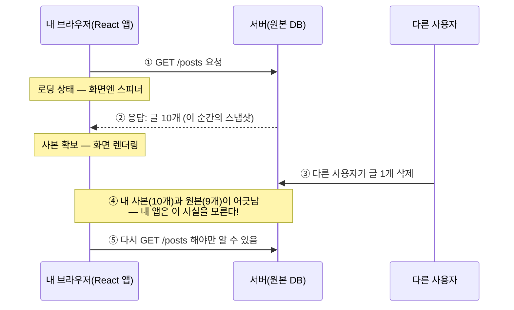
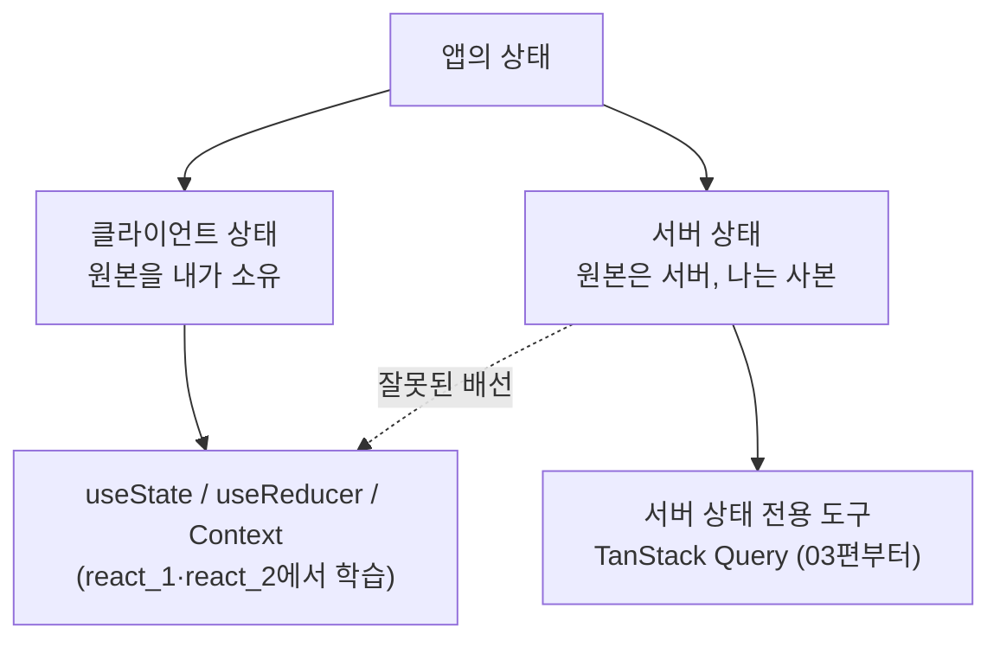

<Callout type="info">
  **이번 문서의 목표:** 앱의 상태를 "서버 상태"와 "클라이언트 상태"로 구분하는 눈을 갖고, 서버 상태를 `useState`나 전역 스토어로 다루면 왜 반드시 깨지는지 — 정합성·동기화 문제를 원리부터 설명할 수 있게 된다. 이 관점은 03편부터 배울 TanStack Query의 존재 이유 그 자체다.
</Callout>

## 왜 실무 과목의 첫 편이 "상태 구분"인가

react_1과 react_2에서 우리는 `useState`로 상태를 만들고, 끌어올리고, Context로 공유하는 법까지 배웠습니다. 그런데 실무 코드를 열어보면 이상한 점이 눈에 띕니다 — 상태의 절반 이상이 **내가 만든 값이 아니라 서버에서 받아온 데이터**라는 사실입니다. 게시글 목록, 사용자 프로필, 장바구니, 알림 개수… 전부 서버가 원본을 가지고 있고, 내 앱은 그 **복사본**을 잠시 들고 있을 뿐입니다.

여기서 실무의 첫 번째 함정이 생깁니다. 많은 개발자가 이 복사본을 `useState`나 Redux 같은 전역 스토어(global store, 앱 어디서든 접근하는 상태 저장소)에 넣고, 자기가 만든 상태처럼 다룹니다. 처음엔 잘 돌아갑니다. 그러다 어느 날 이런 버그 리포트가 날아옵니다.

- "목록에서는 제목이 바뀌었는데, 상세 화면엔 옛날 제목이 그대로예요."
- "다른 탭에서 삭제한 글이 이 탭에는 아직 보여요."
- "새로고침하면 맞는데, 화면 이동만 하면 데이터가 옛날 거예요."

이 버그들의 공통 원인은 코드 실수가 아니라 **상태의 성격을 오판한 것**입니다. 서버 상태는 클라이언트 상태와 태생이 다르고, 다른 도구로 다뤄야 합니다. 이 편에서 그 "다름"을 끝까지 파고듭니다.

## 1. 상태에도 종류가 있다 — 클라이언트 상태 vs 서버 상태

### 용어부터

- **클라이언트 상태**(client state): 브라우저 안에서 태어나 브라우저 안에서 죽는 상태. 모달이 열렸는지, 다크 모드인지, 입력창에 뭘 치고 있는지 같은 것들. **원본이 내 앱 메모리에 있습니다.**
- **서버 상태**(server state): 원본이 **원격 서버의 데이터베이스에** 있는 상태. 내 앱이 들고 있는 것은 특정 시점에 요청해서 받아온 **스냅샷**(snapshot, 순간 포착 사본)일 뿐입니다.

> **쉽게 말하면:** 클라이언트 상태는 내 수첩에 적은 메모이고, 서버 상태는 도서관 책을 복사해 온 프린트물입니다. 메모는 내가 원본이니 마음대로 고치면 끝이지만, 프린트물은 도서관에서 책이 개정되는 순간 낡은 정보가 됩니다.

### 두 상태의 성격 비교

| 구분 | 클라이언트 상태 | 서버 상태 |
|------|----------------|-----------|
| 원본 위치 | 내 앱 메모리 | 원격 서버의 DB |
| 소유권 | 나(이 브라우저 탭) 혼자 소유 | 여러 사용자·여러 탭이 **공유** |
| 접근 방식 | 동기(즉시 읽고 쓰기 가능) | 비동기(네트워크 요청 필요, 실패 가능) |
| 최신성 보장 | 항상 최신(내가 바꾸는 게 전부) | **모르는 사이에 낡을 수 있음** |
| 변경 주체 | 나의 코드만 | 다른 사용자, 관리자, 배치 작업, 다른 탭… |
| 대표 예시 | 모달 열림 여부, 선택된 탭, 입력 중인 값 | 게시글 목록, 프로필, 재고 수량, 댓글 |

이 표에서 가장 중요한 두 칸은 "**공유**"와 "**모르는 사이에 낡을 수 있음**"입니다. 서버 상태는 내가 안 건드려도 변합니다. 다른 사용자가 댓글을 달고, 관리자가 글을 내리고, 재고가 팔려나갑니다. 즉 내 앱이 들고 있는 사본은 받아온 그 순간부터 **낡기 시작**합니다. 이렇게 원본보다 뒤처진 데이터를 **스테일**(stale, 신선하지 않은·낡은) 데이터라고 부릅니다. 이 단어는 이 과목 내내 등장하니 여기서 확실히 익혀둡시다 — 빵이 갓 구운 상태를 fresh, 시간이 지나 눅눅해진 상태를 stale이라고 하는 그 단어입니다.

### 왜 "비동기"가 문제를 키우는가

클라이언트 상태는 `setState` 한 줄이면 즉시 바뀝니다. 반면 서버 상태를 읽으려면 네트워크 요청이라는 **시간이 걸리고 실패할 수 있는 작업**을 거쳐야 합니다. 그래서 서버 상태에는 클라이언트 상태에 없던 부수 상태가 줄줄이 따라붙습니다.

- **로딩**(loading): 요청을 보냈고 아직 응답 전 — 화면에 뭘 보여줄 것인가?
- **에러**(error): 요청이 실패했다 — 어떻게 알리고 재시도할 것인가?
- **빈 데이터**(empty): 성공했지만 결과가 0건 — 에러와는 다르게 보여줘야 한다 (구분 기준은 02편에서 깊게 다룹니다)
- **낡음**(stale): 성공했고 데이터도 있지만 이미 옛날 것일 수 있다 — 언제 다시 받아올 것인가?

서버 상태 하나를 제대로 다루려면 이 네 가지를 전부 설계해야 합니다. `useState` 하나로 될 일이 아니라는 감이 오기 시작하죠.

## 2. 요청-응답 라이프사이클 — 사본이 낡아가는 과정

서버 상태가 왜 필연적으로 낡는지, 데이터가 오가는 전체 흐름을 시간 순으로 따라가 봅시다. 이 흐름을 **요청-응답 라이프사이클**(request-response lifecycle)이라고 부릅니다.



핵심은 ④번입니다. 서버는 데이터가 바뀌었다고 내 브라우저에 **먼저 알려주지 않습니다**. HTTP는 기본적으로 클라이언트가 물어봐야 답하는 **요청-응답 모델**이기 때문입니다(서버가 먼저 밀어주는 WebSocket 같은 기술도 있지만, 대부분의 REST API는 물어봐야 압니다). 그래서 내 사본이 낡았는지 아닌지를 아는 유일한 방법은 **다시 요청해 보는 것**뿐입니다.

여기서 서버 상태 관리의 근본 딜레마가 나옵니다.

- 자주 다시 요청하면 → 데이터는 신선하지만, 네트워크 낭비 + 서버 부하 + 화면 깜빡임
- 가끔 요청하면 → 효율적이지만, 낡은 데이터를 보여주는 시간이 길어짐

이 딜레마를 푸는 표준 도구가 바로 **캐시**입니다.

## 3. 캐시 — 낡음을 관리하는 기술

### 캐시란 무엇인가

**캐시**(cache, 캐시)는 "한 번 가져온 데이터를 가까운 곳에 보관해 두고 재사용하는 저장소"입니다. 어원은 프랑스어 cacher(숨기다)에서 왔고, 컴퓨터 과학 전반 — CPU 캐시, 브라우저 캐시, CDN 캐시 — 에서 같은 뜻으로 쓰입니다.

> **쉽게 말하면:** 캐시는 집 앞 편의점입니다. 물건의 원산지(서버)는 멀지만, 자주 쓰는 물건을 가까운 편의점(캐시)에 두면 매번 산지까지 갈 필요가 없습니다. 대신 편의점 물건에는 **유통기한**이 필요하죠 — 그게 신선도 관리입니다.

캐시를 쓰면 아까의 딜레마가 이렇게 재구성됩니다.

1. 처음 요청한 데이터를 캐시에 보관한다.
2. 같은 데이터가 또 필요하면 **일단 캐시의 것을 즉시 보여준다** — 화면이 바로 뜬다.
3. 그리고 뒤에서 조용히 서버에 다시 물어봐서, 바뀌었으면 화면을 갱신한다.

이 3단계 전략을 **stale-while-revalidate**(스테일-와일-리밸리데이트, "낡은 것을 보여주는 동안 재검증한다")라고 부릅니다. 사용자는 기다림 없이 화면을 보고, 데이터는 곧 최신으로 따라잡습니다. TanStack Query의 핵심 동작 원리가 정확히 이것인데, 구체적인 옵션(`staleTime`, `gcTime`)과 갱신 시점 설계는 03편에서 다룹니다.

### 캐시에는 "신원"이 필요하다

편의점 선반에는 상품마다 바코드가 붙어 있습니다. 캐시도 마찬가지로, 보관한 데이터 조각마다 **이 데이터가 무엇인지 식별하는 키**(key)가 필요합니다. "글 목록 전체"와 "3번 글 상세"는 다른 키를 가져야 서로 덮어쓰지 않고, 같은 키로 두 번 요청하면 캐시에서 재사용할 수 있습니다. 이 키 설계가 서버 상태 관리의 반 이상을 차지하는데, TanStack Query에서는 이를 **query key**라고 부릅니다 — 자세한 내용은 03편에서 다룹니다.

## 4. 전역 스토어에 서버 상태를 넣으면 무너지는 이유

"그럼 서버에서 받은 데이터를 Redux 같은 전역 스토어에 넣어두면 캐시 아닌가?" — 실제로 오랫동안 업계가 그렇게 해왔고, 그래서 그 한계도 뼈저리게 검증됐습니다. 하나씩 봅시다.

### 문제 1 — 정합성: 같은 데이터의 사본이 여러 개 생긴다

**정합성**(consistency, 컨시스턴시)이란 "같은 것을 가리키는 데이터들이 서로 어긋나지 않는 성질"입니다. 목록 화면은 `posts` 배열을, 상세 화면은 `currentPost` 객체를 따로 스토어에 저장했다고 합시다. 사용자가 상세 화면에서 제목을 수정하면 — `currentPost`는 갱신했는데 `posts` 배열 속 같은 글은? 개발자가 **직접 찾아서 같이 고쳐야** 합니다. 잊는 순간, 서두에 나온 "목록엔 옛 제목, 상세엔 새 제목" 버그가 태어납니다.

원인은 구조 자체에 있습니다. 전역 스토어는 "무엇이 같은 데이터인지"를 모릅니다. 개발자가 상태 모양을 설계하는 순간 사본이 몇 개가 생기는지, 그 사본들을 누가 동기화하는지는 전부 사람 손에 맡겨집니다.

### 문제 2 — 동기화: 낡음을 아무도 관리하지 않는다

스토어에 넣은 데이터에는 **유통기한이 없습니다**. 언제 받아왔는지, 얼마나 낡았는지, 언제 다시 받아와야 하는지를 스토어는 전혀 모릅니다. 그래서 이런 코드가 앱 곳곳에 자라납니다.

```js
// 화면에 들어올 때마다 무조건 다시 요청? 낭비 + 깜빡임
useEffect(() => {
  dispatch(fetchPosts());
}, []);

// 아니면 "있으면 스킵"? 낡은 데이터를 영원히 보여줄 위험
useEffect(() => {
  if (posts.length === 0) dispatch(fetchPosts());
}, []);
```

두 번째 패턴이 특히 위험합니다. "데이터가 있다"와 "데이터가 신선하다"는 완전히 다른 명제인데, 길이 검사로는 신선도를 알 수 없기 때문입니다. 다른 탭에서 글을 삭제해도, 서버에서 글이 추가돼도, `posts.length`는 0이 아니므로 영원히 재요청하지 않습니다.

### 문제 3 — 보일러플레이트: 요청 하나에 상태 셋

서버 요청 하나를 스토어로 다루려면 관례적으로 로딩·성공·실패 세 갈래를 전부 수작업으로 만들어야 합니다. 아래는 전역 스토어 없이 `useState`만으로 같은 일을 한 코드인데, 스토어를 쓰든 안 쓰든 **이 구조 자체가 반복**됩니다. 직접 실행해 보세요 — 그리고 이 컴포넌트가 앱에 화면 수만큼 복제된다고 상상해 보세요.

<CodePlayground
  template="react"
  activeFile="/App.js"
  showConsole
  label="서버 상태를 수동으로 관리하면 — 요청 하나에 상태 3개 + 함정 2개"
  files={{
    '/App.js': `import { useState, useEffect } from "react";

// 가짜 서버: 1초 후 응답, 3번에 1번꼴로 실패
function fakeFetchPosts() {
  return new Promise((resolve, reject) => {
    setTimeout(() => {
      if (Math.random() < 0.33) {
        reject(new Error("서버 오류(임의 실패)"));
      } else {
        resolve([
          { id: 1, title: "첫 번째 글" },
          { id: 2, title: "두 번째 글" },
        ]);
      }
    }, 1000);
  });
}

export default function App() {
  const [posts, setPosts] = useState([]);      // 상태 1: 데이터 사본
  const [isLoading, setIsLoading] = useState(false); // 상태 2: 로딩
  const [error, setError] = useState(null);    // 상태 3: 에러

  const load = () => {
    setIsLoading(true);
    setError(null);
    fakeFetchPosts()
      .then((data) => setPosts(data))
      .catch((err) => setError(err.message))
      .finally(() => setIsLoading(false));
  };

  useEffect(() => {
    load();
    // 함정 1: 컴포넌트가 언마운트된 뒤 setState가 실행될 수 있다(경쟁 조건)
    // 함정 2: 이 데이터가 언제 낡는지 아무도 모른다 — 유통기한 없음
  }, []);

  if (isLoading) return <p>불러오는 중…</p>;
  if (error) return (
    <div>
      <p>문제가 생겼어요: {error}</p>
      <button onClick={load}>다시 시도</button>
    </div>
  );
  if (posts.length === 0) return <p>글이 없습니다.</p>;

  return (
    <ul>
      {posts.map((post) => <li key={post.id}>{post.title}</li>)}
    </ul>
  );
}`,
  }}
/>

이 짧은 예제에도 이미 상태 3개, 분기 4개(로딩/에러/빈/정상)가 들어갔습니다. 그런데 아직 시작도 안 한 것들이 남아 있습니다 — 재시도 횟수 제한, 같은 데이터를 쓰는 두 컴포넌트의 **요청 중복 제거**(deduplication, 디듀플리케이션: 동시에 같은 요청이 여러 번 나가지 않게 하나로 합치는 것), 탭을 벗어났다 돌아왔을 때의 자동 갱신, 언마운트 후 응답이 도착하는 **경쟁 조건**(race condition: 비동기 작업들의 완료 순서가 뒤바뀌며 생기는 버그) 처리… 이걸 화면마다 손으로 짜는 것이 전역 스토어 + 수동 fetch 시대의 일상이었습니다.

### 정리 — 도구가 아니라 "책임"의 문제

오해하지 말아야 할 점: Redux가 나쁜 도구라는 이야기가 아닙니다. Redux는 **클라이언트 상태**(내가 원본을 소유한 상태)를 예측 가능하게 다루는 훌륭한 도구입니다. 문제는 서버 상태가 요구하는 책임 — 신선도 추적, 자동 재검증, 중복 제거, 캐시 키 관리 — 이 전역 스토어의 설계 목표에 아예 없다는 점입니다. 망치가 나빠서가 아니라, 나사를 망치로 박고 있었던 겁니다.



그래서 실무의 결론은 명확합니다 — **상태를 성격대로 분리하고, 서버 상태는 전용 도구에 맡긴다.** 그 전용 도구가 캐시·신선도·재검증·중복 제거를 전부 대신 맡아주며, React 생태계의 사실상 표준이 TanStack Query(구 React Query)입니다. 본격적인 사용법은 03편에서 시작하고, 그 전에 02편에서 서버가 보내오는 응답과 에러의 구조부터 읽는 법을 익힙니다 — 도구가 아무리 좋아도 서버의 말을 못 알아들으면 소용없으니까요.

## 5. 실전 감각 — 이 상태는 어느 쪽인가

구분 감각을 기르는 연습을 해봅시다. 판단 기준은 단 하나 — **"원본이 어디 있고, 나 말고 누가 바꿀 수 있는가?"**

| 상태 | 판정 | 근거 |
|------|------|------|
| 드롭다운 열림 여부 | 클라이언트 | 원본이 내 메모리, 나만 바꿈 |
| 로그인한 사용자의 프로필 | 서버 | 원본은 DB — 다른 기기에서 수정 가능 |
| 장바구니(로그인 사용자) | 서버 | 다른 탭·앱과 공유, 서버가 원본 |
| 다크 모드 설정(이 기기만) | 클라이언트 | 이 브라우저에만 존재 |
| 검색창에 입력 중인 검색어 | 클라이언트 | 아직 서버로 안 보낸 내 입력 |
| 그 검색어의 **검색 결과** | 서버 | 원본은 서버의 데이터·색인 |
| 폼에서 작성 중인 게시글 초안 | 클라이언트 | 제출 전까지는 내 것 |
| 제출 후 저장된 그 게시글 | 서버 | 제출 순간 소유권이 서버로 넘어감 |

마지막 두 줄이 특히 흥미롭습니다. **같은 데이터도 시점에 따라 소속이 바뀝니다.** 작성 중인 초안은 클라이언트 상태(폼 상태 — 06편에서 react-hook-form으로 다룹니다)지만, 제출되어 서버에 저장되는 순간부터는 서버 상태가 됩니다. 그래서 실무 앱의 상태 설계는 "폼 도구 + 서버 상태 도구"의 조합이 되고, 그게 바로 이 과목의 커리큘럼 순서입니다.

<Callout type="warning">
  **자주 틀리는 점:** "전역으로 공유하니까 전역 스토어에 넣어야지"라는 판단은 기준이 틀렸습니다. 공유 범위(지역/전역)와 상태 성격(클라이언트/서버)은 **별개의 축**입니다. 서버 상태는 앱 전체에서 공유되더라도 전역 스토어가 아니라 서버 상태 도구의 캐시에 두는 것이 정답입니다 — 캐시 자체가 이미 앱 전역에서 접근 가능한 공유 저장소이기 때문입니다.
</Callout>

## 핵심 정리

- 상태는 **원본의 위치**로 나뉜다: 클라이언트 상태는 내 메모리가 원본, 서버 상태는 서버 DB가 원본이고 내가 가진 건 스냅샷 사본이다.
- 서버 상태는 **공유·비동기·소유권 없음**이 본질 — 받아온 순간부터 낡기 시작하며(stale), 낡았는지는 다시 요청해야만 알 수 있다.
- 신선도와 효율의 딜레마를 푸는 표준 답이 **캐시**이고, "일단 캐시를 보여주고 뒤에서 재검증"하는 stale-while-revalidate가 핵심 전략이다.
- 전역 스토어에 서버 상태를 넣으면 **정합성**(사본 간 어긋남)·**동기화**(유통기한 부재)·**보일러플레이트**(요청마다 상태 3종) 문제가 구조적으로 발생한다.
- 판단 기준은 하나 — "원본이 어디 있고, 나 말고 누가 바꿀 수 있는가?" 서버 상태는 전용 도구(TanStack Query, 03편)에 맡긴다.

## 마무리 복습

<Quiz
  questionNumber={1}
  question="서버 상태의 특징으로 옳지 않은 것은?"
  options={['원본이 원격 서버에 있다', '여러 사용자와 공유될 수 있다', '내 코드만이 값을 변경할 수 있다', '가져오려면 비동기 요청이 필요하다']}
  correctAnswer={3}
  explanation="서버 상태는 다른 사용자·관리자·배치 작업 등 내가 모르는 주체가 언제든 바꿀 수 있다. 그래서 내 사본이 모르는 사이에 낡는 것이며, 이것이 클라이언트 상태와의 결정적 차이다."
  optionExplanations={['맞는 설명 — 원본은 서버 DB에 있고 내 앱은 사본을 가진다', '맞는 설명 — 여러 탭과 사용자가 같은 원본을 공유한다', '정답(틀린 설명) — 다른 사용자와 시스템도 원본을 바꿀 수 있다', '맞는 설명 — 네트워크 요청이 필요하며 실패할 수도 있다']}
/>

<Quiz
  questionNumber={2}
  question="스테일(stale) 데이터란 무엇인가?"
  options={['네트워크 오류로 받지 못한 데이터', '서버의 원본보다 뒤처졌을 수 있는 낡은 사본', '형식이 잘못되어 파싱에 실패한 데이터', '캐시 용량 초과로 삭제된 데이터']}
  correctAnswer={2}
  explanation="stale은 받아온 이후 시간이 지나 서버 원본과 어긋났을 가능성이 있는 낡은 사본을 뜻한다. 실제로 어긋났는지는 다시 요청해 봐야만 알 수 있다는 점이 핵심이다."
  optionExplanations={['그것은 에러 상태에 해당한다', '정답 — 신선하지 않은 사본이라는 뜻으로, 이 과목 전체의 핵심 용어다', '파싱 실패는 데이터 형식 문제로 stale과 무관하다', '캐시에서 제거된 데이터는 stale이 아니라 아예 없는 데이터다']}
/>

<Quiz
  questionNumber={3}
  question="stale-while-revalidate 전략을 가장 잘 설명한 것은?"
  options={['데이터가 낡으면 화면을 비우고 다시 받아온다', '캐시된 데이터를 즉시 보여주면서 뒤에서 서버에 재검증 요청을 보낸다', '서버가 데이터 변경을 실시간으로 브라우저에 밀어준다', '요청이 실패하면 자동으로 세 번 재시도한다']}
  correctAnswer={2}
  explanation="stale-while-revalidate는 낡았을 수 있는 캐시를 일단 즉시 보여주어 기다림을 없애고, 백그라운드에서 다시 요청해 바뀐 부분만 갱신하는 전략이다. 신선도와 사용자 경험을 동시에 잡는다."
  optionExplanations={['화면을 비우면 사용자가 기다려야 하므로 이 전략의 취지와 반대다', '정답 — 낡은 것을 보여주는 동안 재검증한다는 이름 그대로다', '그것은 WebSocket 같은 푸시 방식의 설명이다', '재시도는 별개의 에러 처리 기능이다']}
/>

<Quiz
  questionNumber={4}
  question="전역 스토어에 서버 데이터를 넣었을 때 발생하는 정합성 문제의 원인은?"
  options={['전역 스토어는 비동기 작업을 실행할 수 없기 때문', '같은 데이터의 사본이 여러 곳에 생겨도 스토어가 이를 알지 못해 동기화가 사람 손에 맡겨지기 때문', '전역 스토어는 배열을 저장할 수 없기 때문', '전역 스토어의 데이터는 새로고침하면 사라지기 때문']}
  correctAnswer={2}
  explanation="목록용 배열과 상세용 객체처럼 같은 원본의 사본이 여러 슬롯에 저장되어도 스토어는 무엇이 같은 데이터인지 모른다. 한쪽만 갱신하면 화면 간 데이터가 어긋나는 정합성 버그가 된다."
  optionExplanations={['미들웨어 등으로 비동기 처리는 가능하다 — 문제의 본질이 아니다', '정답 — 사본 관리 책임이 전부 개발자에게 넘어오는 구조가 원인이다', '배열 저장은 당연히 가능하다', '휘발성은 사실이지만 정합성 문제의 원인은 아니다']}
/>

<Quiz
  questionNumber={5}
  question="다음 중 클라이언트 상태로 분류해야 하는 것은?"
  options={['다른 기기에서도 보여야 하는 사용자 프로필', '검색창에 아직 제출하지 않고 입력 중인 검색어', '검색 버튼을 눌러 받아온 검색 결과 목록', '서버에 저장된 장바구니 내역']}
  correctAnswer={2}
  explanation="입력 중인 검색어는 아직 서버로 보내지 않은, 내 브라우저에만 존재하는 값이므로 클라이언트 상태다. 원본이 어디 있고 나 말고 누가 바꿀 수 있는가를 기준으로 판단한다."
  optionExplanations={['프로필의 원본은 서버 DB에 있으므로 서버 상태다', '정답 — 제출 전까지 원본은 내 메모리에만 있다', '검색 결과의 원본은 서버의 데이터와 색인이므로 서버 상태다', '서버에 저장된 장바구니는 다른 탭과 공유되는 서버 상태다']}
/>

<Quiz
  questionNumber={6}
  question="서버 상태를 useState와 useEffect만으로 관리할 때 생기는 문제가 아닌 것은?"
  options={['요청마다 로딩·에러·데이터 상태를 반복해서 만들어야 한다', '데이터의 유통기한을 아무도 추적하지 않는다', '같은 데이터를 쓰는 컴포넌트끼리 요청이 중복될 수 있다', 'JSX 문법을 사용할 수 없게 된다']}
  correctAnswer={4}
  explanation="수동 관리의 문제는 보일러플레이트 반복, 신선도 추적 부재, 요청 중복, 경쟁 조건 등이다. JSX 사용 여부는 상태 관리 방식과 아무 관련이 없다."
  optionExplanations={['실제 문제다 — 요청 하나에 상태 3종이 화면마다 복제된다', '실제 문제다 — 언제 낡는지 모르니 재요청 시점을 정할 근거가 없다', '실제 문제다 — 중복 제거는 수동 구현이 매우 번거롭다', '정답(문제가 아님) — JSX와 상태 관리 방식은 무관하다']}
/>

<Quiz
  questionNumber={7}
  question="상태를 어디에 둘지 판단하는 가장 올바른 기준은?"
  options={['앱 전체에서 공유되면 무조건 전역 스토어에 둔다', '데이터 크기가 크면 서버 상태로 취급한다', '원본이 어디 있고 나 말고 누가 바꿀 수 있는지를 본다', '자주 바뀌는 값이면 클라이언트 상태로 취급한다']}
  correctAnswer={3}
  explanation="공유 범위나 크기, 변경 빈도가 아니라 원본의 위치와 소유권이 기준이다. 원본이 서버에 있고 다른 주체가 바꿀 수 있다면 서버 상태이며, 전역에서 공유되더라도 서버 상태 도구의 캐시에 두는 것이 맞다."
  optionExplanations={['공유 범위와 상태 성격은 별개의 축이다 — 서버 상태는 캐시가 전역 공유를 담당한다', '크기는 분류 기준이 아니다', '정답 — 원본 위치와 소유권이 유일한 판단 기준이다', '변경 빈도 역시 분류 기준이 아니다 — 서버 상태도 자주 바뀔 수 있다']}
/>

## 참고 자료

- [TanStack Query 공식 문서 - Overview (서버 상태의 정의와 도전 과제)](https://tanstack.com/query/latest/docs/framework/react/overview)
- [MDN - HTTP 개요 (요청-응답 모델)](https://developer.mozilla.org/ko/docs/Web/HTTP/Overview)
- [MDN - HTTP 캐싱](https://developer.mozilla.org/ko/docs/Web/HTTP/Caching)
